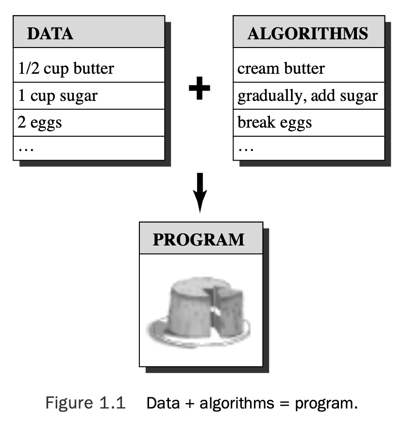
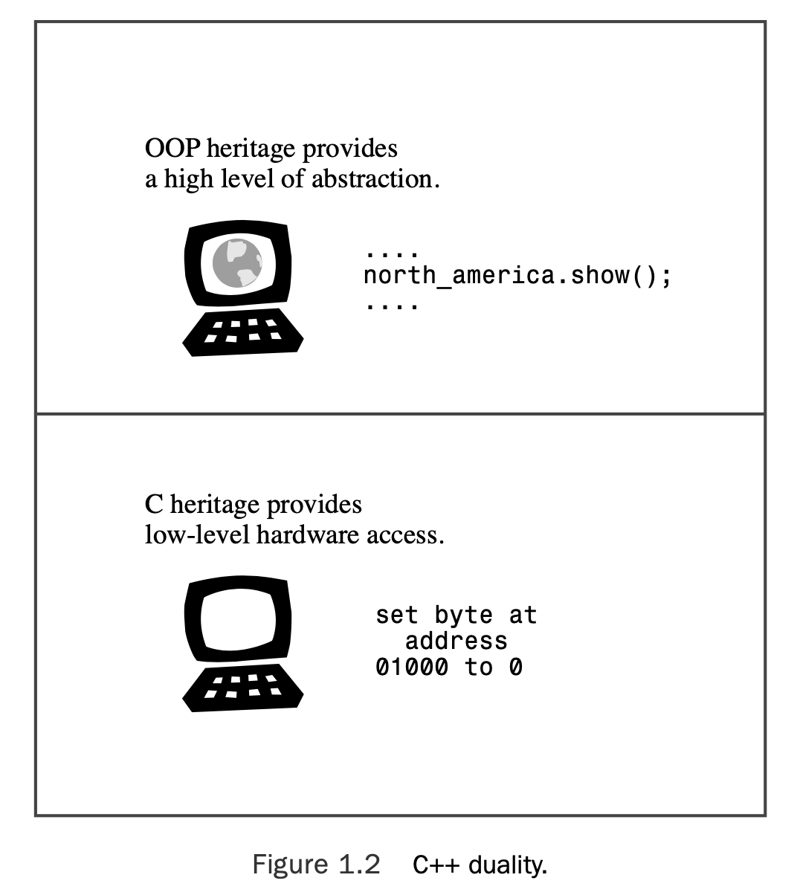
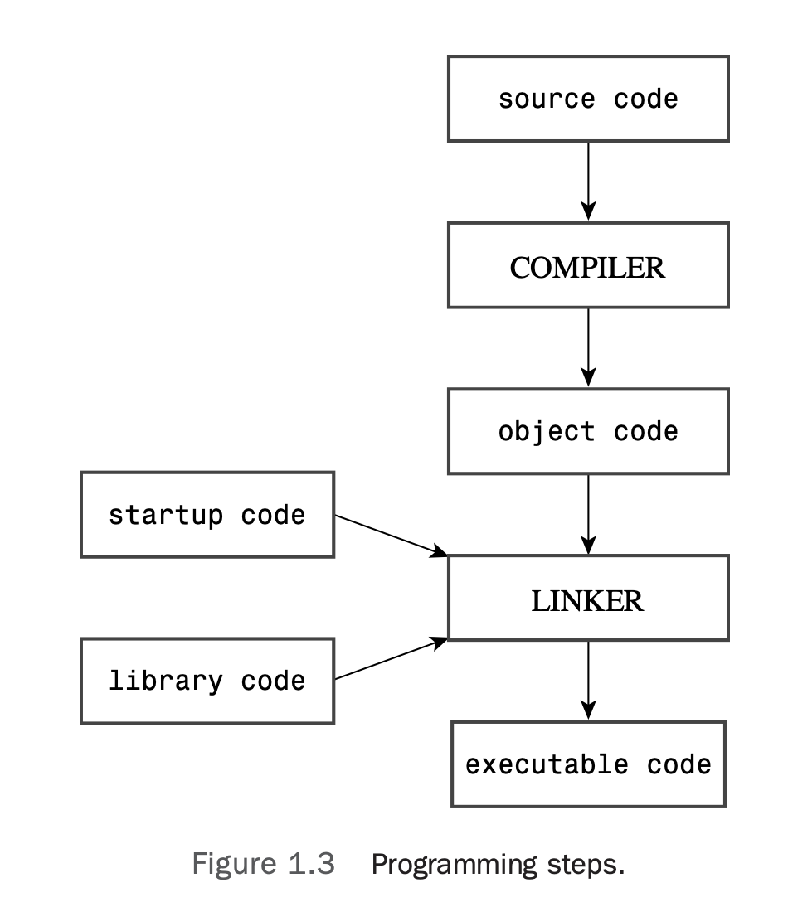
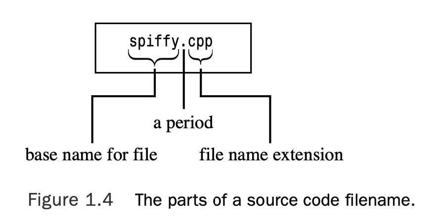

# Chapter 1 Getting Started with C++

[TOC]

## Learning C++: What Lies Before You

C++ joins three separate programming categories: 
* the procedural language, represented by **C**;
* the object-oriented language, represented by the **class enhancements C++** adds to C;
* and generic programming, supported by **C++ templates**.

## The Origins of C++: A Little History

In the 1970s, languages such as C and Pascal helped usher in an era of structured pro- gramming.

Besides providing the tools for structured programming, C also **produced compact, fast-running programs, along with the ability to address hardware matters**, such as managing communication ports and disk drives.These gifts helped make C the dominant programming language in the 1980s.

Meanwhile, the 1980s witnessed the growth of a new programming paradigm: object-oriented programming, or OOP, as embodied in languages such as SmallTalk and C++. 

### The C Language

In the early 1970s, **Dennis Ritchie** of Bell Laboratories was working on a project to develop the Unix operating system. Ritchie needed a language that was **concise, that produced compact, fast pro- grams, and that could control hardware efficiently.**

Traditionally, programmers met these needs by using assembly language, which is closely tied to a computer’s internal machine language. However, assembly language is a **low-level** language. So if you want to move an assembly program to a different kind of computer, you may have to completely rewrite the program, using a different assembly language.

But Unix was intended to work on a variety of computer types (or platforms).That suggested using a **high-level** language.A high-level language is oriented toward problem solving instead of toward specific hardware. Special programs called **compilers** translate a high-level language to the internal language of a particular computer.

Ritchie wanted a language that combined low-level efficiency and hardware access with high-level generality and portability. So building from older languages, he created C.

### C Programming Philosophy

In general, computer languages deal with two concepts—**data and algorithms**.

* The **data** constitutes the information a program uses and processes.
* The **algorithms** are the methods the program uses (see Figure 1.1).

Like most mainstream languages when C was created, C is a **procedural** language.That means it emphasizes the **algorithm side** of programming. Conceptually, procedural programming consists of figuring out the actions a computer should take and then using the program- ming language to implement those actions.

Programs often use branching statements, which route execution to one or another set of instructions, depending on the result of some sort of test. Many older programs had such tangled routing (called “spaghetti pro- gramming”) that it was virtually impossible to understand a program by reading it, and modifying such a program was an invitation to disaster.In response, computer scientists developed a more disciplined style of programming called **structured programming**. C incorporates these constructions (the `for` loop, the `while `loop, the `do while` loop, and the `if else` statement) into its vocabulary.

**Top-down** design was another of the new principles.With C, the idea is to break a large program into smaller, more manageable tasks. C’s design facilitates this approach, encouraging you to develop program units called *functions* to represent individual task modules.

The structured programming techniques reflect a procedural mind-set, thinking of a program in terms of the actions it performs.

### The C++ Shift: Object-Oriented Programming

Unlike procedural programming, which empha- sizes algorithms, OOP emphasizes the data. Rather than try to fit a problem to the proce- dural approach of a language, OOP attempts to fit the language to the problem.The idea is to design data forms that correspond to the essential features of a problem.

 In general, a class defines what data is used to represent an object *and* the operations that can be per- formed on that data.

The process of going from a lower level of organization, such as classes, to a higher level, such as program design, is called **bottom-up** programming.

* OOP facilitates creating **reusable code**, and that can eventually save a lot of work. 
* Information hiding safeguards data from improper access. 
* Polymorphism lets you create multiple definitions for operators and functions, with the programming context determining which definition is used. 
* Inheritance lets you derive new classes from old ones. 

### C++ and Generic Programming

It shares with OOP the aim of making it simpler to reuse code and the technique of abstracting general concepts. But whereas 

* OOP emphasizes the data aspect of programming, generic programming emphasizes independence from a particular data type.

* OOP is a tool for managing large projects, whereas generic programming provides tools for performing common tasks, such as sorting data or merging lists.

Generic programming involves extending the language so that you can write a function for a generic (that is, an unspecified) type once and use it for a variety of actual types. C++ templates provide a mechanism for doing that.

### The Genesis of C++

> “C++ was designed primarily so that my friends and I would not have to program in assembler, C, or various modern high-level languages. Its main purpose was to make writing good programs easier and more pleasant for the individual programmer” (Bjarne Stroustrup, *The C++ Programming Language*,Third Edition. Reading, MA: Addison-Wesley, 1997).

The name *C++* comes from the C increment operator ++, which adds one to the value of a variable.Therefore, the name C++ correctly suggests an augmented version of C.

The OOP aspect of C++ gives the language the ability to relate to con- cepts involved in the problem, and the C part of C++ gives the language the ability to get close to the hardware (see Figure 1.2).

The fact that C++ incorporates both OOP and generic programming, as well as the more traditional procedural approach, demonstrates that C++ emphasizes the utilitarian over the ideological approach, and that is one of the reasons for the language’s success.

## Portability and Standards

If you can recompile the program without making changes and it runs without a hitch, we say the program is **portable**.

There are a couple obstacles to portability,the first of which is hardware.
* A program that is hardware specific is not likely to be portable. 
* The second obstacle to portability is language divergence. Certainly, that can be a prob- lem with spoken languages. Computer languages, too, can develop dialects.

Several years of work eventually led to **the International Standard (ISO/IEC 14882:1998)**, which was adopted in 1998 by the ISO, the International Electrotechnical Commission (IEC), and ANSI.This standard, often called C++98, not only refined the description of existing C++ features but also extended the language with **exceptions, run- time type identification (RTTI), templates, and the Standard Template Library (STL)**.

C++ continues to evolve, and the ISO committee approved a new standard August 2011 titled ISO/IEC 14882:2011 and informally dubbed C++11. In addition, it has the goals of removing inconsisten- cies and of making C++ easier to learn and use.

Prior to the emergence of ANSI C, the C community followed a **de facto standard** based on the book *The C Programming Language*, by Kernighan and Ritchie (Addison-Wesley Publishing Company, Reading, MA, 1978).

### Language Growth

Originally, the de facto standard for C++ was a 65-page reference manual included in the 328-page *The C++ Programming Language*, by Stroustrup (Addison-Wesley, 1986).

The next major published de facto standard was *The Annotated C++ Reference Manual*, by Ellis and Stroustrup (Addison-Wesley, 1990).This is a 453-page work; it includes sub- stantial commentary in addition to reference material.

The C++98 standard, with the addition of many features, reached nearly 800 pages, even with only minimal commentary.

The C++11 standard is over 1,350 pages long, so it augments the old standard sub- stantially .

### This Book and C++ Standards

Chapter 18,“Visiting with the New C++ Standard,” concentrates on the new features, summariz- ing the ones mentioned earlier in the book and presenting additional features.

This book takes the approach of concentrat- ing on features that are already available on some compilers and briefly summarizing many of the other features.

## The Mechanics of Creating a Program

1. Use a text editor of some sort to write the program and save it in a file.This file constitutes the **source code** for your program.
2. Compile the source code.This means running a program that translates the source code to the internal language, called **machine language**, used by the host computer. The file containing the translated program is the **object code** for your program.
3. Link the object code with additional code. For example, C++ programs normally use **libraries**.A C++ library contains object code for a collection of computer routines, called **functions,** to perform tasks such as displaying information onscreen or calculating the square root of a number. Linking combines your object code with object code for the functions you use and with some standard **startup code** to produce a runtime version of your program.The file containing this final product is called the **executable code**.

### Creating the Source Code File

 Some C++ implementations, such as Microsoft Visual C++, Embarcadero C++ Builder, Apple Xcode, Open Watcom C++, Digital Mars C++, and Freescale CodeWarrior, provide **integrated development environments (IDEs)** that let you man- age all steps of program development, including editing, from one master program.

In naming a source file, you must use the proper **suffix** to identify the file as a C++ file.This not only tells you that the file is C++ source code, it tells the compiler that, too.The suffix consists of a period followed by a character or group of characters called the *extension* (see Figure 1.4).

### Compilation and Linking

Originally, Stroustrup implemented C++ with a C++-to-C compiler program instead of developing a direct C++-to-object code compiler.This program, called **cfront** (for **C front end**), translated C++ source code to C source code, which could then be compiled by a standard C compiler.As C++ has developed and grown in popularity, more and more implementers have turned to creating C++ compilers that generate object code directly from C++ source code.

