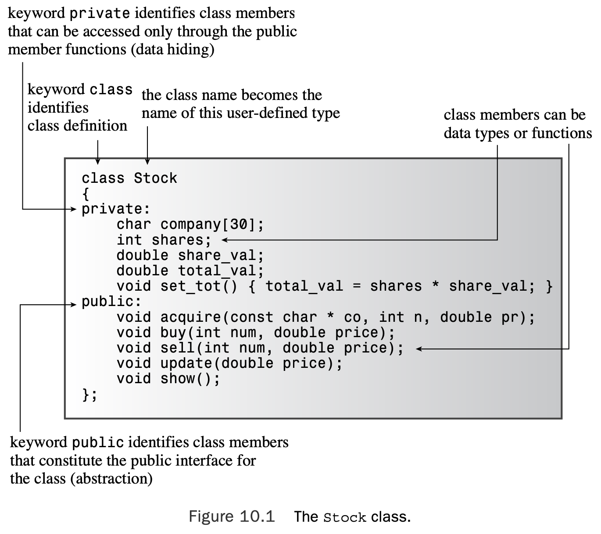
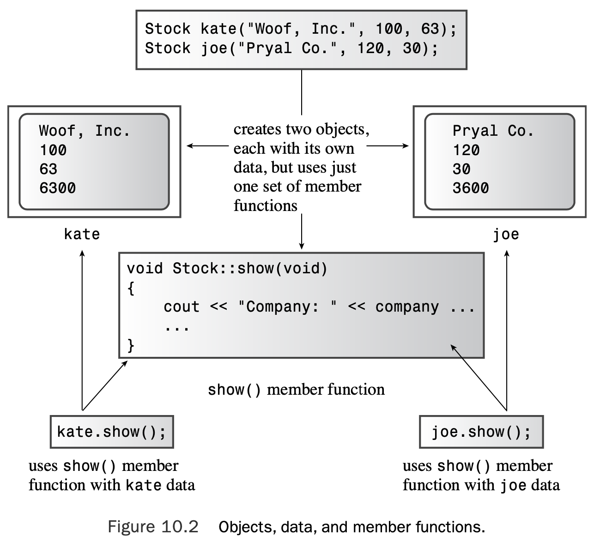
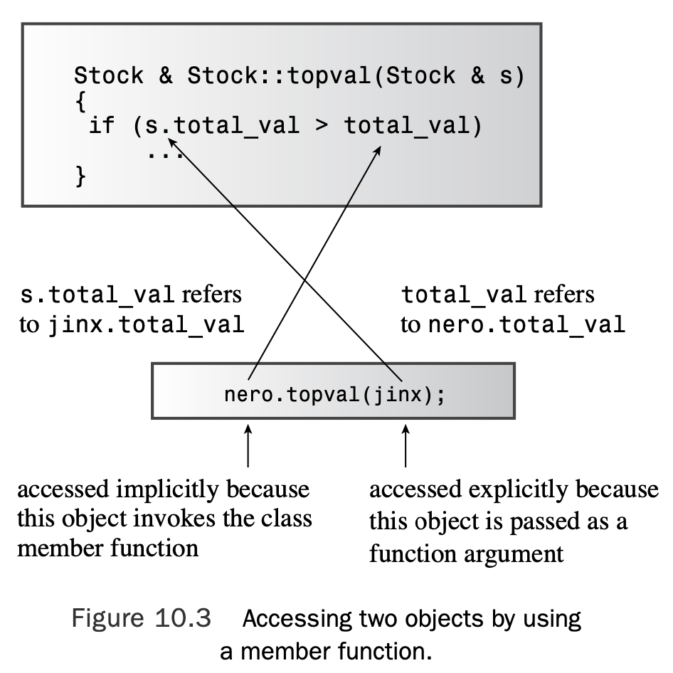
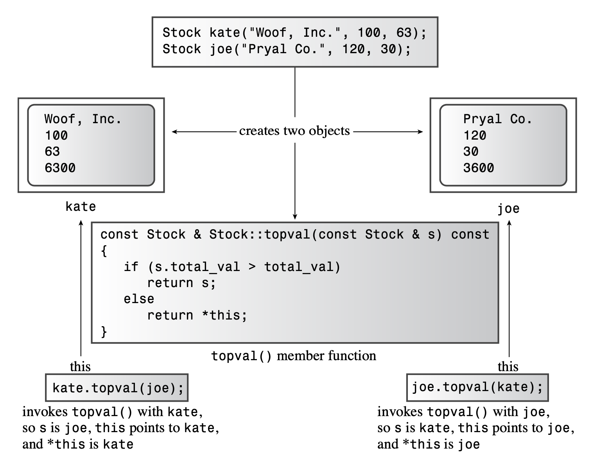

# Chapter 10 Objects and Classes

[TOC]

## Procedural and Object-Oriented Programming

With a procedural approach, you first concentrate on the procedures you will follow and then think about how to represent the data. 

With an OOP approach, you concentrate on the object as the user perceives it, thinking about the data you need to describe the object and the operations that will describe the user’s interaction with the data.

## Abstraction and Classes

In computing, abstraction is the crucial step of representing information in terms of its interface with the user.That is, you abstract the essential operational features of a problem and express a solution in those terms. 

### What Is a Type?

Specifying a basic type does three things:

* It determines how much memory is needed for a data object.
* It determines how the bits in memory are interpreted. (A `long` and a `float` might use the same number of bits in memory, but they are translated into numeric values differently.)
* It determines what operations, or methods, can be performed using the data object.

For built-in types, the information about operations is built in to the compiler. But when you define a user-defined type in C++, you have to provide the same kind of information yourself. 

### Classes in C++

A **class** is a C++ vehicle for translating an abstraction to a user-defined type. It combines data representation and methods for manipulating that data into one neat package. 

Let’s look at a class that represents stocks. You can limit the operations you can per- form to the following:

* Acquire stock in a company.
* Buy more shares of the same stock.
* Sell stock.
* Update the per-share value of a stock.
* Display information about the holdings.

You can use this list to define the public interface for the stock class. To support this interface, you need to store some information. Here’s a list of information to store:

* Name of company
* Number of stocks owned
* Value of each share
* Total value of all shares

Next, you can define the class. Generally, a class specification has two parts:

* A **class declaration**, which describes the data component, in terms of data members,

    and the public interface, in terms of member functions, termed **methods**

* The **class method definitions**, which describe how certain class member functions are

    implemented

```c++
// stock00.h -- Stock class interface 
// version 00
#ifndef STOCK00_H_
#define STOCK00_H_

#include <string>

class Stock // class declaration 
{
private:
    std::string company;
    long shares;
    double share_val;
    double total_val;
    void set_tot() { total_val = shares * share_val; }
public:
    void acquire(const std::string & co, long n, double pr); 
    void buy(long num, double price);
    void sell(long num, double price);
    void update(double price);
    void show();
};      // note semicolon at the end

#endif
```

The syntax identifies Stock as the type name for this new class.This declaration enables you to declare variables, called **objects**, or **instances**, of the Stock type. Each individual object represents a single holding. For example, the following declarations create two Stock objects called `sally` and `solly`:

```c++
Stock sally;
Stock solly;
```

You’ve already seen how the `istream` and `ostream` classes have member functions, such as `get()` and `getline()`.The function prototypes in the `Stock` class declaration demonstrate how member functions are established.The `iostream` header file, for example, has a `getline()` prototype in the `istream` class declaration.

#### Access Control

Also new are the keywords `private` and `public`. These labels describe **access control** for class members.Any program that uses an object of a particular class can access the public portions directly.A program can access the private members of an object **only** by using the public member functions. Thus, the public member functions act as go-betweens between a program and an object’s private members; they provide the interface between object and program. This insulation of data from direct access by a program is called **data hiding**. 



A class design attempts to separate the public interface from the specifics of the implementation.The public interface represents the abstraction component of the design. Gathering the implementation details together and separating them from the abstraction is called **encapsulation**. 

The principle is to separate the details of the implementation from the design of the interface. If you later find a better way to implement the data representation or the details of the member functions, you can change those details without changing the program interface, and that makes programs much easier to maintain.

#### Member Access Control: Public or Private?

The member functions that constitute the class interface go into the public section; otherwise, you can’t call those functions from a program. As the Stock declaration shows, you can also put member functions in the private section.You can’t call such functions directly from a pro- gram, but the public methods can use them.

You don’t have to use the keyword `private` in class declarations because that is the default access control for class objects:

```c++
class World 
{
    float mass;			// private by default 
    char name[20]; 		// private by default
public:
    void tellall(void); 
    ...
};
```

### Implementing Class Member Functions

We still have to create the second part of the class specification: providing code for those member functions represented by a prototype in the class declaration. Member function definitions can have return types and arguments. But they also have two special characteristics:

* When you define a member function, you use the scope-resolution operator (`::`) to identify the class to which the function belongs.
* Class methods can access the `private` components of the class.

First, the function header for a member function uses the scope-resolution operator (`::`) to indicate to which class the function belongs. For example, the header for the `update() `member function looks like this:

```c++
void Stock::update(double price)
```

`Stock::update()` is called the **qualified name** of the function. A simple `update()`, on the other hand, is an abbreviation (the **unqualified name**) for the full name—one that can be used just in class scope.

The second special characteristic of methods is that a method can access the private members of a class. For example, the `show()` method can use code like this:

```c++
std::cout << "Company: " << company
		  << " Shares: " << shares << endl
		  << " Share Price: $" << share_val
	      << " Total Worth: $" << total_val << endl;
```

Here `company`, `shares`, and so on are private data members of the `Stock` class. 

```c++
// stock00.cpp -- implementing the Stock class 
// version 00
#include <iostream>
#include "stock00.h"

void Stock::acquire(const std::string & co, long n, double pr) 
{
    company = co; 
    if (n < 0)
    {
        std::cout << "Number of shares can’t be negative; " 
                  << company << " shares set to 0.\n";
        shares = 0; 
    }
    else
        shares = n;
    share_val = pr;
    set_tot(); 
}

void Stock::buy(long num, double price) 
{
    if (num < 0) 
    {
    std::cout << "Number of shares purchased can’t be negative. "
            << "Transaction is aborted.\n";
    } 
    else 
    {
        shares += num;
        share_val = price;
        set_tot(); 
    }
}

void Stock::sell(long num, double price) 
{
    using std::cout; 
    if (num < 0)
    {
        cout << "Number of shares sold can’t be negative. " 
            << "Transaction is aborted.\n";
    }
    else if (num > shares) 
    {
        cout << "You can’t sell more than you have! " 
            << "Transaction is aborted.\n";
    } 
    else 
    {
        shares -= num; 
        share_val = price; 
        set_tot();
    } 
}

void Stock::update(double price) 
{
    share_val = price;
    set_tot(); 
}

void Stock::show() 
{
    std::cout << "Company: " << company
              << " Shares: " << shares << '\n'
              << " Share Price: $" << share_val
              << " Total Worth: $" << total_val << '\n';
}
```

#### Member Function Notes

The `acquire()` function manages the first acquisition of stock for a given company, whereas `buy()` and `sell()` manage adding to or subtracting from an existing holding.The `buy()` and `sell()` methods make sure that the number of shares bought or sold is not a negative number. Also if the user attempts to sell more shares than he or she has, the `sell()` function terminates the transaction.

Four of the member functions set or reset the `total_val` member value. Rather than write this calculation four times, the class has each function call the `set_tot()` function. Because this function is merely the means of implementing the code and not part of the public interface, the class makes `set_tot()` a private member function. 

#### Inline Methods

Any function with a definition in the class declaration automatically becomes an inline function. Thus, `Stock::set_tot()` is an inline function. Class declarations often use inline functions for short member functions, and `set_tot()` qualifies on that account.

You can, if you like, define a member function outside the class declaration and still make it inline.To do so, you just use the `inline` qualifier when you define the function in the class implementation section:

```c++
class Stock 
{
private:
    ...
    void set_tot(); // definition kept separate 
public:
    ...
};

inline void Stock::set_tot() // use inline in definition 
{
    total_val = shares * share_val; 
}
```

Incidentally, according to the **rewrite rule**, defining a method within a class declaration is equivalent to replacing the method definition with a prototype and then rewriting the definition as an inline function immediately after the class declaration.

#### Which Object Does a Method Use?

The simplest way is to declare class variables:

```c++
Stock kate, joe;
```

This creates two objects of the `Stock` class, one named `kate` and one named `joe`.

Next, consider how to use a member function with one of these objects.The answer, as with structures and structure members, is to use the membership operator:

```c++
kate.show(); 		// the kate object calls the member function 
joe.show(); 		// the joe object calls the member function
```

uppose, for example, that kate and joe are Stock objects. In that case, `kate.shares` occupies one chunk of memory, and `joe.shares` occupies a second chunk of memory. But `kate.show() `and `joe.show()` both invoke the same method—that is, both execute the same block of code. They just apply the code to different data. Calling a member function is what some OOP languages term **sending a message**. Thus, sending the same message to two different objects invokes the same method but applies it to two different objects (see Figure 10.2).



### Using Classes

```c++
// usestck0.cpp -- the client program 
// compile with stock00.cpp
#include <iostream>
#include "stock00.h"

int main() {
    Stock fluffy_the_cat; 

    fluffy_the_cat.acquire("NanoSmart", 20, 12.50); 
    fluffy_the_cat.show();

    fluffy_the_cat.buy(15, 18.125); 
    fluffy_the_cat.show(); 

    fluffy_the_cat.sell(400, 20.00); 
    fluffy_the_cat.show(); 

    fluffy_the_cat.buy(300000,40.125); 
    fluffy_the_cat.show(); 

    fluffy_the_cat.sell(300000,0.125); 
    fluffy_the_cat.show();

    return 0;
}
```

Here is the output of the program in Listing 10.3:

```shell
Company: NanoSmart Shares: 20
 Share Price: $12.5 Total Worth: $250
Company: NanoSmart Shares: 35
 Share Price: $18.125 Total Worth: $634.375
You can’t sell more than you have! Transaction is aborted.
Company: NanoSmart Shares: 35
 Share Price: $18.125 Total Worth: $634.375
Company: NanoSmart Shares: 300035
 Share Price: $40.125 Total Worth: $1.20389e+07
Company: NanoSmart Shares: 35
 Share Price: $0.125 Total Worth: $4.375
```

### Changing the Implementation

With- out going into much detail, you can avoid e-notation by using the `setf()` method much as we did in Listing 8.8:

```c++
std::cout.setf(std::ios_base::fixed, std::ios_base::floatfield);
```

This sets a flag in the `cout` object instructing `cout` to use fixed-point notation. Similarly, the following statement causes `cout` to show three places to the right of the decimal when using fixed-point notation:

```c++
std::cout.precision(3);
```

When you change the implementation for a method, the changes should not affect other parts of the client program.The format changes just men- tioned stay in place until changed again, so they could affect subsequent output in the client program.

```c++
std::streamsize prec =
	std::cout.precision(3); 	// save preceding value for precision
...
std::cout.precision(prec); 		// reset to old value

// store original flags
std::ios_base::fmtflags orig = std::cout.setf(std::ios_base::fixed); ...
// reset to stored values
std::cout.setf(orig, std::ios_base::floatfield);
```

Putting this information to use, we can replace the `show()` definition in the implementation file with this:

```c++
void Stock::show() 
{
    using std::cout;
    using std::ios_base;
    // set format to #.### 
    ios_base::fmtflags orig =
    	cout.setf(ios_base::fixed, ios_base::floatfield); 
    std::streamsize prec = cout.precision(3);
    
    cout << "Company: " << company
    	 << " Shares: " << shares << ‘\n’;
    cout << " Share Price: $" << share_val;
    // set format to #.##
    cout.precision(2);
    cout << " Total Worth: $" << total_val << ‘\n’;
    
    // restore original format 
    cout.setf(orig, ios_base::floatfield); 
    cout.precision(prec);
}
```

After this replacement and leaving the header file and client file unchanged, you can recompile the program. Now the output would look like this:

```shell
Company: NanoSmart Shares: 20
 Share Price: $12.500 Total Worth: $250.00
Company: NanoSmart Shares: 35
 Share Price: $18.125 Total Worth: $634.38
You can’t sell more than you have! Transaction is aborted.
Company: NanoSmart Shares: 35
 Share Price: $18.125 Total Worth: $634.38
Company: NanoSmart Shares: 300035
 Share Price: $40.125 Total Worth: $12038904.38
Company: NanoSmart Shares: 35
 Share Price: $0.125 Total Worth: $4.38
```

### Reviewing Our Story to Date

The first step in specifying a class design is to provide a class declaration.

The declaration has a private section, and members declared in that section can be accessed only through the member functions.The declaration also has a public section, and members declared there can be accessed directly by a program using class objects. Typically, data members go into the private section and member functions go into the public section, so a typical class declaration has this form:

```c++
class className 
{
private:
	data member declarations 
public:
	member function prototypes 
};
```

The second step in specifying a class design is to implement the class member functions. You can use a complete function definition instead of a function prototype in the class declaration, but the usual practice, except with very brief functions, is to provide the function definitions separately. 

## Class Constructors and Destructors

You need to devise an appropriate member function if you’re to succeed in initializing an object. In general, it’s best that all objects be initialized when they are created. For example, consider the following code:

```c++
Stock gift; 
gift.buy(10, 24.75);
```

One way around this difficulty is to have objects initialized automatically when they are created.To accomplish this, C++ provides for special member functions, called **class constructors**, especially for constructing new objects and assigning values to their data members. The constructor prototype and header have an interesting property: Although the constructor has no return value, it’s not declared type void. In fact, a constructor has no declared type.

### Declaring and Defining Constructors

the prototype would look like this:

```c++
// constructor prototype with some default arguments 
Stock(const string & co, long n = 0, double pr = 0.0);
```

The first argument is a pointer to the string that is used to initialize the `company string` member.The `n` and `pr` arguments provide values for the `shares` and `share_val` members. Note that there is no return type.The prototype goes in the public section of the class declaration.

Next, here’s one possible definition for the constructor:

```c++
// constructor definition
Stock::Stock(const string & co, long n, double pr) 
{
company = co;
    
    if (n < 0) 
    {
        std::cerr << "Number of shares can’t be negative; " 
                  << company << " shares set to 0.\n";
        shares = 0; 
    }
    else
    	shares = n;
    share_val = pr;
    set_tot(); 
}
```

### Using Constructors

C++ provides two ways to initialize an object by using a constructor.The first is to call the constructor explicitly:

```c++
Stock food = Stock("World Cabbage", 250, 1.25);
```

The second way is to call the constructor implicitly:

```c++
Stock garment("Furry Mason", 50, 2.5);
```

This more compact form is equivalent to the following explicit call:

```c++
Stock garment = Stock("Furry Mason", 50, 2.5));
```

C++ uses a class constructor whenever you create an object of that class, even when you use `new` for dynamic memory allocation. Here’s how to use the constructor with `new`:

```c++
Stock *pstock = new Stock("Electroshock Games", 18, 19.0);
```

### Default Constructors

A **default constructor** is a constructor that is used to create an object when you don’t provide explicit initialization values.That is, it’s a constructor used for declarations like this:

```c++
Stock fluffy_the_cat; // uses the default constructor
```

 C++ automatically supplies a default constructor. It’s an implicit version of a default constructor, and it does nothing. For the Stock class, the default constructor would look like this:

```c++
Stock::Stock() { }
```

If you provide a nondefault constructor, such as `Stock(const string & co, long n, double pr)`, and don’t provide your own version of a default constructor, then a declaration like this becomes an error:

```c++
Stock stock1; // not possible with current constructor
```

.You can define a default constructor two ways. One is to provide default values for all the arguments to the existing constructor:

```c++
Stock(const string & co = "Error", int n = 0, double pr = 0.0);
```

The second is to use function overloading to define a second constructor, one that has no arguments:

```c++
Stock();
```

You can have only one default constructor, so be sure that you don’t do both. 

A user-provided default constructor typically provides implicit initialization for all member values. For example, this is how you might define one for the Stock class:

```c++
Stock::Stock() 		// default constructor 
{
	company = "no name"; 
    shares = 0; 
    share_val = 0.0; 
    total_val = 0.0;
}
```

> When you design a class, you should usually provide a default constructor that implicitly ini- tializes all class members.

After you’ve used either method (no arguments or default values for all arguments) to create the default constructor, you can declare object variables without initializing them explicitly:

```c++
Stock first; 				// calls default constructor implicitly 
Stock first = Stock(); 		// calls it explicitly
Stock *prelief = new Stock; // calls it implicitly
```

However, you shouldn’t be misled by the implicit form of the nondefault constructor:

```c++
Stock first("Concrete Conglomerate"); 	// calls constructor
Stock second();							// declares a function
Stock third;							// calls default constructor
```

### Destructors

When you use a constructor to create an object, the program undertakes the responsibility of tracking that object until it expires.At that time,the program automatically calls a special member function bearing the formidable title **destructor**.

Like a constructor, a destructor has a special name: It is formed from the class name preceded by a tilde (`~`).Thus, the destructor for the `Stock` class is called `~Stock()`.Also like a constructor, a destructor can have no return value and has no declared type. Unlike a constructor, a destructor must have no arguments.Thus, the prototype for a Stock destructor must be this:

```c++
~Stock();
```

Because a `Stock` destructor has no vital duties, you can code it as a do-nothing function:

```c++
Stock::~Stock() 
{
}
```

However, just so that you can see when the destructor is called, let’s code it this way:

```c++
Stock::~Stock() // class destructor 
{
    cout << "Bye, " << company << "!\n"; 
}
```

If you create a static storage class object, its destructor is called automatically when the program terminates. If you create an automatic storage class object, as the examples have been doing, its destructor is called automatically when the program exits the block of code in which the object is defined. If the object is created by using new, it resides in heap mem- ory, or the free store, and its destructor is called automatically when you use delete to free the memory. Finally, a program can create temporary objects to carry out certain operations; in that case, the program automatically calls the destructor for the object when it has finished using it.

### Improving the `Stock` Class

#### The Header File

```c++
// stock10.h -- Stock class declaration with constructors, destructor added 
#ifndef STOCK10_H_
#define STOCK01_H_
#include <string>

class Stock 
{
    private:
        std::string company;
        long shares;
        double share_val;
        double total_val;
        void set_tot() { total_val = shares * share_val; }
    public:
// two constructors
        Stock();        // default constructor
        Stock(const std::string & co, long n = 0, double pr = 0.0); 
        ~Stock();       // noisy destructor
        void buy(long num, double price);
        void sell(long num, double price);
        void update(double price);
        void show();
}; 

#endif
```

#### The Implementation File

```c++
// stock10.cpp -- Stock class with constructors, destructor added 
#include <iostream>
#include "stock10.h"

// constructors (verbose versions) 
Stock::Stock()              // default constructor 
{
    std::cout << "Default constructor called\n"; 
    company = "no name";
    shares = 0;
    share_val = 0.0;
    total_val = 0.0; 
}

Stock::Stock(const std::string & co, long n, double pr) 
{
    std::cout << "Constructor using " << co << " called\n"; 
    company = co;

    if (n < 0) 
    {
        std::cout << "Number of shares can’t be negative; " 
                << company << " shares set to 0.\n";
        shares = 0; 
    }
    else
        shares = n;
    share_val = pr;
    set_tot(); 
}
// class destructor 
Stock::~Stock()         // verbose class destructor
{
    std::cout << "Bye, " << company << "!\n"; 
}

// other methods
void Stock::buy(long num, double price) 
{
    if (num < 0) 
    {
        std::cout << "Number of shares purchased can’t be negative. "
                  << "Transaction is aborted.\n";
    }
    else
    {
        shares += num; 
        share_val = price; 
        set_tot();
    }
}

void Stock::sell(long num, double price)
{
    using std::cout;
    if (num < 0)
    {
        cout << "Number of shares sold can't be negative. "
             << "Transaction is aborted.\n";
    }
    else if (num > shares)
    {
        cout << "You can't sell more than you have! "
             << "Transaction is aborted.\n";
    }
    else
    {
        shares -= num;
        share_val = price;
        set_tot();
    }
}

void Stock::update(double price) 
{
    share_val = price;
    set_tot(); 
}

void Stock::show() 
{
    using std::cout;
    using std::ios_base;
    // set format to #.### 
    ios_base::fmtflags orig =
    	cout.setf(ios_base::fixed, ios_base::floatfield); 
    std::streamsize prec = cout.precision(3);
    
    cout << "Company: " << company
    	 << " Shares: " << shares << '\n';
    cout << " Share Price: $" << share_val;
    // set format to #.##
    cout.precision(2);
    cout << " Total Worth: $" << total_val << '\n';
    
    // restore original format 
    cout.setf(orig, ios_base::floatfield); 
    cout.precision(prec);
}
```

#### A Client File

```c++
// usestok1.cpp -- using the Stock class 
// compile with stock10.cpp
#include <iostream>
#include "stock10.h"

int main() 
{
    {
        using std::cout;
        cout << "Using constructors to create new objects\n"; 
        Stock stock1("NanoSmart", 12, 20.0); // syntax 1 
        stock1.show();
        Stock stock2 = Stock ("Boffo Objects", 2, 2.0); // syntax 2 
        stock2.show();

        cout << "Assigning stock1 to stock2:\n"; 
        stock2 = stock1;
        cout << "Listing stock1 and stock2:\n"; 
        stock1.show();
        stock2.show();

        cout << "Using a constructor to reset an object\n"; 
        stock1 = Stock("Nifty Foods", 10, 50.0); // temp object 
        cout << "Revised stock1:\n";
        stock1.show();
        cout << "Done\n"; 
    }
    return 0; 
}
```

Compiling the program represented by Listings 10.4, 10.5, and 10.6 produces an exe- cutable program. Here’s one compiler’s output from the executable program:

```shell
Using constructors to create new objects
Constructor using NanoSmart called
Company: NanoSmart Shares: 12
 Share Price: $20.000 Total Worth: $240.00
Constructor using Boffo Objects called
Company: Boffo Objects Shares: 2
 Share Price: $2.000 Total Worth: $4.00
Assigning stock1 to stock2:
Listing stock1 and stock2:
Company: NanoSmart Shares: 12
 Share Price: $20.000 Total Worth: $240.00
Company: NanoSmart Shares: 12
 Share Price: $20.000 Total Worth: $240.00
Using a constructor to reset an object
Constructor using Nifty Foods called
Bye, Nifty Foods!
Revised stock1:
Company: Nifty Foods Shares: 10
 Share Price: $50.000 Total Worth: $500.00
Done
Bye, NanoSmart!
Bye, Nifty Foods!
```

> When you assign one object to another of the same class, by default C++ copies the con- tents of each data member of the source object to the corresponding data member of the target object.

You can use the constructor for more than initializing a new object. For example, the program has this statement in `main()`:

```c++
stock1 = Stock("Nifty Foods", 10, 50.0);
```

The stock1 object already exists.Therefore, instead of initializing stock1, this statement assigns new values to the object. It does so by having the constructor create a new, temporary object and then copying the contents of the new object to stock1.Then the program disposes of the temporary object, invoking the destructor as it does so, as illustrated by the following annotated output:

```c++
Using a constructor to reset an object
Constructor using Nifty Foods called 	>> temporary object created 
Bye, Nifty Foods! 						>> temporary object destroyed 
Revised stock1:
Company: Nifty Foods Shares: 10 		>> data now copied to stock1
Share Price: $50.00 Total Worth: $500.00
```

Some compilers might dispose of the temporary object later, delaying the destructor call. Finally, at the end, the program displays this:

```c++
Done
Bye, NanoSmart! 
Bye, Nifty Foods!
```

#### C++11 List Initialization

you can, providing the brace contents match the argument list of a constructor:

```c++
Stock hot_tip = {"Derivatives Plus Plus", 100, 45.0}; 
Stock jock {"Sport Age Storage, Inc"};
Stock temp {};
```

The braced lists in the first two declarations match the following constructor:

```c++
Stock::Stock(const std::string & co, long n = 0, double pr = 0.0);
```

#### `const` Member Functions

Consider the following code snippet:

```c++
const Stock land = Stock("Kludgehorn Properties"); 
land.show();
```

With current C++, the compiler should object to the second line..The C++ solution is to place the `const` keyword after the function parentheses.That is, the `show()` declaration should look like this:

```c++
void show() const; 	// promises not to change invoking object
```

Similarly, the beginning of the function definition should look like this:

```c++
void stock::show() const // promises not to change invoking object
```

### Constructors and Destructors in Review

A class constructor has the same name as its class, but through the mir- acle of function overloading, you can have more than one constructor with the same name, provided that each has its own signature, or argument list. Also a constructor has no declared type. Usually a constructor is used to initialize members of a class object.Your initialization should match the constructor’s argument list. 

```c++
Bozo(const char * fname, const char * lname); // constructor prototype
```

In this case, you can use it to initialize new objects as follows:

```c++
Bozo bozetta = bozo("Bozetta", "Biggens"); 	// primary form 
Bozo fufu("Fufu", "O’Dweeb");				// short form
Bozo *pc = new Bozo("Popo", "Le Peu");		// dynamic object
```

If C++11 rules are in effect, you can use list initialization instead:

```c++
Bozo bozetta = {"Bozetta", "Biggens"}; 		// C++11 
Bozo fufu{"Fufu", "O’Dweeb"};				// C++11; 
Bozo *pc = new Bozo{"Popo", "Le Peu"}; 		// C++11
```

If a constructor has just one argument, that constructor is invoked if you initialize an object to a value that has the same type as the constructor argument. 

```c++
Bozo(int age);
```

Then you can use any of the following forms to initialize an object:

```c++
Bozo dribble = bozo(44); 	// primary form
Bozo roon(66);				// secondary form
Bozo tubby = 32;			// special form for one-argument constructors
```

A default constructor has no arguments, and it is used if you create an object without explicitly initializing it. If you fail to provide any constructors, the compiler defines a default constructor for you. Otherwise, you have to supply your own default constructor. It can have no arguments or else it must have default values for all arguments:

```c++
Bozo(); // default constructor prototype 
Bistro(const char * s = "Chez Zero"); // default for Bistro class
```

The program uses the default constructor for uninitialized objects:

```c++
Bozo bubi; 				// use default 
Bozo *pb = new Bozo; 	// use default
```

Just as a program invokes a constructor when an object is created, it invokes a destruc- tor when an object is destroyed.You can have only one destructor per class. It has no return type (not even void), it has no arguments, and its name is the class name preceded by a tilde. 

```c++
~Bozo(); 		// class destructor
```

Class destructors that use `delete` become necessary when class constructors use `new`.

## Knowing Your Objects: The `this` Pointer

Sometimes, however, a method might need to deal with two objects, and doing so may involve a curious C++ pointer called `this`. Let’s look at how the need for `this` can unfold.

The most direct way of letting a program know about stored data is to provide methods to return values.Typically, you use inline code for this, as in the following example:

```c++
class Stock 
{
private:
	...
	double total_val; ...
public:
	double total() const { return total_val; } 
    ...
};
```

Second, how do you communicate the method’s answer back to the calling program? The most direct way is to have the method return a reference to the object that has the larger total value.Thus, the comparison method should have the following prototype:

```c++
const Stock & topval(const Stock & s) const;
```

Suppose, then, that you want to compare the Stock objects `stock1` and `stock2` and assign the one with the greater total value to the object `top`. You can use either of the following statements to do so:

```c++
top = stock1.topval(stock2); 
top = stock2.topval(stock1);
```

The first form accesses `stock1` implicitly and `stock2` explicitly, whereas the second accesses `stock1` explicitly and `stock2` implicitly (see Figure 10.3). 



Meanwhile, there’s still the implementation of `topval()` to attend to. It raises a slight problem. Here’s a partial implementation that highlights the problem:

```c++
const Stock & Stock::topval(const Stock & s) const 
{
	if (s.total_val > total_val)
        return s;				// argument object
    else
        return ?????;			// invoking object
}
```

Here’s the problem: What do you call that object? If you make the call `stock1.topval(stock2)`, then s is a reference for `stock2` (that is, an alias for stock2), but there is no alias for `stock1`.

The C++ solution to this problem is to use a special pointer called `this`. The this pointer points to the object used to invoke a member function. Indeed, `total_val` in `topval()` is just shorthand notation for `this->total_val`. 



 `this` is the address of the object. You want to return the object itself, and that is symbolized by *this. 

```c++
const Stock & Stock::topval(const Stock & s) const 
{
	if (s.total_val > total_val)
        return s;				// argument object
    else
        return *this;			// invoking object
}
```

```c++
// stock20.h -- augmented version 
#ifndef STOCK20_H_
#define STOCK20_H_
#include <string>

class Stock 
{
private:
    std::string company;
    int shares;
    double share_val;
    double total_val;
    void set_tot() { total_val = shares * share_val; }
public:
    Stock();            // default constructor
    Stock(const std::string & co, long n = 0, double pr = 0.0); 
    ~Stock();           // do-nothing destructor
    void buy(long num, double price);
    void sell(long num, double price);
    void update(double price);
    void show()const;
    const Stock & topval(const Stock & s) const;
}; 

#endif
```

```c++
// stock20.cpp -- augmented version 
#include <iostream>
#include "stock20.h"

// constructors
Stock::Stock() // default constructor 
{
    company = "no name"; 
    shares = 0;
    share_val = 0.0;
    total_val = 0.0;
}

Stock::Stock(const std::string & co, long n, double pr) 
{
    company = co;

    if (n < 0) 
    {
        std::cout << "Number of shares can’t be negative; " 
                << company << " shares set to 0.\n";
        shares = 0; 
    }
    else
        shares = n;
    share_val = pr;
    set_tot(); 
}
// class destructor 
Stock::~Stock()         // quiet class destructor
{
}

// other methods
void Stock::buy(long num, double price) 
{
    if (num < 0) 
    {
        std::cout << "Number of shares purchased can’t be negative. "
                  << "Transaction is aborted.\n";
    }
    else
    {
        shares += num; 
        share_val = price; 
        set_tot();
    }
}

void Stock::sell(long num, double price)
{
    using std::cout;
    if (num < 0)
    {
        cout << "Number of shares sold can't be negative. "
             << "Transaction is aborted.\n";
    }
    else if (num > shares)
    {
        cout << "You can't sell more than you have! "
             << "Transaction is aborted.\n";
    }
    else
    {
        shares -= num;
        share_val = price;
        set_tot();
    }
}

void Stock::update(double price) 
{
    share_val = price;
    set_tot(); 
}

void Stock::show() const
{
    using std::cout;
    using std::ios_base;
    // set format to #.### 
    ios_base::fmtflags orig =
    	cout.setf(ios_base::fixed, ios_base::floatfield); 
    std::streamsize prec = cout.precision(3);
    
    cout << "Company: " << company
    	 << " Shares: " << shares << '\n';
    cout << " Share Price: $" << share_val;
    // set format to #.##
    cout.precision(2);
    cout << " Total Worth: $" << total_val << '\n';
    
    // restore original format 
    cout.setf(orig, ios_base::floatfield); 
    cout.precision(prec);
}

const Stock & Stock::topval(const Stock & s) const 
{
	if (s.total_val > total_val)
        return s;				// argument object
    else
        return *this;			// invoking object
}
```

## An Array of Objects

That might sound like a major leap into the unknown, but, in fact, you declare an array of objects the same way you declare an array of any of the standard types:

```c++
Stock mystuff[4]; // creates an array of 4 Stock objects
```

Each ele- ment—`mystuff[0]`, `mystuff[1]`, and so on—is a Stock object and thus can be used with the Stock methods:

```c++
mystuff[0].update(); 		// apply update() to 1st element
mystuff[3].show(); 			// apply show() to 4th element
const Stock * tops = mystuff[2].topval(mystuff[1]);
		// compare 3rd and 2nd elements and set tops
		// to point at the one with a higher total value
```

You can use a constructor to initialize the array elements. In that case, you have to call the constructor for each individual element:

```c++
const int STKS = 4; 
Stock stocks[STKS] = {
    Stock("NanoSmart", 12.5, 20), 
    Stock("Boffo Objects", 200, 2.0), 
    Stock("Monolithic Obelisks", 130, 3.25), 
    Stock("Fleep Enterprises", 60, 6.5)
};
```

If the class has more than one constructor, you can use different constructors for different elements:

```c++
const int STKS = 10; 
Stock stocks[STKS] = {
    Stock("NanoSmart", 12.5, 20),
    Stock(),
    Stock("Monolithic Obelisks", 130, 3.25),
};
```

```c++
// usestok2.cpp -- using the Stock class 
// compile with stock20.cpp
#include <iostream>
#include "stock20.h"

const int STKS = 4;
int main()
{
// create an array of initialized objects
    Stock stocks[STKS] = {
        Stock("NanoSmart", 12, 20.0), 
        Stock("Boffo Objects", 200, 2.0), 
        Stock("Monolithic Obelisks", 130, 3.25), 
        Stock("Fleep Enterprises", 60, 6.5)
    };

    std::cout << "Stock holdings:\n"; 
    int st;
    for (st = 0; st < STKS; st++)
        stocks[st].show();
// set pointer to first element
    const Stock * top = &stocks[0]; 
    for (st = 1; st < STKS; st++)
        top = &top->topval(stocks[st]);
// now top points to the most valuable holding 
    std::cout << "\nMost valuable holding:\n"; 
    top->show();
    return 0;
}
```

Here is the output from the program in Listing 10.9:

```shell
Stock holdings:
Company: NanoSmart Shares: 12
 Share Price: $20.000 Total Worth: $240.00
Company: Boffo Objects Shares: 200
 Share Price: $2.000 Total Worth: $400.00
Company: Monolithic Obelisks Shares: 130
 Share Price: $3.250 Total Worth: $422.50
Company: Fleep Enterprises Shares: 60
 Share Price: $6.500 Total Worth: $390.00

Most valuable holding:
Company: Monolithic Obelisks Shares: 130
 Share Price: $3.250 Total Worth: $422.50
```

## Class Scope

.A constructor name is recognized when it is called because its name is the same as the class name. Otherwise, you must use the direct membership operator (`.`), the indirect membership operator (`->`), or the scope-resolution operator (`::`), depending on the context, when you use a class member name.

```c++
class Ik 
{ 
private:
	int fuss; 		// fuss has class scope
public:
    Ik(int f = 9) {fuss = f; }	// fuss is in scope
    void ViewIk() const;		// ViewIk has class scope
};

void Ik::ViewIk() const 	// Ik:: places ViewIk into Ik scope
{
    cout << fuss << endl;	// fuss in scope within class methods
}
...
int main()
{
    Ik * pik = new Ik;
    Ik ee = Ik(8);	// constructor in scope because has class name
    ee.ViewIk(); 	// class object brings ViewIk into scope
    pik->ViewIk(); 	// pointer-to-Ik brings ViewIk into scope
...
```

### Class Scope Constants

```c++
class Bakery 
{
private:
	const int Months = 12; 		// declare a constant? FAILS
    double costs[Months]; 
    ...
```

But this won’t work because declaring a class describes what an object looks like but doesn’t create an object. Hence, until you create an object, there’s no place to store a value. 

First,you can declare an enumeration within a class.

```c++
class Bakery 
{
private:
	enum {Months = 12};
    double costs[Months]; 
    ...
```

C++ has a second way of defining a constant within a class—using the keyword static:

```c++
class Bakery 
{
private:
	static const int Months = 12;
    double costs[Months]; 
    ...
```

This creates a single constant called Months that is stored with other static variables rather than in an object.

### Scoped Enumerations (C++11)

Traditional enumerations have some problems. One is that enumerators from two differ- ent enum definitions can conflict. Suppose you were working on a project involving eggs and T-shirts.You might try something like this:

```c++
enum egg {Small, Medium, Large, Jumbo}; 
enum t_shirt {Small, Medium, Large, Xlarge};
```

This won’t fly because the `egg Small` and the `t_shirt Small` would both be in the same scope, and the names conflict.  C++11 provides a new form of enumeration that avoids this problem by having class scope for its enumerators.

```c++
enum class egg {Small, Medium, Large, Jumbo}; 
enum class t_shirt {Small, Medium, Large, Xlarge};
```

Alternatively, you can use the keyword `struct` instead of `class`. In either case, you now need to use the `enum` name to qualify the enumerator:

```c++
egg choice = egg::Large;		 // the Large enumerator of the egg enum 
t_shirt Floyd = t_shirt::Large; // the Large enumerator of the t_shirt enum

```

Regular enumerations get converted to integer types automatically in some situations, such as assignment to an int variable or being used in a comparison expression, but scoped enumerations have no implicit conversions to integer types:

```c++
enum egg_old {Small, Medium, Large, Jumbo}; // unscoped 
enum class t_shirt {Small, Medium, Large, Xlarge}; // scoped 
egg_old one = Medium; // unscoped 
t_shirt rolf = t_shirt::Large; // scoped
int king = one; 	// implicit type conversion for unscoped
int ring = rolf; 	// not allowed, no implicit type conversion
if (king < Jumbo)	// allowed
    std::cout << "Jumbo converted to int before comparison.\n";
if (king < t_shirt::Medium) // not allowed
    std::cout << "Not allowed: < not defined for scoped enum.\n";
```

But you can do an explicit type conversion if you feel you have to:

```c++
int Frodo = int(t_shirt::Small); // Frodo set to 0
```

## Abstract Data Types

Often, however, programmers define classes to represent more general concepts. For example, using classes is a good way to implement what com- puter scientists describe as **abstract data types** (ADTs). For example, C++ programs use a stack to manage automatic variables.As new automatic variables are generated, they are added to the top of the stack.When they expire, they are removed from the stack.

First, a stack holds sev- eral items. (That property makes it a *container*, an even more general abstraction.) Next, a stack is characterized by the operations you can perform on it:

* You can create an empty stack.
* You can add an item to the top of a stack (that is, you can *push* an item).
* You can remove an item from the top (that is, you can *pop* an item).
* You can check whether the stack is full.
* You can check whether the stack is empty.

You can match this description with a class declaration in which the public member functions provide an interface that represents the stack operations.The private data mem- bers take care of storing the stack data.The class concept is a nice match to the ADT approach.

```c++
// stack.h -- class definition for the stack ADT 
#ifndef STACK_H_
#define STACK_H_

typedef unsigned long Item;

class Stack 
{
private:
    enum {MAX = 10};    // constant specific to class
    Item items[MAX];    // holds stack items
    int top;            // index for top stack item
public: 
    Stack();
    bool isempty() const;
    bool isfull() const;
    // push() returns false if stack already is full, true otherwise 
    bool push(const Item & item);   // add item to stack
    // pop() returns false if stack already is empty, true otherwise
    bool pop(Item & item);          // pop top into item
};
#endif
```

```c++
// stack.cpp -- Stack member functions 
#include "stack.h"
Stack::Stack() // create an empty stack 
{
    top = 0; 
}

bool Stack::isempty() const 
{
    return top == 0; 
}

bool Stack::isfull() const 
{
    return top == MAX; 
}

bool Stack::push(const Item & item) 
{
    if (top < MAX) 
    {
        items[top++] = item;
        return true; 
    }
    else
        return false;
}

bool Stack::pop(Item & item) 
{
    if (top > 0) 
    {
        item = items[--top];
        return true; 
    }
    else
        return false;
}
```

```c++
// stacker.cpp -- testing the Stack class 
#include <iostream>
#include <cctype> // or ctype.h 
#include "stack.h"
int main() 
{
    using namespace std;
    Stack st; // create an empty stack
    char ch;
    unsigned long po;
    cout << "Please enter A to add a purchase order,\n"
         << "P to process a PO, or Q to quit.\n"; 
    while (cin >> ch && toupper(ch) != 'Q')
    {
        while (cin.get() != '\n') 
            continue;
        if (!isalpha(ch)) 
        {
            cout << '\a';
            continue; 
        }
        switch(ch) 
        {
            case 'A': 
            case 'a':   cout << "Enter a PO number to add: "; 
                        cin >> po;
                        if (st.isfull())
                            cout << "stack already full\n"; 
                        else
                            st.push(po); 
                        break;
            case 'P': 
            case 'p':   if (st.isempty())
                            cout << "stack already empty\n";
                        else { 
                            st.pop(po);
                            cout << "PO #" << po << " popped\n"; 
                        }
                        break;
        }
        cout << "Please enter A to add a purchase order,\n"
             << "P to process a PO, or Q to quit.\n";
    }
    cout << "Bye\n"; 
    return 0;
}
```

Here’s a sample run:

```shell
Please enter A to add a purchase order,
P to process a PO, or Q to quit.
A
Enter a PO number to add: 17885
Please enter A to add a purchase order,
P to process a PO, or Q to quit.
P
PO #17885 popped
Please enter A to add a purchase order,
P to process a PO, or Q to quit.
A
Enter a PO number to add: 17965
Please enter A to add a purchase order,
P to process a PO, or Q to quit.
A
Enter a PO number to add: 18002
Please enter A to add a purchase order,
P to process a PO, or Q to quit.
P
PO #18002 popped
Please enter A to add a purchase order,
P to process a PO, or Q to quit.
P
PO #17965 popped
Please enter A to add a purchase order,
P to process a PO, or Q to quit.
P
stack already empty
Please enter A to add a purchase order,
P to process a PO, or Q to quit.
Q
Bye
```

