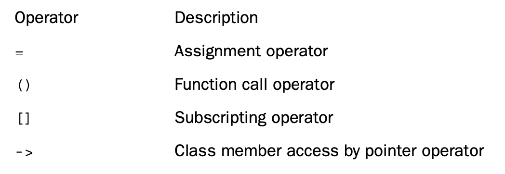

# Chapter 11 Working with Classes

[TOC]

## Operator Overloading

**Operator overloading** is an example of C++ polymorphism. In Chapter 8,“Adventures in Functions,” you saw how C++ enables you to define several functions that have the same name, provided that they have different signatures (argument lists).That is called **function overloading**, or **functional polymorphism**. 

Overloaded operators can often make code look more natural. For example, a common computing task is adding two arrays. Usually, this winds up looking like the following `for` loop:

```c++
for (int i = 0; i < 20; i++)
	evening[i] = sam[i] + janet[i]; 	// add element by element
```

But in C++, you can define a class that represents arrays and that overloads the `+` operator so that you can do this:

```c++
evening = sam + janet; 		// add two array objects
```

To overload an operator, you use a special function form called an **operator function**.An operator function has the following form, where `op` is the symbol for the operator being overloaded:

```c++
operatorop(argument-list)
```

For example, `operator+()` overloads the `+` operator and `operator*()` overloads the `* `operator.The `op` has to be a valid C++ operator; you can’t just make up a new symbol.

Then, if `district2`, `sid`, and `sara` are all objects of the `Salesperson` class, you can write this equation:

```c++
district2 = sid + sara;
```

The compiler, recognizing the operands as belonging to the `Salesperson` class,

replaces the operator with the corresponding operator function:

```c++
district2 = sid.operator+(sara);
```

## Time on Our Hands: Developing an Operator Overloading Example

```c++
// mytime0.h -- Time class before operator overloading 
#ifndef MYTIME0_H_
#define MYTIME0_H_

class Time { 
private:
    int hours;
    int minutes; 
public:
    Time();
    Time(int h, int m = 0);
    void AddMin(int m);
    void AddHr(int h);
    void Reset(int h = 0, int m = 0); 
    Time Sum(const Time & t) const; 
    void Show() const;
}; 

#endif
```

```c++
// mytime0.cpp -- implementing Time methods 
#include <iostream>
#include "mytime0.h"

Time::Time() 
{
    hours = minutes = 0; 
}
Time::Time(int h, int m ) 
{
    hours = h;
    minutes = m; 
}

void Time::AddMin(int m) 
{
    minutes += m;
    hours += minutes / 60; 
    minutes %= 60;
}

void Time::AddHr(int h) 
{
    hours += h; 
}

void Time::Reset(int h, int m) 
{
    hours = h;
    minutes = m; 
}

Time Time::Sum(const Time & t) const 
{
    Time sum;
    sum.minutes = minutes + t.minutes;
    sum.hours = hours + t.hours + sum.minutes / 60; 
    sum.minutes %= 60;
    return sum;
}

void Time::Show() const 
{
    std::cout << hours << " hours, " << minutes << " minutes"; 
}
```

```c++
// usetime0.cpp -- using the first draft of the Time class 
// compile usetime0.cpp and mytime0.cpp together
#include <iostream>
#include "mytime0.h"

int main() 
{
    using std::cout; 
    using std::endl; 
    Time planning; 
    Time coding(2, 40); 
    Time fixing(5, 55); 
    Time total;

    cout << "planning time = "; 
    planning.Show();
    cout << endl;

    cout << "coding time = "; 
    coding.Show();
    cout << endl;

    cout << "fixing time = "; 
    fixing.Show();
    cout << endl;

    total = coding.Sum(fixing); 
    cout << "coding.Sum(fixing) = "; 
    total.Show();
    cout << endl;

    return 0; 
}
```

Here is the output of the program in Listings 11.1, 11.2, and 11.3:

```shell
planning time = 0 hours, 0 minutes
coding time = 2 hours, 40 minutes
fixing time = 5 hours, 55 minutes
coding.Sum(fixing) = 8 hours, 35 minutes
```

### Adding an Addition Operator

```c++
// mytime1.h -- Time class before operator overloading 
#ifndef MYTIME1_H_
#define MYTIME1_H_

class Time 
{
private:
    int hours;
    int minutes; 
public:
    Time();
    Time(int h, int m = 0);
    void AddMin(int m);
    void AddHr(int h);
    void Reset(int h = 0, int m = 0); 
    Time operator+(const Time & t) const; 
    void Show() const;
}; 

#endif
```

```c++
// mytime1.cpp -- implementing Time methods 
#include <iostream>
#include "mytime1.h"

Time::Time() 
{
    hours = minutes = 0; 
}

Time::Time(int h, int m ) 
{
    hours = h;
    minutes = m; 
}

void Time::AddMin(int m) 
{
    minutes += m;
    hours += minutes / 60; 
    minutes %= 60;
}

void Time::AddHr(int h) 
{
    hours += h; 
}

void Time::Reset(int h, int m) 
{
    hours = h;
    minutes = m; 
}
Time Time::operator+(const Time & t) const 
{
    Time sum;
    sum.minutes = minutes + t.minutes;
    sum.hours = hours + t.hours + sum.minutes / 60; 
    sum.minutes %= 60;
    return sum;
}

void Time::Show() const 
{
    std::cout << hours << " hours, " << minutes << " minutes"; 
}
```

Like `Sum()`, `operator+()` is invoked by a `Time` object, takes a second `Time` object as an argument, and returns a `Time` object.Thus, you can invoke the `operator+()` method by using the same syntax that `Sum()` uses:

```c++
total = coding.operator+(fixing); 		// function notation
```

But naming the method operator+() also lets you use operator notation:

```c++
total = coding + fixing; // operator notation
```

```c+=
// usetime1.cpp -- using the second draft of the Time class 
// compile usetime1.cpp and mytime1.cpp together
#include <iostream>
#include "mytime1.h"

int main() 
{
using std::cout; 
using std::endl; 
Time planning; 
Time coding(2, 40); 
Time fixing(5, 55); 
Time total;

cout << "planning time = "; 
planning.Show();
cout << endl;

cout << "coding time = "; 
coding.Show();
cout << endl;

cout << "fixing time = "; 
fixing.Show();
cout << endl;

total = coding + fixing;
// operator notation
cout << "coding + fixing = "; 
total.Show();
cout << endl;

Time morefixing(3, 28);
cout << "more fixing time = "; 
morefixing.Show();
cout << endl;
total = morefixing.operator+(total);
// function notation
cout << "morefixing.operator+(total) = "; 
total.Show();
cout << endl;
return 0; 
}
```

Here is the output of the program in Listings 11.4, 11.5, and 11.6:

```shell
planning time = 0 hours, 0 minutes
coding time = 2 hours, 40 minutes
fixing time = 5 hours, 55 minutes
coding + fixing = 8 hours, 35 minutes
more fixing time = 3 hours, 28 minutes
morefixing.operator+(total) = 12 hours, 3 minutes
```

In short, the name of the operator+() function allows it to be invoked by using either function notation or operator notation.

```c++
int a, b, c;
Time A, B, C;
c = a + b; 	// use int addition
C = A + B; 	// use addition as defined for Time objects
```

You can do the following:

```c++
t4 = t1 + t2 + t3; // valid
```

### Overloading Restrictions

However, at least one of the operands has to be a user-defined type. Let’s take a closer look at the limits C++ imposes on user-defined operator overloading:

* The overloaded operator must have at least one operand that is a user-defined type. This prevents you from overloading operators for the standard types. Thus, you can’t redefine the minus operator (`-`) so that it yields the sum of two double values instead of their difference.This restriction preserves program sanity, although it may hinder creative accounting.

* You can’t use an operator in a manner that violates the syntax rules for the original operator. For example, you can’t overload the modulus operator (%) so that it can be used with a single operand:

    ```c++
    int x;
     Time shiva;
     % x; 		// invalid for modulus operator
     % shiva; 	// invalid for overloaded operator
    ```

    Similarly, you can’t alter operator precedence. So if you overload the addition opera- tor to let you add two classes, the new operator has the same precedence as ordinary addition.

* You can’t create new operator symbols. For example, you can’t define an `operator**() `function to denote exponentiation.

* You cannot overload the following operators:


* Most of the operators in Table 11.1 can be overloaded by using either member or nonmember functions. However, you can use *only* member functions to overload the following operators:




### More Overloaded Operators

```c++
// mytime2.h -- Time class after operator overloading 
#ifndef MYTIME2_H_
#define MYTIME2_H_

class Time 
{
private:
    int hours;
    int minutes; 
public:
    Time();
    Time(int h, int m = 0);
    void AddMin(int m);
    void AddHr(int h);
    void Reset(int h = 0, int m = 0); 
    Time operator+(const Time & t) const;
    Time operator-(const Time & t) const; 
    Time operator*(double n) const;
    void Show() const;
}; 

#endif
```

```c++
// mytime2.cpp -- implementing Time methods 
#include <iostream>
#include "mytime2.h"

Time::Time() 
{
    hours = minutes = 0; 
}

Time::Time(int h, int m ) 
{
    hours = h;
    minutes = m; 
}

void Time::AddMin(int m) 
{
    minutes += m;
    hours += minutes / 60; 
    minutes %= 60;
}

void Time::AddHr(int h) 
{
    hours += h; 
}

void Time::Reset(int h, int m) 
{
    hours = h;
    minutes = m; 
}

Time Time::operator+(const Time & t) const 
{
    Time sum;
    sum.minutes = minutes + t.minutes;
    sum.hours = hours + t.hours + sum.minutes / 60; 
    sum.minutes %= 60;
    return sum;
}

Time Time::operator-(const Time & t) const 
{
    Time diff;
    int tot1, tot2;
    tot1 = t.minutes + 60 * t.hours; 
    tot2 = minutes + 60 * hours; 
    diff.minutes = (tot2 - tot1) % 60; 
    diff.hours = (tot2 - tot1) / 60; 
    return diff;
}

Time Time::operator*(double mult) const 
{
    Time result;
    long totalminutes = hours * mult * 60 + minutes * mult; 
    result.hours = totalminutes / 60;
    result.minutes = totalminutes % 60;
    return result;
}

void Time::Show() const 
{
    std::cout << hours << " hours, " << minutes << " minutes"; 
}
```

```c++
// usetime2.cpp -- using the third draft of the Time class 
// compile usetime2.cpp and mytime2.cpp together
#include <iostream>
#include "mytime2.h"
int main() 
{
    using std::cout; 
    using std::endl; 
    Time weeding(4, 35); 
    Time waxing(2, 47); 
    Time total;
    Time diff; 
    Time adjusted;

    cout << "weeding time = "; 
    weeding.Show();
    cout << endl;

    cout << "waxing time = "; 
    waxing.Show();
    cout << endl;

    cout << "total work time = ";
    total = weeding + waxing; // use operator+() 
    total.Show();
    cout << endl;

    diff = weeding - waxing; // use operator-() 
    cout << "weeding time - waxing time = "; 
    diff.Show();
    cout << endl;

    adjusted = total * 1.5; // use operator*() 
    cout << "adjusted work time = "; 
    adjusted.Show();
    cout << endl;
    
    return 0; 
}
```

Here is the output of the program in Listings 11.7, 11.8, and 11.9:

```shell
weeding time = 4 hours, 35 minutes
waxing time = 2 hours, 47 minutes
total work time = 7 hours, 22 minutes
weeding time - waxing time = 1 hours, 48 minutes
adjusted work time = 11 hours, 3 minutes
```

## Introducing Friends

C++ provides another form of access: the **friend**. Friends come in three varieties:

* Friend functions
* Friend classes
* Friend member functions

The left operand is the invoking object.That is,

```c++
A = B * 2.75;
```

translates to the following member function call:

```c++
A = B.operator*(2.75);
```

But what about the following statement?

```c++
A = 2.75 * B; // cannot correspond to a member function
```

Conceptually, `2.75 * B` should be the same as `B * 2.75`, but the first expression cannot correspond to a member function because` 2.75` is not a type `Time` object. So the compiler cannot replace the expression with a member function call.

One way around this difficulty is to tell everyone (and to remember yourself) that you can only write `B * 2.75` but never write `2.75 * B`.

However, there is another possibility—using a nonmember function. A nonmember function is not invoked by an object; instead, any values it uses, including objects, are explicit arguments.Thus, the compiler could match the expression

```c++
A = 2.75 * B; // cannot correspond to a member function
```

to the following nonmember function call:

```c++
A = operator*(2.75, B);
```

The function would have this prototype:

```c++
Time operator*(double m, const Time & t);
```

Nonmember functions can’t directly access private data in a class.Well, at least ordinary nonmember functions lack access. But there is a special category of nonmember functions, called **friends**, that can access private members of a class.

### Creating Friends

The first step toward creating a friend function is to place a prototype in the class declara- tion and prefix the declaration with the keyword friend:

```c++
friend Time operator*(double m, const Time & t); // goes in class declaration
```

This prototype has two implications:

* Although the `operator*()` function is declared in the class declaration, it is not a member function. So it isn’t invoked by using the membership operator.
* Although the `operator*()` function is not a member function, it has the same access rights as a member function.

The second step is to write the function definition. Because it is not a member func- tion, you don’t use the `Time::` qualifier. Also you don’t use the `friend` keyword in the definition.The definition should look like this:

```c++
Time operator*(double mult, const Time & t)	// friend not used in definition
{
    Time result;
    long totalminutes = t.hours * mult * 60 + t.minutes * mult;
    result.hours = totalminutes / 60;
    result.minutes = totalminutes % 60;
    return result;
}
```

With this declaration and definition, the statement

```c++
A = 2.75 * B;
```

translates to the following and invokes the nonmember friend function just defined:

```c++
A = operator*(2.75, B);
```

### A Common Kind of Friend: Overloading the `<<` Operator

Suppose trip is a Time object.To display Time values, we’ve been using Show(). Wouldn’t it be nice, however, if you could do the following?

```c++
cout << trip; // make cout recognize Time class?
```

In fact, it already is heavily overloaded. In its most basic incarnation, the << operator is one of C and C++’s bit manipulation operators; it shifts bits left in a value.

#### The First Version of Overloading `<<`

If you use a Time member function to overload <<, the Time object would come first, as it did when you overloaded the * operator with a member function.That means you would have to use the << operator this way:

```c++
trip << cout; // if operator<<() were a Time member function
```

This would be confusing. But by using a friend function, you can overload the operator this way:

```c++
void operator<<(ostream & os, const Time & t) 
{
	os << t.hours << " hours, " << t.minutes << " minutes"; 
}
```

This lets you use

```c++
cout << trip;
```

to print data in the following format:

```c++
4 hours, 23 minutes
```

#### The Second Version of Overloading `<<`
But the implementation doesn’t allow you to combine the redefined `<<` operator with

the ones cout normally uses:

```c++
cout << "Trip time: " << trip << " (Tuesday)\n"; 		// can't do
```

To understand why this doesn’t work and what must be done to make it work, you first need to know a bit more about how cout operates. Consider the following statements:

```c++
int x = 5;
int y = 8; 
cout << x << y;
```

C++ reads the output statement from left to right, meaning it is equivalent to the following:

```c++
(cout << x) << y;
```

You can take the same approach with the friend function.You just revise the` operator<<() `function so that it returns a reference to an ostream object:

```c++
ostream & operator<<(ostream & os, const Time & t) 
{
    os << t.hours << " hours, " << t.minutes << " minutes";
    return os; 
}
```

So now the following statement does work: 

```c++
cout << "Trip time: " << trip << " (Tuesday)\n"; // can do
```

 First, the following invokes the particular ostream definition of `<<` that displays a string and returns the `cout` object:

```c++
cout << "Trip time: "
```

So the expression `cout << "Trip time: "` displays the string and then is replaced by

its return value,`cout`. This reduces the original statement to the following one:

```c++
cout << trip << " (Tuesday)\n";
```

Next, the program uses the `Time` declaration of `<<` to display the trip values and to return the `cout` object again.This reduces the statement to the following:

```c++
cout << " (Tuesday)\n";
```

As a point of interest, this version of `operator<<()` also can be used for file output:

```c++
#include <fstream>
...
ofstream fout; 
fout.open("savetime.txt"); 
Time trip(12, 40);
fout << trip;
```

The last statement becomes this:

```c++
operator<<(fout, trip);
```

> You use the `friend` keyword only in the prototype found in the class declaration. You don’t use it in the function definition unless the definition is also the prototype.

```c++
// mytime3.h -- Time class with friends
#ifndef MYTIME3_H_
#define MYTIME3_H_
#include <iostream>

class Time 
{
private:
    int hours;
    int minutes; 
public:
    Time();
    Time(int h, int m = 0);
    void AddMin(int m);
    void AddHr(int h);
    void Reset(int h = 0, int m = 0); 
    Time operator+(const Time & t) const;
    Time operator-(const Time & t) const; 
    Time operator*(double n) const;
    friend Time operator*(double m, const Time & t)
        { return t * m; }       // inline definition
    friend std::ostream & operator<<(std::ostream & os, const Time & t);
}; 

#endif
```

```c++
// mytime3.cpp -- implementing Time methods 
#include <iostream>
#include "mytime3.h"

Time::Time() 
{
    hours = minutes = 0; 
}

Time::Time(int h, int m ) 
{
    hours = h;
    minutes = m; 
}

void Time::AddMin(int m) 
{
    minutes += m;
    hours += minutes / 60; 
    minutes %= 60;
}

void Time::AddHr(int h) 
{
    hours += h; 
}

void Time::Reset(int h, int m) 
{
    hours = h;
    minutes = m; 
}

Time Time::operator+(const Time & t) const 
{
    Time sum;
    sum.minutes = minutes + t.minutes;
    sum.hours = hours + t.hours + sum.minutes / 60; 
    sum.minutes %= 60;
    return sum;
}

Time Time::operator-(const Time & t) const 
{
    Time diff;
    int tot1, tot2;
    tot1 = t.minutes + 60 * t.hours; 
    tot2 = minutes + 60 * hours; 
    diff.minutes = (tot2 - tot1) % 60; 
    diff.hours = (tot2 - tot1) / 60; 
    return diff;
}

Time Time::operator*(double mult) const 
{
    Time result;
    long totalminutes = hours * mult * 60 + minutes * mult; 
    result.hours = totalminutes / 60;
    result.minutes = totalminutes % 60;
    return result;
}

std::ostream & operator<<(std::ostream & os, const Time & t)
{
    os << t.hours << " hours, " << t.minutes << " minutes";
    return os;
}
```

```c++
//usetime3.cpp -- using the fourth draft of the Time class 
// compile usetime3.cpp and mytime3.cpp together
#include <iostream>
#include "mytime3.h"

int main() 
{
    using std::cout; 
    using std::endl; 
    Time aida(3, 35); 
    Time tosca(2, 48); 
    Time temp;

    cout << "Aida and Tosca:\n";
    cout << aida<<"; " << tosca << endl;
    temp = aida + tosca;        // operator+()
    cout << "Aida + Tosca: " << temp << endl;
    temp = aida* 1.17;          // member operator*()
    cout << "Aida * 1.17: " << temp << endl;
    cout << "10.0 * Tosca: " << 10.0 * tosca << endl;

    return 0; 
}
```

Here is the output of the program in Listings 11.10, 11.11, and 11.12:

```shell
Aida and Tosca:
3 hours, 35 minutes; 2 hours, 48 minutes
Aida + Tosca: 6 hours, 23 minutes
Aida * 1.17: 4 hours, 11 minutes
10.0 * Tosca: 28 hours, 0 minutes
```

## Overloaded Operators: Member Versus Nonmember Functions

Typically, the nonmember version is a friend function so that it can directly access the private data for a class. For example, consider the addition operator for the `Time` class. It has this prototype in the `Time` class declaration:

```c++
Time operator+(const Time & t) const; // member version
```

Instead, the class could use the following prototype:

```c++
// nonmember version
friend Time operator+(const Time & t1, const Time & t2);
```

For the member function version, one is passed implicitly via the this pointer and the second is passed explicitly as a function argument. For the friend version, both are passed as arguments.

Either of these two prototypes matches the expression `T2 + T3`, where `T2` and `T3` are type `Time` objects.That is, the compiler can convert the statement

```c++
T1 = T2 + T3;
```

to either of the following:

```c++
T1 = T2.operator+(T3);		// member function
T1 = operator+(T2, T3);		// nonmember function
```

Keep in mind that you must choose one or the other form when defining a given operator, but not both. Because both forms match the same expression, defining both forms is an ambiguity error, leading to a compilation error.

Sometimes, depending on the class design, the nonmember version may have an advan- tage, particularly if you have defined type conversions for the class.

## More Overloading: A Vector Class

The length of the vector is its magnitude, and that describes how far the point has been displaced. The orientation of the arrow describes the direction (see Figure 11.1). A vector representing such a change in position is called a **displacement vector**.


Adding two vectors has a simple geometric interpretation. First, draw one vector. Then draw the second vector, starting from the arrow end of the first vector. Finally, draw a vector from the starting point of the first vector to the endpoint of the second vector. This third vector represents the sum of the first two (see Figure 11.2). Note that the length of the sum can be less than the sum of the individual lengths.


Vectors are a natural choice for operator overloading. First, you can’t represent a vec- tor with a single number, so it makes sense to create a class to represent vectors. Second, vectors have analogs to ordinary arithmetic operations such as addition and subtraction. This parallel suggests overloading the corresponding operators so you can use them with vectors.

You need just two numbers to describe a two- dimensional vector, but you have a choice of what set of two numbers:

* You can describe a vector by its magnitude (length) and direction (an angle).
* You can represent a vector by its x and y components.

The components are a horizontal vector (the x component) and a vertical vector (the y component), which add up to the final vector. For example, you can describe a motion as moving a point 30 units to the right and 40 units up (see Figure 11.3).


```c++
// vect.h -- Vector class with <<, mode state 
#ifndef VECTOR_H_
#define VECTOR_H_
#include <iostream>
namespace VECTOR 
{
    class Vector 
    {
    public:
        enum Mode {RECT, POL};
    // RECT for rectangular, POL for Polar modes 
    private:
        double x;       // horizontal value
        double y;       // vertical value
        double mag;     // length of vector
        double ang;     // direction of vector in degrees
        Mode mode;      // RECT or POL
    // private methods for setting values
        void set_mag();
        void set_ang(); 
        void set_x(); 
        void set_y();
    public:
        Vector();
        Vector(double n1, double n2, Mode form = RECT); 
        void reset(double n1, double n2, Mode form = RECT); 
        ~Vector();
        double xval() const {return x;}         // report x value
        double yval() const {return y;}         // report y value
        double magval() const {return mag;}     // report magnitude
        double angval() const {return ang;}     // report angle
        void polar_mode();                      // set mode to POL
        void rect_mode();                       // set mode to RECT
    // operator overloading
        Vector operator+(const Vector & b) const;
        Vector operator-(const Vector & b) const;
        Vector operator-() const;
        Vector operator*(double n) const;
    // friends
        friend Vector operator*(double n, const Vector & a);
        friend std::ostream &
                operator<<(std::ostream & os, const Vector & v);
    };

}   // end namespace VECTOR
#endif
```

```c++
// vect.cpp -- methods for the Vector class 
#include <cmath>
#include "vect.h"   // includes <iostream>
using std::sqrt; 
using std::sin; 
using std::cos; 
using std::atan; 
using std::atan2; 
using std::cout;

namespace VECTOR 
{
    // compute degrees in one radian
    const double Rad_to_deg = 45.0 / atan(1.0); 
    // should be about 57.2957795130823

    // private methods
    // calculates magnitude from x and y 
    void Vector::set_mag()
    {
        mag = sqrt(x * x + y * y); 
    }

    void Vector::set_ang() 
    {
        if (x == 0.0 && y == 0.0) 
            ang = 0.0;
        else
            ang = atan2(y, x);
    }

    // set x from polar coordinate 
    void Vector::set_x()
    {
        x = mag * cos(ang); 
    }

    // set y from polar coordinate 
    void Vector::set_y()
    {
        y = mag * sin(ang); 
    }

    // public methods 
    Vector::Vector()            // default constructor
    {
        x = y = mag = ang = 0.0;
        mode = RECT; 
    }

    // construct vector from rectangular coordinates if form is r 
    // (the default) or else from polar coordinates if form is p 
    Vector::Vector(double n1, double n2, Mode form)
    {
        mode = form;
        if (form == RECT)
        {
            x = n1;
            y = n2; 
            set_mag(); 
            set_ang();
        }
        else if (form == POL)
        {
            mag = n1;
            ang = n2 / Rad_to_deg;
            set_x();
            set_y();
        }
        else
        {
            cout << "Incorrect 3rd argument to Vector() -- ";
            cout << "vector set to 0\n";
            x = y = mag = ang = 0.0;
            mode = RECT;
        }
    }

    // reset vector from rectangular coordinates if form is
    // RECT (the default) or else from polar coordinates if 
    // form is POL
    void Vector:: reset(double n1, double n2, Mode form)
    {
        mode = form;
        if (form == RECT)
        {
            x = n1;
            y = n2; 
            set_mag();
            set_ang();
        }
        else if (form == POL)
        {
            mag = n1;
            ang = n2 / Rad_to_deg;
            set_x();
            set_y();
        }
        else
        {
            cout << "Incorrect 3rd argument to Vector() -- ";
            cout << "vector set to 0\n";
            x = y = mag = ang = 0.0;
            mode = RECT;
        }
    }

    Vector::~Vector()       // destructor
    {
    }

    void Vector::polar_mode()   // set to polar mode
    {
        mode = POL;
    }

    void Vector::rect_mode()    // set to rectangular mode
    {
        mode = RECT;
    }

    // operator overloading
    // add two Vectors
    Vector Vector::operator+(const Vector & b) const 
    {
        return Vector(x + b.x, y + b.y); 
    }

    // subtract Vector b from a
    Vector Vector::operator-(const Vector & b) const 
    {
        return Vector(x - b.x, y - b.y); 
    }

    // reverse sign of Vector
    Vector Vector::operator-() const 
    {
        return Vector(-x, -y); 
    }

    // multiply vector by n
    Vector Vector::operator*(double n) const 
    {
        return Vector(n * x, n * y); 
    }

    // friend methods
    // multiply n by Vector a
    Vector operator*(double n, const Vector & a) 
    {
        return a * n; 
    }
    // display rectangular coordinates if mode is RECT,
    // else display polar coordinates if mode is POL
    std::ostream & operator<<(std::ostream & os, const Vector & v) 
    {
        if (v.mode == Vector::RECT)
            os << "(x,y) = (" << v.x << ", " << v.y << ")";
        else if (v.mode == Vector::POL) 
        {
            os << "(m,a) = (" << v.mag << ", " 
                << v.ang * Rad_to_deg << ")";
        } 
        else
            os << "Vector object mode is invalid"; 
        return os;
    }

} // end namespace VECTOR
```

### Using a State Member

Such a member is termed a **state member** because it describes the state an object is in.To see what this means, look at the code for the constructor:

```c++
Vector::Vector(double n1, double n2, Mode form)
{
    mode = form;
    if (form == RECT)
    {
        x = n1;
        y = n2; 
        set_mag(); 
        set_ang();
    }
    else if (form == POL)
    {
        mag = n1;
        ang = n2 / Rad_to_deg;
        set_x;
        set_y;
    }
    else
    {
        cout << "Incorrect 3rd argument to Vector() -- ";
        cout << "vector set to 0\n";
        x = y = mag = ang = 0.0;
        mode = RECT;
    }
}
```

If the third argument is `RECT` or if it is omitted (in which case the prototype assigns a default value of `RECT`), the inputs are interpreted as rectangular coordinates, whereas a value of `POL` causes them to be interpreted as polar coordinates:

```c++
Vector folly(3.0, 4.0); 		// set x = 3, y = 4
Vector foolery(20.0, 30.0, VECTOR::Vector::POL); // set mag = 20, ang = 30
```

The identifier `POL` has class scope, so class definitions can just use the unqualified name. But the fully qualified name is `VECTOR::Vector::POL` because `POL` is defined in the `Vector` class, and `Vector` is defined in the `VECTOR` namespace. 

Next, the `operator<<()` function uses the mode to determine how values are displayed:

```c++
// display rectangular coordinates if mode is RECT,
// else display polar coordinates if mode is POL
std::ostream & operator<<(std::ostream & os, const Vector & v) 
{
    if (v.mode == Vector::RECT)
        os << "(x,y) = (" << v.x << ", " << v.y << ")";
    else if (v.mode == Vector::POL) 
    {
        os << "(m,a) = (" << v.mag << ", " 
            << v.ang * Rad_to_deg << ")";
    } 
    else
        os << "Vector object mode is invalid"; 
    return os;
}
```

Because `operator<<()` is a friend function and not part of the class scope, it has to use `Vector::RECT` instead of just `RECT`. But it is in the `VECTOR` namespace, so it doesn’t need to use the fully qualified name of `VECTOR::Vector::RECT`.

### Overloading Arithmetic Operators for the `Vector` Class

You just add the two x components to get the x component of the answer and add the two y components to get the y component of the answer. From this description, you might be tempted to use this code:

```c++
Vector Vector::operator+(const Vector & b) const 
{
	Vector sum; 
    sum.x = x + b.x; 
    sum.y = y + b.y; 
    return sum;			// incomplete version
}
```

And this would be fine if the object stored only the x and y components. Unfortunately, this version of the code fails to set the polar values.You could fix this problem by adding more code:

```c++
Vector Vector::operator+(const Vector & b) const 
{
	Vector sum; 
    sum.x = x + b.x; 
    sum.y = y + b.y; 
    sum.set_ang(sum.x, sum.y);
    sum.set_mag(sum.x, sum.y);
	return sum; // version duplicates needlessly
}
```

But it is much simpler and more reliable to let a constructor do the work:

```c++
Vector Vector::operator+(const Vector & b) const 
{
	return Vector(x + b.x, y + b.y); // return the constructed Vector 
}
```

The constructor then creates a nameless new object, using these values, and the function returns a copy of that object.This way, you guarantee that the new Vector object is created according to the standard rules you lay down in the constructor.

#### Multiplication

And that is what the overloaded multiplication operator does:

```c++
Vector Vector::operator*(double n) const 
{
	return Vector(n * x, n * y); 
}
```

Just as in the Time example, you can use an inline friend function to handle double times Vector:

```c++
Vector operator*(double n, const Vector & a) 	// friend function
{
	return a * n; // convert double times Vector to Vector times double
}
```

#### More Refinement: Overloading an Overloaded Operator

First, when used with two operands, it’s the subtraction operator.The subtraction operator is termed a **binary operator** because it has exactly two operands. Second, when used with one operand, as in `-x`, it’s a minus sign operator.This form is termed a **unary operator**, meaning it has exactly one operand. Both operations—subtraction and sign reversal—make sense for vectors, too, so the Vector class has both.

```c++
Vector operator-(const Vector & b) const; // prototype Vector 
Vector::operator-(const Vector & b) const // definition 
{
	return Vector(x - b.x, y - b.y); // return the constructed Vector 
}
```

Here, it’s important to get the correct order. Consider the following statement:

```c++
diff = v1 - v2;
```

It’s converted to a member function call:

```c++
diff = v1.operator-(v2);
```

This means the vector that is passed as the explicit argument is subtracted from the implicit vector argument, so you should use `x - b.x` and not `b.x - x`.

Here are the prototype and definition for overloading negation:

```c++
Vector operator-() const; 
Vector Vector::operator-() const 
{
	return Vector (-x, -y); 
}
```

> Because operator overloading is implemented with functions, you can overload the same operator many times, as long as each operator function has a distinct signature and as long as each operator function has the same number of operands as the corresponding built-in C++ operator.

#### An Implementation Comment

Both of these implementations have advantages and disadvantages. Storing the data means that the object occupies more memory and that code has to be careful to update both rectangular and polar representations each time a Vector object is changed. But data look-up is faster. If an application often needs to access both representations of a vector, the implementation used in this example would be preferable; if polar data were needed only infrequently, the other implementation would be better.

#### Taking the `Vector` Class on a Random Walk

Listing 11.15 provides a short program that uses the revised Vector class. It simulates the famous Drunkard’s Walk problem. Actually, now that drunks are recognized as people with a serious health problem rather than as a source of amusement, it’s usually called the Ran- domWalk problem.The idea is that you place someone at a lamppost.The person begins walking, but the direction of each step varies randomly from the direction of the preced- ing step. One way of phrasing the problem is this: How many steps does it take the ran- dom walker to travel, say, 50 feet away from the post? In terms of vectors, this amounts to adding a bunch of randomly oriented vectors until the sum exceeds 50 feet.

```c++
// randwalk.cpp -- using the Vector class 
// compile with the vect.cpp file 
#include <iostream>
#include <cstdlib>      // rand(), srand() prototypes
#include <ctime>        // time() prototype
#include "vect.h"
int main()
{
    using namespace std;
    using VECTOR::Vector;
    srand(time(0));     // seed random-number generator 
    double direction;
    Vector step;
    Vector result(0.0, 0.0);
    unsigned long steps = 0;
    double target;
    double dstep;
    cout << "Enter target distance (q to quit): "; 
    while (cin >> target)
    {
        cout << "Enter step length: "; 
        if (!(cin >> dstep))
            break;
        while (result.magval() < target) 
        {
            direction = rand() % 360; 
            step.reset(dstep, direction, Vector::POL); 
            result = result + step;
            steps++;
        }
        cout << "After " << steps << " steps, the subject "
            "has the following location:\n";
        cout << result << endl;
        result.polar_mode();
        cout << " or\n" << result << endl;
        cout << "Average outward distance per step = "
            << result.magval()/steps << endl; steps = 0;
        result.reset(0.0, 0.0);
        cout << "Enter target distance (q to quit): "; 
    }
    cout << "Bye!\n"; 
    cin.clear();
    while (cin.get() != '\n')
        continue; 
    return 0;
}
```

Because the program has a `using` declaration bringing `Vector` into scope, the program can use `Vector::POL` instead of `VECTOR::Vector::POL`.

Here is a sample run of the program in Listings 11.13, 11.14, and 11.15:

```shell
Enter target distance (q to quit): 50
Enter step length: 2
After 420 steps, the subject has the following location:
(x,y) = (-25.2776, -43.7163)
 or
(m,a) = (50.4983, -120.037)
Average outward distance per step = 0.120234
Enter target distance (q to quit): 50
Enter step length: 2
After 1750 steps, the subject has the following location:
(x,y) = (50.9968, 4.45472)
 or
(m,a) = (51.191, 4.99228)
Average outward distance per step = 0.029252
Enter target distance (q to quit): 50
Enter step length: 1
After 3744 steps, the subject has the following location:
(x,y) = (-44.2507, 23.452)
 or
(m,a) = (50.0811, 152.077)
Average outward distance per step = 0.0133764
Enter target distance (q to quit): q
Bye!
```

Probability theory sug- gests that, on average, the number of steps (*N*) of length *s* needed to reach a net distance of *D* is given by the following equation:

$$
N=\left(\dfrac{D}{s}\right)^2
$$

The `rand()` function works by applying an algorithm to an initial seed value to get a random value.That value is used as the seed for the next function call, and so on.The numbers are really **pseudorandom** because 10 consecutive calls normally produce the same set of 10 random numbers. However, the `srand()` function lets you override the default seed value and initiate a different sequence of random numbers.This program uses the return value of `time(0) `to set the seed. The time(0) function returns the current calendar time, often implemented as the number of seconds since some specific date.

## Automatic Conversions and Type Casts for Classes

When you make a statement that assigns a value of one standard type to a variable of another standard type, C++ automatically converts the value to the same type as the receiving variable, provided that the two types are compatible. 

```c++
long count = 8; 		// int value 8 converted to type long
double time = 11; 		// int value 11 converted to type double
int side = 3.33;		// double value 3.33 converted to type int 3
```

The C++ language does not automatically convert types that are not compatible. For example, the following statement fails because the left side is a pointer type, whereas the right side is a number:

```c++
int * p = 10;	// type clash
```

And even though a computer may represent an address internally with an integer, inte- gers and pointers are conceptually quite different. For example, you wouldn’t square a pointer. However, when automatic conversions fail, you may use a type cast:

```c++
int * p = (int *) 10; // ok, p and (int *) 10 both pointers
```

This sets a pointer to the address 10 by type casting 10 to type pointer-to-`int` (that is, type `int *`).Whether this assignment makes sense is another matter.

```c++
// stonewt.h -- definition for the Stonewt class 
#ifndef STONEWT_H_
#define STONEWT_H_
class Stonewt
{ 
private:
    enum {Lbs_per_stn = 14}; 
    int stone;
    double pds_left;
    double pounds;
public:
    Stonewt(double lbs); 
    Stonewt(int stn, double lbs); 
    Stonewt();
    ~Stonewt();
    void show_lbs() const;
    void show_stn() const;
};
#endif
```

```c++
// stonewt.cpp -- Stonewt methods 
#include <iostream>
using std::cout;
#include "stonewt.h"

// construct Stonewt object from double value 
Stonewt::Stonewt(double lbs)
{
    stone = int (lbs) / Lbs_per_stn;    // integer division 
    pds_left = int (lbs) % Lbs_per_stn + lbs - int(lbs); 
    pounds = lbs;
}

// construct Stonewt object from stone, double values 
Stonewt::Stonewt(int stn, double lbs)
{
    stone = stn;
    pds_left = lbs;
    pounds = stn * Lbs_per_stn +lbs;
}

Stonewt::Stonewt()      // default constructor, wt = 0 
{
    stone = pounds = pds_left = 0; 
}

Stonewt::~Stonewt() // destructor 
{
}

// show weight in stones
void Stonewt::show_stn() const 
{
    cout << stone << " stone, " << pds_left << " pounds\n"; 
}

// show weight in pounds
void Stonewt::show_lbs() const 
{
    cout << pounds << " pounds\n"; 
}
```

 In C++, any constructor that takes a single argument acts as a blueprint for con- verting a value of that argument type to the class type.Thus the following constructor serves as instructions for converting a type double value to a type Stonewt value:

```c++
Stonewt(double lbs); // template for double-to-Stonewt conversion
```

That is, you can write code like the following:

```c++
Stonewt myCat; 	// create a Stonewt object
myCat = 19.6; 	// use Stonewt(double) to convert 19.6 to Stonewt
```

The program uses the `Stonewt(double)` constructor to construct a temporary Stonewt object, using `19.6` as the initialization value.Then memberwise assignment copies the contents of the temporary object into `myCat`. This process is termed an **implicit conversion** because it happens automatically, without the need of an explicit type cast.

So C++ added a new keyword, `explicit`, to turn off the automatic aspect. That is, you can declare the constructor this way:

```c++
explicit Stonewt(double lbs); // no implicit conversions allowed
```

This turns off implicit conversions such as the preceding example but still allows explicit conversions—that is, conversions using explicit type casts:

```c++
Stonewt myCat; 			// create a Stonewt object
myCat = 19.6; 			// not valid if Stonewt(double) is declared as explicit 
mycat = Stonewt(19.6); 	// ok, an explicit conversion
mycat = (Stonewt) 19.6; // ok, old form for explicit typecast
```

If the keyword `explicit` is used in the declaration, `Stonewt(double)` is used only for an explicit type cast; otherwise, it is also used for the following implicit conversions:

* When you initialize a `Stonewt` object to a type `double` value
* When you assign a type `double` value to a `Stonewt` object
* When you pass a type `double` value to a function that expects a `Stonewt` argument
* When a function that’s declared to return a `Stonewt` value tries to return a `double` value
* When any of the preceding situations use a built-in type that can unambiguously be converted to type `double`

```c++
// stone.cpp -- user-defined conversions 
// compile with stonewt.cpp
#include <iostream>
using std::cout;
#include "stonewt.h"
void display(const Stonewt & st, int n); 
int main()
{
    Stonewt incognito = 275; // uses constructor to initialize 
    Stonewt wolfe(285.7); // same as Stonewt wolfe = 285.7; 
    Stonewt taft(21, 8);

    cout << "The celebrity weighed "; 
    incognito.show_stn();
    cout << "The detective weighed "; 
    wolfe.show_stn();
    cout << "The President weighed ";
    taft.show_lbs();
    incognito = 276.8; // uses constructor for conversion 
    taft = 325; // same as taft = Stonewt(325); 
    cout << "After dinner, the celebrity weighed "; 
    incognito.show_stn();
    cout << "After dinner, the President weighed "; 
    taft.show_lbs();
    display(taft, 2);
    cout << "The wrestler weighed even more.\n";
    display(422, 2);
    cout << "No stone left unearned\n";
    return 0;
}

void display(const Stonewt & st, int n) 
{
    for (int i = 0; i < n; i++) 
    {
        cout << "Wow! ";
        st.show_stn(); 
    }
}
```

Here is the output of the program in Listing 11.18:

```shell
The celebrity weighed 19 stone, 9 pounds
The detective weighed 20 stone, 5.7 pounds
The President weighed 302 pounds
After dinner, the celebrity weighed 19 stone, 10.8 pounds
After dinner, the President weighed 325 pounds
Wow! 23 stone, 3 pounds
Wow! 23 stone, 3 pounds
The wrestler weighed even more.
Wow! 30 stone, 2 pounds
Wow! 30 stone, 2 pounds
No stone left unearned
```

Note that when a constructor has a single argument, you can use the following form when initializing a class object:

```c++
// a syntax for initializing a class object when 
// using a constructor with one argument
Stonewt incognito = 275;
```

This is equivalent to the other two forms shown earlier:

```c++
// standard syntax forms for initializing class objects 
Stonewt incognito(275);
Stonewt incognito = Stonewt(275);
```

### Conversion Functions

```c++
Stonewt wolfe(285.7);
double host = wolfe; // ?? possible ??
```

To do the reverse, you have to use a special form of a C++ operator function called a **conversion function**.

Conversion functions are user-defined type casts, and you can use them the way you would use a type cast. For example, if you define a `Stonewt`-to-`double` conversion function, you can use the following conversions:

```c++
Stonewt wolfe(285.7);
double host = double (wolfe); // syntax #1 
double thinker = (double) wolfe; // syntax #2
```

Or you can let the compiler figure out what to do:

```c++
Stonewt wells(20, 3);
double star = wells; // implicit use of conversion function
```

So how do you create a conversion function? To convert to type typeName, you use a conversion function in this form:

```c++
operator typeName();
```

Note the following points:

* The conversion function must be a class method.
* The conversion function must not specify a return type.
* The conversion function must have no arguments.

For example, a function to convert to type double would have this prototype:

```c++
operator double();
```

The typeName part (in this case typeName is double) tells the conversion the type to which to convert, so no return type is needed.

To add functions that convert `stone_wt` objects to type `int` and to type `double`, then, requires adding the following prototypes to the class declaration:

```c++
operator int(); 
operator double();
```

```c++
// stonewt1.h -- revised definition for the Stonewt class 
#ifndef STONEWT1_H_
#define STONEWT1_H_
class Stonewt
{
private:
    enum {Lbs_per_stn = 14};        // pounds per stone
    int stone;                      // whole stones
    double pds_left;                // fractional pounds
    double pounds;                  // entire weight in pounds
public:
    Stonewt(double lbs);            // construct from double pounds
    Stonewt(int stn, double lbs);   // construct from stone, lbs
    Stonewt();                      // default constructor
    ~Stonewt();
    void show_lbs() const;          // show weight in pounds format
    void show_stn() const;          // show weight in stone format
// conversion functions 
    operator int() const; 
    operator double() const;
}; 
#endif
```

```c++
// stonewt1.cpp -- Stonewt class methods + conversion functions
#include <iostream>
using std::cout;
#include "stonewt1.h"

// construct Stonewt object from double value 
Stonewt::Stonewt(double lbs)
{
    stone = int (lbs) / Lbs_per_stn;    // integer division 
    pds_left = int (lbs) % Lbs_per_stn + lbs - int(lbs); 
    pounds = lbs;
}

// construct Stonewt object from stone, double values 
Stonewt::Stonewt(int stn, double lbs)
{
    stone = stn;
    pds_left = lbs;
    pounds = stn * Lbs_per_stn +lbs;
}

Stonewt::Stonewt()      // default constructor, wt = 0 
{
    stone = pounds = pds_left = 0; 
}

Stonewt::~Stonewt() // destructor 
{
}

// show weight in stones
void Stonewt::show_stn() const 
{
    cout << stone << " stone, " << pds_left << " pounds\n"; 
}

// show weight in pounds
void Stonewt::show_lbs() const 
{
    cout << pounds << " pounds\n"; 
}

// conversion functions 
Stonewt::operator int() const 
{
    return int (pounds + 0.5); 
}

Stonewt::operator double()const 
{
    return pounds; 
}
```

```c++
// stone1.cpp -- user-defined conversion functions 
// compile with stonewt1.cpp
#include <iostream>
#include "stonewt1.h"

int main() 
{
    using std::cout;
    Stonewt poppins(9,2.8); // 9 stone, 2.8 pounds 
    double p_wt = poppins; // implicit conversion 
    cout << "Convert to double => ";
    cout << "Poppins: " << p_wt << " pounds.\n";
    cout << "Convert to int => ";
    cout << "Poppins: " << int (poppins) << " pounds.\n"; 
    return 0;
}
```

Here’s the output from the program in Listings 11.19, 11.20, and 11.21, which shows the result of converting the type `Stonewt` object to type `double` and to type `int`:

```shell
Convert to double => Poppins: 128.8 pounds. 
Convert to int => Poppins: 129 pounds.
```

#### Applying Type Conversions Automatically

Listing 11.21 uses` int (poppins)` with `cout`. Suppose that, instead, it omitted the explicit type cast:

```c++
cout << "Poppins: " << poppins << " pounds.\n";
```

Would the program use an implicit conversion, as in the following statement?

```c++
double p_wt = poppins;
```

The answer is no. Facing this lack of information, the compiler would complain that you were using an ambiguous conversion. Nothing in the statement indicates what type to use.

```c++
long gone = (double) poppins; // use double conversion 
long gone = int (poppins); // use int conversion
```

The first of these statements converts `poppins` weight to a `double` value, and then assignment converts the `double` value to type `long`. Similarly, the second statement converts `poppins` first to type `int` and then to `long`.

Normally, you’d expect the compiler to catch a blunder such as using an object instead of an integer as an array index. So with C++11, you can declare a conver- sion operator as explicit:

```c++
class Stonewt
{
    ...
// conversion functions
    explicit operator int() const;
    explicit operator double() const; 
};
```

Another approach is to replace a conversion function with a nonconversion function that does the same task—but only if called explicitly.That is, you can replace

```c++
Stonewt::operator int() { return int (pounds + 0.5); }
```

with

```c++
int Stonewt::Stone_to_Int() { return int (pounds + 0.5); }
```

This **dis**allows the following:

```c++
int plb = poppins;
```

But if you really need a conversion, it allows the following:

```c++
int plb = poppins.Stone_to_Int();
```

In summary, then, C++ provides the following type conversions for classes:

* A class constructor that has but a single argument serves as an instruction for con- verting a value of the argument type to the class type. 
* A special class member operator function called a **conversion function** serves as an instruction for converting a class object to some other type.

### Conversions and Friends

You can implement addition with the following member function:

```c++
Stonewt Stonewt::operator+(const Stonewt & st) const 
{
	double pds = pounds + st.pounds; 
    Stonewt sum(pds);
	return sum;
}
```

Or you can implement addition as a friend function this way:

```c++
Stonewt operator+(const Stonewt & st1, const Stonewt & st2) 
{
	double pds = st1.pounds + st2.pounds; 
    Stonewt sum(pds);
	return sum;
}
```

But only the friend function lets you do this:

```c++
Stonewt jennySt(9, 12); 
double pennyD = 146.0; 
Stonewt total;
total = pennyD + jennySt;
```

#### Choices in Implementing Addition

Given that you want to add `double` quantities to `Stonewt` quantities, you have a couple choices.

The first, as you just saw, is to define the following as a friend function and have the `Stonewt(double)` constructor handle conversions of type `double` arguments to type `Stonewt` arguments:

```c++
operator+(const Stonewt &, const Stonewt &)
```

The second choice is to **further overload** the addition operator with functions that explicitly use one type `double` argument:

```c++
Stonewt operator+(double x); // member function 
friend Stonewt operator+(double x, Stonewt & s);
```

That way, the following statement exactly matches the `operator+(double x)` member function:

```c++
total = jennySt + kennyD; // Stonewt + double
```

And the following statement exactly matches the `operator+(double x, Stonewt &
s)` friend function:

```c++
total = pennyD + jennySt; // double + Stonewt
```

.The first choice (relying on implicit conversions) results in a shorter program because you define fewer functions.That also implies less work for you and fewer chances to mess up.The disadvantage is the added overhead in time and memory needed to invoke the conversion constructor whenever a conversion is needed.

The second choice (additional functions explicitly matching the types), however, is the mirror image. It makes for a longer program and more work on your part, but it runs a bit faster.