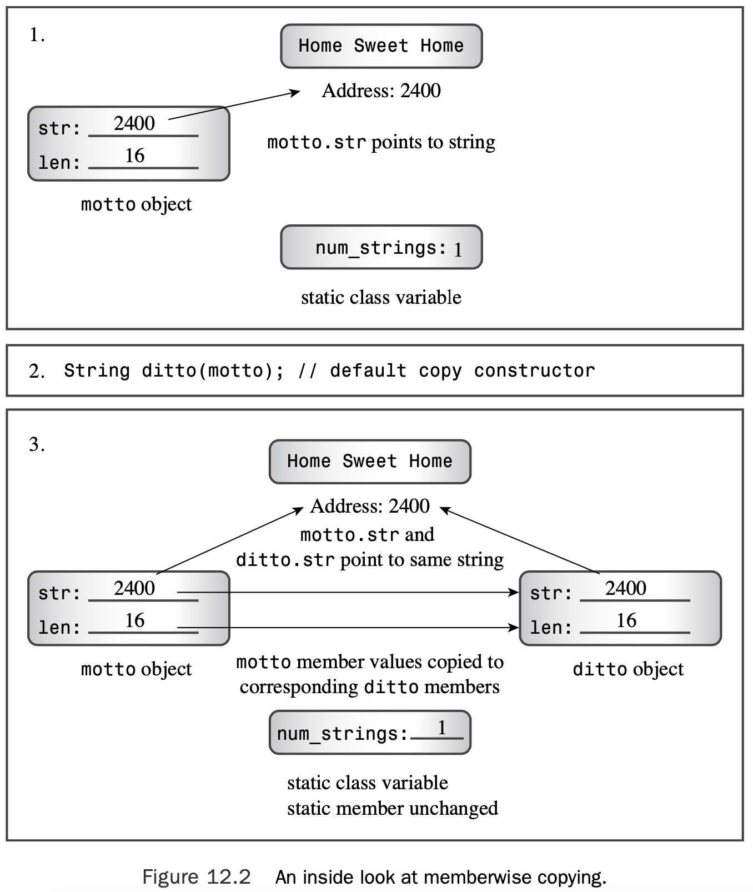

# Chapter 12 Classes and Dynamic Memory Allocation

[TOC]

## Dynamic Memory and Classes

 Part of the strategy in C++ is to take the same attitude toward memory allocation, letting the program decide about memory during runtime rather than during compile time.That way, memory use can depend on the needs of a program instead of on a rigid set of storage-class rules. 

### A Review Example and Static Class Members

```c++
// strngbad.h -- flawed string class definition
#include <iostream>
#ifndef STRNGBAD_H_
#define STRNGBAD_H_
class StringBad 
{
private:
    char * str;                 // pointer to string
    int len;                    // length of string
    static int num_strings;     // number of objects
public:
    StringBad(const char * s);  // constructor
    StringBad();                // default constructor
    ~StringBad();               // destructor
// friend function
    friend std::ostream & operator<<(std::ostream & os,
            const StringBad & st);
};
#endif
```

First, it uses a pointer-to-`char` instead of a `char` array to represent a name.This means that the class declaration does not allocate storage space for the string itself. 

Second, the definition declares the `num_strings` member as belonging to the `static` storage class.A **static class member** has a special property:A program creates only one copy of a static class variable, regardless of the number of objects created.


```c++
// strngbad.cpp -- StringBad class methods
 #include <cstring>                     // string.h for some
 #include "strngbad.h" 
 using std::cout;

// initializing static class member 
int StringBad::num_strings = 0;

// class methods
// construct StringBad from C string 
StringBad::StringBad(const char * s) 
{
    len = std::strlen(s);               // set size
    str = new char[len + 1];            // allot storage
    std::strcpy(str, s);                // initialize pointer
    num_strings++;                      // set object count
    cout << num_strings << ": \"" << str
        << "\" object created\n";       // For Your Information
}

StringBad::StringBad() 
{
    len = 4;
    str = new char[4]; 
    std::strcpy(str, "C++"); 
    num_strings++;
    cout << num_strings << ": \"" << str
        << "\" default object created\n"; // FYI
}

StringBad::~StringBad()                 // necessary destructor
{
    cout << "\"" << str << "\" object deleted, "; // required // FYI
    --num_strings;                      // required
    cout << num_strings <<  " left\n";  // FYI
    delete [] str;                      // required
}

std::ostream & operator<<(std::ostream & os, const StringBad & st) 
{
    os << st.str;
    return os; 
}
```

In the case of a static class member, you initialize the static member independently, with a separate statement outside the class declaration.That’s because the static class member is stored separately rather than as part of an object. Note that the initialization statement gives the type and uses the scope operator, but it doesn’t use the static keyword.

This initialization goes in the methods file, not in the class declaration file.That’s because the class declaration is in a header file, and a program may include a header file in several other files.That would result in multiple copies of the initialization statement, which is an error.

> A static data member is declared in the class declaration and is initialized in the file contain- ing the class methods. The scope operator is used in the initialization to indicate to which class the static member belongs. However, if the static member is a `const` integral type or an enumeration type, it can be initialized in the class declaration itself.

```c++
// vegnews.cpp -- using new and delete with classes 
// compile with strngbad.cpp
#include <iostream>
using std::cout;
#include "strngbad.h"

void callme1(StringBad &); // pass by reference 
void callme2(StringBad); // pass by value

int main() 
{
    using std::endl; 
    {
        cout << "Starting an inner block.\n"; 
        StringBad headline1("Celery Stalks at Midnight");
        StringBad headline2("Lettuce Prey");
        StringBad sports("Spinach Leaves Bowl for Dollars");
        cout << "headline1: " << headline1 << endl;
        cout << "headline2: " << headline2 << endl;
        cout << "sports: " << sports << endl;
        callme1(headline1);
        cout << "headline1: " << headline1 << endl;
        callme2(headline2);
        cout << "headline2: " << headline2 << endl;
        cout << "Initialize one object to another:\n";
        StringBad sailor = sports;
        cout << "sailor: " << sailor << endl; 
        cout << "Assign one object to another:\n"; 
        StringBad knot;
        knot = headline1;
        cout << "knot: " << knot << endl; 
        cout << "Exiting the block.\n";
    }
    cout << "End of main()\n";

    return 0; 
}

void callme1(StringBad & rsb) 
{
    cout << "String passed by reference:\n";
    cout << "    \"" << rsb << "\"\n"; 
}

void callme2(StringBad sb)
{
    cout << "String passed by value:\n";
    cout << "    \"" << sb << "\"\n";
}
```

Here is the output produced after compiling the program in Listing 12.3:

```shell
Starting an inner block.
1: "Celery Stalks at Midnight" object created
2: "Lettuce Prey" object created
3: "Spinach Leaves Bowl for Dollars" object created
headline1: Celery Stalks at Midnight
headline2: Lettuce Prey
sports: Spinach Leaves Bowl for Dollars
String passed by reference:
    "Celery Stalks at Midnight"
headline1: Celery Stalks at Midnight
String passed by value:
    "Lettuce Prey"
"Lettuce Prey" object deleted, 2 left
headline2: Lettuce Prey
Initialize one object to another:
sailor: Spinach Leaves Bowl for Dollars
Assign one object to another:
3: "C++" default object created
knot: Celery Stalks at Midnight
Exiting the block.
"Celery Stalks at Midnight" object deleted, 2 left
"Spinach Leaves Bowl for Dollars" object deleted, 1 left
"Spinach Leaves Bowl for Dollars" object deleted, 0 left
vegnews(12932,0x103ff3dc0) malloc: *** error for object 0x7faf2e4057f0: pointer being freed was not allocated
vegnews(12932,0x103ff3dc0) malloc: *** set a breakpoint in malloc_error_break to debug
zsh: abort      ./vegnews
```

Newer compiler/operating system combinations typically abort the program just before displaying the line about having -1 objects left, and some of them report a General Protection Fault (GPF).A GPF indicates that a program tried to access a memory location forbidden to it; this is another bad sign.

First, passing `headline2` as a function argument somehow causes the destructor to be called. Second, although passing by value is supposed to protect the original argument from change, the function messes up the original string beyond recognition, and some nonstandard characters get displayed. 

```c++
StringBad sailor = sports;
```

What constructor is used here? Not the default constructor, and not the constructor with a `const char *` parameter. Remember, initialization using this form is another syntax for the following:

```c++
StringBad sailor = StringBad(sports); //constructor using sports
```

Because `sports` is type `StringBad`, a matching constructor could have this prototype:

```c++
StringBad(const StringBad &);
```

### Special Member Functions

The problems with the `StringBad` class stem from **special member functions**. In particular, C++ automatically provides the following member functions:

* A default constructor if you define no constructors 
* A default destructor if you don’t define one

* A copy constructor if you don’t define one
* An assignment operator if you don’t define one 
* An address operator if you don’t define one

It turns out that the implicit copy constructor and the implicit assignment operator cause the `StringBad` class problems.

The implicit address operator returns the address of the invoking object (that is, the value of the `this` pointer).

#### Default Constructors

Suppose you define a `Klunk` class and omit any constructors. In this case, the compiler supplies the following default:

```c++
Klunk::Klunk() { } // implicit default constructor
```

That is, it supplies a constructor (the *defaulted* default constructor) that takes no arguments and that does nothing. It’s needed because creating an object always invokes a constructor:

```c++
Klunk lunk; // invokes default constructor
```

#### Copy Constructors

A copy constructor for a class normally has this prototype:

```c++
Class_name(const Class_name &);
```

Note that it takes a constant reference to a class object as its argument. For example, a copy constructor for the `String` class would have this prototype:

```c++
StringBad(const StringBad &);
```

##### When a Copy Constructor Is Used

A copy constructor is invoked whenever a new object is created and initialized to an existing object of the same kind.

```c++
StringBad ditto(motto); // calls StringBad(const StringBad &) 
StringBad metoo = motto;// calls StringBad(const StringBad &) 
StringBad also = StringBad(motto);
						// calls StringBad(const StringBad &) 
StringBad * pStringBad = new StringBad(motto);
						// calls StringBad(const StringBad &)
```

Less obviously, a compiler uses a copy constructor whenever a program generates copies of an object. In particular, it’s used when a function passes an object by value (as `callme2() `does in Listing 12.3) or when a function returns an object. Remember, passing by value means creating a copy of the original variable.

##### What a Default Copy Constructor Does

In Listing 12.3, the statement

```c++
StringBad sailor = sports;
```

amounts to the following (aside from the fact that it doesn’t compile because access to private members is not allowed):

```c++
StringBad sailor; 
sailor.str = sports.str; 
sailor.len = sports.len;
```



#### Back to Stringbad: Where the Copy Constructor Goes Wrong

The first weirdness is that the program output indicates two more objects destroyed than constructed.

The solution is to provide an explicit copy constructor that does update the count:

```c++
StringBad::StringBad(const String & s) {
    num_strings++;
    ...// important stuff to go here
}
```

The second weirdness is the more subtle and dangerous. One symptom is the garbled string contents:

```c++
headline2: Dû°
```

The cause is that the implicit copy constructor copies by value. 

```c++
sailor.str = sport.str;
```

This does not copy the string; it copies the pointer to a string. It *is* a problem when the destructor is called. Recall that the StringBad destructor frees the memory pointed to by the str pointer.The effect of destroying sailor is this:

```c++
delete [] sailor.str; // delete the string that ditto.str points to
```

Next, the effect of destroying sports is this:

```c++
delete [] sports.str; // effect is undefined
```

Here, sports.str points to the same memory location that has already been freed by the destructor for sailor, and this results in undefined, possibly harmful, behavior. 

##### Fixing the Problem by Defining an Explicit Copy Constructor

The cure for the problems in the class design is to make a **deep copy**. Each object gets its own string rather than referring to another object’s string.And each call of the destructor frees a different string rather than making duplicate attempts at freeing the same string. Here’s how you can code the String copy constructor:

```c++
StringBad::StringBad(const StringBad & st) 
{
	num_strings++; 					// handle static member update 
    len = st.len; 					// same length
	str = new char [len + 1]; 		// allot space 
    std::strcpy(str, st.str); 		// copy string to new location
    cout << num_strings << ": \"" << str
		<< "\" object created\n"; 	// For Your Information
}
```


> If a class contains members that are pointers initialized by new, you should define a copy constructor that copies the pointed-to data instead of copying the pointers themselves. This is termed *deep copying*. The alternative form of copying (*memberwise*, or *shallow*, *copying*) just copies pointer values. A shallow copy is just that—the shallow “scraping off” of pointer information for copying, rather than the deeper “mining” required to copy the constructs referred to by the pointers

#### More `Stringbad` Problems: Assignment Operators

This operator has the following prototype:

```c++
Class_name & Class_name::operator=(const Class_name &);
```

That is, it takes and returns a reference to an object of the class. For example, here’s the prototype for the `StringBad` class:

```c++
StringBad & StringBad::operator=(const StringBad &);
```

##### When an Assignment Operator Is Used and What It Does

An overloaded assignment operator is used when you assign one object to another exist- ing object:

```c++
StringBad headline1("Celery Stalks at Midnight"); 
...
StringBad knot;
knot = headline1; 	// assignment operator invoked
```

An assignment operator is not necessarily used when initializing an object:

```c++
StringBad metoo = knot; // use copy constructor, possibly assignment, too
```

##### Where `Stringbad` Assignment Goes Wrong

Listing 12.3 assigns `headline1` to `knot`:

```c++
knot = headline1;
```

When the destructor is called for `knot`, it displays this message:

```c++
"Celery Stalks at Midnight" object deleted, 2 left
```

When the destructor is called for `headline1`, it displays this message:

```c++
"-|" object deleted, -2 left
```

##### Fixing Assignment

The implementation is similar to that of the copy constructor, but there are some differences:

* Because the target object may already refer to previously allocated data, the function should use `delete []` to free former obligations.
* The function should protect against assigning an object to itself; otherwise, the freeing of memory described previously could erase the object’s contents before they are reassigned.
* The function returns a reference to the invoking object.

Here’s how you could write an assignment operator for the `StringBad` class:

```c++
StringBad & StringBad::operator=(const StringBad & st)
{
    if (this == &st) 			// object assigned to itself
        return *this;			// all done
    delete [] str;				// free old string
    len = st.len;
    str = new char [len + 1];	// get space for new string
    std::strcpy(str, st.str); 	// copy the string
    return *this;				// return reference to invoking object
}
```

The function proceeds to free the memory that str pointed to.The reason for this is that shortly thereafter str will be assigned the address of a new string. If you don’t first apply the delete operator, the previous string will remain in memory. Because the program no longer has a pointer to the old string, that memory will be wasted.

## The New, Improved `String` Class

#### The Revised Default Constructor

The new default constructor merits notice. It look likes this:

```c++
String::String() 
{
	len = 0;
	str = new char[1]; 
    str[0] = '\0';				// default string
}
```

> C++11 Null Pointer
>
> C++11 provides a better solution by introducing a new keyword, `nullptr`, to denote the null pointer. You still can use 0 as before—otherwise an enormous amount of existing code would be invalidated—but henceforth the recommendation is to use `nullptr` instead:
>
> str = nullptr; 		// C++11 null pointer notation

#### Comparison Members

The `operator<() `function returns true if the first string comes before the second string alphabetically.

```c++
bool operator<(const String &st1, const String &st2) 
{
	if (std::strcmp(st1.str, st2.str) < 0)
        return true;
    else
		return false;
}
```

Because the built-in `<` operator already returns a type bool value, you can simplify the

code further to this:

```c++
bool operator<(const String &st1, const String &st2) 
{
	return (std::strcmp(st1.str, st2.str) < 0);
}
```

Similarly, you can code the other two comparison functions like this:

```c++
bool operator>(const String &st1, const String &st2) 
{
	return st2 < st1; 
}
bool operator==(const String &st1, const String &st2) 
{
	return (std::strcmp(st1.str, st2.str) == 0); 
}
```

#### Accessing Characters by Using Bracket Notation

If you use the expression `opera[4]`, C++ looks for a method with this name and signature:

```c++
String::operator[](int i)
```

The `opera` object invokes the method, and the array subscript 4 becomes the function argument.

```c++
char & String::operator[](int i) 
{
	return str[i]; 
}
```

Declaring the return type as type `char &` allows you to assign values to a particular ele- ment. For example, you can use the following:

```c++
String means("might"); 
means[0] = 'r';
```

Suppose you have a constant object:

```c++
const String answer("futile");
```

Then, if the only available definition for `operator[]()`is the one you’ve just seen, the

following code is labeled an error:

```c++
cout << answer[1]; // compile-time error
```

The reason is that `answer` is `const`, and the method doesn’t promise not to alter data.

You can provide a second version of `operator[]()` that is used just by `const String` objects:

```c++
// for use with const String objects
const char & String::operator[](int i) const 
{
	return str[i]; 
}
```

With the definitions, you have read/write access to regular String objects and read-only access to `const String` data:

```c++
String text("Once upon a time");
const String answer("futile");
cout << text[1]; 	// ok, uses non-const version of operator[]() 
cout << answer[1]; 	// ok, uses const version of operator[]() 
cin >> text[1]; 	// ok, uses non-const version of operator[]() 
cin >> answer[1]; 	// compile-time error
```

#### Static Class Member Functions

If the static member function is declared in the public section, it can be invoked using the class name and the scope-resolution operator. For instance, you can give the `String` class a static member function called `HowMany()` with the following prototype/definition in the class declaration:

```c++
static int HowMany() { return num_strings; }
```

It could be invoked like this:

```c++
int count = String::HowMany(); // invoking a static member function
```

Because a static member function is not associated with a particular object, the only data members it can use are the static data members.

#### Further Assignment Operator Overloading

The class methods already allow you to do the following:

```c++
String name;
char temp[40];
cin.getline(temp, 40);
name = temp; 	// use constructor to convert type
```

However, this might not be a satisfactory solution if you have to do it often.To see why, let’s review how the final statement works:

1. The program uses the `String(const char *)` constructor to construct a tempo- rary `String` object containing a copy of the string stored in `temp`. Remember from Chapter 11,“Working with Classes,” that a constructor with a single argument serves as a conversion function.
2. In Listing 12.6, later in this chapter, the program uses the `String & String::oper- ator=(const String &) `function to copy information from the temporary object to the `name` object.
3. The program calls the `~String()` destructor to delete the temporary object.

```c++
String & String::operator=(const char * s) 
{
	delete [] str;
	len = std::strlen(s); 
    str = new char[len + 1]; 
    std::strcpy(str, s); 
    return *this;
}
```

```c++
// string1.h -- fixed and augmented string class definition

#ifndef STRING1_H_ 
#define STRING1_H_ 
#include <iostream> 
using std::ostream; 
using std::istream;

class String 
{
private:
    char * str;             // pointer to string
    int len;                // length of string
    static int num_strings; // number of objects
    static const int CINLIM = 80; // cin input limit
public:
// constructors and other methods
    String(const char * s); // constructor
    String();               // default constructor
    String(const String &); // copy constructor
    ~String();              // destructor
    int length () const { return len; }
// overloaded operator methods
    String & operator=(const String &); 
    String & operator=(const char *); 
    char & operator[](int i);
    const char & operator[](int i) const;
// overloaded operator friends
    friend bool operator<(const String &st, const String &st2); 
    friend bool operator>(const String &st1, const String &st2); 
    friend bool operator==(const String &st, const String &st2); 
    friend ostream & operator<<(ostream & os, const String & st); 
    friend istream & operator>>(istream & is, String & st);
// static function 
    static int HowMany();
}; 
#endif
```

```c++
// string1.cpp -- String class methods
#include <cstring>      // string.h for some 
#include "string1.h"    // includes <iostream>
using std::cin; 
using std::cout;

// initializing static class member 

int String::num_strings = 0;

// static method
int String::HowMany() 
{
    return num_strings; 
}

// class methods 
String::String(const char * s)  // construct String from C string
{
    len = std::strlen(s);       // set size
    str = new char[len + 1];    // allot storage
    std::strcpy(str, s);        // initialize pointer
    num_strings++;              // set object count
}

String::String()                // default constructor
{
    len = 4;
    str = new char[1];
    str[0] = '\0';              // default string
    num_strings++;
}


String::String(const String & st) 
{
    num_strings++;              // handle static member update
    len = st.len;               // same length
    str = new char [len + 1];   // allot space
    std::strcpy(str, st.str);   // copy string to new location
}

String::~String()               // necessary destructor
{
    --num_strings;              // required
    delete [] str;              // required
}

// overloaded operator methods

    // assign a String to a String
String & String::operator=(const String & st) 
{
    if (this == &st) 
        return *this;
    delete [] str;
    len = st.len;
    str = new char[len + 1]; 
    std::strcpy(str, st.str); 
    return *this;
}

    // assign a C string to a String 
String & String::operator=(const char * s) 
{
    delete [] str;
    len = std::strlen(s); 
    str = new char[len + 1]; 
    std::strcpy(str, s); 
    return *this;
}

    // read-write char access for non-const String 
char & String::operator[](int i)
{
    return str[i]; 
}

    // read-only char access for const String 
const char & String::operator[](int i) const 
{
    return str[i]; 
}

    // overloaded operator friends
bool operator<(const String &st1, const String &st2) 
{
    return (std::strcmp(st1.str, st2.str) < 0); 
}

bool operator>(const String &st1, const String &st2) 
{
    return st2 < st1; 
}

bool operator==(const String &st1, const String &st2) 
{
    return (std::strcmp(st1.str, st2.str) == 0); 
}

    // simple String output
ostream & operator<<(ostream & os, const String & st) 
{
    os << st.str;
    return os; 
}

    // quick and dirty String input
istream & operator>>(istream & is, String & st) 
{
    char temp[String::CINLIM]; 
    is.get(temp, String::CINLIM); 
    if (is)
        st = temp;
    while (is && is.get() != '\n')
        continue; 
    return is;
}
```

```c++
// sayings1.cpp -- using expanded String class
// compile with string1.cpp

#include <iostream>
#include "string1.h"
const int ArSize = 10; 
const int MaxLen =81; 
int main()
{
    using std::cout; 
    using std::cin; 
    using std::endl; 
    String name;

    cout <<"Hi, what's your name?\n>> "; 
    cin >> name;

    cout << name << ", please enter up to " << ArSize
         << " short sayings <empty line to quit>:\n";
    String sayings[ArSize];         // array of objects
    char temp[MaxLen];              // temporary string storage 
    int i;
    for (i = 0; i < ArSize; i++)
    {
        cout << i+1 << ": "; 
        cin.get(temp, MaxLen);
        while (cin && cin.get() != '\n')
            continue;
        if (!cin || temp[0] == '\0')        // empty line?
            break;                  // i not incremented 
        else
            sayings[i] = temp;      // overloaded assignment 
    }
    int total = i; // total # of lines read

    if ( total > 0) 
    {
        cout << "Here are your sayings:\n"; 
        for (i = 0; i < total; i++)
            cout << sayings[i][0] << ": " << sayings[i] << endl;

        int shortest = 0;
        int first = 0;
        for (i = 1; i < total; i++) 
        {
            if (sayings[i].length() < sayings[shortest].length())
                shortest = i;
            if (sayings[i] < sayings[first]) 
                first = i;
        }
        cout << "Shortest saying:\n" << sayings[shortest] << endl;
        cout << "First alphabetically:\n" << sayings[first] << endl;
        cout << "This program used "<< String::HowMany()
             << " String objects. Bye.\n";
    }
    else
        cout << "No input! Bye.\n";
    return 0;
}
```

```shell
Hi, what's your name?
>> Misty Gutz
Misty Gutz, please enter up to 10 short sayings <empty line to quit>:
1: a fool and his money are soon parted
2: penny wise, pound foolish
3: the love of money is the root of much evil
4: out of sight, out of mind
5: absence makes the heart grow fonder
6: absinthe makes the hart grow fonder
7: 
Here are your sayings:
a: a fool and his money are soon parted
p: penny wise, pound foolish
t: the love of money is the root of much evil
o: out of sight, out of mind
a: absence makes the heart grow fonder
a: absinthe makes the hart grow fonder
Shortest saying:
penny wise, pound foolish
First alphabetically:
a fool and his money are soon parted
This program used 11 String objects. Bye
```

## Things to Remember When Using `new` in Constructors

By now you’ve noticed that you must take special care when using `new` to initialize pointer members of an object. In particular, you should do the following:

*  If you use `new` to initialize a pointer member in a constructor, you should use `delete` in the destructor.
* The uses of new and `delete` should be compatible.You should pair new with `delete` and `new []` with `delete []`.
* If there are multiple constructors, all should use `new` the same way—either all with brackets or all without brackets.There’s only one destructor, so all constructors have to be compatible with that destructor. However, it is permissible to initialize a pointer with `new` in one constructor and with the **null pointer** (0, or, with C++11, nullptr) in another constructor because it’s okay to apply the delete operation (with or without brackets) to the null pointer.

* You should define a copy constructor that initializes one object to another by doing deep copying.Typically, the constructor should emulate the following example:

```c++
String::String(const String & st) 
{
    num_strings++;              // handle static member update
    len = st.len;               // same length
    str = new char [len + 1];   // allot space
    std::strcpy(str, st.str);   // copy string to new location
}
```

* You should define an assignment operator that copies one object to another by doing deep copying.Typically, the class method should emulate the following example:

```c++
String & String::operator=(const String & st) 
{
    if (this == &st) 
        return *this;
    delete [] str;
    len = st.len;
    str = new char[len + 1]; 
    std::strcpy(str, st.str); 
    return *this;
}
```

### Don’ts and Dos

The following excerpt contains two examples of what not to do and one example of a good constructor:

```c++
String::String() 
{
    str = "default string";		// oops, no new []
    len = std::strlen(str); 
}

String::String(const char * s) 
{
	len = std::strlen(s); 
    str = new char; 			// oops, no []
    std::strcpy(str, s);		// oops, no room
}


String::String(const String & st) 
{
    len = st.len;
    str = new char[len + 1]; 	// good, allocate space
    std::strcpy(str, st.str);	// good, copy value
}
```

Finally, here’s a destructor that *doesn’t* work correctly with the previous constructors:

```c++
String::~String() 
{
	delete str; // oops, should be delete [] str; 
}
```

### Memberwise Copying for Classes with Class Members

Suppose you use the `String` class, or, for that matter, the standard `string` class as a type for class members:

```c++
class Magazine 
{
private:
	String title; 
    string publisher;
...
};
```

`String` and `string` both use dynamic memory allocation. If you copy or assign one `Magazine` object to another, memberwise copying uses the copy constructors and assignment operators defined for the member types.

## Observations About Returning Objects

### Returning a Reference to a `const` Object

For example, suppose you wanted to write a function `Max()` that returned the larger of two `Vector` objects, where `Vector` is the class developed in Chapter 11.The function would be used in this manner:

```c++
Vector force1(50,60); 
Vector force2(10,70); 
Vector max;
max = Max(force1, force2);
```

Either of the following two implementations would work:

```c++
// version 1
Vector Max(const Vector & v1, const Vector & v2) 
{
	if (v1.magval() > v2.magval()) 
    	return v1;
	else
		return v2;
}

// version 2
const Vector & Max(const Vector & v1, const Vector & v2) 
{
    if (v1.magval() > v2.magval()) 
        return v1;
    else
    	return v2;
}
```

First, recall that returning an object invokes the copy constructor, whereas returning a reference doesn’t.ThusVersion 2 does less work and is more efficient. 

Second, the reference should be to an object that exists when the calling function is executing. In this example, the reference is to either `force1` or `force2`, and both are objects defined in the calling function, so this requirement is met.

Third, both `v1` and `v2` are declared as being const references, so the return type has to be const to match.

### Returning a Reference to a Non-`const` Object

Two common examples of returning a non-`const` object are overloading the assignment operator and overloading the `<<` operator for use with `cout`. The first is done for reasons of efficiency, and the second for reasons of necessity.

The return value of `operator=()` is used for chained assignment:

```c++
String s1("Good stuff"); 
String s2, s3;
s3 = s2 = s1;
```

The return value of `operator<<()` is used for chained output:

```c++
String s1("Good stuff");
cout << s1 << "is coming!";
```

Here, the return value of `operator<<(cout, s1)` becomes the object used to display the string `"is coming!"`. Here, the return type has to be `ostream &` and not just `ostream`. Using an `ostream` return type would require calling the `ostream` copy constructor, and, as it turns out, the `ostream` class does not have a public copy constructor. Fortunately, returning a reference to `cout` poses no problems because `cout` is already in scope in the calling function.

### Returning an Object

The preceding definition of `Vector::operator+()` has a bizarre property.The intended

use is this:

```c++
net = force1 + force2; 	// 1: three Vector objects
```

However, the definition also allows you to use the following:

```c++
force1 + force2 = net; 	// 2: dyslectic programming 
cout << (force1 + force2 = net).magval() << endl; // 3: demented programming
```

In Statement 2, the program computes the sum of `force1` and `force2`, copies the answer into the temporary return object, overwrites the contents with the contents of `net`, and then discards the temporary object.The original vectors are all left unchanged. In Statement 3, the magnitude of the temporary object is displayed before the object is deleted.

If you are concerned about the potential for misuse and abuse created by this behavior, you have a simple recourse: Declare the return type as a `const` object. For instance, if `Vector::operator+()` is declared to have return type `const Vector`, then Statement 1 is still allowed but Statements 2 and 3 become invalid.

In summary, if a method or function returns a local object, it should return an object, not a reference. In this example, the program uses the copy constructor to generate the returned object. 

If a method or function returns an object of a class for which there is no public copy constructor, such as the ostream class, it must return a reference to an object. 

Finally, some methods and functions, such as the overloaded assignment operator, can return either an object or a reference to an object. In this example, the reference is pre- ferred for reasons of efficiency.

## Using Pointers to Objects

```c++
// sayings2.cpp -- using pointers to objects
// compile with string1.cpp
#include <iostream>
#include <cstdlib>  // (or stdlib.h) for rand(), srand() 
#include <ctime>    // (or time.h) for time()
#include "string1.h" 
const int ArSize = 10; 
const int MaxLen = 81; 
int main()
{
    using namespace std;
    String name;
    cout << "Hi, what's your name?\n>> "; 
    cin >> name;

    cout << name << ", please enter up to " << ArSize
         << " short sayings <empty line to quit>:\n";
    String sayings[ArSize]; 
    char temp[MaxLen];          // temporary string storage
    int i;
    for (i = 0; i < ArSize; i++)
    {
        cout << i+1 << ": "; 
        cin.get(temp, MaxLen);
        while (cin && cin.get() != '\n')
            continue;
        if (!cin || temp[0] == '\0')        // empty line?
            break;                  // i not incremented 
        else
            sayings[i] = temp;      // overloaded assignment 
    }
    int total = i; // total # of lines read

    if ( total > 0) 
    {
        cout << "Here are your sayings:\n";
        for (i = 0; i < total; i++)
            cout << sayings[i] << "\n";

    // use pointers to keep track of shortest, first strings
        String * shortest = &sayings[0]; // initialize to first object 
        String * first = &sayings[0];
        for (i = 1; i < total; i++)
        {
            if (sayings[i].length() < shortest->length()) 
                shortest = &sayings[i];
            if (sayings[i] < *first)    // compare values 
                first = &sayings[i];    // assign address
        }
        cout << "Shortest saying:\n" << * shortest << endl; 
        cout << "First alphabetically:\n" << * first << endl; 
        srand(time(0));
        int choice = rand() % total; // pick index at random 
    // use new to create, initialize new String object
        String * favorite = new String(sayings[choice]); 
        cout << "My favorite saying:\n" << *favorite << endl; 
        delete favorite;
    } 
    else
        cout << "Not much to say, eh?\n"; 
    cout << "Bye.\n";
    return 0;
}
```

> Object Initialization with `new`
>
> In general, if `Class_name` is a class and if `value` is of type `Type_name`, the statement
>
> `Class_name * pclass = new Class_name(value);`
>
> invokes this constructor:
>
> `Class_name(Type_name);`
>
> There may be trivial conversions, such as to this:
>
> `Class_name(const Type_name &);`
>
> Also the usual conversions invoked by prototype matching, such as from `int` to `double`, takes place as long as there is no ambiguity. An initialization in the following form invokes the default constructor:
>
> `Class_name * ptr = new Class_name;`

Here’s a sample run of the program in Listing 12.7:

```shell
Hi, what's your name?
>> Kirt Rood
Kirt Rood, please enter up to 10 short sayings <empty line to quit>:
1: a friend in need is a friend indeed
2: neither a borrower nor a lender be 
3: a stitch in time saves nine
4: a niche in time saves stine
5: it takes a crook to catch a crook
6: cold hands, warm heart 
7: 
Here are your sayings:
a friend in need is a friend indeed
neither a borrower nor a lender be
a stitch in time saves nine
a niche in time saves stine
it takes a crook to catch a crook
cold hands, warm heart
Shortest saying:
cold hands, warm heart
First alphabetically:
a friend in need is a friend indeed
My favorite saying:
neither a borrower nor a lender be
Bye.
```

### Looking Again at `new` and `delete`

The code in Listing 12.7 uses new to allocate an entire object:

```c++
String * favorite = new String(sayings[choice]);
```

This allocates space not for the string to be stored but for the object—that is, for the `str` pointer that holds the address of the string and for the `len` member. Creating the object, in turn, calls the constructor, which allocates space for storing the string and assigns the string’s address to `str`. The program then uses `delete` to delete this object when it is finished with it.The object is a single object, so the program uses `delete` without brackets. Again, this frees only the space used to hold the `str` pointer and the `len` member. It doesn’t free the memory used to hold the string `str` points to, but the destructor takes care of that final task (see Figure 12.4).


Again, destructors are called in the following situations (refer to Figure 12.4):

* If an object is an automatic variable, the object’s destructor is called when the program exits the block in which the object is defined.Thus, in Listing 12.3 the destructor is called for `headlines[0]` and `headlines[1]` when the program exits `main()`, and the destructor for grub is called when the program exits `callme1()`.
* If an object is a static variable (external, static, static external, or from a namespace), its destructor is called when the program terminates.This is what happened for the `sports` object in Listing 12.3.
* If an object is created by `new`, its destructor is called only when you explicitly use `delete` on the object.

### Pointers and Objects Summary

You should note several points about using pointers to objects (refer to Figure 12.5 for a summary):

* You declare a pointer to an object by using the usual notation:

     `String * glamour;`

* You can initialize a pointer to point to an existing object:

     `String * first = &sayings[0];`

* You can initialize a pointer by using `new`. The following creates a new object:

     `String * favorite = new String(sayings[choice]);`

    Also see Figure 12.6 for a more detailed look at an example of initializing a pointer with `new`.

* Using `new` with a class invokes the appropriate class constructor to initialize the newly created object:

    `// invokes default constructor `

    `String * gleep = new String;`

    `// invokes the String(const char *) constructor `

    `String * glop = new String("my my my");`

    `// invokes the String(const String &) constructor`

    `String * favorite = new String(sayings[choice]);`

* You use the `->` operator to access a class method via a pointer: 

    `if (sayings[i].length() < shortest->length())`

* You apply the dereferencing operator (*) to a pointer to an object to obtain an object: 

    `if (sayings[i] < *first) // compare object values`

    `		first = &sayings[i]; // assign object address`


### Looking Again at Placement `new`

```c++
// placenew1.cpp -- new, placement new, no delete 
#include <iostream>
#include <string>
#include <new>
using namespace std; 
const int BUF = 512;

class JustTesting 
{
private:
    string words;
    int number; 
public:
    JustTesting(const string & s = "Just Testing", int n = 0) 
    {words = s; number = n; cout << words << " constructed\n"; } 
    ~JustTesting() { cout << words << " destroyed\n";}
    void Show() const { cout << words << ", " << number << endl;}
};
int main() 
{
    char * buffer = new char[BUF];          // get a block of memory

    JustTesting *pc1, *pc2;

    pc1 = new (buffer) JustTesting;         // place object in buffer
    pc2 = new JustTesting("Heap1", 20);     // place object on heap

    cout << "Memory block addresses:\n" << "buffer: "
         << (void *) buffer << "    heap: " << pc2 <<endl;
    cout << "Memory contents:\n"; 
    cout << pc1 << ": "; 
    pc1->Show();
    cout << pc2 << ": "; 
    pc2->Show();

    JustTesting *pc3, *pc4;
    pc3 = new (buffer) JustTesting("Bad Idea", 6); 
    pc4 = new JustTesting("Heap2", 10);

    cout << "Memory contents:\n"; 
    cout << pc3 << ": "; 
    pc3->Show();
    cout << pc4 << ": "; 
    pc4->Show();

    delete pc2;                             // free Heap1
    delete pc4;                             // free Heap2
    delete [] buffer;                       // free buffer
    cout << "Done\n"; 
    return 0;
}
```

Here is the output:

```shell
Just Testing constructed
Heap1 constructed
Memory block addresses:
buffer: 0x7fc2b04057c0    heap: 0x7fc2b04059c0
Memory contents:
0x7fc2b04057c0: Just Testing, 0
0x7fc2b04059c0: Heap1, 20
Bad Idea constructed
Heap2 constructed
Memory contents:
0x7fc2b04057c0: Bad Idea, 6
0x7fc2b04059f0: Heap2, 10
Heap1 destroyed
Heap2 destroyed
Done
```

For objects created on the heap, you can use this:

```c++
delete pc2; // delete object pointed to by pc2
```

But you can’t use this:

```c++
delete pc1; // delete object pointed to by pc1? NO! 
delete pc3; // delete object pointed to by pc3? NO!
```

The reason is that `delete` works in conjunction with new but not with placement new. The pointer `pc3`, for example, does not receive an address returned by `new`, so `delete pc3 `throws a runtime error.

You can use these pointers:

```c++
pc3->~JustTesting(); // destroy object pointed to by pc3 
pc1->~JustTesting(); // destroy object pointed to by pc1
```

```c++
// placenew2.cpp -- new, placement new, no delete 
#include <iostream>
#include <string>
#include <new>
using namespace std; 
const int BUF = 512;

class JustTesting 
{
private:
    string words;
    int number; 
public:
    JustTesting(const string & s = "Just Testing", int n = 0) 
    {words = s; number = n; cout << words << " constructed\n"; } 
    ~JustTesting() { cout << words << " destroyed\n";}
    void Show() const { cout << words << ", " << number << endl;}
};

int main() 
{
    char * buffer = new char[BUF];          // get a block of memory

    JustTesting *pc1, *pc2;

    pc1 = new (buffer) JustTesting;         // place object in buffer
    pc2 = new JustTesting("Heap1", 20);     // place object on heap

    cout << "Memory block addresses:\n" << "buffer: "
         << (void *) buffer << "    heap: " << pc2 <<endl;
    cout << "Memory contents:\n"; 
    cout << pc1 << ": "; 
    pc1->Show();
    cout << pc2 << ": "; 
    pc2->Show();

    JustTesting *pc3, *pc4;
    pc3 = new (buffer + sizeof (JustTesting)) 
                JustTesting("Better Idea", 6);
    pc4 = new JustTesting("Heap2", 10);

    cout << "Memory contents:\n"; 
    cout << pc3 << ": "; 
    pc3->Show();
    cout << pc4 << ": "; 
    pc4->Show();

    delete pc2;                             // free Heap1
    delete pc4;                             // free Heap2
// explicitly destroy placement new objects
    pc3->~JustTesting();                    // destroy object pointed to by pc3 
    pc1->~JustTesting();                    // destroy object pointed to by pc1
    delete [] buffer;                       // free buffer
    cout << "Done\n"; 
    return 0;
}
```

Here is the output of the program in Listing 12.9:

```c++
Just Testing constructed
Heap1 constructed
Memory block addresses:
buffer: 0x7fbf5dc057c0    heap: 0x7fbf5dc059c0
Memory contents:
0x7fbf5dc057c0: Just Testing, 0
0x7fbf5dc059c0: Heap1, 20
Better Idea constructed
Heap2 constructed
Memory contents:
0x7fbf5dc057e8: Better Idea, 6
0x7fbf5dc059f0: Heap2, 10
Heap1 destroyed
Heap2 destroyed
Better Idea destroyed
Just Testing destroyed
Done
```

## Reviewing Techniques

#### Overloading the `<<` Operator

To redefine the `<<` operator so that you use it with `cout` to display an object’s contents,

you define a friend operator function that has the following form:

```c++
ostream & operator<<(ostream & os, const c_name & obj) 
{
    os << ... ; // display object contents
    return os; 
}
```

Here `c_name` represents the name of the class. 

#### Conversion Functions

To convert a single value to a class type, you create a class constructor that has the follow- ing prototype:

```c++
c_name(type_name value);
```

Here `c_name` represents the class name, and `type_name` represents the name of the type you want to convert.

#### Classes Whose Constructors Use `new`

You need to take several precautions when designing classes that use the `new` operator to allocate memory pointed to by a class member:

* Any class member that points to memory allocated by `new` should have the `delete` operator applied to it in the class destructor.This frees the allocated memory.

* If a destructor frees memory by applying `delete` to a pointer that is a class member, every constructor for that class should initialize that pointer, either by using new or by setting the pointer to the null pointer.

* Constructors should settle on using either `new []` or `new`, but not a mixture of both.The destructor should use `delete []` if the constructors use `new []`, and it should use `delete` if the constructors use `new`.

* You should define a copy constructor that allocates new memory rather than copying a pointer to existing memory.This enables a program to initialize one class object to another.The constructor should normally have the following prototype:

    `className(const className &)`

* You should define a class member function that overloads the assignment operator and that has a function definition with the following prototype (where `c_pointer` is a member of the `c_name` class and has the type pointer-to-`type_name`).The following example assumes that the constructors initialize the variable `c_pointer` by using `new []`:

    ```c++
    c_name & c_name::operator=(const c_name & cn) 
    {
        if (this == & cn)
        	return *this; 		// done if self-assignment
        delete [] c_pointer;
        // set size number of type_name units to be copied 
        c_pointer = new type_name[size];
        // then copy data pointed to by cn.c_pointer to 
        // location pointed to by c_pointer
        ...
        return *this;
    }
    ```

    

## A Queue Simulation


### A Queue Class

The first order of business is to design a `Queue` class. First, you need to list the attributes of the kind of queue you’ll need:

* A queue holds an ordered sequence of items.
* A queue has a limit on the number of items it can hold.
* You should be able to create an empty queue.
* You should be able to check whether a queue is empty.
* You should be able to check whether a queue is full.
* You should be able to add an item to the end of a queue.
* You should be able to remove an item from the front of a queue.
* You should be able to determine the number of items in the queue.

#### The Queue Class Interface

```c++
class Queue 
{
    enum {Q_SIZE = 10}; 
private:
// private representation to be developed later 
public:
    Queue(int qs = Q_SIZE);	// create queue with a qs limit
    ~Queue();
    bool isempty() const;
    bool isfull() const;
    int queuecount() const;
    bool enqueue(const Item &item);	// add item to end
    bool dequeue(Item &item); 		// remove item from front
};
```

#### The Queue Class Implementation

A **linked list** consists of a sequence of nodes. Each **node** contains the information to be held in the list, plus a pointer to the next node in the list. For the queue in this example, each data part is a type `Item` value, and you can use a structure to represent a node:

```c++
struct Node 
{
    Item item; 				// data stored in the node
    struct Node * next; 	// pointer to next node 
};
```


Commonly, the pointer in the last node in the list is set to `NULL` (or, equivalently, to `0`) to indicate that there are no further nodes.With C++11, you should use the new `nullptr` keyword.

However, because a queue always adds a new item to the end of the queue, it is convenient to have a data member point to the last node, too (see Figure 12.9). 


Thus, the private part of the class declaration can look like this:

```c++
class Queue
{
private:
// class scope definitions
// Node is a nested structure definition local to this class 
    struct Node { Item item; struct Node * next;};
	enum {Q_SIZE = 10};
// private class members
	Node * front; 		// pointer to front of Queue
    Node * rear; 		// pointer to rear of Queue
    int items; 			// current number of items in Queue
    const int qsize;  	// maximum number of items in Queue
    ...
public: 
//... 
};
```

> Nested Structures and Classes
>
> A structure, a class, or an enumeration declared within a class declaration is said to be *nested* in the class. It has class scope. Such a declaration doesn’t create a data object. Rather, it specifies a type that can be used internally within the class. If the declaration is made in the private section of the class, then the declared type can be used only within the class. If the declaration is made in the public section, then the declared type can also be used out of the class, through use of the scope-resolution operator. For example, if `Node` were declared in the public section of the `Queue` class, you could declare variables of type `Queue::Node` outside the `Queue` class.

#### The Class Methods

A class constructor should provide values for the class members. Because the queue in this example begins in an empty state, you should set the front and rear pointers to `NULL` (or `0` or `nullptr`) and `items` to 0. Also you should set the maximum queue size `qsize` to the constructor argument `qs`. Here’s an implementation that does not work:

```c++
Queue::Queue(int qs) 
{
    front = rear = NULL;
    items = 0;
    qsize = qs; // not acceptable!
}
```

The problem is that `qsize` is a `const`, so it can be **initialized to** a value, but it can’t be **assigned** a value.  If you want to initialize a const data member, you have to do so when the object is created before execution reaches the body of the constructor. C++ provides a special syntax for doing just that. It’s called a **member initializer list**.The member initializer list consists of a comma-separated list of initializers preceded by a colon. It’s placed after the closing parenthesis of the argument list and before the opening bracket of the function body.  Using this notation, you can write the Queue constructor like this:

```c++
Queue::Queue(int qs) : qsize(qs)	// initialize qsize to qs
{
    front = rear = NULL;
    items = 0;
}
```

In general, the initial value can involve constants and arguments from the constructor’s argument list.The technique is not limited to initializing constants; you can also write the `Queue` constructor like this:

```c++
Queue::Queue(int qs) : qsize(qs), front(NULL), rear(NULL), items(0) 
{
}
```

Only constructors can use this initializer-list syntax. As you’ve seen, you have to use this syntax for `const` class members.You also have to use it for class members that are declared as references:

```c++
class Agency {...}; 
class Agent
{
private:
	Agency & belong; 	// must use initializer list to initialize
    ...
};
Agent::Agent(Agency & a) : belong(a) {...}
```

Adding an item to the rear of the queue (enqueuing) is more involved. Here is one approach:

```c++
bool Queue::enqueue(const Item & item) 
{
    if (isfull()) 
        return false;
    Node * add = new Node; 	// create node
// on failure, new throws std::bad_alloc exception
    add->item = item; 		// set node pointers
    add->next = NULL; 		// or nullptr;
    items++;
    if (front == NULL)		// if queue is empty,
    	front = add; 		// place item at front
    else
    	rear->next = add; 	// else place at rear
    rear = add;				// have rear point to new node
    return true;
}
```

In brief, the method goes through the following phases (see Figure 12.10):


Removing an item from the front of the queue (dequeuing) also has several steps. Here is one approach:

```c++
bool Queue::dequeue(Item & item) 
{
    if (front == NULL) 
        return false;
    item = front->item; 
    items--;
    Node * temp = front; 
    front = front->next; 
    delete temp;
    if (items == 0) 
        rear = NULL;
    return true; 
}
```

In brief, the method goes through the following phases (see Figure 12.11):


#### Other Class Methods?

```c++
Queue::~Queue() 
{
    Node * temp;
    while (front != NULL)	// while queue is not yet empty
    {
        temp = front;		// save address of front item
        front = front->next;// reset pointer to next item
        delete temp;		// delete former front
    }
}
```

### The `Customer` Class

```c++
class Customer 
{
private:
	long arrive; 		// arrival time for customer
    int processtime;	// processing time for customer
public:
	Customer() { arrive = processtime = 0; } 
    void set(long when);
    long when() const { return arrive; }
    int ptime() const { return processtime; }
};
void Customer::set(long when) 
{
    processtime = std::rand() % 3 + 1;
    arrive = when; 
}
```

Listing 12.10 gathers together the `Queue` and `Customer` class declarations, and Listing 12.11 provides the methods.

```c++
// queue.h -- interface for a queue 
#ifndef QUEUE_H_
#define QUEUE_H_
// This queue will contain Customer items
class Customer 
{
private:
	long arrive; 		// arrival time for customer
    int processtime;	// processing time for customer
public:
	Customer() { arrive = processtime = 0; } 
    void set(long when);
    long when() const { return arrive; }
    int ptime() const { return processtime; }
};

typedef Customer Item;

class Queue
{
private:
// class scope definitions
// Node is a nested structure definition local to this class 
    struct Node { Item item; struct Node * next;};
	enum {Q_SIZE = 10};
// private class members
	Node * front; 		// pointer to front of Queue
    Node * rear; 		// pointer to rear of Queue
    int items; 			// current number of items in Queue
    const int qsize;  	// maximum number of items in Queue
    // preemptive definitions to prevent public copying
    Queue(const Queue & q) : qsize(0) { }
    Queue & operator=(const Queue & q) { return *this;}
public:
    Queue(int qs = Q_SIZE);	// create queue with a qs limit
    ~Queue();
    bool isempty() const;
    bool isfull() const;
    int queuecount() const;
    bool enqueue(const Item &item);	// add item to end
    bool dequeue(Item &item); 		// remove item from front
};
#endif
```

```c++
// queue.cpp -- Queue and Customer methods
#include "queue.h"
#include <cstdlib> // (or stdlib.h) for rand()

// Queue methods
Queue:: Queue(int qs) : qsize(qs)
{
    front = rear = NULL;    //or nullptr
    items = 0;
}

Queue::~Queue() 
{
    Node * temp;
    while (front != NULL)	// while queue is not yet empty
    {
        temp = front;		// save address of front item
        front = front->next;// reset pointer to next item
        delete temp;        // delete former front
    }
}

bool Queue::isempty() const
{
    return items == 0;
}

bool Queue::isfull() const
{
    return items == qsize;
}

int Queue::queuecount() const
{
    return items;
}

// Add item to queue
bool Queue::enqueue(const Item & item) 
{
    if (isfull()) 
        return false;
    Node * add = new Node; 	// create node
// on failure, new throws std::bad_alloc exception
    add->item = item; 		// set node pointers
    add->next = NULL; 		// or nullptr;
    items++;
    if (front == NULL)		// if queue is empty,
    	front = add; 		// place item at front
    else
    	rear->next = add; 	// else place at rear
    rear = add;				// have rear point to new node
    return true;
}

// Place front item into item variable and remove from queue
bool Queue::dequeue(Item & item) 
{
    if (front == NULL) 
        return false;
    item = front->item;     // set item to first item in queue
    items--;
    Node * temp = front;    // save location of first item
    front = front->next;    // reset front to next item
    delete temp;            // delete former first item
    if (items == 0) 
        rear = NULL;
    return true; 
}

// customer method

// when is the time at which the customer arrives
// the arrival time is set to when and the processing
// time set to a random value in the range 1 - 3
void Customer::set(long when) 
{
    processtime = std::rand() % 3 + 1;
    arrive = when; 
}
```

### The ATM Simulation

The program should allow the user to enter three quantities: the maximum queue size, the number of hours the program will simulate, and the average number of customers per hour.The program should use a loop in which each cycle represents one minute. 

1. Determine whether a new customer has arrived. If so, add the customer to the queue if there is room; otherwise, turn the customer away.
2. If no one is being processed, take the first person from the queue. Determine how long the person has been waiting and set a `wait_time` counter to the processing time that the new customer will need.
3. If a customer is being processed, decrement the `wait_time` counter by one minute.
4. Track various quantities, such as the number of customers served, the number of customers turned away, cumulative time spent waiting in line, and cumulative queue length.

The program uses this function to determine whether a customer shows up during a cycle:

```c++
bool newcustomer(double x) 
{
	return (std::rand() * x / RAND_MAX < 1); 
}
```

The value `RAND_MAX` is defined in the `cstdlib` file (formerly `stdlib.h`) and represents the largest value the `rand()` function can return (`0` is the lowest value). Suppose that `x`, the average time between customers, is `6`.

```c++
// bank.cpp -- using the Queue interface
// compile with queue.cpp
#include <iostream>
#include <cstdlib>  // for rand() and srand() 
#include <ctime>    // for time()
#include "queue.h"
const int MIN_PER_HR = 60;

bool newcustomer(double x); // is there a new customer?

int main() 
{
    using std::cin; 
    using std::cout; 
    using std::endl; 
    using std::ios_base;
// setting things up 
    std::srand(std::time(0));   // random initializing of rand()

    cout << "Case Study: Bank of Heather Automatic Teller\n"; 
    cout << "Enter maximum size of queue: ";
    int qs;
    cin >> qs;
    Queue line(qs);         // line queue holds up to qs people

    cout << "Enter the number of simulation hours: "; 
    int hours;              // hours of simulation 
    cin >> hours;
    // simulation will run 1 cycle per minute
    long cyclelimit = MIN_PER_HR * hours; // # of cycles

    cout << "Enter the average number of customers per hour: "; 
    double perhour;         // average # of arrival per hour
    cin >> perhour;
    double min_per_cust; // average time between arrivals 
    min_per_cust = MIN_PER_HR / perhour;

    Item temp;              // new customer data
    long turnaways = 0;     // turned away by full queue
    long customers = 0;     // joined the queue
    long served = 0;        // served during the simulation
    long sum_line = 0;      // cumulative line length
    int wait_time = 0;      // time until autoteller is free
    long line_wait = 0;     // cumulative time in line

    // running the simulation
    for (int cycle = 0; cycle < cyclelimit; cycle++) 
    {
        if (newcustomer(min_per_cust))   // have newcomer 
        {
            if (line.isfull()) 
                turnaways++;
            else 
            {
                customers++;
                temp.set(cycle);    // cycle = time of arrival
                line.enqueue(temp); // add newcomer to line
            }
        }
        if (wait_time <= 0 && !line.isempty())
        {
            line.dequeue (temp);        // attend next customer 
            wait_time = temp.ptime();   // for wait_time minutes 
            line_wait += cycle - temp.when();
            served++;
        }
        if (wait_time > 0)
            wait_time--;
        sum_line += line.queuecount();
    }

// reporting results
    if (customers > 0) 
    {
        cout << "customers accepted: " << customers << endl;
        cout << "  customers served: " << served << endl;
        cout << "         turnaways: " << turnaways << endl;
        cout << "average queue size: "; 
        cout.precision(2);
        cout.setf(ios_base::fixed, ios_base::floatfield);
        cout << (double) sum_line / cyclelimit << endl; 
        cout << " average wait time: "
             << (double) line_wait / served << " minutes\n";
    }
    else
        cout << "No customers!\n";
    cout << "Done!\n";

    return 0;
}

// x = average time, in minutes, between customers
// return value is true if customer shows up this minute 
bool newcustomer(double x)
{
    return (std::rand() * x / RAND_MAX < 1); 
}
```

```shell
Case Study: Bank of Heather Automatic Teller
Enter maximum size of queue: 10                                       Enter the number of simulation hours: 100
Enter the average number of customers per hour: 15
customers accepted: 1473
  customers served: 1473
         turnaways: 0
average queue size: 0.16
 average wait time: 0.66 minutes
Done!

Case Study: Bank of Heather Automatic Teller
Enter maximum size of queue: 10
Enter the number of simulation hours: 100
Enter the average number of customers per hour: 30
customers accepted: 2909
  customers served: 2904
         turnaways: 134
average queue size: 4.63
 average wait time: 9.56 minutes
Done!
```

Note that going from 15 customers per hour to 30 customers per hour doesn’t double the average wait time; it increases it by about a factor of 15. Allowing a longer queue just makes matters worse. However, the simulation doesn’t allow for the fact that many customers, frustrated with a long wait, would simply leave the queue.
