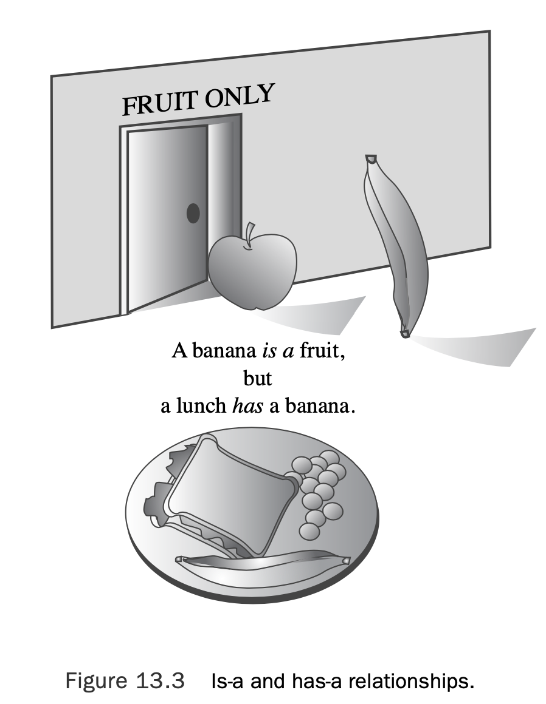
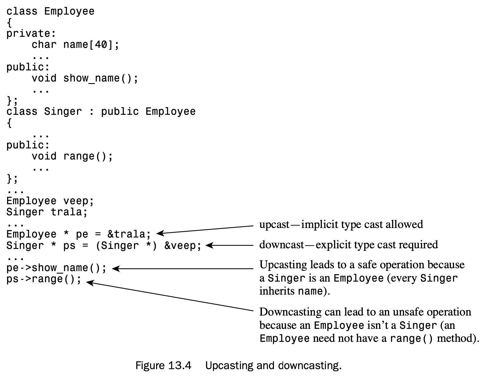
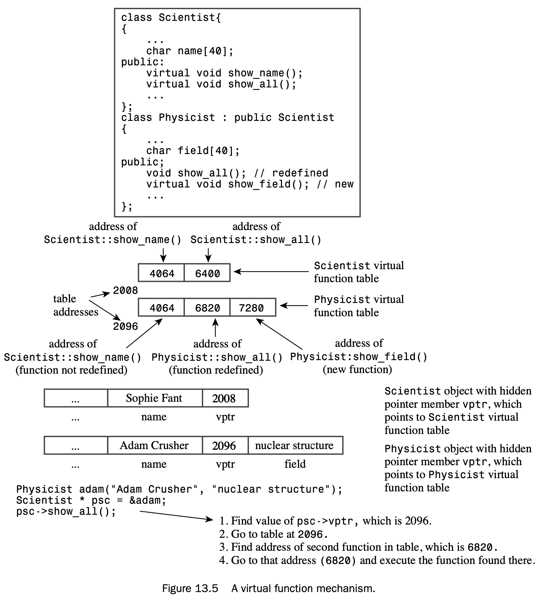
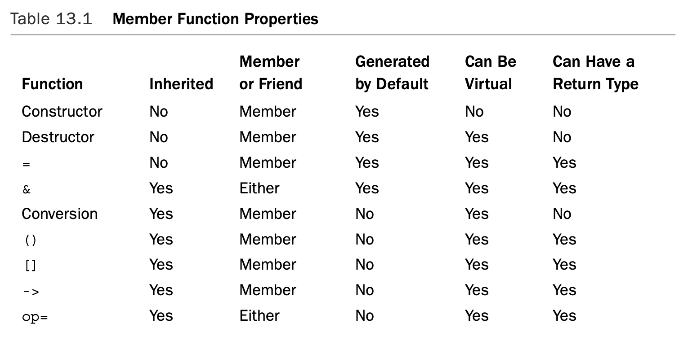
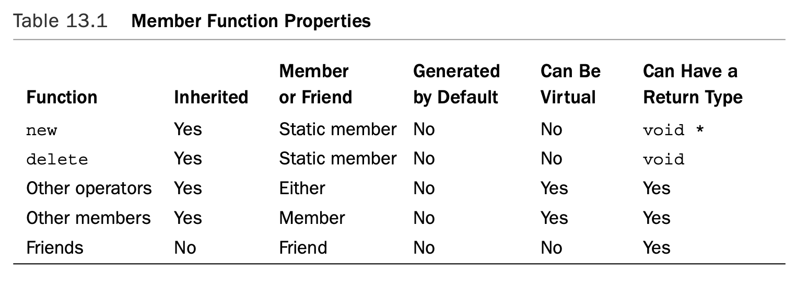

# Chapter 13 Class Inheritance

[TOC]

## Beginning with a Simple Base Class

When one class inherits from another, the original class is called a **base class**, and the inheriting class is called a **derived class**. 

```c++
// tabtenn0.h -- a table-tennis base class 
#ifndef TABTENN0_H_
#define TABTENN0_H_
#include <string>
using std::string;
// simple base class 
class TableTennisPlayer 
{
private:
    string firstname; 
    string lastname; 
    bool hasTable;
public:
    TableTennisPlayer (const string & fn = "none",
                    const string & ln = "none", bool ht = false);
    void Name() const;
    bool HasTable() const { return hasTable; }; 
    void ResetTable(bool v) { hasTable = v; };
}; 
#endif
```

```c++
//tabtenn0.cpp -- simple base-class methods 
#include "tabtenn0.h"
#include <iostream>
TableTennisPlayer::TableTennisPlayer (const string & fn,
    const string & ln, bool ht) : firstname(fn),
        lastname(ln), hasTable(ht) {}

void TableTennisPlayer::Name() const 
{
    std::cout << lastname << ", " << firstname; 
}
```

```c++
// usett0.cpp -- using a base class 
#include <iostream>
#include "tabtenn0.h"

int main ( void ) 
{
    using std::cout;
    TableTennisPlayer player1("Chuck", "Blizzard", true); 
    TableTennisPlayer player2("Tara", "Boomdea", false); 
    player1.Name();
    if (player1.HasTable())
        cout << ": has a table.\n"; 
    else
        cout << ": hasn't a table.\n"; 
    player2.Name();
    if (player2.HasTable()) 
        cout << ": has a table";
    else
        cout << ": hasn't a table.\n";
        
    return 0; 
}
```

And here’s the output of the program in Listings 13.1, 13.2, and 13.3:

```shell
Blizzard, Chuck: has a table.
Boomdea, Tara: hasn't a table.
```

### Deriving a Class

The first step is to have the `RatedPlayer` class declaration show that it derives from the `TableTennisPlayer` class:

```c++
// RatedPlayer derives from the TableTennisPlayer base class 
class RatedPlayer : public TableTennisPlayer
{
...
};
```

The colon indicates that the `RatedPlayer` class is based on the `TableTennisPlayer` class. This particular heading indicates that `TableTennisPlayer` is a public base class; this is termed **public derivation**. With public derivation, the public members of the base class become public members of the derived class.The private portions of a base class become part of the derived class, but they can be accessed only through public and protected methods of the base class. 

What needs to be added to these inherited features?

* A derived class needs its own constructors.
* A derived class can add additional data members and member functions as needed.


```c++
// simple derived class
class RatedPlayer : public TableTennisPlayer 
{
private:
	unsigned int rating; 	// add a data member
public:
    RatedPlayer (unsigned int r = 0, const string & fn = "none",
    			 const string & ln = "none", bool ht = false); 
    RatedPlayer(unsigned int r, const TableTennisPlayer & tp); 
    unsigned int Rating() const { return rating; } 	// add a method 
    void ResetRating (unsigned int r) {rating = r;} // add a method
};
```

### Constructors: Access Considerations

C++ uses the member initializer list syntax to accomplish this. Here, for instance, is the code for the first `RatedPlayer` constructor:

```c++
RatedPlayer::RatedPlayer(unsigned int r, const string & fn, 
	const string & ln, bool ht) : TableTennisPlayer(fn, ln, ht)
{
	rating = r;
}
```

The following part is the member initializer list:

```c++
: TableTennisPlayer(fn, ln, ht)
```

It’s executable code, and it calls the `TableTennisPlayer` constructor. Suppose, for

example, a program has the following declaration:

```c++
RatedPlayer rplayer1(1140, "Mallory", "Duck", true);
```

The `RatedPlayer` constructor assigns the actual arguments `"Mallory"`, `"Duck"`, and `true` to the formal parameters `fn`, `ln`, and `ht`. It then passes these parameters on as actual arguments to the `TableTennisPlayer` constructor.This constructor, in turn, creates the embedded `TableTennisPlayer` object and stores the data `"Mallory"`, `"Duck"`, and `true` in it.Then the program enters the body of the `RatedPlayer` constructor, completes the construction of the `RatedPlayer` object, and assigns the value of the parameter `r` (that is, `1140`) to the `rating` member (see Figure 13.2 for another example).


Now let’s look at code for the second constructor:

```c++
RatedPlayer::RatedPlayer(unsigned int r, const TableTennisPlayer & tp)
    : TableTennisPlayer(tp)
{
	rating = r;
}
```

You may, if you like, also use member initializer list syntax for members of the derived class. In this case, you use the member name instead of the class name in the list.

```c++
// alternative version
RatedPlayer::RatedPlayer(unsigned int r, const TableTennisPlayer & tp)
	: TableTennisPlayer(tp), rating(r) 
{
}
```

These are the key points about constructors for derived classes:

* The base-class object is constructed first.
* The derived-class constructor should pass base-class information to a base-class constructor via a member initializer list.
* The derived-class constructor should initialize the data members that were added to the derived class.

### Using a Derived Class

```c++
// tabtenn1.h -- a table-tennis base class 
#ifndef TABTENN1_H_
#define TABTENN1_H_
#include <string>
using std::string;
// simple base class 
class TableTennisPlayer 
{
private:
    string firstname; 
    string lastname; 
    bool hasTable;
public:
    TableTennisPlayer (const string & fn = "none",
                    const string & ln = "none", bool ht = false);
    void Name() const;
    bool HasTable() const { return hasTable; }; 
    void ResetTable(bool v) { hasTable = v; };
}; 

// simple derived class
class RatedPlayer : public TableTennisPlayer 
{
private:
    unsigned int rating; 
public:
    RatedPlayer (unsigned int r = 0, const string & fn = "none", 
                 const string & ln = "none", bool ht = false); 
    RatedPlayer(unsigned int r, const TableTennisPlayer & tp);
    unsigned int Rating() const { return rating; }
    void ResetRating (unsigned int r) {rating = r;} 
};

#endif
```

```c++
//tabtenn1.cpp -- simple base-class methods 
#include "tabtenn1.h"
#include <iostream>

TableTennisPlayer::TableTennisPlayer (const string & fn,
    const string & ln, bool ht) : firstname(fn),
        lastname(ln), hasTable(ht) {}

void TableTennisPlayer::Name() const 
{
    std::cout << lastname << ", " << firstname; 
}

// RatedPlayer methods
RatedPlayer::RatedPlayer(unsigned int r, const string & fn,
    const string & ln, bool ht) : TableTennisPlayer(fn, ln, ht)
{
    rating = r;
}
RatedPlayer::RatedPlayer(unsigned int r, const TableTennisPlayer & tp)
    : TableTennisPlayer(tp), rating(r)
{
}
```

```c++
// usett1.cpp -- using a base class 
#include <iostream>
#include "tabtenn1.h"

int main ( void ) 
{
    using std::cout;
    using std::endl;
    TableTennisPlayer player1("Tara", "Boomdea", false); 
    RatedPlayer rplayer1(1140, "Mallory", "Duck", true);
    rplayer1.Name();            // derived object uses base method
    if (rplayer1.HasTable())
        cout << ": has a table.\n"; 
    else
        cout << ": hasn't a table.\n"; 
    player1.Name();             // base object uses base method
    if (player1.HasTable()) 
        cout << ": has a table";
    else
        cout << ": hasn't a table.\n";
    cout << "Name: ";
    rplayer1.Name();
    cout << "; Rating: " << rplayer1.Rating() << endl;
// initialize RatedPlayer using TableTennisPlayer object
    RatedPlayer rplayer2(1212, player1);
    cout << "Name: ";
    rplayer2.Name();
    cout << "; Rating: " << rplayer2.Rating() << endl;

    return 0; 
}
```

Here is the output of the program in Listings 13.4, 13.5, and 13.6:

```shell
Duck, Mallory: has a table.
Boomdea, Tara: hasn't a table.
Name: Duck, Mallory; Rating: 1140
Name: Boomdea, Tara; Rating: 1212
```

### Special Relationships Between Derived and Base Classes

A derived class has some special relationships with the base class. One, which you’ve just seen, is that a derived-class object can use base-class methods, provided that the methods are not private:

```c++
RatedPlayer rplayer1(1140, "Mallory", "Duck", true); 
rplayer1.Name(); // derived object uses base method
```

A base-class pointer can point to a derived-class object without an explicit type cast and that a base-class reference can refer to a derived-class object without an explicit type cast:

```c++
RatedPlayer rplayer1(1140, "Mallory", "Duck", true); TableTennisPlayer & rt = rplayer;
TableTennisPlayer * pt = &rplayer;
rt.Name(); // invoke Name() with reference 
pt->Name(); // invoke Name() with pointer
```

However, a base-class pointer or reference can invoke just base-class methods, so you couldn’t use `rt` or `pt` to invoke, say, the derived-class `ResetRanking()` method.

However, the rule relaxation is just in one direction. You can’t assign base-class objects and addresses to derived-class references and pointers:

```c++
TableTennisPlayer player("Betsy", "Bloop", true); 
RatedPlayer & rr = player; // NOT ALLOWED 
RatedPlayer * pr = player; // NOT ALLOWED
```

Functions defined with base-class reference or pointer arguments can be used with either base-class or derived-class objects. For instance, consider this function:

```c++
void Show(const TableTennisPlayer & rt) 
{
	using std::cout; cout << "Name: "; 
    rt.Name();
    cout << "\nTable: "; 
    if (rt.HasTable())
    	cout << "yes\n"; 
    else
    	cout << "no\n";
}
```

You can use `Show()` with either a `TableTennis` argument or a `RatedPlayer` argument:

```c++
TableTennisPlayer player1("Tara", "Boomdea", false); 
RatedPlayer rplayer1(1140, "Mallory", "Duck", true); 
Show(player1); 	// works with TableTennisPlayer argument 
Show(rplayer1); // works with RatedPlayer argument
```

A similar relationship would hold for a function with a pointer-to-base-class formal parameter; it could be used with either the address of a base-class object or the address of a derived-class object as an actual argument:

```c++
void Wohs(const TableTennisPlayer * pt); // function with pointer parameter 
...
TableTennisPlayer player1("Tara", "Boomdea", false);
RatedPlayer rplayer1(1140, "Mallory", "Duck", true);
Wohs(&player1); 	// works with TableTennisPlayer * argument 
Wohs(&rplayer1); 	// works with RatedPlayer * argument
```

The reference compatibility property also allows you to initialize a base-class object to a derived-class object, although somewhat indirectly. Suppose you have this code:

```c++
RatedPlayer olaf1(1840, "Olaf", "Loaf", true); 
TableTennisPlayer olaf2(olaf1);
```

The attempt to initialize `olaf2` to `olaf1` uses this constructor, which copies the `firstname`, `lastname`, and `hasTable` members. In other words, it initializes `olaf2` to the `TableTennisPlayer` object embedded in the RatedPlayer object `olaf1`.

## Inheritance: An **Is-a** Relationship

C++ has three varieties of inheritance: public, protected, and private. Public inheritance is the most common form, and it models an **is-a** relationship. 

Public inheritance doesn’t model a **has-a** relationship.A lunch, for example, might contain a fruit. But a lunch, in general, is not a fruit. Therefore, you should not derive a `Lunch` class from the `Fruit` class in an attempt to place fruit in a lunch.The correct way to handle putting fruit into a lunch is to consider the matter as a **has-a** relationship:A lunch has a fruit. As you’ll see in Chapter 14,that’s most easily modeled by including aFruitobject as a data member of a Lunch class (see Figure13.3).




Public inheritance doesn’t model an **is-like-a** relationship—that is, it doesn’t do similes. It’s often pointed out that lawyers are like sharks. But it is not literally true that a lawyer is a shark. For example, sharks can live underwater.Therefore, you shouldn’t derive a `Lawyer` class from a `Shark` class. Inheritance can add properties to a base class; it doesn’t remove properties from a base class. 

Public inheritance doesn’t model an **is-implemented-as-a** relationship. For example, you could implement a stack by using an array. However, it wouldn’t be proper to derive a `Stack` class from an `Array` class. A stack is not an array. 

Public inheritance doesn’t model a **uses-a** relationship. For example, a computer can use a laser printer, but it doesn’t make sense to derive a `Printer` class from a `Computer` class, or vice versa.

## Polymorphic Public Inheritance

This more sophisticated behavior is termed **polymorphic** (“having many forms”) because you can have multiple behaviors for a method, depending on the context.There are two key mechanisms for implementing polymorphic public inheritance:

* Redefining base-class methods in a derived class
* Using virtual methods

One class will represent its basic checking plan, the Brass Account, and the second class will represent the Brass Plus checking account, which adds an overdraft protection feature.That is, if a user writes a check larger (but not too much larger) than his or her balance, the bank will cover the check, charging the user for the excess payment and adding a surcharge.You can characterize the two accounts in terms of data to be stored and operations to be allowed.

First, here is the information for a Brass Account checking plan:

* Client name
* Account number
* Current balance

And here are the operations to be represented:

* Creating an account
* Depositing money into the account
* Withdrawing money from the account
* Displaying the account information

For the Brass Plus Account checking plan, the Pontoon National Bank wants all the features of the Brass Account as well as the following additional items of information:

* An upper limit to the overdraft protection
* An interest rate charged for overdraft loans
* The overdraft amount currently owed to the bank

No additional operations are needed, but two operations need to be implemented differently:

* The withdrawing money operation has to incorporate overdraft protection for the Brass Plus Account
* The display operation has to show the additional information required by the Brass Plus Account

### Developing the `Brass` and `BrassPlus` Classes

The Brass Account class information is pretty straightforward, but the bank hasn’t told you enough details about how the overdraft system works. In response to your request for further information, the friendly Pontoon National Bank representative tells you the following:

* A Brass Plus Account limits how much money the bank will lend you to cover over- drafts.The default value is $500, but some customers may start with a different limit.

* The bank may change a customer’s overdraft limit.

* A Brass Plus Account charges interest on the loan.The default value is 11.125%, but

    some customers may start with a different rate.

* The bank may change a customer’s interest rate.

* The account keeps track of how much the customer owes the bank (overdraft loans plus interest).The user cannot pay off this amount through a regular deposit or through a transfer from another account. Instead, he or she must pay in cash to a special bank officer, who will, if necessary, seek out the customer. When the debt is paid, the account can reset the amount owed to 0.

```c++
// brass.h -- bank account classes 
#ifndef BRASS_H_
#define BRASS_H_
#include <string>
// Brass Account Class 
class Brass
{
private:
    std::string fullName; 
    long acctNum;
    double balance;
public:
    Brass(const std::string & s = "Nullbody", long an = -1,
                double bal = 0.0); 
    void Deposit(double amt);
    virtual void Withdraw(double amt); 
    double Balance() const;
    virtual void ViewAcct() const; 
    virtual ~Brass() {}
};

//Brass Plus Account Class 
class BrassPlus : public Brass 
{
private:
    double maxLoan; 
    double rate; 
    double owesBank;
public:
    BrassPlus(const std::string & s = "Nullbody", long an = -1,
                    double bal = 0.0, double ml = 500,
                    double r = 0.11125); 
    BrassPlus(const Brass & ba, double ml = 500,
                                double r = 0.11125);
    virtual void ViewAcct()const;
    virtual void Withdraw(double amt);
    void ResetMax(double m) { maxLoan = m; } 
    void ResetRate(double r) { rate = r; }; 
    void ResetOwes() { owesBank = 0; }
};

#endif
```

There are several points to notice in Listing 13.7:

* The `BrassPlus` class adds three new private data members and three new public

    member functions to the `Brass` class.

* Both the `Brass` class and the `BrassPlus` class declare the `ViewAcct()` and `Withdraw() `methods; these are the methods that will behave differently for a `BrassPlus` object than they do with a `Brass` object.
* The `Brass` class uses the new keyword `virtual` in declaring `ViewAcct()` and `Withdraw()`.These methods are now termed **virtual methods**.
* The `Brass` class also declares a virtual destructor, even though the destructor does nothing.

The two `ViewAcct()` prototypes indicate that there will be two separate method definitions.The qualified name for the base-class version is `Brass::ViewAcct()`, and the qualified name for the derived-class version is `BrassPlus::ViewAcct()`. A program will use the object type to determine which version to use:

```c++
Brass dom("Dominic Banker", 11224, 4183.45); 
BrassPlus dot("Dorothy Banker", 12118, 2592.00); 
dom.ViewAcct(); 		// use Brass::ViewAcct() 
dot.ViewAcct(); 		// use BrassPlus::ViewAcct()
```

If you don’t use the keyword `virtual`, the program chooses a method based on the reference type or pointer type. If you do use the keyword `virtual`, the program chooses a method based on the type of object the reference or pointer refers to. Here is how a program behaves if `ViewAcct()` is not virtual:

```c++
// behavior with non-virtual ViewAcct()
// method chosen according to reference type 
Brass dom("Dominic Banker", 11224, 4183.45); 
BrassPlus dot("Dorothy Banker", 12118, 2592.00); 
Brass & b1_ref = dom;
Brass & b2_ref = dot;
b1_ref.ViewAcct(); 		// use Brass::ViewAcct() 
b2_ref.ViewAcct(); 		// use Brass::ViewAcct()
```

The reference variables are type `Brass`, so `Brass::ViewAccount()` is chosen. Using pointers to `Brass` instead of references results in similar behavior.

When a method is declared virtual in a base class, it is automatically virtual in the derived class, but it is a good idea to document which functions are `virtual` by using the keyword virtual in the derived class declarations, too. 

The base class declares a virtual destructor.This is to make sure that the correct sequence of destructors is called when a derived object is destroyed.

### Class Implementations

```c++

// brass.cpp -- bank account class methods 
#include <iostream>
#include "brass.h"
using std::cout;
using std::endl; 
using std::string;

// formatting stuff
typedef std::ios_base::fmtflags format; 
typedef std::streamsize precis;
format setFormat();
void restore(format f, precis p);

// Brass methods

Brass::Brass(const string & s, long an, double bal) 
{
    fullName = s; 
    acctNum = an; 
    balance = bal;
}

void Brass::Deposit(double amt) 
{
    if (amt < 0)
        cout << "Negative deposit not allowed; "
             << "deposit is cancelled.\n"; 
    else
        balance += amt;
}

void Brass::Withdraw(double amt) 
{
    // set up ###.## format
    format initialState = setFormat(); 
    precis prec = cout.precision(2);

    if (amt < 0)
        cout << "Withdrawal amount must be positive; "
             << "withdrawal canceled.\n"; 
    else if (amt <= balance)
        balance -= amt; 
    else
        cout << "Withdrawal amount of $" << amt 
             << " exceeds your balance.\n"
             << "Withdrawal canceled.\n";
    restore(initialState, prec); 
}

double Brass::Balance() const 
{
    return balance; 
}

void Brass::ViewAcct() const 
{
    // set up ###.## format
    format initialState = setFormat();
    precis prec = cout.precision(2);
    cout << "Client: " << fullName << endl;
    cout << "Account Number: " << acctNum << endl;
    cout << "Balance: $" << balance << endl; 
    restore(initialState, prec); // restore original format
}

// BrassPlus Methods
BrassPlus::BrassPlus(const string & s, long an, double bal,
        double ml, double r) : Brass(s, an, bal)
{
    maxLoan = ml;
    owesBank = 0.0;
    rate = r; 
}

BrassPlus::BrassPlus(const Brass & ba, double ml, double r)
            : Brass(ba)     // uses implicit copy constructor
{
    maxLoan = ml;
    owesBank = 0.0;
    rate = r; 
}

// redefine how ViewAcct() works 
void BrassPlus::ViewAcct() const 
{
    // set up ###.## format
    format initialState = setFormat();
    precis prec = cout.precision(2);

    Brass::ViewAcct(); // display base portion 
    cout << "Maximum loan: $" << maxLoan << endl; 
    cout << "Owed to bank: $" << owesBank << endl; 
    cout.precision(3); // ###.### format
    cout << "Loan Rate: " << 100 * rate << "%\n";
    restore(initialState, prec); 
}

// redefine how Withdraw() works 
void BrassPlus::Withdraw(double amt) 
{
    // set up ###.## format
    format initialState = setFormat(); 
    precis prec = cout.precision(2);
    double bal = Balance(); 
    if (amt <= bal)
        Brass::Withdraw(amt);
    else if ( amt <= bal + maxLoan - owesBank) 
    {
        double advance = amt - bal;
        owesBank += advance * (1.0 + rate);
        cout << "Bank advance: $" << advance << endl;
        cout << "Finance charge: $" << advance * rate << endl; 
        Deposit(advance);
        Brass::Withdraw(amt);
    } 
    else
        cout << "Credit limit exceeded. Transaction cancelled.\n"; 
    restore(initialState, prec);
}

format setFormat() {
    // set up ###.## format
    return cout.setf(std::ios_base::fixed,
                std::ios_base::floatfield);
}

void restore(format f, precis p) 
{
    cout.setf(f, std::ios_base::floatfield);
    cout.precision(p); 
}
```

`BrassPlus::ViewAcct()` displays the added `BrassPlus` data members and calls on the base-class method `Brass::ViewAcct()` to display the base-class data members. Using the scope-resolution operator in a derived-class method to invoke a base- class method is a standard technique.

It’s vital that the code use the scope-resolution operator. Suppose that, instead, you wrote the code this way:

```c++
// redefine erroneously how ViewAcct() works 
void BrassPlus::ViewAcct() const
{
...
	ViewAcct(); // oops! recursive call
...
}
```

If the code doesn’t use the scope-resolution operator, the compiler assumes that `ViewAcct() `is `BrassPlus::ViewAcct()`, and this creates a recursive function that has no termination—not a good thing.

The `ViewAcct()` and the `Withdraw()` methods use the `setf()` and `precision()` formatting methods to set the output mode for floating-point values to fixed-point, two places to the right of the decimal.When these modes are set, output stays in that mode, so the polite thing for these methods to do is to reset the formatting mode to its state prior to calling the methods. To avoid some code duplication, the program moves some of the formatting actions to helper functions:

```c++
// formatting stuff
typedef std::ios_base::fmtflags format; 
typedef std::streamsize precis;
format setFormat();
void restore(format f, precis p);
```

### Using the `Brass` and `BrassPlus` Classes

```c++
// usebrass1.cpp -- testing bank account classes 
// compile with brass.cpp
#include <iostream>
#include "brass.h"

int main() 
{
    using std::cout; 
    using std::endl;

    Brass Piggy("Porcelot Pigg", 381299, 4000.00); 
    BrassPlus Hoggy("Horatio Hogg", 382288, 3000.00); 
    Piggy.ViewAcct();
    cout << endl;
    Hoggy.ViewAcct();
    cout << endl;
    cout << "Depositing $1000 into the Hogg Account:\n"; 
    Hoggy.Deposit(1000.00);
    cout << "New balance: $" << Hoggy.Balance() << endl;
    cout << "Withdrawing $4200 from the Pigg Account:\n"; 
    Piggy.Withdraw(4200.00);
    cout << "Pigg account balance: $" << Piggy.Balance() << endl; 
    cout << "Withdrawing $4200 from the Hogg Account:\n"; 
    Hoggy.Withdraw(4200.00);
    Hoggy.ViewAcct();
    return 0; 
}
```

In the following output of the program in Listing 13.9, note that Hogg gets overdraft protection and Pigg does not:

```shell
Client: Porcelot Pigg
Account Number: 381299
Balance: $4000.00

Client: Horatio Hogg
Account Number: 382288
Balance: $3000.00
Maximum loan: $500.00
Owed to bank: $0.00
Loan Rate: 11.125%

Depositing $1000 into the Hogg Account:
New balance: $4000
Withdrawing $4200 from the Pigg Account:
Withdrawal amount of $4200.00 exceeds your balance.
Withdrawal canceled.
Pigg account balance: $4000
Withdrawing $4200 from the Hogg Account:
Bank advance: $200.00
Finance charge: $22.25
Client: Horatio Hogg
Account Number: 382288
Balance: $0.00
Maximum loan: $500.00
Owed to bank: $222.25
Loan Rate: 11.125%
```

### Showing Virtual Method Behavior

```c++
// usebrass2.cpp -- polymorphic example 
// compile with brass.cpp
#include <iostream>
#include <string>
#include "brass.h" 
const int CLIENTS = 4;

int main() 
{
    using std::cin; 
    using std::cout; 
    using std::endl;

    Brass * p_clients[CLIENTS]; 
    std::string temp;
    long tempnum;
    double tempbal;
    char kind;

    for (int i = 0; i < CLIENTS; i++) 
    {
        cout << "Enter client's name: "; 
        getline(cin,temp);
        cout << "Enter client's account number: "; 
        cin >> tempnum;
        cout << "Enter opening balance: $";
        cin >> tempbal;
        cout << "Enter 1 for Brass Account or "
            << "2 for BrassPlus Account: ";
        while (cin >> kind && (kind != '1' && kind != '2'))
            cout <<"Enter either 1 or 2: ";
        if (kind == '1')
            p_clients[i] = new Brass(temp, tempnum, tempbal);
        else 
        {
            double tmax, trate;
            cout << "Enter the overdraft limit: $"; 
            cin >> tmax;
            cout << "Enter the interest rate "
                << "as a decimal fraction: "; 
            cin >> trate;
            p_clients[i] = new BrassPlus(temp, tempnum, tempbal, 
                                        tmax, trate);
        }
        while (cin.get() != '\n')
            continue;
    }
    cout << endl;
    for (int i = 0; i < CLIENTS; i++) 
    {
        p_clients[i]->ViewAcct();
        cout << endl; 
    }
    for (int i = 0; i < CLIENTS; i++) 
    {
        delete p_clients[i]; // free memory 
    }
    cout << "Done.\n";
    return 0;
}
```

```shell
Enter client's name: Harry Potter
Enter client's account number: 112233
Enter opening balance: $1500
Enter 1 for Brass Account or 2 for BrassPlus Account: 1
Enter client's name: Dinah Otternoe
Enter client's account number: 121213
Enter opening balance: $1800
Enter 1 for Brass Account or 2 for BrassPlus Account: 2
Enter the overdraft limit: $350
Enter the interest rate as a decimal fraction: 0.0475
Enter client's name: Brenda Birdherd
Enter client's account number: 212118
Enter opening balance: $5200
Enter 1 for Brass Account or 2 for BrassPlus Account: 2
Enter the overdraft limit: $800
Enter the interest rate as a decimal fraction: 0.08
Enter client's name: Tim Turtletop
Enter client's account number: 233255
Enter opening balance: $688
Enter 1 for Brass Account or 2 for BrassPlus Account: 1

Client: Harry Potter
Account Number: 112233
Balance: $1500.00

Client: Dinah Otternoe
Account Number: 121213
Balance: $1800.00
Maximum loan: $350.00
Owed to bank: $0.00
Loan Rate: 4.750%

Client: Brenda Birdherd
Account Number: 212118
Balance: $5200.00
Maximum loan: $800.00
Owed to bank: $0.00
Loan Rate: 8.000%

Client: Tim Turtletop
Account Number: 233255
Balance: $688.00

Done.
```

The polymorphic aspect is provided by the following code:

```c++
for (int i = 0; i < CLIENTS; i++) 
{
    p_clients[i]->ViewAcct();
    cout << endl; 
}
```

If the array member points to a `Brass` object, `Brass::ViewAcct()` is invoked; if the array member points to a BrassPlus object, `BrassPlus::ViewAcct()` is invoked. If `Brass::ViewAcct() `were been declared as virtual, `Brass:ViewAcct()` would be invoked in all cases.

### The Need for Virtual Destructors

If the destructors are virtual, the destructor corresponding to the object type is called. So if a pointer points to a `BrassPlus` object, the `BrassPlus` destructor is called. And when a `BrassPlus` destructor finishes, it automatically calls the base-class constructor.Thus, using virtual destructors ensures that the correct sequence of destructors is called.

## Static and Dynamic Binding

Interpreting a function call in the source code as executing a particular block of function code is termed **binding** the function name. Binding that takes place during compilation is called **static binding** (or **early binding**). The compiler has to generate code that allows the correct virtual method to be selected as the program runs; this is called **dynamic binding** (or **late binding**).

### Pointer and Reference Type Compatibility

Normally, C++ does not allow you to assign an address of one type to a pointer of another type. Nor does it let a reference to one type refer to another type:

```c++
double x = 2.5;
int * pi = &x; // invalid assignment, mismatched pointer types 
long & rl = x; // invalid assignment, mismatched reference type
```

However, as you’ve seen, a reference or a pointer to a base class can refer to a derived- class object without using an explicit type cast. For example, the following initializations are allowed:

```c++
BrassPlus dilly ("Annie Dill", 493222, 2000); 
Brass * pb = &dilly; 	// ok
Brass & rb = dilly; 	// ok
```

Converting a derived-class reference or pointer to a base-class reference or pointer is called **upcasting**, and it is always allowed for public inheritance without the need for an explicit type cast. If you derive a `BrassPlusPlus` class from `BrassPlus`, then a `Brass` pointer or reference can refer to a `Brass` object, a `BrassPlus` object, or a `BrassPlusPlus` object.

The opposite process, converting a base-class pointer or reference to a derived-class pointer or reference, is called **downcasting**, and it is not allowed without an explicit type cast. A derived class could add new data members, and the class member functions that used these data members wouldn’t apply to the base class. 



Upcasting also takes place for function calls with base-class references or pointers as parameters. Consider the following code fragment, and suppose each function calls upon the virtual method `ViewAcct()`:

```c++
void fr(Brass & rb); // uses rb.ViewAcct() 
void fp(Brass * pb); // uses pb->ViewAcct() 
void fv(Brass b); // uses b.ViewAcct() 
int main()
{
	Brass b("Billy Bee", 123432, 10000.0); 
    BrassPlus bp("Betty Beep", 232313, 12345.0); 
    fr(b); 	// uses Brass::ViewAcct()
	fr(bp); // uses BrassPlus::ViewAcct() 
    fp(b); 	// uses Brass::ViewAcct()
	fp(bp); // uses BrassPlus::ViewAcct()
    fv(b); 	// uses Brass::ViewAcct() 
    fv(bp); // uses Brass::ViewAcct()
...
}
```

Passing by value causes only the `Brass` component of a `BrassPlus` object to be passed to the `fv()` function. 

### Virtual Member Functions and Dynamic Binding

Consider the following code:

```c++
BrassPlus ophelia; 			// derived-class object
Brass * bp;					// base-class pointer
bp = &ophelia; 				// Brass pointer to BrassPlus object 
bp->ViewAcct();				// which version?
```

In this example, you can see that the object type is `BrassPlus`, but, in general, (as in Listing 13.10) the object type might only be determined when the program is running. Therefore, the compiler generates code that binds `ViewAcct()` to `Brass::ViewAcct()` or `BrassPlus::ViewAcct()`, depending on the object type, while the program executes. In short, the compiler uses dynamic binding for virtual methods.

#### Why Two Kinds of Binding and Why Static Is the Default

There are two reasons: efficiency and a conceptual model.

First, let’s consider efficiency. For a program to be able to make a runtime decision, it has to have some way to keep track of what sort of object a base-class pointer or reference refers to, and that entails some extra processing overhead.

Next, let’s consider the conceptual model.When you design a class, you may have member functions that you don’t want redefined in derived classes. 

#### How Virtual Functions Work

The usual way compilers handle virtual functions is to add a hidden member to each object.The hidden member holds a pointer to an array of function addresses. Such an array is usually termed a **virtual function table** (**vtbl**).The vtbl holds the addresses of the virtual functions declared for objects of that class. 



In short, using virtual functions has the following modest costs in memory and execu- tion speed:

* Each object has its size increased by the amount needed to hold an address.

* For each class, the compiler creates a table (an array) of addresses of virtual functions.
* For each function call, there’s an extra step of going to a table to look up an address.

### Things to Know About Virtual Methods

* Beginning a class method declaration with the keyword `virtual` in a base class makes the function virtual for the base class and all classes derived from the base class, including classes derived from the derived classes, and so on.
* If a virtual method is invoked by using a reference to an object or by using a pointer to an object, the program uses the method defined for the object type rather than the method defined for the reference or pointer type.This is called **dynamic**, or **late**, **binding**. This behavior is important because it’s always valid for a base-class pointer or reference to refer to an object of a derived type.
* If you’re defining a class that will be used as a base class for inheritance, you should declare as virtual functions the class methods that may have to be redefined in derived classes.

#### Constructors

Constructors can’t be virtual. Creating a derived object invokes a derived-class construc- tor, not a base-class constructor.

#### Destructors

Destructors should be virtual unless a class isn’t to be used as a base class. For example, suppose `Employee` is a base class and `Singer` is a derived class that adds a` char *` member that points to memory allocated by `new.Then`, when a `Singer` object expires, it’s vital that the `~Singer()` destructor be called to free that memory. 

Now consider the following code:

```c++
Employee * pe = new Singer; // legal because Employee is base for Singer 
...
delete pe; // ~Employee() or ~Singer()?
```

If the destructors are virtual, the same code invokes the `~Singer()` destructor, which frees memory pointed to by the `Singer` component, and then calls the `~Employee()` destructor to free memory pointed to by the `Employee` component.

Note that this implies that even if a base class doesn’t require the services of an explicit destructor, you shouldn’t rely on the default constructor. Instead, you should provide a vir- tual destructor, even if it has nothing to do:

```c++
virtual ~BaseClass() { }
```

#### Friends

Friends can’t be virtual functions because friends are not class members, and only members can be virtual functions. 

#### No Redefinition

If a derived class fails to redefine a function (virtual or not), the class will use the base class version of the function. If a derived class is part of a long chain of derivations, it will use the most recently defined version of the function.The exception is if the base versions are hidden, as described next.

#### Redefinition Hides Methods

Suppose you create something like the following:

```c++
class Dwelling 
{
public:
	virtual void showperks(int a) const;
...
};
class Hovel : public Dwelling
{
public:
	virtual void showperks() const;
...
};
```

This causes a problem.You might get a compiler warning similar to the following:

```c++
Warning: Hovel::showperks(void) hides Dwelling::showperks(int)
```

Or perhaps you won’t get a warning. Either way, the code has the following implications:

```c++
Hovel trump;
trump.showperks(); 	// valid 
trump.showperks(5); // invalid
```

If you redefine a function in a derived class, it doesn’t just over-ride the base class declaration with the same function signature. Instead, it hides **all** base-class methods of the same name, regardless of the argument signatures.

One relatively new exception to this rule is that a return type that is a reference or pointer to a base class can be replaced by a reference or pointer to the derived class.This feature is termed **covariance of return type** because the return type is allowed to vary in parallel with the class type:

```c++
class Dwelling 
{
public:
// a base method
	virtual Dwelling & build(int n); 
    ...
};
class Hovel : public Dwelling
{
public:
// a derived method with a covariant return type
	virtual Hovel & build(int n); 	// same function signature 
    ...
};
```

Note that this exception applies only to return values, not to arguments.

Second, if the base class declaration is overloaded, you need to redefine all the base- class versions in the derived class:

```c++
class Dwelling
{
public:
// three overloaded showperks()
	virtual void showperks(int a) const; 
    virtual void showperks(double x) const; 
    virtual void showperks() const;
	...
};
class
{
public:
// three redefined showperks()
	virtual void showperks(int a) const; 
    virtual void showperks(double x) const; 
    virtual void showperks() const;
	...
};
```

If you redefine just one version, the other two become hidden and cannot be used by objects of the derived class. Note that if no change is needed, the redefinition can simply call the base-class version:

```c++
void Hovel::showperks() const {Dwelling::showperks();}
```

## Access Control: `protected`

The `protected` keyword is like `private` in that the outside world can access class members in a `protected` section only by using `public` class members.The difference between `private` and `protected` comes into play only within classes derived from the base class. Members of a derived class can access protected members of a base class directly, but they cannot directly access private members of the base class. 

For example, suppose the `Brass` class declared the `balance` member as protected:

```c++
class Brass 
{ 
protected:
	double balance; 
...
};
```

In this case, the `BrassPlus` class could access `balance` directly without using `Brass` methods. For example, the core of `BrassPlus::Withdraw()` could be written this way:

```c++
void BrassPlus::Withdraw(double amt) 
{
    if (amt < 0)
    	cout << "Withdrawal amount must be positive; "
    		 << "withdrawal canceled.\n";
    else if (amt <= balance) 		// access balance directly
    	balance -= amt;
    else if ( amt <= balance + maxLoan - owesBank) 
    {
        double advance = amt - balance;
        owesBank += advance * (1.0 + rate);
        cout << "Bank advance: $" << advance << endl;
        cout << "Finance charge: $" << advance * rate << endl; 	
        Deposit(advance);
        balance -= amt;
    } 
        else
        cout << "Credit limit exceeded. Transaction cancelled.\n";
}
```

If `balance` were protected, you could write code like this:

> You should prefer private to protected access control for class data members, and you should use base-class methods to provide derived classes access to base-class data.

## Abstract Base Classes

Sometimes applying the **is-a** rule is not as simple as it might appear. Suppose, for example, you are developing a graphics program that is supposed to represent, among other things, circles and ellipses. A circle is a special case of an ellipse: It’s an ellipse whose long axis is the same as its short axis.Therefore, all circles are ellipses, and it is tempting to derive a `Circle` class from an `Ellipse` class. But when you get to the details, you may find problems.

Data members could include the coordinates of the center of the ellipse, the semimajor axis (half the long diameter), the semiminor axis (half the short diameter), and an orientation angle that gives the angle from the horizontal coordinate axis to the semimajor axis.Also the class could include methods to move the ellipse, to return the area of the ellipse, to rotate the ellipse, and to scale the semimajor and semiminor axes:

```c++
class Ellipse 
{
private:
	double x; 
    double y; 
    double a; 
    double b; 
    double angle; 
    ...
public: 
    ...
    void Move(int nx, ny) { x = nx; y = ny; }
    virtual double Area() const { return 3.14159 * a * b; } 
    virtual void Rotate(double nang) { angle += nang; }
    virtual void Scale(double sa, double sb) { a *= sa; b *= sb; } 
    ...
};
```

Now suppose you derive a `Circle` class from the `Ellipse` class:

```c++
class Circle : public Ellipse 
{
	...
};
```

A circle needs only a single value, its radius, to describe its size and shape instead of having a semimajor axis (`a`) and semiminor axis (`b`).The Circle constructors can take care of that by assigning the same value to both the `a` and `b` members, but then you have redundant representation of the same information.The `angle` parameter and the `Rotate()` method don’t really make sense for a circle, and the `Scale()` method, as it stands, can change a circle to a non-circle by scaling the two axes differently.You can try fixing things with tricks, such as putting a redefined `Rotate()` method in the private section of the `Circle` class so that `Rotate()` can’t be used publicly with a circle, but, on the whole, it seems simpler to define a `Circle` class without using inheritance:

```c++
class Circle 	// no inheritance
{
private:
	double x; 	// x-coordinate of the circle's center
    double y; 	// y-coordinate of the circle's center
    double r; 	// radius
    ...
public: 
    ...
    void Move(int nx, ny) { x = nx; y = ny; }
    double Area() const { return 3.14159 * r * r; }
    void Scale(double sr) { r *= sr; }
    ...
};
```

There is another solution:You can abstract from the `Ellipse` and `Circle` classes what they have in common and place those features in an ABC. Next, you derive both the `Circle` and `Ellipse` classes from the ABC.

C++ has a way to provide an unimplemented function by using a **pure virtual function**. A pure virtual function has `= 0` at the end of its declaration, as shown for the `Area()` method:

```c++
class BaseEllipse // abstract base class
{
private:
    double x;	// x-coordinate of center
    double y;	// y-coordinate of center
    ...
public:
    BaseEllipse(double x0 = 0, double y0 = 0) : x(x0),y(y0) {} 	
    virtual ~BaseEllipse() {}
    void Move(int nx, ny) { x = nx; y = ny; }
	virtual double Area() const = 0; // a pure virtual function
	...
}
```

When a class declaration contains a pure virtual function, you can’t create an object of that class.The idea is that classes with pure virtual functions exist solely to serve as base classes. For a class to be a genuine ABC, it has to have at least one pure virtual function. 

In short, the `= 0` in the prototype indicates that the class is an abstract base class and that the class doesn’t necessarily have to define the function.

### Applying the ABC Concept

```c++
// acctabc.h -- bank account classes 
#ifndef ACCTABC_H_
#define ACCTABC_H_
#include <iostream>
#include <string>

// Abstract Base Class 
class AcctABC
{
private:
    std::string fullName; 
    long acctNum; 
    double balance;
protected:
    struct Formatting 
    {
        std::ios_base::fmtflags flag;
        std::streamsize pr; 
    };
    const std::string & FullName() const {return fullName;} 
    long AcctNum() const {return acctNum;}
    Formatting SetFormat() const;
    void Restore(Formatting & f) const;
public:
    AcctABC(const std::string & s = "Nullbody", long an = -1,
            double bal = 0.0); 
    void Deposit(double amt) ;
    virtual void Withdraw(double amt) = 0;  // pure virtual function 
    double Balance() const {return balance;};
    virtual void ViewAcct() const = 0;      // pure virtual function
    virtual ~AcctABC() {} 
};

// Brass Account Class 
class Brass :public AcctABC 
{
public:
    Brass(const std::string & s = "Nullbody", long an = -1, 
            double bal = 0.0) : AcctABC(s, an, bal) { }
    virtual void Withdraw(double amt); 
    virtual void ViewAcct() const; 
    virtual ~Brass() {}
};

//Brass Plus Account Class
class BrassPlus : public AcctABC 
{
private:
    double maxLoan; 
    double rate; 
    double owesBank;
public:
    BrassPlus(const std::string & s = "Nullbody", long an = -1,
            double bal = 0.0, double ml = 500,
            double r = 0.10);
    BrassPlus(const Brass & ba, double ml = 500, double r = 0.1); 
    virtual void ViewAcct()const;
    virtual void Withdraw(double amt);
    void ResetMax(double m) { maxLoan = m; }
    void ResetRate(double r) { rate = r; };
    void ResetOwes() { owesBank = 0; }
}; 
#endif
```

The next step is to implement the methods that don’t already have inline definitions. Listing 13.12 does that.

```c++
// acctabc.cpp -- bank account class methods 
#include <iostream>
#include "acctabc.h"
using std::cout;
using std::ios_base; 
using std::endl; 
using std::string;

// Abstract Base Class
AcctABC::AcctABC(const string & s, long an, double bal) 
{
    fullName = s; acctNum = an; balance = bal;
}

void AcctABC::Deposit(double amt) 
{
    if (amt < 0)
        cout << "Negative deposit not allowed; "
             << "deposit is cancelled.\n";
    else
        balance += amt;
}

void AcctABC::Withdraw(double amt)
{
    balance -= amt;
}

// protected methods for formatting 
AcctABC::Formatting AcctABC::SetFormat() const 
{
// set up ###.## format 
    Formatting f; 
    f.flag =
        cout.setf(ios_base::fixed, ios_base::floatfield); 
    f.pr = cout.precision(2);
    return f;
}

void AcctABC::Restore(Formatting & f) const 
{
    cout.setf(f.flag, ios_base::floatfield);
    cout.precision(f.pr); 
}

// Brass methods
void Brass::Withdraw(double amt) 
{
    if (amt < 0)
        cout << "Withdrawal amount must be positive; "
             << "withdrawal canceled.\n"; 
    else if (amt <= Balance())
        AcctABC::Withdraw(amt); 
    else
        cout << "Withdrawal amount of $" << amt
             << " exceeds your balance.\n"
             << "Withdrawal canceled.\n";
}

void Brass::ViewAcct() const 
{
    Formatting f = SetFormat();
    cout << "Brass Client: " << FullName() << endl; 
    cout << "Account Number: " << AcctNum() << endl;
    cout << "Balance: $" << Balance() << endl;
    Restore(f); 
}

// BrassPlus Methods
BrassPlus::BrassPlus(const string & s, long an, double bal,
            double ml, double r) : AcctABC(s, an, bal)
{
    maxLoan = ml;
    owesBank = 0.0;
    rate = r; 
}

BrassPlus::BrassPlus(const Brass & ba, double ml, double r)
            : AcctABC(ba)   // uses implicit copy constructor
{
    maxLoan = ml;
    owesBank = 0.0;
    rate = r;
}

void BrassPlus::ViewAcct() const
{
    Formatting f = SetFormat();
    cout << "BrassPlus Client: " << FullName() << endl; 
    cout << "Account Number: " << AcctNum() << endl; 
    cout << "Balance: $" << Balance() << endl;
    cout << "Maximum loan: $" << maxLoan << endl;
    cout << "Owed to bank: $" << owesBank << endl; 
    cout.precision(3);
    cout << "Loan Rate: " << 100 * rate << "%\n"; 
    Restore(f);
}

void BrassPlus::Withdraw(double amt) 
{
    Formatting f = SetFormat();

    double bal = Balance(); 
    if (amt <= bal)
        AcctABC::Withdraw(amt);
    else if ( amt <= bal + maxLoan - owesBank) 
    {
        double advance = amt - bal; 
        owesBank += advance * (1.0 + rate);
        cout << "Bank advance: $" << advance << endl;
        cout << "Finance charge: $" << advance * rate << endl; Deposit(advance);
        AcctABC::Withdraw(amt);
    } 
    else
        cout << "Credit limit exceeded. Transaction cancelled.\n";
    Restore(f);
}
```

```c++
// usebrass3.cpp -- polymorphic example using an abstract base class 
// compile with acctacb.cpp
#include <iostream>
#include <string>
#include "acctabc.h" 
const int CLIENTS = 4;

int main() 
{
    using std::cin; 
    using std::cout; 
    using std::endl;
    AcctABC * p_clients[CLIENTS]; std::string temp;
    long tempnum;
    double tempbal;
    char kind;
    for (int i = 0; i < CLIENTS; i++) 
    {
        cout << "Enter client's name: "; getline(cin,temp);
        cout << "Enter client's account number: "; cin >> tempnum;
        cout << "Enter opening balance: $";
        cin >> tempbal;
        cout << "Enter 1 for Brass Account or "
             << "2 for BrassPlus Account: ";
        while (cin >> kind && (kind != '1' && kind != '2')) 
            cout <<"Enter either 1 or 2: ";
        if (kind == '1')
            p_clients[i] = new Brass(temp, tempnum, tempbal);
        else 
        {
            double tmax, trate;
            cout << "Enter the overdraft limit: $"; 
            cin >> tmax;
            cout << "Enter the interest rate "
                 << "as a decimal fraction: "; 
                 cin >> trate;
            p_clients[i] = new BrassPlus(temp, tempnum, tempbal, 
                                         tmax, trate);
        }
        while (cin.get() != '\n')
            continue;
    }
    cout << endl;
    for (int i = 0; i < CLIENTS; i++) 
    {
        p_clients[i]->ViewAcct();
        cout << endl; 
    }
    for (int i = 0; i < CLIENTS; i++) 
    {
        delete p_clients[i];    // free memory 
    }
    cout << "Done.\n";

    return 0; 
}
```

## Inheritance and Dynamic Memory Allocation

### Case 1: Derived Class Doesn’t Use `new`

Suppose you begin with the following base class that uses dynamic memory allocation:

```c++
// Base Class Using DMA 
class baseDMA
{
private:
	char * label; 
    int rating;
public:
	baseDMA(const char * l = "null", int r = 0); 
    baseDMA(const baseDMA & rs);
	virtual ~baseDMA();
	baseDMA & operator=(const baseDMA & rs);
...
};
```

Now suppose you derive a lackDMA class from `baseDMA` and that `lackDMA` does not use new or have other unusual `design` features that require special treatment:

```c++
// derived class without DMA 
class lacksDMA :public baseDMA 
{
private:
	char color[40];
public:
...
};
```

The default destructor for a derived class always does something; it calls the base-class destructor after executing its own code. Because the `lackDMA` members, we assume, don’t require any special action, the default destructor is fine.

The default copy constructor for the `lacksDMA` class uses the explicit `baseDMA` copy constructor to copy the `baseDMA` portion of a `lacksDMA` object. So the default copy constructor is fine for the new `lacksDMA` member, and it’s also fine for the inherited `baseDMA` object.

The default assignment operator for a class automatically uses the base-class assignment operator for the base-class component. So it, too, is fine.

### Case 2: Derived Class Does Use `new`

Suppose that the derived class uses `new`:

```c++
// derived class with DMA 
class hasDMA :public baseDMA 
{
private:
	char * style; // use new in constructors 
public:
...
};
```

In this case, of course, you do have to define an explicit destructor, copy constructor, and assignment operator for the derived class. 

A derived class destructor automatically calls the base-class destructor, so its own responsibility is to clean up after what the derived-class constructors do.

```c++
baseDMA::~baseDMA() // takes care of baseDMA stuff 
{
	delete [] label; 
}
hasDMA::~hasDMA() 	// takes care of hasDMA stuff
{
	delete [] style; 
}
```

Next, consider copy constructors.

```c++
baseDMA::baseDMA(const baseDMA & rs) 
{
	label = new char[std::strlen(rs.label) + 1]; 
    std::strcpy(label, rs.label);
	rating = rs.rating;
}
```

The `hasDMA` copy constructor only has access to `hasDMA` data, so it must invoke the

`baseDMA` copy constructor to handle the `baseDMA` share of the data:

```c++
hasDMA::hasDMA(const hasDMA & hs)
		: baseDMA(hs)
{
	style = new char[std::strlen(hs.style) + 1]; 
    std::strcpy(style, hs.style);
}
```

The `baseDMA` copy constructor uses the `baseDMA` portion of the `hasDMA` argument to construct the `baseDMA` portion of the new object.

Next, consider assignment operators.The `baseDMA` assignment operator follows the usual pattern:

```c++
baseDMA & baseDMA::operator=(const baseDMA & rs) 
{
    if (this == &rs) 
        return *this;
    delete [] label;
    label = new char[std::strlen(rs.label) + 1]; 
    std::strcpy(label, rs.label);
    rating = rs.rating;
    return *this;
}
```

Because `hasDMA` also uses dynamic memory allocation, it, too, needs an explicit assignment operator. Being a `hasDMA` method, it only has direct access to `hasDMA` data.

```c++
hasDMA & hasDMA::operator=(const hasDMA & hs) 
{
    if (this == &hs) 
        return *this;
    baseDMA::operator=(hs); // copy base portion 
    delete [] style; 		// prepare for new style 
    style = new char[std::strlen(hs.style) + 1]; 
    std::strcpy(style, hs.style);
    return *this;
}
```

The following statement might look a little odd:

```c++
baseDMA::operator=(hs); // copy base portion 
```

But using function notation instead of operator notation lets you use the scope-resolution operator. In effect, the statement means the following:

```c++
*this = hs; 	// use baseDMA::operator=()
```

In summary, when both the base class and the derived class use dynamic memory allo- cation, the derived-class destructor, copy constructor, and assignment operator all must use their base-class counterparts to handle the base-class component.This common requirement is accomplished three different ways. 

* For a destructor, it is done automatically. 

* For a constructor, it is accomplished by invoking the base-class copy constructor in the member initialization list, or else the default constructor is invoked automatically. 

* For the assignment operator, it is accomplished by using the scope-resolution operator in an explicit call of the base-class assignment operator.

### An Inheritance Example with Dynamic Memory Allocation and Friends

```c++
// dma.h -- inheritance and dynamic memory allocation 
#ifndef DMA_H_
#define DMA_H_
#include <iostream>

// Base Class Using DMA 
class baseDMA
{
private:
    char * label; 
    int rating;
public:
    baseDMA(const char * l = "null", int r = 0); 
    baseDMA(const baseDMA & rs);
    virtual ~baseDMA();
    baseDMA & operator=(const baseDMA & rs);
    friend std::ostream & operator<<(std::ostream & os,
                                    const baseDMA & rs);
};

// derived class without DMA
// no destructor needed
// uses implicit copy constructor
// uses implicit assignment operator 
class lacksDMA :public baseDMA
{
private:
    enum { COL_LEN = 40};
    char color[COL_LEN]; 
public:
    lacksDMA(const char * c = "blank", const char * l = "null",
            int r = 0); 
    lacksDMA(const char * c, const baseDMA & rs);
    friend std::ostream & operator<<(std::ostream & os,
                                    const lacksDMA & rs);
};

// derived class with DMA 
class hasDMA :public baseDMA 
{
private:
    char * style; 
public:
    hasDMA(const char * s = "none", const char * l = "null", 
            int r = 0);
    hasDMA(const char * s, const baseDMA & rs); 
    hasDMA(const hasDMA & hs);
    ~hasDMA();
    hasDMA & operator=(const hasDMA & rs);
    friend std::ostream & operator<<(std::ostream & os,
                                    const hasDMA & rs);
};

#endif
```

```c++
// dma.cpp --dma class methods

#include "dma.h" 
#include <cstring>

// baseDMA methods 
baseDMA::baseDMA(const char * l, int r) 
{
    label = new char[std::strlen(l) + 1]; 
    std::strcpy(label, l);
    rating = r;
}

baseDMA::baseDMA(const baseDMA & rs) 
{
    label = new char[std::strlen(rs.label) + 1]; 
    std::strcpy(label, rs.label);
    rating = rs.rating;
}

baseDMA::~baseDMA() 
{
    delete [] label; 
}

baseDMA & baseDMA::operator=(const baseDMA & rs) 
{
    if (this == &rs) 
        return *this;
    delete [] label;
    label = new char[std::strlen(rs.label) + 1]; 
    std::strcpy(label, rs.label);
    rating = rs.rating;
    return *this;
}

std::ostream & operator<<(std::ostream & os, const baseDMA & rs) 
{
    os << "Label: " << rs.label << std::endl; 
    os << "Rating: " << rs.rating << std::endl; 
    return os;
}

// lacksDMA methods
lacksDMA::lacksDMA(const char * c, const char * l, int r)
    : baseDMA(l, r) 
{
    std::strncpy(color, c, 39);
    color[39] = '\0'; 
}

lacksDMA::lacksDMA(const char * c, const baseDMA & rs) 
    : baseDMA(rs)
{
    std::strncpy(color, c, COL_LEN - 1); 
    color[COL_LEN - 1] = '\0';
}

std::ostream & operator<<(std::ostream & os, const lacksDMA & ls) 
{
    os << (const baseDMA &) ls;
    os << "Color: " << ls.color << std::endl; 
    return os;
}

// hasDMA methods
hasDMA::hasDMA(const char * s, const char * l, int r)
    : baseDMA(l, r)
{
    style = new char[std::strlen(s) + 1]; 
    std::strcpy(style, s);
}

hasDMA::hasDMA(const char * s, const baseDMA & rs)
    : baseDMA(rs)
{
    style = new char[std::strlen(s) + 1]; 
    std::strcpy(style, s);
}

hasDMA::hasDMA(const hasDMA & hs)
    : baseDMA(hs) // invoke base class copy constructor
{
    style = new char[std::strlen(hs.style) + 1]; 
    std::strcpy(style, hs.style);
}

hasDMA::~hasDMA() 
{
    delete [] style; 
}

hasDMA & hasDMA::operator=(const hasDMA & hs) 
{
    if (this == &hs) 
        return *this;
    baseDMA::operator=(hs); // copy base portion 
    delete [] style; // prepare for new style 
    style = new char[std::strlen(hs.style) + 1]; 
    std::strcpy(style, hs.style);
    return *this;
}

std::ostream & operator<<(std::ostream & os, const hasDMA & hs) 
{
    os << (const baseDMA &) hs;
    os << "Style: " << hs.style << std::endl; 
    return os;
}
```

Consider, for example, the following friend to the `hasDMA` class:

```c++
friend std::ostream & operator<<(std::ostream & os,
                                 const hasDMA & rs);
```

Being a friend to the `hasDMA` class gives this function access to the `style` member. But there’s a problem: This function is not a friend to the `baseDMA` class, so how can it access the `label` and `rating` members?

 The solution is to use the `operator<<()` function that is a friend to the `baseDMA` class.

The next problem is that because friends are not member functions, you can’t use the scope-resolution operator to indicate which function to use. The solution to this problem is to use a type cast so that prototype matching will select the correct function. Thus, the code type casts the type `const hasDMA &` parameter to a type `const baseDMA &` argument:

```c++
std::ostream & operator<<(std::ostream & os, const hasDMA & hs) 
{
// type cast to match operator<<(ostream & , const baseDMA &)
    os << (const baseDMA &) hs;
    os << "Style: " << hs.style << endl; 
    return os;
}
```

```c++
// usedma.cpp -- inheritance, friends, and DMA
// compile with dma.cpp
#include <iostream>
#include "dma.h"
int main()
{
    using std::cout;
    using std::endl;

    baseDMA shirt("Portabelly", 8);
    lacksDMA balloon("red", "Blimpo", 4);
    hasDMA map("Mercator", "Buffalo Keys", 5);
    cout << "Displaying baseDMA object:\n";
    cout << shirt << endl;
    cout << "Displaying lacksDMA object:\n";
    cout << balloon << endl;
    cout << "Displaying hasDMA object:\n";
    cout << map << endl;
    lacksDMA balloon2(balloon);
    cout << "Result of lacksDMA copy:\n";
    cout << balloon2 << endl;
    hasDMA map2;
    map2 = map;
    cout << "Result of hasDMA assignment:\n";
    cout << map2 << endl;
    return 0;
}
```

Here’s the output of the program in Listings 13.14, 13.15, and 13.16:

```shell
Displaying baseDMA object:
Label: Portabelly
Rating: 8

Displaying lacksDMA object:
Label: Blimpo
Rating: 4
Color: red

Displaying hasDMA object:
Label: Buffalo Keys
Rating: 5
Style: Mercator

Result of lacksDMA copy:
Label: Blimpo
Rating: 4
Color: red

Result of hasDMA assignment:
Label: Buffalo Keys
Rating: 5
Style: Mercator

```

## Class Design Review

### Member Functions That the Compiler Generates for You

#### Default Constructors

A default constructor is one that has no arguments, or else one for which all the argu- ments have default arguments. If you don’t define any constructors, the compiler defines a default constructor for you. Its existence allows you to create objects. 

If you write a derived-class constructor without explicitly invoking a base-class constructor in the member initializer list, the compiler uses the base class default con- structor to construct the base class portion of the new object. If there is no base-class default constructor, you get a compile-time error in this situation.

If you define a constructor of any kind, the compiler does not define a default construc- tor for you. In that case, it’s up to you to provide a default constructor if one is needed.

If a class has any pointer members, they certainly should be initialized.Thus, it’s a good idea to supply an explicit default constructor that initializes all class data members to reasonable values.

#### Copy Constructors

A copy constructor for a class is a constructor that takes an object of the class type as its argument.Typically, the declared parameter is a constant reference to the class type. 

A class copy constructor is used in the following situations:

* When a new object is initialized to an object of the same class
* When an object is passed to a function by value
* When a function returns an object by value
* When the compiler generates a temporary object

If a program doesn’t use a copy constructor (explicitly or implicitly), the compiler pro- vides a prototype but not a function definition. Otherwise, the program defines a copy constructor that performs memberwise initialization.That is, each member of the new object is initialized to the value of the corresponding member of the original object. If a member is itself a class object, then memberwise initialization uses the copy constructor defined for that particular class.

### Assignment Operators

A default assignment operator handles assigning one object to another object of the same class. 

Default assignment uses memberwise assignment. If a member is itself a class object, then default memberwise assignment uses the assignment operator defined for that partic- ular class. If you need to define a copy constructor explicitly, you also need, for the same reasons, to define the assignment operator explicitly.

#### Other Class Method Considerations

##### Constructor Considerations

Constructors are different from other class methods in that they create new objects, whereas other methods are invoked by existing objects.This is one reason constructors aren’t inherited. Inheritance means a derived object can use a base-class method, but, in the case of constructors, the object doesn’t exist until after the constructor has done its work.

##### Destructor Considerations

You need to remember to define an explicit destructor that deletes any memory allocated by new in the class constructors and takes care of any other special bookkeeping that destroying a class object requires. If the class is to be used as a base class, you should pro- vide a virtual destructor even if the class doesn’t require a destructor.

##### Conversion Considerations

Suppose you have the following:

```c++
Star north;
north = "polaris";
```

The second statement would invoke the `Star::operator=(const Star &)` function, using `Star::Star(const char *)` to generate a `Star` object to be used as an argument for the assignment operator function.This assumes that you haven’t defined a (`char *`)- to-`Star` assignment operator.

Using explicit in the prototype for a one-argument constructor disables implicit conversions but still allows explicit conversions:

```c++
class Star 
{
... 
public:
	explicit Star(const char *);
...
};
...
Star north;
north = "polaris"; // not allowed 
north = Star("polaris"); // allowed
```

##### Passing an Object by Value Versus Passing a Reference

In general, if you write a function using an object argument, you should pass the object by reference rather than by value. One reason for this is efficiency. Passing an object by value involves generating a temporary copy, which means calling the copy constructor and then later calling the destructor. 

Another reason for passing objects by reference is that, in the case of inheritance using virtual functions, a function defined as accepting a base-class reference argument can also be used successfully with derived classes, as you saw earlier in this chapter. 

##### Returning an Object Versus Returning a Reference

First, the only coding difference between returning an object directly and returning a reference is in the function prototype and header:

```c++
Star nova1(const Star &); // returns a Star object
Star & nova2(const Star &); // returns a reference to a Star
```

Next, the reason you should return a reference rather than an object is that returning an object involves generating a temporary copy of the returned object. It’s the copy that is made available to the calling program.Thus, returning an object involves the time cost of calling a copy constructor to generate the copy and the time cost of calling the destructor to get rid of the copy. 

A function shouldn’t return a reference to a temporary object created in the function because the reference becomes invalid when the function terminates and the object disappears. In this case, the code should return an object in order to generate a copy that will be available to the calling program.

For example, the following method uses a constructor to create a new object, and it then returns a copy of that object:

```c++
Vector Vector::operator+(const Vector & b) const 
{
	return Vector(x + b.x, y + b.y); 
}
```

If a function returns an object that was passed to it via a reference or pointer, you should return the object by reference. 

For example, the following code returns, by reference, either the object that invokes the function or else the object passed as an argument:

```c++
const Stock & Stock::topval(const Stock & s) const 
{
    if (s.total_val > total_val)
    	return s; 		// argument object
    else
    	return *this; 	// invoking object
}
```

##### Using `const`
You can use it to guarantee that a method doesn’t modify an argument:

```c++
Star::Star(const char * s) {...} // won't change the string to which s points
```

You can use const to guarantee that a method won’t modify the object that invokes it:

```c++
void Star::show() const {...} // won't change invoking object
```

Here `const` means `const Star *` this, where this points to the invoking object.

You can use `const` to ensure that a reference or pointer return value can’t be used to modify data in an object:

```c++
const Stock & Stock::topval(const Stock & s) const 
{
    if (s.total_val > total_val)
    	return s; 		// argument object
    else
    	return *this; 	// invoking object
}
```

Here the method returns a reference either to `this` or to `s`. Because `this` and `s` are both declared `const`, the function is not allowed to change them, which means the returned reference also must be declared `const`.

#### Public Inheritance Considerations

##### **Is-a** Relationship Considerations

You should be guided by the *is-a* relationship. If your proposed derived class is not a particular kind of the base class, you shouldn’t use public derivation. 

In some cases the best approach may be to create an abstract data class with pure virtual functions and to derive other classes from it.

You cannot have a derived-class pointer or reference refer to a base-class object without an explicit type cast. Depending on the class declarations, such an explicit type cast (a down- cast) may or may not make sense. (You might want to review Figure 13.4.)

##### What’s Not Inherited

Constructors are not inherited.That is, creating a derived object requires calling a derived-class constructor. However, derived-class constructors typically use the member- initializer list syntax to call on base-class constructors to construct the base class portion of a derived object. If the derived-class constructor doesn’t explicitly call a base-class con- structor by using the member-initializer list syntax, it uses the base class’s default con- structor. 

Destructors are not inherited either. However, when an object is destroyed, the program first calls the derived destructor and then the base destructor. If there is a default base class destructor, the compiler generates a default derived class destructor. Generally speaking, if a class serves as a base class, its destructor should be virtual.

Assignment operators are not inherited. An inherited method has the same function signature in a derived class as it does in the base class. However, an assignment operator has a function signature that changes from class to class because it has a formal parameter that is the class type.

##### Assignment Operator Considerations

If the compiler detects that a program assigns one object to another of the same class, it automatically supplies that class with an assignment operator.The default, or implicit, ver- sion of this operator uses memberwise assignment, with each member of the target object being assigned the value of the corresponding member of the source object. 

However, if the object belongs to a derived class, the compiler uses the base-class assignment operator to handle assignment for the base-class portion of the derived-class object. If you’ve explicitly provided an assignment operator for the base class, that operator is used. 

Similarly, if a class contains a member that is an object of another class, the assignment operator for that class is used for that member.

Suppose, however, that a derived class does use new, and you have to provide an explicit assignment operator.The operator must provide for every member of the class, not just the new members.

If assig a derived-class object to a base-class object, the assignment operator only deals with base-class members.

What about the reverse? This code *won’t* run unless there is *also* a conversion constructor.

##### Private Versus Protected Members

Stroustrup, in his book **The Design and Evolution of C++**, indicates that it’s better to use private data members than protected data members but that protected methods are useful.

##### Virtual Method Considerations

If you want a derived class to be able to redefine a method, you define the method as vir- tual in the base class.This enables late, or dynamic, binding. If you don’t want the method to be redefined, you don’t make it virtual.This doesn’t prevent someone from redefining the method, but it should be interpreted as meaning that you don’t want it redefined.

##### Destructor Considerations

As mentioned earlier, a base class destructor should be virtual.That way, when you delete a derived object via a base-class pointer or reference to the object, the program uses the derived-class destructor followed by the base-class destructor rather than using only the base-class destructor.

##### Friend Considerations

Because a friend function is not actually a class member, it’s not inherited. However, you might still want a friend to a derived class to use a friend to the base class.The way to accomplish this is to type cast a derived-class reference or pointer to the base-class equivalent and to then use the type cast reference or pointer to invoke the base-class friend:

```c++
ostream & operator<<(ostream & os, const hasDMA & hs)
{
    // type cast to match operator<<(ostream & , const baseDMA &)
    os << (const baseDMA &) hs;
    os << "Style: " << hs.style << endl; 
    return os;
}
```

You can also use the `dynamic_cast<>` operator, discussed in Chapter 15,“Friends,

Exceptions, and More,” for the type cast:

```c++
os << dynamic_cast<const baseDMA &> (hs);
```

##### Observations on Using Base-Class Methods

Publicly derived objects can use base-class methods in many ways:

* A derived object automatically uses inherited base-class methods if the derived class hasn’t redefined the method.

* A derived-class destructor automatically invokes the base-class constructor.

* A derived-class constructor automatically invokes the base-class default constructor

    if you don’t specify another constructor in a member-initialization list.

* A derived-class constructor explicitly invokes the base-class constructor specified in a member-initialization list.

* Derived-class methods can use the scope-resolution operator to invoke public and protected base-class methods.

* Friends to a derived class can type cast a derived-class reference or pointer to a base-class reference or pointer and then use that reference or pointer to invoke a friend to the base class.

#### Class Function Summary



