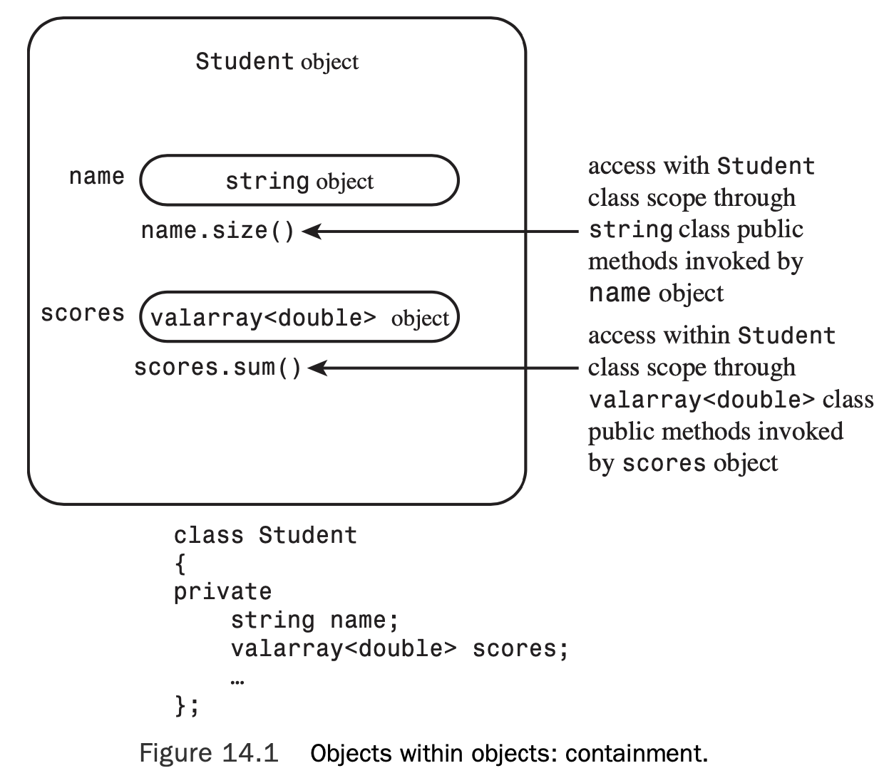
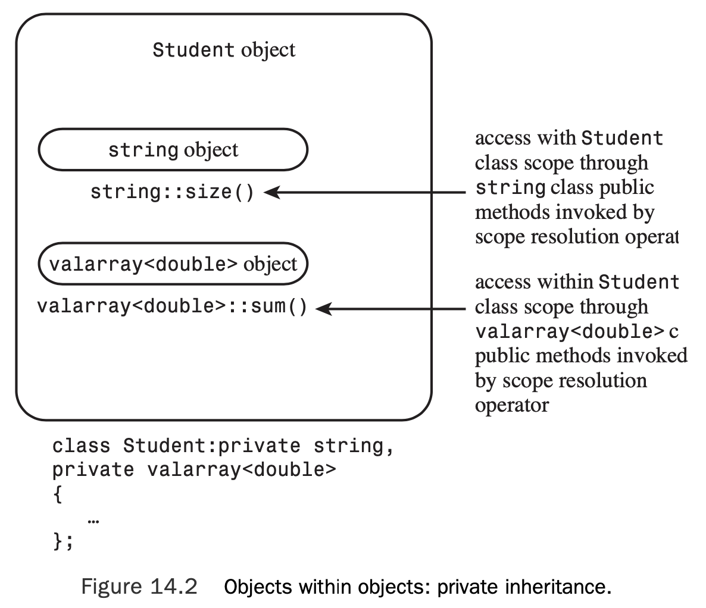
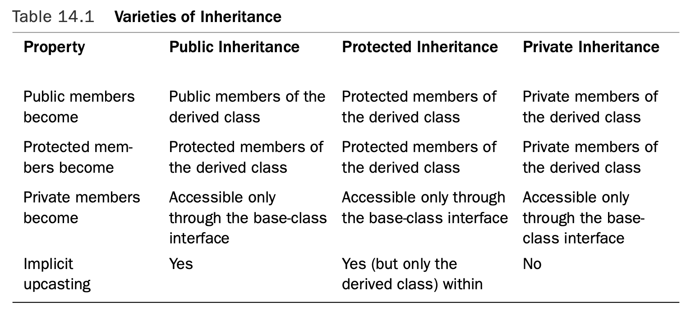
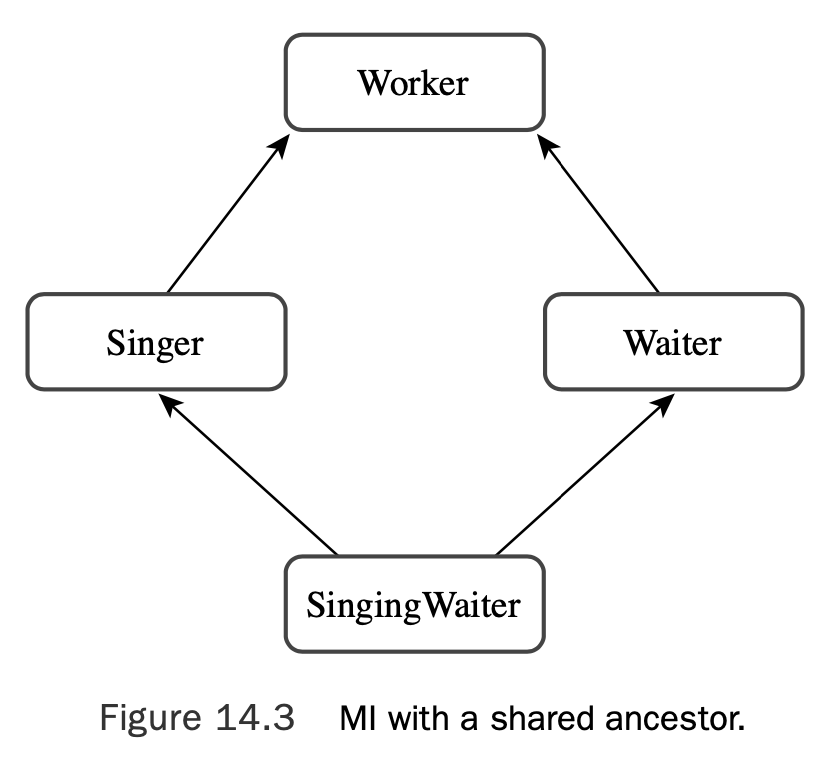
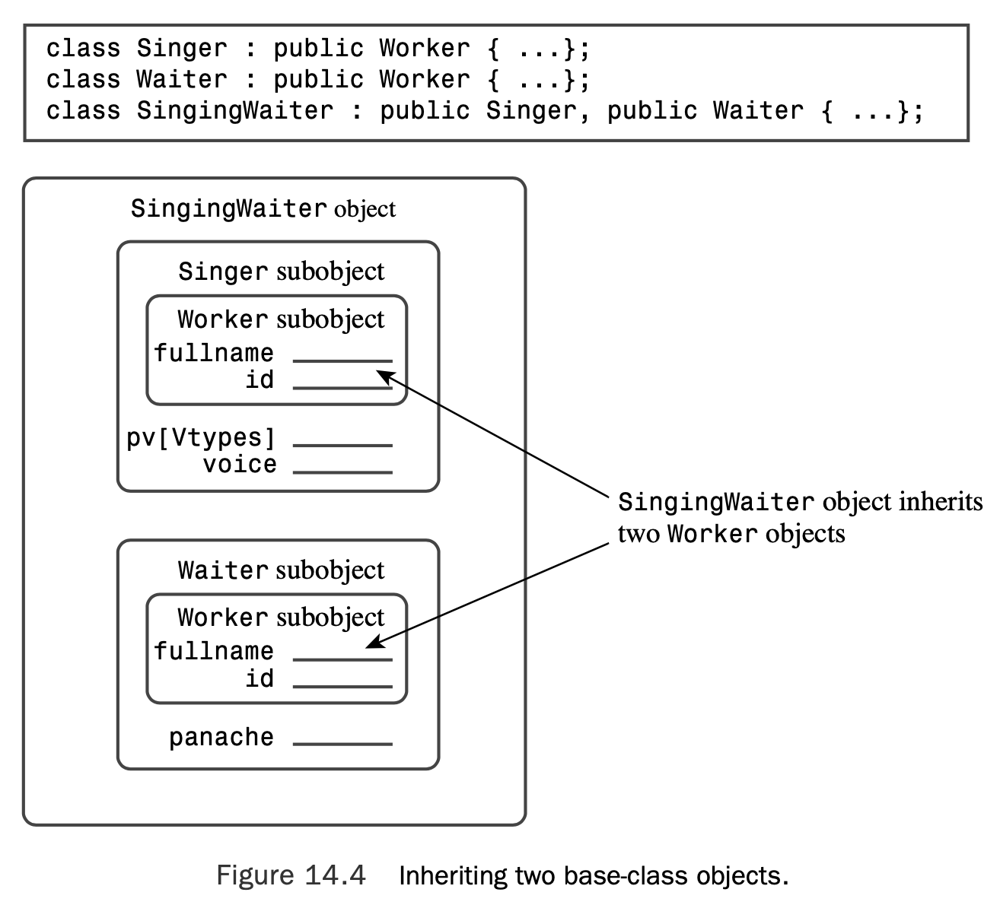
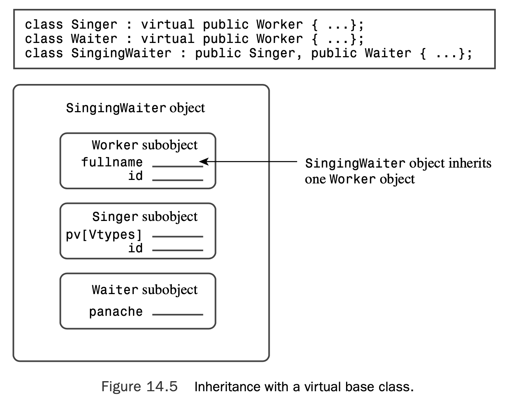

# Chapter 14 Reusing Code in C++

[TOC]

## Classes with Object Members

### The `valarray` Class: A Quick Look

The `valarray` class is supported by the `valarray` header file. As its name suggests, the class is targeted to deal with numeric values (or with classes with similar properties), so it supports operations such as summing the contents and finding the largest and smallest values in an array. 

The template aspect means that you have to provide a specific type when declaring an object.To do so when declaring an object, you follow the identifier valarray with angle brackets that contain the desired type:

```c++
valarray<int> q_values; 	// an array of int 
valarray<double> weights; 	// an array of double
```

Here are several examples that use some of the constructors:

```c++
double gpa[5] = {3.1, 3.5, 3.8, 2.9, 3.3};
valarray<double> v1; 		// an array of double, size 0
valarray<int> v2(8); 		// an array of 8 int elements
valarray<int> v3(10,8);		// an array of 8 int elements,
							// each set to 10
valarray<double> v4(gpa, 4);// an array of 4 elements
			// initialized to the first 4 elements of gpa
```

With C++11, you also can use an initializer list:

```c++
valarray<int> v5 = {20, 32, 17, 9}; // C++11
```

Next, here are a few of the methods:

* The `operator[]()` method provides access to individual elements.
* The `size()` method returns the number of elements.
* The `sum()` method returns the sum of the elements.
* The `max()` method returns the largest element.
* The `min()` method returns the smallest element.

### The `Student` Class Design

 For example, you can begin a `Student` class declaration like this:

```c++
class Student {
private:
	string name; // use a string object for name 
    valarray<double> scores; // use a valarray<double> object for scores 
    ...
};
```

The only access the outside world will have to name and scores is through the public interface defined for the Student class (see Figure 14.1).



### The `Student` Class Example

```c++
// studentc.h -- defining a Student class using containment 
#ifndef STUDENTC_H_
#define STUDENTC_H_

#include <iostream> 
#include <string> 
#include <valarray> 
class Student
{
private:
    typedef std::valarray<double> ArrayDb; 
    std::string name;       // contained object 
    ArrayDb scores;         // contained object 
    // private method for scores output
    std::ostream & arr_out(std::ostream & os) const; 
public:
    Student() : name("Null Student"), scores() {} 
    explicit Student(const std::string & s)
        : name(s), scores() {}
    explicit Student(int n) : name("Nully"), scores(n) {} 
    Student(const std::string & s, int n)
        : name(s), scores(n) {}
    Student(const std::string & s, const ArrayDb & a)
        : name(s), scores(a) {}
    Student(const char * str, const double * pd, int n)
        : name(str), scores(pd, n) {} 
    ~Student() {}
    double Average() const;
    const std::string & Name() const; 
    double & operator[](int i); 
    double operator[](int i) const;
// friends 
    // input
    friend std::istream & operator>>(std::istream & is, 
                                     Student & stu);    // 1 word
    friend std::istream & getline(std::istream & is,
                                     Student & stu);    // 1 line
    // output
    friend std::ostream & operator<<(std::ostream & os,
                                     const Student & stu);
};

#endif
```

Placing this `typedef` in the **private** portion of the class definition means that it can be used internally in the `Student` implementation but not by outside users of the `Student` class.

Note the use of the keyword `explicit`:

```c++
explicit Student(const std::string & s)
        : name(s), scores() {}
explicit Student(int n) : name("Nully"), scores(n) {} 
```

Using `explicit` turns off implicit conversions. If this keyword were **omitted**, code like the following would be possible:

```c++
Student doh("Homer", 10); // store "Homer", create array of 10 elements 
doh = 5; // reset name to "Nully", reset to empty array of 5 elements
```

With `explicit` in place, the compiler will catch the assignment operator as an error.

#### Initializing Contained Objects

For **inherited** objects, constructors use the **class** name in the member initializer list to invoke a specific base-class constructor. For **member** objects, constructors use the **member** name. For example, look at the last constructor in Listing 14.1:

```c++
Student(const char * str, const double * pd, int n) 
    : name(str), scores(pd, n) {}
```

Each item in this initialization list invokes the matching constructor.That is, `name(str)` invokes the `string(const  char *)` constructor, and `scores(pd, n)` invokes the `ArrayDb(const double *, int)` constructor, which, because of the `typedef`, really is the `valarray<double>(const double *, int)` constructor.

So if you omit the initialization list, C++ uses the default constructors defined for the member objects’ classes.

#### Using an Interface for a Contained Object

The interface for a contained object isn’t public, but it can be used within the class meth- ods. For example, here is how you can define a function that returns the average of a student’s scores:

```c++
double Student::Average() const 
{
    if (scores.size() > 0)
    	return scores.sum()/scores.size();
    else
    	return 0;
}
```

Similarly, you can define a friend function that uses the `string` version of the `<<` operator:

```c++
// use string version of operator<<()
ostream & operator<<(ostream & os, const Student & stu) 
{
	os << "Scores for " << stu.name << ":\n"; 
    ...
}
```

Similarly, the function could use the valarray implementation of << for output; unfortunately, there is none.Therefore, the class defines a private helper method to handle this task:

```c++
// private method
ostream & Student::arr_out(ostream & os) const 
{
	int i; 
    int lim = scores.size();
    if (lim > 0)
    {
        for (i = 0; i < lim; i++)
        {
            os << scores[i] << " ";
            if (i % 5 == 4)
                os << endl;
        }
        if (i % 5 != 0)
            os << endl;
    }
    else
        os << " empty array ";
    return os;
}
```

Using a helper like this gathers the messy details together in one place and makes the coding of the friend function neater:

```c++
// use string version of operator<<()
ostream & operator<<(ostream & os, const Student & stu) 
{
	os << "Scores for " << stu.name << ":\n"; 
    stu.arr_out(os); // use private method for scores 
    return os;
}
```

```c++
// studentc.cpp -- Student class using containment 
#include "studentc.h"
using std::ostream;
using std::endl;
using std::istream; 
using std::string;

//public methods
double Student::Average() const 
{
    if (scores.size() > 0)
        return scores.sum()/scores.size();
    else
        return 0;
}

const string & Student::Name() const 
{
    return name; 
}

double & Student::operator[](int i) 
{
    return scores[i]; // use valarray<double>::operator[]() 
}

double Student::operator[](int i) const 
{
    return scores[i]; 
}

// private method
ostream & Student::arr_out(ostream & os) const 
{
	int i; 
    int lim = scores.size();
    if (lim > 0)
    {
        for (i = 0; i < lim; i++)
        {
            os << scores[i] << " ";
            if (i % 5 == 4)
                os << endl;
        }
        if (i % 5 != 0)
            os << endl;
    }
    else
        os << " empty array ";
    return os;
}

// friends
// use string version of operator>>()
istream & operator>>(istream & is, Student & stu) 
{
    is >> stu.name;
    return is; 
}
// use string friend getline(ostream &, const string &) 
istream & getline(istream & is, Student & stu)
{
    getline(is, stu.name);
    return is; 
}

// use string version of operator<<()
ostream & operator<<(ostream & os, const Student & stu) 
{
    os << "Scores for " << stu.name << ":\n"; 
    stu.arr_out(os); // use private method for scores 
    return os;
}
```

#### Using the New `Student` Class

```c++
// use_stuc.cpp -- using a composite class 
// compile with studentc.cpp
#include <iostream>
#include "studentc.h"
using std::cin; 
using std::cout; 
using std::endl;

void set(Student & sa, int n);

const int pupils = 3; 
const int quizzes = 5;

int main() 
{
    Student ada[pupils] =
        {Student(quizzes), Student(quizzes), Student(quizzes)};

    int i;
    for (i = 0; i < pupils; ++i)
        set(ada[i], quizzes); 
    cout << "\nStudent List:\n"; 
    for (i = 0; i < pupils; ++i)
        cout << ada[i].Name() << endl;
    cout << "\nResults:";
    for (i = 0; i < pupils; ++i) 
    {
        cout << endl << ada[i];
        cout << "average: " << ada[i].Average() << endl; 
    }
    cout << "Done.\n";
    return 0; 
}

void set(Student & sa, int n) 
{
    cout << "Please enter the student's name: "; 
    getline(cin, sa);
    cout << "Please enter " << n << " quiz scores:\n"; 
    for (int i = 0; i < n; i++)
        cin >> sa[i];
    while (cin.get() != '\n')
        continue;
}
```

Here is a sample run of the program in Listings 14.1, 14.2, and 14.3:

```shell
Please enter the student's name: Gil Bayts
Please enter 5 quiz scores:
92 94 96 93 95
Please enter the student's name: Rat Roone
Please enter 5 quiz scores:
83 89 72 78 95
Please enter the student's name: Fleur O'Day
Please enter 5 quiz scores:
92 89 96 74 64

Student List:
Gil Bayts
Rat Roone
Fleur O'Day

Results:
Scores for Gil Bayts:
92 94 96 93 95 
average: 94

Scores for Rat Roone:
83 89 72 78 95 
average: 83.4

Scores for Fleur O'Day:
92 89 96 74 64 
average: 83
Done.
```

## Private Inheritance

C++ has a second means of implementing the **has-a** relationship: private inheritance.With **private inheritance**, public and protected members of the base class become private members of the derived class.

### A New Version of the `Student` Class Example

To get private inheritance, use the keyword `private` instead of `public` when defining the class. 

```c++
class Student : private std::string, private std::valarray<double> 
{
public:
	...
};
```

#### Initializing Base-Class Components

Having implicitly inherited components instead of member objects affects the coding of this example because you can no longer use `name` and `scores` to describe the objects.

```c++
Student(const char * str, const double * pd, int n)
	: name(str), scores(pd, n) {} // use object names for containment
```

The new version should use the member initializer list syntax for inherited classes, which uses the **class** name instead of a *member* name to identify a constructor:

```c++
Student(const char * str, const double * pd, int n)
	: std::string(str), ArrayDb(pd, n) {} // use class names for inheritance
```

```c++
// studentc.i -- defining a Student class using containment 
#ifndef STUDENTI_H_
#define STUDENTI_H_

#include <iostream> 
#include <string> 
#include <valarray> 
class Student : private std::string, private std::valarray<double>
{
private:
    typedef std::valarray<double> ArrayDb;
    // private method for scores output
    std::ostream & arr_out(std::ostream & os) const; 
public:
    Student() : std::string("Null Student"), ArrayDb() {} 
    explicit Student(const std::string & s)
            : std::string(s), ArrayDb() {}
    explicit Student(int n) : std::string("Nully"), ArrayDb(n) {} 
    Student(const std::string & s, int n)
            : std::string(s), ArrayDb(n) {}
    Student(const std::string & s, const ArrayDb & a)
            : std::string(s), ArrayDb(a) {}
    Student(const char * str, const double * pd, int n)
            : std::string(str), ArrayDb(pd, n) {} 
    ~Student() {}
    double Average() const;
    const std::string & Name() const; 
    double & operator[](int i); 
    double operator[](int i) const;
// friends 
    // input
    friend std::istream & operator>>(std::istream & is, 
                                     Student & stu);    // 1 word
    friend std::istream & getline(std::istream & is,
                                     Student & stu);    // 1 line
    // output
    friend std::ostream & operator<<(std::ostream & os,
                                     const Student & stu);
};

#endif
```

#### Accessing Base-Class Methods

Con- tainment invoked the methods with an object:

```c++
double Student::Average() const 
{
    if (scores.size() > 0)
    	return scores.sum()/scores.size();
    else
    	return 0;
}
```



Here, however, inheritance lets you use the class name and the scope-resolution opera- tor to invoke base-class methods:

```c++
double Student::Average() const 
{
    if (ArrayDb::size() > 0)
    	return ArrayDb::sum()/ArrayDb::size();
    else
		return 0;
}
```

#### Accessing Base-Class Objects

To avoid invoking constructors to create new objects, you use the type cast to create a reference:

```c++
const string & Student::Name() const 
{
	return (const string &) *this; 
}
```

#### Accessing Base-Class Friends

Consider the following friend function definition:

```c++
ostream & operator<<(ostream & os, const Student & stu) 
{
    os << "Scores for " << (const String &) stu << ":\n";
    ...
}
```

The typecast explicitly converts stu to a reference to a type `string` object; that type, in turn, invokes the `operator<<(ostream &, const String &)` function.

```c++
// studenti.cpp -- Student class using private inheritance 
#include "studenti.h"
using std::ostream;
using std::endl;
using std::istream; 
using std::string;

// public methods
double Student::Average() const 
{
    if (ArrayDb::size() > 0)
        return ArrayDb::sum()/ArrayDb::size();
    else
        return 0;
}

const string & Student::Name() const 
{
    return (const string &) *this; 
}

double & Student::operator[](int i) 
{
    return ArrayDb::operator[](i);      // use ArrayDb::operator[]()
}

double Student::operator[](int i) const 
{
    return ArrayDb::operator[](i); 
}

// private method
ostream & Student::arr_out(ostream & os) const 
{
	int i; 
    int lim = ArrayDb::size();
    if (lim > 0)
    {
        for (i = 0; i < lim; i++)
        {
            os << ArrayDb::operator[](i) << " ";
            if (i % 5 == 4)
                os << endl;
        }
        if (i % 5 != 0)
            os << endl;
    }
    else
        os << " empty array ";
    return os;
}

// friends
// use string version of operator>>()
istream & operator>>(istream & is, Student & stu) 
{
    is >> (string &)stu;
    return is; 
}
// use string friend getline(ostream &, const string &) 
istream & getline(istream & is, Student & stu)
{
    getline(is, (string &)stu);
    return is; 
}

// use string version of operator<<()
ostream & operator<<(ostream & os, const Student & stu) 
{
    os << "Scores for " << (const string &)stu << ":\n"; 
    stu.arr_out(os); // use private method for scores 
    return os;
}
```

#### Using the Revised `Student` Class

The only difference is that you have to include `studenti.h` instead of `studentc.h`, and you have to link the program with `studenti.cpp` instead of with `studentc.cpp`. 

```c++
// use_stui.cpp -- using a class with private inheritance 
// compile with studenti.cpp
#include <iostream>
#include "studenti.h"
using std::cin; 
using std::cout; 
using std::endl;

void set(Student & sa, int n);

const int pupils = 3; 
const int quizzes = 5;

int main() 
{
    Student ada[pupils] =
        {Student(quizzes), Student(quizzes), Student(quizzes)};

    int i;
    for (i = 0; i < pupils; i++)
        set(ada[i], quizzes); 
    cout << "\nStudent List:\n"; 
    for (i = 0; i < pupils; ++i)
        cout << ada[i].Name() << endl;
    cout << "\nResults:";
    for (i = 0; i < pupils; i++) 
    {
        cout << endl << ada[i];
        cout << "average: " << ada[i].Average() << endl; 
    }
    cout << "Done.\n";
    return 0; 
}

void set(Student & sa, int n) 
{
    cout << "Please enter the student's name: "; 
    getline(cin, sa);
    cout << "Please enter " << n << " quiz scores:\n"; 
    for (int i = 0; i < n; i++)
        cin >> sa[i];
    while (cin.get() != '\n')
        continue;
}
```

```shell
Please enter the student's name: Gil Bayts
Please enter 5 quiz scores:
92 94 96 93 95
Please enter the student's name: Pat Roone
Please enter 5 quiz scores:
83 89 72 78 95
Please enter the student's name: Fleur O'Day
Please enter 5 quiz scores:
92 89 96 74 64

Student List:
Gil Bayts
Pat Roone
Fleur O'Day

Results:
Scores for Gil Bayts:
92 94 96 93 95 
average: 94

Scores for Pat Roone:
83 89 72 78 95 
average: 83.4

Scores for Fleur O'Day:
92 89 96 74 64 
average: 83
Done.
```

### Containment or Private Inheritance?

Most C++ programmers prefer containment. First, it’s easier to follow.When you look at the class declaration, you see explicitly named objects representing the contained classes, and your code can refer to these objects by name. Using inheritance makes the relationship appear more abstract. 

Second, inheritance can raise problems, particularly if a class inherits from more than one base class.You may have to deal with issues such as separate base classes having methods with the same name or of separate base classes sharing a common ancestor.

Also containment allows you to include more than one subob- ject of the same class. If a class needs three string objects, you can declare three separate string members by using the containment approach. But inheritance limits you to a sin- gle object. (It is difficult to tell objects apart when they are all nameless.)

Suppose, for example, that a class has protected members, which could either be data members or member functions. Such members are available to derived classes but not to the world at large. 

### Protected Inheritance

Protected inheritance is a variation on private inheritance. It uses the keyword `protected` when listing a base class:

```c++
class Student : protected std::string, 
				protected std::valarray<double>
{...};
```

With protected inheritance, public and protected members of a base class become pro- tected members of the derived class. The main difference between private and protected inheritance occurs when you derive another class from the derived class.

With private inheritance, this third-generation class doesn’t get the internal use of the base-class interface.That’s because the public base-class methods become private in the derived class, and private members and methods can’t be directly accessed by the next level of derivation.

With protected inheritance, public base-class methods become protected in the second generation and so are available internally to the next level of derivation.



### Redefining Access with `using`

Suppose you want the `Student` class to be able to use the `valarray sum()` method.You can declare a `sum()` method in the class declaration and then define the method this way:

```c++
double Student::sum() const // public Student method 
{
	return std::valarray<double>::sum(); // use privately-inherited method 
}
```

You can add `using` declarations to the public section:

```c++
class Student : private std::string, private std::valarray<double> 
{
...
public:
	using std::valarray<double>::min; 
    using std::valarray<double>::max; 
    ...
};
```

The using declaration makes the `valarray<double>::min()` and `valarray<double>::max()` methods available as if they were public `Student` methods:

```c++
cout << "high score: " << ada[i].max() << endl;
```

## Multiple Inheritance

MI can introduce new problems for programmers.The two chief problems are inherit- ing different methods with the same name from two different base classes and inheriting multiple instances of a class via two or more related immediate base classes. Solving these problems involves introducing a few new rules and syntax variations.Thus, using MI can be more difficult and problem-prone than using single inheritance. 



```c++
// worker0.h -- working classes 
#ifndef WORKER0_H_
#define WORKER0_H_

#include <string>

class Worker // an abstract base class 
{
private:
    std::string fullname;
    long id; 
public:
    Worker() : fullname("no one"), id(0L) {} 
    Worker(const std::string & s, long n)
            : fullname(s), id(n) {}
    virtual ~Worker() = 0; // pure virtual destructor 
    virtual void Set();
    virtual void Show() const;
};

class Waiter : public Worker 
{
private:
    int panache; 
public:
    Waiter() : Worker(), panache(0) {}
    Waiter(const std::string & s, long n, int p = 0)
            : Worker(s, n), panache(p) {} 
    Waiter(const Worker & wk, int p = 0)
            : Worker(wk), panache(p) {} void Set();
    void Show() const; 
};

class Singer : public Worker 
{
protected:
    enum {other, alto, contralto, soprano, 
                    bass, baritone, tenor};
    enum {Vtypes = 7}; 
private:
    static const char *pv[Vtypes]; // string equivs of voice types
    int voice; 
public:
    Singer() : Worker(), voice(other) {}
    Singer(const std::string & s, long n, int v = other) 
            : Worker(s, n), voice(v) {}
    Singer(const Worker & wk, int v = other) 
            : Worker(wk), voice(v) {}
    void Set();
    void Show() const; 
};

#endif
```

```c++
// worker0.cpp -- working class methods 
#include "worker0.h"
#include <iostream>
using std::cout;
using std::cin; 
using std::endl; 
// Worker methods

// must implement virtual destructor, even if pure 
Worker::~Worker() {}

void Worker::Set() 
{
    cout << "Enter worker's name: "; 
    getline(cin, fullname);
    cout << "Enter worker's ID: "; 
    cin >> id;
    while (cin.get() != '\n') 
        continue;
}

void Worker::Show() const 
{
    cout << "Name: " << fullname << "\n";
    cout << "Employee ID: " << id << "\n"; 
}

// Waiter methods 
void Waiter::Set()
{
    Worker::Set();
    cout << "Enter waiter's panache rating: "; 
    cin >> panache;
    while (cin.get() != '\n')
        continue;
}

void Waiter::Show() const 
{
    cout << "Category: waiter\n";
    Worker::Show();
    cout << "Panache rating: " << panache << "\n";
}

// Singer methods

const char * Singer::pv[] = {"other", "alto", "contralto", 
            "soprano", "bass", "baritone", "tenor"};

void Singer::Set() 
{
    Worker::Set();
    cout << "Enter number for singer's vocal range:\n"; 
    int i;
    for (i = 0; i < Vtypes; i++)
    {
        cout << i << ": " << pv[i] << " "; 
        if ( i % 4 == 3)
            cout << endl;
    }
    if (i % 4 != 0)
        cout << endl;
    while (cin >> voice && (voice < 0 || voice >= Vtypes) )
        cout << "Please enter a value >= 0 and < " << Vtypes << endl;
        
    while (cin.get() != '\n') 
        continue;
}

void Singer::Show() const 
{
    cout << "Category: singer\n"; 
    Worker::Show();
    cout << "Vocal range: " << pv[voice] << endl;
}
```

```c++
// worktest.cpp -- test worker class hierarchy 
#include <iostream>
#include "worker0.h"
const int LIM = 4;
int main()
{
    Waiter bob("Bob Apple", 314L, 5);
    Singer bev("Bevely Hills", 522L, 3);
    Waiter w_temp;
    Singer s_temp;

    Worker * pw[LIM] = {&bob, &bev, &w_temp, &s_temp};

    int i;
    for (i = 2; i < LIM; i++)
        pw[i]->Set();
    for (i = 0; i < LIM; i++)
    {
        pw[i]->Show();
        std::cout << std::endl;
    }

    return 0;    
}
```

```shell
Enter worker's name: Waldo Dropmaster
Enter worker's ID: 443
Enter waiter's panache rating: 3
Enter worker's name: Sylvie Sirenne
Enter worker's ID: 666
Enter number for singer's vocal range:
0: other 1: alto 2: contralto 3: soprano 
4: bass 5: baritone 6: tenor 
4
Category: waiter
Name: Bob Apple
Employee ID: 314
Panache rating: 5

Category: singer
Name: Bevely Hills
Employee ID: 522
Vocal range: soprano

Category: waiter
Name: Waldo Dropmaster
Employee ID: 443
Panache rating: 3

Category: singer
Name: Sylvie Sirenne
Employee ID: 666
Vocal range: bass
```

### How Many Workers?

Suppose you begin by publicly deriving `SingingWaiter` from `Singer` and `Waiter`:

```c++
class SingingWaiter: public Singer, public Waiter {...};
```

Because both `Singer` and `Waiter` inherit a Worker component, `SingingWaiter` winds up with two `Worker` components (see Figure 14.4).



When C++ added MI to its bag of tricks, it added a virtual base class to make this possible.

#### Virtual Base Classes

Virtual base classes allow an object derived from multiple bases that themselves share a common base to inherit just one object of that shared base class. 

```c++
class Singer : virtual public Worker {...}; 
class Waiter : public virtual Worker {...};
```

Then you would define `SingingWaiter` as before:

```c++
class SingingWaiter: public Singer, public Waiter {...};
```

Now a `SingingWaiter` object will contain a single copy of a `Worker` object. In essence, the inherited `Singer` and `Waiter` objects share a common `Worker` object instead of each bringing in its own copy (see Figure 14.5). 



**Why the term virtual?**

After all, there doesn’t seem to be an obvious connection between the concepts of virtual functions and virtual base classes. C++ merely recycled the keyword `virtual` for the new facility—a bit of keyword overloading.

**Why don’t we dispense with declaring base classes virtual and make virtual behavior the norm for MI?**

First, there are cases in which you might want multiple copies of a base. Second, making a base class virtual requires that a program do some additional accounting, and you shouldn’t have to pay for that facility if you don’t need it.Third, there are the disadvantages presented in the next paragraph.

**Are there catches?**

Yes. Making virtual base classes work requires adjustments to C++ rules, and you have to code some things differently. Also using virtual base classes may involve changing existing code. For example, adding the SingingWaiter class to the Worker hierarchy requires that you go back and add the virtual keyword to the Singer and Waiter classes.

#### New Constructor Rules

With nonvirtual base classes, the *only* constructors that can appear in an initialization list are constructors for the immediate base classes. But these constructors can, in turn, pass information on to their bases. For example, you can have the following organization of constructors:

```c++
class A 
{
	int a; 
public:
	A(int n = 0) : a(n) {} 
    ...
};
class B: public A 
{
	int b; 
public:
	B(int m = 0, int n = 0) : A(n), b(m) {} 
    ...
};
class C : public B 
{
	int c; 
public:
	C(int q = 0, int m = 0, int n = 0) : B(m, n), c(q) {} 
    ...
};

```

This automatic passing of information doesn’t work if `Worker` is a virtual base class. For example, consider the following possible constructor for the MI example:

```c++
SingingWaiter(const Worker & wk, int p = 0, int v = Singer::other) 
    		: Waiter(wk,p), Singer(wk,v) {} // flawed
```

The problem is that automatic passing of information would pass `wk` to the `Worker` object via two separate paths (`Waiter` and `Singer`).To avoid this potential conflict, C++ disables the automatic passing of information through an intermediate class to a base class *if* the base class is virtual.Thus, the previous constructor will initialize the `panache` and `voice` members, but the information in the `wk` argument *won’t* get to the `Waiter` subobject. However, the compiler must construct a base object component before constructing derived objects; in this case, it will use the default `Worker` constructor.

If you want to use something other than the default constructor for a virtual base class, you need to invoke the appropriate base constructor explicitly.Thus, the constructor should look like this:

```c++
SingingWaiter(const Worker & wk, int p = 0, int v = Singer::other) 
    : Worker(wk), Waiter(wk,p), Singer(wk,v) {}
```

### Which Method?

Suppose you do omit a new version of Show() and try to use a `SingingWaiter` object to invoke an inherited `Show()` method:

```c++
SingingWaiter newhire("Elise Hawks", 2005, 6, soprano); newhire.Show(); // ambiguous
```

You can use the scope-resolution operator to clarify what you mean:

```c++
SingingWaiter newhire("Elise Hawks", 2005, 6, soprano); newhire.Singer::Show(); // use Singer version
```

However, a better approach is to redefine `Show()` for `SingingWaiter` and to have it specify which` Show()` to use. 

```c++
// workermi.h -- working classes with MI 
#ifndef WORKERMI_H_
#define WORKERMI_H_

#include <string>

class Worker // an abstract base class 
{
private:
    std::string fullname;
    long id; 
protected:
    virtual void Data() const;
    virtual void Get(); 
public:
    Worker() : fullname("no one"), id(0L) {} 
    Worker(const std::string & s, long n)
            : fullname(s), id(n) {}
    virtual ~Worker() = 0; // pure virtual function
    virtual void Set() = 0;
    virtual void Show() const = 0;
};

class Waiter : virtual public Worker 
{
private:
    int panache; 
protected:
    void Data() const;
    void Get(); 
public:
    Waiter() : Worker(), panache(0) {} 
    Waiter(const std::string & s, long n, int p = 0)
            : Worker(s, n), panache(p) {}
    Waiter(const Worker & wk, int p = 0)
    : Worker(wk), panache(p) {}
    void Set();
    void Show() const; 
};


class Singer : virtual public Worker 
{
protected:
    enum {other, alto, contralto, soprano,
                        bass, baritone, tenor}; 
    enum {Vtypes = 7};
    void Data() const;
    void Get(); 
private:
    static const char *pv[Vtypes];      // string equivs of voice types
    int voice; 
public:
    Singer() : Worker(), voice(other) {}
    Singer(const std::string & s, long n, int v = other)
            : Worker(s, n), voice(v) {} 
    Singer(const Worker & wk, int v = other)
            : Worker(wk), voice(v) {} 
    void Set();
    void Show() const; 
};

// multiple inheritance
class SingingWaiter : public Singer, public Waiter 
{
protected:
    void Data() const;
    void Get(); 
public:
    SingingWaiter() {}
    SingingWaiter(const std::string & s, long n, int p = 0,
                            int v = other)
            : Worker(s,n), Waiter(s, n, p), Singer(s, n, v) {}
    SingingWaiter(const Worker & wk, int p = 0, int v = other) 
            : Worker(wk), Waiter(wk,p), Singer(wk,v) {}
    SingingWaiter(const Waiter & wt, int v = other) 
            : Worker(wt),Waiter(wt), Singer(wt,v) {}
    SingingWaiter(const Singer & wt, int p = 0)
            : Worker(wt),Waiter(wt,p), Singer(wt) {}
    void Set();
    void Show() const; 
};

#endif
```

```c++
// workermi.cpp -- working class methods with MI 
#include "workermi.h"
#include <iostream>
using std::cout;
using std::cin; 
using std::endl;
// Worker methods 
Worker::~Worker() { }

// protected methods 
void Worker::Data() const 
{
    cout << "Name: " << fullname << endl;
    cout << "Employee ID: " << id << endl; 
}

void Worker::Get() 
{
    getline(cin, fullname);
    cout << "Enter worker's ID: "; cin >> id;
    while (cin.get() != '\n')
        continue;
}

// Waiter methods 
void Waiter::Set() {
    cout << "Enter waiter's name: "; 
    Worker::Get();
    Get();
}

void Waiter::Show() const 
{
    cout << "Category: waiter\n"; 
    Worker::Data();
    Data();
}

// protected methods 
void Waiter::Data() const 
{
    cout << "Panache rating: " << panache << endl; 
}

void Waiter::Get() 
{
    cout << "Enter waiter's panache rating: "; 
    cin >> panache;
    while (cin.get() != '\n')
        continue;
}

// Singer methods

const char * Singer::pv[Singer::Vtypes] = {"other", "alto", "contralto", 
            "soprano", "bass", "baritone", "tenor"};

void Singer::Set() 
{
    cout << "Enter singer's name: "; 
    Worker::Get();
    Get();
}

void Singer::Show() const 
{
    cout << "Category: singer\n"; 
    Worker::Data();
    Data();
}

// protected methods 
void Singer::Data() const 
{
    cout << "Vocal range: " << pv[voice] << endl;
}

void Singer::Get() 
    {
    cout << "Enter number for singer's vocal range:\n";
    int i;
    for (i = 0; i < Vtypes; i++) 
    {
        cout << i << ": " << pv[i] << " "; 
        if ( i % 4 == 3)
            cout << endl;
    }
    if (i % 4 != 0)
        cout << '\n'; 
    cin >> voice;
    while (cin.get() != '\n') 
        continue;
}

// SingingWaiter methods
void SingingWaiter::Data() const 
{
    Singer::Data();
    Waiter::Data(); 
}

void SingingWaiter::Get() 
{
    Waiter::Get();
    Singer::Get(); 
}

void SingingWaiter::Set() 
{
    cout << "Enter singing waiter's name: "; 
    Worker::Get();
    Get();
}

void SingingWaiter::Show() const 
{
    cout << "Category: singing waiter\n"; 
    Worker::Data();
    Data();
}
```

```c++
// workmi.cpp -- multiple inheritance 
// compile with workermi.cpp 
#include <iostream>
#include <cstring>
#include "workermi.h" 
const int SIZE = 5;

int main() 
{
    using std::cin; 
    using std::cout; 
    using std::endl; 
    using std::strchr;

    Worker * lolas[SIZE];

    int ct;
    for (ct = 0; ct < SIZE; ct++) 
    {
        char choice;
        cout << "Enter the employee category:\n"
             << "w: waiter s: singer "
             << "t: singing waiter q: quit\n"; 
        cin >> choice;
        while (strchr("wstq", choice) == NULL) 
        {
            cout << "Please enter a w, s, t, or q: ";
            cin >> choice; 
        }
        if (choice == 'q') 
            break;
        switch(choice) 
        {
            case 'w':   lolas[ct] = new Waiter; 
                        break;
            case 's':   lolas[ct] = new Singer;
                        break;
            case 't':   lolas[ct] = new SingingWaiter;
                        break;
        }
        cin.get(); 
        lolas[ct]->Set();
    }

    cout << "\nHere is your staff:\n";
    int i;
    for (i = 0; i < ct; i++) 
    {
        cout << endl;
        lolas[i]->Show(); 
    }
    for (i = 0; i < ct; i++) 
        delete lolas[i];
    cout << "Bye.\n";
    return 0;
}
```

```shell
Enter the employee category:
w: waiter s: singer t: singing waiter q: quit
w
Enter waiter's name: Wally Slipshod
Enter worker's ID: 1040
Enter waiter's panache rating: 4
Enter the employee category:
w: waiter s: singer t: singing waiter q: quit
s
Enter singer's name: Sinclair Parma
Enter worker's ID: 1041
Enter number for singer's vocal range:
0: other 1: alto 2: contralto 3: soprano 
4: bass 5: baritone 6: tenor 
5
Enter the employee category:
w: waiter s: singer t: singing waiter q: quit
t
Enter singing waiter's name: Natasha Gargalova
Enter worker's ID: 1042
Enter waiter's panache rating: 6
Enter number for singer's vocal range:
0: other 1: alto 2: contralto 3: soprano 
4: bass 5: baritone 6: tenor 
3
Enter the employee category:
w: waiter s: singer t: singing waiter q: quit
q

Here is your staff:

Category: waiter
Name: Wally Slipshod
Employee ID: 1040
Panache rating: 4

Category: singer
Name: Sinclair Parma
Employee ID: 1041
Vocal range: baritone

Category: singing waiter
Name: Natasha Gargalova
Employee ID: 1042
Vocal range: soprano
Panache rating: 6
Bye.
```

#### Mixed Virtual and Nonvirtual Bases

Suppose, for example, that class B is a virtual base class to classes C and D and a nonvirtual base class to classes X and Y. Furthermore, suppose class M is derived from C, D, X, and Y. In this case, class M contains one class B subobject for all the virtually derived ancestors (that is, classes C and D) and a separate class B subobject for each nonvirtual ancestor (that is, classes X and Y). So, all told, it would contain three class B subobjects.

#### Virtual Base Classes and Dominance

A name in a derived class domi- nates the same name in any ancestor class, whether direct or indirect. For example, con- sider the following definitions:

```c++
class B 
{ 
public:
	short q(); 
    ...
};

class C : virtual public B
{
public:
    long q();
    int omg()
    ...
};

class D : public C
{
    ...
};

class E : virtual public B
{
private:
    int omg();
    ...
};

class F : public D, public E
{
	...
};
```

Here the definition of `q()` in class C dominates the definition in class B because C is derived from B. Thus, methods in F can use `q()` to denote `C::q()`. 

On the other hand, neither definition of `omg()` dominates the other because neither C nor E is a base class to the other.Therefore, an attempt by F to use an unqualified `omg()` would be ambiguous.

#### Multiple Inheritance Synopsis

A class becomes a virtual base class when a derived class uses the keyword `virtual` when indicating derivation:

```c++
class marketing : public virtual reality { ... };
```

The main change, and the reason for virtual base classes, is that a class that inherits from one or more instances of a virtual base class inherits just one base-class object. Implementing this feature entails other requirements:

* A derived class with an indirect virtual base class should have its constructors invoke the indirect base-class constructors directly, which is illegal for indirect non-virtual base classes.
* Name ambiguity is resolved via the dominance rule.

## Class Templates

 Templates provide **parameterized** types—that is, they are capable of passing a type name as an argument to a recipe for building a class or a function. By feeding the type name `int` to a `Queue` template, for example, you can get the compiler to construct a `Queue` class for queuing `ints`.

### Defining a Class Template

Let’s use the `Stack` class from Chapter 10 as a model from which to build a template. Here’s the original class declaration:

```c++
typedef unsigned long Item;

class Stack 
{
private:
    enum {MAX = 10};    // constant specific to class
    Item items[MAX];    // holds stack items
    int top;            // index for top stack item
public: 
    Stack();
    bool isempty() const;
    bool isfull() const;
    // push() returns false if stack already is full, true otherwise 
    bool push(const Item & item);   // add item to stack
    // pop() returns false if stack already is empty, true otherwise
    bool pop(Item & item);          // pop top into item
};
```

Listing 14.13 shows the combined class and member function templates.

```c++
// stacktp.h -- a stack template 
#ifndef STACKTP_H_
#define STACKTP_H_

template <class Type>
class Stack 
{
private:
    enum {MAX = 10};        // constant specific to class
    Type items[MAX];        // holds stack items
    int top;                // index for top stack item
public:
    Stack();
    bool isempty();
    bool isfull();
    bool push(const Type & item);   // add item to stack
    bool pop(Type & item);          // pop top into item
};

template <class Type>
Stack<Type>::Stack() 
{
    top = 0; 
}

template <class Type>
bool Stack<Type>::isempty() 
{
    return top == 0; 
}

template <class Type>

bool Stack<Type>::isfull()
{
    return top == MAX;
}

template <class Type>
bool Stack<Type>::push(const Type & item)
{
    if (top < MAX) 
    {
        items[top++] = item;
        return true; 
    }
    else
        return false;
}

template <class Type>
bool Stack<Type>::pop(Type & item)
{
    if (top > 0) 
    {
        item = items[--top];
        return true; 
    }
    else
        return false;
}

#endif
```

### Using a Template Class

For example, here’s how you would create two stacks, one for stacking `ints` and one for stacking `string` objects:

```c++
Stack<int> kernels; 	// create a stack of ints 
Stack<string> colonels; // create a stack of string objects
```

The `Stack<int>` class declaration will replace `Type` throughout with `int`, and the `Stack<string>` class declaration will replace `Type` throughout with `string`. 

Notice that you have to provide the desired type explicitly.This is different from ordinary function templates, for which the compiler can use the argument types to a function to figure out what kind of function to generate:

```c++
template <class T>
void simple(T t) { cout << t << '\n';}
...
simple(2); // generate void simple(int) 
simple("two"); // generate void simple(const char *)
```

```c++
// stacktem.cpp -- testing the template stack class 
#include <iostream>
#include <string>
#include <cctype>
#include "stacktp.h" 
using std::cin; 
using std::cout;

int main() 
{
    Stack<std::string> st;      // create an empty stack
    char ch;
    std::string po;
    cout << "Please enter A to add a purchase order,\n"
         << "P to process a PO, or Q to quit.\n"; 
    while (cin >> ch && std::toupper(ch) != 'Q') 
    {
        while (cin.get() != '\n') 
            continue;
        if (!std::isalpha(ch)) 
        {
            cout << '\a';
            continue; }
        switch(ch) 
        {
            case 'A': 
            case 'a': cout << "Enter a PO number to add: ";
                      cin >> po;
                      if (st.isfull())
                            cout << "stack already full\n";
                      else
                            st.push(po);
                      break;
            case 'P': 
            case 'p': if (st.isempty())
                            cout << "stack already empty\n";
                      else{
                            st.pop(po);
                            cout << "PO #" << po << " popped\n";
                            break;
                      }
        }
        cout << "Please enter A to add a purchase order,\n"
             << "P to process a PO, or Q to quit.\n";
    }
    cout << "Bye\n";
    return 0;
}
```

Here’s a sample run of the program in Listing 14.14:

```shell
Please enter A to add a purchase order,
P to process a PO, or Q to quit.
a
Enter a PO number to add: red911porsche
Please enter A to add a purchase order,
P to process a PO, or Q to quit.
A
Enter a PO number to add: blueR8audi
Please enter A to add a purchase order,
P to process a PO, or Q to quit.
A
Enter a PO number to add: silver747boeing
Please enter A to add a purchase order,
P to process a PO, or Q to quit.
p
PO #silver747boeing popped
Please enter A to add a purchase order,
P to process a PO, or Q to quit.
P
PO #blueR8audi popped
Please enter A to add a purchase order,
P to process a PO, or Q to quit.
p
PO #red911porsche popped
Please enter A to add a purchase order,
P to process a PO, or Q to quit.
p
stack already empty
Please enter A to add a purchase order,
P to process a PO, or Q to quit.
q
Bye
```

### A Closer Look at the Template Class

#### Using a Stack of Pointers Incorrectly

All three examples begin with this perfectly valid invocation of the `Stack<Type>` template:

```c++
Stack<char *> st; // create a stack for pointers-to-char
```

Version 1 then replaces

```c++
string po;
```

in listing 14.14 with

```c++
char * po;
```

This approach fails immediately because merely creating a pointer doesn’t create **space** to hold the input strings. 

Version 2 replaces

```c++
string po;
```

with

```c++
char po[40];
```

Furthermore, `po` is of type `char *`, so it can be placed on the stack. But an array is fundamentally at odds with the assumptions made for the `pop()` method:

```c++
template <class Type>
bool Stack<Type>::pop(Type & item)
{
    if (top > 0) 
    {
        item = items[--top];
        return true; 
    }
    else
        return false;
}
```

First, the reference variable `item` has to refer to an lvalue of some sort, not to an array name. Second, the code assumes that you can assign to `item`. Even if `item` could refer to an array, you can’t assign to an array name. 

Version 3 replaces

```c++
string po;
```

with

```c++
char * po = new char[40];
```

There is only one `po` variable, and it always points to the same memory location.True, the contents of the memory change each time a new string is read, but every push operation puts exactly the same address onto the stack. So when you pop the stack, you always get the same address back, and it always refers to the last string read into memory. In particular, the stack is not storing each new string separately as it comes in, and it serves no useful purpose.

#### Using a Stack of Pointers Correctly

One way to use a stack of pointers is to have the calling program provide an array of pointers, with each pointer pointing to a different string. 

```c++
// stcktp1.h -- modified Stack template 
#ifndef STCKTP1_H_
#define STCKTP1_H_

template <class Type>
class Stack 
{
private:
    enum {SIZE = 10};       // default size
    int stacksize;
    Type * items;           // holds stack items
    int top;                // index for top stack item
public:
    explicit Stack(int ss = SIZE);
    Stack(const Stack & st);
    ~Stack() { delete [] items; };
    bool isempty() { return top == 0; };
    bool isfull() { return top == stacksize; };
    bool push(const Type & item);   // add item to stack
    bool pop(Type & item);          // pop top into item
    Stack & operator=(const Stack & st);
};


template <class Type>
Stack<Type>::Stack(int ss) : stacksize(ss), top(0) 
{
    items = new Type [stacksize]; 
}

template <class Type> 
Stack<Type>::Stack(const Stack & st) 
{
    stacksize = st.stacksize; 
    top = st.top;
    items = new Type [stacksize]; 
    for (int i = 0; i < top; i++)
        items[i] = st.items[i];
}

template <class Type>
bool Stack<Type>::push(const Type & item)
{
    if (top < stacksize) 
    {
        items[top++] = item;
        return true; 
    }
    else
        return false;
}

template <class Type>
bool Stack<Type>::pop(Type & item)
{
    if (top > 0) 
    {
        item = items[--top];
        return true; 
    }
    else
        return false;
}

template <class Type>
Stack<Type> & Stack<Type>::operator=(const Stack<Type> & st) 
{
    if (this == &st) 
        return *this;
    delete [] items;
    stacksize = st.stacksize; 
    top = st.top;
    items = new Type [stacksize]; 
    for (int i = 0; i < top; i++)
        items[i] = st.items[i]; 
    return *this;
}

#endif
```

```c++
// stkoptr1.cpp -- testing stack of pointers 
#include <iostream>
#include <cstdlib>      // for rand(), srand()
#include <ctime>        // for time()
#include "stcktp1.h" 
const int Num = 10;
int main()
{
    std::srand(std::time(0)); // randomize rand() 
    std::cout << "Please enter stack size: "; 
    int stacksize;
    std::cin >> stacksize;
// create an empty stack with stacksize slots 
    Stack<const char *> st(stacksize);

// in basket
    const char * in[Num] = {
            " 1: Hank Gilgamesh", " 2: Kiki Ishtar", 
            " 3: Betty Rocker", " 4: Ian Flagranti", 
            " 5: Wolfgang Kibble", " 6: Portia Koop", 
            " 7: Joy Almondo", " 8: Xaverie Paprika", 
            " 9: Juan Moore", "10: Misha Mache"
    }; 

// out basket
    const char * out[Num];

    int processed = 0;
    int nextin = 0;
    while (processed < Num) 
    {
        if (st.isempty()) 
            st.push(in[nextin++]);
        else if (st.isfull()) 
            st.pop(out[processed++]);
        else if (std::rand() % 2 && nextin < Num)   // 50-50 chance
            st.push(in[nextin++]);
        else 
            st.pop(out[processed++]);
    }
    for (int i = 0; i < Num; i++)
        std::cout << out[i] << std::endl;

    std::cout << "Bye\n";
    return 0;
}
```

### An Array Template Example and Non-Type Arguments

Indeed, the desire to provide reusable code for container classes was the main motivation for introducing templates.

```c++
//arraytp.h -- Array Template 
#ifndef ARRAYTP_H_
#define ARRAYTP_H_

#include <iostream> 
#include <cstdlib>

template <class T, int n> 
class ArrayTP
{
private:
    T ar[n]; 
public:
    ArrayTP() {};
    explicit ArrayTP(const T & v); 
    virtual T & operator[](int i); 
    virtual T operator[](int i) const;
};

template <class T, int n> 
ArrayTP<T,n>::ArrayTP(const T & v) 
{
    for (int i = 0; i < n; i++) 
        ar[i] = v;
}

template <class T, int n>
T & ArrayTP<T,n>::operator[](int i)
{
    if (i < 0 || i >= n) 
    {
        std::cerr << "Error in array limits: " << i 
            << " is out of range\n";
        std::exit(EXIT_FAILURE); 
    }
    return ar[i]; 
}

template <class T, int n>
T ArrayTP<T,n>::operator[](int i) const 
{
    if (i < 0 || i >= n) 
    {
        std::cerr << "Error in array limits: " << i 
            << " is out of range\n";
        std::exit(EXIT_FAILURE); 
    }
    return ar[i]; 
}

#endif
```

Note the template heading in Listing 14.17:

```c++
template <class T, int n>
```

The keyword `class` (or, equivalently in this context, typename) identifies `T` as a type parameter, or type argument. `int` identifies `n` as being an `int` type.This second kind of parameter, one that specifies a particular type instead of acting as a generic name for a type, is called a **non-type**, or **expression**, **argument**. Suppose you have the following declaration:

```c++
ArrayTP<double, 12> eggweights;
```

This causes the compiler to define a class called `ArrayTP<double,12>` and to create an `eggweights` object of that class.When defining the class, the compiler replaces `T` with `double` and `n` with `12`.

Expression arguments have some restrictions.An expression argument can be an integer type, an enumeration type, a reference, or a pointer.Thus,`double m` is ruled out, but `double & rm` and `double * pm` are allowed. Also the template code can’t alter the value of the argument or take its address.Thus, in the `ArrayTP` template, expressions such as `n++` or `&n` would not be allowed. Also when you instantiate a template, the value used for the expression argument should be a constant expression.

The main drawback to the expression argument approach is that each array size generates its own template.That is, the following declarations generate two separate class declarations:

```c++
ArrayTP<double, 12> eggweights; 
ArrayTP<double, 13> donuts;
```

But the following declarations generate just one class declaration, and the size infor- mation is passed to the constructor for that class:

```c++
Stack<int> eggs(12); 
Stack<int> dunkers(13);
```

Another difference is that the constructor approach is more versatile because the array size is stored as a class member rather than being hard-coded into the definition.This makes it possible to define assignment from an array of one size to an array of another size or to build a class that allows resizable arrays.

### Template Versatility

You can have code along the following lines:

```c++
template <typename T> 	// or <class T>
class Array
{
private:
	T entry; 
    ...
};

template <typename Type>
class GrowArray : public Array<Type> {...}; // inheritance

template <typename Tp> 
class Stack
{
	Array<Tp> ar; 	// use an Array<> as a component
    ...
};
...
Array < Stack<int> > asi; // an array of stacks of int
```

#### Using a Template Recursively

```c++
// twod.cpp -- making a 2-d array 
#include <iostream>
#include "arraytp.h"
int main(void)
{
    using std::cout;
    using std::endl;
    ArrayTP<int, 10> sums; 
    ArrayTP<double, 10> aves;
    ArrayTP< ArrayTP<int,5>, 10> twodee;

    int i, j;

    for (i = 0; i < 10; i++) 
    {
        sums[i] = 0;
        for (j = 0; j < 5; j++) 
        {
            twodee[i][j] = (i + 1) * (j + 1);
            sums[i] += twodee[i][j]; 
        }
        aves[i] = (double) sums[i] / 10; 
    }
    for (i = 0; i < 10; i++) 
    {
        for (j = 0; j < 5; j++) 
        {
            cout.width(2);
            cout << twodee[i][j] << ' '; 
        }
        cout << ": sum = ";
        cout.width(3);
        cout << sums[i] << ", average = " << aves[i] << endl;
    }
    cout << "Done.\n";

    return 0; 
}
```

```shell
 1  2  3  4  5 : sum =  15, average = 1.5
 2  4  6  8 10 : sum =  30, average = 3
 3  6  9 12 15 : sum =  45, average = 4.5
 4  8 12 16 20 : sum =  60, average = 6
 5 10 15 20 25 : sum =  75, average = 7.5
 6 12 18 24 30 : sum =  90, average = 9
 7 14 21 28 35 : sum = 105, average = 10.5
 8 16 24 32 40 : sum = 120, average = 12
 9 18 27 36 45 : sum = 135, average = 13.5
10 20 30 40 50 : sum = 150, average = 15
Done.
```

#### Using More Than One Type Parameter

```c++
// pairs.cpp -- defining and using a Pair template 
#include <iostream>
#include <string>
template <class T1, class T2>
class Pair 
{
private:
    T1 a;
    T2 b; 
public:
    T1 & first();
    T2 & second();
    T1 first() const { return a; }
    T2 second() const { return b; }
    Pair(const T1 & aval, const T2 & bval) : a(aval), b(bval) { } 
    Pair() {}
};

template<class T1, class T2> 
T1 & Pair<T1,T2>::first()
{
    return a; 
}

template<class T1, class T2> 
T2 & Pair<T1,T2>::second() 
{
    return b; 
}

int main() 
{
    using std::cout;
    using std::endl;
    using std::string; 
    Pair<string, int> ratings[4] = 
    {
        Pair<string, int>("The Purpled Duck", 5), 
        Pair<string, int>("Jaquie's Frisco Al Fresco", 4), 
        Pair<string, int>("Cafe Souffle", 5), 
        Pair<string, int>("Bertie's Eats", 3)
    };

    int joints = sizeof(ratings) / sizeof (Pair<string, int>); 
    cout << "Rating:\t Eatery\n";
    for (int i = 0; i < joints; i++)
        cout << ratings[i].second() << ":\t " 
             << ratings[i].first() << endl;
    cout << "Oops! Revised rating:\n"; 
    ratings[3].first() = "Bertie's Fab Eats"; 
    ratings[3].second() = 6;
    cout << ratings[3].second() << ":\t "
         << ratings[3].first() << endl; 
    return 0;
}
```

```shell
Rating:	 Eatery
5:	 The Purpled Duck
4:	 Jaquie's Frisco Al Fresco
5:	 Cafe Souffle
3:	 Bertie's Eats
Oops! Revised rating:
6:	 Bertie's Fab Eats
```

#### Default Type Template Parameters

Another new class template feature is that you can provide default values for type parameters:

```c++
template <class T1, class T2 = int> class Topo {...};
```

This causes the compiler to use int for the type `T2` if a value for `T2` is omitted:

```c++
Topo<double, double> m1; // T1 is double, T2 is double
Topo<double> m2; // T1 is double, T2 is int
```

### Template Specializations

#### Implicit Instantiations

```c++
ArrayTP<int, 100> stuff; // implicit instantiation
```

The compiler doesn’t generate an implicit instantiation of the class until it needs an object:

```c++
ArrayTP<double, 30> * pt; // a pointer, no object needed yet pt = new 
ArrayTP<double, 30>; // now an object is needed
```

#### Explicit Instantiations

 The following declaration declares `ArrayTP<string, 100>` to be a class:

```c++
template class ArrayTP<string, 100>; // generate ArrayTP<string, 100> class
```

In this case, the compiler generates the class definition, including method definitions, even though no object of the class has yet been created or mentioned.

#### Explicit Specializations

 Sometimes you might need or want to modify a template to behave differently when instantiated for a particular type; in that case, you can create an explicit specialization. 

```c++
template <typename T> 
class SortedArray
{
	...// details omitted
};
```

```c++
template <> class Classname<specialized-type-name> { ... };
```

To provide a SortedArray template specialized for the `const char *` type, using the

current notation, you would use code like the following:

```c++
template <> class SortedArray<const char char *> 
{
	...// details omitted
};
```

#### Partial Specializations

```c++
// general template
	template <class T1, class T2> class Pair {...};
// specialization with T2 set to int
	template <class T1> class Pair<T1, int> {...};
```

```c++
// specialization with T1 and T2 set to int 
	template <> class Pair<int, int> {...};
```

```c++
Pair<double, double> p1;// use general Pair template
Pair<double, int> p2; 	// use Pair<T1, int> partial specialization 
Pair<int, int> p3; 		// use Pair<int, int> explicit specialization
```

Or you can partially specialize an existing template by providing a special version for pointers:

```c++
template<class T> 		// general version
class Feeb { ... }; 
template<class T*> 		// pointer partial specialization
class Feeb { ... };		// modified code
```

```c++
Feeb<char> fb1; 	// use general Feeb template, T is char 
Feeb<char *> fb2; 	// use Feeb T* specialization, T is char
```

```c++
// general template
	template <class T1, class T2, class T3> class Trio{...};
// specialization with T3 set to T2
	template <class T1, class T2> class Trio<T1, T2, T2> {...};
// specialization with T3 and T2 set to T1*
	template <class T1> class Trio<T1, T1*, T1*> {...};
```

Given these declarations, the compiler would make the following choices:

```c++
Trio<int, short, char *> t1; 	// use general template 
Trio<int, short> t2; 			// use Trio<T1, T2, T2> 
Trio<char, char *, char *> t3; 	// use Trio<T1, T1*, T1*>
```

### Member Templates

```c++
// tempmemb.cpp -- template members 
#include <iostream>
using std::cout;
using std::endl;

template <typename T> 
class beta
{
private:
    template <typename V> // nested template class member 
    class hold
    {
    private:
        V val; 
    public:
        hold(V v = 0) : val(v) {}
        void show() const { cout << val << endl; } 
        V Value() const { return val; }
    };
    hold<T> q;      // template object 
    hold<int> n;    // template object
public:
    beta( T t, int i) : q(t), n(i) {}
    template<typename U> // template method
    U blab(U u, T t) { return (n.Value() + q.Value()) * u / t; } 
    void Show() const { q.show(); n.show();}
};

int main() 
{
    beta<double> guy(3.5, 3);
    cout << "T was set to double\n";
    guy.Show();
    cout << "V was set to T, which is double, then V was set to int\n"; 
    cout << guy.blab(10, 2.3) << endl;
    cout << "U was set to int\n";
    cout << guy.blab(10.0, 2.3) << endl;
    cout << "U was set to double\n";
    cout << "Done\n";
    return 0;
}
```

```c++
T was set to double
3.5
3
V was set to T, which is double, then V was set to int
28
U was set to int
28.2609
U was set to double
Done
```

You can declare the `hold` class and `blah` method in the `beta` template and define them outside the `beta` template.

```c++
template <typename T> 
class beta
{
private:
	template <typename V> 	// declaration
    class hold; hold<T> q; 
    hold<int> n;
public:
	beta( T t, int i) : q(t), n(i) {}
    template <typename U>	// declaration
    U blab(U u, T t);
	void Show() const { q.show(); n,show(); }
};

// member definition 
template <typename T>
template <typename V> 
class beta<T>::hold 
{
private:
	V val; 
public:
	hold(V v = 0) : val(v) {}
	void show() const { std::cout << val << std::endl; } 
    V Value() const { return val; }
};

// member definition 
template <typename T>
template <typename U>
U beta<T>::blab(U u, T t) 
{
	return (n.Value() + q.Value()) * u / t; 
}
```

### Templates As Parameters

```c++
template <template <typename T> class Thing> 
class Crab
```

The template parameter is `template <typename T> class Thing`. Here `template <typename T> class` is the type,and `Thing` is the parameter.

Suppose you have this declaration:

```c++
Crab<King> legs;
```

For this to be accepted, the template argument `King` has to be a template class whose

declaration matches that of the template parameter `Thing`:

```c++
template <typename T>
class King {...};
```

The Crab declaration in Listing 14.21 declares two objects:

```c++
Thing<int> s1;
Thing<double> s2;
```

The previous declaration for `legs` would then result in substituting `King<int>` for `Thing<int>` and `King<double>` for `Thing<double>`. However, Listing 14.21 has this declaration:

```c++
Crab<Stack> nebula;
```

Hence, in this case, `Thing<int>` is instantiated as `Stack<int>`, and `Thing<double>` is instantiated as `Stack<double>`. In short, the template parameter `Thing` is replaced by whatever template type is used as a template argument in declaring a `Crab` object.

```c++
// tempparm.cpp – templates as parameters 
#include <iostream>
#include "stacktp.h"

template <template <typename T> class Thing> 
class Crab
{
private:
    Thing<int> s1;
    Thing<double> s2; 
public:
    Crab() {};
    // assumes the thing class has push() and pop() members
    bool push(int a, double x) { return s1.push(a) && s2.push(x); } 
    bool pop(int & a, double & x){ return s1.pop(a) && s2.pop(x); }
};

int main() 
{
    using std::cout; 
    using std::cin; 
    using std::endl; 
    Crab<Stack> nebula;
// Stack must match template <typename T> class thing 
    int ni;
    double nb;
    cout << "Enter int double pairs, such as 4 3.5 (0 0 to end):\n"; 
    while (cin>> ni >> nb && ni > 0 && nb > 0)
    {
        if (!nebula.push(ni, nb)) 
            break;
    }
    while (nebula.pop(ni, nb))
        cout << ni << ", " << nb << endl;
    cout << "Done.\n";

    return 0; 
}
```

```shell
Enter int double pairs, such as 4 3.5 (0 0 to end):
50 22.48
25 33.87
60 19.12
0 0
60, 19.12
25, 33.87
50, 22.48
Done.
```

You can mix template parameters with regular parameters. For example, the `Crab` class declaration could start out like this:

```c++
template <template <typename T> class Thing, typename U, typename V> 
class Crab
{
private:
	Thing<U> s1; 
    Thing<V> s2;
...
}
```

### Template Classes and Friends

You can classify friends of templates into three categories:

* Non-template friends

* Bound template friends, meaning the type of the friend is determined by the type

    of the class when a class is instantiated

* Unbound template friends, meaning that all specializations of the friend are friends to each specialization of the class

#### Non-Template Friend Functions to Template Classes

```c++
template <class T> 
class HasFriend
{
public:
	friend void counts(); 	// friend to all HasFriend instantiations
    ...
};
```

Suppose you want to provide a template class argument to a friend function. Can you have a friend declaration like this, for example?

```c++
friend void report(HasFriend &); // possible?
```

The answer is no.The reason is that there is no such thing as a `HasFriend` object.To provide a template class argument, then, you have to indicate a specialization. For example, you can use this:

```c++
template <class T> 
class HasFriend
{
	friend void report(HasFriend<T> &); // bound template friend 
    ...
};

```

```c++
// frnd2tmp.cpp -- template class with non-template friends 
#include <iostream>
using std::cout;
using std::endl;

template <typename T> 
class HasFriend
{
private:
    T item;
    static int ct; 
public:
    HasFriend(const T & i) : item(i) {ct++;}
    ~HasFriend() {ct--; }
    friend void counts();
    friend void reports(HasFriend<T> &); // template parameter
};

// each specialization has its own static data member 
template <typename T>
int HasFriend<T>::ct = 0;

// non-template friend to all HasFriend<T> classes 
void counts()
{
    cout << "int count: " << HasFriend<int>::ct << "; ";
    cout << "double count: " << HasFriend<double>::ct << endl; 
}

// non-template friend to the HasFriend<int> class 
void reports(HasFriend<int> & hf)
{
    cout <<"HasFriend<int>: " << hf.item << endl; 
}

// non-template friend to the HasFriend<double> class 
void reports(HasFriend<double> & hf)
{
    cout <<"HasFriend<double>: " << hf.item << endl; 
}

int main() 
{
    cout << "No objects declared: "; 
    counts();
    HasFriend<int> hfi1(10);
    cout << "After hfi1 declared: "; 
    counts();
    HasFriend<int> hfi2(20);
    cout << "After hfi2 declared: "; 
    counts();
    HasFriend<double> hfdb(10.5);
    cout << "After hfdb declared: ";
    counts(); 
    reports(hfi1); 
    reports(hfi2); 
    reports(hfdb);
    return 0; 
}
```

```shell
frnd2tmp.cpp:16:39: warning: friend declaration 'void reports(HasFriend<T>&)' declares a non-template function [-Wnon-template-friend]
   16 |     friend void reports(HasFriend<T> &); // template parameter
      |                                       ^
frnd2tmp.cpp:16:39: note: (if this is not what you intended, make sure the function template has already been declared and add <> after the function name here) 
```

```shell
No objects declared: int count: 0; double count: 0 
After hfi1 declared: int count: 1; double count: 0 
After hfi2 declared: int count: 2; double count: 0 
After hfdb declared: int count: 2; double count: 1 
HasFriend<int>: 10
HasFriend<int>: 20 
HasFriend<double>: 10.5
```

#### Bound Template Friend Functions to Template Classes

For the first step, you declare each template function before the class definition:

```c++
template <typename T> void counts(); 
template <typename T> void report(T &);
```

Next, you declare the templates again as friends inside the function.These statements declare specializations based on the class template parameter type:

```c++
template <typename TT> 
class HasFriendT
{
...
    friend void counts<TT>();
    friend void report<>(HasFriendT<TT> &); 
};
```

The `<>` in the declarations identifies these as template specializations. In the case of `report()`, the `<>` can be left empty because the following template type argument can be deduced from the function argument:

```c++
HasFriendT<TT>
```

Suppose you declare this object:

```c++
HasFriendT<int> squack;
```

Then the compiler substitutes `int` for `TT` and generates the following class definition:

```c++
class HasFriendT<int> 
{
...
    friend void counts<int>();
    friend void report<>(HasFriendT<int> &); 
};
```

```c++
// tmp2tmp.cpp -- template friends to a template class 
#include <iostream>
using std::cout;
using std::endl;

// template prototypes
template <typename T> void counts();
template <typename T> void report(T &);


// template class 
template <typename  TT>
class HasFriendT 
{
private:
    TT item;
    static int ct; 
public:
    HasFriendT(const TT & i) : item(i) {ct++;} 
    ~HasFriendT() { ct--; }
    friend void counts<TT>();
    friend void report<>(HasFriendT<TT> &);
};

template <typename T>
int HasFriendT<T>::ct = 0;

// template friend functions definitions 
template <typename T>
void counts()
{
    cout << "template size: " << sizeof(HasFriendT<T>) << "; ";
    cout << "template counts(): " << HasFriendT<T>::ct << endl;
}

template <typename T> 
void report(T & hf) 
{
    cout << hf.item << endl;
}

int main() 
{
    counts<int>();
    HasFriendT<int> hfi1(10);
    HasFriendT<int> hfi2(20);
    HasFriendT<double> hfdb(10.5);
    report(hfi1); // generate report(HasFriendT<int> &) 
    report(hfi2); // generate report(HasFriendT<int> &) 
    report(hfdb); // generate report(HasFriendT<double> &) 
    cout << "counts<int>() output:\n";
    counts<int>();
    cout << "counts<double>() output:\n";
    counts<double>();

    return 0; 
}
```

Here is the output of the program in Listing 14.23:

```c++
template size: 4; template counts(): 0
10
20
10.5
counts<int>() output:
template size: 4; template counts(): 2
counts<double>() output:
template size: 8; template counts(): 1
```

#### Unbound Template Friend Functions to Template Classes

For unbound friends, the friend template type parameters are different from the template class type parameters:

```c++
template <typename T> 
class ManyFriend
{
...
	template <typename C, typename D> friend void show2(C &, D &); 
};
```

```c++
// manyfrnd.cpp -- unbound template friend to a template class 
#include <iostream>
using std::cout;
using std::endl;

template <typename T> 
class ManyFriend
{
private:
    T item; 
public:
    ManyFriend(const T & i) : item(i) {}
    template <typename C, typename D> friend void show2(C &, D &); 
};

template <typename C, typename D> void show2(C & c, D & d) 
{
    cout << c.item << ", " << d.item << endl; 
}

int main() 
{
    ManyFriend<int> hfi1(10); 
    ManyFriend<int> hfi2(20); 
    ManyFriend<double> hfdb(10.5); 
    cout << "hfi1, hfi2: "; 
    show2(hfi1, hfi2);
    cout << "hfdb, hfi2: "; 
    show2(hfdb, hfi2);

    return 0; 
}
```

Here’s the output of the program in Listing 14.24:

```shell
hfi1, hfi2: 10, 20
hfdb, hfi2: 10.5, 20
```

### Template Aliases (C++11)

It can be convenient, especially in template design, to create aliases for types.You can use typedef to create aliases for template specializations:

```c++
// define three typedef aliases
typedef std::array<double, 12> arrd;
typedef std::array<int, 12> arri;
typedef std::array<std::string, 12> arrst;
arrd gallons; 	// gallons is type std::array<double, 12> 
arri days; 		// days is type std::array<int, 12>
arrst months; 	// months is type std::array<std::string, 12>
```

C++11 provides a feature previously missing—a way to use a template to provide a family of aliases. Here’s what the approach looks like:

```c++
template<typename T>
using arrtype = std::array<T,12>; // template to create multiple aliases
```

This makes arrtype a template alias that can be used as a type, as follows:

```c++
arrtype<double> gallons; // gallons is type std::array<double, 12> 
arrtype<int> days; // days is type std::array<int, 12> 
arrtype<std::string> months; // months is type std::array<std::string, 12>
```

In short, `arrtype<T>` means type `std::array<T,12>`.

C++11 extends the `using =` syntax to non-templates too. In that case, it becomes equivalent to an ordinary `typedef`:

```c++
typedef const char * pc1; 		// typedef syntax 
using pc2 = const char *; 		// using = syntax 
typedef const int *(*pa1)[10]; 	// typedef syntax 
using pa2 = const int *(*)[10]; // using = syntax
```


