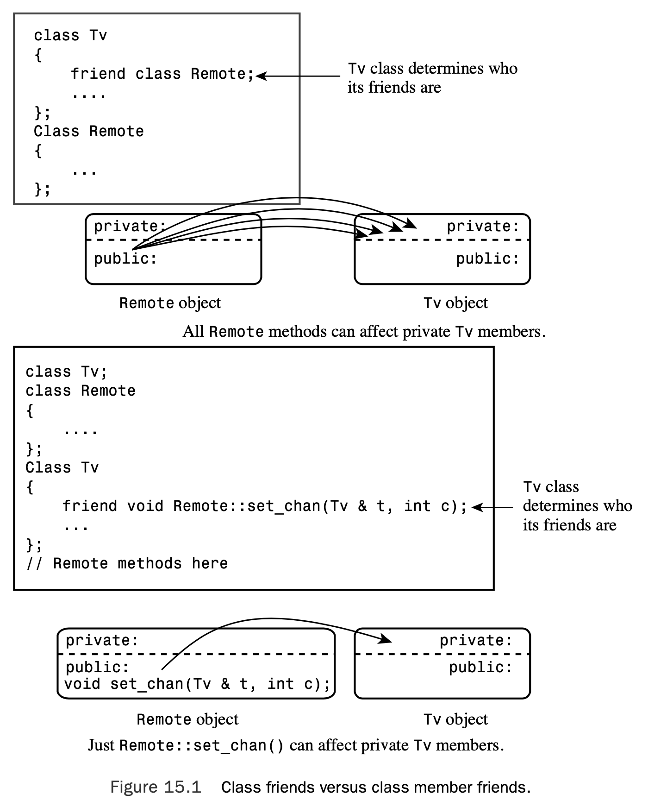
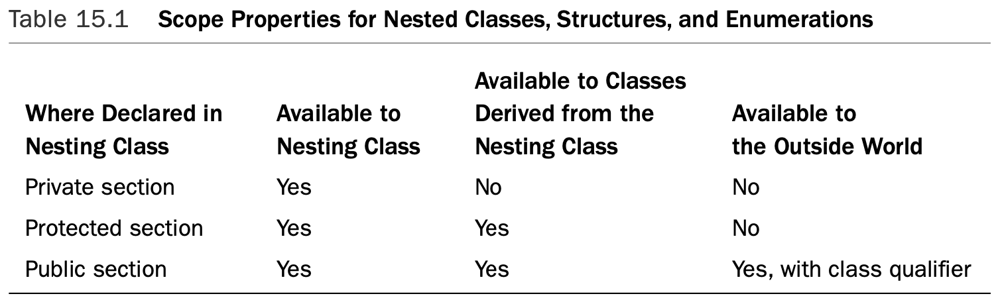
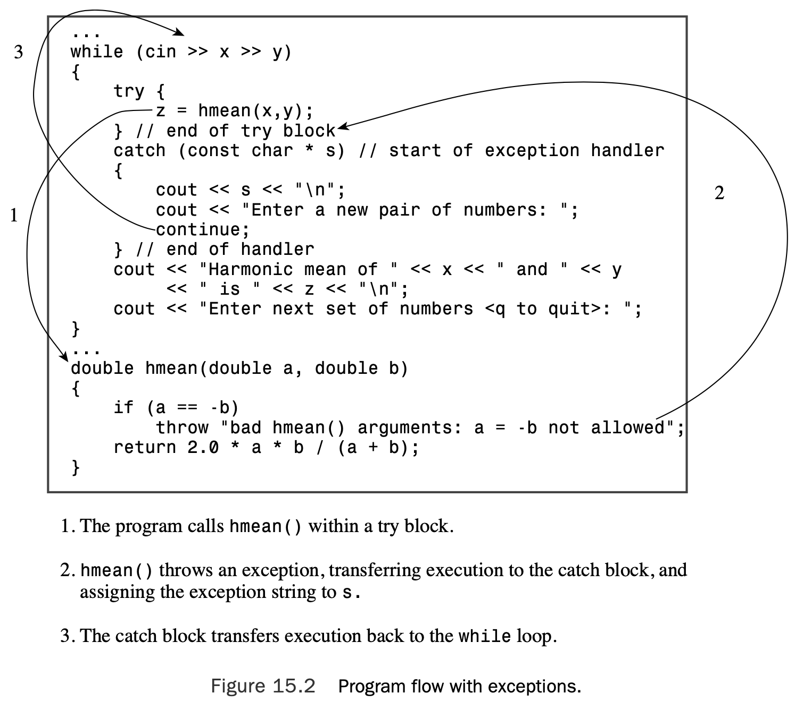
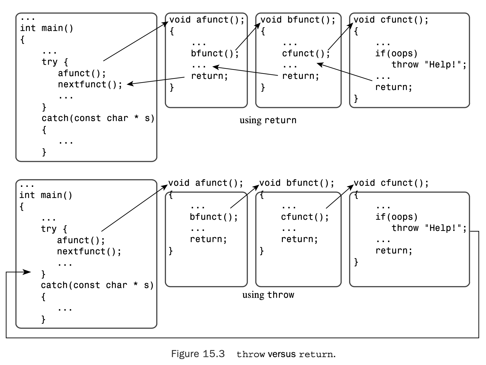
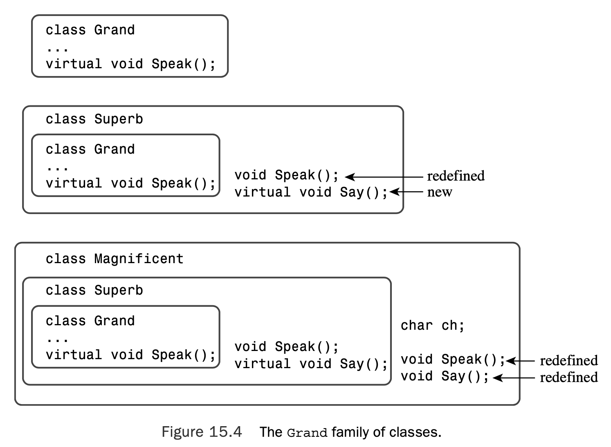

# Chapter 15 Friends, Exceptions, and More

[TOC]

## Friends

A class also can be a friend. In that case, any method of the friend class can access private and pro- tected members of the original class.Also you can be more restrictive and designate just particular member functions of a class to be friends to another class.

### Friend Classes

Let’s define the Tv class.You can represent a television with a set of state members— that is, variables that describe various aspects of the television. Here are some of the possi- ble states:

* On/off
* Channel setting
* Volume setting
* Cable or antenna tuning mode
* TV tuner or A/V input

```c++
// tv.h -- Tv and Remote classes 
#ifndef TV_H_
#define TV_H_

class Tv
{
public:
    friend class Remote;    // Remote can access Tv private parts
    enum {Off, On};
    enum {MinVal,MaxVal = 20}; 
    enum {Antenna, Cable}; 
    enum {TV, DVD};

    Tv(int s = Off, int mc = 125) : state(s), volume(5),
        maxchannel(mc), channel(2), mode(Cable), input(TV) {}
    void onoff() {state = (state == On)? Off : On;} 
    bool ison() const {return state == On;}
    bool volup();
    bool voldown();
    void chanup();
    void chandown();
    void set_mode() {mode = (mode == Antenna)? Cable : Antenna;} 
    void set_input() {input = (input == TV)? DVD : TV;}
    void settings() const;  // display all settings
private:
    int state;              // on or off
    int volume;             // assumed to be digitized
    int maxchannel;         // maximum number of channels
    int channel;            // current channel setting
    int mode;               // broadcast of cable
    int input;              // TV or DVD
};

class Remote 
{
private:
    int mode; // controls TV or DVD 
public:
    Remote(int m = Tv::TV) : mode(m) {}
    bool volup(Tv & t) { return t.volup();}
    bool voldown(Tv & t) { return t.voldown();} 
    void onoff(Tv & t) { t.onoff(); }
    void chanup(Tv & t) {t.chanup();}
    void chandown(Tv & t) {t.chandown();}
    void set_chan(Tv & t, int c) {t.channel = c;} 
    void set_mode(Tv & t) {t.set_mode();}
    void set_input(Tv & t) {t.set_input();}
}; 

#endif
```

```c++
// tv.cpp -- methods for the Tv class (Remote methods are inline) 
#include <iostream>
#include "tv.h"

bool Tv::volup()
{
    if (volume < MaxVal) 
    {
        volume++;
        return true; 
    }
    else
        return false;
}

bool Tv::voldown() 
{
    if (volume > MinVal) 
    {
        volume--;
        return true; 
    }
    else
        return false;
}

void Tv::chanup() 
{
    if (channel < maxchannel) 
        channel++;
    else
        channel = 1;
}

void Tv::chandown() 
{
    if (channel > 1) 
        channel--;
    else
        channel = maxchannel;
}

void Tv::settings() const 
{
    using std::cout;
    using std::endl;
    cout << "TV is " << (state == Off? "Off" : "On") << endl; 
    if (state == On)
    {
        cout << "Volume setting = " << volume << endl; 
        cout << "Channel setting = " << channel << endl; 
        cout << "Mode = "
             << (mode == Antenna? "antenna" : "cable") << endl;
        cout << "Input = "
             << (input == TV? "TV" : "DVD") << endl;
    }
}
```

```c++
//use_tv.cpp -- using the Tv and Remote classes 
#include <iostream>
#include "tv.h"

int main()
{
    using std::cout;
    Tv s42;
    cout << "Initial settings for 42\" TV:\n"; 
    s42.settings();
    s42.onoff();
    s42.chanup();
    cout << "\nAdjusted settings for 42\" TV:\n"; 
    s42.settings();

    Remote grey;

    grey.set_chan(s42, 10);
    grey.volup(s42);
    grey.volup(s42);
    cout << "\n42\" settings after using remote:\n"; 
    s42.settings();

    Tv s58(Tv::On); 
    s58.set_mode(); 
    grey.set_chan(s58,28);
    cout << "\n58\" settings:\n"; 
    s58.settings();
    return 0;
}
```

```shell
Initial settings for 42" TV:
TV is Off

Adjusted settings for 42" TV:
TV is On
Volume setting = 5
Channel setting = 3
Mode = cable
Input = TV

42" settings after using remote:
TV is On
Volume setting = 7
Channel setting = 10
Mode = cable
Input = TV

58" settings:
TV is On
Volume setting = 5
Channel setting = 28
Mode = antenna
Input = TV
```

### Friend Member Functions

The way to make `Remote::set_chan()` a friend to the `Tv` class is to declare it as a friend in the `Tv` class declaration:

```c++
class Tv 
{
	friend void Remote::set_chan(Tv & t, int c); 
    ...
};
```

However, for the compiler to process this statement, it needs to have already seen the `Remote` definition. Otherwise, it won’t know that `Remote` is a class and that `set_chan()` is a method of that class.This suggests putting the `Remote` definition above the `Tv` definition. But the fact that `Remote` methods mention `Tv` objects means that the `Tv` definition should appear above the `Remote` definition. Part of the way around the circular dependence is to use a **forward declaration**.To do so, you insert the following statement above the `Remote` definition:

```c++
class Tv; 		// forward declaration
```

This provides the following arrangement:

```c++
class Tv; // forward declaration 
class Remote { ... };
class Tv { ... };
```

Could you use the following arrangement instead?

```c++
class Remote; // forward declaration 
class Tv { ... };
class Remote { ... };
```

The answer is no.The reason, as mentioned earlier, is that when the compiler sees that a `Remote` method is declared as a friend in the `Tv` class declaration, the compiler needs to have already viewed the declaration of the `Remote` class in general and of the `set_chan() `method in particular.

Another difficulty remains. In Listing 15.1, the `Remote` declaration contains inline code such as the following:

```c++
void onoff(Tv & t) { t.onoff(); }
```

Because this calls a `Tv` method, the compiler needs to have seen the `Tv` class declaration at this point so that it knows what methods `Tv` has. 

```c++

class Tv; // forward declaration
class Remote { ... }; // Tv-using methods as prototypes only 
class Tv { ... };
// put Remote method definitions here

```

The `Remote` prototypes look like this:

```c++
void onoff(Tv & t);
```

```c++
// tvfm.h -- Tv and Remote classes using a friend member 
#ifndef TVFM_H_
#define TVFM_H_

class Tv;                   // forward declaration

class Remote 
{
public:
    enum State{Off, On};
    enum {MinVal,MaxVal = 20}; 
    enum {Antenna, Cable}; 
    enum {TV, DVD};
private:
    int mode;
public:
    Remote(int m = Tv::TV) : mode(m) {}
    bool volup(Tv & t);     // prototype only
    bool voldown(Tv & t);
    void onoff(Tv & t);
    void chanup(Tv & t);
    void chandown(Tv & t);
    void set_chan(Tv & t, int c);
    void set_mode(Tv & t);
    void set_input(Tv & t);
}; 

class Tv
{
public:
    friend void Remote::set_chan(Tv & t, int c);
    enum State{Off, On};
    enum {MinVal,MaxVal = 20}; 
    enum {Antenna, Cable}; 
    enum {TV, DVD};

    Tv(int s = Off, int mc = 125) : state(s), volume(5),
        maxchannel(mc), channel(2), mode(Cable), input(TV) {}
    void onoff() {state = (state == On)? Off : On;} 
    bool ison() const {return state == On;}
    bool volup();
    bool voldown();
    void chanup();
    void chandown();
    void set_mode() {mode = (mode == Antenna)? Cable : Antenna;} 
    void set_input() {input = (input == TV)? DVD : TV;}
    void settings() const;  // display all settings
private:
    int state;              // on or off
    int volume;             // assumed to be digitized
    int maxchannel;         // maximum number of channels
    int channel;            // current channel setting
    int mode;               // broadcast of cable
    int input;              // TV or DVD
};

// Remote methods as inline functions
inline bool Remote::volup(Tv & t) { return t.volup();} 
inline bool Remote::voldown(Tv & t) { return t.voldown();} 
inline void Remote::onoff(Tv & t) { t.onoff(); }
inline void Remote::chanup(Tv & t) {t.chanup();}
inline void Remote::chandown(Tv & t) {t.chandown();}
inline void Remote::set_mode(Tv & t) {t.set_mode();}
inline void Remote::set_input(Tv & t) {t.set_input();} 
inline void Remote::set_chan(Tv & t, int c) {t.channel = c;}

#endif
```

If you include `tvfm.h` instead of `tv.h `in `tv.cpp` and` use_tv.cpp`, the resulting program behaves the same as the original.The difference is that just one `Remote` method— instead of all the `Remote` methods—is a friend to the Tv class. Figure 15.1 illustrates this difference.



### Shared Friends

Suppose, for example, that you have a `Probe` class that represents some sort of programmable measuring device and an `Analyzer` class that represents some sort of programmable analyzing device. Each has an internal `clock`, and you would like to be able to synchronize the two clocks.You could use something along the following lines:

```c++
class Analyzer; // forward declaration
class Probe
{
    friend void sync(Analyzer & a, const Probe & p); // sync a to p 
    friend void sync(Probe & p, const Analyzer & a); // sync p to a
    ...
};
class Analyzer 
{
	friend void sync(Analyzer & a, const Probe & p); // sync a to p 
    friend void sync(Probe & p, const Analyzer & a); // sync p to a 
    ...
};
// define the friend functions
inline void sync(Analyzer & a, const Probe & p) 
{
	...
}
inline void sync(Probe & p, const Analyzer & a) 
{
	...
}
```

The forward declaration enables the compiler to know that `Analyzer` is a type when it

reaches the friend declarations in the `Probe` class declaration.

## Nested Classes

In C++, you can place a class declaration inside another class.The class declared within another is called a **nested class**, and it helps avoid name clutter by giving the new type class scope. Member functions of the class containing the declaration can create and use objects of the nested class.The outside world can use the nested class only if the declaration is in the public section and if you use the scope-resolution operator. 

Nesting classes is not the same as containment. Recall that containment means having a class object as a member of another class. Nesting a class, on the other hand, does not create a class member. Instead, it defines a type that is known just locally to the class that contains the nested class declaration.

```c++
class Queue
{
private:
// class scope definitions
    // Node is a nested structure definition local to this class 
    struct Node {Item item; struct Node * next;};
	...
};
```

Knowing now where and how a constructor should be used, you can provide an appropriate constructor definition:

```c++
class Queue
{
private:
// class scope definitions
    // Node is a nested class definition local to this class 
    class Node
    {
    public:
        Item item;
        Node * next;
        Node(const Item & i) : item(i), next(0){ }
    };
	...
};
```

Next, you need to rewrite `enqueue()` by using the constructor

```c++
bool Queue::enqueue(const Item & item) 
{
    if (isfull()) 
        return false;
    Node * add = new Node(item); // create, initialize node
// on failure, new throws std::bad_alloc exception
    ...
}
```

This makes the code for `enqueue()` a bit shorter and a bit safer because it automates initialization rather than requiring the programmer to correctly remember what should be done.

### Nested Classes and Access

#### Scope

If a nested class is declared in a private section of a second class, it is known only to that second class.

If the nested class is declared in a protected section of a second class, it is visible to that class but invisible to the outside world. 

If a nested class is declared in a public section of a second class, it is available to the second class, to classes derived from the second class, and, because it’s public, to the out- side world. 

Table 15.1 summarizes scope properties for nested classes, structures, and enumerations.



#### Access Control

Declaring the `Node` class in the `Queue` class declaration does not grant the `Queue` class any special access privileges to the `Node` class, nor does it grant the `Node` class any special access privileges to the `Queue` class.Thus, a `Queue` class object can access only the public members of a `Node` object explicitly. 

### Nesting in a Template

```c++
// queuetp.h -- queue template with a nested class 
#ifndef QUEUETP_H_
#define QUEUETP_H_

template <class Item>
class QueueTP
{
private:
    enum {Q_SIZE = 10};
    // Node is a nested class definition
    class Node
    {
    public:
        Item item;
        Node * next;
        Node(const Item & i):item(i), next(0){ }
    };
    Node * front;       // pointer to front of Queue
    Node * rear;        // pointer to rear of Queue
    int items;          // current number of items in Queue
    const int qsize;    // maximum number of items in Queue
    QueueTP(const QueueTP & q) : qsize(0) {}
    QueueTP & operator=(const QueueTP & q) { return *this; }
public:
    QueueTP(int qs = Q_SIZE); 
    ~QueueTP();
    bool isempty() const
    {
        return items == 0; 
    }
    bool isfull() const 
    {
        return items == qsize; 
    }
    int queuecount() const 
    {
        return items; 
    }
    bool enqueue(const Item &item); // add item to end
    bool dequeue(Item &item);       // remove item from front
};

// QueueTP methods
template <class Item> 
QueueTP<Item>::QueueTP(int qs) : qsize(qs) 
{
    front = rear = 0;
    items = 0; 
}

template <class Item> 
QueueTP<Item>::~QueueTP() 
{
    Node * temp; 
    while (front != 0)      // while queue is not yet empty
    {
        temp = front;       // save address of front item
        front = front->next;// reset pointer to next item 
        delete temp;        // delete former front
    }
}

// Add item to queue
template <class Item>
bool QueueTP<Item>::enqueue(const Item & item) 
{
    if (isfull()) 
        return false;
    Node * add = new Node(item); // create node 
// on failure, new throws std::bad_alloc exception
    items++;
    if (front == 0)         // if queue is empty,
        front = add;        // place item at front
    else
        rear->next = add;   // else place at rear
    rear = add;             // have rear point to new node
    return true; 
}

// Place front item into item variable and remove from queue 
template <class Item>
bool QueueTP<Item>::dequeue(Item & item)
{
    if (front == 0) 
        return false;
    item = front->item;     // set item to first item in queue
    items--;
    Node * temp = front;    // save location of first item
    front = front->next;    // reset front to next item
    delete temp;            // delete former first item
    if (items == 0)
        rear = 0; 
    return true;
}

#endif
```

```c++
// nest.cpp -- using a queue that has a nested class
#include <iostream>
#include <string> 
#include "queuetp.h"

int main() 
{
    using std::string; 
    using std::cin; 
    using std::cout;

    QueueTP<string> cs(5); 
    string temp;

    while(!cs.isfull()) 
    {
        cout << "Please enter your name. You will be " 
                "served in the order of arrival.\n" 
                "name: ";
        getline(cin, temp); 
        cs.enqueue(temp);
    }
    cout << "The queue is full. Processing begins!\n";

    while (!cs.isempty()) 
    {
        cs.dequeue(temp);
        cout << "Now processing " << temp << "...\n"; 
    }
    return 0;
}
```

```shell
Please enter your name. You will be served in the order of arrival.
name: Kinsey Millhone
Please enter your name. You will be served in the order of arrival.
name: Adam Dalgliesh
Please enter your name. You will be served in the order of arrival.
name: Andrew Dalziel
Please enter your name. You will be served in the order of arrival.
name: Kay Scarpetta
Please enter your name. You will be served in the order of arrival.
name: Richard Jury
The queue is full. Processing begins!
Now processing Kinsey Millhone...
Now processing Adam Dalgliesh...
Now processing Andrew Dalziel...
Now processing Kay Scarpetta...
Now processing Richard Jury...
```

## Exceptions

### Calling `abort()`

```c++
//error1.cpp -- using the abort() function 
#include <iostream>
#include <cstdlib>
double hmean(double a, double b);

int main() 
{
    double x, y, z;

    std::cout << "Enter two numbers: "; 
    while (std::cin >> x >> y)
    {
        z = hmean(x,y);
        std::cout << "Harmonic mean of " << x << " and " << y
            << " is " << z << std::endl;
        std::cout << "Enter next set of numbers <q to quit>: ";
    }
    std::cout << "Bye!\n"; 
    return 0;
}

double hmean(double a, double b) 
{
    if (a == -b) 
    {
        std::cout << "untenable arguments to hmean()\n";
        std::abort(); 
    }
    return 2.0 * a * b / (a + b);
}
```

```shell
Enter two numbers: 3 6
Harmonic mean of 3 and 6 is 4
Enter next set of numbers <q to quit>: 10 -10
untenable arguments to hmean()
zsh: abort      ./error1
```

### Returning an Error Code

```c++
//error2.cpp -- returning an error code 
#include <iostream>
#include <cfloat> // (or float.h) for DBL_MAX

bool hmean(double a, double b, double * ans);

int main()
{
    double x, y, z;

    std::cout << "Enter two numbers: "; 
    while (std::cin >> x >> y)
    {
        if (hmean(x,y,&z))
            std::cout << "Harmonic mean of " << x << " and " << y
                << " is " << z << std::endl;
        else
            std::cout << "One value should not be the negative "
                << "of the other - try again.\n";
        std::cout << "Enter next set of numbers <q to quit>: ";        
    }
    std::cout << "Bye!\n"; 
    return 0;
}

bool hmean(double a, double b, double * ans) 
{
    if (a == -b) 
    {
        *ans = DBL_MAX;
        return false; 
    }
    else 
    {
        *ans = 2.0 * a * b / (a + b);
        return true; 
    }
}
```

```shell
Enter two numbers: 3 6
Harmonic mean of 3 and 6 is 4
Enter next set of numbers <q to quit>: 10 -10
One value should not be the negative of the other - try again.
Enter next set of numbers <q to quit>: q
Bye!
```

### The Exception Mechanism

A C++ **exception** is a response to an exceptional circumstance that arises while a program is run- ning, such as an attempt to divide by zero. Exceptions provide a way to transfer control from one part of a program to another. Handling an exception has three components:

* Throwing an exception

* Catching an exception with a handler 
* Using a `try` block

```c++
// error3.cpp -- using an exception 
#include <iostream>
double hmean(double a, double b);

int main()
{
    double x, y, z;

    std::cout << "Enter two numbers: "; 
    while (std::cin >> x >> y)
    {
        try                     // start of try block
        {
            z = hmean(x,y);
        }                       // end of try block
        catch(const char * s)   // start of exception handler
        {
            std::cout << s << std::endl;
            std::cout << "Enter a new pair of numbers: ";
            continue;
        }						// end of handler
        std::cout << "Harmonic mean of " << x << " and " << y
            << " is " << z << std::endl;
        std::cout << "Enter next set of numbers <q to quit>: ";
    }
    std::cout << "Bye!\n";
    return 0;
}

double hmean(double a, double b) 
{
    if (a == -b)
        throw "bad hmean() arguments: a = -b not allowed";
    return 2.0 * a * b / (a + b); 
}
```

```shell
Enter two numbers: 3 6
Harmonic mean of 3 and 6 is 4
Enter next set of numbers <q to quit>: 10 -10
bad hmean() arguments: a = -b not allowed
Enter a new pair of numbers: 1 19
Harmonic mean of 1 and 19 is 1.9
Enter next set of numbers <q to quit>: q
Bye!
```

The `try` block in Listing 15.9 looks like this:

```c++
try{
    z = hmean(x,y);
}
```

If any statement in this block leads to an exception being thrown, the `catch` blocks after this block will handle the exception. If the program calls `hmean()` somewhere else outside this (and any other) `try` block, it won’t have the opportunity to handle an exception.

Throwing an exception looks like this:

```c++
if (a == -b)
	throw "bad hmean() arguments: a = -b not allowed";
```

If a program completes executing statements in a `try` block without any exceptions being thrown, it skips the `catch` block or blocks after the `try` block and goes to the first statement following the handlers. So when the sample run of the program in Listing 15.9 processes the values `3` and `6`, program execution goes directly to the output statement and reports the result.



### Using Objects as Exceptions

```c++
class bad_hmean 
{
private:
    double v1;
    double v2; 
public:
	bad_hmean(int a = 0, int b = 0) : v1(a), v2(b){}
    void mesg();
};

inline void bad_hmean::mesg()
{
    std::cout << "hmean()" << v1 << ", " << v2 << "): "
        	  << "invalid arguments: a = -b\n";
}
```

A `bad_hmean` object can be initialized to the values passed to `hmean()`, and the `mesg() `method can be used to report the problem, including the values.The `hmean()` function can use code like this:

```c++
if (a == -b)
    throw bad_hmean(a,b);
```

```c++
// exc_mean.h -- exception classes for hmean(), gmean()
#include <iostream>

class bad_hmean 
{
private:
    double v1;
    double v2; 
public:
	bad_hmean(int a = 0, int b = 0) : v1(a), v2(b){}
    void mesg();
};

inline void bad_hmean::mesg()
{
    std::cout << "hmean(" << v1 << ", " << v2 << "): "
        	  << "invalid arguments: a = -b\n";
}

class bad_gmean 
{
public:
    double v1;
    double v2;
    bad_gmean(double a = 0, double b = 0) : v1(a), v2(b){} 
    const char * mesg();
};

inline const char * bad_gmean::mesg() 
{
    return "gmean() arguments should be >= 0\n"; 
}
```

```c++
//error4.cpp – using exception classes 
#include <iostream>
#include <cmath> // or math.h, unix users may need -lm flag
#include "exc_mean.h" 
// function prototypes 
double hmean(double a, double b);
double gmean(double a, double b);
int main()
{
    using std::cout; 
    using std::cin; 
    using std::endl;

    double x, y, z;

    cout << "Enter two numbers: ";
    while (cin >> x >> y)
    {
        try {               // start of try block
            z = hmean(x,y);
            cout << "Harmonic mean of " << x << " and " << y 
                 << " is " << z << endl;
            cout << "Geometric mean of " << x << " and " << y 
                 << " is " << gmean(x,y) << endl;
            cout << "Enter next set of numbers <q to quit>: "; 
        }// end of try block
        catch (bad_hmean & bg) // start of catch block
        {
            bg.mesg();
            cout << "Try again.\n";
            continue; 
        }
        catch (bad_gmean & hg) 
        {
            cout << hg.mesg();
            cout << "Values used: " << hg.v1 << ", "
                 << hg.v2 << endl;
            cout << "Sorry, you don't get to play any more.\n"; 
            break;
        }// end of catch block 
    }
    cout << "Bye!\n";
    return 0; 
}

double hmean(double a, double b) 
{
    if (a == -b)
        throw bad_hmean(a,b);
    return 2.0 * a * b / (a + b); 
}

double gmean(double a, double b) 
{
    if (a < 0 || b < 0) 
        throw bad_gmean(a,b);
    return std::sqrt(a * b); 
}
```

```shell
Enter two numbers: 4 12
Harmonic mean of 4 and 12 is 6
Geometric mean of 4 and 12 is 6.9282
Enter next set of numbers <q to quit>: 5 -5
hmean(5, -5): invalid arguments: a = -b
Try again.
5 -2
Harmonic mean of 5 and -2 is -6.66667
Geometric mean of 5 and -2 is gmean() arguments should be >= 0
Values used: 5, -2
Sorry, you don't get to play any more.
Bye!
```

### Unwinding the Stack

Now suppose a function terminates via a thrown exception instead of via a return call. Again, the program frees memory from the stack. But instead of stopping at the first return address on the stack, the program continues freeing the stack until it reaches a return address that resides in a try block (see Figure 15.3). Control then passes to the exception handlers at the end of the block rather than to the first statement following the function call.This process is called **unwinding the stack**. 



```c++
//error5.cpp -- unwinding the stack
#include <iostream>
#include <cmath> // or math.h, unix users may need -lm flag 
#include <string>
#include "exc_mean.h"

class demo 
{ 
private:
    std::string word; 
public:
    demo (const std::string & str)
    {
        word = str;
        std::cout << "demo " << word << " created\n";
    }
    ~demo()
    {
        std::cout << "demo " << word << " destroyed\n";
    }
    void show() const 
    {
        std::cout << "demo " << word << " lives!\n"; 
    }
};


// function prototypes 
double hmean(double a, double b);
double gmean(double a, double b);
double means(double a, double b);

int main() 
{
    using std::cout; 
    using std::cin; 
    using std::endl;

    double x, y, z;
    {
        demo d1("found in block in main()");
        cout << "Enter two numbers: ";
        while (cin >> x >> y) 
        {
            try {               // start of try block
                z = means(x,y);
                cout << "The mean mean of " << x << " and " << y 
                    << " is " << z << endl;
                cout << "Enter next pair: "; 
            }// end of try block
            catch (bad_hmean & bg) // start of catch block
            {
                bg.mesg();
                cout << "Try again.\n";
                continue; 
            }
            catch (bad_gmean & hg) 
            {
                cout << hg.mesg();
                cout << "Values used: " << hg.v1 << ", "
                    << hg.v2 << endl;
                cout << "Sorry, you don't get to play any more.\n"; 
                break;
            }// end of catch block 
        }
        d1.show();
    }
    cout << "Bye!\n"; 
    cin.get(); 
    cin.get(); 
    return 0;
}

double hmean(double a, double b) 
{
    if (a == -b)
        throw bad_hmean(a,b);
    return 2.0 * a * b / (a + b); 
}

double gmean(double a, double b) 
{
    if (a < 0 || b < 0) 
        throw bad_gmean(a,b);
    return std::sqrt(a * b); 
}

double means(double a, double b) 
{
    double am, hm, gm;
    demo d2("found in means()");
    am = (a + b) / 2.0;     // arithmetic mean
    try
    {
        hm = hmean(a,b);
        gm = gmean(a,b); 
    }
    catch (bad_hmean & bg)  // start of catch block 
    {
        bg.mesg();
        std::cout << "Caught in means()\n";
        throw;              // rethrows the exception
    }
    d2.show();
    return (am + hm + gm) / 3.0;
}
```

```shell
demo found in block in main() created
Enter two numbers: 6 12
demo found in means() created
demo found in means() lives!
demo found in means() destroyed
The mean mean of 6 and 12 is 8.49509
Enter next pair: 6 -6
demo found in means() created
hmean(6, -6): invalid arguments: a = -b
Caught in means()
demo found in means() destroyed
hmean(6, -6): invalid arguments: a = -b
Try again.
6 -8
demo found in means() created
demo found in means() destroyed
gmean() arguments should be >= 0
Values used: 6, -8
Sorry, you don't get to play any more.
demo found in block in main() lives!
demo found in block in main() destroyed
Bye!
```

Now the third input cycle begins, with `6` and `-8` sent on to `means()`. Because `means()` doesn’t catch `bad_gmean` exceptions, the exception is passed on up to `main()`, and no further code in `means()` is executed. However, once again, as the program unwinds the stack, it frees local automatic variables, so the destructor for `d2` is called:

```c++
demo found in means() destroyed
```

Finally, the bad_gmean handler in `main()` catches the exception and terminates the loop:

```c++
gmean() arguments should be >= 0 
Values used: 6, -8
Sorry, you don't get to play any more.
```

The compiler always creates a temporary copy when throwing an exception, even if the exception specifier and catch blocks specify a reference.

```c++
class problem {...};
...
void super() throw (problem)
{
    ...
    if (oh_no)
    {
        problem oops;	// construct object
        throw oops;		// construct object
        ...
    }
}
...
try{
    super();
}
catch(problem & p)
{
// statements
}
```

Suppose you have a collection of exception types that are related by inheritance. In that case, the exception specification need only list a reference to the base type, and that would also match any derived objects thrown.

```c++
class bad_1 {...};
class bad_2 : public bad_1 {...}; 
class bad_3 : public bad 2 {...}; 
...
void duper()
{
    ...
    if (oh_no)
    	throw bad_1();
    if (rats) 
        throw bad_2();
    if (drat) 
        throw bad_3();
}
... 
try {
    duper(); 
}
catch(bad_3 &be) 
{ // statements } 
catch(bad_2 &be) 
{ // statements } 
catch(bad_1 &be) 
{ // statements }
```

If the` bad_1 &` handler were first, it would catch the `bad_1`, `bad_2`, and `bad_3` exceptions. With the inverse order, a `bad_3` exception would be caught by the `bad_3 &` handler.

### The `exception` Class

```c++
#include <exception>
class bad_hmean : public std::exception 
{
public:
	const char * what() { return "bad arguments to hmean()"; }
...
};
class bad_gmean : public std::exception 
{
public:
	const char * what() { return "bad arguments to gmean()"; }
...
};
```

If you don’t want to handle these derived exceptions differently from one another, you can catch them with the same base-class handler:

```c++
try{
    ...
}
catch(std::exception & e)
{
    cout << e.what() << endl;
    ...
}
```

#### The `stdexcept` Exception Classes

```c++
class logic_error : public exception 
{
public:
explicit logic_error(const string& what_arg);
...
};

class domain_error : public logic_error
{
public:
explicit domain_error(const string& what_arg);
...
};
```

The `logic_error` family describes, as you might expect, typical logic errors. In principle, sound programming could avoid such errors, but in practice, such errors might show up. The name of each class indicates the sort of error it is intended to report:

```c++
	domain_error 
    invalid_argument 
    length_error 
    out_of_bounds
```

Each class has a constructor like that of `logic_error` that allows you to provide the string to be returned by the `what()` method.

The `invalid_argument` exception alerts you that an unexpected value has been passed to a function. For example, if a function expects to receive a string for which each charac- ter is either a '0' or '1', it could throw the invalid_argument exception if some other character appeared in the string.

The `length_error` exception is used to indicate that not enough space is available for the desired action. For example, the string class has an append() method that throws a length_error exception if the resulting string would be larger than the maximum possi- ble string length.

The `out_of_bounds` exception is typically used to indicate indexing errors. For exam- ple, you could define an array-like class for which operator()[] throws the out_of_bounds exception if the index used is invalid for that array.

Next, the `runtime_error` family describes errors that might show up during runtime but that could not easily be predicted and prevented.The name of each class indicates the sort of error it is intended to report:

```c++
	range_error 
    overflow_error 
    underflow_error
```

Each class has a constructor like that of `runtime_error` that allows you to provide the string to be returned by the `what()` method.

An `underflow_error` can occur in floating-point calculations. In general, there is a smallest nonzero magnitude that a floating-point type can represent.A calculation that would produce a smaller value would cause an underflow error.

An `overflow_error` can occur with either integer or floating-point types when the magnitude of the result of a calculation would exceed the largest representable value for that type.

In general, an exception of the `logic_error` family indicates a problem that is susceptible to a programming fix, whereas a `runtime_error` family exception is just a bit of unavoidable trouble.

#### The `bad_alloc` Exception and `new`

```c++
// newexcp.cpp -- the bad_alloc exception 
#include <iostream>
#include <new>
#include <cstdlib> // for exit(), EXIT_FAILURE 
using namespace std;

struct Big 
{
    double stuff[20000]; 
};

int main() 
{
    Big * pb; 
    try {
        cout << "Trying to get a big block of memory:\n"; 
        pb = new Big[10000]; // 1,600,000,000 bytes
        cout << "Got past the new request:\n";
    }
    catch (bad_alloc & ba) 
    {
        cout << "Caught the exception!\n"; 
        cout << ba.what() << endl; 
        exit(EXIT_FAILURE);
    }
    cout << "Memory successfully allocated\n"; 
    pb[0].stuff[0] = 4;
    cout << pb[0].stuff[0] << endl;
    delete [] pb;
    return 0;
}
```

```shell
Trying to get a big block of memory:
Got past the new request:
Memory successfully allocated
4
```

#### The Null Pointer and `new`

Much code was written when `new` (the old `new`) returned a null pointer upon failure. Some compilers handled the transition to the new `new` by letting the user set a flag or switch to choose which behavior she wanted. Currently, the standard provides for an alternative form of `new` that still returns a null pointer. Its use looks like this:

```c++
int * pi = new (std::nothrow) int;
int * pa = new (std::nowthrow) int[500];
```

Using this form, you could rewrite the core of Listing 15.13 this way:

```c++
Big * pb;
pb = new (std::nothrow) Big[10000]; // 1,600,000,000 bytes 
if (pb == 0)
{
    cout << "Could not allocate memory. Bye.\n";
    exit(EXIT_FAILURE); 
}
```

### Exceptions, Classes, and Inheritance

```c++
// sales.h -- exceptions and inheritance 
#include <stdexcept>
#include <string>

class Sales 
{
public:
    enum {MONTHS = 12};
    class bad_index : public std::logic_error 
    {
    private:
        int bi; // bad index value 
    public:
        explicit bad_index(int ix,
            const std::string & s = "Index error in Sales object\n");
        int bi_val() const {return bi;}
        virtual ~bad_index() throw() {} 
    };
    explicit Sales(int yy = 0);
    Sales(int yy, const double * gr, int n); 
    virtual ~Sales() { }
    int Year() const { return year; } 
    virtual double operator[](int i) const; 
    virtual double & operator[](int i);
private:
    double gross[MONTHS]; 
    int year;
};

class LabeledSales : public Sales 
{
public:
    class nbad_index : public Sales::bad_index
    {
    private: 
        std::string lbl;
    public:
        nbad_index(const std::string & lb, int ix,
            const std::string & s = "Index error in LabeledSales object\n"); const std::string & label_val() const {return lbl;}
        virtual ~nbad_index() throw() {}
    };
    explicit LabeledSales(const std::string & lb = "none", int yy = 0); 
    LabeledSales(const std::string & lb, int yy, const double * gr, int n); 
    virtual ~LabeledSales() { }
    const std::string & Label() const {return label;}
    virtual double operator[](int i) const;
    virtual double & operator[](int i);
private:
    std::string label;
};
```

```c++
// sales.cpp -- Sales implementation 
#include "sales.h"
using std::string;

Sales::bad_index::bad_index(int ix, const string & s ) 
    : std::logic_error(s), bi(ix)
{ 
}

Sales::Sales(int yy)
 {
    year = yy;
    for (int i = 0; i < MONTHS; ++i)
        gross[i] = 0;
}

Sales::Sales(int yy, const double * gr, int n) 
{
    year = yy;
    int lim = (n < MONTHS)? n : MONTHS;
    int i;
    for (i = 0; i < lim; ++i)
        gross[i] = gr[i];
    // for i > n and i < MONTHS 
    for ( ; i < MONTHS; ++i)
        gross[i] = 0;
}

double Sales::operator[](int i) const
{
    if(i < 0 || i >= MONTHS) 
        throw bad_index(i);
    return gross[i]; 
}

double & Sales::operator[](int i) 
{
    if(i < 0 || i >= MONTHS) 
        throw bad_index(i);
    return gross[i]; 
}

LabeledSales::nbad_index::nbad_index(const string & lb, int ix, 
        const string & s ) : Sales::bad_index(ix, s)
{
    lbl = lb; 
}

LabeledSales::LabeledSales(const string & lb, int yy) 
        : Sales(yy)
{
    label = lb;
}

LabeledSales::LabeledSales(const string & lb, int yy, 
                            const double * gr, int n) 
                                    : Sales(yy, gr, n)
{
    label = lb; 
}

double LabeledSales::operator[](int i) const 
{ 
    if(i < 0 || i >= MONTHS)
        throw nbad_index(Label(), i); 
    return Sales::operator[](i);
}

double & LabeledSales::operator[](int i) 
{
    if(i < 0 || i >= MONTHS)
        throw nbad_index(Label(), i);
    return Sales::operator[](i); 
}
```

```c++
// use_sales.cpp -- nested exceptions 
#include <iostream>
#include "sales.h"

int main() 
{
    using std::cout; 
    using std::cin; 
    using std::endl;

    double vals1[12] = 
    {
        1220, 1100, 1122, 2212, 1232, 2334,
        2884, 2393, 3302, 2922, 3002, 3544 
    };

    double vals2[12] = 
    {
        12, 11, 22, 21, 32, 34,
        28, 29, 33, 29, 32, 35 
    };
    
    Sales sales1(2011, vals1, 12);
    LabeledSales sales2("Blogstar",2012, vals2, 12 );

    cout << "First try block:\n"; 
    try
    {
        int i;
        cout << "Year = " << sales1.Year() << endl; 
        for (i = 0; i < 12; ++i)
        {
            cout << sales1[i] << ' '; 
            if (i % 6 == 5)
                cout << endl;
        }
        cout << "Year = " << sales2.Year() << endl; 
        cout << "Label = " << sales2.Label() << endl; 
        for (i = 0; i <= 12; ++i)
        {
            cout << sales2[i] << ' '; 
            if (i % 6 == 5)
                cout << endl;
        }
        cout << "End of try block 1.\n";
    }
    catch(LabeledSales::nbad_index & bad) 
    {
            cout << bad.what(); 
            cout << "Company: " << bad.label_val() << endl; 
            cout << "bad index: " << bad.bi_val() << endl;
    }
    catch(Sales::bad_index & bad)
    {
        cout << bad.what();
        cout << "bad index: " << bad.bi_val() << endl;
    }
    cout << "\nNext try block:\n";
    try
    {
        sales2[2] = 37.5;
        sales1[20] = 23345;
        cout << "End of try block 2.\n";
    }
    catch(LabeledSales::nbad_index & bad) 
    {
        cout << bad.what(); 
        cout << "Company: " << bad.label_val() << endl; 
        cout << "bad index: " << bad.bi_val() << endl;
    } 
    catch(Sales::bad_index & bad)
    {
        cout << bad.what(); 
        cout << "bad index: " << bad.bi_val() << endl;
    }
    cout << "done\n";

    return 0; 
}
```

```shell
First try block:
Year = 2011
1220 1100 1122 2212 1232 2334 
2884 2393 3302 2922 3002 3544 
Year = 2012
Label = Blogstar
12 11 22 21 32 34 
28 29 33 29 32 35 
Index error in LabeledSales object
Company: Blogstar
bad index: 12

Next try block:
Index error in Sales object
bad index: 20
done
```

### When Exceptions Go Astray

If the exception doesn’t match the specification, the unmatched exception is branded an **unexpected exception**, and, by default, it causes the program to abort.

 If it isn’t, which can happen if there is no containing try block or no matching catch block, the exception is branded an **uncaught exception**, and by default, it causes the program to abort. 

An uncaught exception doesn’t initiate an immediate abort. Instead, the program first calls a function called `terminate()`. 

```c++
typedef void (*terminate_handler)();
terminate_handler set_terminate(terminate_handler f) throw(); // C++98 
terminate_handler set_terminate(terminate_handler f) noexcept; // C++11 
void terminate(); // C++98
void terminate() noexcept; // C++11
```


Let’s look at an example. Suppose you want an uncaught exception to cause a program to print a message to that effect and then call the `exit()` function, providing an exit status value of `5`. First, you include the `exception` header file.You can make its declarations available with a `using` directive or appropriate `using` declarations, or you can use the `std:: `qualifier:

```c++
#include <exception> 
using namespace std;
```

Next, you design a function that does the two required actions and has the proper prototype:

```c++
void myQuit() 
{
	cout << "Terminating due to uncaught exception\n";
    exit(5);
}
```

Finally, at the start of the program, you designate this function as your chosen termination action:

```c++
set_terminate(myQuit);
```

Now, if an exception is thrown and not caught, the program calls `terminate()`, and `terminate()` calls `MyQuit()`.

If there is an unexpected exception, the program calls the `unexpected()` function. This function, in turn, calls `terminate(`), which, by default, calls `abort()`. Just as there is a `set_terminate()` function that modifies the behavior of `terminate()`, there is a `set_unexpected()` function that modifies the behavior of `unexpected()`.These new functions are also declared in the exception header file:

```c++
typedef void (*unexpected_handler)();
unexpected_handler set_unexpected(unexpected_handler f) throw(); // C++98 
unexpected_handler set_unexpected(unexpected_handler f) noexcept; // C++11
void unexpected(); // C++98 
void unexpected() noexcept; // C+0x
```

In particular, the `unexpected_handler` function has the following choices:

* It can end the program by calling `terminate()` (the default behavior), `abort()`, or `exit()`.
*  It can throw an exception.

In short, if you’d like to catch all exceptions, expected or otherwise, you can do some- thing like the following. First, you make sure the exception header file declarations are available:

```c++
#include <exception> 
using namespace std;
```

Next, you design a replacement function that converts unexpected exceptions to the bad_exception type and that has the proper prototype:

```c++
void myUnexpected() 
{
	throw std::bad_exception(); //or just throw; 
}
```

Next, at the start of the program, you designate this function as your chosen unex- pected exception action:

```c++
set_unexpected(myUnexpected);
```

Finally, you include the `bad_exception` type in exception specifications and `catch`

block sequences:

```c++
double Argh(double, double) throw(out_of_bounds, bad_exception); 
...
try {
	x = Argh(a, b); 
}
catch(out_of_bounds & ex) 
{
...
}
catch(bad_exception & ex) 
{
...
}
```

### Exception Cautions

Using exceptions adds to the size and subtracts from the speed of a program. 

Exception specifications don’t work well with templates because template functions might throw different kinds of exceptions, depending on the particular specialization used. 

Exceptions and dynamic memory allocation don’t always work that well together.

```c++
void test1(int n) 
{
    string mesg("I'm trapped in an endless loop"); 
    ...
    if (oh_no)
    	throw exception();
    ...
    return; 
}
```

The string class uses dynamic memory allocation. Normally, the string destructor for mesg would be called when the function reached return and terminated.

Now consider this function:

```c++
void test2(int n) 
{
	double * ar = new double[n]; 
    ...
    if (oh_no)
    	throw exception();
    ...
    delete [] ar;
    return; 
}
```

Here there is a problem. Unwinding the stack removes the variable `ar` from the stack. But the premature termination of the function means that the `delete []` statement at the end of the function is skipped.The pointer is gone, but the memory block it pointed to is still intact and inaccessible. In short, there is a memory leak.

The leak can be avoided. For example, you can catch the exception in the same function that throws it, put some cleanup code into the catch block, and rethrow the exception:

```c++
void test3(int n) 
{
    double * ar = new double[n]; 
        ...
    try {
        if (oh_no)
        	throw exception();
    }
    catch(exception & ex) 
    {
        delete [] ar;
        throw; 
    }
    ...
    delete [] ar;
    return; 
}
```

Another solution is to use one of the smart pointer templates discussed in Chapter 16, “The `string` Class and the Standard Template Library.”

## Runtime Type Identification

### What Is RTTI For?

Perhaps you want to invoke the correct version of a class method. If that’s the case, you don’t really need to know the object type, as long as that function is a virtual function possessed by all members of the class hierarchy. But it could be that a derived object has an uninherited method. In that case, only some objects could use the method. Or maybe, for debugging purposes, you would like to keep track of which kinds of objects were generated. For these last two cases, RTTI provides an answer.

### How Does RTTI Work?

C++ has three components supporting RTTI:

* The `dynamic_cast` operator generates a pointer to a derived type from a pointer to

    a base type, if possible. Otherwise, the operator returns `0`, the null pointer.

* The `typeid` operator returns a value identifying the exact type of an object.

* A `type_info` structure holds information about a particular type.

You can use RTTI only with a class hierarchy that has virtual functions.The reason for this is that these are the only class hierarchies for which you should be assigning the addresses of derived objects to base-class pointers.

#### The `dynamic_cast` Operator

Suppose you have the following hierarchy:

```c++
class Grand { // has virtual methods}; 
class Superb : public Grand { ... }; 
class Magnificent : public Superb { ... };
```

Next, suppose you have the following pointers:

```c++
Grand * pg = new Grand; 
Grand * ps = new Superb; 
Grand * pm = new Magnificent;
```

Finally, consider the following type casts:

```c++
Magnificent * p1 = (Magnificent *) pm; 	// #1
Magnificent * p2 = (Magnificent *) pg; 	// #2
Superb * p3 = (Magnificent *) pm;		// #3
```

Type Cast #1 is safe because it sets a type Magnificent pointer to point to a type Magnificent object.Type Cast #2 is not safe because it assigns the address of a base-class object (Grand) to a derived-class (Magnificent) pointer. Type Cast #3, however, is safe because it assigns the address of a derived-class object to a base-class pointer.

First, however, let’s look at the `dynamic_cast` syntax.The operator is used like this, where pg points to an object:

```c++
Superb * pm = dynamic_cast<Superb *>(pg);
```

This code asks whether the pointer pg can be type cast safely (as described previously) to the type Superb *. If it can, the operator returns the address of the object. Otherwise it returns 0, the null pointer.

```c++
// rtti1.cpp -- using the RTTI dynamic_cast operator 
#include <iostream>
#include <cstdlib>
#include <ctime>

using std::cout;

class Grand 
{
private:
    int hold; 
public:
    Grand(int h = 0) : hold(h) {}
    virtual void Speak() const { cout << "I am a grand class!\n";} 
    virtual int Value() const { return hold; }
};

class Superb : public Grand 
{
public:
    Superb(int h = 0) : Grand(h) {}
    void Speak() const {cout << "I am a superb class!!\n"; } 
    virtual void Say() const
        { cout << "I hold the superb value of " << Value() << "!\n";}
};

class Magnificent : public Superb 
{
private:
    char ch; 
public:
    Magnificent(int h = 0, char c = 'A') : Superb(h), ch(c) {} 
    void Speak() const {cout << "I am a magnificent class!!!\n";} 
    void Say() const {cout << "I hold the character " << ch <<
        " and the integer " << Value() << "!\n"; }
};

Grand * GetOne();

int main() 
{
    std::srand(std::time(0)); 
    Grand * pg;
    Superb * ps;
    for (int i = 0; i < 5; i++) 
    {
        pg = GetOne();
        pg->Speak();
        if( ps = dynamic_cast<Superb *>(pg))
            ps->Say();
    }
    return 0; 
}

Grand * GetOne() // generate one of three kinds of objects randomly 
{
    Grand * p;
    switch( std::rand() % 3) 
    {
        case 0: p = new Grand(std::rand() % 100);
                break;
        case 1: p = new Superb(std::rand() % 100);
                break;
        case 2: p = new Magnificent(std::rand() % 100,
                              'A' + std::rand() % 26);
                break;
    }
    return p;
}
```

```shell
I am a grand class!
I am a grand class!
I am a superb class!!
I hold the superb value of 63!
I am a superb class!!
I hold the superb value of 99!
I am a magnificent class!!!
I hold the character A and the integer 43!
```



#### The `typeid` Operator and `type_info` Class

The `typeid` operator lets you determine whether two objects are the same type. Somewhat like `sizeof`, it accepts two kinds of arguments:

*  The name of a class
* An expression that evaluates to an object

The `typeid` operator returns a reference to a `type_info` object, where type_`i`nfo is a class defined in the `typeinfo` header file (formerly `typeinfo.h`).The `type_info` class overloads the `==` and `!=` operators so that you can use these operators to compare types. For example, the following expression evaluates to the `bool` value `true` if `pg` points to a `Magnificent` object and to `false` otherwise:

```c++
typeid(Magnificent) == typeid(*pg)
```

If `pg` happens to be a null pointer, the program throws a `bad_typeid` exception.

The implementation of the `type_info` class varies among vendors, but it includes a `name()` member that returns an implementation-dependent string that is typically (but not necessarily) the name of the class. For example, the following statement displays the string defined for the class of the object to which the pointer `pg` points:

```c++
cout << "Now processing type " << typeid(*pg).name() << ".\n";
```

```c++
// rtti2.cpp -- using dynamic_cast, typeid, and type_info 
#include <iostream>
#include <cstdlib>
#include <ctime>
#include <typeinfo> 
using namespace std;

class Grand 
{
private:
    int hold; 
public:
    Grand(int h = 0) : hold(h) {}
    virtual void Speak() const { cout << "I am a grand class!\n";} 
    virtual int Value() const { return hold; }
};

class Superb : public Grand 
{
public:
    Superb(int h = 0) : Grand(h) {}
    void Speak() const {cout << "I am a superb class!!\n"; } 
    virtual void Say() const
        { cout << "I hold the superb value of " << Value() << "!\n";}
};

class Magnificent : public Superb 
{
private:
    char ch; 
public:
    Magnificent(int h = 0, char c = 'A') : Superb(h), ch(c) {} 
    void Speak() const {cout << "I am a magnificent class!!!\n";} 
    void Say() const {cout << "I hold the character " << ch <<
        " and the integer " << Value() << "!\n"; }
};

Grand * GetOne();

int main() 
{
    srand(time(0)); 
    Grand * pg;
    Superb * ps;
    for (int i = 0; i < 5; i++) 
    {
        pg = GetOne();
        cout << "Now processing type " << typeid(*pg).name() << ".\n"; 
        pg->Speak();
        if( ps = dynamic_cast<Superb *>(pg))
            ps->Say();
        if (typeid(Magnificent) == typeid(*pg))
            cout << "Yes, you're really magnificent.\n";
    }
    return 0; 
}

Grand * GetOne() // generate one of three kinds of objects randomly 
{
    Grand * p;
    switch( std::rand() % 3) 
    {
        case 0: p = new Grand(std::rand() % 100);
                break;
        case 1: p = new Superb(std::rand() % 100);
                break;
        case 2: p = new Magnificent(std::rand() % 100,
                              'A' + std::rand() % 26);
                break;
    }
    return p;
}
```

```shell
Now processing type 11Magnificent.
I am a magnificent class!!!
I hold the character Q and the integer 10!
Yes, you're really magnificent.
Now processing type 5Grand.
I am a grand class!
Now processing type 6Superb.
I am a superb class!!
I hold the superb value of 34!
Now processing type 5Grand.
I am a grand class!
Now processing type 11Magnificent.
I am a magnificent class!!!
I hold the character D and the integer 74!
Yes, you're really magnificent.
```

### Misusing RTTI

Consider the core of Listing 15.17:

```c++
Grand * pg;
Superb * ps;
for (int i = 0; i < 5; i++) 
{
    pg = GetOne();
    pg->Speak();
    if( ps = dynamic_cast<Superb *>(pg))
        ps->Say();
}
```

By using `typeid` and ignoring `dynamic_cast` and virtual functions, you can rewrite

this code as follows:

```c++
Grand * pg;
Superb * ps;
Magnificent * pm;
for (int i = 0; i < 5; i++) 
{
    pg = GetOne();
    if (typeid(Magnificent) == typeid(*pg)) 
    {
    	pm = (Magnificent *) pg; 
        pm->Speak();
    	pm->Say();
    }
    else if (typeid(Superb) == typeid(*pg)) 
    {
    	ps = (Superb *) pg; 
        ps->Speak(); 
        ps->Say();
    } 
    else
    	pg->Speak();
}
```

Not only is this uglier and longer than the original, it has the serious flaw of naming each class explicitly. 

## Type Cast Operators

Consider the following:

```c++
struct Data 
{
	double data[200]; 
};
struct Junk 
{
	int junk[100]; 
};
Data d = {2.5e33, 3.5e-19, 20.2e32};
char * pch = (char *) (&d); 	// type cast #1 – convert to string
char ch = char (&d);			// type cast #2 - convert address to a char
Junk * pj = (Junk *) (&d);		// type cast #3 - convert to Junk pointer
```

First, which of these three type casts makes any sense? Unless you resort to the implausible, none of them make much sense. Second, which of these three type casts are allowed? In C, all of them are. 

Stroustrup’s response to this laxity was to tighten up what is allowable for a general type cast and to add four type cast operators that provide more discipline for the casting process:

```c++
	dynamic_cast
    const_cast
    static_cast
    reinterpret_cast
```

Instead of using a general type cast, you can select an operator that is suited to a particular purpose.This documents the intended reason for the type cast and gives the compiler a chance to check that you did what you thought you did.

The `const_cast` operator is for making a type cast with the sole purpose of changing whether a value is `const` or `volatile`. It has the same syntax as the `dynamic_cast` operator:

```c++
const_cast < type-name > (expression)
```

That is, `type_name` and `expression` must be of the same type, except that they can differ in the presence or absence of `const` or `volatile`. 

```c++
// constcast.cpp -- using const_cast<> 
#include <iostream>
using std::cout;
using std::endl;

void change(const int * pt, int n);

int main()
{
    int pop1 = 38383; 
    const int pop2 = 2000;

    cout << "pop1, pop2: " << pop1 << ", " << pop2 << endl; 
    change(&pop1, -103);
    change(&pop2, -103);
    cout << "pop1, pop2: " << pop1 << ", " << pop2 << endl; 
    return 0;
}

void change(const int * pt, int n) 
{
    int * pc;
    
    pc = const_cast<int *>(pt);
    *pc += n; 
}
```

```shell
pop1, pop2: 38383, 2000
pop1, pop2: 38280, 2000
```

The pointer `pc` has the `const` cast away, so it can be used to change the pointed-to value,but only if that value wasn’t itself `const.Therefore`,`pc` can be used to alter `pop1` but not `pop2`.

The `static_cast` operator has the same syntax as the other operators:

```c++
static_cast < type-name > (expression)
```

It’s valid only if `type_name` can be converted implicitly to the same type that `expression` has, or vice versa. Otherwise, the type cast is an error. 

```c++
High bar; 
Low blow;
...
High * pb = static_cast<High *> (&blow);	// valid upcast
Low * pl = static_cast<Low *> (&bar);		// valid downcast
Pond * pmer = static_cast<Pond *> (&blow);	// invalid, Pond unrelated
```

The first conversion here is valid because an upcast can be done explicitly.The second conversion, from a base-class pointer to a derived-class pointer, can’t be done without an explicit type conversion. But because the type cast in the other direction can be made without a type cast, it’s valid to use `static_cast` for a downcast.

Similarly, because an enumeration value can be converted to an integral type without a type cast, an integral type can be converted to an enumeration value with `static_cast`. Also you can use `static_cast` to convert `double` to `int`, to convert `float` to `long`, and to perform the various other numeric conversions.

The reinterpret_cast operator is for inherently risky type casts. It doesn’t let you cast away const, but it does allow other unsavory things. Sometimes a programmer has to do implementation-dependent, unsavory things, and using the `reinterpret_cast` operator makes it simpler to keep track of such acts. It has the same syntax as the other three operators:

```c++
reinterpret_cast < type-name > (expression)
```

Here is a sample use:

```c++
struct dat {short a; short b;};
long value = 0xA224B118;
dat * pd = reinterpret_cast< dat *> (&value);
cout << hex << pd->a; // display first 2 bytes of value
```

The reinterpret_cast operator doesn’t allow just anything, however. For example, you can cast a pointer type to an integer type that’s large enough to hold the pointer representation, but you can’t cast a pointer to a smaller integer type or to a floating- point type.Another restriction is that you can’t cast a function pointer to a data pointer or vice versa.