# The `string` Class and the Standard Template Library

[TOC]

## The `string` Class

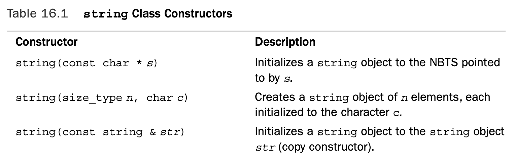

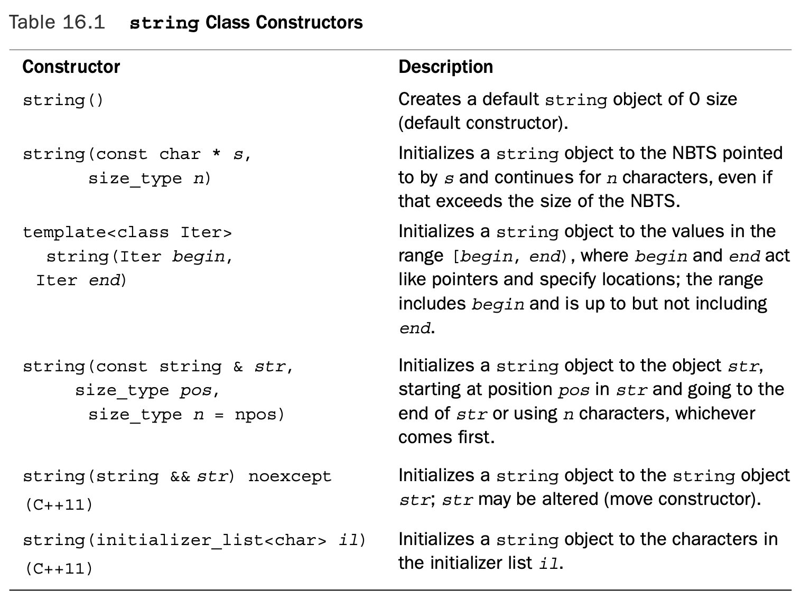

```c++
// str1.cpp -- introducing the string class 
#include <iostream>
#include <string>
// using string constructors

int main() 
{
    using namespace std;
    string one("Lottery Winner!");      // ctor #1
    cout << one << endl;                // overloaded <<
    string two(20, '$');                // ctor #2
    cout << two << endl;
    string three(one);                  // ctor #3
    cout << three << endl;
    one += " Oops!";                    // overloaded +=
    cout << one << endl;
    two = "Sorry! That was "; 
    three[0] = 'P';
    string four;                        // ctor #4
    four = two + three;                 // overloaded +, = 
    cout << four << endl;
    char alls[] = "All's well that ends well";
    string five(alls,20);               // ctor #5
    cout << five << "!\n";
    string six(alls+6, alls + 10);      // ctor #6
    cout << six << ", ";
    string seven(&five[6], &five[10]);  // ctor #6 again 
    cout << seven << "...\n";
    string eight(four, 7, 16);          // ctor #7
    cout << eight << " in motion!" << endl;
    return 0;
}
```

```shell
Lottery Winner!
$$$$$$$$$$$$$$$$$$$$
Lottery Winner!
Lottery Winner! Oops!
Sorry! That was Pottery Winner!
All's well that ends!
well, well...
That was Pottery in motion!
```

The sixth constructor has a template argument:

```c++
template<class Iter> string(Iter begin, Iter end);
```

Consider the following statement:

```c++
string six(alls+6, alls + 10); // ctor #6
```

Because the name of an array is a pointer, both `alls + 6` and `alls + 10` are type `char *`, so the template is used with Iter replaced by type `char *`.The first argument points to the first `w` in the `alls` array, and the second argument points to the space fol- lowing the first `well`. Thus, `six` is initialized to the string "`well`". Figure 16.1 shows how the constructor works.

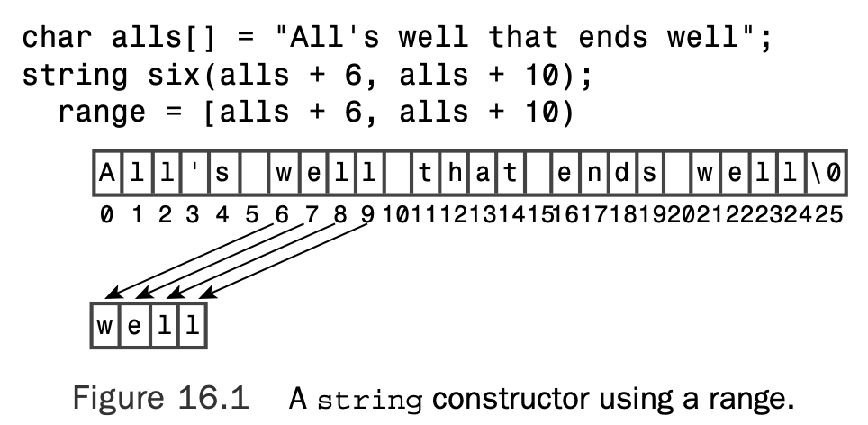

Now suppose you want to use this constructor to initialize an object to part of another

`string` object—say, the object `five`. The following does not work:

```c++
string seven(five + 6, five + 10);
```

The reason is that the name of an object, unlike the name of an array, is not treated as the address of an object, hence `five` is not a pointer and five + 6 is meaningless. How- ever, five[6] is a char value, so &five[6] is an address and can be used as an argument to the constructor:

```c++
string seven(&five[6], &five[10]);// ctor #6 again
```

### The `string` Class Input

 For C-style strings, recall, you have three options:

```c++
char info[100];
cin >> info; 			// read a word
cin.getline(info, 100); // read a line, discard \n
cin.get(info, 100); 	// read a line, leave \n in queue
```

For `string` objects, recall, you have two options:

```c++
string stuff;
cin >> stuff; 			// read a word 
getline(cin, stuff); 	// read a line, discard \n
```

Both versions of `getline()` allow for an optional argument that specifies which character to use to delimit input:

```c++
cin.getline(info,100,':'); 	// read up to :, discard : 
getline(stuff, ':'); 		// read up to :, discard :
```

The main operational difference is that the `string` versions automatically size the target `string` object to hold the input characters:

```c++
char fname[10];
string lname;
cin >> fname; 	// could be a problem if input size > 9 characters 
cin >> lname; 	// can read a very, very long word 
cin.getline(fname, 10); // may truncate input
getline(cin, fname); 	// no truncation
```

The automatic sizing feature allows the `string` version of `getline()` to dispense with the numeric parameter that limits the number of input characters to be read.

The first limiting factor is the maximum allowable size for a string, represented by the constant `string::npos`.This, typically, is the maximum value of an `unsigned int`, so it doesn’t pose a practical limit for ordinary, interactive input. It could be a factor, however, if you attempt to read the contents of an entire file into a single `string` object.

The second limiting factor is the amount of memory available to a program.

The `getline()` function for the `string` class reads characters from the input and stores them in a `string` object until one of three things occurs:

* The end-of-file is encountered, in which case `eofbit` of the input stream is set, implying that both the `fail()` and `eof()` methods will return `true`.
* The delimiting character (`\n`, by default) is reached, in which case it is removed from the input stream but not stored.
* The maximum possible number of characters (the lesser of `string::npos` and the number of bytes in memory available for allocation) is read, in which case `failbit` of the input stream is set, implying that the `fail()` method will return `true`.

The `operator>>()` function for the string class behaves similarly, except that instead of reading to and discarding a delimiting character, it reads up to a white space character and leaves that character in the input queue. A white space character is a space, newline, or tab character or more generally, any character for which `isspace()` returns `true`.

```c++
// strfile.cpp -- read strings from a file 
#include <iostream>
#include <fstream>
#include <string>
#include <cstdlib> 
int main()
{
    using namespace std; 
    ifstream fin; 
    fin.open("tobuy.txt");
    if (fin.is_open() == false) 
    {
        cerr << "Can't open file. Bye.\n";
        exit(EXIT_FAILURE); 
    }
    string item;
    int count = 0;
    getline(fin, item, ':');
    while (fin) // while input is good 
    {
        ++count;
        cout << count <<": " << item << endl; 
        getline(fin, item,':');
    }
    cout << "Done\n"; 
    fin.close(); 
    return 0;
}
```

Here is a sample `tobuy.txt` file:

```
sardines:chocolate ice cream:pop corn:leeks:
cottage cheese:olive oil:butter:tofu:

```

```c++
1: sardines
2: chocolate ice cream
3: pop corn
4: leeks
5: 
cottage cheese
6: olive oil
7: butter
8: tofu
9: 

Done
```

### Working with Strings

Each relational operator is overloaded three ways so that you can compare a `string` object with another `string` object, compare a `string` object with a C-style `string`, and compare a C-style string with a `string` object:

```c++
string snake1("cobra"); 
string snake2("coral");
char snake3[20] = "anaconda"; 
if (snake1 < snake 2)		// operator<(const string &, const string &)
	...
if (snake1 == snake3) 		// operator==(const string &, const char *)
    ...
if (snake3 != snake2) 		// operator!=(const char *, const string &)
    ...
```

You can determine the size of a string. Both the `size()` and `length()` member functions return the number of characters in a string:

```c++
if (snake1.length() == snake2.size())
	cout << "Both strings have the same length.\n"
```

The `length()` member comes from earlier versions of the `string` class, and `size()` was added for STL compatibility.

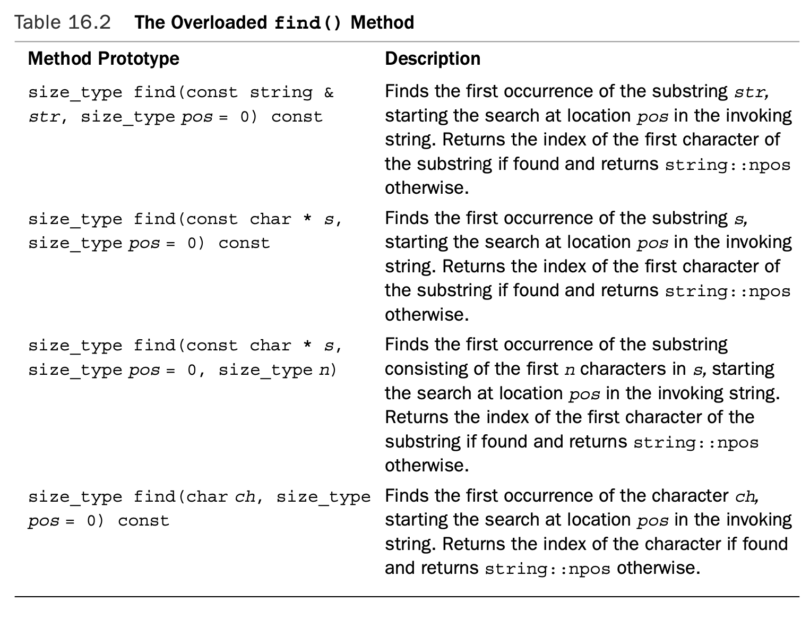

The string library also provides the related methods `rfind()`, `find_first_of()`, `find_last_of()`, `find_first_not_of()`, and `find_last_not_of()`, each with the same set of overloaded function signatures as the `find()` method.The `rfind()` method finds the last occurrence of a substring or character.The `find_first_of()` method finds the first occurrence in the invoking string of any of the characters in the argument. 

```c++
// hangman.cpp -- some string methods 
#include <iostream>
#include <string>
#include <cstdlib>
#include <ctime>
#include <cctype>
using std::string;
const int NUM = 26;
const string wordlist[NUM] = {"apiary", "beetle", "cereal",
    "danger", "ensign", "florid", "garage", "health", "insult", 
    "jackal", "keeper", "loaner", "manage", "nonce", "onset", 
    "plaid", "quilt", "remote", "stolid", "train", "useful", 
    "valid", "whence", "xenon", "yearn", "zippy"};

int main() 
{
    using std::cout;
    using std::cin;
    using std::tolower; 
    using std::endl; 
    std::srand(std::time(0)); 
    char play;
    cout << "Will you play a word game? <y/n> "; 
    cin >> play;
    play = tolower(play);
    while (play == 'y')
    {
        string target = wordlist[std::rand() % NUM];
        int length = target.length();
        string attempt(length, '-');
        string badchars;
        int guesses = 6;
        cout << "Guess my secret word. It has " << length
        << " letters, and you guess\n"
        << "one letter at a time. You get " << guesses
        << " wrong guesses.\n";
        cout << "Your word: " << attempt << endl; 
        while (guesses > 0 && attempt != target) 
        {
            char letter;
            cout << "Guess a letter: ";
            cin >> letter;
            if (badchars.find(letter) != string::npos
                || attempt.find(letter) != string::npos) 
            {
                cout << "You already guessed that. Try again.\n"; 
                continue;
            }
            int loc = target.find(letter); 
            if (loc == string::npos)
            {
                cout << "Oh, bad guess!\n"; 
                --guesses;
                badchars += letter; // add to string
            } 
            else 
            {
                cout << "Good guess!\n"; 
                attempt[loc]=letter;
                // check if letter appears again 
                loc = target.find(letter, loc + 1); 
                while (loc != string::npos)
                {
                    attempt[loc]=letter;
                    loc = target.find(letter, loc + 1); 
                }
            }
            cout << "Your word: " << attempt << endl; 
            if (attempt != target)
            {
                if (badchars.length() > 0)
                    cout << "Bad choices: " << badchars << endl;
                cout << guesses << " bad guesses left\n"; 
            }
        }
        if (guesses > 0)
            cout << "That's right!\n"; 
        else
            cout << "Sorry, the word is " << target << ".\n";
        cout << "Will you play another? <y/n> "; cin >> play;
        play = tolower(play);
    }

    cout << "Bye\n";

    return 0; 
}
```

Here’s a sample run of the program in Listing 16.3:

```shell
Will you play a word game? <y/n> y
Guess my secret word. It has 6 letters, and you guess
one letter at a time. You get 6 wrong guesses.
Your word: ------
Guess a letter: a
Good guess!
Your word: --a---
6 bad guesses left
Guess a letter: l
Good guess!
Your word: l-a---
6 bad guesses left
Guess a letter: o
Good guess!
Your word: loa---
6 bad guesses left
Guess a letter: n
Good guess!
Your word: loan--
6 bad guesses left
Guess a letter: e
Good guess!
Your word: loane-
6 bad guesses left
Guess a letter: r
Good guess!
Your word: loaner
That's right!
Will you play another? <y/n> n
Bye
```

The program uses `find()` to check whether a character was selected earlier; if it was already selected, it will be found in either the `badchars` string (bad guesses) or in the `attempt` string (good guesses):

```c++
if (badchars.find(letter) != string::npos 
    || attempt.find(letter) != string::npos)
```

The `npos` variable is a static member of the `string` class. Its value, recall, is the maximum allowable number of characters for a `string` object.Therefore, because indexing begins at zero, it is one greater than the largest possible index and can be used to indicate failure to find a character or a string.

### What Else Does the `string` Class Offer?

```c++
// str2.cpp -- capacity() and reserve() 
#include <iostream>
#include <string>
int main()
{
    using namespace std;
    string empty;
    string small = "bit";
    string larger = "Elephants are a girl's best friend"; 
    cout << "Sizes:\n";
    cout << "\tempty: " << empty.size() << endl;
    cout << "\tsmall: " << small.size() << endl;
    cout << "\tlarger: " << larger.size() << endl;
    cout << "Capacities:\n";
    cout << "\tempty: " << empty.capacity() << endl; 
    cout << "\tsmall: " << small.capacity() << endl; 
    cout << "\tlarger: " << larger.capacity() << endl; 
    empty.reserve(50);
    cout << "Capacity after empty.reserve(50): " 
        << empty.capacity() << endl;
    return 0;
}
```

```shell
Sizes:
	empty: 0
	small: 3
	larger: 34
Capacities:
	empty: 15
	small: 15
	larger: 34
Capacity after empty.reserve(50): 50
```

### String Varieties

This section treats the `string` class as if it were based on the `char` type. In fact, as men- tioned earlier, the string library really is based on a template class:

```c++
template<class charT, class traits = char _traits<charT>, 
	class Allocator = allocator<charT> >
basic_string {...};
```

The `basic_string` template comes with four specializations, each of which has a

`typedef` name:

```c++
typedef basic_string<char> string;
typedef basic_string<wchar_t> wstring;
typedef basic_string<char16_t> u16string; 	// C++11 
typedef basic_string<char32_t> u32string ; 	// C++11
```

## Smart Pointer Template Classes

A **smart pointer** is a class object that acts like a pointer but has additional features. Here we’ll look at three smart pointer templates that can help with managing the use of dynamic memory allocation. 

### Using Smart Pointers

These three smart pointer templates (`auto_ptr`, `unique_ptr`, and `shared_ptr` ) each defines a pointer-like object intended to be assigned an address obtained (directly or indirectly) by `new`. When the smart pointer expires, its destructor uses `delete` to free the memory.

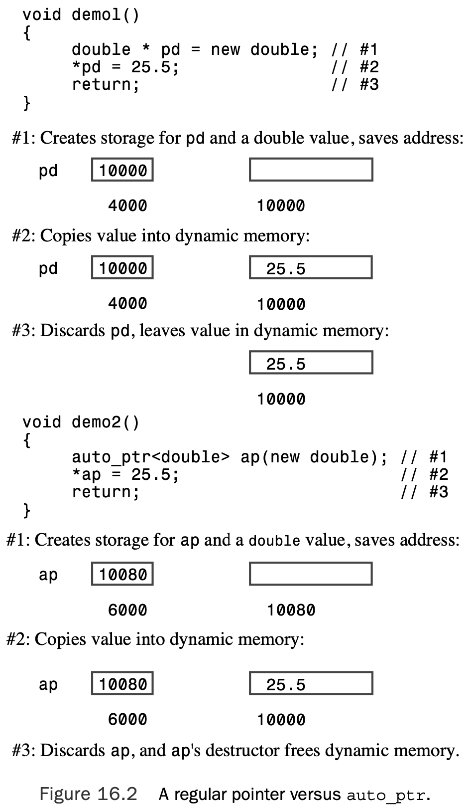

To create one of these smart pointer objects, you include the `memory` header file, which includes the template definitions.Then you use the usual template syntax to instantiate the kind of pointer you require.The `auto_ptr` template, for instance, includes the following constructor:

```c++
template<class X> class auto_ptr {
public:
	explicit auto_ptr(X* p =0) throw(); 
...};
```

Thus, asking for an `auto_ptr` object of type X gives you an `auto_ptr` object that points to type X:

```c++
auto_ptr<double> pd(new double); 	// pd an auto_ptr to double
									// (use in place of double * pd)
auto_ptr<string> ps(new string); 	// ps an auto_ptr to string
									// (use in place of string * ps)
```

Similarly, `new string` is also an actual argument for a constructor.The other two smart pointers use the same syntax:

```c++
unique_ptr<double> pdu(new double); // pdu an unique_ptr to double 
shared_ptr<string> pss(new string); // pss a shared_ptr to string
```

Thus, to convert the `remodel()` function, you would follow these three steps:

1. Include the `memory` header file.
2. Replace the pointer-to-`string` with a smart pointer object that points to string.
3. Remove the `delete` statement.

```c++
#include <memory>
void remodel(std::string & str) 
{
    std::auto_ptr<std::string> ps (new std::string(str)); 
    ...
    if (weird_thing())
    throw exception(); 
    str = *ps;
    // delete ps; NO LONGER NEEDED
    return; 
}
```

```c++
// smrtptrs.cpp -- using three kinds of smart pointers 
// requires support of C++11 shared_ptr and unique_ptr 
#include <iostream>
#include <string>
#include <memory>

class Report 
{
private:
    std::string str; 
public:
    Report(const std::string s) : str(s)
        { std::cout << "Object created!\n"; }
    ~Report() { std::cout << "Object deleted!\n"; }
    void comment() const { std::cout << str << "\n"; } 
};

int main() 
{
    {
        std::auto_ptr<Report> ps (new Report("using auto_ptr"));
        ps->comment(); // use -> to invoke a member function 
    }
    {
        std::shared_ptr<Report> ps (new Report("using shared_ptr")); 
        ps->comment();
    } 
    {
        std::unique_ptr<Report> ps (new Report("using unique_ptr"));
        ps->comment(); 
    }
    return 0;
}
```

```shell
Object created!
using auto_ptr
Object deleted!
Object created!
using shared_ptr
Object deleted!
Object created!
using unique_ptr
Object deleted!
```

Each of these classes has an `explicit` constructor taking a pointer as an argument. Thus, there is no automatic type cast from a pointer to a smart pointer object:

```c++
shared_ptr<double> pd;
double *p_reg = new double;
pd = p_reg; 						// not allowed (implicit conversion) 
pd = shared_ptr<double>(p_reg); 	// allowed (explicit conversion 
shared_ptr<double> pshared = p_reg; // not allowed (implicit conversion) 
shared_ptr<double> pshared(p_reg); 	// allowed (explicit conversion)
```

But first, here’s something you should avoid with all three of these smart pointers:

```c++
string vacation("I wandered lonely as a cloud."); 
shared_ptr<string> pvac(&vacation); // NO!
```

When `pvac` expires, the program would apply the delete operator to non-heap memory, which is wrong.

### Smart Pointer Considerations

Begin by considering assignment:

```c++
auto_ptr<string> ps (new string("I reigned lonely as a cloud.")); auto_ptr<string> vocation;
vocation = ps;
```

 If `ps` and `vocation` were ordinary pointers, the result would be two pointers pointing to the same `string` object.That is not acceptable here because the program would wind up attempting to delete the same object twice—once when `ps` expires, and once when `vocation` expires.There are ways to avoid this problem:

* Define the assignment operator so that it makes a deep copy.This results in two pointers pointing to two distinct objects, one of which is a copy of the other.
* Institute the concept of **ownership**, with only one smart pointer allowed to own a particular object. Only if the smart pointer owns the object will its destructor delete the object.Then have assignment transfer ownership.This is the strategy used for `auto_ptr` and for `unique_ptr`, although `unique_ptr` is somewhat more restrictive.
* Create an even smarter pointer that keeps track of how many smart pointers refer to a particular object.This is called **reference counting**.Assignment, for example, would increase the count by one, and the expiration of a pointer would decrease the count by one. Only when the final pointer expires would delete be invoked.This is the `shared_ptr` strategy.

```c++
// fowl.cpp -- auto_ptr a poor choice 
#include <iostream>
#include <string>
#include <memory>

int main() 
{
    using namespace std; 
    auto_ptr<string> films[5] =
    {
        auto_ptr<string> (new string("Fowl Balls")), 
        auto_ptr<string> (new string("Duck Walks")), 
        auto_ptr<string> (new string("Chicken Runs")), 
        auto_ptr<string> (new string("Turkey Errors")), 
        auto_ptr<string> (new string("Goose Eggs"))
    };
    auto_ptr<string> pwin;
    pwin = films[2]; // films[2] loses ownership

    cout << "The nominees for best avian baseball film are\n"; 
    for (int i = 0; i < 5; i++)
        cout << *films[i] << endl;
    cout << "The winner is " << *pwin << "!\n"; 
    cin.get();
    return 0;
}
```

```shell
The nominees for best avian baseball film are
Fowl Balls
Duck Walks
zsh: segmentation fault  ./fowl
```

Here the problem is that the following statement transfers ownership from` films[2]` to `pwin`:

```c++
pwin = films[2]; // films[2] loses ownership
```

That causes `films[2]` to no longer refer to the string. After an `auto_ptr` gives up ownership of an object, it no longer provides access to the object.When the program goes to print the string pointed to by `films[2]`, it finds the null pointer, which apparently is an unpleasant surprise.

Suppose you go back to Listing 16.6 but use `shared_ptr` instead of `auto_ptr`. Then the program runs fine and gives this output:

```c++
// fowl.cpp -- auto_ptr a poor choice 
#include <iostream>
#include <string>
#include <memory>

int main() 
{
    using namespace std; 
    shared_ptr<string> films[5] =
    {
        shared_ptr<string> (new string("Fowl Balls")), 
        shared_ptr<string> (new string("Duck Walks")), 
        shared_ptr<string> (new string("Chicken Runs")), 
        shared_ptr<string> (new string("Turkey Errors")), 
        shared_ptr<string> (new string("Goose Eggs"))
    };
    shared_ptr<string> pwin;
    pwin = films[2]; // films[2] loses ownership

    cout << "The nominees for best avian baseball film are\n"; 
    for (int i = 0; i < 5; i++)
        cout << *films[i] << endl;
    cout << "The winner is " << *pwin << "!\n"; 
    cin.get();
    return 0;
}
```

```shell
The nominees for best avian baseball film are
Fowl Balls
Duck Walks
Chicken Runs
Turkey Errors
Goose Eggs
The winner is Chicken Runs!

```

The difference occurs in this part of the program:

```c++
shared_ptr<string> pwin; 
pwin = films[2];
```

This time both `pwin` and `films[2]` point to the same object, and the reference count is upped from 1 to 2. At the end of the program, `pwin`, which was declared last, is the first object to have its destructor called.The destructor decreases the reference count to 1. Then the members of the array of shared_ptrs are freed.The destructor for `films[2]` decrements the count to 0 and frees the previously allocated space.

Yet instead of crashing, the `unique_ptr` version yields a compile-time error objecting to this line:

```c++
pwin = films[2];
```

### Why `unique_ptr` Is Better than `auto_ptr`

Consider the following statements:

```c++
auto_ptr<string> p1(new string("auto"); //#1 
auto_ptr<string> p2; 					//#2 
p2 = p1; 								//#3
```

When, in statement #3, `p2` takes over ownership of the string object, `p1` is stripped of ownership.This, recall, is good because it prevents the destructors for both `p1` and `p2` from trying to delete the same object. But it also is bad if the program subsequently tries to use `p1` because `p1` no longer points to valid data.

Now consider the `unique_ptr` equivalent:

```c++
unique_ptr<string> p3(new string("auto"); 	//#4 
unique_ptr<string> p4; 						//#5 
p4 = p3; 									//#6
```

In this case, the compiler does not allow statement #6, so we avoid the problem of `p3` not pointing to valid data. 

 Suppose we have this function definition:

```c++
unique_ptr<string> demo(const char * s) 
{
    unique_ptr<string> temp(new string(s));
    return temp; 
}
```

And suppose we then have this code:

```c++
unique_ptr<string> ps;
ps = demo("Uniquely special");
```

Here, `demo()` returns a temporary `unique_ptr`, and then `ps` takes over ownership of the object originally owned by the returned `unique_ptr.Then` the returned `unique_ptr` is destroyed.That’s okay because ps now has ownership of the `string` object. But another good thing has happened. Because the temporary `unique_ptr` returned by `demo()` is soon destroyed, there’s no possibility of it being misused in an attempt to access invalid data. 

Here is an example using the previously defined `demo()` function, which returns a `unique_ptr<string>` object:

```c++
using namespace std; 
unique_ptr<string> ps1, ps2; 
ps1 = demo("Uniquely special"); 
ps2 = move(ps1);				// enable assignment
ps1 = demo(" and more");
cout << *ps2 << *ps1 << endl;
```

Also `unique_ptr` has another advantage over auto_ptr. It has a variant that can be used with arrays. 

```c++
std::unique_ptr< double[]>pda(new double(5)); // will use delete []
```

> You should use an `auto_prt` or `shared_ptr` object only for memory allocated by `new`, not for memory allocated by `new []`. You should not use `auto_ptr`, `shared_ptr`, or `unique_ptr` for memory not allocated via `new` or, in the case of `unique_ptr`, via `new` or `new[]`.

### Selecting a Smart Pointer

If the program uses more than one pointer to an object, shared_ptr is your choice. For instance, you may have an array of pointers and use some auxiliary pointers to identify particular elements, such as the largest and the smallest. Or you could have two kinds of objects that contain pointers to the same third object. Or you might have an STL container of pointers. Many of the STL algorithms include copy or assignment operations that will work with `shared_ptr` but not with `unique_ptr` (you’ll get a compiler warning) or `auto_ptr` (you’ll get undefined behavior). 

If the program doesn’t need multiple pointers to the same object, `unique_ptr` works. It’s a good choice for the return type for a function that returns a pointer to memory allocated by `new.That` way, ownership is transferred to the `unique_ptr` assigned the return value, and that smart pointer takes on the responsibility of calling delete.You can store `unique_ptr` objects in an STL container providing you don’t invoke methods or algorithms, such as `sort()`, that copy or assign one `unique_ptr` to another. 

```c++
unique_ptr<int> make_int(int n) 
{
    return unique_ptr<int>(new int(n)); 
}
void show(unique_ptr<int> & pi) 		// pass by reference
{
    cout << *a << ' '; 
}
int main() 
{
...
    vector<unique_ptr<int> > vp(size); 
    for (int i = 0; i < vp.size(); i++)
        vp[i] = make_int(rand() % 1000); 	// copy temporary unique_ptr
    vp.push_back(make_int(rand() % 1000)) ;	// ok because arg is temporary
    for_each(vp.begin(), vp.end(), show);	// use for_each()
...
}
```

You can assign a `unique_ptr` to `shared_ptr` under the same conditions that you can assign one `unique_ptr` to another—the source has to be an rvalue. 

```c++
unique_ptr<int> pup(make_int(rand() % 1000); // ok
shared_ptr<int> spp(pup); // not allowed, pup an lvalue 
shared_ptr<int> spr(make_int(rand() % 1000); // ok
```

## The Standard Template Library

### The `vector` Template Class

To create a vector template object, you use the usual `<type>` notation to indicate the type to be used. Also the vector template uses dynamic memory allocation, and you can use an initialization argument to indicate how many vector elements you want:

```c++
#include vector
using namespace std; 
vector<int> ratings(5); 	// a vector of 5 ints
int n;
cin >> n;
vector<double> scores(n);	// a vector of n doubles
```

After you create a `vector` object, operator overloading for `[]` makes it possible to use

the usual array notation for accessing individual elements:

```c++
ratings[0] = 9;
for (int i = 0; i < n; i++)
	cout << scores[i] << endl;
```

```c++
// vect1.cpp -- introducing the vector template 
#include <iostream>
#include <string>
#include <vector>

const int NUM = 5; 
int main()
{
    using std::vector; 
    using std::string; 
    using std::cin; 
    using std::cout; 
    using std::endl;

    vector<int> ratings(NUM);
    vector<string> titles(NUM);
    cout << "You will do exactly as told. You will enter\n"
         << NUM << " book titles and your ratings (0-10).\n"; 
    int i;
    for (i = 0; i < NUM; i++) 
    {
        cout << "Enter title #" << i + 1 << ": "; 
        getline(cin,titles[i]);
        cout << "Enter your rating (0-10): "; 
        cin >> ratings[i];
        cin.get(); 
    }
    cout << "Thank you. You entered the following:\n" << "Rating\tBook\n";
    for (i = 0; i < NUM; i++) 
    {
        cout << ratings[i] << "\t" << titles[i] << endl; 
    }

    return 0; 
}
```

```shell
You will do exactly as told. You will enter
5 book titles and your ratings (0-10).
Enter title #1: The Cat Who Knew C++
Enter your rating (0-10): 6
Enter title #2: Felonious Felines
Enter your rating (0-10): 4
Enter title #3: Warlords of Wonk
Enter your rating (0-10): 3
Enter title #4: Don't Touch That Metaphor
Enter your rating (0-10): 5
Enter title #5: Panic Oriented Programming
Enter your rating (0-10): 8
Thank you. You entered the following:
Rating	Book
6	The Cat Who Knew C++
4	Felonious Felines
3	Warlords of Wonk
5	Don't Touch That Metaphor
8	Panic Oriented Programming
```

### Things to Do to Vectors

All the STL containers provide certain basic methods, including 

`size()`, which returns the number of elements in a container, 

`swap()`, which exchanges the contents of two containers, 

`begin()`, which returns an iterator that refers to the first element in a container, and 

`end()`, which returns an iterator that represents past-the-end for the container.

The type name for this iterator is a class scope `typedef` called `iterator`. For example, to declare an iterator for a type `double` specialization of `vector`, you would use this:

```c++
vector<double>::iterator pd; // pd an iterator
```

Suppose `scores` is a `vector<double>` object:

Then you can use the iterator `pd` in code like the following:

```c++
pd = scores.begin(); // have pd point to the first element
*pd = 22.3; // dereference pd and assign value to first element 
++pd; 		// make pd point to the next element
```

You can use this:

```c++
auto pd = scores.begin(); // C++11 automatic type deduction
```

if `scores` and `pd` are defined as in the preceding example, you can display the contents with this code:

```c++
for (pd = scores.begin(); pd != scores.end(); pd++) 
    cout << *pd << endl;;
```

One handy method, called `push_back()`, adds an element to the end of a `vector`. While doing so, it attends to memory management so that the `vector` size increases to accommodate added members.This means you can write code like the following:

```c++
vector<double> scores; // create an empty vector 
double temp;
while (cin >> temp && temp >= 0)
	scores.push_back(temp);
cout << "You entered " << scores.size() << " scores.\n";
```

Each loop cycle adds one more element to the `scores` object.You don’t have to pick the number of element when you write the program or when you run the program.As long as the program has access to sufficient memory, it will expand the size of `scores` as necessary.

The `erase()` method removes a given range of a vector. 

```c++
scores.erase(scores.begin(), scores.begin() + 2);
```

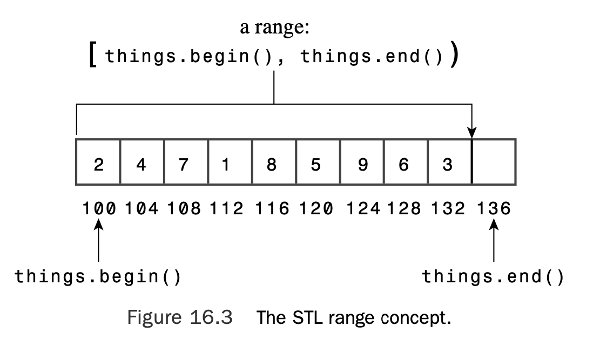

If `it1` and `it2` are two iterators, the STL literature uses the notation `[p1, p2)` to indicate a range starting with `p1` and going up to, but not including, `p2`. Thus, the range `[begin(), end())` encompasses the entire contents of a collection (see Figure 16.3). Also the range `[p1, p1)` is empty. 

An `insert()` method complements `erase()`. It takes three iterator arguments.The first gives the position ahead of which new elements are to be inserted.The second and third iterator parameters define the range to be inserted.

```c++
vector<int> old_v;
vector<int> new_v;
...
old_v.insert(old_v.begin(), new_v.begin() + 1, new_v.end());
```

```c++
// vect2.cpp -- methods and iterators 
#include <iostream>
#include <string>
#include <vector>

struct Review 
{ 
    std::string title; 
    int rating;
};
bool FillReview(Review & rr);
void ShowReview(const Review & rr);

int main() 
{
    using std::cout;
    using std::vector; 
    vector<Review> books; 
    Review temp;
    while (FillReview(temp))
        books.push_back(temp); 
    int num = books.size(); 
    if (num > 0)
    {
        cout << "Thank you. You entered the following:\n" 
             << "Rating\tBook\n";
        for (int i = 0; i < num; i++) 
            ShowReview(books[i]);
        cout << "Reprising:\n" 
             << "Rating\tBook\n";
        vector<Review>::iterator pr;
        for (pr = books.begin(); pr != books.end(); pr++)
            ShowReview(*pr);
        vector <Review> oldlist(books); // copy constructor used 
        if (num > 3)
        {
            // remove 2 items
            books.erase(books.begin() + 1, books.begin() + 3); 
            cout << "After erasure:\n";
            for (pr = books.begin(); pr != books.end(); pr++)
                ShowReview(*pr);
            // insert 1 item
            books.insert(books.begin(), oldlist.begin() + 1,
                oldlist.begin() + 2); 
            cout << "After insertion:\n";
            for (pr = books.begin(); pr != books.end(); pr++) 
                ShowReview(*pr);
        }
        books.swap(oldlist);
        cout << "Swapping oldlist with books:\n";
        for (pr = books.begin(); pr != books.end(); pr++)
            ShowReview(*pr);
    } 
    else
        cout << "Nothing entered, nothing gained.\n"; 
    return 0;
}

bool FillReview(Review & rr) 
{
    std::cout << "Enter book title (quit to quit): "; 
    std::getline(std::cin,rr.title);
    if (rr.title == "quit")
        return false;
    std::cout << "Enter book rating: "; 
    std::cin >> rr.rating;
    if (!std::cin)
        return false;
    // get rid of rest of input line 
    while (std::cin.get() != '\n')
        continue; 
    return true;
}

void ShowReview(const Review & rr) 
{
    std::cout << rr.rating << "\t" << rr.title << std::endl; 
}
```


```shell
Enter book title (quit to quit): The Cat Who Knew Vectors
Enter book rating: 5
Enter book title (quit to quit): Candid Canines
Enter book rating: 7
Enter book title (quit to quit): Warriors of Wonk
Enter book rating: 4
Enter book title (quit to quit): Quantum Manners
Enter book rating: 8
Enter book title (quit to quit): quit
Thank you. You entered the following:
Rating	Book
5	The Cat Who Knew Vectors
7	Candid Canines
4	Warriors of Wonk
8	Quantum Manners
Reprising:
Rating	Book
5	The Cat Who Knew Vectors
7	Candid Canines
4	Warriors of Wonk
8	Quantum Manners
After erasure:
5	The Cat Who Knew Vectors
8	Quantum Manners
After insertion:
7	Candid Canines
5	The Cat Who Knew Vectors
8	Quantum Manners
Swapping oldlist with books:
5	The Cat Who Knew Vectors
7	Candid Canines
4	Warriors of Wonk
8	Quantum Manners
```

### More Things to Do to Vectors

Instead of defining a separate `find()` member function for each container class, it defines a single `find()` nonmember function that can be used for all container classes.

Let’s examine three representative STL functions: `for_each()`, `random_shuffle()`, and `sort()`.

You can use the `for_each()` function instead of a for loop. For example, you can replace the code

```c++
vector<Review>::iterator pr;
for (pr = books.begin(); pr != books.end(); pr++)
	ShowReview(*pr);
```

with the following:

```c++
for_each(books.begin(), books.end(), ShowReview);
```

The `random_shuffle()` function takes two iterators that specify a range and rearranges the elements in that range in random order. For example, the following statement ran- domly rearranges the order of all the elements in the `books` vector:

```c++
random_shuffle(books.begin(), books.end());
```

The `sort()` function, too, requires that the container support random access. It comes in two versions.The first version takes two iterators that define a range, and it sorts that range by using the < operator defined for the type element stored in the container. For example, the following sorts the contents of `coolstuff` in **ascending** order, using the built-in < operator to compare values:

```c++
vector<int> coolstuff;
...
sort(coolstuff.begin(), coolstuff.end());
```

Because `Review` is a structure, its members are public, and a nonmember function like this would serve:

```c++
bool operator<(const Review & r1, const Review & r2) 
{
    if (r1.title < r2.title) 
        return true;
    else if (r1.title == r2.title && r1.rating < r2.rating) 
        return true;
	else
		return false;
}
```

With a function like this in place, you could then sort a vector of `Review` objects (such as `books`):

```c++
sort(books.begin(), books.end());
```

The return value should be convertible to `bool`, with `false` meaning the two arguments are in the wrong order. Here’s an example of such a function:

```c++
bool WorseThan(const Review & r1, const Review & r2) 
{
    if (r1.rating < r2.rating) 
        return true;
    else
        return false;
}
```

With this function in place, you can use the following statement to sort the books vec-

tor of Review objects **in order of increasing rating values**:

```c++
sort(books.begin(), books.end(), WorseThan);
```

```c++
// vect3.cpp -- using STL functions 
#include <iostream>
#include <string>
#include <vector> 
#include <algorithm>

struct Review 
{ 
    std::string title; 
    int rating;
};

bool operator<(const Review & r1, const Review & r2); 
bool worseThan(const Review & r1, const Review & r2); 
bool FillReview(Review & rr);
void ShowReview(const Review & rr);

int main() 
{
    using namespace std;

    vector<Review> books; 
    Review temp;
    while (FillReview(temp))
        books.push_back(temp); 
    if (books.size() > 0)
    {
        cout << "Thank you. You entered the following " 
            << books.size() << " ratings:\n"
            << "Rating\tBook\n"; 
        for_each(books.begin(), books.end(), ShowReview);

        sort(books.begin(), books.end());
        cout << "Sorted by title:\nRating\tBook\n"; 
        for_each(books.begin(), books.end(), ShowReview);
        sort(books.begin(), books.end(), worseThan); 
        cout << "Sorted by rating:\nRating\tBook\n"; 
        for_each(books.begin(), books.end(), ShowReview);
        random_shuffle(books.begin(), books.end());
        cout << "After shuffling:\nRating\tBook\n"; 
        for_each(books.begin(), books.end(), ShowReview);
    } 
    else
        cout << "No entries. "; 
    cout << "Bye.\n";
    return 0;
}

bool operator<(const Review & r1, const Review & r2) 
{
    if (r1.title < r2.title) 
        return true;
    else if (r1.title == r2.title && r1.rating < r2.rating) 
        return true;
    else
        return false;
}

bool worseThan(const Review & r1, const Review & r2) 
{
    if (r1.rating < r2.rating) 
        return true;
    else
        return false;
}

bool FillReview(Review & rr) 
{
    std::cout << "Enter book title (quit to quit): "; 
    std::getline(std::cin,rr.title);
    if (rr.title == "quit")
        return false;
    std::cout << "Enter book rating: "; 
    std::cin >> rr.rating;
    if (!std::cin)
        return false;
    // get rid of rest of input line 
    while (std::cin.get() != '\n')
        continue; 
    return true;
}

void ShowReview(const Review & rr) 
{
    std::cout << rr.rating << "\t" << rr.title << std::endl; 
}
```

```shell
Enter book title (quit to quit): The Cat Who Can Teach You Weight Loss
Enter book rating: 8
Enter book title (quit to quit): The Dogs of Dharma
Enter book rating: 6
Enter book title (quit to quit): The Wimps of Wonk
Enter book rating: 3
Enter book title (quit to quit): Farewell and Delete
Enter book rating: 7
Enter book title (quit to quit): quit
Thank you. You entered the following 4 ratings:
Rating	Book
8	The Cat Who Can Teach You Weight Loss
6	The Dogs of Dharma
3	The Wimps of Wonk
7	Farewell and Delete
Sorted by title:
Rating	Book
7	Farewell and Delete
8	The Cat Who Can Teach You Weight Loss
6	The Dogs of Dharma
3	The Wimps of Wonk
Sorted by rating:
Rating	Book
3	The Wimps of Wonk
6	The Dogs of Dharma
7	Farewell and Delete
8	The Cat Who Can Teach You Weight Loss
After shuffling:
Rating	Book
3	The Wimps of Wonk
8	The Cat Who Can Teach You Weight Loss
6	The Dogs of Dharma
7	Farewell and Delete
Bye.
```

### The Range-Based `for` Loop (C++11)

Consider, for instance, this state- ment from Listing 16.9:

```c++
for_each(books.begin(), books.end(), ShowReview);
```

It can be replaced with the following range-based `for` loop:

```c++
for (auto x : books) ShowReview(x);
```

## Generic Programming

### Why Iterators?

Understanding iterators is perhaps the key to understanding the STL. Just as templates make algorithms independent of the type of data stored, iterators make the algorithms independent of the type of container used.Thus, they are an essential component of the STL’s generic approach.

First, let’s consider a function that searches an ordinary array of `double` for a particular value.You could write the function like this:

```c++
double * find_ar(double * ar, int n, const double & val) 
{
    for (int i = 0; i < n; i++) 
        if (ar[i] == val)
    		return &ar[i];
    return 0; // or, in C++11, return nullptr;
}
```

If the function finds the value in the array, it returns the address in the array where the value is found; otherwise, it returns the null pointer. You could use a template to generalize to arrays of any type having an `==` operator. 

So let’s look at searching another kind of data structure, the linked list.  The list consists of linked `Node` structures:

```c++
struct Node 
{
    double item;
    Node * p_next; 
};
```

Suppose you have a pointer that points to the first node in the list.The `p_next` pointer in each node points to the next node, and the `p_next` pointer for the last node in the list is set to `0`.You could write a `find_ll()` function this way:

```c++
Node* find_ll(Node * head, const double & val) 
{
    Node * start;
    for (start = head; start!= 0; start = start->p_next)
    	if (start->item == val) 
            return start;
    return 0; 
}
```

Again, you could use a template to generalize this to lists of any data type supporting the `==` operator. 

If you consider details of implementation, the two `find` functions use different algorithms: One uses array indexing to move through a list of items, and the other resets `start` to `start->p_next`. But broadly, the two algorithms are the same: Compare the value with each value in the container in sequence until you find a match.

The goal of generic programming in this case would be to have a single `find` function that would work with arrays or linked lists or any other container type.

What properties should an iterator have in order to implement a `find` function? Here’s a short list:

*  You should be able to dereference an iterator in order to access the value to which it refers.That is, if `p` is an iterator, `*p` should be defined.
* You should be able to assign one iterator to another.That is, if `p` and `q` are iterators, the expression `p = q` should be defined.
* You should be able to compare one iterator to another for equality.That is, if `p` and `q` are iterators, the expressions `p == q` and` p != q` should be defined.
* You should be able to move an iterator through all the elements of a container.This can be satisfied by defining `++p` and `p++` for an iterator `p`.

You can rewrite the `find_arr()` function like this:

```c++
typedef double * iterator;
iterator find_ar(iterator ar, int n, const double & val) 
{
    for (int i = 0; i < n; i++, ar++) 
        if (*ar == val)
            return ar; 
    return 0;
}
```

The following version of `find_ar()` makes these changes:

```c++
typedef double * iterator;
iterator find_ar(iterator begin, iterator end, const double & val) 
{
    iterator ar;
    for (ar = begin; ar != end; ar++)
    	if (*ar == val) 
            return ar;
    return end; // indicates val not found 
}
```

For the `find_ll()` function, you can define an iterator class that defines the `*` and `++` operators:

```c++
struct Node 
{
    double item;
    Node * p_next; 
};

class iterator 
{
	Node * pt; 
public:
    iterator() : pt(0) {}
    iterator (Node * pn) : pt(pn) {}
    double operator*() { return pt->item;} 
    iterator& operator++() // for ++it 
    {
        pt = pt->p_next;
        return *this; 
    }
    iterator operator++(int) // for it++ 
    {
    	iterator tmp = *this; 
        pt = pt->p_next; 
        return tmp;
    }
// ... operator==(), operator!=(), etc. 
};
```

The main point here is not how, in detail, to define the `iterator` class, but that with such a class, the second `find` function can be written like this:

```c++
iterator find_ll(iterator head, const double & val) 
{
    iterator start;
    for (start = head; start!= 0; ++start)
    	if (*start == val) 
            return start;
    return 0; 
}
```

This is very nearly the same as `find_ar()`.The point of difference is in how the two functions determine whether they’ve reached the end of the values being searched.The `find_ar() `function uses an iterator to one-past-the-end, whereas `find_ll()` uses a null value stored in the final node. 

The STL follows the approach just outlined. 

First, each container class (`vector`, `list`, `deque`, and so on) defines an iterator type appropriate to the class. For one class, the itera- tor might be a pointer; for another, it might be an object.Whatever the implementation, the iterator will provide the needed operations, such as `*` and `++`.

Next, each container class will have a past-the-end marker, which is the value assigned to an iterator when it has been incremented one past the last value in the container. Each container class will have `begin()` and `end()` methods that return iterators to the first element in a container and to the past-the-end position.And each container class will have the `++` operation take an iterator from the first element to past-the-end, visiting every container element en route.

For example, suppose you want to print the values in a `vector<double>` object. In that case, you can use this:

```c++
vector<double>::iterator pr;
for (pr = scores.begin(); pr != scores.end(); pr++)
	cout << *pr << endl;
```

Here the following line identifies pr as the iterator type defined for the `vector<double>` class:

```c++
vector<double>::iterator pr;
```

If you used the `list<double>` class template instead to store scores, you could use this code:

```c++
list<double>::iterator pr;
for (pr = scores.begin(); pr != scores.end(); pr++)
	cout << *pr << endl;
```

With C++ automatic type deduction, you can simplify further and use the following code with either the vector or the list:

```c++
for (auto pr = scores.begin(); pr != scores.end(); pr++) 
    cout << *pr << endl;
```

Alternatively, use the C++11 range-based `for` loop:

```c++
for (auto x : scores) cout << x << endl;
```

### Kinds of Iterators

#### Input Iterators

An i**nput iterator** is one that a program can use to read values from a container. In particular, dereferencing an input iterator must allow a program to read a value from a container, but it needn’t allow a program to alter that value. Any algorithm based on an input iterator, then, should be a single-pass algorithm that doesn’t rely on iterator values from a previous pass or on earlier iterator values from the same pass.

#### Output Iterators

In STL usage, the term **output** indicates that the iterator is used for transferring informa- tion from a program to a container. An output iterator is similar to an input iterator, except that dereferencing is guaranteed to allow a program to alter a container value but not to read it. In short, you can use an input iterator for single-pass, read-only algorithms and an out- put operator for single-pass, write-only algorithms.

#### Forward Iterators

A forward iterator can only go forward through a container one element at a time. A forward iterator can allow you to both read and modify data, or it can allow you just to read it:

```c++
int * pirw; 		// read-write iterator 
const int * pir; 	// read-only iterator
```

#### Bidirectional Iterators

For example, a reverse function could swap the first and last elements, increment the pointer to the first element, decrement the pointer to a second element, and repeat the process.A bidirectional iterator has all the features of a forward iterator and adds support for the two decrement operators (prefix and postfix).

#### Random Access Iterators

This type of iterator has all the features of a bidirectional iterator, plus it adds operations (such as pointer addition) that support random access and relational operators for ordering the elements.

Table 16.3 lists the operations a random access iterator has beyond those of a bidirectional iterator. In this table, `X` represents a random iterator type, `T` represents the type pointed to, `a` and `b` are iterator values, `n` is an integer, and `r` is a random iterator variable or reference.

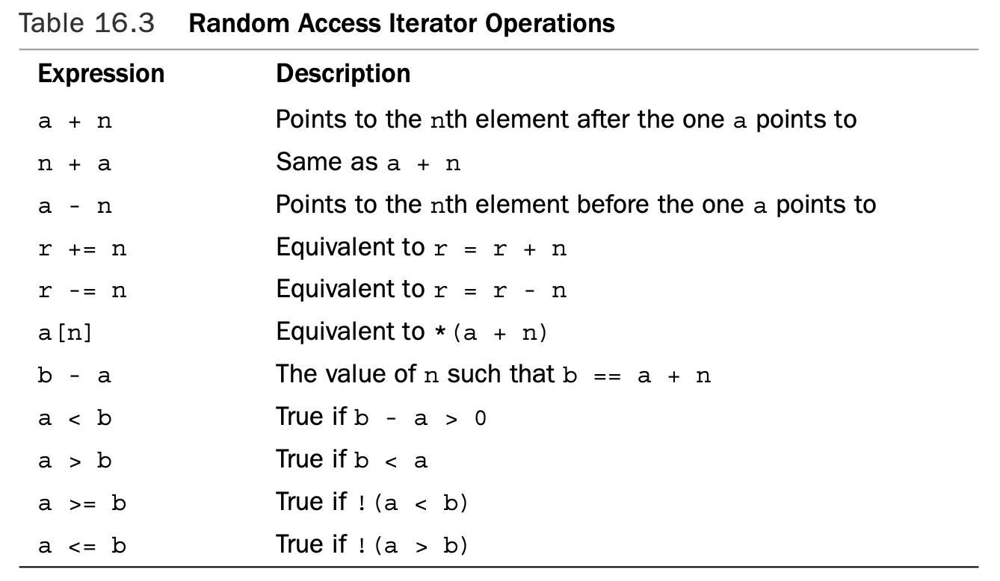

### Iterator Hierarchy

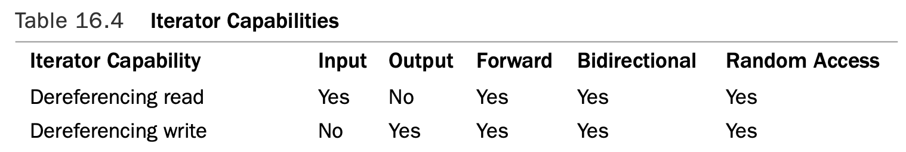

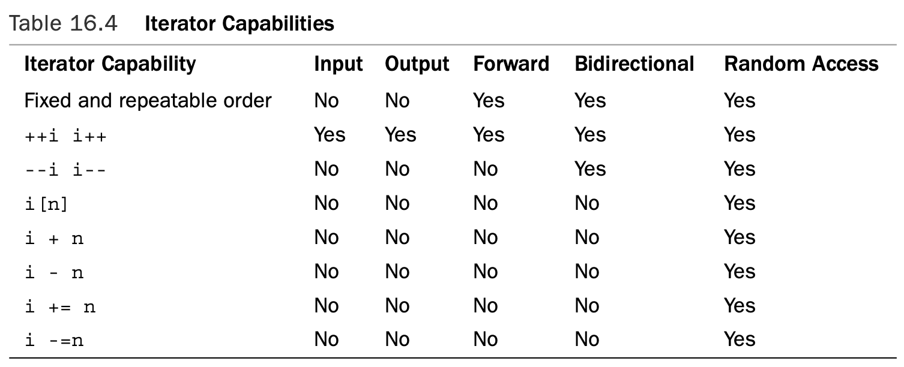

### Concepts, Refinements, and Models

 STL literature uses the word **concept** to describe a set of requirements.Thus, there is an input iterator concept, a forward iterator concept, and so on. 

Concepts can have an inheritance-like relationship. For example, a bidirectional iterator inherits the capabilities of a forward iterator. However, you can’t apply the C++ inheri- tance mechanism to iterators. For example, you might implement a forward iterator as a class and a bidirectional iterator as a regular pointer. So in terms of the C++ language, this particular bidirectional iterator, being a built-in type, couldn’t be derived from a class.

Conceptually, however, it does inherit. Some STL literature uses the term **refinement** to indicate this conceptual inheritance.Thus, a bidirectional iterator is a refinement of the forward iterator concept.

A particular implementation of a concept is termed a **model**.Thus, an ordinary pointer- to-`int` is a model of the concept random access iterator. It’s also a model of a forward iterator, for it satisfies all the requirements of that concept.

#### The Pointer As Iterator

Iterators are generalizations of pointers, and a pointer satisfies all the iterator requirements. Iterators form the interface for STL algorithms, and pointers are iterators, so STL algo- rithms can use pointers to operate on non-STL containers that are based on pointers. 

For example, you can use STL algorithms with arrays. Suppose `Receipts` is an array of `double` values, and you would like to sort in ascending order:

```c++
const int SIZE = 100; 
double Receipts[SIZE];
```

The STL `sort()` function, recall, takes as arguments an iterator pointing to the first element in a container and an iterator pointing to past-the-end.Well,`&Receipts[0]` (or just `Receipts`) is the address of the first element, and `&Receipts[SIZE]` (or just `Receipts + SIZE`) is the address of the element following the last element in the array.Thus, the following function call sorts the array:

```c++
sort(Receipts, Receipts + SIZE);
```

#### `copy()`, `ostream_iterator`, and `istream_iterator`

There is an algorithm called `copy()` for copying data from one container to another.This algorithm is expressed in terms of iterators, so it can copy from one kind of container to another or even from or to an array, because you can use pointers into an array as iterators. For example, the following copies an array into a vector:

```c++
int casts[10] = {6, 7, 2, 9 ,4 , 11, 8, 7, 10, 5};
vector<int> dice[10];
copy(casts, casts + 10, dice.begin()); // copy array to vector
```

The `copy()` function overwrites existing data in the destination con- tainer, and the container has to be large enough to hold the copied elements. So you can’t use copy() to place data in an empty vector—at least not without resorting to a trick that is revealed later in this chapter.

You could use `copy()` if there was an iterator representing the output stream.The STL provides such an iterator with the `ostream_iterator` template. Using STL terminology, this template is a **model** of the output iterator concept. It is also an example of an **adapter**—a class or function that converts some other interface to an interface used by the STL.

```c++
#include <iterator>
...
ostream_iterator<int, char> out_iter(cout, " ");
```

The `out_iter` iterator now becomes an interface that allows you to use cout to display information.The first template argument (`int`, in this case) indicates the data type being sent to the output stream.The second template argument (`char`, in this case) indicates the character type used by the output stream.

The first constructor argument (`cout`, in this case) identifies the output stream being used. It could also be a stream used for file output.The final character string argument is a separator to be displayed after each item sent to the output stream.

You could use the iterator like this:

```c++
*out_iter++ = 15; // works like cout << 15 << " ";
```

For a regular pointer, this would mean assigning the value `15` to the pointed-to location and then incrementing the pointer. For this ostream_iterator, however, the state- ment means send 15 and then a string consisting of a space to the output stream managed by cout.Then it should get ready for the next output operation.You could use the iterator with `copy()` as follows:

```c++
copy(dice.begin(), dice.end(), out_iter); // copy vector to output stream
```

Or you could skip creating a named iterator and construct an anonymous iterator instead.That is, you could use the adapter like this:

```c++
copy(dice.begin(), dice.end(), ostream_iterator<int, char>(cout, " ") );
```

Similarly, the `iterator` header file defines an `istream_iterator` template for adapting `istream` input to the iterator interface. It is a model of the input iterator concept.You could use two `istream_iterator` objects to define an input range for `copy()`:

```c++
copy(istream_iterator<int, char>(cin), istream_iterator<int, char>(), dice.begin());
```

Like `ostream_iterator`, `istream_iterator` uses two template arguments.The first indicates the data type to be read, and the second indicates the character type used by the input stream. Using a constructor argument of `cin` means to use the input stream managed by `cin`. Omitting the constructor argument indicates input failure, so the previous code means to read from the input stream until end-of-file, type mismatch, or some other input failure.

#### Other Useful Iterators

The `iterator` header file provides some other special-purpose predefined iterator types in addition to `ostream_iterator` and `istream_iterator`. They are `reverse_iterator`, `back_insert_iterator`, `front_insert_iterator`, and `insert_iterator`.

 Incrementing a `reverse_iterator` causes it to decrement. Suppose you want to display the contents of the dice container. As you just saw, you can use `copy()` and `ostream_iterator` to copy the contents to the output stream:

```c++
ostream_iterator<int, char> out_iter(cout, " ");
copy(dice.begin(), dice.end(), out_iter); // display in forward order
```

Now suppose you want to print the contents in reverse order. The vector class has a member function called `rbegin()` that returns a reverse iterator pointing to past-the-end and a member `rend()` that returns a reverse iterator pointing to the first element. Because incrementing a reverse iterator makes it decrement, you can use the following statement to display the contents backward:

```c++
copy(dice.rbegin(), dice.rend(), out_iter); // display in reverse order
```

> Both `rbegin()` and `end()` return the same value (past-the-end), but as a different type (`reverse_iterator` versus `iterator`). Similarly, both `rend()` and `begin()` return the same value (an iterator to the first element), but as a different type.

```c++
// copyit.cpp -- copy() and iterators 
#include <iostream>
#include <iterator>
#include <vector>

int main() 
{
    using namespace std;
    int casts[10] = {6, 7, 2, 9, 4, 11, 8, 7, 10, 5};
    vector<int> dice(10);
    // copy from array to vector
    copy(casts, casts + 10, dice.begin());
    cout << "Let the dice be cast!\n";
    // create an ostream iterator 
    ostream_iterator<int, char> out_iter(cout, " "); 
    // copy from vector to output
    copy(dice.begin(), dice.end(), out_iter);
    cout << endl;
    cout <<"Implicit use of reverse iterator.\n"; 
    copy(dice.rbegin(), dice.rend(), out_iter);
    cout << endl;
    cout <<"Explicit use of reverse iterator.\n"; 
    vector<int>::reverse_iterator ri;
    for (ri = dice.rbegin(); ri != dice.rend(); ++ri)
        cout << *ri << ' '; 
    cout << endl;
    
    return 0; 
}
```

```shell
Let the dice be cast!
6 7 2 9 4 11 8 7 10 5 
Implicit use of reverse iterator.
5 10 7 8 11 4 9 2 7 6 
Explicit use of reverse iterator.
5 10 7 8 11 4 9 2 7 6 
```

Recall that the following copies values to the location beginning at

```c++
dice.begin():
copy(casts, casts + 10, dice.begin());
```

These values **overwrite** the prior contents in `dice`, and the function assumes that dice has enough room to hold the values.

The three insert iterators solve these problems by converting the copying process to an insertion process. Insertion adds new elements without overwriting existing data, and it uses automatic memory allocation to ensure that the new information fits.

A `back_insert_iterator` inserts items at the end of the container, and 

a `front_insert_iterator` inserts items at the front. Finally, 

the `insert_iterator` inserts items in front of the location specified as an argument to the `insert_iterator` constructor. 

All three of these iterators are models of the output container concept.

These iterators take the container type as a template argument and the actual con- tainer identifier as a constructor argument.That is, to create a `back_insert_iterator` for a `vector<int>` container called dice, you use this:

```c++
back_insert_iterator<vector<int> > back_iter(dice);
```

The reason you have to declare the container type is that the iterator has to make use of the appropriate container method. The code for the `back_insert_iterator` constructor will assume that a `push_back()` method exists for the type passed to it. The `copy()` function, being a standalone function, doesn’t have the access rights to resize a container. But the declaration just shown allows `back_iter` to use the `vector<int>::push_back()` method, which does have access rights.

```c++
// inserts.cpp -- copy() and insert iterators 
#include <iostream>
#include <string>
#include <iterator>
#include <vector> 
#include <algorithm>

void output(const std::string & s) {std::cout << s << " ";}

int main() 
{
    using namespace std;
    string s1[4] = {"fine", "fish", "fashion", "fate"}; 
    string s2[2] = {"busy", "bats"};
    string s3[2] = {"silly", "singers"}; 
    vector<string> words(4);
    copy(s1, s1 + 4, words.begin()); 
    for_each(words.begin(), words.end(), output);
    cout << endl;

// construct anonymous back_insert_iterator object
    copy(s2, s2 + 2, back_insert_iterator<vector<string> >(words)); 
    for_each(words.begin(), words.end(), output);
    cout << endl;

// construct anonymous insert_iterator object
    copy(s3, s3 + 2, insert_iterator<vector<string> >(words,
                                            words.begin())); 
    for_each(words.begin(), words.end(), output);
    cout << endl;
    return 0; 
}
```

```shell
fine fish fashion fate 
fine fish fashion fate busy bats 
silly singers fine fish fashion fate busy bats 
```

### Kinds of Containers

The original 11 container types are `deque`,`list`,`queue`,`priority_queue`,`stack`,`vector`,`map`, `multimap`, `set`, `multiset`, and `bitset`. C++11 adds `forward_list`, `unordered_map`, `unordered_multimap`, `unordered_set`, and `unordered_multiset`, and it moves `bitset` from the container category into its own separate category. 

#### Container Concepts

A **container** is an object that stores other objects, which are all of a single type.The stored objects may be objects in the OOP sense, or they may be values of built-in types. Data stored in a container is *owned* by the container.That means when a container expires, so does the data stored in the container. 

You can’t store just any kind of object in a container. In particular, the type has to be copy **constructable** and **assignable**. 

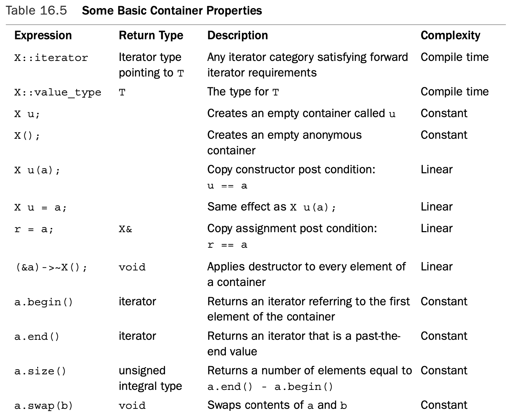

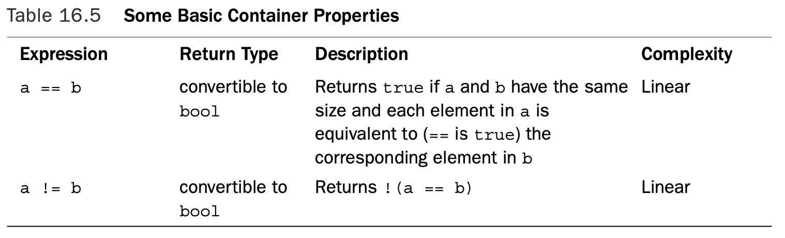

In the table, `X` represents a container type (such as `vector`), `T` represents the type of object stored in the container, `a` and `b` represent values of type `X`, `r` is a value of type `X&`, and `u` represents an identifier of type `X` (that is, if `X` represents `vector<int>`, then `u` is a `vector<int>` object).

The Complexity column inTable 16.5 describes the time needed to perform an oper- ation.This table lists three possibilities, which, from fastest to slowest, are as follows:

* Compile time 
* Constant time 
* Linear time

If the complexity is compile time, the action is performed during compilation and uses no execution time.

A constant complexity means the operation takes place during runtime but doesn’t depend on the number of elements in an object.

A linear complexity means the time is proportional to the number of elements.

#### C++11 Additions to Container Requirements

Table 16.6 shows some additions C++11 has made to the general container requirements. The table uses the notation `rv` to denote a non-constant rvalue of type `X` (for example, the return value of a function). Also the requirement in Table 16.6 that `X::iterator` satisfy the requirements for a forward iterator is a change from the former requirement that it just not be an output iterator.

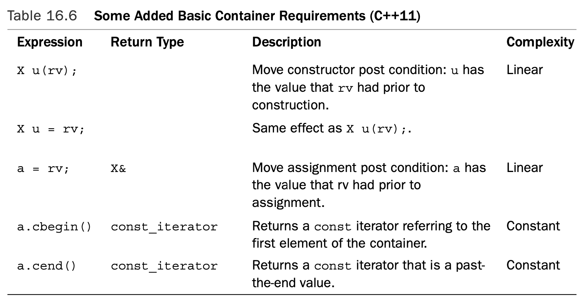

#### Sequences

The **sequence** is an important refinement because several of the STL container types—`deque`,`forward_list` (C++11), `list`, `queue`, `priority_queue`, `stack`, and `vector`—are sequences. The requirement that the iterator be at least a forward iterator guarantees that the elements are arranged in a definite order that doesn’t change from one cycle of iteration to the next.

The sequence also requires that its elements be arranged in strict linear order.That is, there is a first element, there is a last element, and each element but the first and last has exactly one element immediately ahead of it and one element immediately after it.An array and a linked list are examples of sequences, whereas a branching structure (in which each node points to two daughter nodes) is not.

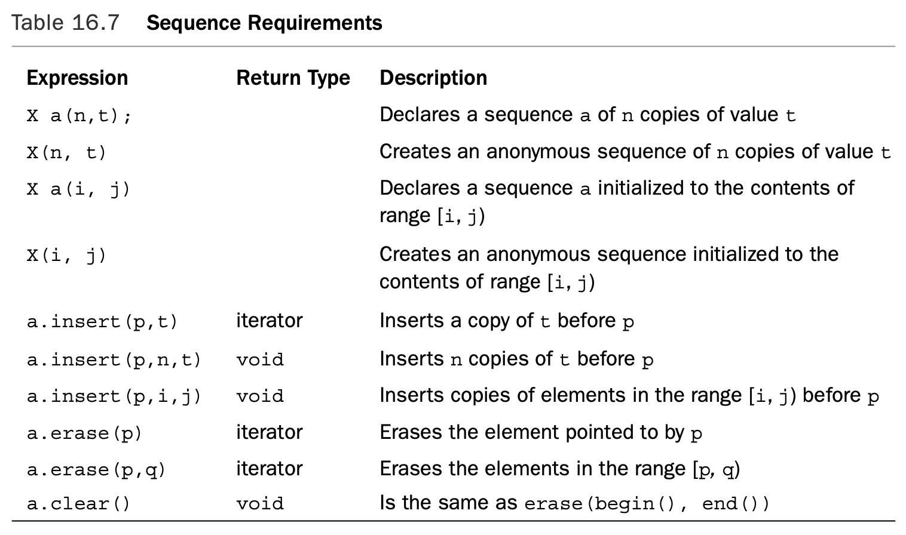

Because elements in sequence have a definite order, operations such as inserting values at a particular location and erasing a particular range become possible.Table 16.7 lists these and other operations required of a sequence.The table uses the same notation as Table 16.5, with the addition of `t` representing a value of type `T`—that is, the type of value stored in the container, of `n`, an integer, and of `p`, `q`, `i`, and `j`, representing iterators.

Because the `deque`, `list`, `queue`, `priority_queue`, `stack`, and `vector` template classes are all models of the sequence concept, they all support the operators in Table 16.7.

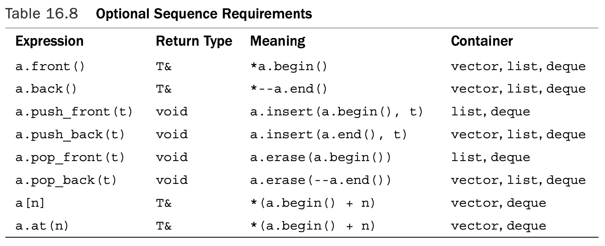

 First, notice that `a[n]` and `a.at(n)` both return a reference to the nth element (numbering from 0) in a container.The difference between the two is that `a.at(n)` does bounds checking and throws an `out_of_range` exception if `n` is outside the valid range for the container. The design for lists and double-ended queues, however, allows an element to be added to the front without moving the other elements to new locations, so they can implement `push_front()` with constant-time complexity. Figure 16.4 illustrates `push_front()` and `push_back()`.

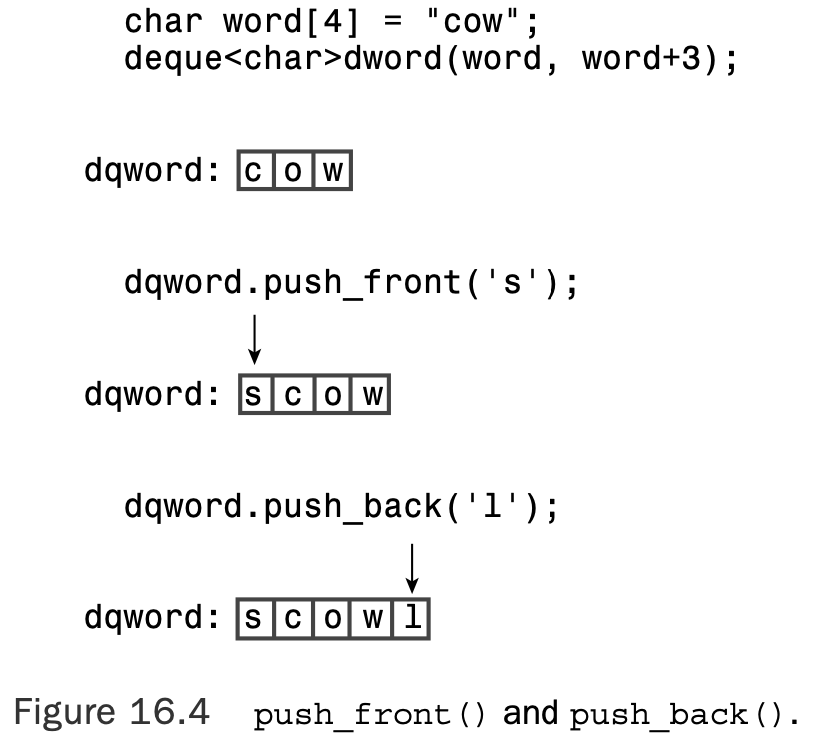

#### `vector`

In brief, `vector` is a class representation of an array.The class provides automatic memory management that allows the size of a `vector` object to vary dynamically, growing and shrinking as elements are added or removed. It provides random access to elements. Elements can be added to or removed from the end in constant time, but insertion and removal from the beginning and the middle are linear-time operations.

In addition to being a sequence, a vector container is also a model of the **reversible container** concept.This adds two more class methods: `rbegin()` returns an iterator to the first element of the reversed sequence, and `rend()` returns a past-the-end iterator for the reversed sequence. So if `dice` is a `vector<int>` container and `Show(int)` is a function that displays an integer, the following code displays the contents of `dice` first in forward order and then in reverse order:

```c++
for_each(dice.begin(), dice.end(), Show); // display in order
cout << endl;
for_each(dice.rbegin(), dice.rend(), Show); // display in reversed order 
cout << endl;
```

#### `deque`

The `deque` template class (declared in the `deque` header file) represents a **double-ended queue**, a type often called a **deque** (pronounced “deck”), for short. The main difference is that inserting and removing items from the beginning of a deque object are constant- time operations instead of being linear-time operations the way they are for vector. 

#### `list`

The `list` template class (declared in the list header file) represents a doubly linked list. Each element, other than the first and last, is linked to the item before it and the item following it, implying that a list can be traversed in both directions.The crucial difference between `list` and `vector` is that `list` provides for constant-time insertion and removal of elements at any location in the list. Thus, `vector` emphasizes rapid access via random access, whereas `list` emphasizes rapid insertion and removal of elements.

The `list` template class has some list-oriented member functions in addition to those that come with sequences and reversible containers.Table 16.9 lists many of them.  The `Alloc` template parameter is one you normally don’t have to worry about because it has a default value.

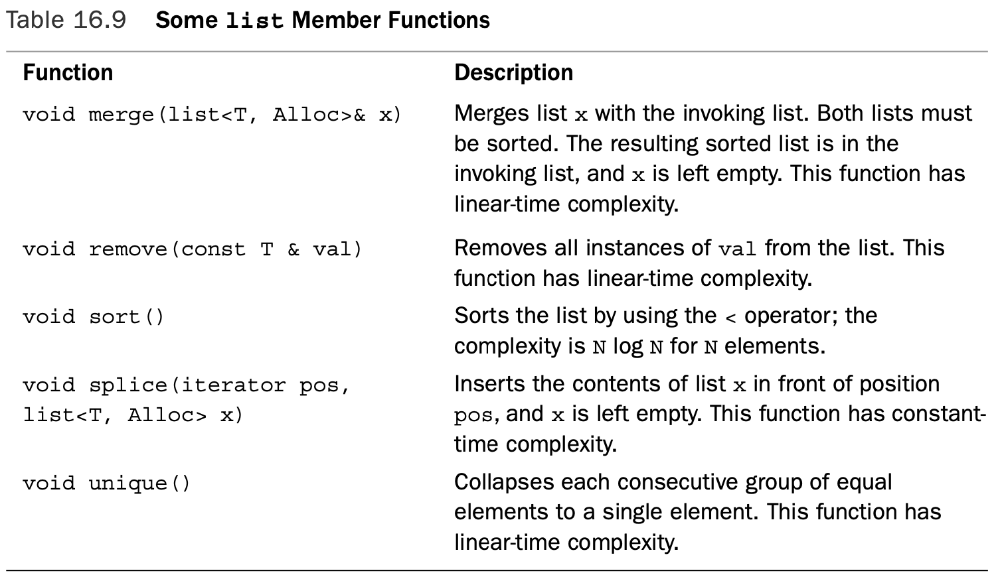

```c++
// list.cpp -- using a list 
#include <iostream> 
#include <list>
#include <iterator> 
#include <algorithm>

void outint(int n) {std::cout << n << " ";}

int main() 
{
    using namespace std;
    list<int> one(5, 2); // list of 5 2s
    int stuff[5] = {1, 2, 4, 8, 6};
    list<int> two; 
    two.insert(two.begin(),stuff, stuff + 5 ); 
    int more[6] = {6, 4, 2, 4, 6, 5}; 
    list<int> three(two); 
    three.insert(three.end(), more, more + 6);

    cout << "List one: "; 
    for_each(one.begin(),one.end(), outint);
    cout << endl << "List two: "; 
    for_each(two.begin(), two.end(), outint);
    cout << endl << "List three: "; 
    for_each(three.begin(), three.end(), outint); 
    three.remove(2);
    cout << endl << "List three minus 2s: "; 
    for_each(three.begin(), three.end(), outint); 
    three.splice(three.begin(), one);
    cout << endl << "List three after splice: "; 
    for_each(three.begin(), three.end(), outint);
    cout << endl << "List one: "; 
    for_each(one.begin(), one.end(), outint); 
    three.unique();
    cout << endl << "List three after unique: "; 
    for_each(three.begin(), three.end(), outint); 
    three.sort();
    three.unique();
    cout << endl << "List three after sort & unique: "; 
    for_each(three.begin(), three.end(), outint); 
    two.sort();
    three.merge(two);
    cout << endl << "Sorted two merged into three: "; 
    for_each(three.begin(), three.end(), outint); 
    cout << endl;
    return 0; 
}
```

```shell
List one: 2 2 2 2 2 
List two: 1 2 4 8 6 
List three: 1 2 4 8 6 6 4 2 4 6 5 
List three minus 2s: 1 4 8 6 6 4 4 6 5 
List three after splice: 2 2 2 2 2 1 4 8 6 6 4 4 6 5 
List one: 
List three after unique: 2 1 4 8 6 4 6 5 
List three after sort & unique: 1 2 4 5 6 8 
Sorted two merged into three: 1 1 2 2 4 4 5 6 6 8 8 
```

#### The `list` Toolbox

The `list` methods form a handy toolbox. Suppose, for example, that you have two mailing lists to organize.You could sort each list, merge them, and then use `unique()` to remove multiple entries.

The `sort()`, `merge()`, and `unique()` methods also each have a version that accepts an additional argument to specify an alternative function to be used for comparing elements. Similarly, the `remove()` method has a version with an additional argument that specifies a function used to determine whether an element is removed.

#### `forward_list` (C++11)

This class implements a singly linked list. In this kind of list, each item is linked just to the next item, but not to the preceding item. Therefore, the class requires just a forward iterator, not a bidirectional one.Thus, unlike `vector` and `list`, `forward_list` isn’t a reversible container. Compared to `list`, `forward_list` is simpler, more compact, but with fewer features.

#### `queue`

The `queue` template class (declared in the `queue`—formerly `queue.h`—header file) is an adapter class. 

The `queue` template is more restrictive than `deque`. Not only does it not permit random access to elements of a queue, the queue class doesn’t even allow you to iterate through a queue. 

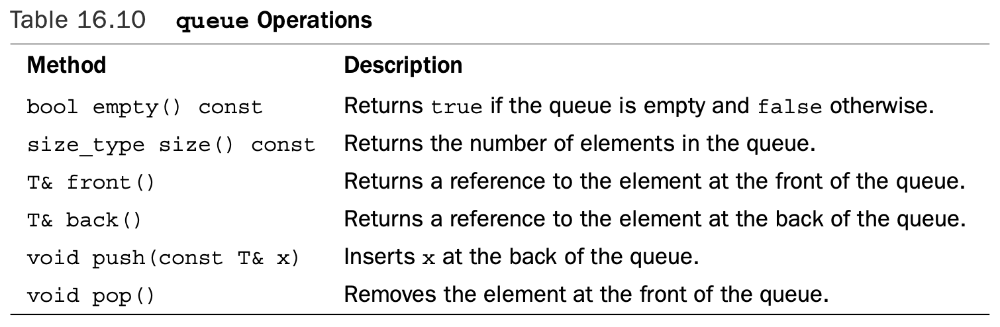

#### `priority_queue`

The `priority_queue` template class (declared in the `queue` header file) is another adapter class. It supports the same operations as `queue.The` main difference between the two is that with `priority_queue`, the largest item gets moved to the front of the queue. An internal difference is that the default underlying class is `vector`. You can alter the comparison used to determine what gets to the head of the queue by providing an optional constructor argument:

```c++
priority_queue<int> pq1; // default version 
priority_queue<int> pq2(greater<int>); // use greater<int> to order
```

#### `stack`

Like `queue`, `stack` (declared in the `stack`—formerly `stack.h`—header file) is an adapter class. It gives an underlying class (`vector`, by default) the typical stack interface.

The `stack` template is more restrictive than `vector`. Not only does it not permit random access to elements of a stack, the stack class doesn’t even allow you to iterate through a stack. 

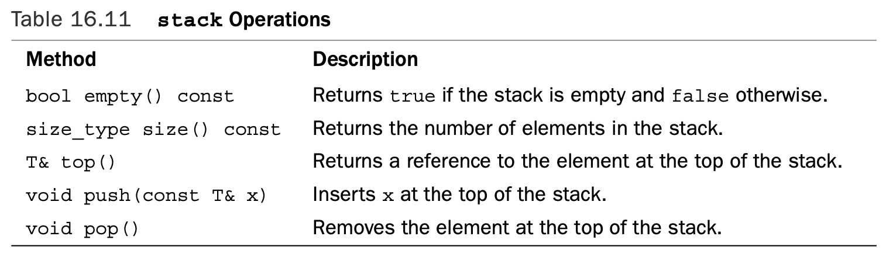

#### `array`(C++11)

The array template class, introduced in Chapter 4 and defined in the `array` header file, is not an STL container because it has a fixed size.Thus, operations that would resize a container, such as `push_back()` and `insert()`, are not defined for `array`. But those member functions that do make sense, such as `operator[]()` and `at()`, are provided. And you can use many standard STL algorithms, such as `copy()` and `for_each()`, with array objects.

### Associative Containers

An **associative container** is another refinement of the container concept.An associative con- tainer associates a value with a key and uses the key to find the value. For example, the values could be structures representing employee information, such as name, address, office number, home and work phones, health plan, and so on, and the key could be a **unique** employee number.To fetch the employee information, a program would use the key to locate the employee structure. 

The strength of an associative container is that it provides rapid access to its elements. Like a sequence, an associative container allows you to insert new elements; however, you can’t specify a particular location for the inserted elements.The reason is that an associa- tive container usually has a particular algorithm for determining where to place data so that it can retrieve information quickly.

Associative containers typically are implemented using some form of tree. A **tree** is a data structure in which a root node is linked to one or two other nodes, each of which is linked to one or two nodes, thus forming a branching structure.The node aspect makes it relatively simple to add or remove a new data item, much as with a linked list. But com- pared to a list, a tree offers much faster search times.

The STL provides four associative containers: `set`, `multiset`, `map`, and `multimap`. The first two types are defined in the `set` header file (formerly separately in `set.h` and `multiset.h`), and the second two types are defined in the `map` header file (formerly separately in `map.h` and `multimap.h`).

The simplest of the bunch is `set`; the value type is the same as the key type, and the keys are unique, meaning there is no more than one instance of a key in a set. Indeed, for `set`, the value is the key.The `multiset` type is like the set type except that it can have more than one value with the same key. For example, if the key and value type are `int`, a `multiset` object could hold, say 1, 2, 2, 2, 3, 5, 7, and 7.

For the `map` type, the value type is different from the key type, and the keys are unique, with only one value per key.The `multimap` type is similar to `map`, except one key can be associated with multiple values.

#### A `set` Example

It is an associative set, it is reversible, it is sorted, and the keys are unique, so it can hold no more than one of any given value. Like `vector` and `list`, `set` uses a template parameter to provide the type stored:

```c++
set<string> A; // a set of string objects
```

An optional second template argument can be used to indicate a comparison function or object to be used to order the key. 

```c++
set<string, less<string> > A; // older implementation
```

Consider the following code:

```c++
const int N = 6;
string s1[N] = {"buffoon", "thinkers", "for", "heavy", "can", "for"}; set<string> A(s1, s1 + N); // initialize set A using a range from array 
ostream_iterator<string, char> out(cout, " ");
copy(A.begin(), A.end(), out);
```

The output for this code fragment illustrates that keys are unique (the string "`for`" appears twice in the array but once in the set) and that the set is sorted:

```c++
buffoon can for heavy thinkers
```

The `set_union()` function takes five iterators as arguments.The first two define a range in one set, the second two define a range in a second set, and the final iter- ator is an output iterator that identifies a location to which to copy the resultant set. For example, to display the union of sets `A` and `B`, you can use this:

```c++
set_union(A.begin(), A.end(), B.begin(), B.end(), 			
          ostream_iterator<string, char> out(cout, " "));
```

Suppose you want to place the result into a set `C` instead of displaying it. In this case, you would want the last argument to be an iterator into `C`.The obvious choice is `C.begin()`, but that doesn’t work for two reasons.

The first reason is that associative sets treat keys as constant values, so the iterator returned by `C.begin()` is a constant iterator and can’t be used as an output iterator.

The second reason not to use `C.begin()` directly is that `set_union()`, like `copy()`, **overwrites** existing data in a container and requires the container to have sufficient space to hold the new information. 

So you can construct an anonymous `insert_iterator` to copy information to `C`.The constructor, recall, takes the name of the container and an iterator as arguments:

```c++
set_union(A.begin(), A.end(), B.begin(), B.end(), 
          insert_iterator<set<string> >(C, C.begin()));
```

```c++
// setops.cpp -- some set operations 
#include <iostream>
#include <string>
#include <set>
#include <algorithm> 
#include <iterator>

int main() 
{
    using namespace std;
    const int N = 6;
    string s1[N] = {"buffoon", "thinkers", "for", "heavy", "can", "for"}; 
    string s2[N] = {"metal", "any", "food", "elegant", "deliver","for"};

    set<string> A(s1, s1 + N); 
    set<string> B(s2, s2 + N);

    ostream_iterator<string, char> out(cout, " "); 
    cout << "Set A: ";
    copy(A.begin(), A.end(), out);
    cout << endl;
    cout << "Set B: "; 
    copy(B.begin(), B.end(), out); 
    cout << endl;
    cout << "Union of A and B:\n";
    set_union(A.begin(), A.end(), B.begin(), B.end(), out); 
    cout << endl;

    cout << "Intersection of A and B:\n"; 
    set_intersection(A.begin(), A.end(), B.begin(), B.end(), out); 
    cout << endl;

    cout << "Difference of A and B:\n"; 
    set_difference(A.begin(), A.end(), B.begin(), B.end(), out); 
    cout << endl;

    set<string> C;
    cout << "Set C:\n";
    set_union(A.begin(), A.end(), B.begin(), B.end(),
        insert_iterator<set<string> >(C, C.begin())); 
    copy(C.begin(), C.end(), out);
    cout << endl;

    string s3("grungy");
    C.insert(s3);
    cout << "Set C after insertion:\n"; 
    copy(C.begin(), C.end(),out);
    cout << endl;

    cout << "Showing a range:\n"; 
    copy(C.lower_bound("ghost"),C.upper_bound("spook"), out); 
    cout << endl;

    return 0; 
}
```

```shell
Set A: buffoon can for heavy thinkers 
Set B: any deliver elegant food for metal 
Union of A and B:
any buffoon can deliver elegant food for heavy metal thinkers 
Intersection of A and B:
for 
Difference of A and B:
buffoon can heavy thinkers 
Set C:
any buffoon can deliver elegant food for heavy metal thinkers 
Set C after insertion:
any buffoon can deliver elegant food for grungy heavy metal thinkers 
Showing a range:
grungy heavy metal 
```

### A `multimap` Example

Like `set`, `multimap` is a reversible, sorted, associative container. However, with `multimap`, the key type is different from the value type, and a multimap object can have more than one value associated with a particular key.

For example, the following declaration creates a `multimap` object that uses `int` as the key type and `string` as the type of value stored:

```c++
multimap<int,string> codes;
```

An optional third template argument can be used to indicate a comparison function or an object to be used to order the key. 

Suppose that you want to store city names, using the area code as a key.This happens to fit the `codes` declaration, which uses an `int` for a key and a `string` as a data type. One approach is to create a pair and then insert it into the `multimap` object:

```c++
pair<const int, string> item(213, "Los Angeles"); 
codes.insert(item);
```

Or you can create an anonymous `pair` object and insert it in a single statement:

```c++
codes.insert(pair<const int, string> (213, "Los Angeles"));
```

Because items are sorted by key, there’s no need to identify an insertion location.

Given a `pair` object, you can access the two components by using the `first` and `second` members:

```c++
pair<const int, string> item(213, "Los Angeles"); 
cout << item.first << ' ' << item.second << endl;
```

```c++
// multmap.cpp -- use a multimap 
#include <iostream>
#include <string>
#include <map>
#include <algorithm>

typedef int KeyType;
typedef std::pair<const KeyType, std::string> Pair; 
typedef std::multimap<KeyType, std::string> MapCode;

int main() 
{
    using namespace std; 
    MapCode codes;

    codes.insert(Pair(415, "San Francisco")); 
    codes.insert(Pair(510, "Oakland")); 
    codes.insert(Pair(718, "Brooklyn")); 
    codes.insert(Pair(718, "Staten Island")); 
    codes.insert(Pair(415, "San Rafael")); 
    codes.insert(Pair(510, "Berkeley"));

    cout << "Number of cities with area code 415: " 
         << codes.count(415) << endl;
    cout << "Number of cities with area code 718: " 
         << codes.count(718) << endl;
    cout << "Number of cities with area code 510: " 
         << codes.count(510) << endl;
    cout << "Area Code City\n";
    MapCode::iterator it;
    for (it = codes.begin(); it != codes.end(); ++it)
        cout << " " << (*it).first << " " 
             << (*it).second << endl;

    pair<MapCode::iterator, MapCode::iterator> range 
        = codes.equal_range(718);
    cout << "Cities with area code 718:\n";
    for (it = range.first; it != range.second; ++it)
        cout << (*it).second << endl;

    return 0; 
}
```

```shell
Number of cities with area code 415: 2
Number of cities with area code 718: 2
Number of cities with area code 510: 2
Area Code City
 415 San Francisco
 415 San Rafael
 510 Oakland
 510 Berkeley
 718 Brooklyn
 718 Staten Island
Cities with area code 718:
Brooklyn
Staten Island
```

### Unordered Associative Containers (C++11)

An **unordered associative container** is yet another refinement of the container concept. Like an associative container, an unordered associative container associates a value with a key and uses the key to find the value.The underlying difference is that associative containers are based on **tree** structures, whereas unordered associative containers are based on another form of data structure called a **hash table**.The intent is to provide containers for which adding and deleting elements is relatively quick and for which there are efficient search algorithms.The four unordered associative containers are called `unordered_set`, `unordered_multiset`, `unordered_map`, and `unordered_multimap`. 

## Function Objects (a.k.a. Functors)

Many STL algorithms use **function objects**, also known as **functors**.A **functor** is any object that can be used with `()` in the manner of a function.This includes normal function names, pointers to functions, and class objects for which the `()` operator is overloaded—that is, classes for which the peculiar-looking function `operator()()` is defined. For example, you could define a class like this:

```c++
class Linear 
{
private:
    double slope;
    double y0; 
public:
	Linear(double sl_ = 1, double y_ = 0) 
        : slope(sl_), y0(y_) {}
	double operator()(double x) {return y0 + slope * x; } 
};
```

The overloaded `()` operator then allows you to use `Linear` objects like functions:

```c++
Linear f1;
Linear f2(2.5, 10.0);
double y1 = f1(12.5); // right-hand side is f1.operator()(12.5) 
double y2 = f2(0.4);
```

The `for_each` prototype looks like this:

```c++
template<class InputIterator, class Function>
Function for_each(InputIterator first, InputIterator last, Function f);
```

The `ShowReview()` prototype is this:

```c++
void ShowReview(const Review &);
```

This makes the identifier `ShowReview` have the type `void (*)(const Review &)`, so that is the type assigned to the template argument `Function`.

### Functor Concepts

Just as the STL defines concepts for containers and iterators, it defines functor concepts:

* A **generator** is a functor that can be called with no arguments.
* A **unary** function is a functor that can be called with one argument. 
* A **binary** function is a functor that can be called with two arguments.

For example, the functor supplied to `for_each()` should be a unary function because it is applied to one container element at a time.

* A unary function that returns a `bool` value is a **predicate**.
* A binary function that returns a `bool` value is a **binary predicate**.

Several STL functions require predicate or binary predicate arguments. For example,

Listing 16.9 uses a version of `sort()` that takes a binary predicate as its third argument:

```c++
bool WorseThan(const Review & r1, const Review & r2); 
...
sort(books.begin(), books.end(), WorseThan);
```

The list template has a `remove_if()` member that takes a predicate as an argument. It applies the predicate to each member in the indicated range, removing those elements for which the predicate returns `true`. For example, the following code would remove all elements greater than 100 from the list `three`:

```c++
bool tooBig(int n){ return n > 100; } 
list<int> scores;
...
scores.remove_if(tooBig);
```

Suppose you want to remove every value greater than 200 from a second list. It would be nice if you could pass the cut-off value to `tooBig()` as a second argument so you could use the function with different values, but a predicate can have but one argument. If, however, you design a `TooBig` class, you can use class members instead of function arguments to convey additional information:

```c++
template<class T> 
class TooBig
{
private:
	T cutoff; 
public:
    TooBig(const T & t) : cutoff(t) {}
    bool operator()(const T & v) { return v > cutoff; } 
};
```

```c++
// functor.cpp -- using a functor 
#include <iostream>
#include <list>
#include <iterator>
#include <algorithm>

template<class T> // functor class defines operator()() 
class TooBig
{
private:
    T cutoff; 
public:
    TooBig(const T & t) : cutoff(t) {}
    bool operator()(const T & v) { return v > cutoff; } 
};

void outint(int n) {std::cout << n << " ";}

int main() 
{
    using std::list; 
    using std::cout; 
    using std::endl;

    TooBig<int> f100(100); // limit = 100
    int vals[10] = {50, 100, 90, 180, 60, 210, 415, 88, 188, 201}; 
    list<int> yadayada(vals, vals + 10); // range constructor 
    list<int> etcetera(vals, vals + 10);
    // C++11 can use the following instead
    // list<int> yadayada = {50, 100, 90, 180, 60, 210, 415, 88, 188, 201}; 
    // list<int> etcetera {50, 100, 90, 180, 60, 210, 415, 88, 188, 201}; 
    cout << "Original lists:\n";
    for_each(yadayada.begin(), yadayada.end(), outint);
    cout << endl;
    for_each(etcetera.begin(), etcetera.end(), outint);
    cout << endl;
    yadayada.remove_if(f100); // use a named function object 
    etcetera.remove_if(TooBig<int>(200)); // construct a function object 
    cout <<"Trimmed lists:\n";
    for_each(yadayada.begin(), yadayada.end(), outint);
    cout << endl;
    for_each(etcetera.begin(), etcetera.end(), outint);
    cout << endl;
    return 0;
}
```

```shell
Original lists:
50 100 90 180 60 210 415 88 188 201 
50 100 90 180 60 210 415 88 188 201 
Trimmed lists:
50 100 90 60 88 
50 100 90 180 60 88 188 
```

### Predefined Functors

Consider the `transform()` function. It has two versions.The first version takes four arguments.The first two argu- ments are iterators that specify a range in a container. The third is an iterator that specifies where to copy the result.The final is a functor that is applied to each element in the range to produce each new element in the result. For example, consider the following:

```c++
const int LIM = 5;
double arr1[LIM] = {36, 39, 42, 45, 48};
vector<double> gr8(arr1, arr1 + LIM); 
ostream_iterator<double, char> out(cout, " "); 
transform(gr8.begin(), gr8.end(), out, sqrt);
```

This code calculates the square root of each element and sends the resulting values to the output stream.The destination iterator can be in the original range. For example, replacing `out` in this example with `gr8.begin()` would copy the new values over the old values. 

The second version uses a function that takes two arguments, applying the function to one element from each of two ranges. It takes an additional argument, which comes third in order, identifying the start of the second range. For example, if `m8` were a second `vector<double>` object and if `mean(double, double)` returned the mean of two values, the following would output the average of each pair of values from `gr8` and `m8`:

```c++
transform(gr8.begin(), gr8.end(), m8.begin(), out, mean);
```

Now suppose you want to add the two arrays.You can’t use `+` as an argument because, for type `double`, `+` is a built-in operator, not a function.You could define a function to add two numbers and use it:

```c++
double add(double x, double y) { return x + y; }
...
transform(gr8.begin(), gr8.end(), m8.begin(), out, add);
```

But then you’d have to define a separate function for each type. It would be better to define a template, except that you don’t have to because the STL already has.The `functional` (formerly `function.h`) header defines several template class function objects, including one called `plus<>()`.

Using the `plus<>` class for ordinary addition is possible, if awkward:

```c++
#include <functional>
...
plus<double> add; // create a plus<double> object
double y = add(2.2, 3.4); // using plus<double>::operator()()
```

But it makes it easy to provide a function object as an argument:

```c++
transform(gr8.begin(), gr8.end(), m8.begin(), out, plus<double>() );
```

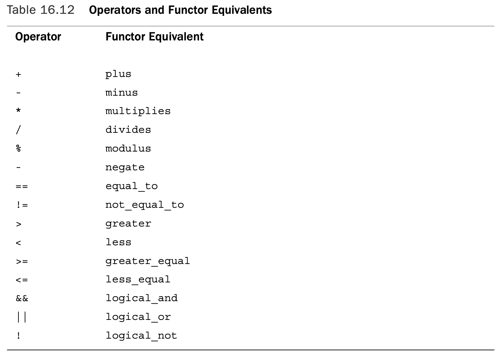

> Older C++ implementations use the functor name times instead of multiplies.

### Adaptable Functors and Function Adapters

 Actually, the STL has five related concepts: adaptable generators, adaptable unary functions, adaptable binary functions, adaptable predicates, and adaptable binary predicates.

What makes a functor adaptable is that it carries `typedef` members identifying its argument types and return type.The members are called `result_type`, `first_argument_type`, and `second_argument_type`, and they represent what they sound like. For example, the return type of a `plus<int>` object is identified as `plus<int>::result_type`, and this would be a `typedef` for `int`.

```c++
// funadap.cpp -- using function adapters 
#include <iostream>
#include <vector>
#include <iterator>
#include <algorithm> 
#include <functional>

void Show(double); 
const int LIM = 6; 
int main()
{
    using namespace std;
    double arr1[LIM] = {28, 29, 30, 35, 38, 59}; 
    double arr2[LIM] = {63, 65, 69, 75, 80, 99}; 
    vector<double> gr8(arr1, arr1 + LIM); 
    vector<double> m8(arr2, arr2 + LIM); 
    cout.setf(ios_base::fixed); 
    cout.precision(1);
    cout << "gr8:\t";
    for_each(gr8.begin(), gr8.end(), Show); 
    cout << endl;
    cout << "m8: \t";
    for_each(m8.begin(), m8.end(), Show);
    cout << endl;

    vector<double> sum(LIM);
    transform(gr8.begin(), gr8.end(), m8.begin(), sum.begin(),
              plus<double>()); 
    cout << "sum:\t";
    for_each(sum.begin(), sum.end(), Show); 
    cout << endl;

    vector<double> prod(LIM); 
    transform(gr8.begin(), gr8.end(), prod.begin(),
              bind1st(multiplies<double>(), 2.5)); 
    cout << "prod:\t";
    for_each(prod.begin(), prod.end(), Show); 
    cout << endl;

    return 0; 
}

void Show(double v) 
{
    std::cout.width(6);
    std::cout << v << ' '; 
}
```

```shell
gr8:	  28.0   29.0   30.0   35.0   38.0   59.0 
m8: 	  63.0   65.0   69.0   75.0   80.0   99.0 
sum:	  91.0   94.0   99.0  110.0  118.0  158.0 
prod:	  70.0   72.5   75.0   87.5   95.0  147.5 
```

C++11 provides an alternative to function pointers and functors. It’s called a **lambda expression**, another topic discussed in Chapter 18.

## Algorithms

The STL divides the algorithm library into four groups:

* Nonmodifying sequence operations 
* Mutating sequence operations
* Sorting and related operations
* Generalized numeric operations

The first three groups are described in the `algorithm` (formerly `algo.h`) header file, and the fourth group, being specifically oriented toward numeric data, gets its own header file, called `numeric`.(Formerly, they, too, were in `algo.h`.)

Nonmodifying sequence operations operate on each element in a range.These operations leave a container unchanged. For example, `find()` and `for_each()` belong to this category.

Mutating sequence operations also operate on each element in a range.The change could be in values or in the order in which the values are stored.The `transform()`, `random_shuffle()`, and `copy()` functions fall into this category.

Sorting and related operations include several sorting functions (including `sort()`) and a variety of other functions, including the set operations.

The numeric operations include functions to sum the contents of a range, calculate the inner product of two containers, calculate partial sums, and calculate adjacent differences. Typically, these are operations that are characteristic of arrays, so `vector` is the container most likely to be used with them.

### General Properties of Algorithms

The function prototype indicates the assumptions made about the iterators. For example, the `copy()` function has this prototype:

```c++
template<class InputIterator, class OutputIterator> 
OutputIterator copy(InputIterator first, InputIterator last,
	OutputIterator result);
```

One way of classifying algorithms is on the basis of where the result of the algorithm is placed. Some algorithms do their work in place, and others create copies. For example, when the `sort()` function is finished, the result occupies the same location that the original data did. So `sort()` is an **in-place algorithm**.The `copy()` function, however, sends the result of its work to another location, so it is a **copying algorithm**.The `transform()` function can do both. Like `copy()`, it uses an output iterator to indicate where the results go. Unlike `copy()`, `transform()` allows the output iterator to point to a location in the input range, so it can copy the transformed values over the original values.

Some algorithms come in two versions: an in-place version and a copying version.The STL convention is to append `_copy` to the name of the copying version.The latter ver- sion takes an additional output iterator parameter to specify the location to which to copy the outcome. For example, there is a `replace()` function that has this prototype:

```c++
template<class ForwardIterator, class T>
void replace(ForwardIterator first, ForwardIterator last,
			 const T& old_value, const T& new_value);
```

It replaces each instance of `old_value` with `new_value`. This occurs in place. Because this algorithm both reads from and writes to container elements, the iterator type has to be `ForwardIterator` or better.The copying version has this prototype:

```c++
template<class InputIterator, class OutputIterator, class T> 
OutputIterator replace_copy(InputIterator first, InputIterator last,
				OutputIterator result,
				const T& old_value, const T& new_value);
```

This time the resulting data is copied to a new location, given by `result`, so the read-only input iterator is sufficient for specifying the range.

Another common variation is that some functions have a version that performs an action conditionally, depending on the result of applying a function to a container ele- ment.These versions typically append `_if` to the function name. For example, `replace_if()` replaces an old value with a new value if applying a function to the old value returns the value `true`. Here’s the prototype:

```c++
template<class ForwardIterator, class Predicate class T> 
void replace_if(ForwardIterator first, ForwardIterator last,
		   Predicate pred, const T& new_value);
```

 There’s also a version called `replace_copy_if()`.You can probably figure out what it does and what its prototype is like.

### The STL and the `string` Class

The `string` class, although not part of the STL, is designed with the STL in mind. For example, it has `begin()`, `end()`, `rbegin()`, and `rend()` members.Thus, it can use the STL interface. A **permutation** is a rearrangement of the order of the elements in a container.

```c++
// strgstl.cpp -- applying the STL to a string 
#include <iostream>
#include <string>
#include <algorithm>

int main() 
{
    using namespace std;
    string letters;
    cout << "Enter the letter grouping (quit to quit): "; 
    while (cin >> letters && letters != "quit")
    {
        cout << "Permutations of " << letters << endl; 
        sort(letters.begin(), letters.end());
        cout << letters << endl;
        while (next_permutation(letters.begin(), letters.end()))
            cout << letters << endl;
        cout << "Enter next sequence (quit to quit): ";
    }
    cout << "Done.\n"; 
    return 0;
}
```

```shell
Enter the letter grouping (quit to quit): awsl
Permutations of awsl
alsw
alws
aslw
aswl
awls
awsl
lasw
laws
lsaw
lswa
lwas
lwsa
salw
sawl
slaw
slwa
swal
swla
wals
wasl
wlas
wlsa
wsal
wsla
Enter next sequence (quit to quit): quit
Done.
```

The `next_permutation()` algorithm transforms the contents of a range to the next permutation; in the case of a string, the permutations are arranged in ascending alphabetical order. The algorithm returns true if it succeeds and false if the range already is in the final sequence.

### Functions Versus Container Methods

Sometimes you have a choice between using an STL method and an STL function. Usually, the method is the better choice. First, it should be better optimized for a particular container. Second, being a member function, it can use a template class’s memory management facilities and resize a container when needed.

```c++
// listrmv.cpp -- applying the STL to a string 
#include <iostream>
#include <list>
#include <algorithm>

void Show(int);
const int LIM = 10; 
int main()
{
    using namespace std;
    int ar[LIM] = {4, 5, 4, 2, 2, 3, 4, 8, 1, 4}; 
    list<int> la(ar, ar + LIM);
    list<int> lb(la);
    cout << "Original list contents:\n\t"; 
    for_each(la.begin(), la.end(), Show);
    cout << endl;
    la.remove(4);
    cout << "After using the remove() method:\n"; 
    cout << "la:\t";
    for_each(la.begin(), la.end(), Show);
    cout << endl;
    list<int>::iterator last;
    last = remove(lb.begin(), lb.end(), 4);
    cout << "After using the remove() function:\n"; 
    cout << "lb:\t";
    for_each(lb.begin(), lb.end(), Show);
    cout << endl;
    lb.erase(last, lb.end());
    cout << "After using the erase() method:\n"; 
    cout << "lb:\t";
    for_each(lb.begin(), lb.end(), Show);
    cout << endl;
    return 0;
}

void Show(int v)
{
    std::cout<< v << ' ';
}
```

```shell
Original list contents:
	4 5 4 2 2 3 4 8 1 4 
After using the remove() method:
la:	5 2 2 3 8 1 
After using the remove() function:
lb:	5 2 2 3 8 1 4 8 1 4 
After using the erase() method:
lb:	5 2 2 3 8 1 
```

As you can see, the `remove()` method reduces the list `la` from 10 elements to 6 ele- ments. However, list `lb` still contains 10 elements after the `remove()` function is applied to it.The last 4 elements are disposable because each is either the value 4 or a duplicate of a value moved farther to the front of the list.

### Using the STL

The STL is a library whose parts are designed to work together.The STL components are tools, but they are also building blocks to create other tools.

Suppose you want to write a program that lets the user enter words.At the end, you’d like a record of the words as they were entered, an alphabetical list of the words used (capitalization differences ignored), and a record of how many times each word was entered.

Entering and saving the list of words is simple enough. Following the example of Listings 16.8 and 16.9, you can create a `vector<string>` object and use `push_back()` to add input words to the vector:

```c++
vector<string> words;
string input;
while (cin >> input && input != "quit")
	words.push_back(input);
```

What about getting the alphabetic word list? You can use `sort()` followed by `unique()`, but that approach overwrites the original data because `sort()` is an in-place algorithm.There is an easier way that avoids this problem.You can create a `set<string> `object and copy (using an insert iterator) the words from the vector to the set.For the transformation function, you can use one that converts a string to lowercase:

```c++
set<string> wordset; 
transform(words.begin(), words.end(),
	insert_iterator<set<string> > (wordset, wordset.begin()), ToLower);
```

```c++
string & ToLower(string & st) 
{
    transform(st.begin(), st.end(), st.begin(), tolower);
    return st; 
}
```

One possible problem is that the `tolower()` function is defined as `int tolower(int)`, and some compilers want the function to match the element type, which is `char`. One solution is to replace `tolower` with `toLower` and to provide the following definition:

```c++
char toLower(char ch) { return tolower(ch); }
```

To get the number of times each word appears in the input, you can use the `count()` function. It takes a range and a value as arguments, and it returns the number of times the value appears in the range.You can use the `vector` object to provide the range and the `set` object to provide the list of words to count.That is, for each word in the set, you can count how many times it appears in the vector.To keep the resulting count associated with the correct word, you can store the word and the count as a `pair<const string, int>` object in a `map` object.The word will be the key (just one copy), and the count will be the value.This can be done in a single loop:

```c++
map<string, int> wordmap;
set<string>::iterator si;
for (si = wordset.begin(); si != wordset.end(); si++)
    wordmap.insert(pair<string, int>(*si, count(words.begin(), 
                                                words.end(), *si)));
```

The `map` class has an interesting feature:You can use array notation with keys that serve as indexes to access the stored values. For example, `wordmap["the"]` would represent the value associated with the key `"the"`, which in this case is the number of occurrences of the string `"the"`.

```c++
for (si = wordset.begin(); si != wordset.end(); si++) 
    wordmap[*si] = count(words.begin(), words.end(), *si);
```

Because si points to a string in the `wordset` container, `*si` is a string and can serve as a key for `wordmap.This` code places both keys and values into the `wordmap` map.

Similarly, you can use the array notation to report results:

```c++
for (si = wordset.begin(); si != wordset.end(); si++) 
    cout << *si << ": " << wordmap[*si] << endl;
```

If a key is invalid, the corresponding value is `0`.

```c++
//usealgo.cpp -- using several STL elements 
#include <iostream>
#include <string>
#include <vector>
#include <set> 
#include <map> 
#include <iterator> 
#include <algorithm> 
#include <cctype> 
using namespace std;

char toLower(char ch) { return tolower(ch); } 
string & ToLower(string & st);
void display(const string & s);

int main() 
{
    vector<string> words;
    cout << "Enter words (enter quit to quit):\n"; 
    string input;
    while (cin >> input && input != "quit")
    	words.push_back(input);

    cout << "You entered the following words:\n"; 
    for_each(words.begin(), words.end(), display); 
    cout << endl;
    
    // place words in set, converting to lowercase 
    set<string> wordset;
    transform(words.begin(), words.end(),
        insert_iterator<set<string> > (wordset, wordset.begin()),   
        ToLower);
    cout << "\nAlphabetic list of words:\n"; 
    for_each(wordset.begin(), wordset.end(), display); 
    cout << endl;

    // place word and frequency in map
    map<string, int> wordmap;
    set<string>::iterator si;
    for (si = wordset.begin(); si != wordset.end(); si++)
        wordmap[*si] = count(words.begin(), words.end(), *si);

    // display map contents
    cout << "\nWord frequency:\n";
    for (si = wordset.begin(); si != wordset.end(); si++)
        cout << *si << ": " << wordmap[*si] << endl;
        
    return 0; 
}

string & ToLower(string & st) 
{
    transform(st.begin(), st.end(), st.begin(), toLower);
    return st; 
}

void display(const string & s) 
{
    cout << s << " "; 
}
```

```shell
Enter words (enter quit to quit):
The dog saw the cat and thought the cat fat
The cat thought the cat perfect
quit
You entered the following words:
The dog saw the cat and thought the cat fat The cat thought the cat perfect 

Alphabetic list of words:
and cat dog fat perfect saw the thought 

Word frequency:
and: 1
cat: 4
dog: 1
fat: 1
perfect: 1
saw: 1
the: 5
thought: 2
```

## Other Libraries

### `vector`, `valarray`, and `array`

The `vector` template class is part of a system of container classes and algorithms.The vector class supports container-oriented activities, such as sorting, insertion, rearrangement, searching, transferring data to other containers, and other manipulations.

The `valarray` class template, on the other hand, is oriented toward numeric computation, and it is not part of the STL. It doesn’t have `push_back()` and `insert()` methods, for example, but it does provide a simple, intuitive interface for many mathematical operations. 

Finally, `array` is designed as a substitute for the built-in array type, combining the compactness and efficiency of that type with a better, safer interface. Being of fixed size, array doesn’t support `push_back()` and `insert()`, but it does offer several other STL methods.These include `begin()`, `end()`, `rbegin()`, and `rend()`, making it easy to apply STL algorithms to array objects.

Suppose, for example, that you have these declarations:

```c++
vector<double> ved1(10), ved2(10), ved3(10); 
array<double, 10> vod1, vod2, vod3; 
valarray<double> vad1(10), vad2(10), vad3(10);
```

Suppose you want to assign the sum of the first elements of two arrays to the first element of a third array, and so on.With the `vector` class, you would do this:

```c++
transform(ved1.begin(), ved1.end(), ved2.begin(), ved3.begin(), 
          plus<double>());
```

You can do the same with the `array` class:

```c++
transform(vod1.begin(), vod1.end(), vod2.begin(), vod3.begin(), 
          plus<double>());
```

However, the `valarray` class overloads all the arithmetic operators to work with `valarray` objects, so you would use this:

```c++
vad3 = vad1 + vad2; // + overloaded
```

Similarly, the following would result in each element of `vad3` being the product of the

corresponding elements in `vad1` and `vad2`:

```c++
vad3 = vad1 * vad2; // * overloaded
```

Suppose you want to replace every value in an array with that value multiplied by 2.5. The STL approach is this:

```c++
transform(ved3.begin(), ved3.end(), ved3.begin(), 
          bind1st(multiplies<double>(), 2.5));
```

The `valarray` class overloads multiplying a valarray object by a single value, and it also overloads the various computed assignment operators, so you could use either of the following:

```c++
vad3 = 2.5 * vad3; 		// * overloaded 
vad3 *= 2.5; 			// *= overloaded
```

Suppose you want to take the natural logarithm of every element of one array and store the result in the corresponding element of a second array.The STL approach is this:

```c++
transform(ved1.begin(), ved1.end(), ved3.begin(), 
          log);
```

The `valarray` class overloads the usual math functions to take a `valarray` argument and to return a `valarray` object, so you can use this:

```c++
vad3 = log(vad1); 		// log() overloaded
```

Or you could use the `apply()` method, which also works for non-overloaded functions:

```c++
vad3 = vad1.apply(log);
```

The `apply()` method doesn’t alter the invoking object; instead, it returns a new object that contains the resulting values.

The simplicity of the `valarray` interface is even more apparent when you do a multi- step calculation:

```c++
vad3 = 10.0* ((vad1 + vad2) / 2.0 + vad1 * cos(vad2));
```

Can you use the STL with `valarray` objects? Answering this question provides a quick review of some STL principles. Suppose you have a `valarray<double>` object that has 10 elements:

```c++
valarray<double> vad(10);
```

The valarray class doesn’t have `begin()` and `end()` methods, so you can’t use them as the range arguments:

```c++
sort(vad.begin(), vad.end()); // NO, no begin(), end()
```

Also `vad` is an object, not a pointer, so you can’t imitate ordinary array usage and pro-

vide `vad` and `vad + 10`, as the following code attempts to do:

```c++
sort(vad, vad + 10); // NO, vad an object, not an address
```

You can use the address operator:

```c++
sort(&vad[0], &vad[10]); // maybe?
```

But the behavior of using a subscript one past the end is undefined for valarray.This doesn’t necessarily mean using `&vad[10]` won’t work.

C++11 remedies the situation by providing `begin()` and `end()` template functions that take a `valarray` object as an argument. So you would use `begin(vad)` instead of `vad.begin()`.These functions return values that are compatible with STL range requirements:

```c++
sort(begin(vad), end(vad)); // C++11 fix!
```

```c++
// valvect.cpp -- comparing vector and valarray 
#include <iostream>
#include <valarray>
#include <vector>
#include <algorithm> 

int main()
{
    using namespace std; 
    vector<double> data; 
    double temp;

    cout << "Enter numbers (<=0 to quit):\n"; 
    while (cin >> temp && temp > 0)
        data.push_back(temp); 
    sort(data.begin(), data.end()); 
    int size = data.size(); 
    valarray<double> numbers(size); 
    int i;
    for (i = 0; i < size; i++)
        numbers[i] = data[i]; 
    valarray<double> sq_rts(size); 
    sq_rts = sqrt(numbers); 
    valarray<double> results(size); 
    results = numbers + 2.0 * sq_rts; 
    cout.setf(ios_base::fixed); 
    cout.precision(4);
    for (i = 0; i < size; i++)
    {
        cout.width(8);
        cout << numbers[i] << ": "; 
        cout.width(8);
        cout << results[i] << endl;
    }
    cout << "done\n"; 
    return 0;
}
```

```shell
Enter numbers (<=0 to quit):
3.3
1.8
5.2
10
14.4
21.6
26.9
-1
  1.8000:   4.4833
  3.3000:   6.9332
  5.2000:   9.7607
 10.0000:  16.3246
 14.4000:  21.9895
 21.6000:  30.8952
 26.9000:  37.2730
done
```

The `valarray` class has many features besides the ones discussed so far. For example, if `numbers` is a `valarray<double`> object, the following statement creates an array of bool values, with `vbool[i]` set to the value of `numbers[i] > 9`—that is, to `true` or `false`:

```c++
valarray<bool> vbool = numbers > 9;
```

A `slice` class object can be used as an array index, in which case it represents, in general, not just one value but a subset of values. A `slice` object is initialized to three integer values: the **start**, the **number**, and the **stride**.The **start** indicates the index of the first element to be selected, the **number** indicates the number of elements to be selected, and the **stride** represents the spacing between elements. For example, the object constructed by slice(1,4,3) means select the four elements whose indexes are 1, 4, 7, and 10.

If, say, `varint` is a `vararray<int>` object, then the following statement would set elements 1, 4, 7, and 10 to the value 10:

```c++
varint[slice(1,4,3)] = 10; // set selected elements to 10
```

```c++
// vslice.cpp -- using valarray slices 
#include <iostream>
#include <valarray>
#include <cstdlib>

const int SIZE = 12;
typedef std::valarray<int> vint;        // simplify declarations
void show(const vint & v, int cols); 

int main()
{
    using std::slice;                   // from <valarray>
    using std::cout;
    vint valint(SIZE);                  // think of as 4 rows of 3

    int i;
    for (i = 0; i < SIZE; ++i) 
        valint[i] = std::rand() % 10;
    cout << "Original array:\n"; 
    show(valint, 3);                    // show in 3 columns
    vint vcol(valint[slice(1,4,3)]);    // extract 2nd volumn
    cout << "Second column:\n"; 
    show(vcol, 1);                      // show in 1 column
    vint vrow(valint[slice(3,3,1)]); 
    cout << "Second row:\n"; 
    show(vrow, 3); 
    valint[slice(2,4,3)] = 10;          // assign to 2nd column
    cout << "Set last column to 10:\n";
    show(valint, 3);
    cout << "Set first column to sum of next two:\n";
    // + not defined for slices, so convert to valarray<int> 
    valint[slice(0,4,3)] = vint(valint[slice(1,4,3)])
                                + vint(valint[slice(2,4,3)]);
    show(valint, 3);
    return 0;
}

void show(const vint & v, int cols) 
{
    using std::cout; 
    using std::endl;
    int lim = v.size();
    for (int i = 0; i < lim; ++i) 
    {
        cout.width(3);
        cout << v[i];
        if (i % cols == cols - 1)
            cout << endl; 
        else
            cout << ' ';
    }
    if (lim % cols != 0)
        cout << endl;
}
```

```shell
Original array:
  7   9   3
  8   0   2
  4   8   3
  9   0   5
Second column:
  9
  0
  8
  0
Second row:
  8   0   2
Set last column to 10:
  7   9  10
  8   0  10
  4   8  10
  9   0  10
Set first column to sum of next two:
 19   9  10
 10   0  10
 18   8  10
 10   0  10
```

### The `initializer_list` Template (C++11)

The `initializer_list` template is another C++11 addition to the C++ library.You can

use the initializer-list syntax to initialize an STL container to a list of values:

```c++
std::vector<double> payments {45.99, 39.23, 19.95, 89.01};
```

The usual list restrictions on narrowing apply:

```c++
std::vector<int> values = {10, 8, 5.5}; // narrowing, compile-time error
```

Here, the element type is `int`, and the implied conversion of `5.5` to `int` is not allowed.

It doesn’t make sense to provide an `initializer_list` constructor unless the class is meant to handle lists of varying sizes. For instance, you don’t want an `initializer_list` constructor for a class taking a fixed number of values. For example, the following declaration does not provide an `initializer_list` constructor for the three data members:

```c++
class Position 
{
private:
	int x; 
    int y; 
    int z;
public:
    Position(int xx = 0, int yy = 0, int zz = 0)
    	: x(xx), y(yy), z(zz) {} 
    // no initializer_list constructor
    ... 
};
```

### Using `initializer_list`

```c++
// ilist.cpp -- use initializer_list (C++11 feature) 
#include <iostream>
#include <initializer_list>

double sum(std::initializer_list<double> il);
double average(const std::initializer_list<double> & ril);

int main() 
{
    using std::cout;

    cout << "List 1: sum = " << sum({2,3,4})
         <<", ave = " << average({2,3,4}) << '\n';
    std::initializer_list<double> dl = {1.1, 2.2, 3.3, 4.4, 5.5};
    cout << "List 2: sum = " << sum(dl)
         <<", ave = " << average(dl) << '\n'; 
    dl = {16.0, 25.0, 36.0, 40.0, 64.0};
    cout << "List 3: sum = " << sum(dl)
         <<", ave = " << average(dl) << '\n';

    return 0; 
}

double sum(std::initializer_list<double> il) 
{
    double tot = 0;
    for (auto p = il.begin(); p !=il.end(); p++)
        tot += *p; 
    return tot;
}

double average(const std::initializer_list<double> & ril) 
{
    double tot = 0;
    int n = ril.size();
    double ave = 0.0;
    if (n > 0)
    {
        for (auto p = ril.begin(); p != ril.end(); p++)
            tot += *p;
        ave = tot / n;
    }
    return ave;
}
```

```shell
List 1: sum = 9, ave = 3
List 2: sum = 16.5, ave = 3.3
List 3: sum = 181, ave = 36.2
```