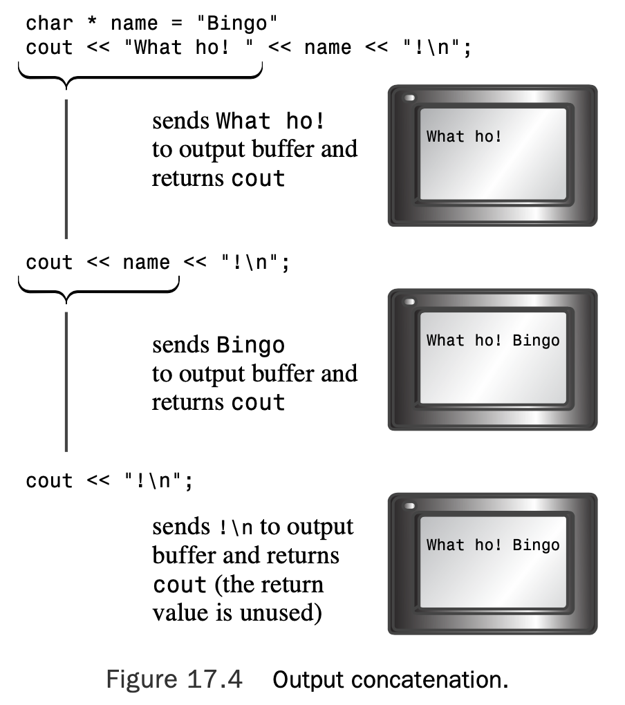
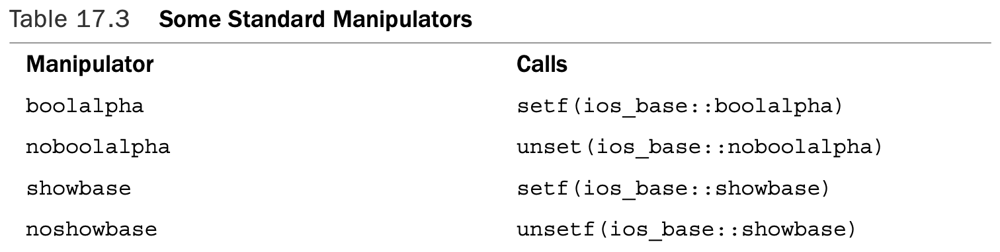
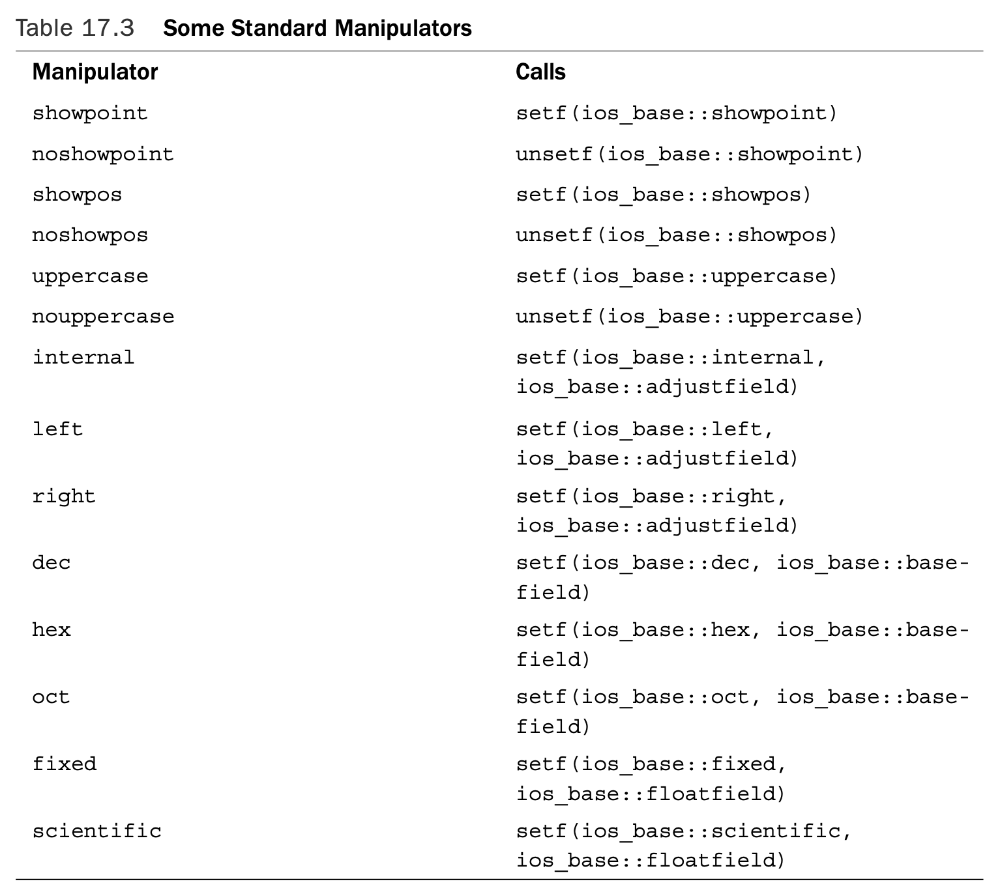

# Input, Output, and Files

[TOC]

## An Overview of C++ Input and Output

### Streams and Buffers

A C++ program views input or output as a stream of bytes. On input, a program extracts bytes from an input stream, and on output, a program inserts bytes into the output stream. A stream acts as an intermediary between the program and the stream’s source or destination. This approach enables a C++ program to treat input from a keyboard in the same manner it treats input from a file; the C++ program merely examines the stream of bytes without needing to know where the bytes come from. 

Managing input involves two stages:

* Associating a stream with an input to a program 
* Connecting the stream to a file

In other words, an input stream needs two connections, one at each end.The file-end connection provides a source for the stream, and the program-end connection dumps the stream outflow into the program. 

Similarly, managing output involves connecting an output stream to the program and associating some output destination with the stream. It’s like plumbing with bytes instead of water (see Figure 17.1).


Usually, input and output can be handled more efficiently by using a buffer. A **buffer** is a block of memory used as an intermediate, temporary storage facility for the transfer of information from a device to a program or from a program to a device.Typically, devices such as disk drives transfer information in blocks of 512 bytes or more, whereas programs often process information 1 byte at a time.The buffer helps match these two disparate rates of information transfer. 

The principle is similar to that of a water reservoir that collects megagallons of runoff water during a big storm and then feeds water to your home at a more civilized rate of flow (see Figure 17.2). Similarly, on output, a pro- gram can first fill the buffer and then transfer the entire block of data to a hard disk, clear- ing the buffer for the next batch of output.This is called **flushing the buffer**. 


Keyboard input provides one character at a time, so in that case, a program doesn’t need a buffer to help match different data transfer rates. However, buffered keyboard input allows the user to back up and correct input before transmitting it to a program.A C++ program normally flushes the input buffer when you press **Enter**.

For output to the display, a C++ program normally flushes the output buffer when you transmit a newline character. Depending on the implementation, a program may flush input on other occasions, too, such as at impending input.That is, when a program reaches an input statement, it flushes any output currently in the output buffer. 

### Streams, Buffers, and the `iostream` File

The business of managing streams and buffers can get a bit complicated, but including the iostream (formerly iostream.h) file brings in several classes designed to implement and manage streams and buffers for you. Here are some of those classes (see Figure 17.3):


* The `streambuf` class provides memory for a buffer, along with class methods for filling the buffer, accessing buffer contents, flushing the buffer, and managing the buffer memory.
* The `ios_base` class represents general properties of a stream, such as whether it’s open for reading and whether it’s a binary or a text stream.
* The `ios` class is based on `ios_base`, and it includes a pointer member to a `streambuf` object.
* The `ostream` class derives from the `ios` class and provides output methods.
* The `istream` class derives from the `ios` class and provides input methods.
* The `iostream` class is based on the `istream` and `ostream` classes and thus inherits both input and output methods.

The C++ `iostream` class library takes care of many details for you. For example, including the `iostream` file in a program creates eight stream objects automatically:

* The `cin` object corresponds to the standard input stream. By default, this stream is associated with the standard input device, typically a keyboard.The `wcin` object is similar but works with the `wchar_t` type.
* The `cout` object corresponds to the standard output stream. By default, this stream is associated with the standard output device, typically a monitor.The `wcout` object is similar but works with the `wchar_t` type.
* The `cerr` object corresponds to the standard error stream, which you can use for displaying error messages. By default, this stream is associated with the standard output device, typically a monitor, and the stream is unbuffered.This means that information is sent directly to the screen, without waiting for a buffer to fill or for a newline character.The `wcerr` object is similar but works with the `wchar_t` type.
* The `clog` object also corresponds to the standard error stream. By default, this stream is associated with the standard output device, typically a monitor, and the stream is buffered.The `wclog` object is similar but works with the `wchar_t` type.

A statement such as the following places the characters from the string `"Bjarne free"` into the buffer managed by `cout` via the pointed-to `streambuf` object:

```c++
cout << "Bjarne free";
```

### Redirection

Suppose, for example, that you have an executable Windows command prompt C++ pro- gram called counter.exe that counts the number of characters in its input and reports the result. A sample run might look like this:

```powershell
C>counter
Hello
and goodbye!
Control-Z 					<< simulated end-of-file 
Input contained 19 characters.
C>
```

With input redirection (`<`) and output redirection (`>`), you can use the same program to count the number of characters in the `oklahoma` file and to place the results in the `cow_cnt` file:

```powershell
C>counter <oklahoma >cow_cnt 
C>
```

But redirecting the standard output doesn’t affect `cerr` or `clog`; thus, if you use one of these objects to print an error message, a program will display the error message on the screen even if the regular `cout` output is redirected elsewhere. For example, consider this code fragment:

```c++
if (success)
	std::cout << "Here come the goodies!\n";
else 
{
    std::cerr << "Something horrible has happened.\n";
    exit(1); 
}
```

If redirection is not in effect, whichever message is selected is displayed onscreen. If, however, the program output has been redirected to a file, the first message, if selected, would go to the file but the second message, if selected, would go to the screen. By the way, some operating systems permit redirecting the standard error, too. 

## Output with `cout`

### The Overloaded `<<` Operator

Most often, this book has used cout with the `<<` operator, also called the **insertion**

operator:

```c++
int clients = 22; 
cout << clients;
```

In C++, as in C, by default the `<<` operator is used as the bitwise left-shift operator. An expression such as `x<<3` means to take the binary representation of x and shift all the bits three units to the left. The insertion operator is overloaded to recognize all the basic C++ types:

* `unsigned char`
* `signed char`
* `char`
* `short`
* `unsigned short`
* `int`
* `unsigned int`
* `long`
* `unsigned long`
* `long long`(C++ 11)
* `unsigned long long`(C++ 11)
* `float`
* `double`
* `long double`

The `ostream` class provides a definition for the `operator<<()` function for each of these data types. 

For example, the expression `cout << 88` matches the following method prototype:

```c++
ostream & operator<<(int);
```

#### Output and Pointers

The `ostream` class defines insertion operator functions for the following pointer types:

* const signed char *
* const unsigned char *
* const char *
* void *

C++ represents a string, don’t forget, by using a pointer to the location of the string. The pointer can take the form of the name of an array of `char` or of an explicit `pointer- to-char `or of a quoted string.Thus, all the following `cout` statements display strings:

```c++
char name[20] = "Dudly Diddlemore"; 
char * pn = "Violet D'Amore";
cout << "Hello!";
cout << name;
cout << pn;
```

The methods use the terminating **null** character in the string to determine when to stop displaying characters.

C++ matches a pointer of any other type with type `void *` and prints a numeric representation of the address. If you want the address of the string, you have to type cast it to another type, as shown in the following code fragment:

```c++
int eggs = 12;
char * amount = "dozen"; 
cout << &eggs;				// prints address of eggs variable
cout << amount;				// prints the string "dozen"
cout << (void *) amount;	// prints the address of the "dozen" string
```

#### Output Concatenation

All the incarnations of the insertion operator are defined to return type `ostream &`.That is, the prototypes have this form:

```c++
ostream & operator<<(type);
```

 In other words, an operator function’s return value is the same object that evokes the operator. For example, `cout << "potluck"` returns the `cout` object.That’s the feature that lets you concatenate output by using insertion. For example, consider the following statement:

```c++
cout << "We have " << count << " unhatched chickens.\n";
```

The expression `cout << "We have "` displays the string and returns the `cout` object,

reducing the statement to the following:

```c++
cout << count << " unhatched chickens.\n";
```

Then the expression `cout << count` displays the value of the `count` variable and returns `cout`, which can then handle the final argument in the statement (see Figure 17.4).



### The Other `ostream` Methods

Besides the various `operator<<()` functions, the `ostream` class provides the `put()` method for displaying characters and the `write()` method for displaying strings.

Originally, the `put()` method had the following prototype:

```c++
ostream & put(char);
```

The current standard is equivalent, except it’s templated to allow for `wchar_t`. You invoke it by using the usual class method notation:

```c++
cout.put('W'); // display the W character
```

Here cout is the invoking object and `put()` is the class member function. Like the `<<` operator functions, this function returns a reference to the invoking object, so you can concatenate output with it:

```c++
cout.put('I').put('t'); // displaying It with two put() calls
```

The function call `cout.put('I')` returns `cout`, which then acts as the invoking object for the `put('t')` call.

Given the proper prototype, you can use `put()` with arguments of numeric types other than `char`, such as `int`, and let function prototyping **automatically convert** the argument to the correct type `char` value. For example, you could use the following:

```c++
cout.put(65); // display the A character 
cout.put(66.3); // display the B character
```

The `write()` method writes an entire string and has the following template prototype:

```c++
basic_ostream<charT,traits>& write(const char_type* s, streamsize n);
```

```c++
// write.cpp -- using cout.write() 
#include <iostream>
#include <cstring> // or else string.h

int main() 
{
    using std::cout;
    using std::endl;
    const char * state1 = "Florida"; 
    const char * state2 = "Kansas"; 
    const char * state3 = "Euphoria"; 
    int len = std::strlen(state2); 
    cout << "Increasing loop index:\n"; 
    int i;
    for (i = 1; i <= len; i++)
    {
        cout.write(state2,i);
        cout << endl; 
    }
// concatenate output
    cout << "Decreasing loop index:\n"; 
    for (i = len; i > 0; i--)
        cout.write(state2,i) << endl;

// exceed string length
    cout << "Exceeding string length:\n"; 
    cout.write(state2, len + 5) << endl;

    return 0; 
}
```

```shell
Increasing loop index:
K
Ka
Kan
Kans
Kansa
Kansas
Decreasing loop index:
Kansas
Kansa
Kans
Kan
Ka
K
Exceeding string length:
KansasEuph
```

Note that the `cout.write()` call returns the `cout` object.This is because the `write()` method returns a reference to the object that invokes it, and in this case, the `cout` object invokes it.This makes it possible to concatenate output because `cout.write()` is replaced by its return value,`cout`:

```c++
cout.write(state2,i) << endl;
```

### Flushing the Output Buffer

Output isn’t sent to its destination immediately. Instead, it accumulates in the buffer until the buffer is full. Then the program **flushes** the buffer, sending the contents on and clearing the buffer for new data.Typically, a buffer is 512 bytes or an integral multiple thereof. 

Sending a newline character to the buffer, for example, normally flushes the buffer.Also as mentioned before, most C++ implementations flush the buffer when input is pending.That is, suppose you have the following code:

```c++
cout << "Enter a number: "; 
float num;
cin >> num;
```

The fact that the program expects input causes it to display the cout message immediately, even though the output string lacks a newline character.Without this feature, the program would wait for input without prompting the user with the cout message.

The `flush` manipulator flushes the buffer, and the `endl` manipulator flushes the buffer and inserts a newline character.You use these manipulators the way you would use a variable name:

```c++
cout << "Hello, good-looking! " << flush; 
cout << "Wait just a moment, please." << endl;
```

For example, you can flush the cout buffer by calling the `flush()` function directly:

```c++
flush(cout)
```

However, the ostream class overloads the `<<` insertion operator in such a way that the

following expression gets replaced with the `flush(cout)` function call:

```c++
cout << flush
```

### Formatting with `cout`

The `ostream` insertion operators convert values to text form. By default, they format values as follows:

* A type `char` value, if it represents a printable character, is displayed as a character in a field one character wide.
* Numeric integer types are displayed as decimal integers in a field just wide enough to hold the number and, if present, a minus sign.
* Strings are displayed in a field equal in width to the length of the string.

```c++
// defaults.cpp -- cout default formats
#include <iostream>

int main() 
{
    using std::cout;
    cout << "12345678901234567890\n"; 
    char ch = 'K';
    int t = 273;
    cout << ch << ":\n";
    cout << t << ":\n";
    cout << -t <<":\n";

    double f1 = 1.200;
    cout << f1 << ":\n";
    cout << (f1 + 1.0 / 9.0) << ":\n";

    double f2 = 1.67E2;
    cout << f2 << ":\n";
    f2 += 1.0 / 9.0;
    cout << f2 << ":\n";
    cout << (f2 * 1.0e4) << ":\n";

    double f3 = 2.3e-4;
    cout << f3 << ":\n"; 
    cout << f3 / 10 << ":\n";
    
    return 0; 
}
```

```shell
12345678901234567890
K:
273:
-273:
1.2:
1.31111:
167:
167.111:
1.67111e+06:
0.00023:
2.3e-05:
```

#### Changing the Number Base Used for Display

The `ostream` class inherits from the `ios` class, which inherits from the `ios_base` class. The `ios_base` class stores information that describes the format state.  By using **manipulators**, you can control the number base used to display integers. By using `ios_base` member functions, you can control the field width and the number of places displayed to the right of the decimal. 

To control whether integers are displayed in base 10, base 16, or base 8, you can use the `dec`, `hex`, and `oct` manipulators. For example, the following function call sets the number base format state for the `cout` object to hexadecimal:

```c++
hex(cout);
```

Although the manipulators really are functions, you normally see them used this way:

```c++
cout << hex;
```

```c++
// manip.cpp -- using format manipulators 
#include <iostream>

int main()
{
    using namespace std;
    cout << "Enter an integer: "; 
    int n;
    cin >> n;

    cout << "n     n*n\n";
    cout << n << "     " << n * n << " (decimal)\n";
// set to hex mode
    cout << hex;
    cout << n << "     ";
    cout << n * n << " (hexadecimal)\n";

// set to octal mode
    cout << oct << n << "     " << n * n << " (octal)\n";

// alternative way to call a manipulator
    dec(cout);
    cout << n << "     " << n * n << " (decimal)\n";

    return 0;
}
```

```shell
Enter an integer: 13
n     n*n
13     169 (decimal)
d     a9 (hexadecimal)
15     251 (octal)
13     169 (decimal)
```

#### Adjusting Field Widths

You can use the `width` member function to place differently sized numbers in fields that have equal widths.The method has these prototypes:

```c++
int width();
int width(int i);
```

The first form returns the current setting for field width.The second sets the field width to i spaces and returns the previous field width value.This allows you to save the previous value in case you want to restore the width to that value later.

The `width()` method affects **only the next item** displayed, and the field width reverts to the default value afterward. For example, consider the following statements:

```c++
cout << '#';
cout.width(12);
cout << 12 << "#" << 24 << "#\n";
```

The output statement produces the following display:

```c++
#          12#24#
```

```c++
// width.cpp -- using the width method
#include <iostream>
int main() 
{
    using std::cout;
    int w = cout.width(30);
    cout << "default field width = " << w << ":\n";
    cout.width(5);
    cout << "N" <<':'; 
    cout.width(8);
    cout << "N * N" << ":\n";

    for (long i = 1; i <= 100; i *= 10) 
    {
        cout.width(5);
        cout << i <<':'; 
        cout.width(8);
        cout << i * i << ":\n";
    }

    return 0; 
}
```

```shell
        default field width = 0:
    N:   N * N:
    1:       1:
   10:     100:
  100:   10000:
```

The output displays values right-justified in their fields.The output is padded with spaces.That is,cout achieves the full field width by adding spaces.With right-justification, the spaces are inserted to the left of the values.The character used for padding is termed the **fill character**. Right-justification is the default.

Also note that `w` has the value `0`. This is because `cout.width(30)` returns the previous field width, not the width to which it was just set.

#### Fill Characters

By default, `cout` fills unused parts of a field with spaces.You can use the `fill()` member function to change that. For example, the following call changes the fill character to an asterisk:

```c++
cout.fill('*');
```

```c++
// fill.cpp -- changing fill character for fields
#include <iostream>

int main() 
{
    using std::cout;
    cout.fill('*');
    const char * staff[2] = { "Waldo Whipsnade", "Wilmarie Wooper"}; 
    long bonus[2] = {900, 1350};

    for (int i = 0; i < 2; i++) 
    {
        cout << staff[i] << ": $"; 
        cout.width(7);
        cout << bonus[i] << "\n";
    }

    return 0; 
}
```

```shell
Waldo Whipsnade: $****900
Wilmarie Wooper: $***1350
```

#### Setting Floating-Point Display Precision

```c++
// precise.cpp -- setting the precision
#include <iostream> 

int main()
{
    using std::cout;
    float price1 = 20.40;
    float price2 = 1.9 + 8.0 / 9.0;

    cout << "\"Furry Friends\" is $" << price1 << "!\n"; 
    cout << "\"Fiery Fiends\" is $" << price2 << "!\n";

    cout.precision(2);
    cout << "\"Furry Friends\" is $" << price1 << "!\n"; 
    cout << "\"Fiery Fiends\" is $" << price2 << "!\n";

    return 0;
}
```

```shell
"Furry Friends" is $20.4!
"Fiery Fiends" is $2.78889!
"Furry Friends" is $20!
"Fiery Fiends" is $2.8!
```

#### Printing Trailing Zeros and Decimal Points

The `ios_base` class provides a `setf()` (for **set flag**) function that controls several formatting features.The class also defines several constants that can be used as arguments to this function. For example, the following function call causes `cout` to display trailing decimal points:

```c++
cout.setf(ios_base::showpoint);
```

```c++
// showpt.cpp -- setting the precision, showing trailing point
#include <iostream> 

int main()
{
    using std::cout;
    using std::ios_base;

    float price1 = 20.40;
    float price2 = 1.9 + 8.0 / 9.0;

    cout.setf(ios_base::showpoint);
    cout << "\"Furry Friends\" is $" << price1 << "!\n"; 
    cout << "\"Fiery Fiends\" is $" << price2 << "!\n";

    cout.precision(2);
    cout << "\"Furry Friends\" is $" << price1 << "!\n"; 
    cout << "\"Fiery Fiends\" is $" << price2 << "!\n";

    return 0;
}
```

```shell
"Furry Friends" is $20.4000!
"Fiery Fiends" is $2.78889!
"Furry Friends" is $20.!
"Fiery Fiends" is $2.8!
```

#### More About `setf()`

The `ios_base` class has a protected data member in which individual bits (called **flags** in this context) control different formatting aspects, such as the number base and whether trailing zeros are displayed. Turning a flag on is called **setting the flag** (or bit) and means setting the bit to `1`. 

The `setf()` function has two prototypes.The first is this:

```c++
fmtflags setf(fmtflags);
```

Here `fmtflags` is a `typedef` name for a **bitmask** type (see the following Note) used to hold the format flags. If you want to set bit number 11 to 1, you pass a number that has its number 11 bit set to 1.The return value would have its number 11 bit assigned the prior value for that bit. Keeping track of bits sounds (and is) tedious. However, you don’t have to do that job; the `ios_base` class defines constants that represent the bit values.Table 17.1 shows some of these definitions.


```c++
// setf.cpp -- using setf() to control formatting
#include <iostream>

int main() 
{
    using std::cout; 
    using std::endl; 
    using std::ios_base;

    int temperature = 63;
    cout << "Today's water temperature: "; 
    cout.setf(ios_base::showpos);       // show plus sign 
    cout << temperature << endl;

    cout << "For our programming friends, that's\n";
    cout << std::hex << temperature << endl; // use hex 
    cout.setf(ios_base::uppercase);     // use uppercase in hex 
    cout.setf(ios_base::showbase);      // use 0X prefix for hex 
    cout << "or\n";
    cout << temperature << endl;
    cout << "How " << true << "! oops -- How "; 
    cout.setf(ios_base::boolalpha);
    cout << true << "!\n";

    return 0; 
}
```

```shell
Today's water temperature: +63
For our programming friends, that's
3f
or
0X3F
How 0X1! oops -- How true!
```

The second `setf()` prototype takes two arguments and returns the prior setting:

```c++
fmtflags setf(fmtflags , fmtflags );
```

The first argument, as before, is a `fmtflags` value that contains the desired setting.The second argument is a value that first clears the appropriate bits. 

Using the `setf()` function requires a bit more work because you use the second argument to indicate which bits to clear and then use the first argument to indicate which bit to set.This is not as complicated as it sounds because the `ios_base` class defines constants (shown in Table 17.2) for this purpose. 


That is, the following function call has the same effect as using the `hex` manipulator:

```c++
cout.setf(ios_base::hex, ios_base::basefield);
```

Under the C++ Standard, both fixed and scientific notation have the following two properties:

* **Precision** means the number of digits to the right of the decimal rather than the total number of digits.
* Trailing zeros are displayed.

For example, to request left-justification, you use this call:

```c++
ios_base::fmtflags old = cout.setf(ios::left, ios::adjustfield);
```

To restore the previous setting, you use this:

```c++
cout.setf(old, ios::adjustfield);
```

```c++
// setf2.cpp -- using setf() with 2 arguments to control formatting 
#include <iostream>
#include <cmath>
int main() 
{
    using namespace std;
    // use left justification, show the plus sign, show trailing
    // zeros, with a precision of 3 
    cout.setf(ios_base::left, ios_base::adjustfield); 
    cout.setf(ios_base::showpos); 
    cout.setf(ios_base::showpoint);
    cout.precision(3);
    // use e-notation and save old format setting 
    ios_base::fmtflags old = cout.setf(ios_base::scientific,
        ios_base::floatfield);
    cout << "Left Justification:\n"; 
    long n;
    for (n = 1; n <= 41; n+= 10)
    {
        cout.width(4);
        cout << n << "|"; 
        cout.width(12);
        cout << sqrt(double(n)) << "|\n";
    }
    // change to internal justification 
    cout.setf(ios_base::internal, ios_base::adjustfield); 
    // restore default floating-point display style 
    cout.setf(old, ios_base::floatfield);
    cout << "Internal Justification:\n"; 
    for (n = 1; n <= 41; n+= 10)
    {
        cout.width(4);
        cout << n << "|"; cout.width(12);
        cout << sqrt(double(n)) << "|\n";
    }
    // use right justification, fixed notation 
    cout.setf(ios_base::right, ios_base::adjustfield); 
    cout.setf(ios_base::fixed, ios_base::floatfield); 
    cout << "Right Justification:\n";
    for (n = 1; n <= 41; n+= 10) 
    {
        cout.width(4);
        cout << n << "|"; cout.width(12);
        cout << sqrt(double(n)) << "|\n";
    }

    return 0; 
}
```

```shell
Left Justification:
+1  |+1.000e+00  |
+11 |+3.317e+00  |
+21 |+4.583e+00  |
+31 |+5.568e+00  |
+41 |+6.403e+00  |
Internal Justification:
+  1|+       1.00|
+ 11|+       3.32|
+ 21|+       4.58|
+ 31|+       5.57|
+ 41|+       6.40|
Right Justification:
  +1|      +1.000|
 +11|      +3.317|
 +21|      +4.583|
 +31|      +5.568|
 +41|      +6.403|
```

The effects of calling `setf()` can be undone with `unsetf()`, which has the following prototype:

```c++
void unsetf(fmtflags mask);
```

Here `mask` is a bit pattern. All bits set to `1` in `mask` cause the corresponding bits to be

unset. That is, `setf()` sets bits to `1`, and `unsetf()` sets bits back to `0`. Here’s an example:

```c++
cout.setf(ios_base::showpoint); 		// show trailing decimal point 
cout.unsetf(ios_base::boolshowpoint); 	// don't show trailing decimal point 
cout.setf(ios_base::boolalpha); 		// display true, false 
cout.unsetf(ios_base::boolalpha); 		// display 1, 0
```

One way to invoke the default mode is this:

```c++
cout.setf(0, ios_base::floatfield); // go to default mode
```

A shorter way to accomplish the same end is to use `unsetf()` with `ios_base::floatfield`:

```c++
cout.unsetf(ios_base::floatfield); 	// go to default mode
```

#### Standard Manipulators

Using `setf()` is not the most user-friendly approach to formatting, so C++ offers several manipulators to invoke `setf()` for you, automatically supplying the right arguments.

```c++
cout << left << fixed;
```

Table 17.3 lists these along with several other manipulatrs.





#### The `iomanip` Header File

```c++
// iomanip.cpp -- using manipulators from iomanip
// some systems require explicitly linking the math library 
#include <iostream>
#include <iomanip>
#include <cmath>

int main() 
{
    using namespace std;
    // use new standard manipulators 
    cout << fixed << right;

    // use iomanip manipulators
    cout << setw(6) << "N" << setw(14) << "square root"
         << setw(15) << "fourth root\n";

    double root;
    for (int n = 10; n <=100; n += 10) 
    {
        root = sqrt(double(n));
        cout << setw(6) << setfill('.') << n << setfill(' ')
             << setw(12) << setprecision(3) << root
             << setw(14) << setprecision(4) << sqrt(root) 
             << endl;
    }

    return 0; 
}
```

```shell
     N   square root   fourth root
....10       3.162        1.7783
....20       4.472        2.1147
....30       5.477        2.3403
....40       6.325        2.5149
....50       7.071        2.6591
....60       7.746        2.7832
....70       8.367        2.8925
....80       8.944        2.9907
....90       9.487        3.0801
...100      10.000        3.1623
```

## Input with `cin`

Typically, you use `cin` as follows:

```c++
cin >> value_holder;
```

Here `value_holder` identifies the memory location in which to store the input. It can be the name of a variable, a reference, a dereferenced pointer, or a member of a structure or of a class. 

The `istream` class, defined in the `iostream` header file, overloads the `>>` extraction oper- ator to recognize the following basic types:

* `signed char &`
* `unsigned char &`
* `char &`
* `short &`
* `unsigned short &`
* `int &`
* `unsigned int &`
* `long &`
* `unsigned long &`
* `long long &` (C++11)
* `unsigned long long &` (C++11)
* `float &`
* `double &`
* `long double &`

A typical operator function has a prototype like the following:

```c++
istream & operator>>(int &);
```

Both the argument and the return value are **references**. With a reference argument a statement such as the following causes the `operator>>()` function to work with the variable `staff_size` itself rather than with a copy, as would be the case with a regular argument:

```c++
cin >> staff_size;
```

to the following prototype:

```c++
istream & operator>>(int &);
```

Incidentally, you can use the `hex`, `oct`, and `dec` manipulators with `cin` to specify that integer input is to be interpreted as hexadecimal, octal, or decimal format. 

```c++
cin >> hex;
```

The `istream` class also overloads the `>>` extraction operator for character pointer types:

* signed char *
* char*
* unsigned char *

For this type of argument, the extraction operator reads the next word from input and places it at the indicated address, **adding a null character to make a string**.

```c++
cout << "Enter your first name:\n"; 
char name[20];
cin >> name;
```

If you respond to the request by typing **Liz**, the extraction operator places the characters `Liz\0` in the name array. 

The fact that each extraction operator returns a reference to the invoking object lets you concatenate input, just as you can concatenate output:

```c++
char name[20];
float fee;
int group;
cin >> name >> fee >> group;
```

### How `cin >>` Views Input

The various versions of the extraction operator share a common way of looking at the input stream.They skip over **white space (blanks, newlines, and tabs)** until they encounter a non-white-space character.This is true even for the single-character modes (those in which the argument is type char, unsigned char, or signed char), which is not true of C’s character input functions (see Figure 17.5). 


In the single-character modes, the `>>` operator reads that character and assigns it to the indicated location. In the other modes, the operator reads in one unit of the indicated type. That is, it reads everything from the initial non-white-space character up to the first character that doesn’t match the destination type.

For example, consider the following code:

```c++
int elevation; 
cin >> elevation;
```

Suppose you type the following characters:

```c++
-123Z
```

The operator will read the `-`, `1`, `2`, and `3` characters because they are all valid parts of an integer. But the `Z` character isn’t valid, so the last character accepted for input is the `3`.The `Z` remains in the input stream, and the next `cin` statement will start reading at that point. Meanwhile, the operator converts the character sequence `-123` to an integer value and assigns it to `elevation`.

```c++
// check_it.cpp -- checking for valid input
#include <iostream>

int main() 
{
    using namespace std;
    cout << "Enter numbers: ";

    int sum = 0;
    int input;
    while (cin >> input) 
    {
        sum += input; 
    }

    cout << "Last value entered = " << input << endl; 
    cout << "Sum = " << sum << endl;
    return 0;
}
```

```shell
Enter numbers: 200
10 -50 -123Z 60
Last value entered = 0
Sum = 37
```

### Stream States

A `cin` or `cout` object contains a data member (inherited from the `ios_base` class) that describes the **stream state**. A stream state (defined as type `iostate`, which, in turn, is a bitmask type, such as described earlier) consists of the three `ios_base` elements: `eofbit`, `badbit`, and `failbit`. Table 17.4 lists these bits, along with some `ios_base` methods that report or alter the stream state.


#### Setting States

Two of the methods in Table 17.4, `clear()` and `setstate()`, are similar. Both reset the state, but they do so in a different fashion. The `clear()` method sets the state to its argu- ment.Thus, the following call uses the default argument of `0`, which clears all three state bits (`eofbit`, `badbit`, and `failbit`):

```c++
clear();
```

Similarly, the following call makes the state equal to `eofbit`; that is, `eofbit` is set, and

the other two state bits are cleared:

```c++
clear(eofbit);
```

The `setstate()` method, however, affects only those bits that are set in its argument.

Thus, the following call sets `eofbit` without affecting the other bits:

```c++
setstate(eofbit);
```

So if `failbit` was already set, it stays set.

#### I/O and Exceptions

If a bit is set in the return value and the corresponding bit is set in the current state, `clear() `throws an `ios_base::failure` exception.

```c++
// cinexcp.cpp -- having cin throw an exception 
#include <iostream>
#include <exception>

int main() 
{
    using namespace std;
    // have failbit cause an exception to be thrown 
    cin.exceptions(ios_base::failbit);
    cout << "Enter numbers: ";
    int sum = 0;
    int input;
    try 
    {
        while (cin >> input) 
        {
            sum += input; 
        }
    } 
    catch(ios_base::failure & bf)
    {
        cout << bf.what() << endl; 
        cout << "O! the horror!\n";
    }
    
    cout << "Last value entered = " << input << endl; 
    cout << "Sum = " << sum << endl;
    return 0;
}
```

```shell
Enter numbers: 20 30 40 pi 6
basic_ios::clear: iostream error
O! the horror!
Last value entered = 0
Sum = 90
```

#### Stream State Effects

An `if` or `while` test such as the following tests as `true` only if the stream state is good (all bits cleared):

```c++
while (cin >> input)
```

If a test fails, you can use the member functions in Table 17.4 to discriminate among possible causes. For example, you could modify the central part of Listing 17.11 to look like this:

```c++
while (cin >> input) 
{
	sum += input; 
}
if (cin.eof())
	cout << "Loop terminated because EOF encountered\n";
```

Setting a stream state bit has a very important consequence:The stream is closed for fur- ther input or output until the bit is cleared. For example, the following code won’t work:

```c++
while (cin >> input) 
{
	sum += input; 
}
...
cin >> input; 			// won't work
```

If you want a program to read further input after a stream state bit has been set, you have to reset the stream state to good.This can be done by calling the `clear()` method:

```c++
while (cin >> input) 
{
	sum += input; 
}
...
cin.clear();			// reset stream state
while (!isspace(cin.get()))
    continue;			// get rid of bad input
cin >> input;			// will work now
```

Or you can discard the rest of the line instead of just the next word:

```c++
while (cin.get() != '\n')
	continue; 			// get rid rest of line
```

Use the `fail()` method to test whether the assumption was correct. 

```c++
while (cin >> input) 
{
	sum += input; 
}
cout << "Last value entered = " << input << endl;
cout << "Sum = " << sum << endl;
if (cin.fail() && !cin.eof() ) // failed because of mismatched input {
    cin.clear(); 		// reset stream state 
	while (!isspace(cin.get()))
		continue; 		// get rid of bad input
}
else // else bail out 
{
	cout << "I cannot go on!\n"; 
    exit(1);
}
cout << "Now enter a new number: "; 
cin >> input; 			// will work now
```

### Other `istream` Class Methods

Chapters 3 through 5 discuss the `get()` and `getline()` methods. As you may recall, they

provide the following additional input capabilities:

* The `get(char &)` and `get(void)` methods provide single-character input that doesn’t skip over white space.
* The `get(char *, int, char)` and `getline(char *, int, char)` functions by default read entire lines rather than single words.

#### Single-Character Input

##### The `get(char &)` Member Function

```c++
int ct = 0;
char ch; 
cin.get(ch); 
while (ch != '\n') 
{
	cout << ch; 
    ct++; 
    cin.get(ch);
}
cout << ct << endl;
```

Next, suppose you type the following optimistic input:

```c++
I C++ clearly.<Enter>
```

Pressing the **Enter** key sends this input line to the program.

Suppose, instead, that the program tried to use `>>`:

```c++
int ct = 0;
char ch; 
cin >> ch;
while (ch != '\n') 	// FAILS
{
	cout << ch; 
    ct++; 
    cin.get(ch);
}
cout << ct << endl;
```

First, the code would skip the spaces, thus not counting them and compressing the corresponding output to this:

```c++
IC++clearly.
```

Worse, the loop would never terminate! Because the extraction operator skips newlines, the code would never assign the newline character to `ch`, so the while loop test would never terminate the loop.

The `get(char &)` member function returns a reference to the `istream` object used to invoke it.This means you can concatenate other extractions following `get(char &)`:

```c++
char c1, c2, c3; 
cin.get(c1).get(c2) >> c3;
```

First, `cin.get(c1)` assigns the first input character to `c1` and returns the invoking object, which is cin.This reduces the code to `cin.get(c2) >> c3`, which assigns the second input character to `c2`. The function call returns `cin`, reducing the code to `cin >> c3`.

##### The `getchar()` Member Function

The `get(void)` member function returns type int (or some larger integer type, depending on the character set and locale).This makes the following invalid:

```c++
char c1, c2, c3;
cin.get().get() >> c3; // not valid
```

Here `cin.get()` returns a type `int` value. Because that return value is not a class object, you can’t apply the membership operator to it.Thus, you get a syntax error. However, you can use `get()` at the end of an extraction sequence:

```c++
char c1;
cin.get(c1).get(); // valid
```

The fact that `get(void)` returns type `int` means you can’t follow it with an extraction operator. But because `cin.get(c1)` returns `cin`, it makes it a suitable prefix to `get()`.This particular code would read the first input character, assign it to `c1`, and then read the second input character and discard it.

Upon reaching the end-of-file, real or simulated, `cin.get(void)` returns the value `EOF`, which is a symbolic constant provided by the `iostream` header file.This design feature allows the following construction for reading input:

```c++
int ch;
while ((ch = cin.get()) != EOF) 
{
    // process input
}
```

You should use type `int` for `ch` instead of type `char` here because the value `EOF` may not be expressed as a `char` type.


##### Which Form of Single-Character Input to Use?

First, you need to decide whether you want input to skip over white space. If skipping white space is convenient, you should use the extraction operator, `>>`. For example, skipping white space is convenient for offering menu choices:

```c++
cout << "a. annoy client b. bill client\n"
     << "c. calm client d. deceive client\n"
     << "q.\n";
cout << "Enter a, b, c, d, or q: ";
char ch;
cin >> ch;
while (ch != 'q')
{
    switch(ch)
    {
        ...
    }
    cout << "Enter a, b, c, d, or q: ";
    cin >> ch;
}
```

If you want a program to examine every character, you should use one of the `get()` methods. For example, a word-counting program could use white space to determine when a word came to an end. 

Of the two `get()` methods, the `get(char &)` method has the classier interface.The main advantage of the `get(void)` method is that it closely resembles the standard C `getchar()` function, which means you can convert a C program to a C++ program by including iostream instead of stdio.h, globally replacing `getchar()` with `cin.get()`, and globally replacing C’s `putchar(ch)` with `cout.put(ch)`.

#### String Input: `getline()`, `get()`, and `ignore()`

```c++
istream & get(char *, int, char); 
istream & get(char *, int);
istream & getline(char *, int, char); 
istream & getline(char *, int);
```

The first argument, recall, is the address of the location to place the input string.

The second argument is one greater than the maximum number of characters to be read.

 The third argument specifies a character to act as a delimiter to input. 

The versions with just two arguments use the newline character as a delimiter. Each function reads up to the maximum characters or until it encounters the delimiter character, whichever comes first.

For example, the following code reads character input into the character array `line`:

```c++
char line[50];
cin.get(line, 50);
```

The `cin.get()` function quits reading input into the array after encountering 49 characters or, by default, after encountering a newline character, whichever comes first.

The chief difference between `get()` and `getline()` is that `get()` leaves the newline character in the input stream, making it the first character seen by the next input operation, whereas `getline()` extracts and discards the newline character from the input stream.

Encountering the delimiter character causes input to cease, even if the maximum number of characters hasn’t been reached. 

Just as in the default case, `get()` leaves the delimiter character in the input queue, and `getline()` does not.

`ignore()` takes two arguments: a number specifying a maximum number of characters to read and a character that acts as a delimiter character for input. For example, the following function call reads and discards the next 255 characters or up through the first newline character, whichever comes first:

```c++
cin.ignore(255, '\n');
```

The prototype provides defaults of `1` and `EOF` for the two arguments, and the function

return type is `istream &`:

```c++
istream & ignore(int = 1, int = EOF);
```

The function returns the invoking object.This lets you concatenate function calls, as in the following:

```c++
cin.ignore(255, '\n').ignore(255, '\n');
```

```c++
// get_fun.cpp -- using get() and getline() 
#include <iostream>
const int Limit = 255;

int main() 
{
    using std::cout; 
    using std::cin; 
    using std::endl;

    char input[Limit];

    cout << "Enter a string for getline() processing:\n"; 
    cin.getline(input, Limit, '#');
    cout << "Here is your input:\n";
    cout << input << "\nDone with phase 1\n";

    char ch;
    cin.get(ch);
    cout << "The next input character is " << ch << endl;

    if (ch != '\n')
        cin.ignore(Limit, '\n');    // discard rest of line

    cout << "Enter a string for get() processing:\n"; 
    cin.get(input, Limit, '#');
    cout << "Here is your input:\n";
    cout << input << "\nDone with phase 2\n";

    cin.get(ch);
    cout << "The next input character is " << ch << endl;

    return 0; 
}
```

```shell
Enter a string for getline() processing:
Please pass
me a #3 melon!
Here is your input:
Please pass
me a 
Done with phase 1
The next input character is 3
Enter a string for get() processing:
I still
want my #3 melon!
Here is your input:
I still
want my 
Done with phase 2
The next input character is #
```

##### Unexpected String Input

For `get(char *, int)`, another possibility is if you enter an empty line:

```c++
char temp[80];
while (cin.get(temp,80))	// terminates on empty line
    ...
```

Interestingly, an empty line does not cause `getline()` to set `failbit`. That’s because `getline()` still extracts the newline character, even if it doesn’t store it. If you want
 a `getline()` loop to terminate on an empty line, you can write it this way:

```c++
char temp[80];
while (cin.getline(temp,80) && temp[0] != '\0') // terminates on empty line
```

The `getline()` method will read consecutive characters from the input queue, placing them in successive elements of the `temp` array, until (in order of testing) end-of-file is encountered, until the next character to be read is the newline character, or until 29 characters have been stored. If end-of-file is encountered, `eofbit` is set. If the next character to be read is a newline character, that character is read and discarded. And if 29 characters were read, `failbit` is set, unless the next character is a newline. Thus, an input line of 30 characters or more will terminate input.

Now consider the `get(char *, int)` method. It tests the number of characters first, end-of-file second, and for the next character being a newline third. It does not set the `failbit` flag if it reads the maximum number of characters. Nonetheless, you can tell if too many input characters caused the method to quit reading.


#### Other `istream` Methods

Other istream methods besides the ones discussed so far include `read()`, `peek()`, `gcount()`, and `putback()`.

The `read()` function reads a given number of bytes and stores them in the specified location. For example, the following statements read 144 characters from the standard input and place them in the `gross` array:

```c++
char gross[144]; 
cin.read(gross, 144);
```

Unlike `getline()` and `get()`, `read()` does not append a null character to input, so it doesn’t convert input to string form.The `read()` method is not intended for keyboard input. Instead, it is most often used in conjunction with the `ostream write()` function for file input and output.The method’s return type is `istream &`, so it can be concatenated as follows:

```c++
char gross[144];
char score[20];
cin.read(gross, 144).read(score, 20);
```

The `peek()` function returns the next character from input without extracting from the input stream.That is, it lets you peek at the next character. Suppose you want to read input up to the first newline or period, whichever comes first.You can use `peek()` to peek at the next character in the input stream in order to judge whether to continue:

```c++
char great_input[80];
char ch;
int i = 0;
while ((ch = cin.peek()) != '.' && ch != '\n')
	cin.get(great_input[i++]); 
great_input [i] = '\0';
```

The call to `cin.peek()` peeks at the next input character and assigns its value to `ch`. Then the `while` loop test condition checks that `ch` is neither a period nor a newline. If this is the case, the loop reads the character into the array and updates the array index. 

When the loop terminates, the period or newline character remains in the input stream, positioned to be the first character read by the next input operation.Then the code appends a null character to the array, making it a string.

The `gcount()` method returns the number of characters read by the last unformatted extraction method.That means characters read by a `get()`, `getline()`, `ignore()`, or `read()` method but not by the extraction operator (`>>`), which formats input to fit particular data types. 

For example, suppose you’ve just used `cin.get(myarray, 80)` to read a line into the `myarray` array and you want to know how many characters were read.You could use the `strlen()` function to count the characters in the array, but it would be quicker to use `cin.gcount()` to report how many characters were just read from the input stream.

The `putback()` function inserts a character back in the input string.The inserted character then becomes the first character read by the next input statement.

```c++
// peeker.cpp -- some istream methods
#include <iostream>

int main() 
{
    using std::cout; 
    using std::cin; 
    using std::endl;

// read and echo input up to a # character 
    char ch;

    while(cin.get(ch))              // terminates on EOF
    {
        if (ch != '#') 
            cout << ch;
        else 
        {
            cin.putback(ch);        // reinsert character
            break; 
        }
    }
    if (!cin.eof())
    {
        cin.get(ch);
        cout << endl << ch << " is next input character.\n";
    }
    else 
    {
        cout << "End of file reached.\n";
        std::exit(0); 
    }

    while(cin.peek() != '#')        // look ahead
    {
        cin.get(ch);
        cout << ch; 
    }
    if (!cin.eof())
    {
        cin.get(ch);
        cout << endl << ch << " is next input character.\n"; 
    }
    else
        cout << "End of file reached.\n";

    return 0;
}
```

```shell
I used a #3 pencil when I should have used a #2.
I used a 
# is next input character.
3 pencil when I should have used a 
# is next input character.
```

```c++
// truncate.cpp -- using get() to truncate input line, if necessary 
#include <iostream>

const int SLEN = 10;
inline void eatline() { while (std::cin.get() != '\n') continue; }

int main() 
{
    using std::cin; 
    using std::cout; 
    using std::endl;

    char name[SLEN];
    char title[SLEN];
    cout << "Enter your name: ";
    cin.get(name,SLEN);
    if (cin.peek() != '\n')
        cout << "Sorry, we only have enough room for " 
             << name << endl;
    eatline();
    cout << "Dear " << name << ", enter your title: \n"; 
    cin.get(title,SLEN);
    if (cin.peek() != '\n')
        cout << "We were forced to truncate your title.\n"; 
    eatline();
    cout << " Name: " << name
         << "\nTitle: " << title << endl;

    return 0;
}
```

```shell
Enter your name: Ella Fishsniffer
Sorry, we only have enough room for Ella Fish
Dear Ella Fish, enter your title: 
Executive Adjunct
We were forced to truncate your title.
 Name: Ella Fish
Title: Executive
```

## File Input and Output

### Simple File I/O

Suppose you want a program to write to a file.You must do the following:

1. Create an `ofstream` object to manage the output stream.
2. Associate that object with a particular file.
3. Use the object the same way you would use `cout`; the only difference is that output goes to the file instead of to the screen.

To accomplish this, you begin by including the `fstream` header file. hen you declare an `ofstream` object:

```c++
ofstream fout; 		// create an ofstream object named fout
```

The object’s name can be any valid C++ name, such as `fout`, `outFile`, `cgate`, or `didi`.

Next, you must associate this object with a particular file.

```c++
fout.open("jar.txt"); 	// associate fout with jar.txt
```

You can combine these two steps (creating the object and associating a file) into a sin- gle statement by using a different constructor:

```c++
ofstream fout("jar.txt"); // create fout object, associate it with jar.txt
```

When you’ve gotten this far, you use `fout` (or whatever name you choose) in the same manner as `cout`.

```c++
fout << "Dull Data";
```

The `ofstream` class uses buffered output, so the program allocates space for an output buffer when it creates an `ofstream` object such as `fout`. An `ofstream` object such as `fout` collects output byte-by-byte from the program; then, when the buffer is filled, it transfers the buffer contents en masse to the destination file. 

> Opening a file for output in the default mode automatically truncates the file to zero size, in effect disposing of the prior contents.

The requirements for reading a file are much like those for writing to a file:

1. Create an `ifstream` object to manage the input stream.
2. Associate that object with a particular file.
3. Use the object the same way you would use `cin`.

First, of course, you include the `fstream` header file.Then you declare an `ifstream` object and associate it with the filename.You can do so in two statements or one:

```c++
// two statements
ifstream fin; 				// create ifstream object called fin 
fin.open("jellyjar.txt"); 	// open jellyjar.txt for reading
// one statement
ifstream fis("jamjar.txt"); // create fis and associate with jamjar.txt
```

You can then use `fin` or `fis` much as you would use `cin`. For example, you can use the following:

```c++
char ch;
fin >> ch;				// read a character from the jellyjar.txt file
char buf[80];			// read a word from the file
fin >> buf; 			// read a line from the file
fin.getline(buf, 80); 
string line; 
getline(fin, line);		// read from a file to a string object
```

Input, like output, is buffered, so creating an `ifstream` object such as fin creates an input buffer, which the `fin` object manages.As with output, buffering moves data much faster than byte-by-byte transfer.

The connections with a file are closed automatically when the input and output stream objects expire—for example, when the program terminates. Also you can close a connec- tion with a file explicitly by using the `close()` method:

```c++
fout.close(); // close output connection to file 
fin.close(); // close input connection to file
```

Closing such a connection does not eliminate the stream; it just disconnects it from the file. However, the stream management apparatus remains in place. For example, the · object still exists, along with the input buffer it manages. As you’ll see later, you can reconnect the stream to the same file or to another file.

```c++
// fileio.cpp -- saving to a file
#include <iostream> // not needed for many systems 
#include <fstream>
#include <string>

int main() 
{
    using namespace std; 
    string filename;

    cout << "Enter name for new file: "; 
    cin >> filename;

// create output stream object for new file and call it fout 
    ofstream fout(filename.c_str());

    fout << "For your eyes only!\n";        // write to file 
    cout << "Enter your secret number: ";   // write to screen 
    float secret;
    cin >> secret;
    fout << "Your secret number is " << secret << endl; 
    fout.close();               // close file

// create input stream object for new file and call it fin 
    ifstream fin(filename.c_str());
    cout << "Here are the contents of " << filename << ":\n"; 
    char ch;
    while (fin.get(ch))         // read character from file and
        cout << ch;             // write it to screen
    cout << "Done\n"; 
    fin.close();

    return 0; 
}
```

```shell
Enter name for new file: pythag
Enter your secret number: 3.14159
Here are the contents of pythag:
For your eyes only!
Your secret number is 3.14159
Done
```

### Stream Checking and `is_open()`

The file stream classes also inherit the `ios_base` methods that report about the stream state and that are summarized in Table 17.4.You can check the stream state to find whether the most recent stream operation succeeded or failed. For file streams, this includes checking the success of an attempt to open a file. For example, attempting to open a non-existent file for input sets `failbit`. So you could check this way:

```c++
fin.open(argv[file]);
if (fin.fail()) // open attempt failed 
{
	... 
}
```

Or because an `ifstream` object, like an `istream` object, is converted to a `bool` type where a bool type is expected, you could use this:

```c++
fin.open(argv[file]);
if (!fin) // open attempt failed 
{
	... 
}
```

However, newer C++ implementations have a better way to check whether a file has been opened—the `is_open()` method:

```c++
if (!fin.is_open()) // open attempt failed 
{
	... 
}
```

### Opening Multiple Files

```c++
ifstream fin; 			// create stream using default constructor
fin.open("fat.txt"); 	// associate stream with fat.txt file
...						// do stuff
fin.close(); 			// terminate association with fat.txt
fin.clear(); 			// reset fin (may not be needed)
fin.open("rat.txt"); 	// associate stream with rat.txt file
...
fin.close();
```

### Command-Line Processing

File-processing programs often use command-line arguments to identify files. **Command-line arguments** are arguments that appear on the command line when you type a command. For example, to count the number of words in some files on a Unix or Linux system, you would type this command at the command-line prompt:

```c++
wc report1 report2 report3
```

Here `wc` is the program name, and `report1`, `report2`, and `report3` are filenames passed to the program as command-line arguments.

C++ has a mechanism for letting a program running in a command-line environment access the command-line arguments.You can use the following alternative function heading for `main()`:

```c++
int main(int argc, char *argv[])
```

The `argc` argument represents the number of arguments on the command line.The count **includes the command name itself**.The `argv` variable is a pointer to a pointer to a char.This sounds a bit abstract, but you can treat argv as if it were an array of pointers to the command-line arguments, with `argv[0]` being a pointer to the first character of a string holding the command name, `argv[1]` being a pointer to the first character of a string holding the first command-line argument, and so on.That is, `argv[0]` is the first string from the command line, and so on. For example, suppose you have the following command line:

```c++
wc report1 report2 report3
```

In this case, `argc` would be `4`, `argv[0]` would be `wc`, `argv[1]` would be `report1`, and

so on.The following loop would print each command-line argument on a separate line:

```c++
for (int i = 1; i < argc; i++) 
    cout << argv[i] << endl;
```

```c++
// count.cpp -- counting characters in a list of files 
#include <iostream>
#include <fstream>
#include <cstdlib> // for exit()

int main(int argc, char * argv[]) 
{
    using namespace std;
    if (argc == 1) // quit if no arguments
    {
        cerr << "Usage: " << argv[0] << " filename[s]\n";
        exit(EXIT_FAILURE);
    }

    ifstream fin;               // open stream
    long count; 
    long total = 0; 
    char ch;

    for (int file = 1; file < argc; file++)
    {
        fin.open(argv[file]);   // connect stream to argv[file] 
        if (!fin.is_open())
        {
            cerr << "Could not open " << argv[file] << endl; 
            fin.clear();
            continue;
        }
        count = 0;
        while (fin.get(ch))
            count++;
        cout << count << " characters in " << argv[file] << endl; 
        total += count;
        fin.clear();            // needed for some implementations 
        fin.close();            // disconnect file
    }
    cout << total << " characters in all files\n";

    return 0;
}
```

```shell
./count pythag
50 characters in pythag
50 characters in all files
```

### File Modes

When you associate a stream with a file, either by initializing a file stream object with a filename or by using the `open()` method, you can provide a second argument that specifies the file mode:

```c++
ifstream fin("banjo", mode1); 	// constructor with mode argument 
ofstream fout();
fout.open("harp", mode2); 		// open() with mode arguments
```

The `ios_base` class defines an `openmode` type to represent the mode; like the `fmtflags` and `iostate` types, it is a `bitmask` type. 


If, for example, you want to preserve the file contents and add (append) new material to the end of the file, you can use the `ios_base::app` mode:

```c++
ofstream fout("bagels", ios_base::out | ios_base::app);
```

The code uses the `|` operator to combine modes. So `ios_base::out | ios_base::app` means to invoke both the out mode and the app mode (see Figure 17.6).


If you aren’t using the default mode, the safest approach is to provide all the mode elements explicitly. Some compilers don’t support all the choices in Table 17.6, and some may offer choices beyond those in the table. 

Standard C++ defines parts of file I/O in terms ofANSI C standard I/O equivalents.A C++ statement like

```c++
ifstream fin(filename, c++mode);
```

is implemented as if it uses the C `fopen()` function:

```c++
fopen(filename, cmode);
```

Here `c++mode` is a type `openmode` value, such as `ios_base::in`, and `cmode` is the corresponding C-mode string, such as "`r`".Table 17.8 shows the correspondence between C++ modes and C modes. 


Note that both `ios_base::ate` and `ios_base::app` place you (or, more precisely, a file pointer) at the end of the file just opened.The difference between the two is that the `ios_base::app` mode allows you to add data to the end of the file only, while the `ios_base::ate` mode merely positions the pointer at the end of the file.

#### Appending to a File

```c++
// append.cpp -- appending information to a file 
#include <iostream>
#include <fstream>
#include <string>
#include <cstdlib> // (for exit()

const char * file = "guests.txt"; 

int main()
{
    using namespace std; 
    char ch;

// show initial contents 
    ifstream fin;
    fin.open(file);
    
    if (fin.is_open()) 
    {
        cout << "Here are the current contents of the " 
             << file << " file:\n";
        while (fin.get(ch)) 
            cout << ch;
        fin.close(); 
    }

// add new names
    ofstream fout(file, ios::out | ios::app); 
    if (!fout.is_open())
    {
        cerr << "Can't open " << file << " file for output.\n";
        exit(EXIT_FAILURE); 
    }

    cout << "Enter guest names (enter a blank line to quit):\n"; 
    string name;
    while (getline(cin,name) && name.size() > 0)
    {
        fout << name << endl;
    }
    fout.close();

// show revised file
    fin.clear();    // not necessary for some compilers 
    fin.open(file);
    if (fin.is_open())
    {
        cout << "Here are the new contents of the " 
             << file << " file:\n";
        while (fin.get(ch)) 
            cout << ch;
        fin.close();
    }
    cout << "Done.\n"; 
    return 0;
}
```

```shell
Enter guest names (enter a blank line to quit):
Genghis Kant
Hank Attila
Charles Bigg

Here are the new contents of the guests.txt file:
Genghis Kant
Hank Attila
Charles Bigg
Done.
```

At this point the `guests.txt` file hasn’t been created, so the program doesn’t preview the file.

Next time the program is run, however, the `guests.txt` file does exist, so the program does preview the file.Also note that the new data are appended to the old file contents rather than replacing them:

```shell
Here are the current contents of the guests.txt file:
Genghis Kant
Hank Attila
Charles Bigg
Enter guest names (enter a blank line to quit):
Greta Greppo
LaDonna Mobile
Fannie Mae

Here are the new contents of the guests.txt file:
Genghis Kant
Hank Attila
Charles Bigg
Greta Greppo
LaDonna Mobile
Fannie Mae
Done.
```

#### Binary Files

When you store data in a file, you can store the data in text form or in binary format.Text form means you store everything as text, even numbers. For example, storing the value `-2.324216e+07` in text form means storing the 13 characters used to write this number. Binary format, on the other hand, means storing the computer’s internal representation of a value. For numbers, however, the binary representation is much different from the text rep- resentation (see Figure 17.7).


The text format is easy to read.With it, you can use an ordinary editor or word processor to read and edit a text file.You can easily transfer a text file from one computer system to another.

The binary format is more accurate for num- bers because it stores the exact internal representation of a value.There are no conversion errors or round-off errors. Saving data in binary format can be faster because there is no conversion and because you may be able to save data in larger chunks.And the binary format usually takes less space, depending on the nature of the data.Transferring to another system can be a problem, however, if the new system uses a different internal representa- tion for values. Even different compilers on the same system may use different internal representations for structure layouts. 

````c++
const int LIM = 20; struct planet
{
	char name[LIM]; 	// name of planet
    double population; 	// its population
    double g;			// its acceleration of gravity
};
planet pl;
````

To save the contents of the structure `pl` in text form, you can use this:

```c++
ofstream fout("planets.dat", ios_base:: out | ios_base::app);
fout << pl.name << " " << pl.population << " " << pl.g << "\n";
```

To save the same information in binary format, you can use this:

```c++
ofstream fout("planets.dat",
ios_base:: out | ios_base::app | ios_base::binary);
fout.write( (char *) &pl, sizeof pl);
```

This approach makes two changes:

* It uses a binary file mode.
* It uses the `write()` member function.

To save data in binary form instead of text form, you can use the `write()` member function.This method, recall, copies a specified number of bytes from memory to a file. This chapter used it earlier to copy text, but it will copy any type of data byte-by-byte with no conversion. 

To recover the information from a file, you use the corresponding `read()` method with an `ifstream` object:

````c++
ifstream fin("planets.dat", ios_base::in | ios_base::binary); 
fin.read((char *) &pl, sizeof pl);
````

This copies `sizeof pl` bytes from the file to the `pl` structure.

```c++
// binary.cpp -- binary file I/O
#include <iostream> // not required by most systems 
#include <fstream>
#include <iomanip>
#include <cstdlib>  // for exit()

inline void eatline() { while (std::cin.get() != '\n') continue; } 
struct planet
{
    char name[20];          // name of planet
    double population;      // its population
    double g;               // its acceleration of gravity
};

const char * file = "planets.dat";

int main() 
{
    using namespace std; 
    planet pl;
    cout << fixed << right;

// show initial contents 
    ifstream fin;
    fin.open(file, ios_base::in |ios_base::binary); // binary file 
    //NOTE: some systems don't accept the ios_base::binary mode
    if (fin.is_open())
    {
        cout << "Here are the current contents of the " 
             << file << " file:\n";
        while (fin.read((char *) &pl, sizeof pl)) 
        {
            cout << setw(20) << pl.name << ": "
                 << setprecision(0) << setw(12) << pl.population
                 << setprecision(2) << setw(6) << pl.g << endl;
        } 
        fin.close(); 
    }

// add new data 
    ofstream fout(file,
        ios_base::out | ios_base::app | ios_base::binary); 
    //NOTE: some systems don't accept the ios::binary mode
    if (!fout.is_open())
    {
        cerr << "Can't open " << file << " file for output:\n";
        exit(EXIT_FAILURE); 
    }

    cout << "Enter planet name (enter a blank line to quit):\n"; 
    cin.get(pl.name, 20);
    while (pl.name[0] != '\0')
    {
        eatline();
        cout << "Enter planetary population: ";
        cin >> pl.population;
        cout << "Enter planet's acceleration of gravity: "; 
        cin >> pl.g;
        eatline();
        fout.write((char *) &pl, sizeof pl);
        cout << "Enter planet name (enter a blank line "
                "to quit):\n"; 
        cin.get(pl.name, 20);
    } 
    fout.close();

// show revised file
    fin.clear(); // not required for some implementations, but won't hurt 
    fin.open(file, ios_base::in | ios_base::binary);
    if (fin.is_open())
    {
        cout << "Here are the new contents of the " 
             << file << " file:\n";
        while (fin.read((char *) &pl, sizeof pl)) 
        {
            cout << setw(20) << pl.name << ": "
                 << setprecision(0) << setw(12) << pl.population 
                 << setprecision(2) << setw(6) << pl.g << endl;
        }
        fin.close(); 
    }
    cout << "Done.\n";
    return 0; 
}
```

```shell
Enter planet name (enter a blank line to quit):
Earth
Enter planetary population: 6928198253
Enter planet's acceleration of gravity: 9.81
Enter planet name (enter a blank line to quit):

Here are the new contents of the planets.dat file:
               Earth:   6928198253  9.81
Done.
```

And here is a sample follow-up run:

```shell
Here are the current contents of the planets.dat file:
               Earth:   6928198253  9.81
Enter planet name (enter a blank line to quit):
Jenny's World
Enter planetary population: 32155648
Enter planet's acceleration of gravity: 8.93
Enter planet name (enter a blank line to quit):

Here are the new contents of the planets.dat file:
               Earth:   6928198253  9.81
       Jenny's World:     32155648  8.93
Done.
```

### Random Access

**Random access** means moving directly to any location in the file instead of moving through it sequentially.

The example does the following:

1. Displays the current contents of the `planets.dat` file. 
2. Asks which record you want to modify.
3. Modifies that record.
4. Shows the revised file.

> This program assumes that the `planets.dat` file already exists and was created by the `binary.cpp` program in Listing 17.19.

You need a way to move through a file.The `fstream` class inherits two methods for this: `seekg()` moves the input pointer to a given file location, and `seekp()` moves the output pointer to a given file location. (Actually, because the fstream class uses buffers for intermediate storage of data, the pointers point to locations in the buffers, not in the actual file.) You can also use `seekg()` with an `ifstream` object and` seekp()` with an ofstream object. Here are the `seekg()` prototypes:

```c++
basic_istream<charT,traits>& seekg(off_type, ios_base::seekdir); 
basic_istream<charT,traits>& seekg(pos_type);
```

As you can see, they are templates.This chapter uses a template specialization for the `char` type. For the `char` specialization, the two prototypes are equivalent to the following:

```c++
istream & seekg(streamoff, ios_base::seekdir); 
istream & seekg(streampos);
```

Values of the `streamoff` type are used to measure offsets, in bytes, from a particular location in a file. The first prototype represents locating a file position measured, in bytes, as an offset from a file location specified by the second argument.The second prototype represents locating a file position measured, in bytes, from the beginning of a file.

The constant `ios_base::beg` means measure the offset from the beginning of the file.The constant `ios_base::cur` means measure the offset from the current position.The constant `ios_base::end` means measure the offset from the end of the file. Here are some sample calls, assuming that `fin` is an `ifstream` object:

```c++
fin.seekg(30, ios_base::beg); 	// 30 bytes beyond the beginning
fin.seekg(-1, ios_base::cur); 	// back up one byte
fin.seekg(0, ios_base::end);	// go to the end of the file
```

A streampos value represents an absolute location in a file, measured from the beginning of the file.So the following statement locates the file pointer at byte 112, which would be the 113th byte in the file:

```c++
fin.seekg(112);
```

If you want to check the current position of a file pointer, you can use the `tellg()` method for input streams and the `tellp()` methods for output streams. Each returns a `streampos` value representing the current position, in bytes, measured from the beginning of the file. When you create an `fstream` object, the input and output pointers move in tandem, so `tellg()` and `tellp()` return the same value. But if you use an `istream` object to manage the input stream and an `ostream` object to manage the output stream to the same file, the input and output pointers move independently of one another, and `tellg()` and `tellp()` can return different values.

You can then use `seekg()` to go to the file beginning. Here is a section of code that opens a file, goes to the beginning, and displays the file contents:

```c++
fstream finout; // read and write streams 
finout.open(file,ios::in | ios::out |ios::binary); 
//NOTE: Some Unix systems require omitting | ios::binary 
int ct = 0;
if (finout.is_open())
{
    finout.seekg(0); // go to beginning
    cout << "Here are the current contents of the "
    	 << file << " file:\n";
    while (finout.read((char *) &pl, sizeof pl)) 
    {
        cout << ct++ << ": " << setw(LIM) << pl.name << ": " 
             << setprecision(0) << setw(12) << pl.population
             << setprecision(2) << setw(6) << pl.g << endl;
    }
    if (finout.eof())
    	finout.clear(); // clear eof flag 
    else
    {
    	cerr << "Error in reading " << file << ".\n"; 
        exit(EXIT_FAILURE);
    } 
}
else 
{
    cerr << file << " could not be opened -- bye.\n";
    exit(EXIT_FAILURE); 
}
```

The next step is to identify the record to be changed and then change it.To do this, the program asks the user to enter a record number. Multiplying the number by the number of bytes in a record yields the byte number for the beginning of the record. If `record` is the record number, the desired byte number is `record * sizeof pl`:

```c++
cout << "Enter the record number you wish to change: ";
long rec;
cin >> rec;
eatline();				// get rid of newline
if (rec < 0 || rec >= ct)
{
	cerr << "Invalid record number -- bye\n";
    exit(EXIT_FAILURE);
}
streampos place = rec * sizeof pl;	// convert to strampos type
finout.seekg(place); 	// random access
```

Next, the program displays the current record:

```c++
finout.read((char *) &pl, sizeof pl);
cout << "Your selection:\n";
cout << rec << ": " << setw(LIM) << pl.name << ": " 
     << setprecision(0) << setw(12) << pl.population
	 << setprecision(2) << setw(6) << pl.g << endl;
if (finout.eof())
    finout.clear(); // clear eof flag
```

After displaying the record, the program lets you change the record:

```c++
cout << "Enter planet name: "; 
cin.get(pl.name, LIM);
eatline();
cout << "Enter planetary population: "; 
cin >> pl.population;
cout << "Enter planet's acceleration of gravity: "; 
cin >> pl.g;
finout.seekp(place); // go back 
finout.write((char *) &pl, sizeof pl) << flush;

if (finout.fail()) 
{
    cerr << "Error on attempted write\n";
    exit(EXIT_FAILURE); 
}
```

```c++
// random.cpp -- random access to a binary file
#include <iostream>     // not required by most systems
#include <fstream> 
#include <iomanip> 
#include <cstdlib>      // for exit()
const int LIM = 20; 
struct planet
{
    char name[LIM];         // name of planet
    double population;      // its population
    double g;               // its acceleration of gravity
};

const char * file = "planets.dat"; // ASSUMED TO EXIST (binary.cpp example)
inline void eatline() { while (std::cin.get() != '\n') continue; } 

int main()
{
    using namespace std; 
    planet pl;
    cout << fixed;

// show initial contents
    fstream finout; // read and write streams 
    finout.open(file,
        ios::in | ios::out | ios::binary); 
    //NOTE: Some Unix systems require omitting | ios::binary 
    int ct = 0;
    if (finout.is_open())
    {
        finout.seekg(0); // go to beginning
        cout << "Here are the current contents of the "
            << file << " file:\n";
        while (finout.read((char *) &pl, sizeof pl)) 
        {
            cout << ct++ << ": " << setw(LIM) << pl.name << ": " 
                << setprecision(0) << setw(12) << pl.population
                << setprecision(2) << setw(6) << pl.g << endl;
        }
        if (finout.eof())
            finout.clear(); // clear eof flag 
        else
        {
            cerr << "Error in reading " << file << ".\n"; 
            exit(EXIT_FAILURE);
        } 
    }
    else 
    {
        cerr << file << " could not be opened -- bye.\n";
        exit(EXIT_FAILURE); 
    }

// change a record
    cout << "Enter the record number you wish to change: ";
    long rec;
    cin >> rec;
    eatline();				// get rid of newline
    if (rec < 0 || rec >= ct)
    {
        cerr << "Invalid record number -- bye\n";
        exit(EXIT_FAILURE);
    }
    streampos place = rec * sizeof pl;	// convert to strampos type
    finout.seekg(place); 	// random access
    if (finout.fail()) 
    {
        cerr << "Error on attempted seek\n";
        exit(EXIT_FAILURE); 
    }

    finout.read((char *) &pl, sizeof pl);
    cout << "Your selection:\n";
    cout << rec << ": " << setw(LIM) << pl.name << ": " 
        << setprecision(0) << setw(12) << pl.population
        << setprecision(2) << setw(6) << pl.g << endl;
    if (finout.eof())
        finout.clear(); // clear eof flag

    cout << "Enter planet name: "; 
    cin.get(pl.name, LIM);
    eatline();
    cout << "Enter planetary population: "; 
    cin >> pl.population;
    cout << "Enter planet's acceleration of gravity: "; 
    cin >> pl.g;
    finout.seekp(place); // go back 
    finout.write((char *) &pl, sizeof pl) << flush;

    if (finout.fail()) 
    {
        cerr << "Error on attempted write\n";
        exit(EXIT_FAILURE); 
    }

// show revised file 
    ct = 0;
    finout.seekg(0); // go to beginning of file 
    cout << "Here are the new contents of the " << file
         << " file:\n";
    while (finout.read((char *) &pl, sizeof pl)) 
    {
        cout << ct++ << ": " << setw(LIM) << pl.name << ": " 
             << setprecision(0) << setw(12) << pl.population 
             << setprecision(2) << setw(6) << pl.g << endl;
    }
    finout.close(); 
    cout << "Done.\n"; 
    return 0;
}
```

```shell
Here are the current contents of the planets.dat file:
0:                Earth:   6928198253  9.81
1:              Trantor:  89521844777 10.53
Enter the record number you wish to change: 1
Your selection:
1:              Trantor:  89521844777 10.53
Enter planet name: Marin
Enter planetary population: 252409
Enter planet's acceleration of gravity: 9.79
Here are the new contents of the planets.dat file:
0:                Earth:   6928198253  9.81
1:                Marin:       252409  9.79
Done.
```

## Incore Formatting

The `iostream` family supports I/O between a program and a terminal.The `fstream` family uses the same interface to provide I/O between a program and a file.The C++ library also provides an `sstream` family, which uses the same interface to provide I/O between a program and a `string` object.

The process of reading formatted information from a string object or of writing formatted information to a string object is termed **incore** formatting.

```c++
// strout.cpp -- incore formatting (output) 
#include <iostream>
#include <sstream>
#include <string>
int main() 
{
    using namespace std; 
    ostringstream outstr;    // manages a string stream

    string hdisk;
    cout << "What's the name of your hard disk? ";
    getline(cin, hdisk);
    int cap;
    cout << "What's its capacity in GB? ";
    cin >> cap;
    // write formatted information to string stream
    outstr << "The hard disk " << hdisk << " has a capacity of "
           << cap << " gigabytes.\n";
    string result = outstr.str();   // save result 
    cout << result;                 // show contents

    return 0; 
}
```

```shell
What's the name of your hard disk? Data
What's its capacity in GB? 4096
The hard disk Data has a capacity of 4096 gigabytes.
```

```c++
// strin.cpp -- formatted reading from a char array 
#include <iostream>
#include <sstream>
#include <string>
int main() 
{
    using namespace std;
    string lit = "It was a dark and stormy day, and "
                 " the full moon glowed brilliantly. ";
    istringstream instr(lit);   // use buf for input
    string word;
    while (instr >> word)       // read a word a time
        cout << word << endl; 
    return 0;
}
```

```shell
It
was
a
dark
and
stormy
day,
and
the
full
moon
glowed
brilliantly.
```

