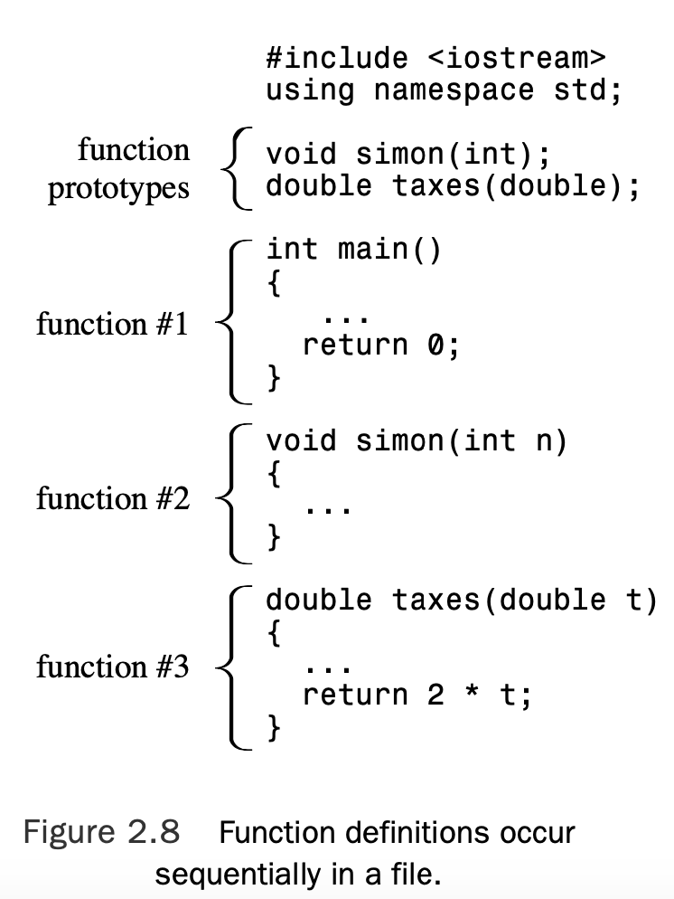

# Chapter 2 Setting Out to C++

[TOC]

## C++ Initiation

``` c++
// myfirst.cpp -- displays a message

#include <iostream>                           // a PREPROCESSOR directive
int main()                                    // function header
{                                             // start of function body
    using namespace std;                      // make definitions visible
    cout << "Come up and C++ me some time.";  // message
    cout << endl;                             // start a new line
    cout << "You won’t regret it!" << endl;   // more output
    return 0;                                 // terminate main()
}                                             // end of function body
```

### Features of the `main()` Function

Stripped of the trimmings, the sample program shown in Listing 2.1 has the following

fundamental structure:

```c++
int main()
{
    statements
    return 0;
}
```

These lines state that there is a function called main(), and they describe how the function behaves.Together they constitute a **function definition**.

This definition has two parts: the first line, `int main()`, which is called the **function header**, and the portion enclosed in braces (`{` and `}`), which is the **function body**. Figure 2.1 shows the main() function.


In C++ each complete instruction is called a **statement**.You must terminate each statement with a **semicolon**, so don’t omit the semicolons when you type the examples.

The final statement in `main()`, called a **return statement**, terminates the function.

### The Function Header as an Interface

In general, a C++ function is activated, or *called*, by another function, and the function header describes the interface between a function and the function that calls it.

The part preceding the function name is called the *function return type*; it describes information flow from a function back to the function that calls it.

The part within the parentheses follow- ing the function name is called the **argument list** or **parameter list**; it describes information flow from the calling function to the called function.

Consider the interface description for main(), beginning with the int part. A C++ function called by another function can return a value to the activating (calling) function. That value is called a **return value**. In this case, main() can return an integer value, as indi- cated by the keyword int.

You can also use this variant:

```C++
int main(void) // very explicit style
```

Using the keyword void in the parentheses is an explicit way of saying that the func- tion takes no arguments.

If the com- piler reaches the end of main() without encountering a return statement, the effect will be the same as if you ended main() with this statement:

```c++
return 0;
```

 This implicit return is provided only for `main()` and not for any other function.

### Why `main()` by Any Other Name Is Not the Same

When you run a C++ program, execution always begins at the beginning of the `main()` function.Therefore, if you don’t have `main()`, you don’t have a complete program, and the compiler points out that you haven’t defined a `main()` function.

There are exceptions. For example, in Windows programming you can write a dynamic link library (DLL) module. Because a DLL module is not a standalone program, it doesn’t need a `main()`. Programs for special- ized environments, such as for a controller chip in a robot, might not need a `main()`.

### C++ Comments

The double slash (//) introduces a C++ comment.A **comment** is a remark from the pro- grammer to the reader that usually identifies a section of a program or explains some aspect of the code. The compiler ignores comments.

C++ also recognizes C comments, which are enclosed between `/*` and `*/` symbols:

```c
#include <iostream> /* a C-style comment */
```

### The C++ Preprocessor and the `iostream` File 

If your program is to use the usual C++ input or output facilities, you provide these two lines:

```C++
#include <iostream>
using namespace std;
```

There are some alternatives to using the second line.

C++, like C, uses a **preprocessor**.This is a program that processes a source file before the main compilation takes place. 

The `io` in `iostream` refers to **input**, which is information brought into the program, and to **output**, which is information sent out from the program. C++’s input/output scheme involves several definitions found in the iostream file.

### Header FIlenames

Files such as iostream are called **include files** (because they are included in other files) or **header files** (because they are included at the beginning of a file). 

Now the h extension is reserved for the old C header files (which C++ programs can still use), whereas C++ header files have no extension. There are also C header files that have been converted to C++ header files. These files have been renamed by dropping the h extension (making it a C++-style name) and prefixing the filename with a c (indicating that it comes from C). For example, the C++ version of `math.h` is the `cmath` header file.


In view of the C tradition of using different filename extensions to indicate different file types, it appears reasonable to have some special extension, such as `.hpp` or `.hxx`, to indicate C++ header files.

### Namespaces

If you use iostream instead of iostream.h, you should use the following namespace directive to make the definitions in iostream available to your program:

```c++
using namespace std;
```

Namespace support is a C++ feature designed to simplify the writing of large pro- grams and of programs that combine pre-existing code from several vendors and to help organize programs. 

One potential problem is that you might use two prepackaged prod- ucts that both have, say, a function called `wanda()`. If you then use the `wanda()` function, the compiler won’t know which version you mean.The namespace facility lets a vendor package its wares in a unit called a *namespace* so that you can use the name of a namespace to indicate which vendor’s product you want.

The fol- lowing line means you can use names defined in the std namespace without using the `std::` prefix:

```c++
using namespace std;
```

This `using` directive makes all the names in the `std` namespace available. The preferred approaches are to use the `std::` qualifier or to use something called a `using` declaration to make just particular names available:

```c++
using std::cout;	// make cout available
using std::endl;	// make endl available
using std::cin;		// make cin available  
```

If you use these directives instead of the following, you can use `cin` and `cout` without attaching `std::` to them:

```c++
using namespace std; // lazy approach, all names available
```

### C++ Output with `cout`

The `myfirst.cpp` program uses the following C++ statement:

```c++
cout << "Come up and C++ me some time.";
```

In C++, any series of characters enclosed in double quotation marks is called a **character string**, presumably because it consists of several characters strung together into a larger unit.The `<<` notation indicates that the statement is sending the string to `cout`; the symbols point the way the information flows. And what is `cout`? It’s a predefined object that knows how to display a variety of things, including strings, numbers, and individual characters. 

If `string` represents a string, you can do the following to display it:

```c++
cout << string;
```

Consider the following statement (note the terminating semicolon):

```c++
cout << "Come up and C++ me some time.";
```

It inserts the string “Come up and C++ me some time.” into the output stream.Thus, rather than say that your program displays a message, you can say that it inserts a string into the output stream.

### The Manipulator `endl`

```c++
cout << endl;
```

`endl` is a special C++ notation that represents the important concept of beginning a new line.

Like `cout`, `endl` is defined in the `iostream` header file and is part of the `std` namespace.

### The Newline Character

C++ has another, more ancient, way to indicate a new line in output—the C notation \n:

```c++
cout << "What’s next?\n"; // \n means start a new line
```

### C++ Source Code Formatting

In C++, the semicolon marks the end of each statement.This leaves C++ free to treat the carriage return in the same way as a space or a tab. This means you can spread a single statement over several lines or place several statements on one line. For example, you could reformat myfirst.cpp as follows:

```c++
#include <iostream> int
main
() { using
namespace std; cout
<<
"Come up and C++ me some time."
; cout <<
endl; cout <<
"You won’t regret it!" << endl;return 0; }
```

This is visually ugly but valid code.

In particular, in C and C++ you can’t put a space, tab, or carriage return in the middle of an element such as a name, nor can you place a carriage return in the middle of a string. Here are examples of what you can’t do:

```c++
int ma in() // INVALID -- space in name 
re
turn 0; // INVALID -- carriage return in word
cout << "Behold the Beans
of Beauty!"; // INVALID -- carriage return in string
```

### Tokens and White Space in Source Code

The indivisible elements in a line of code are called **tokens** (see Figure 2.3).Generally, you must separate one token from the next with a space, tab, or carriage return, which collec- tively are termed **white space**.


```c++
return0; 				// INVALID, must be return 0;
return(0);		 	// VALID, white space omitted
return (0); 		// VALID, white space used
intmain(); 			// INVALID, white space omitted
int main() 			// VALID, white space omitted in () 
int main ( )		// ALSO VALID, white space used in ( )
```

### C++ Source Code Style

Most programmers use styles similar to that of Listing 2.1, which observes these rules:

* One statement per line
* An opening brace and a closing brace for a function, each of which is on its own line 
* Statements in a function indented from the braces
* No whitespace around the parentheses associated with a function name

## C++ Statements

A C++ program is a collection of functions, and each function is a collection of statements. Listing 2.2 provides two new kinds of statements. First, a **declaration statement** creates a variable. Second,an **assignment statement** provides a value for that variable.

```c++
// carrots.cpp -- food processing program
// uses and displays a variable 

#include <iostream>

int main()
{
    using namespace std; 
  
    int carrots;					// declare an integer variable
  
    carrots = 25;					// assign a value to the variable
    cout << "I have ";
    cout << carrots;			// display the value of the variable
    cout << " carrots.";
    cout << endl;
    carrots = carrots - 1; // modify the variable
    cout << "Crunch, crunch. Now I have " << carrots << " carrots." << endl;
  	return 0;
}
```

A blank line separates the declaration from the rest of the program.

### Declaration Statements and Variables

To store an item of information in a computer, you must identify both the storage location and how much memory storage space the information requires. One relatively painless way to do this in C++ is to use a **declaration statement** to indicate the type of storage and to provide a label for the location.

```c++
int carrots;
```

This statement provides two kinds of information:

*  the type of memory storage needed and
*  a label to attach to that storage. 

In general, then, a **declaration** indicates the type of data to be stored and the name the program will use for the data that’s stored there. In this particular case, the program creates a variable called carrots in which it can store an integer (see Figure 2.4).


> The C++ style for declaring variables is to declare a variable as close to its first use as possible.

### Assignment Statements

An assignment statement assigns a value to a storage location. For example, the following statement assigns the integer 25 to the location represented by the variable carrots:

```c++
carrots = 25;
```

One unusual feature of C++ (and C) is that you can use the assignment operator serially. For example, the following is valid code:

```c++
int steinway;
int baldwin;
int yamaha;
yamaha = baldwin = steinway = 88;
```

The second assignment statement in Listing 2.2 demonstrates that you can change the value of a variable:

```c++
carrots = carrots - 1;  // modify the variable
```

### A New Trick for `cout`

Listing 2.2 also gives cout a variable whose value is an integer:

```c++
cout << carrots;
```

First, cout replaces carrots with its current numeric value of 25.

Second, it translates the value to the proper output characters.

The main point here is that cout must translate a number in integer form into character form before it can print it.

The intelligent way in which cout behaves stems from C++’s object-oriented features. In essence, the C++ insertion operator (<<) adjusts its behavior to fit the type of data that follows it.This is an example of operator **overloading**.

## More C++ Statements

```c++
// getinfo.cpp -- input and output
#include <iostream>

int main() 
{
    using namespace std;

    int carrots;

    cout << "How many carrots do you have?" << endl;
    cin >> carrots; // C++ input 
    cout << "Here are two more. ";
    carrots = carrots + 2;
// the next line concatenates output
    cout << "Now you have " << carrots << " carrots." << endl;
    return 0;
}
```

### Using `cin`

As the output from Listing 2.3 demonstrates, the value typed from the keyboard (12) is

eventually assigned to the variable carrots.The following statement performs that wonder:

```c++
cin >> carrots;
```

The `iostream` file defines `cin` as an object that represents this stream. 

Like cout, cin is a smart object. It converts input, which is just a series of characters typed from the keyboard, into a form acceptable to the variable receiving the information.

### Concatenating with `cout`

The second new feature of getinfo.cpp is combining four output statements into one.

```c++
cout << "Now you have " << carrots << " carrots." << endl;
```

### `cin` and `cout` : A touch of Class

A **class** is a data type the user defines.To define a class, you describe what sort of infor- mation it can represent and what sort of actions you can perform with that data.

> The class describes all the properties of a data type, including actions that can be per- formed with it, and an object is an entity created according to that description.


## Functions

C++ functions come in two varieties: those with return values and those without them.You can find examples of each kind in the standard C++ library of functions, and you can create your own functions of each type.

### Using a Function That Has a Return Value

A function that has a return value produces a value that you can assign to a variable or use in some other expression.

```c++
x = sqrt(6.25); // returns the value 2.5 and assigns it to x
```

The expression sqrt(6.25) invokes, or **calls**, the sqrt() function.The expression sqrt(6.25) is termed a **function call**, the invoked function is termed the **called function**, and the function containing the function call is termed the **calling function** (see Figure 2.6).


The value in the parentheses (6.25, in this example) is information that is sent to the function; it is said to be *passed* to the function. A value that is sent to a function this way is called an *argument* or *parameter* (see Figure 2.7).


The sqrt() function calculates the answer to be 2.5 and sends that value back to the calling function; the value sent back is termed the *return value* of the function. An argument is information sent to the function, and the return value is a value sent back from the function.

> A C++ program should provide a prototype for each function used in the program.

A function prototype does for functions what a variable declaration does for variables: It tells what types are involved. For example, the C++ library defines the sqrt() function to take a number with (potentially) a fractional part (like 6.25) as an argument and to return a number of the same type.

```c++
double sqrt(double); // function prototype
```

The initial double means sqrt() returns a type double value.The double in the parentheses means sqrt() requires a double argument. So this prototype describes sqrt() exactly as used in the following code:

```c++
double x; // declare x as a type double variable 
x = sqrt(6.25);
```

If you omit the semicolon, the compiler inter- prets the line as a function header and expects you to follow it with a function body that defines the function.

When you use sqrt() in a program, you must also provide the prototype.You can do this in either of two ways:

* You can type the function prototype into your source code file yourself.
* You can include the cmath (math.h on older systems) header file, which has the prototype in it.

The second way is better because the header file is even more likely than you to get the prototype right. Every function in the C++ library has a prototype in one or more header files.

Don’t confuse the function prototype with the function definition:

* The prototype, as you’ve seen, only describes the function interface.That is, it describes the information sent to the function and the information sent back.
* The definition, however, includes the code for the function’s workings.

The library files contain the compiled code for the functions, whereas the header files contain the prototypes.

```c++
// sqrt.cpp -- using the sqrt() function

#include <iostream>
#include <cmath> // or math.h

int main() 
{
    using namespace std;
  
    double area;
    cout << "Enter the floor area, in square feet, of your home: "; 
    cin >> area;
    double side;
    side = sqrt(area);
    cout << "That’s the equivalent of a square " << side
      	 << " feet to the side." << endl; 
    cout << "How fascinating!" << endl;
    return 0;
}
```

Here’s a sample run of the program in Listing 2.4:

```c++
Enter the floor area, in square feet, of your home: 1536 
That’s the equivalent of a square 39.1918 feet to the side. How fascinating!
```

Note that you declare a type double variable by using the same form, or syntax, as when you declare a type int variable:

```c++
type-name variable-name;
```

Type `double` allows the variables `area` and `side` to hold values with decimal fractions, such as `1536.0` and `39.1918`. An apparent integer, such as `1536`, is stored as a real value with a decimal fraction part of `.0` when stored in a type `double` variable. 

C++ also allows you to assign a value to a variable when you create it, so you could also have done this:

```c++
double side = sqrt(area);
```

### Function Variations

Some functions require more than one item of information.These functions use multiple arguments separated by commas.

For example, the math function pow() takes two argu- ments and returns a value equal to the first argument raised to the power given by the second argument. It has this prototype:

```c++
double pow(double, double); // prototype of a function with two arguments
```

If, say, you wanted to find $5^8$ (5 to the eighth power), you would use the function like this:

```c++
answer = pow(5.0, 8.0); // function call with a list of arguments
```

Other functions take no arguments. For example, one of the C libraries (the one associated with the cstdlib or the stdlib.h header file) has a `rand()` function that has no arguments and that returns a random integer. Its prototype looks like this:

```c++
int rand(void); // prototype of a function that takes no arguments
```

The keyword void explicitly indicates that the function takes no arguments. If you omit void and leave the parentheses empty, C++ interprets this as an implicit declaration that there are no arguments.You could use the function this way:

```c++
myGuess = rand(); // function call with no arguments
```

Note that unlike some computer languages, in C++ you must use the parentheses in the function call even if there are no arguments.

There also are functions that have no return value. You indicate this in the prototype by using the keyword `void` for the return type:

```c++
void bucks(double); // prototype for function with no return value
```

Because `bucks()` doesn’t return a value, you can’t use this function as part of an assignment statement or of some other expression. Instead, you have a pure function call statement:

```c++
bucks(1234.56); // function call, no return value
```

### User-Defined Functions

The standard C library provides more than 140 predefined functions. as with a library function, you must provide a function prototype before using the function, which you typically do by placing the prototype above the `main()` definition. The simplest way is to place the code in the same file after the code for `main()`.

```c++
// ourfunc.cpp -- defining your own function 
#include <iostream>
void simon(int);    // function prototype for simon()

int main()
{
    using namespace std;
    simon(3);   		// call the simon() function
    cout << "Pick an integer: "; 
    int count;
    cin >> count;
    simon(count);   // call it again
    cout << "Done!" << endl;
    return 0;
}

void simon(int n)   // define the simon() function
{
    using namespace std;
    cout << "Simon says touch your toes " << n << " times." << endl;
}                   // void functions don’t need return statements
```

This results in the user input appearing on the same line as the prompt. Here is a sample run of the program in Listing 2.5:

```c++
Simon says touch your toes 3 times. 
Pick an integer: 512
Simon says touch your toes 512 times. 
Done!
```

### Function Form

First, there is a function header.Then, enclosed in braces, comes the function body.You can generalize the form for a function definition as follows:

```c++
type functionname(argumentlist) 
{
    statements
}
```

Each function definition stands separately from all others; all functions are created equal (see Figure 2.8).



### Function Headers

The `simon()` function in Listing 2.5 has this header: 

```c++
void simon(int n)
```

The initial void means that `simon()` has no return value. 

Thus, the first function call looks like this:

```c++
simon(3); 					// ok for void functions
```

Because poor simon() lacks a return value, you can’t use it this way:

```c++
simple = simon(3); 	// not allowed for void functions
```

The initial int means that `main()` returns an integer value.The empty parentheses (which optionally could contain `void`) means that `main()` has no arguments. Functions that have return values should use the keyword `return` to provide the return value and to terminate the function.That’s why you’ve been using the following statement at the end of `main()`:

```c++
return 0;
```

So `main()`’s return value is returned not to another part of the program but to the operating system. Many operating systems can use the program’s return value. 

The normal convention is that an exit value of zero means the program ran successfully, whereas a nonzero value means there was a problem.

### Using a User-Defined Function That Has a Return Value

One stone is 14 pounds, and the program in Listing 2.6 uses a function to make this conversion.

```c++
// convert.cpp -- converts stone to pounds 
#include <iostream>
int stonetolb(int); 		// function prototype 
int main()
{
		using namespace std;
		int stone;
		cout << "Enter the weight in stone: "; 
  	cin >> stone;
		int pounds = stonetolb(stone);
		cout << stone << " stone = ";
		cout << pounds << " pounds." << endl; 
  	return 0;
}

int stonetolb(int sts) 
{
		return 14 * sts;
}
```

Here’s a sample run of the program in Listing 2.6:

```c++
Enter the weight in stone: 15 
15 stone = 210 pounds.
```

Programmers sometimes describe functions as **black boxes** (a term from electronics) specified by the flow of information into and out of them.The function prototype perfectly portrays that point of view (see Figure 2.9).


The `stonetolb()` function is short and simple, yet it embodies a full range of functional features:

* It has a header and a body. 
* It accepts an argument.
* It returns a value.
* It requires a prototype.

### Placing the `using` Directive in Multifunction Programs

Notice that Listing 2.5 places a `using` directive in each of the two functions:

```c++
using namespace std;
```

This is because each function uses cout and thus needs access to the cout definition from the std namespace.

There’s another way to make the std namespace available to both functions in Listing 2.5, and that’s to place the directive outside and above both functions:

```c++
// ourfunc1.cpp -- defining your own function 
#include <iostream>
using namespace std;	// affects all function definitions in this file
void simon(int);

int main()
{
    simon(3);
    cout << "Pick an integer: "; 
    int count;
    cin >> count;
    simon(count);
    cout << "Done!" << endl;
    return 0;
}

void simon(int n)
{
    using namespace std;
    cout << "Simon says touch your toes " << n << " times." << endl;
}
```

The current prevalent philosophy is that it’s preferable to be more discriminating and limit access to the std namespace to only those functions that need access. 

Thus, the using directive is placed inside the `main()` function only, limiting std namespace access to just that function.

* You can place the following above the function definitions **in a file**, making all the contents of the std namespace available to every function in the file:
```c++
using namespace std;
```
* You can place the following **in a specific function definition**, making all the contents of the std namespace available to that specific function:
* Instead of using
```c++
using namespace std;
```
​	you can place `using` declarations like the following in a specific function definition and make a particular element, such as `cout`, available to that function:

 ```c++
using std::cout;
 ```
* You can omit the `using` directives and declarations entirely and use the` std::` prefix whenever you use elements from the std namespace:
```c++
std::cout << "I’m using cout and endl from the std namespace" << std::endl;
```