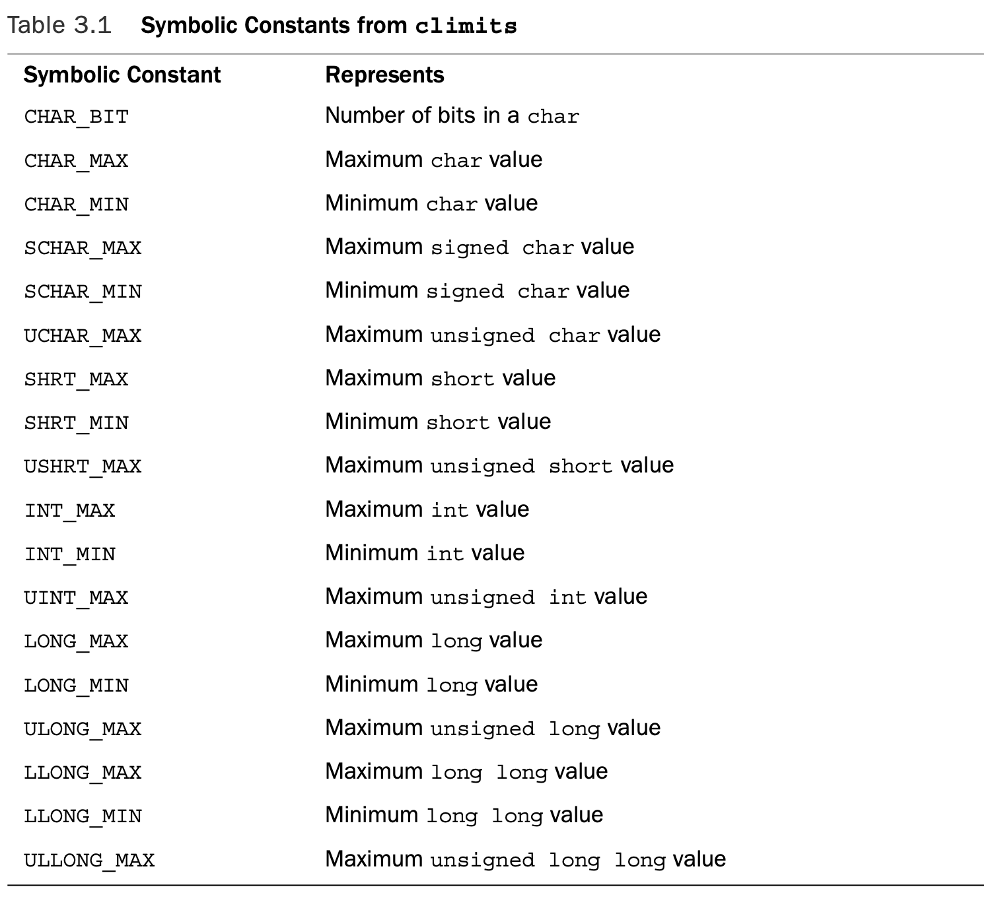
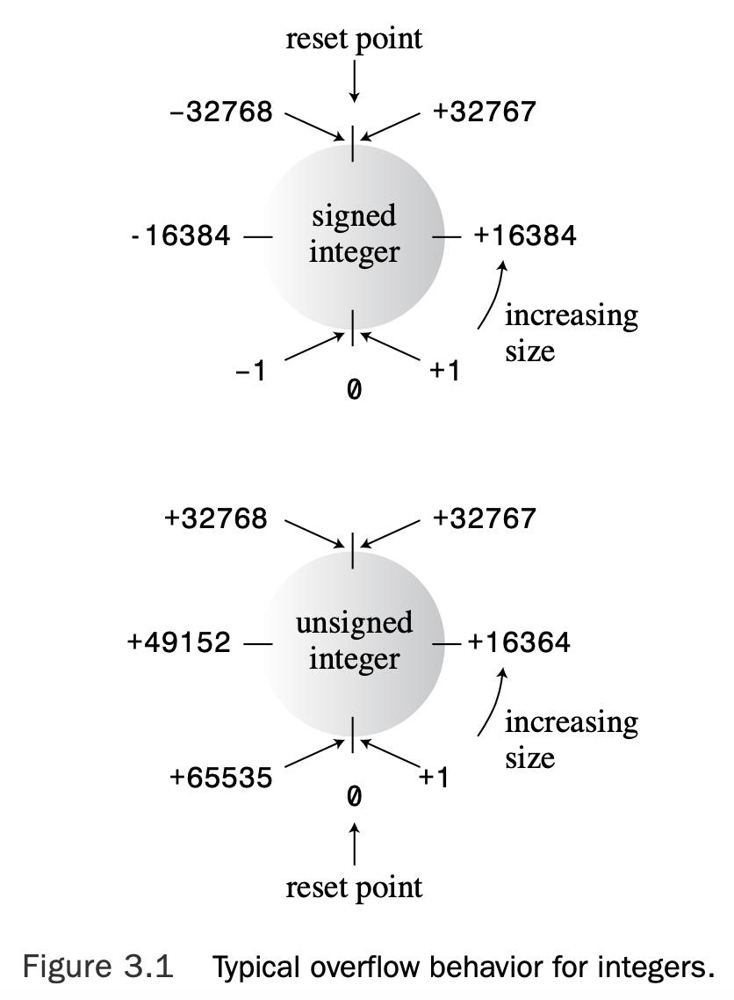
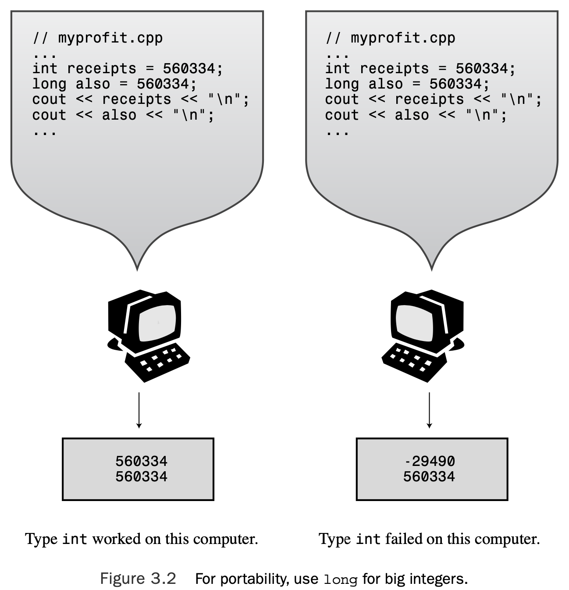
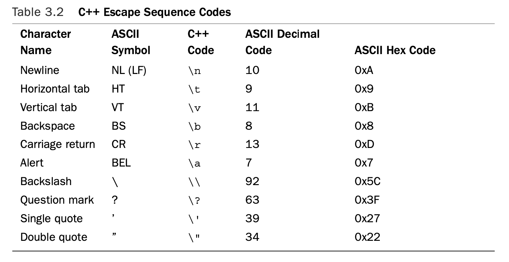
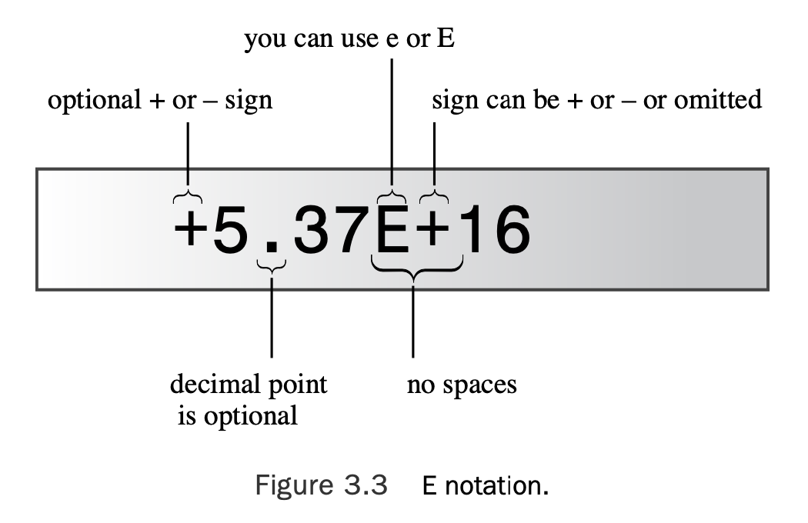
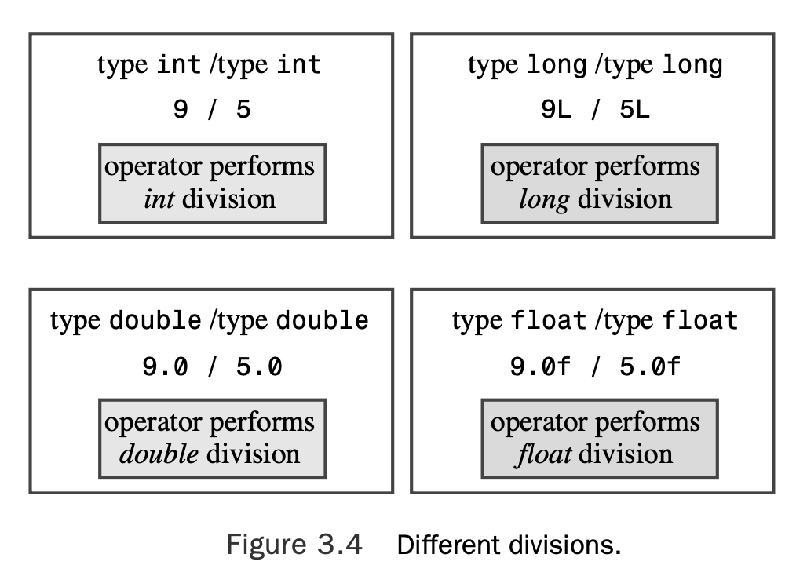
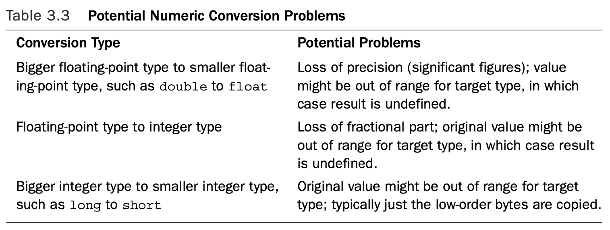

# Chapter 3 Dealing with Data

[TOC]

## Simple Variables

To store an item of information in a computer, the program must keep track of three funda- mental properties:

* Where the information is stored
* What value is kept there 
* What kind of information is stored

For example, suppose Chief Lab Assistant Igor uses the following statements:

```c++
int braincount; 
braincount = 5;
```

In essence, the program locates a chunk of memory large enough to hold an integer, notes the location, and copies the value 5 into the location. These statements don’t tell you (or Igor) where in memory the value is stored, but the program does keep track of that information, too. Indeed, you can use the `&` operator to retrieve `braincount`’s address in memory.

### Names for Variables

C++ encourages you to use meaningful names for variables. You do have to follow a few simple C++ naming rules:

* The only characters you can use in names are alphabetic characters, numeric digits, and the underscore (_) character.
* The first character in a name cannot be a numeric digit.
* Uppercase characters are considered distinct from lowercase characters.
* You can’t use a C++ keyword for a name.
* Names beginning with two underscore characters or with an underscore character followed by an uppercase letter are reserved for use by the implementation—that is, the compiler and the resources it uses. Names beginning with a single underscore character are reserved for use as global identifiers by the implementation.
* C++ places no limits on the length of a name, and all characters in a name are sig- nificant. However, some platforms might have their own length limits.

Here are some valid and invalid C++ names:

```c++
int poodle;			// valid
int Poodle;			// valid and distinct from poodle
int POODLE;			// valid and even more distinct
Int terrier;		// invalid -- has to be int, not Int
int my_stars3		// valid
int _Mystars3;	// valid but reserved -- starts with underscore
int 4ever;			// invalid because starts with a digit
int double;			// invalid -- double is a C++ keyword
int begin;			// valid -- begin is a Pascal keyword
int __fools;		// valid but reserved -- starts with two underscores
int the_very_best_variable_i_can_be_version_112; // valid 
int honky-tonk; // invalid -- no hyphens allowed
```

> As with function names, the C++ compiler doesn’t care about your vari- able names as long as they satisfy the rules, but a consistent, precise personal naming con- vention will serve you well.
>
> For instance, the integer `myWeight` might be named `nMyWeight`; here, the `n` prefix is used to represent an integer value, which is useful when you are reading code and the definition of the variable isn’t immediately at hand. 
>
> Other prefixes are commonly used in like fashion: `str` or `sz` might be used to represent a null-terminated string of characters, `b` might represent a Boolean value, `p` a pointer, `c` a single character.

### Integer Types

**Integers** are numbers with no fractional part, such as 2, 98, –5286, and 0.

The various C++ integer types differ in the amount of memory they use to hold an integer. The usual term for describing the amount of memory used for an integer is **width**.The more memory a value uses, the wider it is. 

C++’s basic integer types, in order of increasing width, are `char`, `short`, `int`, `long`, and, with C++11, `long long`. 

### The `short`, `int`, `long`, and `long long` Integer Types

By using different numbers of bits to store values, the C++ types `short`, `int`, `long`, and `long long` can represent up to four different integer widths. C++ offers a flexible standard with some guaranteed minimum sizes, which it takes from C. Here’s what you get:

* A `short` integer is at least 16 bits wide.
* An `int` integer is at least as big as `short`.
* A `long` integer is at least 32 bits wide and at least as big as `int`.
* A `long long` integer is at least 64 bits wide and at least as big as `long`.

You use these type names to declare variables just as you would use `int`:

```c++
short score; 						// creates a type short integer variable
int temperature; 				// creates a type int integer variable
long position;					// creates a type long integer variable
```

The four types—int, short, long, and long long—are signed types, meaning each splits its range approximately equally between positive and negative values. For example, a 16-bit int might run from –32,768 to +32,767.

First, the `sizeof` operator returns the size, in bytes, of a type or a variable.

Second, the `climits` header file (or, for older implementations, the `limits.h` header file) contains information about integer type limits. 

```c++
// limits.cpp -- some integer limits 
#include <iostream>
 #include <climits> 						// use limits.h for older systems
int main()
{
    using namespace std;
    int n_int = INT_MAX;						// initialize n_int to max int value
    short n_short = SHRT_MAX; 			// symbols defined in climits file
    long n_long = LONG_MAX;
    long long n_llong = LLONG_MAX;

    // sizeof operator yields size of type or of variable
    cout << "int is " << sizeof (int) << " bytes." << endl;
    cout << "short is " << sizeof n_short << " bytes." << endl; 
    cout << "long is " << sizeof n_long << " bytes." << endl;
    cout << "long long is " << sizeof n_llong << " bytes." << endl; 
    cout << endl;

    cout << "Maximum values:" << endl; 
    cout << "int: " << n_int << endl; 
    cout << "short: " << n_short << endl;
    cout << "long: " << n_long << endl;
    cout << "long long: " << n_llong << endl << endl;

    cout << "Minimum int value = " << INT_MIN << endl; 
    cout << "Bits per byte = " << CHAR_BIT << endl; 
    return 0;
}
```

Here is sample output from the program in Listing 3.1:

```c++
int is 4 bytes. 
short is 2 bytes. 
long is 4 bytes.
long long is 8 bytes.

Maximum values:
int: 2147483647
short: 32767
long: 2147483647
long long: 9223372036854775807

Minimum int value = -2147483648 
Bits per byte = 8
```

### The `sizeof` Operator and the `climits` Header File

When you use the `sizeof` operator with a type name, such as `int`, you enclose the name in paren- theses. But when you use the operator with the name of the variable, such as `n_short`, parentheses are optional:

```c++
cout << "int is " << sizeof (int) << " bytes.\n";
cout << "short is " << sizeof n_short << " bytes.\n";
```

The compiler manufacturer provides a `climits` file that reflects the values appropriate to that compiler. 



### Initialization

**Initialization** combines assignment with declaration. For example, the following statement declares the `n_int` variable and sets it to the largest possible type `int` value:

```c++
int n_int = INT_MAX;
```

> If you don’t initialize a variable that is defined inside a function, the variable’s value is *indeterminate*. That means the value is whatever happened to be sitting at that memory location prior to the creation of the variable.

### Initialization with C++11

There’s another format for initialization that’s used with arrays and structures but in C++98 can also be used with single-valued variables:

```c++
int hamburgers = {24}; // set hamburgers to 24
```

Using a braced initializer for a single-valued variable hasn’t been particularly common, but the C++11 standard is extending it some ways. First, it can be used with or without the `=` sign:

```c++
int emus{7}; // set emus to 7 
int rheas = {12}; // set rheas to 12
```

Second, the braces can be left empty, in which case the variable is initialized to 0:

```c++
int rocs = {}; // set rocs to 0 
int psychics{}; // set psychics to 0
```

Third, it provides better protection against type conversion errors, a topic we’ll return to near the end of this chapter.

### Unsigned Types

Each of the four integer types you just learned about comes in an unsigned variety that can’t hold negative values.This has the advantage of increasing the largest value the variable can hold.

```c++
// exceed.cpp -- exceeding some integer limits
#include <iostream>
#define ZERO 0 // makes ZERO symbol for 0 value 
#include <climits> // defines INT_MAX as largest int value 
int main()
{
    using namespace std;
    short sam = SHRT_MAX; // initialize a variable to max value 
  	unsigned short sue = sam;// okay if variable sam already defined
  
    cout << "Sam has " << sam << " dollars and Sue has " << sue;
    cout << " dollars deposited." << endl
				 << "Add $1 to each account." << endl << "Now ";
    sam = sam + 1;
  	sue = sue + 1;
    cout << "Sam has " << sam << " dollars and Sue has " << sue;
    cout << " dollars deposited.\nPoor Sam!" << endl;
    sam = ZERO;
    sue = ZERO;
    cout << "Sam has " << sam << " dollars and Sue has " << sue;
    cout << " dollars deposited." << endl;
    cout << "Take $1 from each account." << endl << "Now ";
    sam = sam - 1;
    sue = sue - 1;
    cout << "Sam has " << sam << " dollars and Sue has " << sue;
    cout << " dollars deposited." << endl << "Lucky Sue!" << endl; 
    return 0;
}
```

Here’s the output from the program in Listing 3.2:

```c++
Sam has 32767 dollars and Sue has 32767 dollars deposited.
Add $1 to each account.
Now Sam has -32768 dollars and Sue has 32768 dollars deposited. 
Poor Sam!
Sam has 0 dollars and Sue has 0 dollars deposited.
Take $1 from each account.
Now Sam has -1 dollars and Sue has 65535 dollars deposited. 
Lucky Sue!
```

C++ doesn’t guarantee that signed integer types can exceed their limits (overflow and underflow) without complaint, but that is the most common behavior on current implementations.



### Choosing an Integer Type

**Natural size** refers to the integer form that the computer handles most efficiently. If there is no compelling reason to choose another type, you should use `int`.

This is true even if `int` is 32 bits on your system.That way, if you transfer your program to a system with a 16-bit `int`, your program won’t embarrass you by suddenly failing to work properly (see Figure 3.2).



Suppose that you move your program from a 16-bit int system to a 32-bit int system. That doubles the amount of memory needed to hold an int array, but it doesn’t affect the requirements for a short array. Remember, a bit saved is a bit earned.

### Integer Literals

C++ uses the first digit or two to identify the base of a number constant. 

* If the first digit is in the range 1–9, the number is base 10 (decimal);
* If the first digit is 0 and the second digit is in the range 1–7, the number is base 8 (octal);
* If the first two characters are 0x or 0X, the number is base 16 (hexadecimal).

```c++
// hexoct1.cpp -- shows hex and octal literals 
#include <iostream>
int main()
{
    using namespace std;
    int chest = 42;			// decimal integer literal
    int waist = 0x42; 	// hexadecimal integer literal
    int inseam = 042;		// octal integer literal

    cout << "Monsieur cuts a striking figure!\n";
    cout << "chest = " << chest << " (42 in decimal)\n";
    cout << "waist = " << waist << " (0x42 in hex)\n";
    cout << "inseam = " << inseam << " (042 in octal)\n";
    return 0;
}
```

By default, `cout` displays integers in decimal form, regardless of how they are written in a program, as the following output shows:

```c++
Monsieur cuts a striking figure! 
chest = 42 (42 in decimal) 
waist = 66 (0x42 in hex)
inseam = 34 (042 in octal)
```

By the way, if you want to display a value in hexadecimal or octal form, you can use some special features of `cout`.

 ```c++
// hexoct2.cpp -- display values in hex and octal
#include <iostream>
int main()
{
    using namespace std;
    int chest = 42;
    int waist = 42;
    int inseam = 42;

    cout << "Monsieur cuts a striking figure!" << endl;
    cout << "chest = " << chest << " (decimal for 42)" << endl; 
    cout << hex; // manipulator for changing number base
    cout << "waist = " << waist << " (hexadecimal for 42)" << endl; 
    cout << oct; // manipulator for changing number base
    cout << "inseam = " << inseam << " (octal for 42)" << endl;
    return 0;
}
 ```

### How C++ Decides What Type a Constant Is

C++ stores integer constants as type `int` unless there is a reason to do otherwise.Two such reasons are if you use a special suffix to indicate a particular type or if a value is too large to be an `int`.

First, look at the suffixes.These are letters placed at the end of a numeric constant to indicate the type. An `l` or `L` suffix on an integer means the integer is a type `long` constant, a `u` or `U` suffix indicates an `unsigned int` constant, and `ul` (in any combination of orders and uppercase and lowercase) indicates a type `unsigned long` constant. C++11 provides the `ll` and `LL` suffixes for type `long long`, and `ull`, `Ull`, `uLL`, and `ULL` for unsigned long long.

A decimal integer without a suffix is represented by the smallest of the following types that can hold it:`int`, `long`, or `long long`. 

A hexadecimal or octal integer without a suffix is represented by the smallest of the following types that can hold it:`int`,`unsigned int`,`long`,`unsigned long`,`long long`, or `unsigned long long`.

### The `char` Type: Characters and Small Integers

The `char` type is another integer type. It’s guaranteed to be large enough to represent the entire range of basic symbols—all the letters, digits, punctuation, and the like—for the target computer system. Although `char` is most often used to handle characters, you can also use it as an integer type that is typically smaller than `short`.

```c++
// chartype.cpp -- the char type 
#include <iostream>
int main( )
{
    using namespace std;
    char ch; 				// declare a char variable

    cout << "Enter a character: " << endl;
    cin >> ch;
    cout << "Hola! ";
    cout << "Thank you for the " << ch << " character." << endl; 
    return 0;
}
```

Here’s the output from the program in Listing 3.5:

```c++
Enter a character:
M
Hola! Thank you for the M character.
```

```c++
// morechar.cpp -- the char type and int type contrasted
#include <iostream>
int main()
{
    using namespace std;
    char ch = 'M';      // assign ASCII code for M to ch
    int i = ch;         // store same code in an int
    cout << "The ASCII code for " << ch << " is " << i << endl;

    cout << "Add one to the character code:" << endl;
    ch = ch + 1;
    i = ch;
    cout << "The ASCII code for " << ch << " is " << i << endl;

    // using the cout.put() member function to display a char
    cout << "Displaying char ch using cout.put(ch): "; 
    cout.put(ch);

    // using cout.put() to display a char constant
    cout.put('!');
    
    cout << endl << "Done" << endl;
    return 0;
}
```

Here is the output from the program in Listing 3.6:

```c++
The ASCII code for M is 77
Add one to the character code:
The ASCII code for N is 78
Displaying char ch using cout.put(ch): N!
Done
```

### Program Notes

Because ch is really an integer, you can apply integer operations to it, such as adding 1. This changes the value of ch to 78.

### A Member Function: `cout.put()`

The `cout.put()` function is your first example of an important C++ OOP concept, the **member function**. Remember that a class defines how to represent data and how to manipulate it.A member function belongs to a class and describes a method for manipulating class data.

The `ostream` class, for example, has a `put()` member function that is designed to output characters.

To use a class member function with an object such as cout, you use a period to combine the object name (`cout`) with the function name (`put()`). The period is called the **membership operator**.The notation `cout.put()` means to use the class member function `put()` with the class object `cout`.

### `char` Literals

An ASCII system has the following correspondences:

* 'A' is 65, the ASCII code for A.
* 'a' is 97, the ASCII code for a.
* '5' is 53, the ASCII code for the digit 5.
* ' ' is 32, the ASCII code for the space character.
* '!' is 33, the ASCII code for the exclamation point.

There are some characters that you can’t enter into a program directly from the keyboard. For example, you can’t make the newline character part of a string by pressing the **Enter** key; instead, the program editor interprets that keystroke as a request for it to start a new line in your source code file. 

Other characters have difficulties because the C++ language imbues them with special significance. For example, the **double quotation mark** character delimits string literals, so you can’t just stick one in the middle of a string literal.

C++ has special notations, called **escape sequences**, for several of these characters, as shown in Table 3.2. 



All three of the following move the screen cursor to the beginning of the next line:

```c++
cout << endl; 	// using the endl manipulator
cout << '\n'; 	// using a character constant
cout << "\n";		// using a string
```

You can embed the newline character in a longer string; this is often more convenient than using `endl`. When you’re displaying a number, endl is a bit easier to type than "\n" or '\n', but when you’re displaying a string, ending the string with a newline character requires less typing:

```c++
cout << x << endl; // easier than cout << x << "\n";
cout << "Dr. X.\n"; // easier than cout << "The Dr. X." << endl;
```

Finally, you can use escape sequences based on the octal or hexadecimal codes for a character.  or example, `Ctrl+Z` has an ASCII code of `26`, which is `032` in octal and `0x1a` in hexadecimal. You can make character constants out of these by enclosing them in single quotes, as in `'\032'`, and you can use them as parts of a string, as in ``"hi\x1a there"``.

```c++
// bondini.cpp -- using escape sequences 
#include <iostream>
int main()
{
    using namespace std;
    cout << "\aOperation \"HyperHype\" is now activated!\n"; 
    cout << "Enter your agent code:________\b\b\b\b\b\b\b\b"; 
    long code;
    cin >> code;
    cout << "\aYou entered " << code << "...\n";
    cout << "\aCode verified! Proceed with Plan Z3!\n"; 
    return 0;
}
```

> Some systems might behave differently, displaying the `\b` as a small rectangle rather than backspacing, for example, or perhaps erasing while backspacing, perhaps ignoring `\a`.

When you start the program in Listing 3.7, it puts the following text onscreen:

```c++
Operation "HyperHype" is now activated! 
Enter your agent code:________
```

After printing the underscore characters, the program uses the backspace character to back up the cursor to the first underscore.You can then enter your secret code and con- tinue. Here’s a complete run:

```c++
Operation "HyperHype" is now activated! 
Enter your agent code:42007007
You entered 42007007...
Code verified! Proceed with Plan Z3!
```

### Universal Character Names

There is a basic execution character set, which includes characters that can be processed during the execution of a program. C++ has a mechanism for representing such international characters that is independent of any par- ticular keyboard: the use of **universal character names**.

Using universal character names is similar to using escape sequences.A universal char- acter name begins either with `\u` or `\U`. If your implementation supports extended characters, you can use universal character names in identifiers, as character constants, and in strings. For example, consider the following code:

```c++
int k\u00F6rper;
cout << "Let them eat g\u00E2teau.\n";
```

The ISO 10646 code point for `ö` is `00F6`, and the code point for `â` is `00E2`.Thus, this C++ code would set the variable name to `körper` and display the following output:

```c++
Let them eat gâteau.
```

Your source code can use the same universal code name on all systems, and the compiler will then represent it by the appro- priate internal code used on the particular system.

> So far Unicode represents more than 109,000 symbols and more than 90 scripts, and it is still under development. If you want to know more, you can check the Unicode Consortium’s website, at www.unicode.org.

### `signed char` and `unsigned char`

Unlike `int`, `char` is not signed by default. Nor is it unsigned by default.The choice is left to the C++ implementation in order to allow the compiler developer to best fit the type to the hardware properties. If it is vital to you that char has a particular behavior, you can use signed char or unsigned char explicitly as types:

```c++
char fodo; 								// may be signed, may be unsigned
unsigned char bar; 				// definitely unsigned
signed char snark;				// definitely signed
```

### For When You Need More: `wchar_t`

The usual 8-bit `char` can represent the basic character set, and another type, called `wchar_t`, can represent the extended character set.

The `iostream` header file provides parallel facilities in the form of `wcin` and `wcout` for handling `wchar_t` streams. Also you can indicate a wide-character constant or string by preceding it with an `L`. 

### New C++11 Types: `char16_t` and `char32_t`

Encoding characters and strings of characters on a computer system is more complex than just using the Unicode numeric values (called code points). C++11 introduces the types `char16_t`, which is unsigned and 16 bits, and `char32_t`, which is unsigned and 32 bits. C++11 uses the `u` prefix for `char16_t` character and string constants, as in `u'C'` and `u"be good"`. Similarly, it uses the `U` prefix for `char32_t` constants, as in `U'R'` and `U"dirty rat"`. The prefixes `u` and `U` are used to indicate character literals of types `char16_t` and `char32_t`, respectively:

```c++
char16_t ch1 = u'q'; // basic character in 16-bit form char32_t 
ch2 = U'\U0000222B'; // universal character name in 32-bit form
```

### The `bool` Type

It’s named in honor of the English mathematician **George Boole**, who developed a mathe- matical representation of the laws of logic. In computing, a **Boolean variable** is one whose value can be either `true` or `false`. 

The literals `true` and `false` can be converted to type `int` by promotion, with `true` converting to `1` and `false` to `0`.

Any nonzero value converts to `true`, whereas a zero value converts to `false`.

## The `const` Qualifier

After you initialize a constant such as `Months`, its value is set.The compiler does not let you subsequently change the value `Months`. If you try to, for example, g++ gives an error message that the program used an assignment of a read-only variable.

A common practice is to capitalize the first character in a name to help remind your- self that Months is a constant. Another convention is to make all the characters uppercase; this is the usual convention for constants created using `#define`.Yet another convention is to begin constant names with the letter `k`, as in `kmonths`. 

The general form for creating a constant is this:

```c++
const type name = value;
```

* For one thing, it lets you specify the type explicitly. 

* Second, you can use C++’s scoping rules to limit the defi- nition to particular functions or files. 

* Third, you can use const with more elaborate types, such as arrays and structures, as discussed in Chapter 4.

## Floating-Point Numbers

With floating-point types, you can represent numbers such as 2.5 and 3.14159 and 122442.32—that is, numbers with fractional parts. A computer stores such values in two parts. One part represents a value, and the other part scales that value up or down.  The main points are that floating-point numbers let you represent fractional, very large, and very small values, and they have internal representations much different from those of integers.

### Writing Floating-Point Numbers

C++ has two ways of writing floating-point numbers.The first is to use the standard deci- mal-point notation you’ve been using much of your life:

```c++
12.34 		// floating-point 
939001.32 // floating-point 
0.00023 	// floating-point
8.0 			// still floating-point
```

The second method for representing floating-point values is called E notation, and it looks like this: `3.45E6`. This means that the value 3.45 is multiplied by 1,000,000; the E6 means 10 to the 6th power, which is 1 followed by 6 zeros. Here are more examples:

```c++
2.52e+8 					// can use E or e, + is optional 
8.33E-4 					// exponent can be negative
7E5 							// same as 7.0E+05
-18.32e13					// can have + or - sign in front 
1.69e12 					// 2010 Brazilian public debt in reais 
5.98E24 					// mass of earth in kilograms 
9.11e-31 					// mass of an electron in kilograms
```

Note that you can use either E or e, and the exponent can have a posi- tive or negative sign (see Figure 3.3). However, you can’t have spaces in the number, so, for example, `7.2 E6` is invalid.



### Floating-Point Types

Like ANSI C, C++ has three floating-point types: `float`, `double`, and `long double`.

Typically `float` is 32 bits, `double` is 64 bits, and `long double` is 80, 96, or 128 bits. Also the range in exponents for all three types is at least –37 to +37.

The program previews an `ostream` method called `setf()` from Chapter 17, “Input, Output, and Files.” This particular call forces output to stay in fixed-point notation so that you can better see the precision. It prevents the program from switching to E notation for large values and causes the program to display six digits to the right of the decimal. The arguments `ios_base::fixed` and `ios_base::floatfield` are constants provided by including `iostream`.

```c++
// floatnum.cpp -- floating-point types 
#include <iostream>
int main()
{
    using namespace std;
    cout.setf(ios_base::fixed, ios_base::floatfield); // fixed-point 
    float tub = 10.0 / 3.0; // good to about 6 places
    double mint = 10.0 / 3.0; // good to about 15 places
    const float million = 1.0e6;

    cout << "tub = " << tub;
    cout << ", a million tubs = " << million * tub; 
    cout << ",\nand ten million tubs = ";
    cout << 10 * million * tub << endl;

    cout << "mint = " << mint << " and a million mints = "; 
    cout << million * mint << endl;
    return 0;
}
```

Here is the output from the program in Listing 3.8:

```c++
tub = 3.333333, a million tubs = 3333333.250000,
and ten million tubs = 33333332.000000
mint = 3.333333 and a million mints = 3333333.333333
```

### Floating-Point Constants

By default, floating-point constants such as 8.24 and 2.4E8 are type `double`. If you want a constant to be type `float`, you use an `f` or `F` suffix. For type `long double`, you use an `l` or `L` suffix. 

```c++
1.234f // a float constant 
2.45E20F // a float constant 
2.345324E28 // a double constant 
2.2L // a long double constant
```

### Advantages and Disadvantages of Floating-Point Numbers

Floating-point numbers have two advantages over integers. 

* First, they can represent values between integers. 
* Second, because of the scaling factor, they can represent a much greater range of values. 
* On the other hand, floating point operations usually are slightly slower than integer operations, and you can lose precision. 

```c++
// fltadd.cpp -- precision problems with float 
#include <iostream>
int main()
{
    using namespace std; 
    float a = 2.34E+22f; 
    float b = a + 1.0f;

    cout << "a = " << a << endl;
    cout << "b - a = " << b - a << endl; 
    return 0;
}
```

Here is the output from the program in Listing 3.9 for one system:

```c++
a = 2.34e+022 
b-a= 0
```

By adding 1, you are attempting to add 1 to the 23rd digit in that number. But type float can represent only the first 6 or 7 digits in a number, so trying to change the 23rd digit has no effect on the value.

> C++ brings some order to its basic types by classifying them into families. Types `signed char`, `short`, `int`, and `long` are termed **signed integer** types. C++11 adds `long long` to that list. The unsigned versions are termed **unsigned integer** types. 
>
> The `bool`, `char`, `wchar_t`, signed integer, and unsigned integer types together are termed *integral* types or *integer* types. C++11 adds `char16_t` and `char32_t` to that list. 
>
> The `float`, `double`, and `long double` types are termed **floating-point** types. Integer and floating-point types are collectively termed **arithmetic** types.

## C++ Arithmetic Operators

C++ uses operators to do arithmetic. It provides operators for five basic arithmetic calculations: **addition, subtraction, multiplication, division, and taking the modulus**. 

Each of these operators uses two values (called **operands**) to calculate a final answer.Together, the operator and its operands constitute an *expression*. For example, consider the following statement:

```c++
int wheels = 4 + 2;
```

The values 4 and 2 are operands, the + symbol is the addition operator, and 4 + 2 is an expression whose value is 6.

Here are C++’s five basic arithmetic operators:

* The `+` operator adds its operands.
* The `-` operator subtracts the second operand from the first.
* The `*` operator multiplies its operands.
* The `/ `operator divides its first operand by the second. If both operands are integers, the result is the integer portion of the quotient.
* The `%` operator finds the modulus of its first operand with respect to the second. That is, it produces the remainder of dividing the first by the second. Both operands must be integer types; using the % operator with floating-point values causes a compile-time error. If one of the operands is negative, the sign of the result satisfies the following rule: (a/b)*b + a%b equals a.

```c++
// arith.cpp -- some C++ arithmetic 
#include <iostream>
int main()
{
    using namespace std; 
    float hats, heads;

    cout.setf(ios_base::fixed, ios_base::floatfield); // fixed-point 
    cout << "Enter a number: ";
    cin >> hats;
    cout << "Enter another number: ";
    cin >> heads;

    cout << "hats = " << hats << "; heads = " << heads << endl;
    cout << "hats + heads = " << hats + heads << endl;
    cout << "hats - heads = " << hats - heads << endl;
    cout << "hats * heads = " << hats * heads << endl;
    cout << "hats / heads = " << hats / heads << endl;
    return 0;
} 
```

As you can see in the following sample output from the program in Listing 3.10, you can trust C++ to do simple arithmetic:

```c++
Enter a number: 50.25
Enter another number: 11.17
hats = 50.250000; heads = 11.170000
hats + heads = 61.419998
hats - heads = 39.080002
hats * heads = 561.292480
hats / heads = 4.498657
```

Adding 11.17 to 50.25 should yield 61.42, but the output reports 61.419998.This is not an arithmetic problem; it’s a problem with the limited capacity of type float to represent significant figures. Remember, C++ guar- antees just six significant figures for float. If you round 61.419998 to six figures, you get 61.4200, which is the correct value to the guaranteed precision.The moral is that if you need greater accuracy, you should use `double` or `long double`.

### Order of Operation: Operator Precedence and Associativity

Appendix D,“Operator Precedence,” shows precedence for all the C++ operators. Note that *, /, and % are all in the same row in Appendix D. That means they have equal precedence. Similarly, addition and subtraction share a lower precedence.

Sometimes the precedence list is not enough. Consider the following statement:

```c++
float logs = 120 / 4 * 5; // 150 or 6?
```

Once again, 4 is an operand for two operators. But the / and * operators have the same precedence, so precedence alone doesn’t tell the program whether to first divide 120 by 4 or multiply 4 by 5.

### Division Diversions

If both operands are integers, C++ performs integer division. If one or both operands are floating-point values, the fractional part is kept, making the result floating-point. 

```c++
// divide.cpp -- integer and floating-point division 
#include <iostream>
int main()
{
    using namespace std;
    cout.setf(ios_base::fixed, ios_base::floatfield);
    cout << "Integer division: 9/5 = " << 9 / 5 << endl; 
    cout << "Floating-point division: 9.0/5.0 = ";
    cout << 9.0 / 5.0 << endl;
    cout << "Mixed division: 9.0/5 = " << 9.0 / 5 << endl; 
    cout << "double constants: 1e7/9.0 = ";
    cout << 1.e7 / 9.0 << endl;
    cout << "float constants: 1e7f/9.0f = ";
    cout << 1.e7f / 9.0f << endl;
    return 0;
}
```

Here is the output from the program in Listing 3.11 for one implementation:

```c++
Integer division: 9/5 = 1
Floating-point division: 9.0/5.0 = 1.800000
Mixed division: 9.0/5 = 1.800000
double constants: 1e7/9.0 = 1111111.111111
float constants: 1e7f/9.0f = 1111111.125000
```

The process of using the same symbol for more than one operation is called **operator overloading**. C++ has a few examples of over- loading built in to the language. C++ also lets you extend operator overloading to user- defined classes, so what you see here is a precursor of an important OOP property (see Figure 3.4).



### The Modulus Operator

```c++
// modulus.cpp -- uses % operator to convert lbs to stone 
#include <iostream>
int main()
{
    using namespace std;
    const int Lbs_per_stn = 14; 
    int lbs;
    
    cout << "Enter your weight in pounds: ";
    cin >> lbs;
    int stone = lbs / Lbs_per_stn;      // whole stone
    int pounds = lbs % Lbs_per_stn;     // remainder in pounds 
    cout << lbs << " pounds are " << stone
         << " stone, " << pounds << " pound(s).\n"; 
     return 0;
}
```

Here is a sample run of the program in Listing 3.12:

```c++
Enter your weight in pounds: 181
181 pounds are 12 stone, 13 pound(s).
```

## Type Conversions

With 11 integer types and 3 floating-point types, the computer can have a lot of different cases to handle, especially if you start mixing types.To help deal with this potential mishmash, C++ makes many type conversions automatically:

* C++ converts values when you assign a value of one arithmetic type to a variable of another arithmetic type.
* C++ converts values when you combine mixed types in expressions.
* C++ converts values when you pass arguments to functions.

### Conversion on Initialization and Assignment

C++ is fairly liberal in allowing you to assign a numeric value of one type to a variable of another type. For example, suppose so_long is type long, thirty is type short, and you have the following statement in a program:

```c++
so_long = thirty; // assigning a short to a long
```

However, assigning a large long value such as 2111222333 to a float variable results in the loss of some precision. Table 3.3 points out some possible conversion problems.



Assigning floating-point values to integer types poses a couple problems. 

* First, convert- ing floating-point to integer results in truncating the number (discarding the fractional part). 
* Second, a float value might be too big to fit in a cramped int variable. In that case, C++ doesn’t define what the result should be; that means different implementations can respond differently.

```c++
// init.cpp -- type changes on initialization 
#include <iostream>
int main()
{
    using namespace std;
    cout.setf(ios_base::fixed, ios_base::floatfield); 
    float tree = 3;     // int converted to float 
    int guess(3.9832);  // double converted to int 
    int debt = 7.2E12;  // result not defined in C++ 
    cout << "tree = " << tree << endl;
    cout << "guess = " << guess << endl;
    cout << "debt = " << debt << endl;
    return 0;
}
```

Here is the output from the program in Listing 3.13 for one system:

```c++
tree = 3.000000
guess = 3
debt = 260
```

Some compilers issue warnings of possible data loss for those statements that initialize integer variables to floating-point values.Also the value displayed for debt varies from compiler to compiler. For example, running the same program from Listing 3.13 on a second system produced a value of 2147483647.

```
init.cpp:8:15: warning: implicit conversion from 'double' to 'int' changes value
      from 3.9832 to 3 [-Wliteral-conversion]
    int guess(3.9832);  // double converted to int 
        ~~~~~ ^~~~~~
init.cpp:9:16: warning: implicit conversion of out of range value from 'double'
      to 'int' is undefined [-Wliteral-conversion]
    int debt = 7.2E12;  // result not defined in C++ 
        ~~~~   ^~~~~~
2 warnings generated.
```

### Initialization Conversions When **{}** Are Used (C++11)

C++11 calls an initialization that uses braces a **list-initialization**.

Conversions in the other direction may be allowed if the value is a constant that can be handled by the type:

```c++
const int code = 66; 
int x = 66;
char c1 {31325}; 	// narrowing, not allowed
char c2 = {66}; 	// allowed because char can hold 66 
char c3 {code};	 	// ditto
char c4 = {x}; 		// not allowed, x is not constant
x = 31325; 
char c5 = x;			// allowed by this form of initialization
```

### Conversions in Expressions

Consider what happens when you combine two different arithmetic types in one expres- sion. C++ makes two kinds of automatic conversions in that case. 

* First, some types are automatically converted whenever they occur. 
* Second, some types are converted when they are combined with other types in an expression.

First, let’s examine the automatic conversions.When it evaluates expressions, C++ converts `bool`, `char`, `unsigned char`, `signed char`, and `short` values to `int`. In particular, `true` is promoted to `1` and `false` to `0`.These conversions are termed **integral promotions**. 

More generally, the compiler goes through a checklist to determine which con- versions to make in an arithmetic expression. C++11 has modified the list slightly. Here’s the C++11 version of the list, which the compiler goes through in order:

1. If either operand is type `long double`, the other operand is converted to `long double`.
2. Otherwise, if either operand is `double`, the other operand is converted to `double`.
3. Otherwise, if either operand is `float`, the other operand is converted to `float`.
4. Otherwise, the operands are integer types and the integral promotions are made.
5. In that case, if both operands are signed or if both are unsigned, and one is of lower rank than the other, it is converted to the higher rank.
6. Otherwise, one operand is signed and one is unsigned. If the unsigned operand is of higher rank than the signed operand, the latter is converted to the type of the unsigned operand.
7. Otherwise, if the signed type can represent all values of the unsigned type, the unsigned operand is converted to the type of the signed type.
8. Otherwise, both operands are converted to the unsigned version of the signed type.

### Conversions in Passing Arguments

C++ applies the integral promotions to the `char` and `short` types (`signed` and `unsigned`). Also to preserve compatibility with huge amounts of code in classic C, C++ promotes `float` arguments to `double` when passing them to a function that waives prototyping.

### Type Casts

C++ empowers you to force type conversions explicitly via the type cast mechanism. Generally, you can do the following:

```c++
(typeName) value // converts value to typeName type 
typeName (value) // converts value to typeName type
```

Of the four, the `static_cast<>` operator, can be used for converting values from one numeric type to another. Generally, you can do the following:

```c++
static_cast<typeName> (value) // converts value to typeName type
```

```c++
// typecast.cpp -- forcing type changes 
#include <iostream>
int main()
{
    using namespace std; 
    int auks, bats, coots;

    // the following statement adds the values as double, 
    // then converts the result to int
    auks = 19.99 + 11.99;

    // these statements add values as int
    bats = (int) 19.99 + (int) 11.99;           // old C syntax 
    coots = int (19.99) + int (11.99);          // new C++ syntax 
    cout << "auks = " << auks << ", bats = " << bats; 
    cout << ", coots = " << coots << endl;

    char ch = 'Z';
    cout << "The code for " << ch << " is ";    // print as char
    cout << int(ch) << endl;                    // print as int
    cout << "Yes, the code is ";
    cout << static_cast<int>(ch) << endl;       // using static_cast
    return 0;
}
```

Here is the result of the program in Listing 3.14:

```c++
auks = 31, bats = 30, coots = 30
The code for Z is 90
Yes, the code is 90
```

Notice that you get a different result, at least for these values, when you convert to `int` and add than you do when you add first and then convert to `int`.

### `auto` Declarations in C++11

C++11 introduces a facility that allows the compiler to deduce a type from the type of an initialization value. For this purpose it redefines the meaning of `auto`, a keyword dat- ing back to C, but one hardly ever used. 

Just use `auto` instead of the type name in an initializing declaration, and the com- piler assigns the variable the same type as that of the initializer:

```c++
auto n = 100; 		// n is int
auto x = 1.5; 		// x is double 
auto y = 1.3e12L; // y is long double
```

However, this automatic type deduction isn’t really intended for such simple cases. Indeed, you might even go astray. 

```c++
auto x = 0.0; 	// ok, x is double because 0.0 is double 
double y = 0; 	// ok, 0 automatically converted to 0.0 
auto z = 0;			// oops, z is int because 0 is int
```

