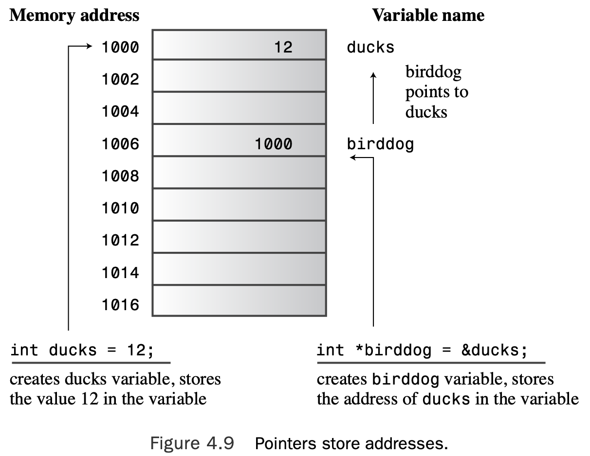

# Chapter 4 Compound Types

[TOC]

## Introducing Arrays

An **array** is a data form that can hold several values, all of one type. To create an array,you use a declaration statement.An array declaration should indicate three things:

* The type of value to be stored in each element
* The name of the array

* The number of elements in the array

Each element, in essence, is a variable that you can treat as a simple variable. This is the general form for declaring an array:

```c++
typeName arrayName[arraySize];
```

The expression `arraySize`, which is the number of elements, must be an integer constant, such as 10 or a const value, or a constant expression, such as `8 * sizeof (int)`, for which all values are known at the time compilation takes place. In particular, `arraySize` cannot be a variable whose value is set while the program is running. However, later in this chapter you’ll learn how to use the `new` operator to get around that restriction.

C++ uses a bracket notation with the index to specify an array element. Note that the index of the last element is one less than the size of the array (see Figure 4.1).


> The compiler does not check to see if you use a valid subscript. 

```c++
// arrayone.cpp -- small arrays of integers 
#include <iostream>
int main()
{
    using namespace std;
    int yams[3]; // creates array with three elements 
    yams[0] = 7; // assign value to first element
    yams[1] = 8; 
    yams[2] = 6;
    
    int yamcosts[3] = {20, 30, 5}; // create, initialize array 
// NOTE: If your C++ compiler or translator can't initialize 
// this array, use static int yamcosts[3] instead of
// int yamcosts[3]

    cout << "Total yams = ";
    cout << yams[0] + yams[1] + yams[2] << endl;
    cout << "The package with " << yams[1] << " yams costs "; 
    cout << yamcosts[1] << " cents per yam.\n";
    int total = yams[0] * yamcosts[0] + yams[1] * yamcosts[1]; 
    total = total + yams[2] * yamcosts[2];
    cout << "The total yam expense is " << total << " cents.\n";

    cout << "\nSize of yams array = " << sizeof yams; 
    cout << " bytes.\n";
    cout << "Size of one element = " << sizeof yams[0]; 
    cout << " bytes.\n";
    return 0; 
}
```

Here is the output from the program in Listing 4.1:

```c++
Total yams = 21
The package with 8 yams costs 30 cents per yam.
The total yam expense is 410 cents.

Size of yams array = 12 bytes.
Size of one element = 4 bytes.
```

The spaces in the list are optional. If you don’t initialize an array that’s defined inside a function, the element values remain undefined.That means the element takes on whatever value previously resided at that location in memory.

### Initialization Rules for Arrays

You can use the initialization form **only** when defining the array.You cannot use it later, and you cannot assign one array wholesale to another:

```c++
int cards[4] = {3, 6, 8, 10}; 					// okay
int hand[4];									// okay
hand[4] = {5, 6, 7, 9};							// not allowed
hand = cards;									// not allowed
```

When initializing an array, you can provide fewer values than array elements. For example, the following statement initializes only the first two elements of `hotelTips`:

```c++
float hotelTips[5] = {5.0, 2.5};
```

If you partially initialize an array, the compiler sets the remaining elements to zero. Thus, it’s easy to initialize all the elements of an array to zero—just explicitly initialize the first element to zero and then let the compiler initialize the remaining elements to zero:

```c++
long totals[500] = {0};
```

Note that if you initialize to `{1}` instead of to `{0}`, just the first element is set to `1`; the rest still get set to `0`.

If you leave the square brackets (`[]`) empty when you initialize an array, the C++ compiler counts the elements for you. Suppose, for example, that you make this declaration:

```c++
short things[] = {1, 5, 3, 8};
```

The compiler makes things an array of four elements.

### C++11 Array Initialization

First, you can drop the `=` sign when initializing an array:

```c++
double earnings[4] {1.2e4, 1.6e4, 1.1e4, 1.7e4}; // okay with C++11
```

Second, you can use empty braces to set all the elements to 0:

```c++
unsigned int counts[10] = {}; 	  		// all elements set to 0 
float balances[100] {}; 				// all elements set to 0
```

Third, as discussed in Chapter 3, list-initialization protects against narrowing:

```c++
long plifs[] = {25, 92, 3.0}; 				// not allowed 
char slifs[4] {'h', 'i', 1122011, '\0'}; 	// not allowed 
char tlifs[4] {'h', 'i', 112, '\0'}; 		// allowed
```

The C++ Standard Template Library (STL) provides an alternative to arrays called the `vector` template class, and C++11 adds an `array` template class.

## Strings

A **string** is a series of characters stored in consecutive bytes of memory. C++ has two ways of dealing with strings.The first, taken from C and often called a **C-style string**, is the first one this chapter examines. Later, this chapter discusses an alternative method based on a `string` class library.

C-style strings have a special feature:The last character of every string is the *null character*.This character, written `\0`, is the character with ASCII code 0, and it serves to mark the string’s end. For example, consider the following two declarations:

```c++
char dog[8] = { 'b', 'e', 'a', 'u', 'x', ' ', 'I', 'I'}; // not a string! 
char cat[8] = {'f', 'a', 't', 'e', 's', 's', 'a', '\0'}; // a string!
```

If you ask `cout` to display a nice string like `cat` in the preceding example, it displays the first seven characters, detects the null character, and stops. But if you are ungracious enough to tell `cout` to display the `dog` array from the preceding example, which is not a string, `cout` prints the eight letters in the array and then keeps marching through memory byte-by-byte, interpreting each byte as a character to print, until it reaches a null character. 

There is a better way to initialize a character array to a string. Just use a quoted string, called a **string constant** or **string literal**, as in the following:

```c++
char bird[11] = "Mr. Cheeps"; 		// the \0 is understood 
char fish[] = "Bubbles"; 					// let the compiler count
```

Of course, you should make sure the array is large enough to hold all the characters of the string, including the null character. C++ imposes no limits on the length of a string.


Note that a string constant (with double quotes) is not interchangeable with a charac- ter constant (with single quotes). 

On an ASCII system, `'S'` is just another way of writing 83. Thus, the following statement assigns the value 83 to `shirt_size`:

```c++
char shirt_size = 'S'; 			// this is fine
```

But `"S"` is not a character constant; it represents the string consisting of two characters, the `S` and the `\0` characters. So a statement like the following attempts to **assign a memory address** to `shirt_size`:

```c++
char shirt_size = "S"; 			// illegal type mismatch
```

### Concatenating String Literals

Indeed, any two string constants separated only by whitespace (spaces, tabs, and newlines) are automatically joined into one. Thus, all the following output statements are equivalent to each other:

```c++
cout << "I'd give my right arm to be" " a great violinist.\n"; 
cout << "I'd give my right arm to be a great violinist.\n"; 
cout << "I'd give my right ar"
"m to be a great violinist.\n";
```

The `\0` character from the first string is replaced by the first character of the second string.

### Using Strings in an Array

The two most common ways of getting a string into an array are to initialize an array to a string constant and to read keyboard or file input into an array. 

```c++
// strings.cpp -- storing strings in an array 
#include <iostream>
#include <cstring> // for the strlen() function 
int main()
{
    using namespace std;
    const int Size = 15;
    char name1[Size];               // empty array
    char name2[Size] = "C++owboy";  // initialized array
    // NOTE: some implementations may require the static keyword 
    // to initialize the array name2

    cout << "Howdy! I'm " << name2;
    cout << "! What's your name?\n";
    cin >> name1;
    cout << "Well, " << name1 << ", your name has ";
    cout << strlen(name1) << " letters and is stored\n";
    cout << "in an array of " << sizeof(name1) << " bytes.\n"; 
    cout << "Your initial is " << name1[0] << ".\n";
    name2[3] = '\0';                // set to null character 
    cout << "Here are the first 3 characters of my name: "; 
    cout << name2 << endl;
    return 0;
}
```

Here is a sample run of the program in Listing 4.2:

```c++
Howdy! I'm C++owboy! What's your name?
Basicman
Well, Basicman, your name has 8 letters and is stored
in an array of 15 bytes.
Your initial is B.
Here are the first 3 characters of my name: C++
```

First, note that the `sizeof` operator gives the size of the entire array, 15 bytes, but the `strlen()` function returns the size of the string stored in the array and not the size of the array itself. 

Also `strlen()` counts just the visible characters and not the null character.


### Adventures in String Input

```c++
// instr1.cpp -- reading more than one string 
#include <iostream>
int main()
{
    using namespace std; 
    const int ArSize = 20; 
    char name[ArSize]; 
    char dessert[ArSize];

    cout << "Enter your name:\n";
    cin >> name;
    cout << "Enter your favorite dessert:\n"; 
    cin >> dessert;
    cout << "I have some delicious " << dessert; 
    cout << " for you, " << name << ".\n"; 
    return 0;
}
```

The intent of the program in Listing 4.3 is simple: Read a user’s name and favorite dessert from the keyboard and then display the information. Here is a sample run:

```c++
Enter your name:
Alistair Dreeb
Enter your favorite dessert:
I have some delicious Dreeb for you, Alistair.
```

We didn’t even get a chance to respond to the dessert prompt! The program showed it and then immediately moved on to display the final line.

The `cin` technique is to use whitespace—spaces, tabs, and newlines—to delineate a string.This means `cin` reads just one word when it gets input for a character array. After it reads this word, cin automatically adds the terminating null character when it places the string into the array.


### Reading String Input a Line at a Time

#### Line-Oriented Input with `getline()`

The getline() function reads a whole line, using the newline character transmitted by the **Enter** key to mark the end of input. 

You invoke this method by using `cin.getline()` as a function call. The function takes two arguments.

* The first argument is the name of the target (that is, the array destined to hold the line of input), 
* and the second argument is a limit on the number of characters to be read. 

If this limit is, say, 20, the function reads no more than 19 characters, leaving room to automatically add the null character at the end.

```c++
// instr2.cpp -- reading more than one word with getline 
#include <iostream>
int main()
{
    using namespace std; 
    const int ArSize = 20; 
    char name[ArSize]; 
    char dessert[ArSize];

    cout << "Enter your name:\n";
    cin.getline(name, ArSize); // reads through newline 
    cout << "Enter your favorite dessert:\n"; 
    cin.getline(dessert, ArSize);
    cout << "I have some delicious " << dessert;
    cout << " for you, " << name << ".\n";
    return 0;
}
```

Listing 4.4 modifies Listing 4.3 to use `cin.getline()` instead of a simple `cin`. Otherwise, the program is unchanged.


#### Line-Oriented Input with `get()`

`get()` leaves that character in the input queue. Suppose you use two calls to `get()` in a row:

```c++
cin.get(name, ArSize);
cin.get(dessert, Arsize); // a problem
```

Because the first call leaves the newline character in the input queue, that newline character is the first character the second call sees. Thus,`get()`concludes that it’s reached the end of line without having found anything to read.

If, instead, you use `cin.get()`, the compiler realizes you want the form that reads **one character**.

Why use `get()` instead of `getline()` at all? First, older implementations may not have `getline()`. Second, `get()` lets you be a bit more careful. 

#### Empty Lines and Other Problems

What happens after `getline()` or `get()` reads an empty line? The original practice was that the next input statement picked up where the last `getline()` or `get()` left off. However, the current practice is that after `get()` (but not `getline()`) reads an empty line, it sets something called the **failbit**. The implications of this act are that further input is blocked, but you can restore input with the following command:

```c++
cin.clear()
```

Another potential problem is that the input string could be longer than the allocated space. If the input line is longer than the number of characters specified, both `getline()` and `get()` leave the remaining characters in the input queue. However, `getline()` additionally sets the failbit and turns off further input.

### Mixing String and Numeric Input

```c++

// numstr.cpp -- following number input with line input 
#include <iostream>
int main()
{
    using namespace std;
    cout << "What year was your house built?\n"; 
    int year;
    cin >> year;
    cout << "What is its street address?\n"; 
    char address[80];
    cin.getline(address, 80);
    cout << "Year built: " << year << endl; 
    cout << "Address: " << address << endl; 
    cout << "Done!\n";
    return 0;
}
```

Running the program in Listing 4.6 would look something like this:

```c++
What year was your house built?
1966
What is its street address?
Year built: 1966
Address: 
Done!
```

The problem is that when `cin` reads the year, it leaves the newline generated by the Enter key in the input queue.Then `cin.getline()` reads the newline as an empty line and assigns a null string to the `address` array. You can make these calls separately:

```c++
cin >> year;
cin.get(); // or cin.get(ch);
```

Or you can concatenate the calls, making use of the fact that the expression `cin >> year` returns the `cin` object:

```c++
(cin >> year).get(); // or (cin >> year).get(ch);
```

If you make one of these changes to Listing 4.6, it works properly:

```c++
What year was your house built?
1966
What is its street address?
43821 Unsigned Short Street
Year built: 1966
Address: 43821 Unsigned Short Street
Done!
```

## Introducing the `string` Class

To use the string class, a program has to include the `string` header file.The `string` class is part of the std namespace, so you have to provide a `using` directive or declaration or else refer to the class as `std::string`.The class definition hides the array nature of a string and lets you treat a string much like an ordinary variable. 

```c++
// strtype1.cpp -- using the C++ string class 
#include <iostream>
#include <string>           // make string class available
int main()
{
    using namespace std;
    char charr1[20];            // create an empty array
    char charr2[20] = "jaguar"; // create an initialized array 
    string str1;                // create an empty string object 
    string str2 = "panther";    // create an initialized string

    cout << "Enter a kind of feline: ";
    cin >> charr1;
    cout << "Enter another kind of feline: ";
    cin >> str1;                // use cin for input 
    cout << "Here are some felines:\n";
    cout << charr1 << " " << charr2 << " "
         << str1 << " " << str2 // use cout for output
         << endl;
    cout << "The third letter in " << charr2 << " is "
         << charr2[2] << endl;
    cout << "The third letter in " << str2 << " is "
         << str2[2] << endl;    // use array notation
         
    return 0; 
}
```

Here is a sample run of the program in Listing 4.7:

```c++
Enter a kind of feline: ocelot
Enter another kind of feline: tiger
Here are some felines:
ocelot jaguar tiger panther
The third letter in jaguar is g
The third letter in panther is n
```

You should learn from this example that, in many ways, you can use a string object in the same manner as a character array:

* You can initialize a `string` object to a C-style string.

* You can use `cin` to store keyboard input in a `string` object.

* You can use `cout` to display a `string` object.

* You can use array notation to access individual characters stored in a `string` object.

The main difference between string objects and character arrays shown in Listing 4.7 is that you declare a string object as a simple variable, not as an array:

```c++
string str1; 					// create an empty string object 
string str2 = "panther"; 		// create an initialized string
```

The class design allows the program to handle the sizing automatically. For instance, the declaration for `str1` creates a `string` object of length zero, but the program automat- ically resizes `str1` when it reads input into `str1`:

```c++
cin >> str1; 						// str1 resized to fit input
```

### C++11 String Initialization

As you might expect by now, C++11 enables list-initialization for C-style strings and string objects:

```c++
char first_date[] = {"Le Chapon Dodu"}; 
char second_date[] {"The Elegant Plate"}; 
string third_date = {"The Bread Bowl"}; 
string fourth_date {"Hank's Fine Eats"};
```

### Assignment, Concatenation, and Appending

The string class makes some operations simpler than is the case for arrays. For example, you can’t simply assign one array to another. But you can assign one string object to another:

```c++
char charr1[20];
char charr2[20] = "jaguar"; 
string str1;
string str2 = "panther"; 
charr1 = charr2;					// INVALID, no array assignment 
str1 = str2;						// VALID, object assignment ok
```

You can use the `+` operator to add two `string` objects together and the `+=` operator to tack on a `string` to the end of an existing string object. 

```c++
string str3;
str3 = str1 + str2; 		// assign str3 the joined strings 
str1 += str2; 				// add str2 to the end of str1
```

```c++
// strtype2.cpp –- assigning, adding, and appending 
#include <iostream>
#include <string> // make string class available
int main()
{
    using namespace std; 
    string s1 = "penguin"; 
    string s2, s3;

    cout << "You can assign one string object to another: s2 = s1\n"; 
    s2 = s1;
    cout << "s1: " << s1 << ", s2: " << s2 << endl;
    cout << "You can assign a C-style string to a string object.\n"; 
    cout << "s2 = \"buzzard\"\n";
    s2 = "buzzard";
    cout << "s2: " << s2 << endl;
    cout << "You can concatenate strings: s3 = s1 + s2\n"; 
    s3 = s1 + s2;
    cout << "s3: " << s3 << endl;
    cout << "You can append strings.\n";
    s1 += s2;
    cout <<"s1 += s2 yields s1 = " << s1 << endl;
    s2 += " for a day";
    cout <<"s2 += \" for a day\" yields s2 = " << s2 << endl;

    return 0; 
}
```

Here is the output from the program in Listing 4.8:

```c++
You can assign one string object to another: s2 = s1
s1: penguin, s2: penguin
You can assign a C-style string to a string object.
s2 = "buzzard"
s2: buzzard
You can concatenate strings: s3 = s1 + s2
s3: penguinbuzzard
You can append strings.
s1 += s2 yields s1 = penguinbuzzard
s2 += " for a day" yields s2 = buzzard for a day
```

### More `string` Class Operations

For C-style strings, they used functions from the C library for these tasks. The `cstring` header file (formerly `string.h`) supports these functions. For example, you can use the `strcpy()` function to copy a string to a character array, and you can use the `strcat()` function to append a string to a character array:

```c++
strcpy(charr1, charr2); 	// copy charr2 to charr1 
strcat(charr1, charr2); 	// append contents of charr2 to char1
```

```c++
// strtype3.cpp -- more string class features 
#include <iostream>
#include <string>           // make string class available 
#include <cstring>          // C-style string library
int main()
{
    using namespace std;
    char charr1[20];
    char charr2[20] = "jaguar"; 
    string str1;
    string str2 = "panther";

    // assignment for string objects and character arrays 
    str1 = str2;                // copy str2 to str1 
    strcpy(charr1, charr2);     // copy charr2 to charr1

    // appending for string objects and character arrays 
    str1 += " paste"; // add paste to end of str1 
    strcat(charr1, " juice");   // add juice to end of charr1

    // finding the length of a string object and a C-style string 
    int len1 = str1.size();     // obtain length of str1
    int len2 = strlen(charr1);  // obtain length of charr1

    cout << "The string " << str1 << " contains " 
         << len1 << " characters.\n";
    cout << "The string " << charr1 << " contains " 
         << len2 << " characters.\n";

    return 0; 
}
```

Here is the output:

```shell
The string panther paste contains 13 characters.
The string jaguar juice contains 12 characters.
```

Furthermore, with arrays, there is always the danger of the destination array being too small to hold the information, as in this example:

```c++
char site[10] = "house";
strcat(site, " of pancakes"); 	// memory problem
```

The `strcat()` function would attempt to copy all 12 characters into the `site` array, thus overrunning adjacent memory.This might cause the program to abort, or the pro- gram might continue running but with corrupted data. The `string` class, with its auto- matic resizing as necessary, avoids this sort of problem.

The C library does provide cousins to `strcat()` and `strcpy()`, called `strncat()` and `strncpy()`, that work more safely by taking a third argument to indicate the maximum allowed size of the target array, but using them adds another layer of complexity in writing programs.

### More on `string` Class I/O

```c++
// strtype4.cpp -- line input 
#include <iostream>
#include <string>               // make string class available
#include <cstring>              // C-style string library
int main()
{
    using namespace std;
    char charr[20];
    string str;

    cout << "Length of string in charr before input: "
         << strlen(charr) << endl;
    cout << "Length of string in str before input: "
         << str.size() << endl;
    cout << "Enter a line of text:\n";
    cin.getline(charr, 20);     // indicate maximum length
    cout << "You entered: " << charr << endl;
    cout << "Enter another line of text:\n";
    getline(cin, str);     // cin now an argument; no length pecifier 
    cout << "You entered: " << str << endl;
    cout << "Length of string in charr after input: "
         << strlen(charr) << endl;
    cout << "Length of string in str after input: "
         << str.size() << endl;

    return 0; 
}
```

Here’s a sample run of the program in Listing 4.10:

```c++
Length of string in charr before input: 0
Length of string in str before input: 0
Enter a line of text:
peanut butter
You entered: peanut butter
Enter another line of text:
blueberry jam
You entered: blueberry jam
Length of string in charr after input: 13
Length of string in str after input: 13
```

Note that the program says the length of the string in the array `charr` before input is 27, which is larger than the size of the array! Two things are going on here.

* The first is that the contents of an uninitialized array are undefined.
* The second is that the `strlen()` function works by starting at the first element of the array and counting bytes until it reaches a null character. 

This is the code for reading a line into an array:

```c++
cin.getline(charr, 20);
```

The dot notation indicates that the `getline()` function is a class method for the `istream` class. 

This is the code for reading a line into a `string` object:

```c++
getline(cin,str);
```

There is no dot notation, which indicates that **this** `getline()` is *not* a class method. So it takes **cin** as an argument that tells it where to find the input. Also there isn’t an argument for the size of the `string` because the string object automatically resizes to fit the string.

### Other Forms of String Literals

C++ uses the `L`, `u`, and `U` prefixes, respectively, for `string` literals of these types. Here’s an example of how they can be used:

```c++
wchar_t title[] = L"Chief Astrogator"; // w_char string 
char16_t name[] = u"Felonia Ripova"; // char_16 string 
char32_t car[] = U"Humber Super Snipe"; // char_32 string
```

C++11 also supports an encoding scheme for Unicode characters called UTF-8. C++ uses the `u8` prefix to indicate string literals of that type.

Another C++11 addition is the raw string. In a raw string, characters simply stand for themselves. Therefore, raw strings use "( and )" as delimiters, and they use an `R` prefix to identify them as raw strings:

```c++
cout << R"(Jim "King" Tutt uses "\n" instead of endl.)" << '\n';
```

This would display the following:

```c++
Jim "King" Tutt uses \n instead of endl.
```

But the raw string syntax allows you to place additional characters between the opening `"` and `(.`This implies that the same additional characters must appear between the final `)` and `".` So a raw string beginning with `R"+* (` must terminate with `)+*"`.Thus, the statement

```c++
cout << R"+*("(Who wouldn't?)", she whispered.)+*" << endl;
```

would display the following:

```c++
"(Who wouldn't?)", she whispered.
```

## Introducing Structures

A **structure** is a more versatile data form than an array because a single structure can hold items of more than one data type. The structure type is also a stepping stone to that bulwark of C++ OOP, the class.

A structure is a user-definable type, with a structure declaration serving to define the type’s data properties.

* First, you define a structure description that describes and labels the different types of data that can be stored in a structure.
* Then you can create structure variables, or, more generally, structure data objects, that follow the description’s plan.

```c++
struct inflatable {
char name[20]; 
float volume; 
double price;
};
```

The keyword `struct` indicates that the code defines the layout for a structure.The identifier `inflatable` is the name, or **tag**, for this form; this makes `inflatable` the name for the new type. Thus, you can now create variables of type `inflatable` just as you create variables of type `char` or `int`. 


After you have defined the structure, you can create variables of that type:

```c++
inflatable hat; 						// hat is a structure variable of type inflatable 
inflatable woopie_cushion; 	// type inflatable variable
inflatable mainframe;				// type inflatable variable
```

Given that hat is type inflatable, you use the membership operator (`.`) to access individual members. For example, `hat.volume` refers to the `volume` member of the structure, and `hat.price` refers to the `price` member. In short, `hat` is a `structure`, but `hat.price` is a `double`. 

### Using a Structure in a Program

```c++
// structur.cpp -- a simple structure 
#include <iostream>
struct inflatable // structure declaration
{
    char name[20]; 
    float volume; 
    double price;
};

int main()
{
    using namespace std; 
    inflatable guest = 
    {
        "Glorious Gloria", // name value 
        1.88, // volume value 
        29.99 // price value 
    }; // guest is a structure variable of type inflatable 
// It's initialized to the indicated values
    inflatable pal = 
    {
        "Audacious Arthur", 
        3.12,
        32.99
    }; // pal is a second variable of type inflatable
// NOTE: some implementations require using 
// static inflatable guest =

    cout << "Expand your guest list with " << guest.name;
    cout << " and " << pal.name << "!\n";
// pal.name is the name member of the pal variable
    cout << "You can have both for $";
    cout << guest.price + pal.price << "!\n"; 
    return 0;
}
```

Here is the output from the program in Listing 4.11:

```c++
Expand your guest list with Glorious Gloria and Audacious Arthur!
You can have both for $62.98!
```

There are two choices for `structur.cpp`. You could place the declaration inside the `main()` function, just after the opening brace.The second choice, and the one made here, is to place it outside and preceding `main()`.When a declaration occurs outside any function, it’s called an **external declaration**. The external declaration can be used by all the functions following it, whereas the **internal declaration** can be used only by the function in which the declaration is found. 


C++ practices discourage the use of external variables but encourage the use of external structure declarations.Also it often makes sense to declare symbolic constants externally.

### C++11 Structure Initialization

As with arrays, C++11 extends the features of list-initialization.The `=` sign is optional:

```c++
inflatable duck {"Daphne", 0.12, 9.98}; // can omit the = in C++11
```

Next, empty braces result in the individual members being set to 0. For example, the following declaration results in `mayor.volume` and `mayor.price` being set to 0 and all the bytes in `mayor.name` being set to 0:

```c++
inflatable mayor {};
```

### Can a Structure Use a `string` Class Member?

That is, can you declare a structure like this:

```c++
#include <string>
struct inflatable // structure definition 
{
    std::string name; 
    float volume; 
    double price;
};
```

### Other Structure Properties

```c++
// assgn_st.cpp -- assigning structures 
#include <iostream>
struct inflatable
{
    char name[20]; 
    float volume; 
    double price;
};
int main() 
{
    using namespace std; 
    inflatable bouquet = 
    {
        "sunflowers", 
        0.20,
        12.49
    };
    inflatable choice;
    cout << "bouquet: " << bouquet.name << " for $"; 
    cout << bouquet.price << endl;

    choice = bouquet;   // assign one structure to another 
    cout << "choice: " << choice.name << " for $";
    cout << choice.price << endl;
    return 0;
}
```

Here’s the output from the program in Listing 4.12:

```c++
bouquet: sunflowers for $12.49
choice: sunflowers for $12.49
```

As you can see, **memberwise assignment** is at work, for the members of the `choice` structure are assigned the same values stored in the `bouquet` structure.

You can combine the definition of a structure form with the creation of structure variables.To do so, you follow the closing brace with the variable name or names:

```c++
struct perks 
{
    int key_number;
    char car[12];
} mr_smith, ms_jones; // two perks variables
```

You even can initialize a variable you create in this fashion:

```c++
struct perks 
{
    int key_number;
    char car[12]; 
} mr_glitz =
{
  	7, 						// value for mr_glitz.key_number member 
  	"Packard"				// value for mr_glitz.car member
};
```

Another thing you can do with structures is create a structure with no type name.You do this by omitting a tag name while simultaneously defining a structure form and a variable:

```c++
struct 			// no tag 
{
    int x; 	// 2 members
    int y;
} position; // a structure variable
```

You can’t subsequently create other variables of the same type.

### Arrays of Structures

It’s also possible to create arrays whose elements are structures. For example, to create an array of 100 `inflatable` structures, you could do the following:

```c++
inflatable gifts[100]; 			// array of 100 inflatable structures
```

This makes `gifts` an array of `inflatables`. Hence each element of the array, such as `gifts[0]` or `gifts[99]`, is an `inflatable` object and can be used with the membership operator:

```c++
cin >> gifts[0].volume; 			// use volume member of first struct 
cout << gifts[99].price << endl; 	// display price member of last struct
```

To initialize an array of structures, you combine the rule for initializing arrays with the rule for structures:

```c++
inflatable guests[2] = 			// initializing an array of structs 
{
    {"Bambi", 0.5, 21.99}, 		// first structure in array
    {"Godzilla", 2000, 565.99} 	// next structure in array 
};
```

```c++
// arrstruc.cpp -- an array of structures 
#include <iostream>
struct inflatable
{
    char name[20]; 
    float volume; 
    double price;
};
int main() 
{
    using namespace std;
    inflatable guests[2] =          // initializing an array of structs 
    {
        {"Bambi", 0.5, 21.99},      // first structure in array
        {"Godzilla", 2000, 565.99}  // next structure in array 
    };

    cout << "The guests " << guests[0].name << " and " << guests[1].name
         << "\nhave a combined volume of "
         << guests[0].volume + guests[1].volume << " cubic feet.\n";
    return 0; 
}
```

Here is the output of the program in Listing 4.13:

```c++
The guests Bambi and Godzilla
have a combined volume of 2000.5 cubic feet.
```

### Bit Fields in Structures

C++, like C, enables you to specify structure members that occupy a particular number of bits.This can be handy for creating a data structure that corresponds, say, to a register on some **hardware device**. You can use unnamed fields to provide spacing. Each member is termed a **bit field**. Here’s an example:

```
struct torgle_register {
    unsigned int SN : 4; 		// 4 bits for SN value
    unsigned int : 4; 			// 4 bits unused
    bool goodIn : 1; 				// valid input (1 bit)
    bool goodTorgle : 1;		// successful torgling
};
```

You can initialize the fields in the usual manner, and you use standard structure notation to access bit fields:

```c++
torgle_register tr = { 14, true, false };
```

## Unions

A **union** is a data format that can hold different data types but only one type at a time. The syntax is like that for a structure, but the meaning is different. For example, consider the following declaration:

```c++
union one4all 
{
    int int_val;
    long long_val; 
    double double_val;
};
```

You can use a `one4all` variable to hold an `int`, a `long`, or a `double`, just as long as you do so at different times:

```c++
one4all pail; 
pail.int_val = 15;				// store an int
cout << pail.int_val; 
pail.double_val = 1.38; 	// store a double, int value is lost
cout << pail.double_val;
```

Because a union holds only one value at a time, it has to have space enough to hold its largest member. Hence, the size of the union is the size of its largest member.

One use for a union is to save space when a data item can use two or more formats but never simultaneously. 

An **anonymous union** has no name; in essence, its members become variables that share the same address. Naturally, only one member can be current at a time:

```c++
struct widget 
{
	char brand[20]; 
    int type; 
    union					// anonymous union
    {
        long id_num;		// type 1 widgets 
    	char id_char[20]; 	// other widgets
    };
};
...
widget prize;
...
if (prize.type == 1)
	cin >> prize.id_num; 
else
	cin >> prize.id_char;
```

Because the union is anonymous, `id_num` and `id_char` are treated as two members of `prize` that share the same address.The need for an intermediate identifier `id_val` is eliminated. It is up to the programmer to keep track of which choice is active.

## Enumerations

The C++ `enum` facility provides an alternative to `const` for creating symbolic constants. The syntax for `enum` resembles structure syntax. For example, consider the following statement:

```c++
enum spectrum {red, orange, yellow, green, blue, violet, indigo, ultraviolet};
```

This statement does two things:

* It makes `spectrum` the name of a new type; `spectrum` is termed an **enumeration**, much as a `struct` variable is called a structure.
* It establishes red, orange, yellow, and so on, as symbolic constants for the integer values 0–7.These constants are called **enumerators**.

By default, enumerators are assigned integer values starting with 0 for the first enumerator, 1 for the second enumerator, and so forth.You can override the default by explicitly assigning integer values.

You can use an enumeration name to declare a variable of the enumeration type:

```c++
spectrum band; 	// band a variable of type spectrum
```

The only valid values that you can assign to an enumeration variable without a type cast are the enumerator values used in defining the type.

```c++
band = blue; 	// valid, blue is an enumerator 
band = 2000; 	// invalid, 2000 not an enumerator
```

Only the assignment operator is defined for enumerations. In particular, arithmetic operations are not defined:

```c++
band = orange; 			// valid
++band;					// not valid, ++ discussed in Chapter 5 
band = orange + red; 	// not valid, but a little tricky
...
```

Enumerators are of integer type and can be promoted to type int, but int types are not converted automatically to the enumeration type:

```c++
int color = blue; 		// valid, spectrum type promoted to int
band = 3;				// invalid, int not converted to spectrum 
color = 3 + red; 		// valid, red converted to int
... 
```

You can assign an `int` value to an `enum`, provided that the value is valid and that you use an explicit type cast:

```c++
band = spectrum(3); // typecast 3 to type spectrum
```

In practice, enumerations are used more often as a way of defining related symbolic constants than as a means of defining new types. If you plan to use just the constants and not create variables of the enumeration type, you can omit an enumeration type name, as in this example:

```c++
enum {red, orange, yellow, green, blue, violet, indigo, ultraviolet};
```

### Setting Enumerator Values

You can set enumerator values explicitly by using the assignment operator:

```c++
enum bits{one = 1, two = 2, four = 4, eight = 8};
```

The assigned values must be integers.You also can define just some of the enumerators explicitly:

```c++
enum bigstep{first, second = 100, third};
```

In this case, `first` is 0 by default. Subsequent uninitialized enumerators are larger by one than their predecessors. So, `third` would have the value 101.

Finally, you can create more than one enumerator with the same value:

```c++
enum {zero, null = 0, one, numero_uno = 1};
```

Here, both `zero` and `null` are 0, and both `one` and `numero_uno` are 1. 

### Value Ranges for Enumerations

Each enumeration has a **range**, and you can assign any integer value in the range, even if it’s not an enumerator value, by using a type cast to an enumeration variable. For example, suppose that `bits` and `myflag` are defined this way:

```c++
enum bits{one = 1, two = 2, four = 4, eight = 8}; 
bits myflag;
```

In this case, the following is valid:

```c++
myflag = bits(6); // valid, because 6 is in bits range
```

The range is defined as follows. 

* First, to find the upper limit, you take the largest enumerator value.Then you find the smallest power of two greater than this largest value and subtract one; the result is the upper end of the range. (For example, the largest bigstep value, as previously defined, is 101.The smallest power of two greater than this is 128, so the upper end of the range is 127.) 
* Next, to find the lower limit, you find the smallest enumerator value. If it is 0 or greater, the lower limit for the range is 0. If the smallest enumerator is negative, you use the same approach as for finding the upper limit but toss in a minus sign. (For example, if the smallest enumerator is -6, the next power of two [times a minus sign] is -8, and the lower limit is -7.)

## Pointers and the Free Strore

.To save the book the wear and tear of your thumbing back to that chapter, here are those properties again:

* Where the information is stored
* What value is kept there
* What kind of information is stored

You’ve used one strategy for accomplishing these ends: defining a simple variable.The declaration statement provides the type and a symbolic name for the value. It also causes the program to allocate memory for the value and to keep track of the location internally.

You just apply the address operator, represented by `&`, to a variable to get its location; for example, if `home` is a variable, `&home` is its address. Listing 4.14 demonstrates this operator.

```c++
// address.cpp -- using the 
#include <iostream>
int main()
{
    using namespace std; 
    int donuts = 6; 
    double cups = 4.5;

    cout << "donuts value = " << donuts;
    cout << " and donuts address = " << &donuts << endl;
// NOTE: you may need to use unsigned (&donuts) 
// and unsigned (&cups)
    cout << "cups value = " << cups;
    cout << " and cups address = " << &cups << endl; 
    return 0;
}
```

Here is the output from the program in Listing 4.14 on one system:

```c++
donuts value = 6 and donuts address = 0x7ffee3872aa8
cups value = 4.5 and cups address = 0x7ffee3872aa0
```

The particular implementation of cout shown here uses hexadecimal notation when displaying address values because that is the usual notation used to specify a memory address.

> In short, with OOP you would like to make the array size a runtime decision. To make this approach possible, the language has to allow you to create an array—or the equivalent— while the program runs. The C++ method, as you soon see, involves using the keyword `new` to request the correct amount of memory and using pointers to keep track of where the newly allocated memory is found.

The new strategy for handling stored data switches things around by treating the loca- tion as the named quantity and the value as a derived quantity. A special type of variable— the **pointer**—holds the address of a value. Applying the `*` operator, called the **indirect value** or the **dereferencing** operator, yields the value at the location.

```c++
// pointer.cpp -- our first pointer variable 
#include <iostream>
int main()
{
    using namespace std; 
    int updates = 6;        // declare a variable
    int * p_updates;        // declare pointer to an int
    p_updates = &updates;   // assign address of int to pointer

// express values two ways
    cout << "Values: updates = " << updates;
    cout << ", *p_updates = " << *p_updates << endl;

// express address two ways
    cout << "Addresses: &updates = " << &updates; 
    cout << ", p_updates = " << p_updates << endl;
    
// use pointer to change value
    *p_updates = *p_updates + 1;
    cout << "Now updates = " << updates << endl; 
    return 0;
}
```

Here is the output from the program in Listing 4.15:

```c++
Values: updates = 6, *p_updates = 6
Addresses: &updates = 0x7ffeeef0caa8, p_updates = 0x7ffeeef0caa8
Now updates = 7
```

The `updates` variable represents the value as primary and uses the `&` operator to get the address, whereas the `p_updates` variable represents the address as primary and uses the `*` operator to get the value (see Figure 4.8). Because p_updates points to updates, *p_updates and updates are completely equivalent.


### Declaring and Initializing Pointers

For example, the preceding example has this declaration:

```c++
int * p_updates;
```

`p_updates` points to type `int`. We also say that the type for `p_updates` is pointer-to-`int` or, more concisely,`int *`.To repeat: `p_updates` is a pointer (an address), and `*p_updates` is an `int` and not a pointer (see Figure 4.9).



Be aware, however, that the following declaration creates one pointer (p1) and one

ordinary `int` (p2):

```c++
int* p1, p2;
```

You need an `*` for each pointer variable name.

```c++
// init_ptr.cpp -- initialize a pointer 
#include <iostream>
int main()
{
    using namespace std; 
    int higgens = 5; 
    int * pt = &higgens;
    cout << "Value of higgens = " << higgens
        << "; Address of higgens = " << &higgens << endl;
    cout << "Value of *pt = " << *pt
        << "; Value of pt = " << pt << endl;
    return 0;
}
```

Here is some sample output from the program in Listing 4.16:

```c++
Value of higgens = 5; Address of higgens = 0x7ffee2709aa8
Value of *pt = 5; Value of pt = 0x7ffee2709aa8
```

You can see that the program initializes pt, not *pt, to the address of higgens. 

### Pointer Danger

One extremely important point is that when you create a pointer in C++, the computer allocates memory to hold an address, but it does not allocate memory to hold the data to which the address points. Creating space for the data involves a separate step. 

```c++
long * fellow; // create a pointer-to-long
*fellow = 223323; // place a value in never-never land
```

If `fellow` happens to have the value 1200, then the computer attempts to place the data at address 1200, even if that happens to be an address in the middle of your program code. 

> Pointer Golden Rule: **Always** initialize a pointer to a definite and appropriate address before you apply the dereferencing operator (*) to it.

### Pointers and Numbers

But a pointer describes a location, and it doesn’t make sense, for example, to multiply two locations by each other. Consequently, you can’t simply assign an integer to a pointer:

```c++
int * pt;
pt = 0xB8000000; // type mismatch
```

C++ more stringently enforces type agreement, and the compiler will give you an error message saying you have a type mismatch. If you want to use a numeric value as an address, you should use a type cast to convert the number to the appropriate address type:

```c++
int * pt;
pt = (int *) 0xB8000000; // types now match
```

### Allocating Memory with `new`

The true worth of pointers comes into play when you allocate **unnamed** memory during runtime to hold values. In this case, pointers become the only access to that memory. 

The key is the C++ `new` operator.You tell new for what data type you want memory; new finds a block of the correct size and returns the address of the block.You assign this address to a pointer, and you’re in business. Here’s an example of the technique:

```c++
int * pn = new int;
```

The `new int` part tells the program you want some new storage suitable for holding an `int`. The `new` operator uses the type to figure out how many bytes are needed.Then it finds the memory and returns the address. Next, you assign the address to `pn`, which is declared to be of type pointer-to-`int`. Now `pn` is the address and `*pn` is the value stored there. Compare this with assigning the address of a variable to a pointer:

```c++
int higgens;
int * pt = &higgens;
```

In both cases (`pn` and `pt`), you assign the address of an `int` to a pointer. In the second case, you can also access the `int` by name: `higgens`. In the first case, your only access is via the pointer.

The general form for obtaining and assigning memory for a single data object, which can be a structure as well as a fundamental type, is this:

```c++
typeName * pointer_name = new typeName;
```

```c++
// use_new.cpp -- using the new operator 
#include <iostream>
int main()
{
    using namespace std; 
    int nights = 1001; 
    int * pt = new int;         // allocate space for an int 
    *pt = 1001;                 // store a value there

    cout << "nights value = ";
    cout << nights << ": location " << &nights << endl;
    cout << "int ";
    cout << "value = " << *pt << ": location = " << pt << endl;

    double * pd = new double;   // allocate space for a double 
    *pd = 10000001.0;           // store a double there

    cout << "double ";
    cout << "value = " << *pd << ": location = " << pd << endl; 
    cout << "location of pointer pd: " << &pd << endl;
    cout << "size of pt = " << sizeof(pt);
    cout << ": size of *pt = " << sizeof(*pt) << endl;
    cout << "size of pd = " << sizeof pd;
    cout << ": size of *pd = " << sizeof(*pd) << endl;
    return 0;
}
```

Here is the output from the program in Listing 4.17:

```c++
nights value = 1001: location 0x7ffee5763aa8
int value = 1001: location = 0x7fc4954057c0
double value = 1e+07: location = 0x7fc4954057d0
location of pointer pd: 0x7ffee5763a98
size of pt = 8: size of *pt = 4
size of pd = 8: size of *pd = 8
```

> In C++, a pointer with the value 0 is called the **null pointer.** C++ guarantees that the null pointer never points to valid data, so it is often used to indicate failure for operators or functions that otherwise return usable pointers. 

### Freeing Memory with `delete`

Using `new` to request memory when you need it is just the more glamorous half of the C++ memory-management package.The other half is the `delete` operator, which enables you to return memory to the memory pool when you are finished with it. You use `delete` by following it with a pointer to a block of memory originally allocated with `new`:

```c++
int * ps = new int; // allocate memory with new
. . . 				// use the memory
delete ps; 			// free memory with delete when done
```

This removes the memory to which `ps` points; it doesn’t remove the pointer `ps` itself. You can reuse `ps`, for example, to point to another `new` allocation.You should always balance a use of `new` with a use of `delete`; otherwise, you can wind up with a **memory leak**— that is, memory that has been allocated but can no longer be used. If a memory leak grows too large, it can bring a program seeking more memory to a halt.

```c++
int * ps = new int;		// ok
delete ps;				// ok
delete ps;				// not ok now
int jugs = 5;			// ok
int * pi = &jugs		// ok
delete pi;				// not allowed, memory not allocated by new
```

> You should use `delete` only to free memory allocated with `new`. However, it is safe to apply `delete` to a null pointer.

Note that the critical requirement for using `delete` is to use it with memory allocated by `new`. This doesn’t mean you have to use the same pointer you used with new; instead, you have to use the same address:

```c++
int * ps = new int; // allocate memory
int * pq = ps; 		// set second pointer to same block 
delete pq;			// delete with second pointer
```

### Using `new` to Create Dynamic Arrays

Allocating the array during compile time is called **static binding**, meaning that the array is built in to the program at compile time. But with `new`, you can create an array during runtime if you need it and skip creating the array if you don’t need it. Or you can select an array size after the program is running.This is called **dynamic binding**, meaning that the array is created while the program is running. Such an array is called a **dynamic array**.

* With static binding, you must specify the array size when you write the program. 
* With dynamic binding, the program can decide on an array size while the program runs.

#### Creating a Dynamic Array with `new`

It’s easy to create a dynamic array in C++; you tell `new` the type of array element and number of elements you want. For example, if you need an array of 10 ints, you use this:

```c++
int * psome = new int [10]; // get a block of 10 ints
```

However, using `new` with brackets to create an array requires using an alternative form of `delete` when freeing the array:

```c++
delete [] psome; // free a dynamic array
```

If you use `new` without brackets, you should use `delete` without brackets. If you use `new` with brackets, you should use `delete` with brackets. 

In short, you should observe these rules when you use new and delete:

* Don’t use `delete` to free memory that new didn’t allocate.
* Don’t use `delete` to free the same block of memory twice in succession.
* Use `delete []` if you used `new []` to allocate an array.
* Use `delete` (no brackets) if you used `new` to allocate a single entity.
*  It’s safe to apply `delete` to the null pointer (nothing happens).

you can’t use the sizeof operator, for example, to find the number of bytes in a dynamically allocated array.

The general form for allocating and assigning memory for an array is this:

```c++
type_name * pointer_name = new type_name [num_elements];
```

#### Using a Dynamic Array

The simplest way to access the elements may surprise you if you haven’t worked with C: Just use the pointer as if it were an array name.That is, you can use `psome[0]` instead of `*psome` for the first element, `psome[1]` for the second element, and so on.

```c++

// arraynew.cpp -- using the new operator for arrays 
#include <iostream>
int main()
{
    using namespace std;
    double * p3 = new double [3]; // space for 3 doubles
    p3[0] = 0.2; // treat p3 like an array name 
    p3[1] = 0.5;
    p3[2] = 0.8;
    cout << "p3[1] is " << p3[1] << ".\n";
    p3 = p3 + 1; // increment the pointer
    cout << "Now p3[0] is " << p3[0] << " and ";
    cout << "p3[1] is " << p3[1] << ".\n";
    p3 = p3 - 1; // point back to beginning 
    delete [] p3; // free the memory
    return 0;
}
```

Here is the output from the program in Listing 4.18:

```c++
p3[1] is 0.5.
Now p3[0] is 0.5 and p3[1] is 0.8.
```

As you can see, `arraynew.cpp` uses the pointer p3 as if it were the name of an array, with `p3[0]` as the first element, and so on.The fundamental difference between an array name and a pointer appears in the following line:

```c++
p3 = p3 + 1; // okay for pointers, wrong for array names
```

You can’t change the value of an array name. But a pointer is a variable, hence you can change its value. Note the effect of adding 1 to `p3`. The expression `p3[0]` now refers to the former **second element** of the array.Thus, adding 1 to `p3` causes it to point to the second element instead of the first. Subtracting one takes the pointer back to its original value so that the program can provide `delete []` with the correct address.

## Pointers, Arrays, and Pointer Arithmetic 

Adding one to an inte- ger variable increases its value by one, but adding one to a pointer variable increases its value by the number of bytes of the type to which it points.Adding one to a pointer to double adds 8 to the numeric value on systems with 8-byte `double`, whereas adding one to a pointer-to-`short` adds two to the pointer value if `short` is 2 bytes. 

```c++
// addpntrs.cpp -- pointer addition 
#include <iostream>
int main()
{
    using namespace std;
    double wages[3] = {10000.0, 20000.0, 30000.0};
    short stacks[3] = {3, 2, 1};

// Here are two ways to get the address of an array
    double * pw = wages;        // name of an array = address
    short * ps = &stacks[0];    // or use address operator
// with array element
    cout << "pw = " << pw << ", *pw = " << *pw << endl;
    pw = pw + 1;
    cout << "add 1 to the pw pointer:\n";
    cout << "pw = " << pw << ", *pw = " << *pw << "\n\n";
    cout << "ps = " << ps << ", *ps = " << *ps << endl;
    ps = ps + 1;
    cout << "add 1 to the ps pointer:\n";
    cout << "ps = " << ps << ", *ps = " << *ps << "\n\n";

    cout << "access two elements with array notation\n";
    cout << "stacks[0] = " << stacks[0]
         << ", stacks[1] = " << stacks[1] << endl;
    cout << "access two elements with pointer notation\n";
    cout << "*stacks = " << *stacks
         << ", *(stacks + 1) = " << *(stacks + 1) << endl;

    cout << sizeof(wages) << " = size of wages array\n";
    cout << sizeof(pw) << " = size of pw pointer\n";
    return 0;
}
```

Here is the output from the program in Listing 4.19:

```c++
pw = 0x7ffedfdeca90, *pw = 10000
add 1 to the pw pointer:
pw = 0x7ffedfdeca98, *pw = 20000

ps = 0x7ffedfdeca86, *ps = 3
add 1 to the ps pointer:
ps = 0x7ffedfdeca88, *ps = 2

access two elements with array notation
stacks[0] = 3, stacks[1] = 2
access two elements with pointer notation
*stacks = 3, *(stacks + 1) = 2
24 = size of wages array
8 = size of pw pointer
```

C++ interprets the name of an array as the address of its first element. Thus, the following statement makes `pw` a pointer to type `double` and then initializes `pw` to `wages`, which is the address of the first element of the `wages` array:

```c++
double * pw = wages;
```

For `wages`, as with any array, we have the following equality:

```c++
wages = &wages[0] = address of first element of array
```

Next, the program inspects the values of `pw` and `*pw`. The first is an address, and the second is the value at that address. Because `pw` points to the first element, the value displayed for `*pw` is that of the first element,10000. Then the program adds one to `pw`. As promised, this adds eight to the numeric address value because `double` on this system is 8 bytes.This makes `pw` equal to the address of the second element.Thus,`*pw` is now 20000, the value of the second element (see Figure 4.10). 


> Adding one to a pointer variable increases its value by the number of bytes of the type to which it points.

The program output demonstrates that `*(stacks + 1)` and `stacks[1]` are the same. Similarly, `*(stacks + 2)` is the same as `stacks[2]`. In general, wherever you use array notation, C++ makes the following conversion:

```c++
pointername[i] becomes *(pointername + i)
```

The name of the array is interpreted as the address of the first element of an array, whereas applying the address operator yields the address of the whole array:

```c++
short tell[10]; 		// tell an array of 20 bytes 
cout << tell << endl; 	// displays &tell[0]
cout << &tell << endl; 	// displays address of whole array
```

Numerically, these two addresses are the same, but conceptually `&tell[0]`, and hence `tell`, is the address of a 2-byte block of memory, whereas `&tell` is the address of a 20- byte block of memory. So the expression `tell + 1` adds 2 to the address value, whereas `&tell + 1` adds 20 to the address value. Another way of expressing this is to say that tell is type pointer-to-`short`, or `short *`,  and `&tell` is type pointer-to-array-of-20-`short`s, or `short (*)[20]`.

Now you might be wondering about the genesis of that last type description. First, here is how you could declare and initialize a pointer of that type:

```c++
short (*pas)[20] = &tell; 	// pas points to array of 20 shorts
```

If you omit the parentheses, precedence rules would first associate `[20]` with `pas`, making `pas` an array of 20 pointers-to-`short`, so the parentheses are necessary. Thus, the type of `pas` is `short (*)[20]`. Also note that because `pas` is set to `&tell`, `*pas` is equivalent to tell, so `(*pas)[0]` would be the first element of the `tell` array.

### Summarizing Pointer Points

#### Declaring Pointers

To declare a pointer to a particular type, use this form:

```c++
typeName * pointerName;
```

Here are some examples:

```c++
double * pn; 	// pn can point to a double value 
char * pc; 		// pc can point to a char value
```

Here `pn` and `pc` are pointers, and `double *` and `char *` are the C++ notations for the types pointer-to-`double` and pointer-to-`char`.

#### Assigning Values to Pointers

You should assign a memory address to a pointer.You can apply the `&` operator to a variable name to get an address of named memory, and the `new` operator returns the address of unnamed memory.

```c++
double * pn;			// pn can point to a double value
double * pa;			// so can pa
char * pc;				// pc can point to a char value
double bubble = 3.2; 
pn = &bubble;			// assign address of bubble to pn
pc = new char;			// assign address of newly allocated char memory to pc
pa = new double[30];	// assign address of 1st element of array of 30 double to pa
```

#### Dereferencing Pointers

Dereferencing a pointer means referring to the pointed-to value. You apply the dereferencing, or indirect value, operator (`*`) to a pointer to dereference it.

```c++
cout << *pn; 	// print the value of bubble
*pc = 'S'; 		// place 'S' into the memory location whose address is pc
```

#### Distinguishing Between a Pointer and the Pointed-to Value

Remember, if `pt` is a pointer-to-`int`, `*pt` is not a pointer-to-`int`; instead, `*pt` is the complete equivalent to a type `int` variable. 

```c++
int * pt = new int; // assigns an address to the pointer 
pt *pt = 5; 		// stores the value 5 at that address
```

#### Array Names

In most contexts, C++ treats the name of an array as equivalent to the address of the first element of an array.

```c++
int tacos[10]; // now tacos is the same as &tacos[0]
```

One exception is when you use the name of an array with the `sizeof` operator. In that case, `sizeof` returns the size of the entire array, in bytes.

#### Pointer Arithmetic

C++ allows you to add an integer to a pointer.The result of adding one equals the origi- nal address value plus a value equal to the number of bytes in the pointed-to object.

```c++
int tacos[10] = {5,2,8,4,1,2,2,4,6,8};
int * pt = tacos; 		// suppose pf and tacos are the address 3000
pt = pt + 1;			// now pt is 3004 if a int is 4 bytes
int *pe = &tacos[9]; 	// pe is 3036 if an int is 4 bytes
pe = pe - 1;			// now pe is 3032, the address of tacos[8]
int diff = pe - pt;		// diff is 7, the separation between
 						// tacos[8] and tacos[1]
```

The last operation, which yields an integer, is meaningful only if the two pointers point into the same array (pointing to one position past the end is allowed, too); it then yields the separation between the two elements.

#### Dynamic Binding and Static Binding for Arrays

You use the `new []` operator to create an array with dynamic binding (a dynamic array)—that is, an array that is allocated and whose size can be set during runtime.You free the memory with `delete []` when you are done:

```c++
int size;
cin >> size;
int * pz = new int [size]; 	// dynamic binding, size set at run time 
...
delete [] pz; 				// free memory when finished
```

#### Array Notation and Pointer Notation

Using bracket array notation is equivalent to dereferencing a pointer:

```c++
tacos[0] means *tacos means the value at address tacos
tacos[3] means *(tacos + 3) means the value at address tacos + 3
```

This is true for both array names and pointer variables, so you can use either pointer notation or array notation with pointers and array names.

```c++
int * pt = new int [10];	// pt points to block of 10 ints
*pt = 5; 					// set element number 0 to 5
pt[0] = 6; 					// reset element number 0 to 6
pt[9] = 44; 				// set tenth element (element number 9) to 44
int coats[10]; 
*(coats + 4) = 12;			// set coats[4] to 12
```

### Pointers and Strings

> With cout and with most C++ expressions, the name of an array of `char`, a pointer-to-`char`, and a quoted string constant are all interpreted as the address of the first character of a string.

```c++
// ptrstr.cpp -- using pointers to strings
#include <iostream>
#include <cstring>              // declare strlen(), strcpy()
int main()
{
    using namespace std;
    char animal[20] = "bear";   // animal holds bear
    const char * bird = "wren"; // bird holds address of string
    char * ps;                  // uninitialized

    cout << animal << " and ";  // display bear
    cout << bird << "\n";       // display wren
    // cout << ps << "\n";      // may display garbage, may cause a crash

    cout << "Enter a kind of animal: ";
    cin >> animal;              // ok if input < 20 chars
    // cin >> ps; Too horrible a blunder to try; ps doesn't
    //            point to allocated space

    ps = animal;
    cout << ps << "!\n"; // ok, same as using animal 
    cout << "Before using strcpy():\n";
    cout << animal << " at " << (int *) animal << endl; 
    cout << ps << " at " << (int *) ps << endl;

    ps = new char[strlen(animal) + 1];  // get new storage 
    strcpy(ps, animal);         // copy string to new storage
    cout << "After using strcpy():\n";
    cout << animal << " at " << (int *) animal << endl; 
    cout << ps << " at " << (int *) ps << endl;
    delete [] ps;
    return 0;
}
```

Here is a sample run of the program in Listing 4.20:

```c++
bear and wren
Enter a kind of animal: dog
dog!
Before using strcpy():
dog at 0x7ffee57cda90
dog at 0x7ffee57cda90
After using strcpy():
dog at 0x7ffee57cda90
dog at 0x7faa19504080
```

> When you read a string into a program-style string, you should always use the address of previously allocated memory. This address can be in the form of an array name or of a pointer that has been initialized using `new`.

The `strcpy()` function takes two arguments.The first is the destination address, and the second is the address of the string to be copied. **It’s up to you to make certain that the destination really is allocated and has sufficient space to hold the copy.**That’s accomplished here by using `strlen()` to find the correct size and using `new` to get free memory.

Note that something like the following can cause problems because the `food` array is smaller than the string:

```c++
strcpy(food, "a picnic basket filled with many goodies");
```

In this case, the function copies the rest of the string into the memory bytes immediately following the array, **which can overwrite other memory the program is using**. To avoid that problem, you should use `strncpy()` instead. It takes a third argument: the maximum number of characters to be copied. Be aware, however, that if this function runs out of space before it reaches the end of the string, **it doesn’t add the null character.**

```c++
strncpy(food, "a picnic basket filled with many goodies", 19); 
food[19] = '\0';
```

### Using `new` to Create Dynamic Structures

Using new with structures has two parts: creating the structure and accessing its members.To create a structure, you use the structure type with `new`. For example, to create an unnamed structure of the `inflatable` type and assign its address to a suitable pointer, you can use the following:

```c++
inflatable * ps = new inflatable;
```

C++ provides an operator just for this situation: the arrow membership operator (`->`).This operator, formed by typing a hyphen and then a greater-than symbol, does for pointers to structures what the dot operator does for structure names. For example, if ps points to a type `inflatable` structure, then `ps->price` is the `price` member of the pointed-to structure (see Figure 4.11).


```c++
// newstrct.cpp -- using new with a structure 
#include <iostream>
struct inflatable   // structure definition
{
    char name[20];
    float volume;
    double price;
};
int main()
{
    using namespace std;
    inflatable * ps = new inflatable;   // allot memory for structure
    cout << "Enter name of inflatable item: ";
    cin.get(ps->name, 20);              // method 1 for member access
    cout << "Enter volume in cubic feet: ";
    cin >> (*ps).volume;                // method 2 for member access 
    cout << "Enter price: $";
    cin >> ps->price;
    cout << "Name: " << (*ps).name << endl;               // method 2 
    cout << "Volume: " << ps->volume << " cubic feet\n";  // method 1 
    cout << "Price: $" << ps->price << endl; 			// method 1 
    delete ps;                       // free memory used by structure 
    return 0;
}
```

Here is a sample run of the program in Listing 4.21:

```c++
Enter name of inflatable item: Fabulous Frodo
Enter volume in cubic feet: 1.4
Enter price: $27.99
Name: Fabulous Frodo
Volume: 1.4 cubic feet
Price: $27.99
```

#### An Example of Using `new` and `delete`

```c++
// delete.cpp -- using the delete operator 
#include <iostream>
#include <cstring>      // or string.h
using namespace std; 
char * getname(void);   // function prototype
int main()
{
    char * name;        // create pointer but no storage

    name = getname();   // assign address of string to name 
    cout << name << " at " << (int *) name << "\n";
    delete [] name;     // memory freed

    name = getname();   // reuse freed memory
    cout << name << " at " << (int *) name << "\n";
    delete [] name;     // memory freed again
    return 0;
}

char * getname()        // return pointer to new string
{
    char temp[80];      // temporary storage
    cout << "Enter last name: ";
    cin >> temp;
    char * pn = new char[strlen(temp) + 1];
    strcpy(pn, temp);   // copy string into smaller space

    return pn;          // temp lost when function ends 
}
```

Here is a sample run of the program in Listing 4.22:

```c++
Enter last name: Fredeldumpkin
Fredeldumpkin at 0x7f9e4a4057c0
Enter last name: Pook
Pook at 0x7f9e4a504080
```

### Automatic Storage, Static Storage, and Dynamic Storage

C++ has three ways of managing memory for data, depending on the method used to allocate memory: automatic storage, static storage, and dynamic storage, sometimes called the **free store** or **heap.** 

#### Automatic Storage

Ordinary variables defined inside a function use **automatic storage** and are called **automatic variables**. These terms mean that the variables come into existence automatically when the function containing them is invoked, and they expire when the function terminates. For example, the `temp` array in Listing 4.22 exists only while the `getname()` function is active. When program control returns to `main()`, the memory used for temp is freed automatically. 

Actually, automatic values are local to the block that contains them. A **block** is a section of code enclosed between braces.

Automatic variables typically are stored on a **stack**. This means that when program exe- cution enters a block of code, its variables are added consecutively to the stack in memory and then are freed in reverse order when execution leaves the block. So the stack grows and shrinks as execution proceeds.

#### Static Storage

Static storage is storage that exists throughout the execution of an entire program. There are two ways to make a variable static. 

* One is to define it externally, outside a function.
* The other is to use the keyword static when declaring a variable:

#### Dynamic Storage

The `new` and `delete` operators provide a more flexible approach than automatic and static variables. They manage a pool of memory, which C++ refers to as the **free store** or **heap**. This pool is separate from the memory used for static and automatic variables.Using `new` and `delete` together gives you much more control over how a program uses memory than does using ordinary variables. 

## Combinations of Types

This chapter has introduced arrays, structures, and pointers.These can be combined in various ways, so let’s review some of the possibilities, starting with a structure:

```c++
struct antarctica_years_end 
{
    int year;
/* some really interesting data, etc. */
};
```

We can create variables of this type:

```c++
antarctica_years_end s01, s02, s03; // s01, s02, s03 are structures
```

We can then access members using the membership operator:

```c++
s01.year = 1998;
```

We can create a pointer to such a structure:

```c++
antarctica_years_end * pa = &s02;
```

Provided the pointer has been set to a valid address, we then can use the indirect membership operator to access members:

```c++
pa->year = 1999;
```

We can create arrays of structures:

```c++
antarctica_years_end trio[3]; // array of 3 structures
```

We then can use the membership operator to access members of an element:

```c++
trio[0].year = 2003; // trio[0] is a structure
```

Because an array name is a pointer, we also can use the indirect membership operator:

```c++
(trio+1)->year = 2004; // same as trio[1].year = 2004;
```

We can create an array of pointers:

```c++
const antarctica_years_end * arp[3] = {&s01, &s02, &s03};
```

Well, if `arp` is an array of pointers, then `arp[1]` must be a pointer, and we can use the indirect membership operator with it to access a member:

```c++
std::cout << arp[1]->year << std::endl;
```

We can create a pointer to such an array:

```c++
const antarctica_years_end ** ppa = arp;
```

Here, `arp` is the name of an array; hence, it is the address of its first element. But its first element is a pointer, so `ppa` has to be a pointer to a pointer to `const antarctica_years_end`, hence the `**`. Here is an instance for which the C++11 version of `auto` is convenient. The compiler is perfectly aware of what type `arp` is, so it can deduce the correct type for you:

```c++
auto ppb = arp; // C++11 automatic type deduction
```

Because `ppa` is a pointer to a pointer to a structure, `*ppa` is a pointer to a structure, so you can use it with the indirect membership operator:

```c++
std::cout << (*ppa)->year << std::endl; 
std::cout << (*(ppb+1))->year << std::endl;
```

```c++
// mixtypes.cpp -- some type combinations
#include <iostream>
struct antarctica_years_end 
{
    int year;
/* some really interesting data, etc. */
};

int main()
{
    antarctica_years_end s01, s02, s03;
    s01.year = 1998;
    antarctica_years_end * pa = &s02;
    pa->year = 1999;
    antarctica_years_end trio[3]; // array of 3 structures 
    trio[0].year = 2003;
    std::cout << trio->year << std::endl;
    const antarctica_years_end * arp[3] = {&s01, &s02, &s03}; 
    std::cout << arp[1]->year << std::endl;
    const antarctica_years_end ** ppa = arp;
    auto ppb = arp; // C++11 automatic type deduction
// or else use const antarctica_years_end ** ppb = arp; 
    std::cout << (*ppa)->year << std::endl;
    std::cout << (*(ppb+1))->year << std::endl;
    return 0;
}
```

Here’s the output:

```c++
2003
1999
1998
1999
```

## Array Alternatives

### The `vector` Template Class

The `vector` template class is similar to the `string` class in that it is a dynamic array. Actually, the vector class does use `new` and `delete` to manage memory, but it does so automatically.

* First, to use a `vector` object, you need to include the `vector` header file. 
* Second, the `vector` identifier is part of the `std` namespace, so you can use a `using` directive, a `using` declaration, or `std::vector`.
* Third, templates use a different syntax to indicate the type of data stored.
* Fourth, the `vector` class uses a different syntax to indicate the number of elements. 

```c++
#include <vector> 
...
using namespace std; 
vector<int> vi;			// create a zero-size array of int
int n;
cin >> n;
vector<double> vd(n); 	// create an array of n doubles
```

Because `vector` objects resize automatically when you insert or add values to them, it’s okay for `vi` to start with 0 size. 

In general, the following declaration creates a `vector` object `vt` that can hold `n_elem` elements of type `typeName`:

```c++
vector<typeName> vt(n_elem);
```

The parameter `n_elem` can be an integer constant or an integer variable.

### The `array` Template Class (C++11)

The `vector` class has more capabilities than the built-in array type, but this comes at a cost of slightly less efficiency. If all you need is a fixed-size array, it could be advantageous to use the built-in type. However, that has its own costs of lessened convenience and safety. C++11 responded to this situation by adding the `array` template class, which is part of the `std` namespace. Like the built-in type, an array object **has a fixed size and uses the stack** (or else static memory allocation) **instead of the free store**, so it shares the efficiency of built-in arrays.

```c++
#include <array>
...
using namespace std;
array<int, 5> ai; // create array object of 5 ints 
array<double, 4> ad = {1.2, 2.1, 3.43. 4.3};
```

More general, the following declaration creates an `array` object `arr` with `n_elem` ele- ments of `typeName`:

```c++
array<typeName, n_elem> arr;
```

Unlike the case for vector, `n_elem` can’t be a variable.

### Comparing Arrays, Vector Objects, and Array Objects

```c++
// choices.cpp -- array variations 
#include <iostream>
#include <vector>   // STL C++98
#include <array>    // C++11
int main()
{
    using namespace std;
// C, original C++
    double a1[4] = {1.2, 2.4, 3.6, 4.8}; 
// C++98 STL
    vector<double> a2(4);   // create vector with 4 elements 
// no simple way to initialize in C98
    a2[0] = 1.0/3.0; 
    a2[1] = 1.0/5.0; 
    a2[2] = 1.0/7.0; 
    a2[3] = 1.0/9.0;
// C++11 -- create and initialize array object 
    array<double, 4> a3 = {3.14, 2.72, 1.62, 1.41}; 
    array<double, 4> a4;
    a4 = a3;    // valid for array objects of same size
// use array notation 
    cout << "a1[2]: " << a1[2] << " at " << &a1[2] << endl;
    cout << "a2[2]: " << a2[2] << " at " << &a2[2] << endl;
    cout << "a3[2]: " << a3[2] << " at " << &a3[2] << endl;
    cout << "a4[2]: " << a4[2] << " at " << &a4[2] << endl;
// misdeed
    a4[6] = 20.2;
    cout << "a4[6]: " << a4[6] << " at " << &a4[6] << endl;
    cout << "a3[2]: " << a3[2] << " at " << &a3[2] << endl; 
    cout << "a4[2]: " << a4[2] << " at " << &a4[2] << endl;
    return 0;
}
```

Here’s some sample output:

```c++
a1[2]: 3.6 at 0x7ffee0355a80
a2[2]: 0.142857 at 0x7f9cf84057d0
a3[2]: 1.62 at 0x7ffee0355a40
a4[2]: 1.62 at 0x7ffee0355a20
a4[6]: 20.2 at 0x7ffee0355a40
a3[2]: 20.2 at 0x7ffee0355a40
a4[2]: 1.62 at 0x7ffee0355a20
```

* First, notice that whether we use a built-in array, a `vector` object, or an `array` object, we can use the standard array notation to access individual members. 
* Second, you can see from the addresses that `array` objects use the same region of memory (the stack, in this case) as the built-in array, whereas the `vector` object is stored in a different region (the free store, or heap).
* Third, note that you can assign an `array` object to another array `object`. 

Next, and this deserves special attention, note this line:

```c++
a4[6] = 20.2;
```

What does an index of `-2` mean? Recall that this translates to the following:

```c++
*(a4+6) = 20.2;
```

Expressing this in words, see where `a4` points, move forward six double elements, and put 20.2 there.That is, store the information at a location outside of the array. C++, like C, does not check for such out-of-range errors. 

However, you have alternatives. One is using the `at()` member function. Just as you can use the `getline()` member function with the `cin` object, you can use the `at()` member function with objects of the `vector` or `array` type:

```c++
a2.at(1) = 2.3; // assign 2.3 to a2[1]
```

The difference between using bracket notation and the `at()` member function is that if you use `at()`, an invalid index is caught during runtime and the program, by default, aborts.