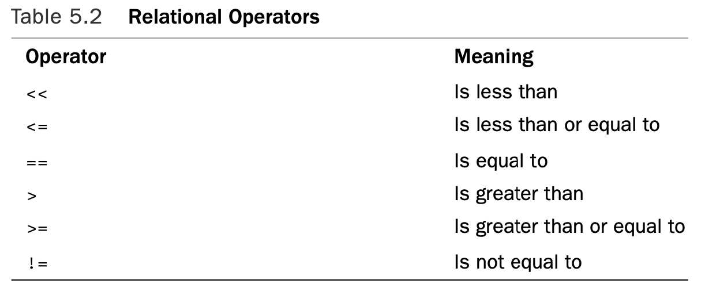
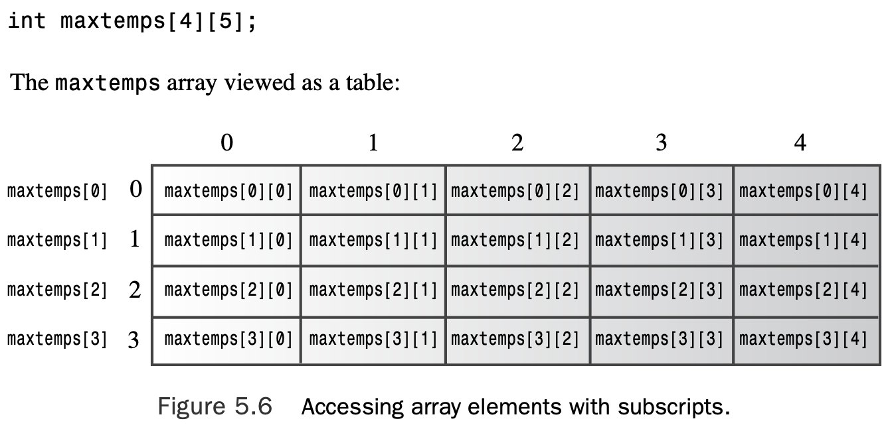

# Chapter 5 Loops and Relational Expressions

[TOC]

## Introducing `for` Loops

Circumstances often call on a program to perform repetitive tasks, such as adding together the elements of an array one by one or printing some paean to productivity 20 times.The C++ `for` loop makes such tasks easy to do. 

```c++
// forloop.cpp -- introducing the for loop 
#include <iostream>
int main()
{
    using namespace std;
    int i; // create a counter
//  initialize; test ; update 
    for (i = 0; i < 5; i++)
        cout << "C++ knows loops.\n"; 
    cout << "C++ knows when to stop.\n";
    return 0;
}
```

Here is the output from the program in Listing 5.1:

```c++
C++ knows loops.
C++ knows loops.
C++ knows loops.
C++ knows loops.
C++ knows loops.
C++ knows when to stop.
```

This loop begins by setting the integer `i` to `0`: 

```c++
i= 0
```

This is the **loop initialization** part of the loop.Then in the *loop test*, the program tests whether i is less than 5:

```c++
i < 5
```

If it is, the program executes the following statement, which is termed the **loop body**: 

```c++
cout << "C++ knows loops.\n";
```

Then the program uses the **loop update** part of the loop to increase i by 1: 

```c++
i++
```

The **loop update** part of the loop uses the `++` operator, called the **increment operator**. It increments the value of its operand by `1`. 

### Parts of a `for` Loop

A `for` loop provides a step-by-step recipe for performing repeated actions. Let’s take a

more detailed look at how it’s set up.The usual parts of a `for` loop handle these steps:

1. Setting a value initially
2. Performing a test to see whether the loop should continue
3. Executing the loop actions
4. Updating value(s) used for the test

The initialization, test, and update actions constitute a three-part control section enclosed in parentheses. Each part is an expression, and semicolons separate the expressions from each other.The statement following the control section is called the **body** of the loop, and it is executed as long as the test expression remains true:

```c++
for (initialization; test-expression; update-expression) 
    body
```

C++ syntax counts a complete for statement as a single statement, even though it can incorporate one or more statements in the body portion. 

The loop performs initialization just once. Typically, programs use this expression to set a variable to a starting value and then use the variable to count loop cycles.

**test-expression** determines whether the loop body gets executed. Typically, this expression is a relational expression—that is, one that compares two values. You can use any expression, and C++ will type cast it to type bool.Thus, an expression with a value of 0 is converted to the bool value false, and the loop terminates. 

```c++
// num_test.cpp -- use numeric test in for loop 
#include <iostream>
int main()
{
    using namespace std;
    cout << "Enter the starting countdown value: "; 
    int limit;
    cin >> limit;
    int i;
    for (i = limit; i; i--)     // quits when i is 0
        cout << "i = " << i << "\n";
    cout << "Done now that i = " << i << "\n"; 
    return 0;
}
```

Here is the output from the program in Listing 5.2:

```c++
Enter the starting countdown value: 4 
i= 4
i= 3
i= 2
i= 1
Done now that i = 0
```

The for loop is an **entry-condition** loop.This means the test expression is evaluated **before** each loop cycle.The loop never executes the loop body when the test expression is false. 

**update-expression** is evaluated at the end of the loop, after the body has been executed. However, it can be any valid C++ expression, as can the other control expressions.


#### Expressions and Statements

A for control section uses three expressions. Any value or any valid combination of values and operators constitute an expression. 

```c++
// express.cpp -- values of expressions 
#include <iostream>
int main()
{
    using namespace std; 
    int x;

    cout << "The expression x = 100 has the value ";
    cout << (x = 100) << endl;
    cout << "Now x = " << x << endl; 
    cout << "The expression x < 3 has the value ";
    cout << (x < 3) << endl;
    cout << "The expression x > 3 has the value ";
    cout << (x > 3) << endl; 
    cout.setf(ios_base::boolalpha);     //a newer C++ feature
    cout << "The expression x < 3 has the value ";
    cout << (x < 3) << endl;
    cout << "The expression x > 3 has the value ";
    cout << (x > 3) << endl;
    return 0;
}
```

Here is the output from the program in Listing 5.3:

```c++
The expression x = 100 has the value 100
Now x = 100
The expression x < 3 has the value 0
The expression x > 3 has the value 1
The expression x < 3 has the value false
The expression x > 3 has the value true
```

Normally, `cout` converts `bool` values to `int` before displaying them, but the `cout.setf(ios::boolalpha)` function call sets a flag that instructs `cout` to display the words `true` and `false` instead of 1 and 0.

> A C++ expression is a value or a combination of values and operators, and every C++ expression has a value.

From expression to statement is a short step; you just add a semicolon.Thus, the following is an expression:

```c++
age = 100
```

Whereas the following is a statement:

```c++
age = 100;
```

#### Nonexpressions and Statements

Of the kinds of statements we’ve used so far, return statements, declaration statements, and for statements don’t fit the *statement = expression + semicolon* mold. For example, this is a statement:

```c++
int toad;
```

But the fragment `int toad` is not an expression and does not have a value.This makes code such as the following invalid:

```c++
eggs = int toad * 1000; // invalid, not an expression
cin >> int toad; 		// can’t combine declaration with cin
```

Similarly, you can’t assign a for loop to a variable. 

```c++
int fx = for (i = 0; i< 4; i++) 
    cout >> i; 		// not possible
```

#### Bending the Rules

C++ adds a feature to C loops that requires some artful adjustments to the for loop syn- tax.This was the original syntax:

```c++
for (expression; expression; expression) 
    statement
```

C++ loops allow you do to things like the following, however:

```c++
for (int i = 0; i < 5; i++)
```

This once outlaw behavior was originally accommodated by defining a new kind of expression, the **declaration-statement expression**, which was a declaration stripped of the semicolon, and which could appear only in a `for` statement.

### Back to the `for` Loop

```c++
// formore.cpp -- more looping with for
#include <iostream>
const int ArSize = 16;      // example of external declaration 
int main()
{
    long long factorials[ArSize];
    factorials[1] = factorials[0] = 1LL; 
    for (int i = 2; i < ArSize; i++)
        factorials[i] = i * factorials[i-1]; 
    for (int i = 0; i < ArSize; i++)
        std::cout << i << "! = " << factorials[i] << std::endl; 
    return 0;
}
```

Here is the output from the program in Listing 5.4:

```c++
0! = 1
1! = 1
2! = 2
3! = 6
4! = 24
5! = 120
6! = 720
7! = 5040
8! = 40320
9! = 362880
10! = 3628800
11! = 39916800
12! = 479001600
13! = 6227020800
14! = 87178291200
15! = 1307674368000
```

### Changing the Step Size

```c++
// bigstep.cpp -- count as directed 
#include <iostream>
int main()
{
    using std::cout;    // a using declaration
    using std::cin;
    using std::endl;
    cout << "Enter an integer: "; 
    int by;
    cin >> by;
    cout << "Counting by " << by << "s:\n"; 
    for (int i = 0; i < 100; i = i + by)
        cout << i << endl; 
    return 0;
}
```

Here is a sample run of the program in Listing 5.5:

```c++
Enter an integer: 17
Counting by 17s:
0
17
34
51
68
85
```

### Inside Strings with the **for** Loop

The for loop provides a direct way to access each character in a string in turn. 

```c++
// forstr1.cpp -- using for with a string 
#include <iostream>
#include <string>
int main()
{
    using namespace std; 
    cout << "Enter a word: "; 
    string word;
    cin >> word;
    // display letters in reverse order
    for (int i = word.size() - 1; i >= 0; i--)
        cout << word[i]; 
    cout << "\nBye.\n"; 
    return 0;
}
```

Here is a sample run of the program in Listing 5.6:

```c++
Enter a word: animal
lamina
Bye.
```

### The Increment (`++`) and Decrement (`--`) Operators

```c++
// plus_one.cpp -- the increment operator 
#include <iostream>
int main()
{
    using std::cout; 
    int a = 20;
    int b = 20;
    cout << "a   = " << a << ":   b = " << b << "\n"; 
    cout << "a++ = " << a++ << ": ++b = " << ++b << "\n"; 
    cout << "a   = " << a << ":   b = " << b << "\n"; 
    return 0;
}
```

Here is the output from the program in Listing 5.7:

```c++
a   = 20:   b = 20
a++ = 20: ++b = 21
a   = 21:   b = 21
```

Roughly speaking, the notation `a++` means “use the current value of a in evaluating an expression, and then increment the value of `a`.” Similarly, the notation `++b` means “first increment the value of `b` and then use the new value in evaluating the expression.”

### Side Effects and Sequence Points

First, recall that a **side effect** is an effect that occurs when evaluating an expression modifies something, such as a value stored in a variable.A **sequence point** is a point in program execution at which all side effects are guaranteed to be evaluated before going on to the next step. In C++ the semicolon in a statement marks a sequence point. That means all changes made by assignment operators, increment operators, and decre- ment operators in a statement must take place before a program proceeds to the next statement. 

### Prefixing Versus Postfixing

```c++
for (n = lim; n > 0; --n)
    ...;
```

and

```c++
for (n = lim; n > 0; n--) 
    ...;
```

 whether the prefix or postfix forms are used makes no difference in these two situations.

In short, for built-in types, it most likely makes no difference which form you use. For user-defined types having user-defined increment and decrement operators, the prefix form is more efficient.

### The Increment/Decrement Operators and Pointers

Recall that adding an increment operator to a pointer increases its value by the number of bytes in the type it points to.The same rule holds for incrementing and decrementing pointers:

```c++
double arr[5] = {21.1, 32.8, 23.4, 45.2, 37.4};
double *pt = arr; 	// pt points to arr[0], i.e. to 21.1 
++pt; 				// pt points to arr[1], i.e. to 32.8
```

The right-to-left association rule for prefix operators implies that `*++pt` means first apply `++ `to `pt` (because the `++` is to the right of the `*`) and then apply `*` to the new value of `pt`:

```c++
double x = *++pt; // increment pointer, take the value; i.e., arr[2], or 23.4
```

On the other hand, `++*pt` means obtain the value that `pt` points to and then increment that value:

```c++
++*pt; // increment the pointed to value; i.e., change 23.4 to 24.4
```

Next, consider this combination:

```c++
(*pt)++; // increment pointed-to value
```

he parentheses indicate that first the pointer is dereferenced, yielding `24.4`.Then the `++ ` operator increments that value to `25.4`; `pt` remains pointing at `arr[2]`.

Finally, consider this combination:

```c++
x = *pt++; // dereference original location, then increment pointer
```

The higher precedence of the postfix `++` operator means the `++` operator operates on `pt`, not on `*pt`, so the pointer is incremented. But the fact that the postfix operator is used means that the address that gets dereferenced is the original address,`&arr[2]`,not the new address.Thus, the value of `*pt++` is `arr[2]`, or `25.4`, but the value of `pt` after the statement completes is the address of `arr[3]`.

### Combination Assignment Operators

Listing 5.5 uses the following expression to update a loop counter:

```c++
i = i + by
```

C++ has a combined addition and assignment operator that accomplishes the same result more concisely:

```c++
i += by
```

The `+=` operator adds the values of its two operands and assigns the result to the operand on the left.

```c++
int k = 5; 
k += 3;					// ok, k set to 8
int *pa = new int[10];	// pa points to pa[0]
pa[4] = 12;
pa[4] += 6; 			// ok, pa[4] set to 18
*(pa + 4) += 7; 		// ok, pa[4] set to 25
pa += 2;				// ok, pa points to the former pa[2]
34 += 10;				// quite wrong 
```


### Compound Statements, or Blocks

C++ provides a syntax loophole through which you may stuff as many statements as you like into a loop body. The trick is to use paired braces to construct a **compound statement**, or *block*.The block consists of paired braces and the statements they enclose and, for the purposes of syntax, counts as a single statement. 

```c++
// block.cpp -- use a block statement 
#include <iostream>
int main()
{
    using namespace std;
    cout << "The Amazing Accounto will sum and average "; 
    cout << "five numbers for you.\n";
    cout << "Please enter five values:\n";
    double number;
    double sum = 0.0;
    for (int i = 1; i <= 5; i++)
    {                                   // block starts here
        cout << "Value " << i << ": "; 
        cin >> number;
        sum += number;
    }                                   // block ends here
    cout << "Five exquisite choices indeed! ";
    cout << "They sum to " << sum << endl;
    cout << "and average to " << sum / 5 << ".\n"; 
    cout << "The Amazing Accounto bids you adieu!\n"; 
    return 0;
}
```

Here is a sample run of the program in Listing 5.8:

```c++
The Amazing Accounto will sum and average five numbers for you.
Please enter five values:
Value 1: 1942
Value 2: 1948
Value 3: 1957
Value 4: 1974
Value 5: 1980
Five exquisite choices indeed! They sum to 9801
and average to 1960.2.
The Amazing Accounto bids you adieu!
```

Compound statements have another interesting property. If you define a new variable inside a block, the variable persists only as long as the program is executing statements within the block.When execution leaves the block, the variable is deallocated.That means the variable is known only within the block:

```c++
#include <iostream> 
int main()
{
	using namespace std; 
    int x = 20;
	{						// block starts
        int y = 100;
        cout << x << endl;	// ok
        cout << y << endl;	// ok
    }						// block end
    cout << x << endl;		// ok
    cout << y << endl;		// invalid, won't compile
    return 0;
}
```

```c++
#include <iostream> 
int main()
{
	using std::cout; 
    using std::endl; 
    int x = 20;				// original x
	{						// block starts
		cout << x << endl;	// use original x
        int x = 100; 		// new x
        cout << x << endl;	// use new x
	}						// block ends
	cout << x << endl;		// use original x
    return 0;
}
```

### More Syntax Tricks—The Comma Operator

As you have seen, a block enables you to sneak two or more statements into a place where C++ syntax allows just one statement.The comma operator does the same for expressions, enabling you to sneak two expressions into a place where C++ syntax allows only one expression. 

```c++
// forstr2.cpp -- reversing an array 
#include <iostream>
#include <string>
int main()
{
    using namespace std; 
    cout << "Enter a word: "; 
    string word;
    cin >> word;
    
    // physically modify string object 
    char temp;
    int i, j;
    for (j = 0, i = word.size() - 1; j < i; --i, ++j)
    {                       // start block
        temp = word[i]; 
        word[i] = word[j]; 
        word[j] = temp;
    }                       // end block
    cout << word << "\nDone\n"; 
    return 0;
}
```

Here is a sample run of the program in Listing 5.9:

```c++
Enter a word: stressed
desserts
Done
```

First, it uses the comma operator to squeeze two initializations into one expression for the first part of the control section.

Then it uses the comma operator again to combine two updates into a single expression for the last part of the control section.


#### Comma Operator Tidbits

C++ does provide the operator with two additional properties. 

* First, it guarantees that the first expression is evaluated before the second expression.
* Second, C++ states that the value of a comma expression is the value of the second part of the expression.

The comma operator has the lowest precedence of any operator. For example, this statement:

```c++
cata = 17,240;
```

gets read as this:

```c++
(cats = 17), 240;
```

That is, cats is set to 17, and 240 does nothing. But because parentheses have high precedence, the following results in cats being set to 240, the value of the expression on the right of the comma:

```c++
cats = (17,240);
```

### Relational Expressions

 C++ provides six relational operators to compare numbers. Because characters are represented by their ASCII codes, you can use these operators with characters, too.Each relational expression reduces to the bool value true if the comparison is true and to the bool value false if the comparison is false, so these opera- tors are well suited for use in a loop test expression. 



The relational operators have a lower precedence than the arithmetic operators.That means this expression:

```c++
x + 3 > y - 2				// Expression 1
```

corresponds to this:

```c++
(x + 3) > (y - 2)			// Expression 2
```

and not to the following:

```c++
x + (3 > y) - 2				// Expression 3
```

### Assignment, Comparison, and a Mistake You’ll Probably Make

Don’t confuse testing the is-equal-to operator (`==`) with the assignment operator (`=`).This expression asks the musical question “Is `musicians` equal to 4?”:

```c++
musicians == 4 // comparison
```

The expression has the value `true` or `false`. This expression assigns the value 4 to `musicians`:

```c++
musicians = 4 // assignment
```

```c++
// equal.cpp -- equality vs assignment 
#include <iostream>
int main()
{
    using namespace std; 
    int quizscores[10] =
        { 20, 20, 20, 20, 20, 19, 20, 18, 20, 20};
    cout << "Doing it right:\n";
    int i;
    for (i = 0; quizscores[i] == 20; i++)
        cout << "quiz " << i << " is a 20\n";
// Warning: you may prefer reading about this program 
// to actually running it.
    cout << "Doing it dangerously wrong:\n"; 
    for (i = 0; quizscores[i] = 20; i++)
        cout << "quiz " << i << " is a 20\n";
        
    return 0; 
}
```

Here is some sample output from the program:

```c++
Doing it right:
quiz 0 is a 20
quiz 1 is a 20
quiz 2 is a 20
quiz 3 is a 20
quiz 4 is a 20
Doing it dangerously wrong: 
quiz 0 is a 20
quiz 1 is a 20 
quiz 2 is a 20 
quiz 3 is a 20
...
```

The first loop correctly halts after displaying the first five quiz scores. But the second starts by displaying the whole array.Worse than that, it says every value is 20.And worse still, it doesn’t stop at the end of the array! And worst of all, the program can (although not necessarily) freeze other applications running at the time and require a computer reboot.

The difficulty with this kind of error is that the code is syntactically correct, so the compiler won’t tag it as an error. 

### Comparing C-Style Strings

Instead, you can go to the C-style string library and use the `strcmp()` function to compare strings. This function takes two string addresses as arguments.That means the arguments can be pointers, string constants, or character array names. If the two strings are identical, the function returns the value 0. If the first string precedes the second alphabetically,`strcmp() `returns a negative value, and if the first string follows the second alphabetically,`strcmp() `returns a positive value.

C-style strings are defined by the termi- nating null character, not by the size of the containing array.This means that two strings can be identical even if they are contained in differently sized arrays:

```c++
char big[80] = "Daffy"; 		// 5 letters plus \0 
char little[6] = "Daffy"; 		// 5 letters plus \0
```

```c++
// compstr1.cpp -- comparing strings using arrays 
#include <iostream>
#include <cstring> // prototype for strcmp() 
int main()
{
    using namespace std; 
    char word[5] = "?ate";
    for (char ch = 'a'; strcmp(word, "mate"); ch++) 
    {
        cout << word << endl;
        word[0] = ch; 
    }
    cout << "After loop ends, word is " << word << endl;
    return 0;
}
```

Here is the output for the program in Listing 5.11:

```c++
?ate
aate
bate
cate
date
eate
fate
gate
hate
iate
jate
kate
late
After loop ends, word is mate
```

### Comparing `string` Class Strings

```c++
// compstr2.cpp -- comparing strings using arrays 
#include <iostream>
#include <string>       // string class
int main()
{
    using namespace std; 
    string word = "?ate";
    for (char ch = 'a'; word != "mate"; ch++) 
    {
        cout << word << endl;
        word[0] = ch; 
    }
    cout << "After loop ends, word is " << word << endl;
    return 0;
}
```

The output from the program in Listing 5.12 is the same as that for the program in Listing 5.11.

The way the `string` class overloads the `!=` operator allows you to use it as long as at least one of the operands is a string object; the remaining operand can be either a string object or a C-style string.

## The `while` Loop

The `while` loop is a `for` loop stripped of the initialization and update parts; it has just a

test condition and a body:

```c++
while (test-condition) 
    body
```

First, a program evaluates the parenthesized **test-condition** expression. If the expression evaluates to `true`, the program executes the statement(s) in the body. This cycle of testing and exe- cution continues until the test condition evaluates to false (see Figure 5.3). 


 Like the `for` loop, the `while` loop is an **entry-condition** loop.Thus, if **test-condition** evaluates to false at the beginning, the program never executes the body of the loop.

```c++

// while.cpp -- introducing the while loop 
#include <iostream>
const int ArSize = 20;
int main()
{
    using namespace std; 
    char name[ArSize];
    cout << "Your first name, please: "; 
    cin >> name;
    cout << "Here is your name, verticalized and ASCIIized:\n";
    int i = 0;                  // start at beginning of string
    while (name[i] != '\0')     // process to end of string
    {
        cout << name[i] << ": " << int(name[i]) << endl;
        i++;                    // don’t forget this step
    }
    return 0;
}
```

Here is a sample run of the program in Listing 5.13:

```c++
Your first name, please: Muffy
Here is your name, verticalized and ASCIIized:
M: 77
u: 117
f: 102
f: 102
y: 121
```

You can rewrite the `while` line this way:

```c++
while (name[i])
```

With this change, the program works just as it did before.That’s because when `name[i]` is an ordinary character, its value is the character code, which is nonzero, or `true`. But when `name[i]` is the null character, its character-code value is `0`, or `false`

### `for` Versus `while`

In C++ the `for` and `while` loops are essentially equivalent. For example, the `for` loop

```c++
for (init-expression; test-expression; update-expression) 
{
	statement(s) 
}
```

could be rewritten this way:

```c++
init-expression;
while (test-expression) 
{
    statement(s)
    update-expression; 
}
```

Similarly, the `while` loop

```c++
while (test-expression)
	body
```

could be rewritten this way:

```c++
for ( ;test-expression;) 
    body
```

Incidentally, a missing test expression in a `for` loop is construed as true, so this loop runs forever:

```c++
for ( ; ; ) 
    body
```

Programmers most often use while loops when they don’t know in advance precisely how many times a loop will execute.

Keep in mind the following guidelines when you design a loop:

* Identify the condition that terminates loop execution.
* Initialize that condition before the first test.
* Update the condition in each loop cycle before the condition is tested again.

### Just a Moment—Building a Time-Delay Loop

```c++
// waiting.cpp -- using clock() in a time-delay loop 
#include <iostream>
#include <ctime> // describes clock() function, clock_t type 
int main()
{
    using namespace std;
    cout << "Enter the delay time, in seconds: ";
    float secs;
    cin >> secs;
    clock_t delay = secs * CLOCKS_PER_SEC;  // convert to clock ticks
    cout << "starting\a\n";
    clock_t start = clock();
    while (clock() - start < delay )        // wait until time elapses
        ;                                   // note the semicolon
    cout << "done \a\n"; 
    return 0;
}
```

By calculating the delay time in system units instead of in seconds, the program in Listing 5.14 avoids having to convert system time to seconds in each loop cycle.

## The `do while` Loop

The third C++ loop is the `do while`. It’s different from the other two because it’s an **exit-condition** loop.That means this devil-may-care loop first executes the body of the loop and only then evaluates the test expression to see whether it should continue looping. 

```c++
do
	body
while (test-expression);
```


Usually, an entry-condition loop is a better choice than an exit-condition loop because the entry-condition loop checks before looping. 

```c++
// dowhile.cpp -- exit-condition loop 
#include <iostream>
int main()
{
    using namespace std; 
    int n;

    cout << "Enter numbers in the range 1-10 to find "; 
    cout << "my favorite number\n";
    do
    {
        cin >> n; // execute body 
    } while (n != 7); // then test 
    cout << "Yes, 7 is my favorite.\n" ; 
    return 0;
}
```

Here’s a sample run of the program in Listing 5.15:

```c++
Enter numbers in the range 1-10 to find my favorite number
9
4
7
Yes, 7 is my favorite.
```

## The Range-Based `for` Loop (C++11)

The C++11 adds a new form of loop called the **range-based** for loop. It simplifies one common loop task—that of doing something with each element of an array, or, more generally, of one of the container classes, such as vector or array. 

```c++
double prices[5] = {4.99, 10.99, 6.87, 7.99, 8.49}; 
for (double x : prices)
	cout << x << endl;
```

Here x initially represents the first member of the prices array. After displaying the first element, the loop then cycles x to represent the remaining elements of the array in turn.

To modify array values, you need a different syntax for the loop variable:

```c++
for (double &x : prices)
	x = x * 0.80; //20% off sale
```

The range-based for loop also can be used with initialization lists:

```c++
for (int x : {3, 5, 2, 8, 6}) 
    cout << x << " ";
cout << ‘\n’;
```

## Loops and Text Input

### Using Unadorned `cin` for Input

If a program is going to use a loop to read text input from the keyboard, it has to have some way of knowing when to stop. One way is to choose some special character, sometimes called a **sentinel character**, to act as a stop sign.

```c++
// textin1.cpp -- reading chars with a while loop 
#include <iostream>
int main()
{
    using namespace std;
    char ch;
    int count = 0;          // use basic input
    cout << "Enter characters; enter # to quit:\n";
    cin >> ch;              // get a character 
    while (ch != '#')       // test the character
    {
        cout << ch;         // echo the character
        ++count;            // count the character
        cin >> ch;          // get the next character
    }
    cout << endl << count << " characters read\n";
    return 0;
}
```

Here’s a sample run of the program in Listing 5.16:

```c++
Enter characters; enter # to quit:
see ken run#really fast
seekenrun
9 characters read
```

So why does the program omit the spaces on output? Blame `cin`. When reading type `char` values, just as when reading other basic types, `cin` skips over spaces and newline characters.The spaces in the input are not echoed, so they are not counted.

### `cin.get(char)` to the Rescue

```c++
// textin2.cpp -- using cin.get(char) 
#include <iostream>
int main()
{
    using namespace std;
    char ch;
    int count = 0;

    cout << "Enter characters; enter # to quit:\n";
    cin.get(ch);            // use the cin.get(ch) function
    while (ch != '#')
    {
        cout << ch;
        ++count;
        cin.get(ch);        // use it again
    }
    cout << endl << count << " characters read\n";
    return 0;
}
```

Here is a sample run of the program in Listing 5.17:

```c++
Enter characters; enter # to quit:
Did you use a #2 pencil?
Did you use a 
14 characters read
```

Now the program echoes and counts every character, including the spaces. Input is still buffered, so it is still possible to type more input than what eventually reaches the program.

### Which `cin.get()` Should You Use?

One version of `cin.get()` takes two arguments: the array name, which is the address of the string (technically, type `char*`), and `ArSize`, which is an integer of type `int`. Then the program uses `cin.get()` with no arguments. And most recently, we’ve used `cin.get()` this way:

```c++
char ch; 
cin.get(ch);
```

This time cin.get() has one argument, and it is type char.

### The End-of-File Condition

As Listing 5.17 shows, using a symbol such as `#` to signal the end of input is not always satisfactory because such a symbol might be part of legitimate input. C++ input facilities cooperate with the operating system to detect when input reaches the end of a file and report that information back to a program.

* First, many operating systems, including Unix, Linux, and the Windows Command Prompt mode, support **redirection**, which enables you to substitute a file for keyboard input.

* Second, many operating systems allow you to simulate the EOF condition from the keyboard. 

When `cin` detects the EOF, it sets two bits (the **eofbit** and the **failbit**) to 1.You can use a member function named `eof()` to see whether the eofbit has been set; the call `cin.eof() `returns the `bool` value `true` if the EOF has been detected and `false` otherwise. Similarly, the `fail()` member function returns `true` if either the eofbit or the failbit has been set to 1 and `false` otherwise.

```c++
// textin3.cpp -- reading chars to end of file 
#include <iostream>
int main()
{
    using namespace std;
    char ch;
    int count = 0;
    cin.get(ch);        // attempt to read a char 
    while (cin.fail() == false)     // test for EOF 
    {
        cout << ch;     // echo character
        ++count;
        cin.get(ch);    // attempt to read another char
    }
    cout << endl << count << " characters read\n"; 
    return 0;
}
```

Here is sample output from the program in Listing 5.18:(**Macintosh**)

```c++
The green bird sings in the winter.<ENTER>
The green bird sings in the winter.
Yes, but the crow filies in the dawn.<ENTER>
Yes, but the crow filies in the dawn.
^D
74 characters read
```

#### EOF Ends Input

For keyboard input, however, you might use a simulated EOF to terminate a loop but then want to read more input later.The `cin.clear()` method clears the EOF flag and lets input proceed again. 

#### Common Idioms for Character Input

```c++
cin.get(ch); 				// attempt to read a char 
while (cin.fail() == false) // test for EOF 
{
    ... 					// do stuff
    cin.get(ch); 			// attempt to read another char
}
```

You can use it to rewrite the `while` test to look like this:

```c++
while (!cin.fail()) 	// while input has not failed
```

However, the `istream` class provides a function that can convert an `istream` object such as `cin` to a `bool` value; this conversion function is called when `cin` occurs in a location where a `bool` is expected, such as in the test condition of a `while` loop. 

```c++
while (cin) 			// while input is successful
```

This is a bit more general than using `!cin.fail()` or `!cin.eof()` because it detects other possible causes of failure, such as **disk failure**.

Finally, because the return value of cin.get(char) is cin, you can condense the loop to this format:

```c++
while (cin.get(ch)) // while input is successful 
{
	... // do stuff 
}
```

Here, `cin.get(char)` is called once in the test condition instead of twice.

#### Yet Another Version of `cin.get()`

`EOF` is defined as the value` -1` because no character has an ASCII code of `-1`, but you don’t need to know the actual value.

Listing 5.19 incorporates the `cin.get()` approach into a new version of Listing 5.18. It also condenses the code by combining character input with the `while` loop test.

```c++
// textin4.cpp -- reading chars with cin.get() 
#include <iostream>
int main(void)
{
    using namespace std; 
    int ch;                         // should be int, not char
    int count = 0;

    while ((ch = cin.get()) != EOF) // test for end-of-file
    {
        cout.put(char(ch)); 
        ++count;
    }
    cout << endl << count << " characters read\n"; 
    return 0;
}
```

Here’s a sample run of the program in Listing 5.19:

```c++
The sullen mackerel sulks in the shadowy shallows.
The sullen mackerel sulks in the shadowy shallows.
Yes, but the blue bird of happiness harbors secrets.
Yes, but the blue bird of happiness harbors secrets.
^D
104 characters read
```


The form with the character argument is integrated more fully into the object approach because its return value is an `istream` object.This means, for example, that you can chain uses. For example, the following code means read the next input character into `ch1` and the following input character into `ch2`:

```c++
cin.get(ch1).get(ch2);
```

## Nested Loops and Two-Dimensional Arrays

C++ doesn’t provide a special two-dimensional array type. Instead, you create an array for which each element is itself an array. For example, suppose you want to store maximum temperature data for five cities over a 4-year period. In that case, you can declare an array as follows:

```c++
int maxtemps[4][5];
```

This declaration means that `maxtemps` is an array with four elements. Each of these elements is an array of five integers (see Figure 5.5).


You can think of the first subscript as representing the row and the second subscript as representing the column (see Figure 5.6).



Suppose you want to print all the array contents. In that case, you can use one `for` loop to change rows and a second, nested, `for` loop to change columns:

```c++
for (int row = 0; row < 4; row++) 
{
    for (int col = 0; col < 5; ++col)
        cout << maxtemps[row][col] << "\t";
    cout << endl;
}
```

### Initializing a Two-Dimensional Array

The initialization consists of a comma-separated series of one-dimensional initializations, all enclosed in a set of braces:

```c++
int maxtemps[4][5] = // 2-D array 
{
    {96, 100, 87, 101, 105}, 	// values for maxtemps[0]
    {96, 98, 91, 107, 104}, 	// values for maxtemps[1]
    {97, 101, 93, 108, 107}, 	// values for maxtemps[2]
    {98, 103, 95, 109, 108}		// values for maxtemps[3]   
};
```

### Using a Two-Dimensional Array

```c++
// nested.cpp -- nested loops and 2-D array 
#include <iostream>
const int Cities = 5;
const int Years = 4;
int main()
{
    using namespace std;
    const char * cities[Cities] =   // array of pointers
    {                               // to 5 strings
        "Gribble City", 
        "Gribbletown", 
        "New Gribble", 
        "San Gribble", 
        "Gribble Vista"
    };

    int maxtemps[Years][Cities] =   // 2-D array
    {
        {96, 100, 87, 101, 105}, 	// values for maxtemps[0]
        {96, 98, 91, 107, 104}, 	// values for maxtemps[1]
        {97, 101, 93, 108, 107}, 	// values for maxtemps[2]
        {98, 103, 95, 109, 108}		// values for maxtemps[3]   
    };

    cout << "Maximum temperatures for 2008 - 2011\n\n";
    for (int city = 0; city < Cities; ++city)
    {
        cout << cities[city] << ":\t";
        for (int year = 0; year < Years; ++year)
            cout << maxtemps[year][city] << "\t"; 
        cout << endl;
    }
        // cin.get();
    return 0;    
}
```

Here is the output for the program in Listing 5.20:

```c++
Maximum temperatures for 2008 - 2011

Gribble City:	96	96	97	98	
Gribbletown:	100	98	101	103	
New Gribble:	87	91	93	95	
San Gribble:	101	107	108	109	
Gribble Vista:	105	104	107	108
```

Using **tabs** in the output spaces the data more regularly than using spaces would. However, different tab settings can cause the output to vary in appearance from one sys- tem to another. 

More awkwardly, you could use an array of arrays of `char` instead of an array of point- ers for the string data.The declaration would look like this:

```c++
char cities[Cities][25] =   // array of 5 arrays of 25 char
{
    "Gribble City", 
    "Gribbletown", 
    "New Gribble", 
    "San Gribble", 
    "Gribble Vista"
};
```

This approach limits each of the five strings to a maximum of 24 characters. The array of pointers stores the addresses of the five string literals, but the array of `char` arrays copies each of the five string literals to the corresponding five arrays of 25 `char`. Thus, the array of pointers is much more economical in terms of space. However, if you intended to modify any of the strings, the two-dimensional array would be a better choice. 

Also you could use an array of `string` class objects instead of an array of pointers for the string data.The declaration would look like this:

```c++
const string cities[Cities] =   // array of 5 strings
{
    "Gribble City", 
    "Gribbletown", 
    "New Gribble", 
    "San Gribble", 
    "Gribble Vista"
};
```