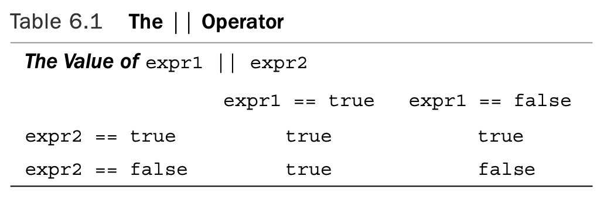

# Branching Statements and Logical Operators

[TOC]

## The `if` Statement

When a C++ program must choose whether to take a particular action, you usually implement the choice with anifstatement.The `if` comes in two forms: `if` and `if else`. The `if` statement directs a program to execute a statement or statement block if a test condition is true and to skip that state- ment or block if the condition is false.

```c++
if (test-condition)
	statement
```

A true **test-condition** causes the program to execute statement, which can be a single statement or a block. A false **test-condition** causes the program to skip statement (see Figure 6.1). The entire `if` construction counts as a single statement.


```c++
// if.cpp -- using the if statement 
#include <iostream>
int main()
{
    using std::cin;         // using declarations
    using std::cout; 
    char ch;
    int spaces = 0; 
    int total = 0; 
    cin.get(ch); 
    while (ch != '.')       // quit at end of sentence
    {
        if (ch == ' ')      // check if ch is a space
            ++spaces;
        ++total;            // done every time
        cin.get(ch); 
    }
    cout << spaces << " spaces, " << total;
    cout << " characters total in sentence\n"; 
    return 0;
}
```

Here’s some sample output from the program in Listing 6.1:

```c++
The balloonist was an airhead
with lofty goals.
6 spaces, 46 characters total in sentence
```

### The `if else` Statement

Whereas an `if` statement lets a program decide whether a **particular** statement or block is executed, an `if else` statement lets a program decide which of **two** statements or blocks is executed. It’s an invaluable statement for creating alternative courses of action.

```c++
if (test-condition) 
    statement1
else 
    statement2
```

Each statement can be either a single statement or a statement block delimited by braces (see Figure 6.2).The entire `if else` construct counts syntactically as a single statement.


```c++
// ifelse.cpp -- using the if else statement 
#include <iostream>
int main()
{
    char ch;

    std::cout << "Type, and I shall repeat.\n"; 
    std::cin.get(ch);
    while (ch != '.')
    {
        if (ch == '\n') 
            std::cout << ch;    // done if newline
        else
            std::cout << ++ch;  // done otherwise
        std::cin.get(ch); 
    }
// try ch + 1 instead of ++ch for interesting effect 
    std::cout << "\nPlease excuse the slight confusion.\n";
        // std::cin.get();
        // std::cin.get(); 
    return 0;
}
```

Here’s some sample output from the program in Listing 6.2:

```c++
Type, and I shall repeat.
An ineffable joy suffused me as I beheld
Bo!jofggbcmf!kpz!tvggvtfe!nf!bt!J!cfifme
the wonders of modern computing.
uif!xpoefst!pg!npefso!dpnqvujoh
Please excuse the slight confusion.
```

### Formatting `if else` Statements

Keep in mind that the two alternatives in an if else statement must be single state- ments. If you need more than one statement, you must use braces to collect them into a single block statement. The following code, for example, produces a compiler error:

```c++
if (ch == 'Z')
    zorro++; 	// if ends here
    cout << "Another Zorro candidate\n"; 
else			// wrong
    dull++; 
	cout << "Not a Zorro candidate\n";
```

You add braces to group statements into a single statement block:

```c++
if (ch == 'Z')
{
    zorro++; 	// if ends here
    cout << "Another Zorro candidate\n"; 
}
else			// wrong
{
    dull++; 
	cout << "Not a Zorro candidate\n";
}
```

### The `if else if else` Construction

 Because an `if else` statement itself is a single statement, it can follow an else:

```c++
if (ch == 'A') 
    a_grade++;			// alternative # 1
else
    if (ch == 'B')		// alternative # 2
    	b_grade++; 		// subalternative # 2a
	else
    	soso++;			// subalternative # 2b
```

If `ch` is not '`A`', the program goes to the else.There, a second `if else` subdivides that alternative into two more choices. C++’s free formatting enables you to arrange these elements into an easier-to-read format:

```c++
if (ch == 'A') 
    a_grade++;			// alternative # 1
else if (ch == 'B') 
    b_grade++;			// alternative # 2
else 
    soso++;				// alternative # 3
```

```c++
// ifelseif.cpp -- using if else if else 
#include <iostream>
const int Fave = 27;
int main()
{
    using namespace std; 
    int n;

    cout << "Enter a number in the range 1-100 to find "; 
    cout << "my favorite number: ";
    do
    {
        cin >> n;
        if (n < Fave)
            cout << "Too low -- guess again: "; 
        else if (n > Fave)
            cout << "Too high -- guess again: ";
        else 
            cout << Fave;
    } while (n != Fave);
    return 0; 
}
```

Here’s some sample output from the program in Listing 6.3:

```c++
Enter a number in the range 1-100 to find my favorite number: 50 
Too high -- guess again: 25
Too low -- guess again: 37
Too high -- guess again: 31
Too high -- guess again: 28 
Too high -- guess again: 27 
27 is right!
```

## Logical Expressions

### The Logical OR Operator: `||`

The C++ equivalent is the logical OR operator, written `||`. This operator combines two expressions into one. If either or both of the original expressions is `true`, or nonzero, the resulting expression has the value `true`. Otherwise, the expression has the value `false`. Here are some examples:

```c++
5 == 5 || 5 == 9 	// true because first expression is true 
5 > 3 || 5 > 10 	// true because first expression is true 
5 > 8 || 5 < 10 	// true because second expression is true 
5 < 8 || 5 > 2 		// true because both expressions are true 
5 > 8 || 5 < 2		// false because both expressions are false
```

Because the `||` has a lower precedence than the relational operators, you don’t need to use parentheses in these expressions.



C++ provides that the || operator is a **sequence point**.That is, any value changes indi- cated on the left side take place before the right side is evaluated. 

```c++
// or.cpp -- using the logical OR operator 
#include <iostream>
int main()
{
    using namespace std;
    cout << "This program may reformat your hard disk\n"
            "and destroy all your data.\n"
            "Do you wish to continue? <y/n> "; 
    char ch;
    cin >> ch;
    if (ch == 'y' || ch == 'Y')             // y or Y 
        cout << "You were warned!\a\a\n"; 
    else if (ch == 'n' || ch == 'N')        // n or N
        cout << "A wise choice ... bye\n"; 
    else
        cout << "That wasn't a y or n! Apparently you " 
        "can't follow\ninstructions, so " 
        "I'll trash your disk anyway.\a\a\a\n";
    return 0; 
}
```

(The program doesn’t really carry out any threats.) Here is a sample run of the program in Listing 6.4:

```c++
This program may reformat your hard disk
and destroy all your data.
Do you wish to continue? <y/n> n
A wise choice ... bye
```

```c++
This program may reformat your hard disk
and destroy all your data.
Do you wish to continue? <y/n> y
You were warned!
```

```c++
This program may reformat your hard disk
and destroy all your data.
Do you wish to continue? <y/n> x
That wasn't a y or n! Apparently you can't follow
instructions, so I'll trash your disk anyway.
```

### The Logical AND Operator: `&&`

The logical AND operator, written `&&`, also combines two expressions into one.The resulting expression has the value `true` only if **both** of the original expressions are `true`. Here are some examples:

```c++
5 == 5 && 4 == 4 	// true because both expressions are true
5 == 3 && 4 == 4	// false because first expression is false
5 > 3 && 5 > 10		// false because second expression is false
5 > 8 && 5 < 10		// false because first expression is false
5 < 8 && 5 > 2 		// true because both expressions are true
5 > 8 && 5 < 2		// false because both expressions are false
```

Because the `&&` has a lower precedence than the relational operators, you don’t need to use parentheses in these expressions. Like the `||` operator, the `&&` operator acts as a sequence point, so the left side is evaluated, and any side effects are carried out before the right side is evaluated. If the left side is false, the whole logical expression must be false, so C++ doesn’t bother evaluating the right side in that case.


```c++
// and.cpp -- using the logical AND operator 
#include <iostream>
const int ArSize = 6;
int main()
{
    using namespace std;
    float naaq[ArSize];
    cout << "Enter the NAAQs (New Age Awareness Quotients) "
         << "of\nyour neighbors. Program terminates "
         << "when you make\n" << ArSize << " entries " 
         << "or enter a negative value.\n";
    
    int i = 0;
    float temp;
    cout << "First value: ";
    cin >> temp;
    while (i < ArSize && temp >= 0) // 2 quitting criteria 
    {
        naaq[i] = temp; 
        ++i;
        if (i < ArSize)             // room left in the array,
        {
            cout << "Next value: "; 
            cin >> temp;            // so get next value
        } 
    }
    if (i == 0)
        cout << "No data--bye\n";
    else
    {
        cout << "Enter your NAAQ: "; 
        float you;
        cin >> you;
        int count = 0;
        for (int j = 0; j < i; j++) 
            if (naaq[j] > you)
                ++count;
        cout << count;
        cout << " of your neighbors have greater awareness of\n"
             << "the New Age than you do.\n"; 
    return 0;
}
```

Here are a couple of sample runs of the program. One terminates after six entries:

```c++
Enter the NAAQs (New Age Awareness Quotients) of
your neighbors. Program terminates when you make
6 entries or enter a negative value.
First value: -1
No data--bye
```

```c++
Enter the NAAQs (New Age Awareness Quotients) of
your neighbors. Program terminates when you make
6 entries or enter a negative value.
First value: 1
Next value: 2
Next value: 3
Next value: 4
Next value: 5
Next value: 6
Enter your NAAQ: 4
2 of your neighbors have greater awareness of
the New Age than you do.
```

### Setting Up Ranges with `&&`

```c++
// more_and.cpp -- using the logical AND operator 
#include <iostream>
const char * qualify[4] =   // an array of pointers
{                           // to strings
    "10,000-meter race.\n", 
    "mud tug-of-war.\n", 
    "masters canoe jousting.\n", 
    "pie-throwing festival.\n"
}; 
int main()
{
    using namespace std;
    int age;
    cout << "Enter your age in years: "; 
    cin >> age;
    int index;

    if (age > 17 && age < 35) 
        index = 0;
    else if (age >= 35 && age < 50) 
        index = 1;
    else if (age >= 50 && age < 65) 
        index = 2;
    else
        index = 3;
        
    cout << "You qualify for the " << qualify[index];
    return 0; 
}
```

Here is a sample run of the program in Listing 6.6:

```c++
Enter your age in years: 24
You qualify for the 10,000-meter race.
```

### The Logical NOT Operator: `!`

The `!` operator negates, or reverses the truth value of, the expression that follows it.That is, if `expression` is `true`, then `!expression` is `false`—and vice versa. More precisely, if `expression` is `true`, or nonzero, then `!expression` is `false`.

```c++
// not.cpp -- using the not operator 
#include <iostream>
#include <climits>
bool is_int(double); 
int main()
{
    using namespace std; 
    double num;

    cout << "Yo, dude! Enter an integer value: ";
    cin >> num;
    while (!is_int(num))    // continue while num is not int-able 
    {
        cout << "Out of range -- please try again: ";
        cin >> num; 
    }
    int val = int (num);    // type cast
    cout << "You've entered the integer " << val << "\nBye\n"; 
    return 0;
}

bool is_int(double x) 
{
    if (x <= INT_MAX && x >= INT_MIN)   // use climits values
        return true;
    else
        return false;
}
```

Here is a sample run of the program in Listing 6.7 on a system with a 32-bit `int`: 

```c++
Yo, dude! Enter an integer value: 12983473825739 
Out of range -- please try again: -237849183275
Out of range -- please try again: 99999
You've entered the integer 99999
Bye
```

### Logical Operator Facts

As mentioned earlier in this chapter, the C++ logical OR and logical AND operators have a lower precedence than relational operators.This means that an expression such as this

```c++
x > 5 && x < 10
```

is interpreted this way:

```c++
(x > 5) && (x < 10)
```

The ! operator, on the other hand, has a higher precedence than any of the relational or arithmetic operators.Therefore, to negate an expression, you should enclose the expres- sion in parentheses, like this:

```c++
!(x > 5) // is it false that x is greater than 5 
!x > 5 // is !x greater than 5
```

The logical AND operator has a higher precedence than the logical OR operator.Thus this expression:

```c++
age > 30 && age < 45 || weight > 300
```

means the following:

```c++
(age > 30 && age < 45) || weight > 300
```

### Alternative Representations

Not all keyboards provide all the symbols used for the logical operators, so the C++ Stan- dard provides alternative representations,as shown inTable 6.3.


## The `cctype` Library of Character Functions

C++ has inherited from C a handy package of character-related functions, prototyped in the cctype header file (`ctype.h`, in the older style), that simplify such tasks as determining whether a character is an uppercase letter or a digit or punctuation. 

Using these functions is more convenient than using the AND and OR operators. For example, here’s how you might use AND and OR to test whether a character ch is an alphabetic character:

```c++
if ((ch >= 'a' && ch <= 'z') || (ch >= 'A' && ch <= 'Z'))
```

Compare that to using `isalpha()`:

```c++
if (isalpha(ch))
```

```c++
// cctypes.cpp -- using the ctype.h library
#include <iostream>
#include <cctype> // prototypes for character functions 
int main()
{
    using namespace std;
    cout << "Enter text for analysis, and type @"
            " to terminate input.\n"; 
    char ch;
    int whitespace = 0; 
    int digits = 0; 
    int chars = 0;
    int punct = 0;
    int others = 0;

    cin.get(ch);            // get first character
    while (ch != '@')       // test for sentinel
    {
    if(isalpha(ch))         // is it an alphabetic character?
        chars++;
    else if(isspace(ch))    // is it a whitespace character?
        whitespace++;
    else if(isdigit(ch))    // is it a digit?
        digits++;
    else if(ispunct(ch))    // is it punctuation?
        punct++;
    else 
        others++;
    cin.get(ch);            // get next character
    }

    cout << chars << " letters, "
         << whitespace << " whitespace, " 
         << digits << " digits, "
         << punct << " punctuations, " 
         << others << " others.\n";
    return 0; 
}
```

Here is a sample run of the program in Listing 6.8 (note that the whitespace count includes newlines):

```c++
Enter text for analysis, and type @ to terminate input.
AdrenalVision International producer Adrienne Vismonger
announced production of their new 3-D film, a remake of 
"My Dinner with Andre," scheduled for 2013. "Wait until
you see the the new scene with an enraged Collossipede!"@
177 letters, 33 whitespace, 5 digits, 9 punctuations, 0 others.
```


## The `?:` Operator

C++ has an operator that can often be used instead of the `if else` statement. This operator is called the **conditional operator**, written `?:`, and, for you trivia buffs, it is the only C++ operator that requires three operands.The general form looks like this:

```c++
expression1 ? expression2 : expression3
```

If `expression1` is true, then the value of the whole conditional expression is the value of `expression2`. Otherwise, the value of the whole expression is the value of `expression3`. Here are two examples that show how the operator works:

```c++
5 > 3 ? 10 : 12 // 5 > 3 is true, so expression value is 10 
3 == 9? 25 : 18 // 3 == 9 is false, so expression value is 18
```

```c++
// condit.cpp -- using the conditional operator 
#include <iostream>
int main()
{
    using namespace std;
    int a, b;
    cout << "Enter two integers: ";
    cin >> a >> b;
    cout << "The larger of " << a << " and " << b;
    int c = a > b ? a : b;      // c = a if a > b, else c = b 
    cout << " is " << c << endl;
    return 0;
}
```

Here is a sample run of the program in Listing 6.9:

```c++
Enter two integers: 25 28 
The larger of 25 and 28 is 28
```

One favorite trick for the reprehensible goal of concealing the purpose of code is to nest conditional expressions within one another, as the following mild example shows:

```c++
const char x[2] [20] = {"Jason ","at your service\n"}; 
const char * y = "Quillstone ";

for (int i = 0; i < 3; i++)
	cout << ((i < 2)? (!i ? x [i] : y) : x[1]);
```

This is merely an obscure (but, by no means maximally obscure) way to print the three strings in the following order:

```c++
Jason Quillstone at your service
```

## The `switch` Statement

You can extend an `if else if else` sequence to handle five alternatives, but the C++ `switch` statement more easily handles selecting a choice from an extended list. Here’s the general form for a `switch` statement:

```c++
switch (integer-expression) 
{
    case label1 : statement(s)
	case label2 : statement(s) 
    ...
	default : statement(s)
}
```

A C++ switch statement acts as a routing device that tells the computer which line of code to execute next. On reaching a switch statement, a program jumps to the line labeled with the value corresponding to the value of **integer-expression**. If **integer-expression** doesn’t match any of the labels, the program jumps to the line labeled `default`. The `default` label is optional. If you omit it and there is no match, the program jumps to the next statement following the switch (see Figure 6.3).


```c++
// switch.cpp -- using the switch statement 
#include <iostream>
using namespace std;
void showmenu();    // function prototypes
void report(); 
void comfort();
int main()
{
    showmenu();
    int choice;
    cin >> choice; 
    while (choice != 5) 
    {
        switch(choice) 
        {
            case 1 : cout << "\a\n";
                     break;
            case 2 : report();
                     break;
            case 3 : cout << "The boss was in all day.\n";
                     break;
            case 4 : comfort();
                     break;
            default : cout << "That's not a choice.\n";
        }
        showmenu(); 
        cin >> choice;
    }
    cout << "Bye!\n"; 
    return 0;
}

void showmenu() 
{
    cout << "Please enter 1, 2, 3, 4, or 5:\n"
            "1) alarm           2) report\n"
            "3) alibi           4) comfort\n"
            "5) quit\n";
}

void report()
{
    cout << "It's been an excellent week for business.\n" 
        "Sales are up 120%. Expenses are down 35%.\n";
}

void comfort()
{
    cout << "Your employees think you are the finest CEO\n" 
        "in the industry. The board of directors think\n" 
        "you are the finest CEO in the industry.\n";
}
```

Here is a sample run of the executive menu program in Listing 6.10:

```c++
Please enter 1, 2, 3, 4, or 5:
1) alarm           2) report
3) alibi           4) comfort
5) quit
4
Your employees think you are the finest CEO
in the industry. The board of directors think
you are the finest CEO in the industry.
Please enter 1, 2, 3, 4, or 5:
1) alarm           2) report
3) alibi           4) comfort
5) quit
2
It's been an excellent week for business.
Sales are up 120%. Expenses are down 35%.
Please enter 1, 2, 3, 4, or 5:
1) alarm           2) report
3) alibi           4) comfort
5) quit
6
That's not a choice.
Please enter 1, 2, 3, 4, or 5:
1) alarm           2) report
3) alibi           4) comfort
5) quit
5
Bye!
```

You could use both an uppercase and a lowercase label for the same statements:

```c++
char choice;
cin >> choice;
while (choice != 'Q' && choice != 'q') 
{
	switch(choice) 
    {
		case 'a': 
        case 'A': cout << "\a\n";
				  break; 
        case 'r':
		case 'R': report();
				  break; 
        case 'l':
		case 'L': cout << "The boss was in all day.\n";
				  break; 
        case 'c':
		case 'C': comfort();
            	  break;
		default : cout << "That's not a choice.\n";
	}
	showmenu(); 
    cin >> choice;
}
```

### Using Enumerators as Labels

```c++
// enum.cpp -- using enum
#include <iostream>
// create named constants for 0 - 6
enum {red, orange, yellow, green, blue, violet, indigo};

int main() 
{
    using namespace std;
    cout << "Enter color code (0-6): "; 
    int code;
    cin >> code;
    while (code >= red && code <= indigo) 
    {
        switch (code)
        {
            case red        : cout << "Her lips were red.\n"; break;
            case orange     : cout << "Her hair was orange.\n"; break;
            case yellow     : cout << "Her shoes were yellow.\n"; break;
            case green      : cout << "Her nails were green.\n"; break;
            case blue       : cout << "Her sweatsuit was blue.\n"; break;
            case violet     : cout << "Her eyes were violet.\n"; break;
            case indigo     : cout << "Her mood was indigo.\n"; break;
        }    
        cout << "Enter color code (0-6): "; 
        cin >> code;
    }
    cout << "Bye\n"; 
    return 0;
}
```

Here’s sample output from the program in Listing 6.11:

```c++
Enter color code (0-6): 0
Her lips were red.
Enter color code (0-6): 1
Her hair was orange.
Enter color code (0-6): 2
Her shoes were yellow.
Enter color code (0-6): 3
Her nails were green.
Enter color code (0-6): 4
Her sweatsuit was blue.
Enter color code (0-6): 5
Her eyes were violet.
Enter color code (0-6): 6
Her mood was indigo.
Enter color code (0-6): 7
Bye
```

### `switch` and `if else`

Both the `switch` statement and the `if else` statement let a program select from a list of alternatives. The `if else` is the more versatile of the two. For example, it can handle ranges, as in the following:

```c++
if (age > 17 && age < 35) 
    index = 0;
else if (age >= 35 && age < 50) 
    index = 1;
else if (age >= 50 && age < 65) 
    index = 2;
else
    index = 3;
```

The `switch` statement, on the other hand, isn’t designed to handle ranges. Each `switch` case label must be a single value. Also that value must be an integer (which includes `char`), so a switch statement can’t handle floating-point tests. 

Because that’s precisely the situation that the `switch` statement is designed to process, the `switch` statement is usually the **more efficient choice in terms of code size and execution speed**, unless there are only a couple alternatives from which to choose.

> If you can use either an `if else if` sequence or a `switch` statement, the usual practice is to use `switch` if you have three or more alternatives.

## The `break` and `continue` Statements

The `break` and `continue` statements enable a program to skip over parts of the code.You can use the `break` statement in a switch statement and in any of the loops. The `continue` statement is used in loops and causes a program to skip the rest of the body of the loop and then start a new loop cycle (see Figure 6.4).


```c++
// jump.cpp -- using continue and break 
#include <iostream>
const int ArSize = 80;
int main()
{
    using namespace std;
    char line[ArSize]; 
    int spaces = 0;

    cout << "Enter a line of text:\n"; 
    cin.get(line, ArSize);
    cout << "Complete line:\n" << line << endl; 
    cout << "Line through first period:\n"; 
    for (int i = 0; line[i] != '\0'; i++)
    {
        cout << line[i]; // display character
        if (line[i] == '.') // quit if it's a period
            break;
        if (line[i] != ' ') // skip rest of loop
            continue; 
        spaces++;
    }
    cout << "\n" << spaces << " spaces\n"; 
    cout << "Done.\n";
    return 0;
}
```

Here’s a sample run of the program in Listing 6.12:

```c++
Enter a line of text:
Let's do lunch today. You can pay!
Complete line:
Let's do lunch today. You can pay!
Line through first period:
Let's do lunch today.
3 spaces
Done.
```

This program doesn’t have to use `continue`. Instead, it could use this code:

```c++
if (line[i] == ' ')
	spaces++;
```

## Number-Reading Loops

You want to give the user the option to terminate input before filling the array. One way to do this is utilize how cin behaves. Consider the following code:

```c++
int n; 
cin >> n;
```

What happens if the user responds by entering a word instead of a number? Four things occur in such a mismatch:

* The value of `n` is left unchanged.
* The mismatched input is left in the input queue.
* An error flag is set in the `cin` object.
* The call to the `cin` method, if converted to type `bool`, returns `false`.

```c++
// cinfish.cpp -- non-numeric input terminates loop 
#include <iostream>
const int Max = 5;
int main()
{
    using namespace std;
// get data
    double fish[Max];
    cout <<  "Please enter the weights of your fish.\n";
    cout << "You may enter up to " << Max    
            << " fish <q to terminate>.\n";  
    cout << "fish #1: ";
    int i = 0;
    while (i < Max && cin >> fish[i]) {
        if (++i < Max)
        	cout << "fish #" << i+1 << ": ";
    }
// calculate average
    double total = 0.0;
    for (int j = 0; j < i; j++)
        total += fish[j]; 
// report results
    if (i == 0)
        cout << "No fish\n";
    else
        cout << total / i << " = average weight of "
            << i << " fish\n"; 
    cout << "Done.\n";
    return 0; 
}
```

The expression `cin >> fish[i]` in Listing 6.13 is really a `cin` method function call, and the function returns `cin`. If `cin` is part of a test condition, it’s converted to type `bool`. The conversion value is `true` if input succeeds and `false` otherwise. A `false` value for the expression terminates the loop. By the way, here’s a sample run of the program:

```c++
Please enter the weights of your fish.
You may enter up to 5 fish <q to terminate>.
fish #1: 30
fish #2: 35
fish #3: 25
fish #4: 40
fish #5: q
32.5 = average weight of 4 fish
Done.
```

```c++
Please enter the weights of your fish.
You may enter up to 5 fish <q to terminate>.
fish #1: q
No fish
Done.
```

Note that the program has to reset `cin` before getting rid of the bad input. Listing 6.14 shows how these tasks can be accomplished.

```c++
// cingolf.cpp -- non-numeric input skipped 
#include <iostream>
const int Max = 5;
int main()
{
    using namespace std;
// get data
    int golf[Max];
    cout << "Please enter your golf scores.\n";
    cout << "You must enter " << Max << " rounds.\n";
    int i;
    for ( i = 0; i < Max; i++)
    {
        cout << "round #" << i+1 << ": ";
        while (!(cin >> golf[i]))
        {
            cin.clear(); // reset input 
            while (cin.get() != '\n')
                continue; // get rid of bad input 
            cout << "Please enter a number: ";
        }        
    }  
// calculate average
    double total = 0.0;
    for (i = 0; i < Max; i++) 
        total += golf[i];
// report results
    cout << total / Max << " = average score "
            << Max << " rounds\n"; return 0;
}
```

Here is a sample run of the program in Listing 6.14:

```c++
Please enter your golf scores.
You must enter 5 rounds.
round #1: 88
round #2: 87
round #3: must i?
Please enter a number: 103
round #4: 94
round #5: 86
91.6 = average score 5 rounds
```

The heart of the error-handling code in Listing 6.14 is the following:

```c++
while (!(cin >> golf[i]))
{
    cin.clear(); // reset input 
    while (cin.get() != '\n')
        continue; // get rid of bad input 
    cout << "Please enter a number: ";
}
```

## Simple File Input/Output

 C++ makes it simple to transfer the skills you’ve acquired for keyboard input and display output (collectively termed **console I/O**) to file input and output (**file I/O**). 

### Text I/O and Text Files

When you use `cin` for input, the program views input as a series of bytes, with each byte being interpreted as a character code. No matter what the destination data type, the input begins as character data—that is, text data.

Suppose you have the following sample line of input:

```c++
38.5 19.2
```

First, let’s try type `char`:

```c++
char ch; 
cin >> ch;
```

**The first character** in the input line is assigned to `ch`. In this case, the first character is the digit `3`, and the character code (in binary) for this digit is stored in `ch`. The input and the destination are both characters, so no translation is needed. (Note that it’s not the numeric value 3 that is stored; rather, it is the character code for the digit 3.) After the input statement, the digit character `8` is the next character in the input queue and will be the next character examined by the next input operation.

Next, let’s try the `int` type with the same input:

```c++
int n;
cin >> n;
```

In this case, cin reads up to **the first non-digit character**. That is, it reads the 3 digit and the 8 digit, leaving the period as the next character in the input queue.Then `cin` com- putes that these two characters correspond to the numeric value `38`, and the binary code for `38` is copied to `n`.

Next, let’s try the `double` type:

```c++
double x; 
cin >> x;
```

In this case,cin reads up to **the first character that’s not part of a floating-point number**. That is, it reads the `3` digit, the `8` digit, the period character, and the `5` digit, leaving the space as the next character in the input queue.Then cin computes that these four characters correspond to the numeric value `38.5`, and the binary code (floating-point for- mat) for `38.5` is copied to `x`.

Next, let’s try the char array type:

```c++
char word[50];
cin >> word;
```

In this case, cin reads up to **the whitespace character**.That is, it reads the `3` digit, the `8` digit, the period character, and the `5` digit, leaving the space as the next character in the input queue. Then `cin` stores the character code for these four characters in the array word and **adds a terminating null character**. No translation is needed.

Finally, let’s try an input variant for the `char` array type:

```c++
char word[50];
cin.geline(word,50);
```

In this case, `cin` reads up through the newline character (the sample input line had fewer than 50 characters). All the characters through the final `2` digit are stored in the array word, and **a null character is added**. The newline character is discarded, and the next character in the input queue will be the first character on the next line. No translation is needed.

The main point to this is that all the input starts out as text.Therefore, the file equiva- lent to console input is a text file—that is, a file in which each byte stores a character code. 

### Writing to a Text File

For file output, C++ uses analogs to `cout`. So to prepare for file output, let’s review some basic facts about using cout for console output:

* You must include the `iostream` header file.
* The `iostream` header file defines an `ostream` class for handling output.
* The `iostream` header file declares an `ostream` variable, or object, called `cout`.
* You must account for the `std` namespace; for example, you can use the `using` directive or the `std::` prefix for elements such as `cout` and `endl`.
* You can use `cout` with the `<<` operator to read a variety of data types.

File output parallels this very closely:

* You must include the `fstream` header file.
* The `fstream` header file defines an `ofstream` class for handling output.
* You need to declare one or more `ofstream` variables, or objects, which you can name as you please, as long as you respect the usual naming conventions.
* You must account for the `std` namespace; for example, you can use the `using` directive or the `std::` prefix for elements such as `ofstream`.
* You need to associate a specific `ofstream` object with a specific file; one way to do so is to use the `open()` method.
* When you’re finished with a file, you should use the `close()` method to close the file.
* You can use an `ofstream` object with the `<<` operator to output a variety of data types.

You have to declare your own `ofstream` object, choosing a name for it and associating it with a file. Here’s how you declare such objects:

```c++
ofstream outFile; 		// outFile an ofstream object 
ofstream fout; 			// fout an ofstream object
```

Here’s how you can associate the objects with particular files:

```c++
outFile.open("fish.txt"); 	// outFile used to write to the fish.txt file
char filename[50];
cin >> filename; 			// user specifies a name
fout.open(filename);		// fout used to read specified file
```

```c++
double wt = 125.8;
outFile << wt; 			// write a number to fish.txt 
char line[81] = "Objects are closer than they appear."; 
fout << line << endl; 	// write a line of text
```

In short, these are the main steps for using file output:

1. Include the `fstream` header file.
2. Create an `ofstream` object.
3. Associate the `ofstream` object with a file.
4. Use the `ofstream` object in the same manner you would use `cout`.

```c++
// outfile.cpp -- writing to a file 
#include <iostream>
#include <fstream>                  // for file I/O
int main() 
{
    using namespace std;
    char automobile[50]; 
    int year;
    double a_price; 
    double d_price;

    ofstream outFile;               // create object for output
    outFile.open("carinfo.txt");    // associate with a file

    cout << "Enter the make and model of automobile: "; 
    cin.getline(automobile, 50);
    cout << "Enter the model year: ";
    cin >> year;
    cout << "Enter the original asking price: "; 
    cin >> a_price;
    d_price = 0.913 * a_price;

// display information on screen with cout
    cout << fixed;
    cout.precision(2); 
    cout.setf(ios_base::showpoint);
    cout << "Make and model: " << automobile << endl; 
    cout << "Year: " << year << endl;
    cout << "Was asking $" << a_price << endl; 
    cout << "Now asking $" << d_price << endl;

// now do exact same things using outFile instead of cout
    outFile << fixed;
    outFile.precision(2); 
    outFile.setf(ios_base::showpoint);
    outFile << "Make and model: " << automobile << endl; 
    outFile << "Year: " << year << endl;
    outFile << "Was asking $" << a_price << endl; 
    outFile << "Now asking $" << d_price << endl;
    outFile.close();                // done with file
    return 0; 
}
```

Note that the final section of the program in Listing 6.15 duplicates the cout section, with cout replaced by `outFile`. Here is a sample run of this program:

```c++
Enter the make and model of automobile: Flitz Perky
Enter the model year: 2009
Enter the original asking price: 13500
Make and model: Flitz Perky
Year: 2009
Was asking $13500.00
Now asking $12325.50
```

The screen output comes from using cout. If you check the directory or folder that contains the executable program, you should find a new file called `carinfo.txt`. It contains the output generated by using `outFile`. If you open it with a text editor, you should find the following contents:

```c++
Make and model: Flitz Perky
Year: 2009
Was asking $13500.00
Now asking $12325.50
```

### Reading from a Text File

Next, let’s examine text file input. It’s based on console input, which has many elements. So let’s begin with a summary those elements:

* You must include the `iostream` header file.

* The `iostream` header file defines an `istream` class for handling input.

* The `iostream` header file declares an `istream` variable, or object, called `cin`.

* You must account for the `std` namespace; for example, you can use the `using` directive or the `std::` prefix for elements such as `cin`.

*  You can use `cin` with the `>>` operator to read a variety of data types.

* You can use `cin` with the `get()` method to read individual characters and with the

    `getline()` method to read a line of characters at a time.
    
* You can use `cin` with methods such as `eof()` and `fail()` to monitor the success of

    an input attempt.
    
* The object `cin` itself, when used as a test condition, is converted to the Boolean value `true` if the last read attempt succeeded and to `false` otherwise.

File input parallels this very closely:

* You must include the `fstream` header file.
* The `fstream` header file defines an `ifstream` class for handling input.
* You need to declare one or more `ifstream` variables, or objects, which you can name as you please, as long as you respect the usual naming conventions.
* You must account for the `std` namespace; for example, you can use the `using` direc- tive or the `std::` prefix for elements such as `ifstream`.
* You need to associate a specific `ifstream` object with a specific file; one way to do so is to use the `open()` method.
* When you’re finished with a file, you should use the `close()` method to close the file.
* You can use an `ifstream` object with the `>>` operator to read a variety of data types.
* You can use an `ifstream` object with the `get()` method to read individual characters and with the `getline()` method to read a line of characters at a time.
* You can use an `ifstream` object with methods such as `eof()` and `fail()` to monitor the success of an input attempt.
* An `ifstream` object itself, when used as a test condition, is converted to the Boolean value `true` if the last read attempt succeeded and to `false` otherwise.

Note that although the `iostream` header file provides a predefined `istream` object called `cin`, you have to declare your own `ifstream` object, choosing a name for it and associating it with a file. Here’s how you declare such objects:

```c++
ifstream inFile; 	// inFile an ifstream object 
ifstream fin; 		// fin an ifstream object
```

Here’s how you can associate them with particular files:

```c++
inFile.open("bowling.txt"); // inFile used to read bowling.txt file 
char filename[50];
cin >> filename; 			// user specifies a name 
fin.open(filename); 		// fin used to read specified file
```

What happens if you attempt to open a non-existent file for input? This error causes subsequent attempts to use the `ifstream` object for input to fail.The preferred way to check whether a file was opened successfully is to use the `is_open()` method.You can use code like this:

```c++
inFile.open("bowling.txt"); 
if (!inFile.is_open())
{
	exit(EXIT_FAILURE); 
}
```

The `is_open()` method returns true if the file was opened successfully, so the expression `!inFile.is_open()` is `true` if the attempt fails. The `exit()` function is prototyped in the `cstdlib` header file, which also defines `EXIT_FAILURE` as an argument value used to communicate with the operating system.The `exit()` function terminates the program.

```c++
// sumafile.cpp -- functions with an array argument 
#include <iostream>
#include <fstream>          // file I/O support 
#include <cstdlib>          // support for exit()
const int SIZE = 60; 
int main()
{
    using namespace std; 
    char filename[SIZE]; 
    ifstream inFile;        // object for handling file input
    cout << "Enter name of data file: "; 
    cin.getline(filename, SIZE); 
    inFile.open(filename); // associate inFile with a file
    if (!inFile.is_open()) // failed to open file
    {
        cout << "Could not open the file " << filename << endl;
        cout << "Program terminating.\n"; 
        exit(EXIT_FAILURE);
    }
    double value; 
    double sum = 0.0; 
    int count = 0;          // number of items read

    inFile >> value;        // get first value
    while (inFile.good())   // while input good and not at EOF
    {
        ++count;            // one more item read
        sum += value;       // calculate running total
        inFile >> value;    // get next value
    }
    if (inFile.eof())
        cout << "End of file reached.\n"; 
    else if (inFile.fail())
        cout << "Input terminated by data mismatch.\n"; 
    else
        cout << "Input terminated for unknown reason.\n"; 
    if (count == 0)
        cout << "No data processed.\n"; 
    else
    {
        cout << "Items read: " << count << endl; 
        cout << "Sum: " << sum << endl;
        cout << "Average: " << sum / count << endl;
    }
    inFile.close();         // finished with the file 
    return 0;
}
```

To use the program in Listing 6.16, you first have to create a text file that contains numbers.You can use a text editor, such as the text editor you use to write source code, to create this file. Let’s assume that the file is called `scores.txt` and has the following contents:

```
18 19 18.5 13.5 14
16 19.5 20 18 12 18.5
17.5

```

> Press the Enter key after typing the final text and before exiting the file.

Here’s a sample run of the program in Listing 6.16:

```c++
Enter name of data file: scores.txt
End of file reached.
Items read: 12
Sum: 204.5
Average: 17.0417
```

You can condense this somewhat by using the fact that the following expression evaluates to `inFile` and that `inFile`, when placed in a context in which a bool value is expected, evaluates to `inFile.good()`—that is, to `true` or `false`:

```c++
// abbreviated file-reading loop design
// omit pre-loop input
while (inFile >> value) // read and test for success 
{
    // loop body goes here
    // omit end-of-loop input 
}
```