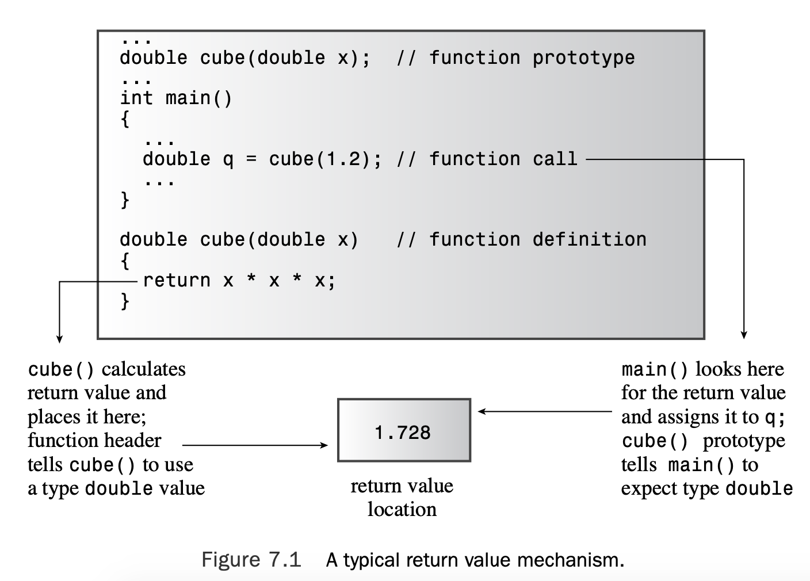
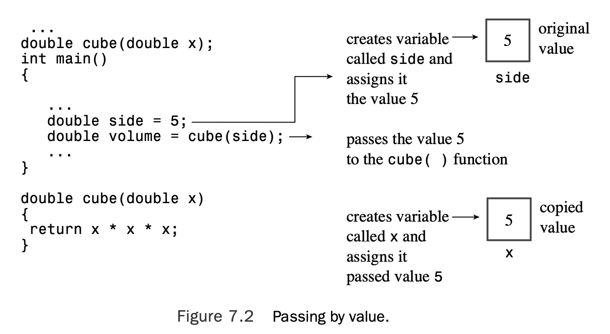
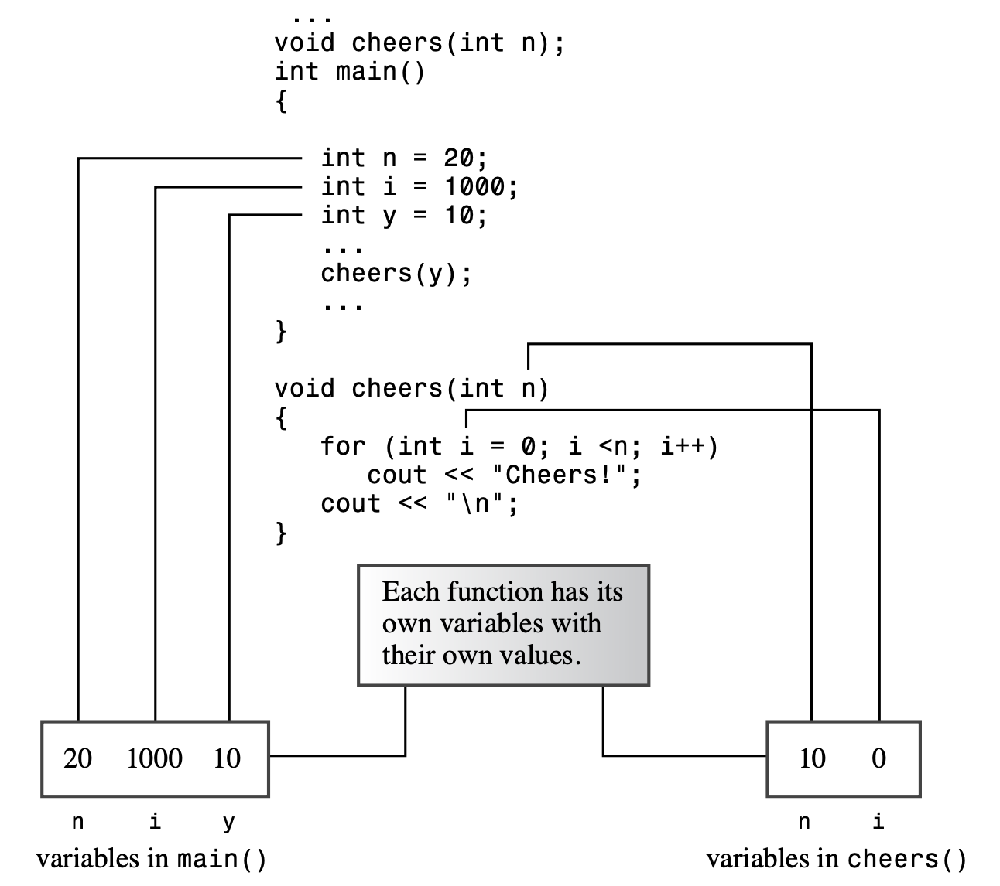
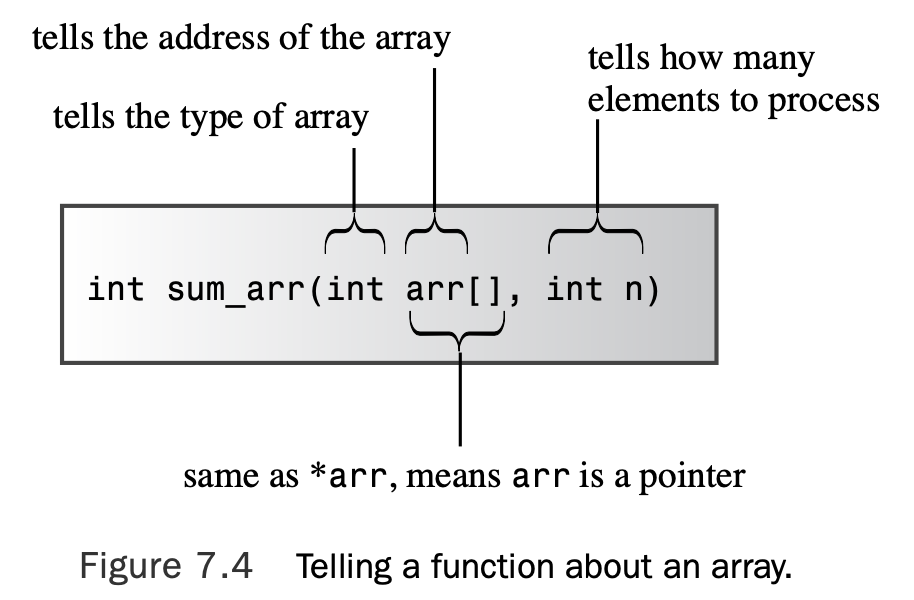
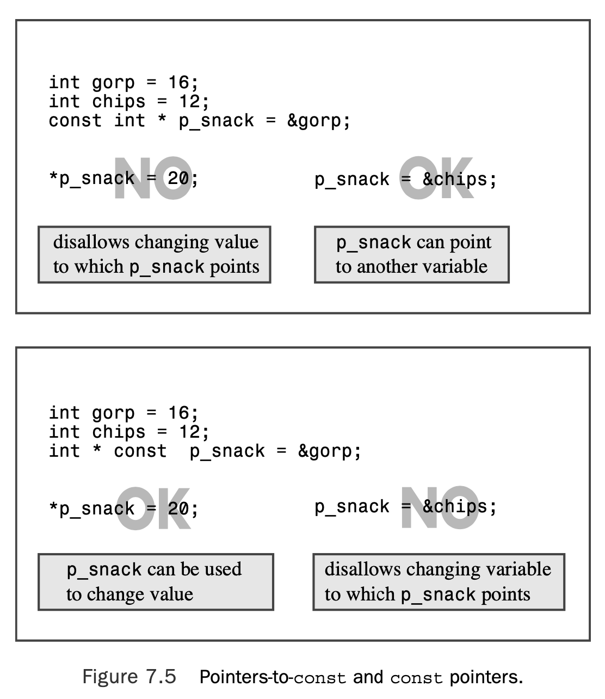
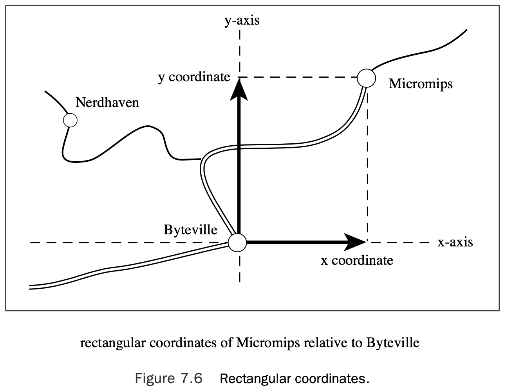
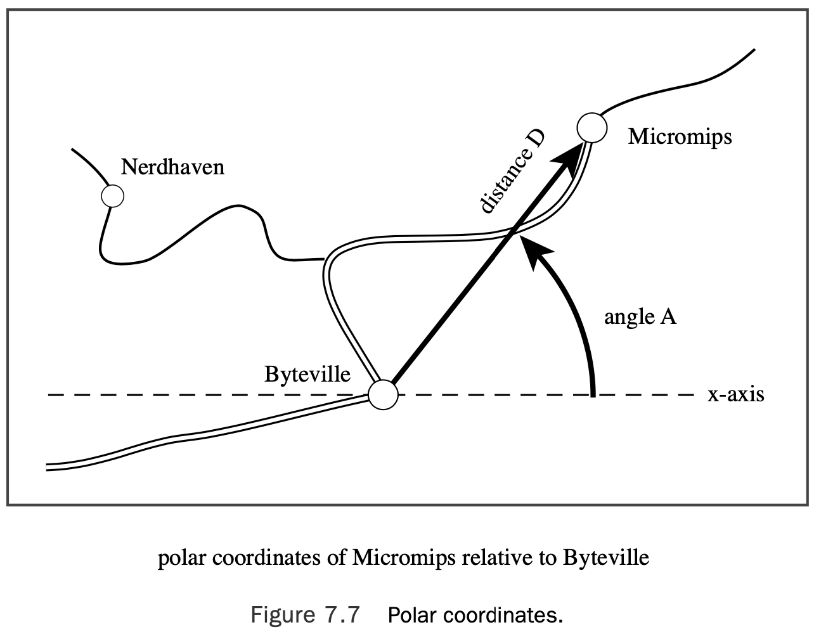

# Chapter 7 Functions: C++’s Programming Modules

[TOC]

## Function Review

To use a C++ function, you must do the following:

* Provide a function definition
* Provide a function prototype
* Call the function

```c++
// calling.cpp -- defining, prototyping, and calling a function
#include <iostream>
void simple();      // function prototype
int main() 
{
    using namespace std;
    cout << "main() will call the simple() function:\n"; 
    simple();       // function call
        cout << "main() is finished with the simple() function.\n"; 
    // cin.get();
    return 0; 
}

// function definition 
void simple()
{
    using namespace std;
    cout << "I'm but a simple function.\n"; 
}
```

Here’s the output of the program in Listing 7.1:

```c++
main() will call the simple() function:
I'm but a simple function.
main() is finished with the simple() function.
```

### Defining a Function

You can group functions into two categories: those that don’t have return values and those that do. Functions without return values are termed type `void` functions and have the following general form:

```c++
void functionName(parameterList) 
{
	statement(s)
	return; 		// optional 
}
```

Here **parameterList** specifies the types and number of arguments (parameters) passed to the function. The optional return statement marks the end of the function. Typically, you use a void function to perform some sort of action. For example, a function to print **Cheers!** a given number (`n`) of times could look like this:

```c++
void cheers(int n) 		// no return value 
{
	for (int i = 0; i < n; i++) 
    	std::cout << "Cheers! ";
	std::cout << std::endl; 
}
```

The `int n` parameter list means that `cheers()` expects to have an int value passed to it as an argument when you call this function.

A function with a return value produces a value that it returns to the function that called it. Here is the general form:

```c++
typeName functionName(parameterList) 
{
    statements
    return value; 	// value is type cast to type typeName
}
```

Functions with return values require that you use a return statement so that the value is returned to the calling function. The only requirement is that the expression reduces to a value that has, or is convertible to, the **typeName** type. C++ does place a restriction on what types you can use for a return value: **The return value cannot be an array**. Everything else is possible—**integers, floating-point numbers, pointers, and even structures and objects**! (Interestingly, even though a C++ function can’t return an array directly, it can return an array that’s part of a structure or object.)

Typically, a function returns a value by copying the return value to a specified CPU register or memory location. Both the returning function and the calling function have to agree on the type of data at that location.The function prototype tells the calling program what to expect, and the function definition tells the called program what to return (see Figure 7.1).



A function terminates after executing a return statement. If a function has more than one return statement—for example, as alternatives to different `if else` selections—the function terminates after it executes the first return statement it reaches. 

```c++
int bigger(int a, int b) 
{
    if (a > b )
    	return a; // if a > b, function terminates here
    else
    	return b; // otherwise, function terminates here
}
```

### Prototyping and Calling a Function

```c++

// protos.cpp -- using prototypes and function calls 
#include <iostream>
void cheers(int);       // prototype: no return value 
double cube(double x);  // prototype: returns a double 
int main()
{
    using namespace std;
    cheers(5);          // function call
    cout << "Give me a number: ";
    double side;
    cin >> side;
    double volume = cube(side);     // function call
    cout << "A " << side <<"-foot cube has a volume of "; 
    cout << volume << " cubic feet.\n";
    cheers(cube(2));    // prototype protection at work 
    return 0;
}

void cheers(int n) 
{
    using namespace std;
    for (int i = 0; i < n; i++)
        cout << "Cheers! "; 
    cout << endl;
}

double cube(double x) 
{
    return x * x * x; 
}
```

The program in Listing 7.2 places a `using` directive in only those functions that use the members of the `std` namespace. Here’s a sample run:

```c++
Cheers! Cheers! Cheers! Cheers! Cheers! 
Give me a number: 5
A 5-foot cube has a volume of 125 cubic feet.
Cheers! Cheers! Cheers! Cheers! Cheers! Cheers! Cheers! Cheers! 
```

#### Why Prototypes?

A prototype describes the function interface to the compiler.That is, it tells the compiler what type of return value, if any, the function has, and it tells the compiler the number and type of function arguments. 

Can’t it just look further in the file and see how the functions are defined? One problem with that approach is that it is not very efficient.The compiler would have to put compiling `main() `on hold while searching the rest of the file.An even more serious problem is the fact that the function might not even be in the file. 

The only way to avoid using a function prototype is to place the function definition before its first use. That is not always possible. Also the C++ programming style is to put `main()` first because it generally provides the structure for the whole program.

#### Prototype Syntax

A function prototype is a statement, so it must have a terminating semicolon.The simplest way to get a prototype is to copy the function header from the function definition and add a semicolon.

However, the function prototype does not require that you provide names for the vari- ables; a list of types is enough. The program in Listing 7.2 prototypes cheers() by using only the argument type:

```c++
void cheers(int); // okay to drop variable names in prototype
```

#### What Prototypes Do for You

In particular, prototypes ensure the following:

* The compiler correctly handles the function return value.
* The compiler checks that you use the correct number of function arguments.
* The compiler checks that you use the correct type of arguments. If you don’t, it converts the arguments to the correct type, if possible.

## Function Arguments and Passing by Value

C++ normally passes arguments **by value**.That means the numeric value of the argument is passed to the function, where it is assigned to a new variable. For example, Listing 7.2 has this function call:

```c++
double volume = cube(side);
```

Here side is a variable that, in the sample run, had the value `5`.The function header for

`cube()`, recall, was this: 

```c++
double cube(double x)
```

When this function is called, it creates a new type `double` variable called `x` and initializes it with the value `5`. This insulates data in `main()` from actions that take place in `cube() `because `cube()` works with a copy of `side` rather than with the original data.

A variable that’s used to receive passed values is called a **formal argument** or **formal parameter**. The value passed to the function is called the **actual argument** or **actual parameter**.

Using this terminology, argument passing initializes the parameter to the argument (see Figure 7.2).



Variables, including parameters, declared within a function are private to the function. When a function is called, the computer allocates the memory needed for these variables. When the function terminates, the computer frees the memory that was used for those variables. Such variables are called **local variables** because they are localized to the function.It also means that if you declare a variable called x in main() and another variable called x in some other function, these are two distinct, unre- lated variables, much as the Albany in California is distinct from the Albany in New York (see Figure 7.3). 



### Multiple Arguments

A function can have more than one argument. In the function call, you just separate the arguments with commas:

```c++
n_chars('R', 25);
```

This passes two arguments to the function `n_chars()`, which will be defined shortly.

Similarly, when you define the function, you use a comma-separated list of parameter

declarations in the function header:

```c++
void n_chars(char c, int n) // two arguments
```

```c++
// twoarg.cpp -- a function with 2 arguments 
#include <iostream>
using namespace std;
void n_chars(char, int);
int main() 
{
    int times; 
    char ch;

    cout << "Enter a character: ";
    cin >> ch;
    while (ch != 'q') // q to quit 
    {
        cout << "Enter an integer: ";
        cin >> times;
        n_chars(ch, times); // function with two arguments 
        cout << "\nEnter another character or press the"
                " q-key to quit: "; 
        cin >> ch;
    }
    cout << "The value of times is " << times << ".\n"; 
    cout << "Bye\n";
    return 0;
}

void n_chars(char c, int n) // displays c n times 
{
    while (n-- > 0) // continue until n reaches 0 
        cout << c;
}
```

The program in Listing 7.3 illustrates placing a `using` directive above the function definitions rather than within the functions. Here is a sample run:

```c++
Enter a character: W
Enter an integer: 50
WWWWWWWWWWWWWWWWWWWWWWWWWWWWWWWWWWWWWWWWWWWWWWWWWW
Enter another character or press the q-key to quit: a
Enter an integer: 20
aaaaaaaaaaaaaaaaaaaa
Enter another character or press the q-key to quit: q
The value of times is 20.
Bye
```

### Another Two-Argument Function

If you have to pick six values out of 51, mathematics says that you have one chance in R of winning, where the following formula gives R:

$$
R=\dfrac{51\times50\times49\times48\times47\times46}{6\times5\times4\times3\times2\times1}
$$
you can use a for loop to make that calculation:

```c++
long double result = 1.0;
for (n = numbers, p = picks; p > 0; n--, p--)
	result = result * n / p ;
```

> Some C++ implementations don’t support type `long double`. If your implementation falls into that category, try ordinary `double` instead.

```c++
// lotto.cpp -- probability of winning
#include <iostream>
// Note: some implementations require double instead of long double 
long double probability(unsigned numbers, unsigned picks);
int main()
{
    using namespace std;
    double total, choices;
    cout << "Enter the total number of choices on the game card and\n"
            "the number of picks allowed:\n";
    while ((cin >> total >> choices) && choices <= total) 
    {
        cout << "You have one chance in ";
        cout << probability(total, choices);        // compute the odds
        cout << " of winning.\n";
        cout << "Next two numbers (q to quit): ";
    }
    cout << "bye\n"; 
    return 0;
}

// the following function calculates the probability of picking picks 
// numbers correctly from numbers choices
long double probability(unsigned numbers, unsigned picks)
{
    long double result = 1.0; // here come some local variables 
    long double n;
    unsigned p;

    for (n = numbers, p = picks; p > 0; n--, p--) 
        result = result * n / p ;
    return result; 
}
```

Here’s a sample run of the program in Listing 7.4:

```c++
Enter the total number of choices on the game card and
the number of picks allowed:
49 6
You have one chance in 1.39838e+07 of winning.
Next two numbers (q to quit): 2 1
You have one chance in 2 of winning.
Next two numbers (q to quit): q
bye
```

## Functions and Arrays

The only new ingredient here is that you have to declare that one of the formal arguments is an array name. Let’s see what that and the rest of the function header look like:

```c++
int sum_arr(int arr[], int n) // arr = array name, n = size
```

But things are not always as they seem: `arr` is not really an array; it’s a pointer!

```c++
// arrfun1.cpp -- functions with an array argument 
#include <iostream>
const int ArSize = 8;
int sum_arr(int arr[], int n);          // prototype
int main() 
{
    using namespace std;
    int cookies[ArSize] = {1,2,4,8,16,32,64,128}; 
// some systems require preceding int with static to 
// enable array initialization
    int sum = sum_arr(cookies, ArSize);
    cout << "Total cookies eaten: " << sum << "\n"; 
    return 0;
}

// return the sum of an integer array 
int sum_arr(int arr[], int n)
{
    int total = 0;

    for (int i = 0; i < n; i++) 
        total = total + arr[i];
    return total; 
}
```

Here is the output of the program in Listing 7.5:

```c++
Total cookies eaten: 255
```

### How Pointers Enable Array-Processing Functions

Listing 7.5 makes the following function call:

```c++
int sum = sum_arr(cookies, ArSize);
```

Here `cookies` is the name of an array, hence by C++ rules `cookies` is the address of the array’s first element.The function passes an address. Because the array has type `int` elements,cookies must be type pointer-to-`int`, or `int *`.This suggests that the correct function header should be this:

```c++
int sum_arr(int * arr, int n) // arr = array name, n = size
```

Here `int *arr` has replaced `int arr[]`. 

Whether `arr` is a pointer or an array name, the expression `arr[3]` means the fourth element of the array. And it probably will do no harm at this point to remind you of the following two identities:

```c++
arr[i] == *(ar + i) // values in two notations 
&arr[i] == ar + i // addresses in two notations
```

### The Implications of Using Arrays as Arguments

Listing 7.5 doesn’t really pass the array contents to the function. Instead, it tells the function where the array is (the address), what kind of elements it has (the type), and how many elements it has (the n variable). (See Figure 7.4.) 



If you pass an ordinary variable, the function works with a copy. But if you pass an array, the function works with the original. 

The overhead for using copies can be prohibitive if you’re working with large arrays.With copies, not only does a program need more computer memory, but it has to spend time copying large blocks of data. On the other hand, working with the original data raises the possibility of inadvertent data corruption.

```c++

// arrfun2.cpp -- functions with an array argument 
#include <iostream>
const int ArSize = 8;
int sum_arr(int arr[], int n);
// use std:: instead of using directive 
int main()
{
    int cookies[ArSize] = {1,2,4,8,16,32,64,128};
// some systems require preceding int with static to 
// enable array initialization
    std::cout << cookies << " = array address, ";
// some systems require a type cast: unsigned (cookies)

    std::cout << sizeof cookies << " = sizeof cookies\n";
    int sum = sum_arr(cookies, ArSize);
    std::cout << "Total cookies eaten: " << sum << std::endl; 
    sum = sum_arr(cookies, 3); // a lie
    std::cout << "First three eaters ate " << sum << " cookies.\n"; 
    sum = sum_arr(cookies + 4, 4); // another lie
    std::cout << "Last four eaters ate " << sum << " cookies.\n"; 
    return 0;
}

// return the sum of an integer array 
int sum_arr(int arr[], int n)
{
    int total = 0;
    std::cout << arr << " = arr, ";
// some systems require a type cast: unsigned (arr)
    std::cout << sizeof arr << " = sizeof arr\n"; 
    for (int i = 0; i < n; i++)
        total = total + arr[i]; 
    return total;
}
```

Here’s the output of the program in Listing 7.6:

```c++
0x7ffee48a1a80 = array address, 32 = sizeof cookies
0x7ffee48a1a80 = arr, 8 = sizeof arr
Total cookies eaten: 255
0x7ffee48a1a80 = arr, 8 = sizeof arr
First three eaters ate 7 cookies.
0x7ffee48a1a90 = arr, 8 = sizeof arr
Last four eaters ate 240 cookies.
```

### More Array Function Examples

#### Filling the Array

```c++
int fill_array(double ar[], int limit)
{
	using namespace std; 
    double temp;
	int i;
	for (i = 0; i < limit; i++) 
    {
		cout << "Enter value #" << (i + 1) << ": ";
        cin >> temp;
		if (!cin) // bad input 
        {
			cin.clear();
			while (cin.get() != '\n')
				continue;
			cout << "Bad input; input process terminated.\n";
            break; 
        }
		else if (temp < 0)
            break;
		ar[i] = temp; 
    }
	return i; 
}
```

#### Showing the Array and Protecting It with `const`

To keep a function from accidentally altering the contents of an array argument, you can use the keyword `const` (discussed in Chapter 3,“Dealing with Data”) when you declare the formal argument:

```c++
void show_array(const double ar[], int n);
```

Note that this doesn’t mean that the original array needs be constant; it just means that you can’t use `ar` in the `show_array()` function to change the data.

 Meanwhile, here is the code for the `show_array()` function:

```c++
void show_array(const double ar[], int n) 
{
    using namespace std;
    for (int i = 0; i < n; i++) 
    {
        cout << "Property #" << (i + 1) << ": $"; 
        cout << ar[i] << endl;
    } 
}
```

#### Modifying the Array

The third operation for the array in this example is multiplying each element by the same revaluation factor.You need to pass three arguments to the function: the factor, the array, and the number of elements. No return value is needed, so the function can look like this:

```c++
void revalue(double r, double ar[], int n) 
{
    for (int i = 0; i < n; i++) 
        ar[i] *= r;
}
```

#### Putting the Pieces Together

```c++
// arrfun3.cpp -- array functions and const 
#include <iostream>
const int Max = 5;
// function prototypes
int fill_array(double ar[], int limit);
void show_array(const double ar[], int n); // don't change data 
void revalue(double r, double ar[], int n);

int main() 
{
    using namespace std; 
    double properties[Max];

    int size = fill_array(properties, Max); 
    show_array(properties, size);
    if (size > 0)
    {
        cout << "Enter revaluation factor: "; 
        double factor;
        while (!(cin >> factor)) // bad input 
        {
            cin.clear();
            while (cin.get() != '\n')
                continue;
            cout << "Bad input; Please enter a number: ";
        }
        revalue(factor, properties, size); 
        show_array(properties, size);
    }
    cout << "Done.\n"; 
    cin.get(); 
    cin.get();
    return 0;
}

int fill_array(double ar[], int limit)
{
	using namespace std; 
    double temp;
	int i;
	for (i = 0; i < limit; i++) 
    {
		cout << "Enter value #" << (i + 1) << ": ";
        cin >> temp;
		if (!cin) // bad input 
        {
			cin.clear();
			while (cin.get() != '\n')
				continue;
			cout << "Bad input; input process terminated.\n";
            break; 
        }
		else if (temp < 0)
            break;
		ar[i] = temp; 
    }
	return i; 
}

// the following function can use, but not alter, 
// the array whose address is ar
void show_array(const double ar[], int n) 
{
    using namespace std;
    for (int i = 0; i < n; i++) 
    {
        cout << "Property #" << (i + 1) << ": $"; 
        cout << ar[i] << endl;
    } 
}

// multiplies each element of ar[] by r
void revalue(double r, double ar[], int n) 
{
    for (int i = 0; i < n; i++) 
        ar[i] *= r;
}
```

Here are two sample runs of the program in Listing 7.7:

```c++
Enter value #1: 100000
Enter value #2: 80000
Enter value #3: 222000
Enter value #4: 240000
Enter value #5: 118000
Property #1: $100000
Property #2: $80000
Property #3: $222000
Property #4: $240000
Property #5: $118000
Enter revaluation factor: 0.8
Property #1: $80000
Property #2: $64000
Property #3: $177600
Property #4: $192000
Property #5: $94400
Done.
```

### Functions Using Array Ranges

There is another approach to giving a function the information it needs: specify a *range* of elements.This can be done by passing two pointers—one identifying the start of the array and one identifying the end of the array.For example, suppose you have this declaration:

```c++
double elbuod[20];
```

Then the two pointers elbuod and elbuod + 20 define the range. 

```c++
// arrfun4.cpp -- functions with an array range 
#include <iostream>
const int ArSize = 8;
int sum_arr(const int * begin, const int * end); 
int main()
{
    using namespace std;
    int cookies[ArSize] = {1,2,4,8,16,32,64,128};
// some systems require preceding int with static to
// enable array initialization

    int sum = sum_arr(cookies, cookies + ArSize);
    cout << "Total cookies eaten: " << sum << endl;
    sum = sum_arr(cookies, cookies + 3);        // first 3 elements 
    cout << "First three eaters ate " << sum << " cookies.\n";
    sum = sum_arr(cookies + 4, cookies + 8);    // last 4 elements 
    cout << "Last four eaters ate " << sum << " cookies.\n"; 
    return 0;
}

// return the sum of an integer array
int sum_arr(const int * begin, const int * end) 
{
    const int * pt; 
    int total = 0;
    
    for (pt = begin; pt != end; pt++) 
        total = total + *pt;
    return total; 
}
```

Here’s the output of the program in Listing 7.8:

```c++
Total cookies eaten: 255
First three eaters ate 7 cookies.
Last four eaters ate 240 cookies.
```

Notice how the different function calls specify different ranges within the array:

```c++
int sum = sum_arr(cookies, cookies + ArSize);
...
sum = sum_arr(cookies, cookies + 3); 		// first 3 elements 
...
sum = sum_arr(cookies + 4, cookies + 8); 	// last 4 elements
```

The pointer value `cookies + ArSize` points to the location following the last element. (The array has `ArSize` elements, so `cookies[ArSize - 1]` is the last element, and its address is `cookies + ArSize - 1`.) So the range `cookies`, `cookies + ArSize` specifies the entire array. Similarly, `cookies`, `cookies + 3` specifies the first three elements, and so on.

### Pointers and `const`

You can use the `const` keyword two different ways with pointers.The first way is to make a pointer point to a constant object, and that prevents you from using the pointer to change the pointed-to value.The second way is to make the pointer itself constant, and that prevents you from changing where the pointer points.

First, let’s declare a pointer `pt` that points to a constant:

```c++
int age = 39;
const int * pt = &age;
```

This declaration states that `pt` points to a `const int` (39, in this case). Therefore, you can’t use `pt` to change that value. In other words, the value `*pt` is `const` and cannot be modified:

```c++
*pt += 1; 		// INVALID because pt points to a const 
int cin >> *pt; // INVALID for the same reason
```

`pt` points to `age`, and `age` is not `const`. You can change the value of `age` directly by using the `age` variable, but you can’t change the value indirectly via the `pt` pointer:

```c++
*pt = 20; 		// INVALID because pt points to a const int
age = 20; 		// VALID because age is not declared to be const
```

Previous examples have assigned the address of a regular variable to a regular pointer. This example assigns the address of a regular variable to a pointer-to-`const.That` leaves two other possibilities: assigning the address of a `const` variable to a pointer-to-const and assigning the address of a `const` to a regular pointer. 

```c++
const float g_earth = 9.80;
const float * pe = &g_earth; 	// VALID

const float g_moon = 1.63;
float * pm = &g_moon; 			// INVALID
```

For the first case, you can use neither `g_earth` nor `pe` to change the value 9.80. C++ doesn’t allow the second case for a simple reason: If you can assign the address of `g_moon` to pm, then you can cheat and use `pm` to alter the value of `g_moon`. That makes a mockery of `g_moon`’s `const` status, so C++ prohibits you from assigning the address of a `const` to a non-`const` pointer. 

But pointer assignments that mix `const` and non-`const` in this manner are no longer safe when you go to two levels of indirection. If mixing `const` and non-`const` were allowed, you could do something like this:

```c++
const int **pp2;
int *p1;
const int n = 13;
pp2 = &p1; 	// not allowed, but suppose it were
*pp2 = &n; 	// valid, both const, but sets p1 to point at n 
*p1 = 10; 	// valid, but changes const n
```

Here the code assigns a non-`const` address (`&pl`) to a const pointer (`pp2`), and that allows pl to be used to alter `const` data. So the rule that you can assign a non-`const` address or pointer to a `const` pointer works only if there is just one level of indirection— for example, if the pointer points to a fundamental data type.

Suppose you have an array of `const` data:

```c++
const int months[12] = {31,28,31,30,31,30, 31, 31,30,31,30,31};
```

The prohibition against assigning the address of a constant array means that you can- not pass the array name as an argument to a function by using a non-constant formal argument:

```c++
int sum(int arr[], int n); // should have been const int arr[] 
...
int j = sum(months, 12); // not allowed
```

This function call attempts to assign a `const` pointer (`months`) to a non-`const` pointer (`arr`), and the compiler disallows the function call.

> There are two strong reasons to declare pointer arguments as pointers to constant data:
>
> * It protects you against programming errors that inadvertently alter data.
> * Using `const` allows a function to process both `const` and non-`const` actual arguments, whereas a function that omits `const` in the prototype can accept only non- `const` data.

```c++
int sloth = 3;
const int * ps = &sloth; 		// a pointer to const int 
int * const finger = &sloth; 	// a const pointer to int
```

Note that the last declaration has repositioned the keyword `const.This` form of declaration constrains `finger` to point only to `sloth`. However, it allows you to use `finger` to alter the value of `sloth.The` middle declaration does not allow you to use `ps` to alter the value of `sloth`, but it permits you to have `ps` point to another location. In short, `finger` and `*ps` are both `const`, and `*finger` and `ps` are not `const` (see Figure 7.5).



If you like, you can declare a `const` pointer to a `const` object:

```c++
double trouble = 2.0E30;
const double * const stick = &trouble;
```

Here `stick` can point only to `trouble`, and `stick` cannot be used to change the value of `trouble`. In short, both `stick` and `*stick` are `const`.

## Functions and Two-Dimensional Arrays

Suppose, for example, that you start with this code:

```c++
int data[3][4] = {{1,2,3,4}, {9,8,7,6}, {2,4,6,8}}; 
int total = sum(data, 3);
```

Well, data is the name of an array with three elements. The first element is, itself, an array of four `int` values.Thus, the type of `data` is **pointer-to-array-of-four-`int`**, so an appropriate prototype would be this:

```c++
int sum(int (*ar2)[4], int size);
```

he parentheses are needed because the following declaration would declare an array of **four pointers-to-int** instead of a **single pointer-to-array-of-four-int**, and a function parameter cannot be an array:

```c++
int *ar2[4]
```

Here’s an alternative format that means exactly the same thing as this first prototype, but, perhaps, is easier to read:

```c++
int sum(int ar2[][4], int size);
```

Given that the parameter `ar2` is a pointer to an array, how do you use it in the function definition? The simplest way is to use `ar2` as if it were the name of a two-dimensional array. Here’s a possible function definition:

```c++
int sum(int ar2[][4], int size) 
{
    int total = 0;
    for (int r = 0; r < size; r++)
    	for (int c = 0; c < 4; c++) 
            total += ar2[r][c];
    return total; 
}
```

The simplest way is to use brackets twice, as in `ar2[r][c]`. But it is possible, if ungainly, to use the `*` operator twice:

```c++
ar2[r][c] == *(*(ar2 + r) + c) // same thing
```

To understand this, you can work out the meaning of the subexpressions from the inside out:

```c++
ar2					// pointer to first row of an array of 4 int
ar2 + r 			// pointer to row r (an array of 4 int)
*(ar2 + r)			// row r (an array of 4 int, hence the name of an array, 
    				// thus a pointer to the first int in the row, i.e., ar2[r]
*(ar2 +r) + c 		// pointer int number c in row r, i.e., ar2[r] + c 
*(*(ar2 + r) + c)	// value of int number c in row r, i.e. ar2[r][c]
```

## Functions and C-Style Strings

### Functions with C-Style String Arguments

Suppose you want to pass a string as an argument to a function.You have three choices for representing a string:

* An array of `char`
* A quoted string constant (also called a **string literal**)
* A pointer-to-`char` set to the address of a string

```c++
// strgfun.cpp -- functions with a string argument
#include <iostream>
unsigned int c_in_str(const char * str, char ch); 
int main()
{
    using namespace std; 
    char mmm[15] = "minimum";   // string in an array
// some systems require preceding char with static to
// enable array initialization

	char *wail = "ululate"; // wail points to string

    unsigned int ms = c_in_str(mmm, 'm');
    unsigned int us = c_in_str(wail, 'u');
    cout << ms << " m characters in " << mmm << endl; 
    cout << us << " u characters in " << wail << endl; 
    return 0;
}

// this function counts the number of ch characters 
// in the string str
unsigned int c_in_str(const char * str, char ch)
{
    unsigned int count = 0;

    while (*str)        // quit when *str is '\0'
    {
        if (*str == ch)
            count++;
        str++;          // move pointer to next char 
    }
    return count; 
}
```

Here’s the output of the program in Listing 7.9:

```c++
3 m characters in minimum
2 u characters in ululate
```

### Functions That Return C-Style Strings

Now suppose you want to write a function that returns a string.Well, a function can’t do that. But it can return the address of a string, and that’s more efficient. 

```c++
// strgback.cpp -- a function that returns a pointer to char 
#include <iostream>
char * buildstr(char c, int n); // prototype
int main()
{
    using namespace std; 
    int times;
    char ch;
    cout << "Enter a character: "; 
    cin >> ch;
    cout << "Enter an integer: "; 
    cin >> times;
    char *ps = buildstr(ch, times); 
    cout << ps << endl;
    delete [] ps;                   // free memory
    ps = buildstr('+', 20);         // reuse pointer
    cout << ps << "-DONE-" << ps << endl;
    delete [] ps;                   // free memory
    return 0;
}

// builds string made of n c characters 
char * buildstr(char c, int n)
{
    char * pstr = new char[n + 1];
    pstr[n] = '\0'; // terminate string 
    while (n-- > 0)
        pstr[n] = c; // fill rest of string 
    return pstr;
}
```

Here’s a sample run of the program in Listing 7.10:

```c++
Enter a character: V
Enter an integer: 46
VVVVVVVVVVVVVVVVVVVVVVVVVVVVVVVVVVVVVVVVVVVVVV
++++++++++++++++++++-DONE-++++++++++++++++++++
```

In Listing 7.10, the following loop cycles `n` times as `n` decreases to `0`, filling `n` elements:

```c++
while (n-- > 0) 
    pstr[n] = c;
```

At the start of the final cycle, `n` has the value `1`. Because `n--` means use the value and then decrement it, the `while` loop test condition compares `1` to `0`, finds the test to be `true`, and continues. But after making the test, the function decrements `n` to `0`, so `pstr[0]` is the last element set to c.The reason for filling the string from back to front instead of front to back is to avoid using an additional variable. Using the other order would involve something like this:

```c++
int i = 0; 
while (i < n)
	pstr[i++] = c;
```

## Functions and Structures

### Passing and Returning Structures

Let’s develop a structure to represent a time value and then a function that takes two such structures as arguments and returns a structure that represents their sum.

```c++
struct travel_time 
{
    int hours;
    int mins; 
};
```

Next, consider the prototype for a `sum()` function that returns the sum of two such structures.The return value should be type `travel_time`, and so should the two arguments. Thus, the prototype should look like this:

```c++
travel_time sum(travel_time t1, travel_time t2);
```

```c++
// travel.cpp -- using structures with functions 
#include <iostream>
struct travel_time
{
    int hours;
    int mins; 
};
const int Mins_per_hr = 60;

travel_time sum(travel_time t1, travel_time t2); 
void show_time(travel_time t);

int main() 
{
    using namespace std;
    travel_time day1 = {5, 45}; // 5 hrs, 45 min
    travel_time day2 = {4, 55}; // 4 hrs, 55 min

    travel_time trip = sum(day1, day2);
    cout << "Two-day total: ";
    show_time(trip);

    travel_time day3= {4, 32}; 
    cout << "Three-day total: "; 
    show_time(sum(trip, day3));

    return 0; 
}


travel_time sum(travel_time t1, travel_time t2) 
{
    travel_time total;

    total.mins = (t1.mins + t2.mins) % Mins_per_hr; 
    total.hours = t1.hours + t2.hours +
                 (t1.mins + t2.mins) / Mins_per_hr; 
    return total;
}

void show_time(travel_time t) 
{
    using namespace std;
    cout << t.hours << " hours, "
         << t.mins << " minutes\n";
}
```

Here’s the output of the program in Listing 7.11:

```c++
Two-day total: 10 hours, 40 minutes 
Three-day total: 15 hours, 12 minutes
```

### Another Example of Using Functions with Structures

Suppose you want to describe the position of a point on the screen or a location on a map relative to some origin. One way is to state the horizontal offset and the vertical off- set of the point from the origin.Traditionally, mathematicians use the symbol x to repre- sent the horizontal offset and y to represent the vertical offset (see Figure 7.6).



You can define a structure consisting of two coordinates to represent a position:

```c++
struct rect 
{
	double x; 		// horizontal distance from origin
    double y;		// vertical distance from origin
};
```

A second way to describe the position of a point is to state how far it is from the origin and in what direction it is (for example, 40 degrees north of east).Traditionally, mathematicians have measured the angle counterclockwise from the positive horizontal axis (see Figure 7.7).



```c++
struct polar 
{
	double distance; 	// distance from origin
    double angle;		// direction from origin
}; 
```

The math functions in the C++ library (borrowed from C) assume that angles are in radians, so you need to measure angles in that unit. But for display purposes, you can convert radian measure to degrees.This means multiplying by $180/\pi$, which is approximately $57.29577951$. Here’s the function:

```c++
// show polar coordinates, converting angle to degrees 
void show_polar (polar dapos)
{
    using namespace std;
    const double Rad_to_deg = 57.29577951;

    cout << "distance = " << dapos.distance;
    cout << ", angle = " << dapos.angle * Rad_to_deg; 
    cout << " degrees\n";
}
```

You can use the Pythagorean theorem to get the distance from the horizontal and vertical components:

```c++
distance = sqrt( x * x + y * y)
```

The `atan2()` function from the math library calculates the angle from the x and y values:

```c++
angle = atan2(y, x)
```

Given these formulas, you can write the function as follows:

```c++
// convert rectangular to polar coordinates polar 
rect_to_polar(rect xypos) 	// type polar 
{
	polar answer;
    
    answer.distance =
    	sqrt( xypos.x * xypos.x + xypos.y * xypos.y);
    answer.angle = atan2(xypos.y, xypos.x);
    return answer; 			// returns a polar structure 
}
```

```c++

// strctfun.cpp -- functions with a structure argument 
#include <iostream>
#include <cmath>
// structure declarations 
struct polar
{
    double distance;    // distance from origin
    double angle;       // direction from origin
};
struct rect
{
    double x;           // horizontal distance from origin
    double y;           // vertical distance from origin
};

// prototypes
polar rect_to_polar(rect xypos); 
void show_polar(polar dapos);

int main() 
{
    using namespace std; 
    rect rplace;
    polar pplace;

    cout << "Enter the x and y values: ";
    while (cin >> rplace.x >> rplace.y)     // slick use of cin 
    {
        pplace = rect_to_polar(rplace); 
        show_polar(pplace);
        cout << "Next two numbers (q to quit): ";
    }
    cout << "Done.\n"; 
    return 0;
}

// convert rectangular to polar coordinates 
polar rect_to_polar(rect xypos)
{
    using namespace std; 
    polar answer;

    answer.distance =
        sqrt( xypos.x * xypos.x + xypos.y * xypos.y);
    answer.angle = atan2(xypos.y, xypos.x);
    return answer;      // returns a polar structure 
}

// show polar coordinates, converting angle to degrees 
void show_polar (polar dapos)
{
    using namespace std;
    const double Rad_to_deg = 57.29577951;

    cout << "distance = " << dapos.distance;
    cout << ", angle = " << dapos.angle * Rad_to_deg; 
    cout << " degrees\n";
}
```

Here is a sample run of the program in Listing 7.12:

```c++
Enter the x and y values: 30 40
distance = 50, angle = 53.1301 degrees
Next two numbers (q to quit): -100 100
distance = 141.421, angle = 135 degrees
Next two numbers (q to quit): q
Done.
```

### Passing Structure Addresses

First, let’s look at how you rewrite the `show_polar()` function.You need to make three changes:

* When calling the function, pass it the address of the structure (`&pplace`) rather than the structure itself (`pplace`).
* Declare the formal parameter to be a pointer-to-`polar`—that is, type `polar *`. Because the function shouldn’t modify the structure, use the `const` modifier.
* Because the formal parameter is a pointer instead of a structure, use the indirect membership operator (`->`) rather than the membership operator (dot).

```c++
// show polar coordinates, converting angle to degrees 
void show_polar (const polar * pda)
{
    using namespace std;
    const double Rad_to_deg = 57.29577951;
    
    cout << "distance = " << pda->distance;
    cout << ", angle = " << pda->angle * Rad_to_deg; 
    cout << " degrees\n";
}
```

```c++
// strctptr.cpp -- functions with pointer to structure arguments
#include <iostream> 
#include <cmath>

// structure templates
struct polar
{
    double distance;    // distance from origin
    double angle;       // direction from origin
};
struct rect
{
    double x;           // horizontal distance from origin
    double y;           // vertical distance from origin
};

// prototypes
void rect_to_polar(const rect * pxy, polar * pda); 
void show_polar (const polar * pda);

int main() 
{
    using namespace std; 
    rect rplace;
    polar pplace;
    cout << "Enter the x and y values: "; 
    while (cin >> rplace.x >> rplace.y) 
    {
        rect_to_polar(&rplace, &pplace);    // pass addresses
        show_polar(&pplace);    // pass address 
        cout << "Next two numbers (q to quit): ";
    }
    cout << "Done.\n"; return 0;
}

// show polar coordinates, converting angle to degrees 
void show_polar (const polar * pda)
{
    using namespace std;
    const double Rad_to_deg = 57.29577951;
    
    cout << "distance = " << pda->distance;
    cout << ", angle = " << pda->angle * Rad_to_deg; 
    cout << " degrees\n";
}

// convert rectangular to polar coordinates
void rect_to_polar(const rect * pxy, polar * pda) 
{
    using namespace std; 
    pda->distance =
        sqrt(pxy->x * pxy->x + pxy->y * pxy->y); 
    pda->angle = atan2(pxy->y, pxy->x);
}
```

## Functions and `string` Class Objects

```c++
// topfive.cpp -- handling an array of string objects 
#include <iostream>
#include <string>
using namespace std;
const int SIZE = 5;
void display(const string sa[], int n); 
int main()
{
    string list[SIZE]; // an array holding 5 string object
    cout << "Enter your " << SIZE << " favorite astronomical sights:\n";

    for (int i = 0; i < SIZE; i++) 
    {
        cout << i + 1 << ": ";
        getline(cin,list[i]); 
    }

    cout << "Your list:\n"; 
    display(list, SIZE);

    return 0; 
}

void display(const string sa[], int n) 
{
    for (int i = 0; i < n; i++)
        cout << i + 1 << ": " << sa[i] << endl;
}
```

Here’s a sample run of the program in Listing 7.14:

```c++
Enter your 5 favorite astronomical sights:
1: Orion Nebula 
2: M13
3: Saturn
4: Jupiter
5: Moon
Your list:
1: Orion Nebula
2: M13
3: Saturn
4: Jupiter
5: Moon
```

The main point to note in this example is that, aside from the `getline()` function, this program treats `string` just as it would treat any of the built-in types, such as `int`. If you want an array of `string`, you just use the usual array-declaration format:

```c++
string list[SIZE]; 		// an array holding 5 string object
```

Each element of the `list` array, then, is a `string` object and can be used as such:

```c++
getline(cin,list[i]);
```

Similarly, the formal argument `sa` is a pointer to a `string` object, so `sa[i]` is a `string` object and can be used accordingly:

```c++
cout << i + 1 << ": " << sa[i] << endl;
```

## Functions and `array` Objects

Suppose we have an `array` object intended to hold expense figures for each of the four seasons of the year:

```c++
std::array<double, 4> expenses;
```

If we want a function to display the contents of `expenses`, we can pass `expenses` by value:

```c++
show(expenses);
```

But if we want a function that modifies the `expenses` object, we need to pass the

address of the object to the function:

```c++
fill(&expenses);
```

The type of expenses is `array<double, 4>`, so that’s what must appear in the prototypes:

```c++
void show(std::array<double, 4> da); 	// da an object
void fill(std::array<double, 4> * pa); 	// pa a pointer to an object
```

```c++
//arrobj.cpp -- functions with array objects (C++11) 
#include <iostream>
#include <array>
#include <string>
// constant data
const int Seasons = 4;
const std::array<std::string, Seasons> Snames =
    {"Spring", "Summer", "Fall", "Winter"};

// function to modify array object
void fill(std::array<double, Seasons> * pa);
// function that uses array object without modifying it 
void show(std::array<double, Seasons> da);

int main() 
{
    std::array<double, Seasons> expenses; 
    fill(&expenses);
    show(expenses);
    return 0;
}

void fill(std::array<double, Seasons> * pa)
{
    using namespace std;
    for (int i = 0; i < Seasons; i++) 
    {
        cout << "Enter " << Snames[i] << " expenses: ";
        cin >> (*pa)[i]; 
    }
}

void show(std::array<double, Seasons> da)
{
    using namespace std;
    double total = 0.0;
    cout << "\nEXPENSES\n";
    for (int i = 0; i < Seasons; i++) 
    {
        cout << Snames[i] << ": $" << da[i] << endl;
        total += da[i]; 
    }
    cout << "Total Expenses: $" << total << endl; 
}
```

Here’s a sample run:

```c++
Enter Spring expenses: 123
Enter Summer expenses: 456
Enter Fall expenses: 789
Enter Winter expenses: 101

EXPENSES
Spring: $123
Summer: $456
Fall: $789
Winter: $101
Total Expenses: $1469
```

## Recursion

### Recursion with a Single Recursive Call

If a recursive function calls itself, then the newly called function calls itself, and so on, ad infinitum unless the code includes something to terminate the chain of calls.

```c++
void recurs(argumentlist) 
{
    statements1 
    if (test)
    	recurs(arguments) 
    statements2
}
```

```c++
// recur.cpp -- using recursion 
#include <iostream>
void countdown(int n);

int main() 
{
    countdown(4);               // call the recursive function
    return 0; 
}

void countdown(int n) 
{
    using namespace std;
    cout << "Counting down ... " << n << endl; 
    if (n > 0)
        countdown(n-1);     // function calls itself 
    cout << n << ": Kaboom!\n";
}
```

Here’s the annotated output of the program in Listing 7.16:

```c++
Counting down ... 4
Counting down ... 3
Counting down ... 2
Counting down ... 1
Counting down ... 0
0: Kaboom!
1: Kaboom!
2: Kaboom!
3: Kaboom!
4: Kaboom!
```

You can verify this for yourself by modifying Listing 7.16 so that it displays the address of n as well as its value:

```c++
cout << "Counting down ... " << n << " (n at " << &n << ")" << endl;
...
cout << n << ": Kaboom!" << "          (n at " << &n << ")" << endl;
```

Doing so produces output like the following:

```c++
Counting down ... 4 (n at 0x7ffee8608a9c)
Counting down ... 3 (n at 0x7ffee8608a7c)
Counting down ... 2 (n at 0x7ffee8608a5c)
Counting down ... 1 (n at 0x7ffee8608a3c)
Counting down ... 0 (n at 0x7ffee8608a1c)
0: Kaboom!          (n at 0x7ffee8608a1c)
1: Kaboom!          (n at 0x7ffee8608a3c)
2: Kaboom!          (n at 0x7ffee8608a5c)
3: Kaboom!          (n at 0x7ffee8608a7c)
4: Kaboom!          (n at 0x7ffee8608a9c)
```

### Recursion with Multiple Recursive Calls

```c++
// ruler.cpp -- using recursion to subdivide a ruler 
#include <iostream>
const int Len = 66;
const int Divs = 6;
 void subdivide(char ar[], int low, int high, int level);
 int main()
{
    char ruler[Len];
    int i;
    for (i = 1; i < Len - 2; i++)
        ruler[i] = ' ';
    ruler[Len - 1] = '\0';
    int max = Len - 2;
    int min = 0;
    ruler[min] = ruler[max] = '|'; 
    std::cout << ruler << std::endl; 
    for (i = 1; i <= Divs; i++)
    {
        subdivide(ruler,min,max, i); 
        std::cout << ruler << std::endl; 
        for (int j = 1; j < Len - 2; j++)
            ruler[j] = ' '; // reset to blank ruler
    }

    return 0;
}

 void subdivide(char ar[], int low, int high, int level)
 {
     if (level == 0)
        return;
    int mid = (high + low) / 2;
    ar[mid] = '|';
    subdivide(ar, low, mid, level - 1);
    subdivide(ar, mid, high, level - 1);
 }
```

Here is the output of the program in Listing 7.17:

```c++
|                                                               |
|                               |                               |
|               |               |               |               |
|       |       |       |       |       |       |       |       |
|   |   |   |   |   |   |   |   |   |   |   |   |   |   |   |   |
| | | | | | | | | | | | | | | | | | | | | | | | | | | | | | | | |
|||||||||||||||||||||||||||||||||||||||||||||||||||||||||||||||||
```

## Pointers to Functions

### Function Pointer Basics

Suppose you want to design an `estimate()` function that estimates the amount of time necessary to write a given number of lines of code, and you want different programmers to use the function. Part of the code for `estimate()` will be the same for all users, but the function will allow each programmer to provide his or her own algorithm for estimating time.The mechanism for that will be to pass to `estimate()` the address of the particular algorithm function the programmer wants to use.To implement this plan, you need to be able to do the following:

* Obtain the address of a function.
* Declare a pointer to a function.
* Use a pointer to a function to invoke the function.

#### Obtaining the Address of a Function

Obtaining the address of a function is simple:You just use the function name without trailing parentheses. That is, if `think()` is a function, then think is the address of the function.

Be sure you distinguish between passing the *address* of a function and passing the **return value** of a function:

```c++
process(think); // passes address of think() to process() 
thought(think()); // passes return value of think() to thought()
```

The `process()` call enables the `process()` function to invoke the `think()` function from within `process()`.The `thought()` call first invokes the `think()` function and then passes the return value of `think()` to the `thought()` function.

#### Declaring a Pointer to a Function

To declare pointers to a data type, the declaration has had to specify exactly to what type the pointer points. For example, suppose Pam LeCoder has written a time-estimating function with the following prototype:

```c++
double pam(int); // prototype
```

Here’s what a declaration of an appropriate pointer type looks like:

```c++
double (*pf)(int); 	// pf points to a function that takes 
					// one int argument and that
					// returns type double
```

Parentheses have a higher precedence than the `*` operator, so `*pf(int)` means `pf()` is a function that returns a pointer, whereas `(*pf)(int)` means pf is a pointer to a function:

```c++
double (*pf)(int); 	// pf points to a function that returns double 
double *pf(int); 	// pf() a function that returns a pointer-to-double
```

After you declare `pf` properly, you can assign to it the address of a matching function:

```c++
double pam(int);
double (*pf)(int);
pf = pam; 			// pf now points to the pam() function
```

Note that `pam()` has to match pf in both signature and return type.The compiler rejects nonmatching assignments:

```c++
double ned(double);
int ted(int);
double (*pf)(int);
pf = ned; // invalid -- mismatched signature 
pf = ted; // invalid -- mismatched return types
```

#### Using a Pointer to Invoke a Function

```c++
double pam(int);
double (*pf)(int);
pf = pam;			// pf now points to the pam() function
double x = pam(4); // call pam() using the function name 
double y = (*pf)(5); // call pam() using the pointer pf
```

Actually, C++ also allows you to use pf as if it were a function name:

```c++
double y = pf(5); // also call pam() using the pointer pf
```

### A Function Pointer Example

```c++
// fun_ptr.cpp -- pointers to functions 
#include <iostream>
double betsy(int);
double pam(int);

// second argument is pointer to a type double function that 
// takes a type int argument
void estimate(int lines, double (*pf)(int));

int main() 
{
    using namespace std; 
    int code;
    cout << "How many lines of code do you need? "; 
    cin >> code;
    cout << "Here's Betsy's estimate:\n"; 
    estimate(code, betsy);
    cout << "Here's Pam's estimate:\n"; 
    estimate(code, pam);
    return 0;
}

double betsy(int lns) 
{
    return 0.05 * lns; 
}

double pam(int lns) 
{
    return 0.03 * lns + 0.0004 * lns * lns; 
}

void estimate(int lines, double (*pf)(int)) 
{
    using namespace std;
    cout << lines << " lines will take "; 
    cout << (*pf)(lines) << " hour(s)\n";
}
```

Here is a sample run of the program in Listing 7.18:

```c++
How many lines of code do you need? 30
Here's Betsy's estimate:
30 lines will take 1.5 hour(s)
Here's Pam's estimate:
30 lines will take 1.26 hour(s)
```

### Variations on the Theme of Function Pointers

To begin, here are prototypes for some functions that share the same signature and return type:

```c++
const double * f1(const double ar[], int n); 
const double * f2(const double [], int); 
const double * f3(const double *, int);
```

if `pa` is the desired pointer, take the prototype for a target function and replace the function name with `(*pa)`:

```c++
const double * (*p1)(const double *, int);
```

This can be combined with initialization:

```c++
const double * (*p1)(const double *, int) = f1;
```

With the C++11 automatic type deduction feature, you can simplify this a bit:

```c++
auto p2 = f2; // C++11 automatic type deduction
```

Now consider the following statements:

```c++
cout << (*p1)(av,3) << ": " << *(*p1)(av,3) << endl; 
cout << p2(av,3) << ": " << *p2(av,3) << endl;
```

Both `(*p1)(av,3)` and `p2(av,3)`, recall, represent calling the pointed-to functions with av and 3 as arguments.To see the actual value stored at the addresses, we need to apply the `*` operator to these addresses, and that’s what the expressions` *(*p1)(av,3)` and `*p2(av,3)` do.

With three functions to work with, it could be handy to have an array of function pointers.

```c++
const double * (*pa[3])(const double *, int) = {f1,f2,f3};
```

Now that we have the array pa, it is simple to declare a pointer of the matching type:

```c++
auto pb = pa;
```

Both `pa[i]` and `pb[i]` represent pointers in the array, so you can use either of the function call notations with either of them:

```c++
const double * px = pa[0](av,3); 
const double * py = (*pb[1])(av,3);
```

And you can apply the `*` operator to get the pointed-to `double` value:

```c++
double x = *pa[0](av,3);
double y = *(*pb[1])(av,3);
```

Because the array name pa already is a pointer to a function pointer, a pointer to the array would be a pointer to a pointer to a pointer.

```c++
auto pc = &pa; // C++11 automatic type deduction
```

This suggests the heart of the declaration should be `(*pd)[3]`. The parentheses bind the pd identifier to the `*`:

```c++
*pd[3] // an array of 3 pointers
(*pd)[3] // a pointer to an array of 3 elements
```

In other words, `pd` is a pointer, and it points to an array of three things.What those things are is described by the rest of the original declaration of pa.This approach yields the following:

```c++
const double *(*(*pd)[3])(const double *, int) = &pa;
```

```c++
// arfupt.cpp -- an array of function pointers 
#include <iostream>
// various notations, same signatures
const double * f1(const double ar[], int n); 
const double * f2(const double [], int); 
const double * f3(const double *, int);

int main() 
{
    using namespace std;
    double av[3] = {1112.3, 1542.6, 2227.9};

    // pointer to a function
    const double *(*p1)(const double *, int) = f1;
    auto p2 = f2; // C++11 automatic type deduction
    // pre-C++11 can use the following code instead
    // const double *(*p2)(const double *, int) = f2; 
    cout << "Using pointers to functions:\n";
    cout << " Address Value\n";
    cout << (*p1)(av,3) << ": " << *(*p1)(av,3) << endl; 
    cout << p2(av,3) << ": " << *p2(av,3) << endl;

    // pa an array of pointers
    // auto doesn't work with list initialization
    const double *(*pa[3])(const double *, int) = {f1,f2,f3}; 
    // but it does work for initializing to a single value 
    // pb a pointer to first element of pa
    auto pb = pa;
    // pre-C++11 can use the following code instead
    // const double *(**pb)(const double *, int) = pa; 
    cout << "\nUsing an array of pointers to functions:\n"; 
    cout << " Address Value\n";
    for (int i = 0; i < 3; i++)
        cout << pa[i](av,3) << ": " << *pa[i](av,3) << endl; 
    cout << "\nUsing a pointer to a pointer to a function:\n"; cout << " Address Value\n";
    for (int i = 0; i < 3; i++)
        cout << pb[i](av,3) << ": " << *pb[i](av,3) << endl;

    // what about a pointer to an array of function pointers 
    cout << "\nUsing pointers to an array of pointers:\n"; 
    cout << " Address Value\n";
    // easy way to declare pc
    auto pc = &pa;
    // pre-C++11 can use the following code instead
    // const double *(*(*pc)[3])(const double *, int) = &pa; 
    cout << (*pc)[0](av,3) << ": " << *(*pc)[0](av,3) << endl; 
    // hard way to declare pd
    const double *(*(*pd)[3])(const double *, int) = &pa;
    // store return value in pdb
    const double * pdb = (*pd)[1](av,3);
    cout << pdb << ": " << *pdb << endl;
    // alternative notation
    cout << (*(*pd)[2])(av,3) << ": " << *(*(*pd)[2])(av,3) << endl;
    // cin.get()
    return 0;
}

// some rather dull functions

const double * f1(const double * ar, int n)
{
    return ar;
}
const double * f2(const double ar[], int n)
{
    return ar+1;
} 
const double * f3(const double ar[], int)
{
    return ar+2;
}
```

And here is the output:

```c++
Using pointers to functions:
 Address Value
0x7ffeef934a50: 1112.3
0x7ffeef934a58: 1542.6

Using an array of pointers to functions:
 Address Value
0x7ffeef934a50: 1112.3
0x7ffeef934a58: 1542.6
0x7ffeef934a60: 2227.9

Using a pointer to a pointer to a function:
 Address Value
0x7ffeef934a50: 1112.3
0x7ffeef934a58: 1542.6
0x7ffeef934a60: 2227.9

Using pointers to an array of pointers:
 Address Value
0x7ffeef934a50: 1112.3
0x7ffeef934a58: 1542.6
0x7ffeef934a60: 2227.9
```

### Simplifying with `typedef`

C++ does provide tools other than auto for simplifying declarations.

```c++
typedef double real; // makes real another name for double
```

So you can do this to make `p_fun` an alias for the function pointer type used in Listing 7.19:

```c++
typedef const double *(*p_fun)(const double *, int); // p_fun now a type name 
p_fun p1 = f1; // p1 points to the f1() function
```

You then can use this type to build elaborations:

```c++
p_fun pa[3] = {f1,f2,f3}; // pa an array of 3 function pointers
p_fun (*pd)[3] = &pa; // pd points to an array of 3 function pointers
```