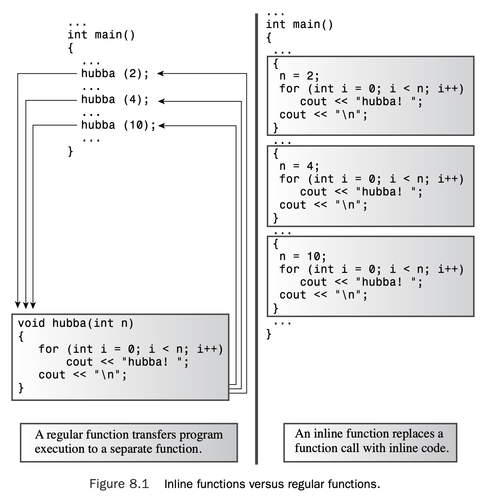
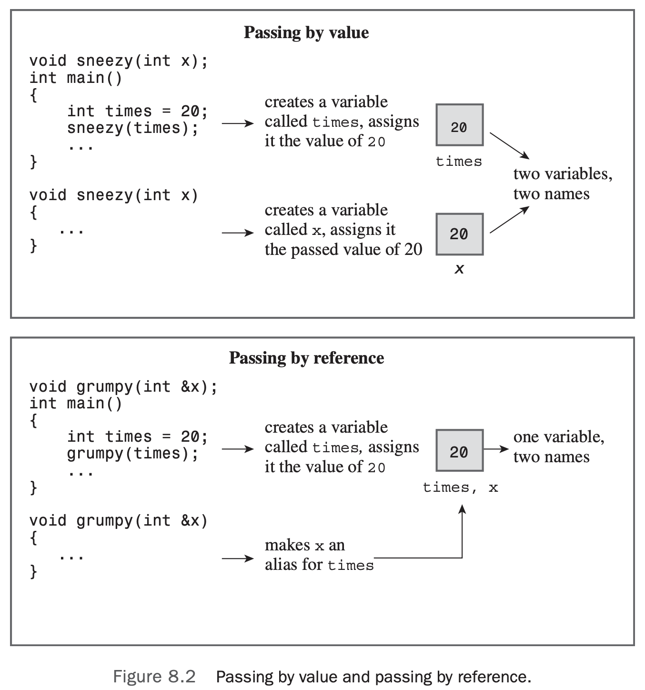
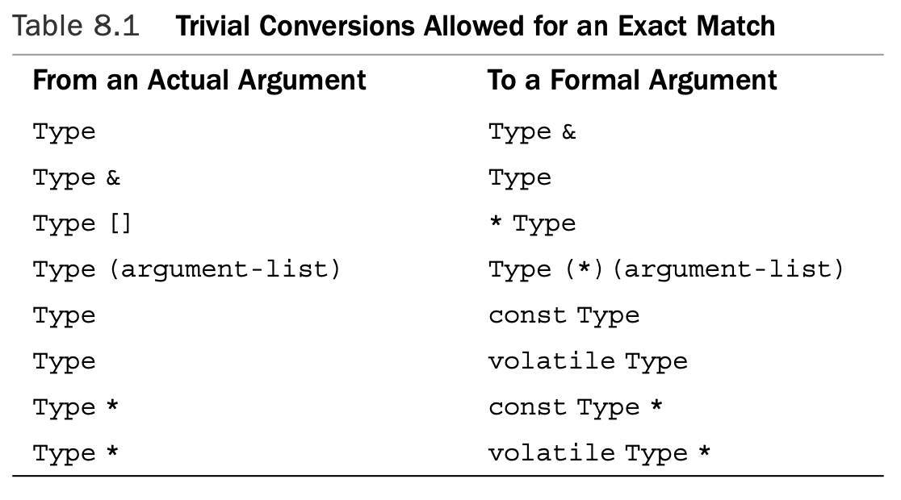

# Chapter 8 Adventures in Functions

[TOC]

## C++ Inline Functions

**Inline functions** are a C++ enhancement designed to speed up programs. The primary distinction between normal functions and inline functions is not in how you code them but in how the C++ compiler incorporates them into a program.

The final product of the compilation process is an executable program, which consists of a set of machine language instructions.When you start a program, the operating system loads these instructions into the computer’s memory so that each instruction has a particular memory address.The computer then goes through these instructions step-by-step. Sometimes, as when you have a loop or a branching statement, program execution skips over instructions, jumping backward or forward to a particular address. Normal function calls also involve having a program jump to another address (the function’s address) and then jump back when the function terminates. 

When a program reaches the function call instruction, the program stores the memory address of the instruction immediately following the function call, copies function arguments to the stack (a block of memory reserved for that purpose), jumps to the memory location that marks the beginning of the function, exe- cutes the function code (perhaps placing a return value in a register), and then jumps back to the instruction whose address it saved. 

Jumping back and forth and keeping track of where to jump means that there is an overhead in elapsed time to using functions.

If a program calls an inline function at ten separate locations, then the program winds up with ten copies of the function inserted into the code (see Figure 8.1).



If the code execution time is short, then an inline call can save a large portion of the time used by the non-inline call. On the other hand, you are now saving a large portion of a relatively quick process, so the absolute time savings may not be that great unless the function is called frequently.

To use this feature, you must take at least one of two actions:

* Preface the function declaration with the keyword `inline`.
* Preface the function definition with the keyword `inline`.

A common practice is to omit the prototype and to place the entire definition (meaning the function header and all the function code) where the prototype would normally go.

```c++
// inline.cpp -- using an inline function
#include <iostream>

// an inline function definition
inline double square(double x) { return x * x; }

int main() 
{
    using namespace std; 
    double a, b;
    double c = 13.0;
    a = square(5.0);
    b = square(4.5 + 7.5); // can pass expressions 
    cout << "a = " << a << ", b = " << b << "\n"; 
    cout << "c = " << c;
    cout << ", c squared = " << square(c++) << "\n"; 
    cout << "Now c = " << c << "\n";
    return 0;
}
```

Here’s the output of the program in Listing 8.1:

```c++
a = 25, b = 144
c = 13, c squared = 169
Now c = 14
```

## Reference Variables

A **reference** is a name that acts as an alias, or an alternative name, for a previously defined variable. If you use a reference as an argument, the function works with the original data instead of with a copy. References provide a convenient alternative to pointers for processing large structures with a function, and they are essential for designing classes. 

### Creating a Reference Variable

C++ assigns an additional meaning to the `&` symbol and presses it into service for declar- ing references. 

In this context, `&` is not the address operator. Instead, it serves as part of the type identifier. Just as `char *` in a declaration means pointer-to-`char`, `int &` means reference-to- `int`.

```c++
// firstref.cpp -- defining and using a reference 
#include <iostream>
int main()
{
    using namespace std; 
    int rats = 101;
    int & rodents = rats;   // rodents is a reference

    cout << "rats = " << rats;
    cout << ", rodents = " << rodents << endl; 
    rodents++;
    cout << "rats = " << rats;
    cout << ", rodents = " << rodents << endl;

// some implementations require type casting the following 
// addresses to type unsigned
    cout << "rats address = " << &rats;
    cout << ", rodents address = " << &rodents << endl; 
    return 0;
}
```

Note that the `&` operator in the following statement **is not** the address operator but declares that rodents is of type `int &` (that is, it is a reference to an int variable):

```c++
int & rodents = rats;
```

But the `&` operator in the next statement **is** the address operator, with `&rodents` repre-

senting the address of the variable to which `rodents` refers:

```c++
cout <<", rodents address = " << &rodents << endl;
```

Here is the output of the program in Listing 8.2:

```c++
rats = 101, rodents = 101
rats = 102, rodents = 102
rats address = 0x7ffeec2e0aa4, rodents address = 0x7ffeec2e0aa4
```

> You should initialize a reference variable when you declare it.

```c++
// secref.cpp -- defining and using a reference 
#include <iostream>
int main()
{
    using namespace std;
    int rats = 101; 
    int & rodents = rats;   // rodents is a reference

    cout << "rats = " << rats;
    cout << ", rodents = " << rodents << endl;

    cout << "rats address = " << &rats;
    cout << ", rodents address = " << &rodents << endl;

    int bunnies = 50;
    rodents = bunnies;      // can we change the reference?
    cout << "bunnies = " << bunnies;
    cout << ", rats = " << rats;
    cout << ", rodents = " << rodents << endl;

    cout << "bunnies address = " << &bunnies;
    cout << ", rodents address = " << &rodents << endl; 
    return 0;    
}
```

Here’s the output of the program in Listing 8.3:

```c++
rats = 101, rodents = 101
rats address = 0x7ffeecc30aa4, rodents address = 0x7ffeecc30aa4
bunnies = 50, rats = 50, rodents = 50
bunnies address = 0x7ffeecc30aa0, rodents address = 0x7ffeecc30aa4
```

Initially, `rodents` refers to `rats`, but then the program apparently attempts to make `rodents` a reference to `bunnies`:

```c++
rodents = bunnies;
```

Because `rodents` is an alias for `rats`, the assignment statement really means the same as the following:

```c++
rats = bunnies;
```

### References as Function Parameters

Most often, references are used as function parameters, making a variable name in a func- tion an alias for a variable in the calling program.This method of passing arguments is called **passing by reference**. 



```c++
// swaps.cpp -- swapping with references and with pointers 
#include <iostream>
void swapr(int & a, int & b);   // a, b are aliases for ints
void swapp(int * p, int * q);   // p, q are addresses of ints
void swapv(int a, int b);       // a, b are new variables
int main()
{
    using namespace std; 
    int wallet1 = 300; 
    int wallet2 = 350;

    cout << "wallet1 = $" << wallet1;
    cout << " wallet2 = $" << wallet2 << endl;

    cout << "Using references to swap contents:\n"; 
    swapr(wallet1, wallet2);    // pass variables 
    cout << "wallet1 = $" << wallet1;
    cout << " wallet2 = $" << wallet2 << endl;

    cout << "Using pointers to swap contents again:\n"; 
    swapp(&wallet1, &wallet2);  // pass addresses of variables 
    cout << "wallet1 = $" << wallet1;
    cout << " wallet2 = $" << wallet2 << endl;

    cout << "Trying to use passing by value:\n"; 
    swapv(wallet1, wallet2);    // pass values of variables 
    cout << "wallet1 = $" << wallet1;
    cout << " wallet2 = $" << wallet2 << endl;
    return 0;
}

void swapr(int & a, int & b)    // use references
{
    int temp;

    temp = a;       // use a, b for values of variables
    a = b;
    b = temp;
}

void swapp(int * p, int * q)    // use pointers
{
    int temp;

    temp = *p;      // use *p, *q for values of variables
    *p = *q; 
    *q = temp;
}

void swapv(int a, int b)        // try using values
{
    int temp;

    temp = a;       // use a, b for values of variables
    a = b;
    b = temp;
}
```

Here’s the output of the program in Listing 8.4:

```c++
wallet1 = $300 wallet2 = $350
Using references to swap contents:
wallet1 = $350 wallet2 = $300
Using pointers to swap contents again:
wallet1 = $300 wallet2 = $350
Trying to use passing by value:
wallet1 = $300 wallet2 = $350
```

### Reference Properties and Oddities

```c++
// cubes.cpp -- regular and reference arguments 
#include <iostream>
double cube(double a);
double refcube(double &ra);
int main () 
{
    using namespace std; 
    double x = 3.0;

    cout << cube(x);
    cout << " = cube of " << x << endl; 
    cout << refcube(x);
    cout << " = cube of " << x << endl; 
    return 0;
}

double cube(double a) 
{
    a *= a * a;
    return a; 
}

double refcube(double &ra) 
{
    ra *= ra * ra;
    return ra; 
}
```

Here is the output of the program in Listing 8.5:

```c++
27 = cube of 3
27 = cube of 27
```

 If your intent is that a function use the information passed to it without modifying the information, and if you’re using a reference, you should use a constant reference. Here, for example, you should use const in the function prototype and function header:

```c++
double refcube(const double &ra);
```

#### Temporary Variables, Reference Arguments, and `const`
The reference parameter is a const, the compiler generates a temporary variable in two kinds of situations:

* When the actual argument is the correct type but isn’t an **lvalue**
* When the actual argument is of the wrong type, but it’s of a type that can be converted to the correct type

What is an lvalue? An argument that’s an lvalue is a data object that can be referenced by address. 

> If a function call argument isn’t an `lvalue` or does not match the type of the corresponding `const` reference parameter, C++ creates an anonymous variable of the correct type, assigns the value of the function call argument to the anonymous variable, and has the parameter refer to that variable.

> Use **const** When You Can
>
> There are three strong reasons to declare reference arguments as references to constant data:
>
> * Using `const` protects you against programming errors that inadvertently alter data.
> * Using `const` allows a function to process both `const` and non-`const` actual arguments, whereas a function that omits `const` in the prototype only can accept non- `const` data.
> * Using a const reference allows the function to generate and use a temporary variable appropriately.

### Using References with a Structure

The method for using a reference to a structure as a function parameter is the same as the method for using a reference to a basic variable:You just use the `&` reference operator when declaring a structure parameter. 

```c++
//strc_ref.cpp -- using structure references 
#include <iostream>
#include <string>
struct free_throws
{
    std::string name; 
    int made;
    int attempts; 
    float percent;
};

void display(const free_throws & ft);
void set_pc(free_throws & ft);
free_throws & accumulate(free_throws & target, const free_throws & source);

int main()
{
// partial initializations – remaining members set to 0
    free_throws one = {"Ifelsa Branch", 13, 14}; 
    free_throws two = {"Andor Knott", 10, 16}; 
    free_throws three = {"Minnie Max", 7, 9};
    free_throws four = {"Whily Looper", 5, 9};
    free_throws five = {"Long Long", 6, 14};
    free_throws team = {"Throwgoods", 0, 0};
// no initialization free_throws dup;
    free_throws dup;

    set_pc(one); 
    display(one); 
    accumulate(team, one);
    display(team);
// use return value as argument
    display(accumulate(team, two)); 
    accumulate(accumulate(team, three), four); 
    display(team);
// use return value in assignment
    dup = accumulate(team,five); 
    std::cout << "Displaying team:\n"; 
    display(team);
    std::cout << "Displaying dup after assignment:\n"; 
    display(dup);
    set_pc(four);
// ill-advised assignment
    accumulate(dup,five) = four;
    std::cout << "Displaying dup after ill-advised assignment:\n"; 
    display(dup);
    return 0;
}

void display(const free_throws & ft) 
{
    using std::cout;
    cout << "Name: " << ft.name << '\n';
    cout << " Made: " << ft.made << '\t';
    cout << "Attempts: " << ft.attempts << '\t'; 
    cout << "Percent: " << ft.percent << '\n';
}

void set_pc(free_throws & ft) 
{
    if (ft.attempts != 0)
        ft.percent = 100.0f *float(ft.made)/float(ft.attempts);
    else
        ft.percent = 0;
}

free_throws & accumulate(free_throws & target, const free_throws & source) 
{
    target.attempts += source.attempts; 
    target.made += source.made; 
    set_pc(target);
    return target;
}
```

Here is the program output:

```c++
Name: Ifelsa Branch
 Made: 13	Attempts: 14	Percent: 92.8571
Name: Throwgoods
 Made: 13	Attempts: 14	Percent: 92.8571
Name: Throwgoods
 Made: 23	Attempts: 30	Percent: 76.6667
Name: Throwgoods
 Made: 35	Attempts: 48	Percent: 72.9167
Displaying team:
Name: Throwgoods
 Made: 41	Attempts: 62	Percent: 66.129
Displaying dup after assignment:
Name: Throwgoods
 Made: 41	Attempts: 62	Percent: 66.129
Displaying dup after ill-advised assignment:
Name: Whily Looper
 Made: 5	Attempts: 9	Percent: 55.5556
```

#### Why Return a Reference?

Consider the following:

```c++
double m = sqrt(16.0); 
cout << sqrt(25.0);
```

In the first statement, the value `4.0` is copied to a temporary location and then the value in that location is copied to `m`. In the second statement, the value `5.0` is copied to a temporary location, then the contents of that location are passed on to `cout`. 

Now consider this statement:

```c++
dup = accumulate(team,five);
```

If `accumulate()` returned a structure instead of a reference to a structure, this could involve copying the entire structure to a temporary location and then copying that copy to `dup`. But with a reference return value, `team` is copied directly to `dup`, a more efficient approach. 

`&dup`$\not =$`&team`

#### Being Careful About What a Return Reference Refers To

The single most important point to remember when returning a reference is to avoid returning a reference to a memory location that ceases to exist when the function terminates.

What you want to avoid is code along these lines:

```c++
const free_throws & clone2(free_throws & ft) 
{
	free_throws newguy; // first step to big error 
    newguy = ft; 		// copy info
	return newguy; 		// return reference to copy
}
```

This has the unfortunate effect of returning a reference to a temporary variable (`newguy`) that passes from existence as soon as the function terminates. 

The simplest way to avoid this problem is to return a reference that was passed as an argument to the function.A reference parameter will refer to data used by the calling function; hence, the returned reference will refer to that same data.

A second method is to use new to create new storage.You’ve already seen examples in which new creates space for a string and the function returns a pointer to that space. Here’s how you could do something similar with a reference:

```c++
const free_throws & clone(free_throws & ft) 
{
	free_throws * pt;
	*pt = ft; 			// copy info
	return *pt; 		// return reference to copy
}
```

There is a problem with this approach:You should use `delete` to free memory allocated by `new` when the memory is no longer needed. 

#### Why Use `const` with a Reference Return?

Suppose you want to use a reference return value but don’t want to permit behavior such as assigning a value to `accumulate()`. Just make the return type a `const` reference:

```c++
const free_throws &
	accumulate(free_throws & target, const free_throws & source);
```

The return type now is `const`, hence a nonmodifiable lvalue. Therefore, the assignment no longer is allowed:

```c++
accumulate(dup,five) = four; // not allowed for const reference return
```

With a const reference return type, the following statement would still be allowed:

```c++
display(accumulate(team, two));
```

But the following statement would not be allowed because the first formal parameter for `accumulate()` is not `const`:

```c++
accumulate(accumulate(team, three), four);
```

Is this a great loss? Not in this case because you still can do the following:

```c++
accumulate(team, three); 
accumulate(team, four);
```

### Using References with a Class Object

```c++
// strquote.cpp -- different designs 
#include <iostream>
#include <string>
using namespace std;
string version1(const string & s1, const string & s2);
const string & version2(string & s1, const string & s2); // has side effect
const string & version3(string & s1, const string & s2); // bad design

int main() 
{
    string input;
    string copy;
    string result;

    cout << "Enter a string: "; 
    getline(cin, input);
    copy = input;
    cout << "Your string as entered: " << input << endl;
    result = version1(input, "***"); 
    cout << "Your string enhanced: " << result << endl;
    cout << "Your original string: " << input << endl;

    result = version2(input, "###"); 
    cout << "Your string enhanced: " << result << endl;
    cout << "Your original string: " << input << endl;

    cout << "Resetting original string.\n"; 
    input = copy;
    result = version3(input, "@@@");
    cout << "Your string enhanced: " << result << endl;
    cout << "Your original string: " << input << endl;

    return 0;
}

string version1(const string & s1, const string & s2)
{
    string temp;

    temp = s2 + s1 +s2;
    return temp;
}

const string & version2(string & s1, const string & s2)  // has side effect
{
    s1 = s2 + s1 + s2;
// safe to return reference passed to function
    return s1;
}

const string & version3(string & s1, const string & s2)  // bad design
{
    string temp;

    temp = s2 + s1 + s2;
// unsafe to return reference to local variable
    return temp;
}
```

Here is a sample run of the program in Listing 8.7:

```c++
Enter a string: It's not my fault.
Your string as entered: It's not my fault.
Your string enhanced: ***It's not my fault.***
Your original string: It's not my fault.
Your string enhanced: ###It's not my fault.###
Your original string: ###It's not my fault.###
Resetting original string.
zsh: segmentation fault  ./strquote
```

At this point the program crashed.

### Another Object Lesson: Objects, Inheritance, and References

The language feature that makes it possible to pass features from one class to another is called **inheritance**. In brief, `ostream` is termed a **base class** (because the `ofstream` class is based on it) and ofstream is termed a **derived class** (because it is derived from `ostream`).A derived class inherits the base class methods, which means that an `ofstream` object can use base class features such as the `precision()` and `setf()` formatting methods.

Another aspect of inheritance is that a base class reference can refer to a derived class object without requiring a type cast.

```c++
//filefunc.cpp -- function with ostream & parameter 
#include <iostream>
#include <fstream>
#include <cstdlib>
using namespace std;

void file_it(ostream & os, double fo, const double fe[],int n); 
const int LIMIT = 5;
int main()
{
    ofstream fout;
    const char * fn = "ep-data.txt"; 
    fout.open(fn);
    if (!fout.is_open())
    {
        cout << "Can't open " << fn << ". Bye.\n";
        exit(EXIT_FAILURE); 
    }
    double objective; 
    cout << "Enter the focal length of your "
            "telescope objective in mm: ";
    cin >> objective; 
    double eps[LIMIT];
    cout << "Enter the focal lengths, in mm, of " << LIMIT
        << " eyepieces:\n";
    for (int i = 0; i < LIMIT; i++)
    {
        cout << "Eyepiece #" << i + 1 << ": ";
        cin >> eps[i];
    }
    file_it(fout, objective, eps, LIMIT); 
    file_it(cout, objective, eps, LIMIT); 
    cout << "Done\n";
    return 0;
}

void file_it(ostream & os, double fo, const double fe[],int n) 
{
    ios_base::fmtflags initial;
    initial = os.setf(ios_base::fixed);     // save initial formatting state 
    os.precision(0);
    os << "Focal length of objective: " << fo << " mm\n"; 
    os.setf(ios::showpoint);
    os.precision(1);
    os.width(12);
    os << "f.l. eyepiece";
    os.width(15);
    os << "magnification" << endl;
    for (int i = 0; i < n; i++)
    {
        os.width(12);
        os << fe[i];
        os.width(15);
        os << int (fo/fe[i] + 0.5) << endl;
    }
    os.setf(initial);   // restore initial formatting state 
}
```

Here is a sample run of the program in Listing 8.8:

```c++
Enter the focal length of your telescope objective in mm: 1800
Enter the focal lengths, in mm, of 5 eyepieces:
Eyepiece #1: 30
Eyepiece #2: 19
Eyepiece #3: 14
Eyepiece #4: 8.8
Eyepiece #5: 7.5
Focal length of objective: 1800 mm
f.l. eyepiece  magnification
        30.0             60
        19.0             95
        14.0            129
         8.8            205
         7.5            240
Done
```

The following line writes the eyepiece data to the file `ep-data.txt`:

```c++
file_it(fout, objective, eps, LIMIT);
```

And this line writes the identical information in the identical format to the screen:

```c++
file_it(cout, objective, eps, LIMIT);
```

The main point of Listing 8.8 is that the os parameter, which is type `ostream &`, can refer to an `ostream` object such as `cout` and to an `ofstream` object such as `fout`. 

The `setf()` method allows you to set various formatting states.  For example, the method call `setf(ios_base::fixed)` places an object in the mode of using fixed decimal-point notation.The call `setf(ios_base:showpoint)` places an object in the mode of showing a trailing decimal point, even if the following digits are zeros.The `precision()` method indicates the number of figures to be shown to the right of the decimal (provided that the object is in `fixed` mode). All these settings stay in place unless they’re reset by another method call.The `width()` call sets the field width to be used for the next output action.This setting holds for displaying one value only, and then it reverts to the default.

### When to Use Reference Arguments

There are two main reasons for using reference arguments:

* To allow you to alter a data object in the calling function
* To speed up a program by passing a reference instead of an entire data object

So when should you use a reference? Use a pointer? Pass by value? The following are some guidelines.

A function uses passed data without modifying it:

* If the data object is small, such as a built-in data type or a small structure, pass it by value.
* If the data object is an array, use a pointer because that’s your only choice. Make the pointer a pointer to `const`.
* If the data object is a good-sized structure, use a `const` pointer or a `const` reference to increase program efficiency.You save the time and space needed to copy a structure or a class design. Make the pointer or reference `const`.
* If the data object is a class object, use a `const` reference.The semantics of class design often require using a reference, which is the main reason C++ added this feature.Thus, the standard way to pass class object arguments is by reference.

A function modifies data in the calling function:

* If the data object is a built-in data type, use a pointer. If you spot code like

    `fixit(&x)`, where x is an `int`, it’s pretty clear that this function intends to modify x. 

* If the data object is an array, use your only choice: a pointer.
* If the data object is a structure, use a reference or a pointer.
* If the data object is a class object, use a reference.

## Default Arguments

A **default argument** is a value that’s used automatically if you omit the corresponding actual argument from a function call. 

For example, here’s the prototype fitting this description of `left()`:

```c++
char * left(const char * str, int n = 1);
```

If you leave `n` alone, it has the value `1`, but if you pass an argument, the new value overwrites the `1`.

When you use a function with an argument list, you must add defaults **from right to left**.That is, you can’t provide a default value for a particular argument unless you also pro- vide defaults for all the arguments to its right:

```c++
int harpo(int n, int m = 4, int j = 5);			// VALID
int chico(int n, int m = 6, int j);				// INVALID
int groucho(int k = 1, int m = 2, int n = 3);	// VALID
```

For example, the `harpo()` prototype permits calls with one, two, or three arguments:

```c++
beeps = harpo(2); // same as harpo(2,4,5) 
beeps = harpo(1,8); // same as harpo(1,8,5) 
beeps = harpo (8,7,6); // no default arguments used
```

The actual arguments are assigned to the corresponding formal arguments from left to right; you can’t skip over arguments.Thus, the following isn’t allowed:

```c++
beeps = harpo(3, ,8); // invalid, doesn't set m to 4
```

Default arguments aren’t a major programming breakthrough; rather, they are a convenience.When you begin working with class design, you’ll find that they can reduce the number of constructors, methods, and method overloads you have to define.

```c++
// left.cpp -- string function with a default argument 
#include <iostream>
const int ArSize = 80;
char * left(const char * str, int n = 1);
int main() 
{
    using namespace std;
    char sample[ArSize];
    cout << "Enter a string:\n";
    cin.get(sample,ArSize); 
    char *ps = left(sample, 4); 
    cout << ps << endl;
    delete [] ps;       // free old string
    ps = left(sample);
    cout << ps << endl;
    delete [] ps;       // free new string
    return 0;
}

// This function returns a pointer to a new string
// consisting of the first n characters in the str string. 
char * left(const char * str, int n)
{
    if(n < 0) 
        n = 0;
    char * p = new char[n+1];
    int i;
    for (i = 0; i < n && str[i]; i++)
        p[i] = str[i]; // copy characters 
    while (i <= n)
        p[i++] = '\0'; // set rest of string to '\0' 
    return p;
}
```

Here’s a sample run of the program in Listing 8.9:

```c++
Enter a string:
forthcoming
fort
f
```

## Function Overloading

Whereas default arguments let you call the same function by using varying numbers of arguments, **function polymorphism**, also called **function overloading**, lets you use multiple functions sharing the same name.

The key to function overloading is a function’s argument list, also called the **function signature**. If two functions use the same number and types of arguments in the same order, they have the same signature; the variable names don’t matter. 

Some signatures that appear to be different from each other nonetheless can’t coexist. For example, consider these two prototypes:

```c++
double cube(double x); 
double cube(double & x);
```

Therefore, to avoid such confusion, when it checks function signatures, the compiler considers a reference to a type and the type itself to be the same signature.

The function-matching process does discriminate between `const` and non-`const` variables. 

Keep in mind that the signature, not the function type, enables function overloading. For example, the following two declarations are incompatible:

```c++
long gronk(int n, float m); // same signatures, 
double gronk(int n, float m); // hence not allowed
```

Therefore, C++ doesn’t permit you to overload `gronk()` in this fashion.You can have different return types, but only if the signatures are also different:

```c++
long gronk(int n, float m); // different signatures, 
double gronk(float n, float m); // hence allowed
```

### An Overloading Example

```c++
// leftover.cpp -- overloading the left() function 
#include <iostream>
unsigned long left(unsigned long num, unsigned ct); 
char * left(const char * str, int n = 1);

int main() 
{
    using namespace std;
    char * trip = "Hawaii!!"; 	// test value （warning
    unsigned long n = 12345678; // test value 
    int i;
    char * temp;

    for (i = 1; i < 10; i++) 
    {
        cout << left(n, i) << endl;
        temp = left(trip,i);
        cout << temp << endl;
        delete [] temp; // point to temporary storage
    }
    return 0;
}

// This function returns the first ct digits of the number num. 
unsigned long left(unsigned long num, unsigned ct)
{
    unsigned digits = 1; 
    unsigned long n = num;

    if (ct == 0 || num == 0)
        return 0;       // return 0 if no digits
    while (n /= 10)
        digits++;
    if (digits > ct) 
    {
        ct = digits - ct; 
        while (ct--)
            num /= 10; 
        return num;         // return left ct digits
    } 
    else                // if ct >= number of digits
        return num;     // return the whole number
}

// This function returns a pointer to a new string
// consisting of the first n characters in the str string. 
char * left(const char * str, int n)
{
    if(n < 0) 
        n = 0;
    char * p = new char[n+1];
    int i;
    for (i = 0; i < n && str[i]; i++)
        p[i] = str[i]; // copy characters 
    while (i <= n)
        p[i++] = '\0'; // set rest of string to '\0' 
    return p;
}
```

Here’s the output of the program in Listing 8.10:

```c++
1
H
12
Ha
123
Haw
1234
Hawa
12345
Hawai
123456
Hawaii
1234567
Hawaii!
12345678
Hawaii!!
12345678
Hawaii!!
```

### When to Use Function Overloading

You might find function overloading fascinating, but you shouldn’t overuse it.You should reserve function overloading for functions that perform basically the same task but with different forms of data.Also you might want to check whether you can accomplish the same end by using default arguments. 

## Function Templates

A **function template** is a generic function description; that is, it defines a function in terms of a generic type for which a specific type, such as `int` or `double`, can be substituted. By passing a type as a parameter to a template, you cause the compiler to generate a function for that particular type. Because templates let you program in terms of a generic type instead of a specific type, the process is sometimes termed **generic programming**.

Function templates enable you to define a function in terms of some arbitrary type. For example, you can set up a swapping template like this:

```c++
template <typename AnyType>
void Swap(AnyType &a, AnyType &b) 
{
    AnyType temp; 
    temp = a;
    a = b;
    b = temp;
}
```

The first line specifies that you are setting up a template and that you’re naming the arbitrary type `AnyType`. The keywords `template` and `typename` are obligatory, except that you can use the keyword `class` instead of `typename`. Also you must use the angle brackets.

```c++
// funtemp.cpp -- using a function template 
#include <iostream>
// function template prototype
template <typename T> // or class T
void Swap(T &a, T &b);

int main() 
{
    using namespace std;
    int i = 10;
    int j = 20;
    cout << "i, j = " << i << ", " << j << ".\n"; 
    cout << "Using compiler-generated int swapper:\n"; 
    Swap(i,j); // generates void Swap(int &, int &) 
    cout << "Now i, j = " << i << ", " << j << ".\n";

    double x = 24.5;
    double y = 81.7;
    cout << "x, y = " << x << ", " << y << ".\n";
    cout << "Using compiler-generated double swapper:\n"; 
    Swap(x,y); // generates void Swap(double &, double &) 
    cout << "Now x, y = " << x << ", " << y << ".\n";
    // cin.get();
    return 0;
}

// function template definition 
template <typename T> // or class T 
void Swap(T &a, T &b)
{
    T temp; 
    temp = a; 
    a = b;
    b = temp;
}
```

Here’s the output of the program in Listing 8.11, which shows that the process has worked:

```c++
i, j = 10, 20.
Using compiler-generated int swapper:
Now i, j = 20, 10.
x, y = 24.5, 81.7.
Using compiler-generated double swapper:
Now x, y = 81.7, 24.5.
```

### Overloaded Templates

As with ordinary overloading, overloaded templates need distinct function signatures. 

```c++
// twotemps.cpp -- using overloaded template functions 
#include <iostream>
template <typename T> // original template
void Swap(T &a, T &b);

template <typename T> // new template 
void Swap(T *a, T *b, int n);

void Show(int a[]); 
const int Lim = 8; 
int main()
{
    using namespace std;
    int i = 10, j = 20;
    cout << "i, j = " << i << ", " << j << ".\n";
    cout << "Using compiler-generated int swapper:\n"; 
    Swap(i,j);          // matches original template 
    cout << "Now i, j = " << i << ", " << j << ".\n";

    int d1[Lim] = {0,7,0,4,1,7,7,6}; 
    int d2[Lim] = {0,7,2,0,1,9,6,9}; 
    cout << "Original arrays:\n"; 
    Show(d1);
    Show(d2);
    Swap(d1,d2,Lim); // matches new template 
    cout << "Swapped arrays:\n";
    Show(d1);
    Show(d2);
    // cin.get();
    return 0;
}

template <typename T> 
void Swap(T &a, T &b) 
{
    T temp; 
    temp = a; 
    a = b;
    b = temp;
}
template <typename T>
void Swap(T a[], T b[], int n) 
{
    T temp;
    for (int i = 0; i < n; i++) 
    {
        temp = a[i]; 
        a[i] = b[i]; 
        b[i] = temp;
    } 
}

void Show(int a[]) 
{
    using namespace std;
    cout << a[0] << a[1] << "/"; 
    cout << a[2] << a[3] << "/"; 
    for (int i = 4; i < Lim; i++)
        cout << a[i]; 
    cout << endl;
}
```

Here is the output of the program in Listing 8.12:

```c++
i, j = 10, 20.
Using compiler-generated int swapper:
Now i, j = 20, 10.
Original arrays:
07/04/1776
07/20/1969
Swapped arrays:
07/20/1969
07/04/1776
```

### Template Limitations

Suppose you have a template function:

```c++
template <class T> // or template <typename T> 
void f(T a, T b)
{...}
```

Often the code makes assumptions about what operations are possible for the type. For instance, the following statement assumes that assignment is defined, and this would not be true if type T is a built-in array type:

```c++
a = b;
```

Similarly, the following assumes `>` is defined, which is not true if T is an ordinary structure:

```c++
if (a > b)
```

Also the `>` operator is defined for array names, but because array names are addresses, it compares the addresses of the arrays,which may not be what you have in mind.And the following assumes the multiplication operator is defined for type `T`, which is not the case if `T` is an array, a pointer, or a structure:

```c++
T c = a*b;
```

### Explicit Specializations

Suppose you define a structure like the following:

```c++
struct job {
	char name[40]; 
    double salary; 
    int floor;
};
```

Also suppose you want to be able to swap the contents of two such structures.The original template uses the following code to effect a swap:

```c++
temp = a; 
a = b;
b = temp;
```

But suppose you only want to swap the salary and floor mem- bers, keeping the name members unchanged. This requires different code, but the arguments to `Swap()` would be the same as for the first case (references to two job structures), so you can’t use template overloading to supply the alternative code.

#### Third-Generation Specialization (ISO/ANSI C++ Standard)

After some youthful experimentation with other approaches, the C++98 Standard settled on this approach:

* For a given function name, you can have a non template function, a template function, and an explicit specialization template function, along with overloaded versions of all of these.
* The prototype and definition for an explicit specialization should be preceded by `template <>` and should mention the specialized type by name.
* A specialization overrides the regular template, and a non template function overrides both.

Here’s how prototypes for swapping type `job` structures would look for these three forms:

```c++
// non template function prototype
void Swap(job &, job &);

// template prototype 
template <typename T> 
void Swap(T &, T &);

// explicit specialization for the job type 
template <> void Swap<job>(job &, job &);
```

As mentioned previously, if more than one of these prototypes is present, the compiler chooses the non template version over explicit specializations and template versions, and it chooses an explicit specialization over a version generated from a template. 

#### An Example of Explicit Specialization

```c++
// twoswap.cpp -- specialization overrides a template 
#include <iostream>
template <typename T>
void Swap(T &a, T &b);

struct job 
{
char name[40]; 
double salary; 
int floor;
};

// explicit specialization
template <> void Swap<job>(job &j1, job &j2); 
void Show(job &j);

int main() 
{
    using namespace std; 
    cout.precision(2); 
    cout.setf(ios::fixed, ios::floatfield); 
    int i = 10, j = 20;
    cout << "i, j = " << i << ", " << j << ".\n"; 
    cout << "Using compiler-generated int swapper:\n"; 
    Swap(i,j); // generates void Swap(int &, int &) 
    cout << "Now i, j = " << i << ", " << j << ".\n";

    job sue = {"Susan Yaffee", 73000.60, 7};
    job sidney = {"Sidney Taffee", 78060.72, 9};
    cout << "Before job swapping:\n";
    Show(sue);
    Show(sidney);
    Swap(sue, sidney); // uses void Swap(job &, job &) 
    cout << "After job swapping:\n";
    Show(sue);
    Show(sidney);
    // cin.get();
    return 0;
}

template <typename T> 
void Swap(T &a, T &b)       // general version
{
    T temp; 
    temp = a;
    a = b;
    b = temp; 
}

// swaps just the salary and floor fields of a job structure

template <> void Swap<job>(job &j1, job &j2) // specialization 
{
    double t1;
    int t2;
    t1 = j1.salary; 
    j1.salary = j2.salary; 
    j2.salary = t1;
    t2 = j1.floor; 
    j1.floor = j2.floor; 
    j2.floor = t2;
}


void Show(job &j) 
{
    using namespace std; 
    cout << j.name << ": $" << j.salary
         << " on floor " << j.floor << endl;
}
```

Here’s the output of the program in Listing 8.13:

```c++
i, j = 10, 20.
Using compiler-generated int swapper:
Now i, j = 20, 10.
Before job swapping:
Susan Yaffee: $73000.60 on floor 7
Sidney Taffee: $78060.72 on floor 9
After job swapping:
Susan Yaffee: $78060.72 on floor 9
Sidney Taffee: $73000.60 on floor 7
```

#### Instantiations and Specializations

Originally, using implicit instantiation was the only way the compiler generated function definitions from templates, but now C++ allows for **explicit instantiation**.That means you can instruct the compiler to create a particular instantiation.

```c++
template void Swap<int>(int, int); // explicit instantiation
```

Contrast the explicit instantiation with the explicit specialization, which uses one or the other of these equivalent declarations:

```c++
template <> void Swap<int>(int &, int &); // explicit specialization 
template <> void Swap(int &, int &); 	// explicit specialization
```

The explicit specialization declaration has `<>` after the keyword template, whereas the explicit instantiation omits the `<>`.

Explicit instantiations also can be created by using the function in a program. For instance, consider the following:

```c++
template <class T> 
T Add(T a, T b)		// pass by value
{
	return a + b; 
}
...
int m = 6;
double x = 10.2;
cout << Add<double>(x, m) << endl; // explicit instantiation
```

The template would fail to match the function call `Add(x, m)` because the template expects both function arguments to be of the same type. But using `Add<double>(x, m)` forces the type `double` instantiation, and the argument m is type cast to type `double` to match the second parameter of the `Add<double>(double, double)` function.

```c++
int m = 5;
double x = 14.3;
Swap<double>(m, x); // almost works
```

This generates an explicit instantiation for type `double`. Unfortunately, in this case, the code won’t work because the first formal parameter, being type `double &`, can’t refer to the type `int` variable `m`.

Implicit instantiations, explicit instantiations, and explicit specializations collectively are termed **specializations**.

```c++
...
template <class T>
void Swap (T &, T &); // template prototype

template <> void Swap<job>(job &, job &); // explicit specialization for job 
int main(void)
{
	template void Swap<char>(char &, char &); // explicit instantiation for char 
    short a, b;
	...
	Swap(a,b);	// implicit template instantiation for short
	job n, m; 
    ...
	Swap(n, m);	// use explicit specialization for job
    char g, h;
    ...
    Swap(g, h); // use explicit template instantiation for char
    ...
}
```

#### Which Function Version Does the Compiler Pick?

* **Phase 1**—Assemble a list of candidate functions.These are functions and template functions that have the same names as the called functions.
* **Phase 2**—From the candidate functions, assemble a list of viable functions.These are functions with the correct number of arguments and for which there is an implicit conversion sequence, which includes the case of an exact match for each type of actual argument to the type of the corresponding formal argument. For example, a function call with a type `float` argument could have that value converted to a `double` to match a type `double` formal parameter, and a template could generate an instantiation for `float`.
* **Phase 3**—Determine whether there is a best viable function. If so, you use that function. Otherwise, the function call is an error.

```c++
may('B'); // actual argument is type char
```

First, the compiler rounds up the suspects, which are functions and function templates that have the name `may()`.Then, it finds those that can be called with one argument. For example, the following pass muster because they have the same name and can be used with one argument:

```c++
void may(int);							// #1
float may(float, float = 3);			// #2
void may(char);							// #3
char * may(const char *);				// #4
char may(const char &); 				// #5
template<class T> void may(const T &); 	// #6
template<class T> void may(T *);		// #7
```

Note that just the signatures and not the return types are considered.Two of these can- didates (#4 and #7), however, are not viable because an integral type cannot be converted implicitly (that is, without an explicit type cast) to a pointer type.The remaining template is viable because it can be used to generate a specialization, with T taken as type char. That leaves five viable functions, each of which could be used if it were the only function declared.

Next, the compiler has to determine which of the viable functions is best. It looks at the conversion required to make the function call argument match the viable candidate’s argument. In general, the ranking from best to worst is this:

1. Exact match, with regular functions outranking templates

2. Conversion by promotion (for example, the automatic conversions of `char` and

    short to `int` and of `float` to `double`)

3. Conversionbystandardconversion(forexample,converting `int` to `char` or `long`

    to `double`)

4. User-defined conversions, such as those defined in class declarations

### Exact Matches and Best Matches

C++ allows some “trivial conversions” when making an exact match.



Suppose you have the following function code:

```c++
struct blot {int a; char b[10];}; 
blot ink = {25, "spots"};
...
recycle(ink);
```

In that case, all the following prototypes would be exact matches:

```c++
void recycle(blot);			// #1 blot-to-blot
void recycle(const blot);	// #2 blot-to-(const blot)
void recycle(blot &);		// #3 blot-to-(blot &)
void recycle(const blot &); // #4 blot-to-(const blot &)
```

As you might expect, the result of having several matching prototypes is that the com- piler cannot complete the overload resolution process.There is no best viable function, and the compiler generates an error message, probably using words such as **ambiguous**.

First, pointers and references to non-`const` data are preferentially matched to non-`const` pointer and reference parameters.

Another case in which one exact match is better than another is when one function is a non template function and the other isn’t. In that case, the non template is considered better than a template, including explicit specializations.

If you wind up with two exact matches that both happen to be template functions, the template function that is the more specialized, if either, is the better function.

```c++
struct blot {int a; char b[10];};
template <class Type> void recycle (Type t); // template
template <> void recycle<blot> (blot & t); 	// specialization for blot 
...
blot ink = {25, "spots"};
...
recycle(ink); 	// use specialization
```

The term **most specialized** doesn’t necessarily imply an explicit specialization; more gen- erally, it indicates that fewer conversions take place when the compiler deduces what type to use. 

```c++
template <class Type> void recycle (Type t); 	// #1 
template <class Type> void recycle (Type * t); 	// #2
```

#### A Partial Ordering Rules Example

```c++
// tempover.cpp -- template overloading
#include <iostream>

template <typename T>   // template A 
void ShowArray(T arr[], int n);

template <typename T>   // template B
void ShowArray(T * arr[], int n);

struct debts 
{
    char name[50];
    double amount; 
};

int main()
{
    using namespace std; 
    int things[6] = {13, 31, 103, 301, 310, 130};
    struct debts mr_E[3] =
    {
        {"Ima Wolfe", 2400.0}, 
        {"Ura Foxe", 1300.0}, 
        {"Iby Stout", 1800.0}
    };
    double * pd[3];

// set pointers to the amount members of the structures in mr_E 
    for (int i = 0; i < 3; i++)
        pd[i] = &mr_E[i].amount;

    cout << "Listing Mr. E's counts of things:\n"; 
// things is an array of int
    ShowArray(things, 6);   // uses template A
    cout << "Listing Mr. E's debts:\n"; 
// pd is an array of pointers to double
    ShowArray(pd, 3);       // uses template B (more specialized)
    return 0;
}

template <typename T>
void ShowArray(T arr[], int n) 
{
    using namespace std;
    cout << "template A\n"; 
    for (int i = 0; i < n; i++)
        cout << arr[i] << ' '; 
    cout << endl;
}

template <typename T>
void ShowArray(T * arr[], int n) 
{
    using namespace std;
    cout << "template B\n"; 
    for (int i = 0; i < n; i++)
        cout << *arr[i] << ' '; 
    cout << endl;
}
```

Here’s the output of the program in Listing 8.14:

```c++
Listing Mr. E's counts of things:
template A
13 31 103 301 310 130 
Listing Mr. E's debts:
template B
2400 1300 1800 
```

#### Making Your Own Choices

```c++
// choices2.cpp -- choosing a template
#include <iostream>

template<class T>   // or template <typename T>
T lesser(T a, T b)          // #1
{
    return a < b ? a : b;
}

int lesser (int a, int b)   // #2
{
    a = a < 0 ? -a : a;
    b = b < 0 ? -b : b;
    return a < b ? a : b;
}

int main()
{
    using namespace std;
    int m = 20;
    int n = -30;
    double x = 15.5;
    double y = 25.9;

    cout << lesser(m, n) << endl;       // use #2
    cout << lesser(x, y) << endl;       // use #1 with double
    cout << lesser<>(m, n) << endl;     // use #1 with int
    cout << lesser<int>(x,y) << endl;   // use #1 with int

    return 0;
}
```

Here is the program output:

```c++
20
15.5
-30
15
```

#### Functions with Multiple Type Arguments

Where matters really get involved is when a function call with multiple arguments is matched to prototypes with multiple type arguments.The compiler must look at matches for all the arguments. If it can find a function that is better than all the other viable functions, it is chosen. For one function to be better than another function, it has to provide at least as good a match for all arguments and a better match for at least one argument.

### Template Function Evolution

#### What’s That Type?

One problem is that when you write a template function, it’s not always possible in C++98 to know what type to use in a declaration. Consider this partial example:

```c++
template<class T1, class T2> 
void ft(T1 x, T2 y)
{
    ...
    ?type? xpy = x + y; 
    ...
}
```

What should the type for `xpy` be? We don’t know in advance how `ft()` might be used.

#### The `decltype` Keyword (C++11)

The C++11 solution is a new keyword: `decltype`. It can be used in this way:

```c++
int x;
decltype(x) y; // make y the same type as x
```

The argument to `decltype` can be an expression, so in the `ft()` example, we could use this code:

```c++
decltype(x + y) xpy; // make xpy the same type as x + y 
xpy = x + y;
```

Alternatively, we could combine these two statements into an initialization:

```c++
decltype(x + y) xpy = x + y;
```

So we can fix the `ft()` template this way:

```c++
template<class T1, class T2> 
void ft(T1 x, T2 y)
{
    ...
    decltype(x + y) xpy = x + y;
    ...
}
```

The `decltype` facility is a bit more complex than it might appear from these examples. The compiler has to go through a checklist to decide on the type. Suppose we have the following:

```c++
decltype(expression) var;
```

**Stage 1:** If **expression** is an unparenthesized identifier (that is, no additional parentheses), then `var` is of the same type as the identifier, including qualifiers such as `const`:

```c++
double x = 5.5; 
double y = 7.9; 
double &rx = x;
const double * pd;
decltype(x) w;			// w is type double
decltype(rx) u = y;		// u is type double &
decltype(pd) v;			// v is type const double *
```

**Stage 2:** If expression is a function call, then `var` has the type of the function return type:

```c++
long indeed(int);
decltype (indeed(3)) m; // m is type int
```

**Stage 3:** If **expression** is an lvalue, then `var` is a reference to the expression type. This might seem to imply that earlier examples such as w should have been reference types, given that `w` is an lvalue. 

```c++
double xx = 4.4;
decltype ((xx)) r2 = xx; 	// r2 is double & 
decltype(xx) w = xx; 		// w is double (Stage 1 match)
```

**Stage 4:** If none of the preceding special cases apply, `var` is of the same type as **expression**:

```c++
int j = 3;
int &k = j
int &n = j;
decltype(j+6) i1; 	// i1 type int 
decltype(100L) i2; 	// i2 type long 
decltype(k+n) i3; 	// i3 type int;
```

If you need more than one declaration, you can use typedef with `decltype`:

```c++
template<class T1, class T2> 
void ft(T1 x, T2 y)
{
    ...
    typedef decltype(x + y) xytype;
    xytype xpy = x + y;
    xytype arr[10];
    xytype & rxy = arr[2]; 	// rxy a reference 
    ...
}
```

#### Alternative Function Syntax (C++11 Trailing Return Type)

The `decltype` mechanism by itself leaves another related problem unsolved. Consider this incomplete template function:

```c++
template<class T1, class T2> 
?type? gt(T1 x, T2 y)
{
    ...
    return x + y; 
}
```

At that point in the code, the parameters x and y have not yet been declared, so they are not in scope. 

Here, `auto`, in another new C++11 role, is a place- holder for the type provided by the trailing return type.The same form would be used with the function definition:

```c++
auto h(int x, float y) -> double 
{/* function body */};
```

Combining this syntax with · leads to the following solution for specifying the return type for `gt()`:

```c++
template<class T1, class T2>
auto gt(T1 x, T2 y) -> decltype(x + y)
{
    ...
    return x + y; 
}
```

