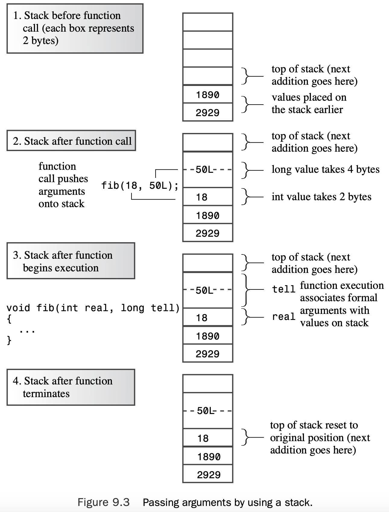

# Chapter 9 Memory Models and Namespaces

[TOC]

## Separate Compilation

C++, like C, allows and even encourages you to locate the component functions of a program in separate files.

You can divide the original program into three parts:

*  A header file that contains the structure declarations and prototypes for functions that use those structures
* A source code file that contains the code for the structure-related functions
* A source code file that contains the code that calls the structure-related functions

One file, the header file, contains the definition of the user-defined types. A second file contains the function code for manipulating the user-defined types.Together, they form a package you can use for a variety of programs.

You shouldn’t put function definitions or variable declarations into a header file.That might work for a simple setup but usually it leads to trouble. 

Here are some things commonly found in header files:

* Function prototypes
* Symbolic constants defined using `#define` or `const`
* Structure declarations
* Class declarations
* Template declaration
* Inline function

Note that you use "`coordin.h`" instead of `<coordin.h>` when including the header file. If the filename is enclosed in angle brackets, the C++ compiler looks at the part of the host system’s file system that holds the standard header files. But if the filename is enclosed in double quotation marks, the compiler first looks at the current working directory or at the source code directory. If it doesn’t find the header file there, it then looks in the standard location. 

Figure 9.1 outlines the steps for putting this program together on a Unix system.


> In IDEs, don’t add header files to the project list and don’t use #include to include source code files in other source code files.

```c++
// coordin.h -- structure templates and function prototypes 
// structure templates
#ifndef COORDIN_H_
#define COORDIN_H_

struct polar 
{
    double distance;    // distance from origin 
    double angle;       // direction from origin
};

struct rect
{
    double x;       // horizontal distance from origin 
    double y;       // vertical distance from origin
};

// prototypes
polar rect_to_polar(rect xypos); 
void show_polar(polar dapos);

#endif
```

In the process of looking at the material, the compiler reads the line defining `COORDIN_H_`. If it then encounters a second inclusion of `coordin.h` in the same file, the compiler notes that `COORDIN_H_ `is defined and skips to the line following the `#endif`. Note that this method doesn’t keep the compiler from including a file twice. Instead, it makes the compiler ignore the contents of all but the first inclusion. 

```c++
// file1.cpp -- example of a three-file program
#include <iostream>
#include "coordin.h" // structure templates, function prototypes 
using namespace std;
int main()
{
    rect rplace;
    polar pplace;
    cout << "Enter the x and y values: ";
    while (cin >> rplace.x >> rplace.y) // slick use of cin 
    {
        pplace = rect_to_polar(rplace); 
        show_polar(pplace);
        cout << "Next two numbers (q to quit): ";
    }
    cout << "Bye!\n"; 
    return 0;
}
```

```c++
// file2.cpp -- contains functions called in file1.cpp
#include <iostream>
#include <cmath>
#include "coordin.h" // structure templates, function prototypes

// convert rectangular to polar coordinates 
polar rect_to_polar(rect xypos)
{
    using namespace std; 
    polar answer;
    answer.distance =
    sqrt( xypos.x * xypos.x + xypos.y * xypos.y);
    answer.angle = atan2(xypos.y, xypos.x);
    return answer; // returns a polar structure 
}

// show polar coordinates, converting angle to degrees 
void show_polar (polar dapos)
{
    using namespace std;
    const double Rad_to_deg = 57.29577951;

    cout << "distance = " << dapos.distance;
    cout << ", angle = " << dapos.angle * Rad_to_deg; 
    cout << " degrees\n";
}
```

```shell
g++ -o file file1.cpp file2.cpp
```

Here is a sample run:

```shell
Enter the x and y values: 120 80
distance = 144.222, angle = 33.6901 degrees
Next two numbers (q to quit): 120 50
distance = 130, angle = 22.6199 degrees
Next two numbers (q to quit): q
Bye!
```

## Storage Duration, Scope, and Linkage

C++ uses three separate schemes (four under C++11) for storing data, and the schemes differ in how long they preserve data in memory:

* **Automatic storage duration**—Variables declared inside a function definition— including function parameters—have automatic storage duration. **They are created when program execution enters the function or block in which they are defined, and the memory used for them is freed when execution leaves the function or block.** C++ has two kinds of automatic storage duration variables.
* **Static storage duration**—Variables defined outside a function definition or else by using the keyword static have static storage duration. **They persist for the entire time a program is running.** C++ has three kinds of static storage duration variables.
* **Thread storage duration (C++11)**—These days multicore processors are common.These are CPUs that can handle several execution tasks simultaneously.This allows a program to split computations into separate **threads** that can be processed concurrently.Variables declared with the `thread_local` keyword have storage that **persists for as long as the containing thread lasts.** This book does not venture into concurrent programming.
* **Dynamic storage duration**—Memory allocated by the `new` operator persists until it is freed with the `delete` operator or until the program ends, whichever comes first.This memory has dynamic storage duration and sometimes is termed the **free store** or the **heap**.

### Scope and Linkage

**Scope** describes how widely visible a name is in a file (translation unit). 

**Linkage** describes how a name can be shared in different units. A name with **external linkage** can be shared across files, and a name with **internal linkage** can be shared by functions within a single file. Names of automatic variables have no linkage because they are not shared.

A C++ variable can have one of several scopes. A variable that has **local scope** (also termed **block scope**) is known only within the block in which it is defined. A variable that has **global scope** (also termed *file scope*) is known throughout the file after the point where it is defined.Automatic variables have local scope, and a static variable can have either scope, depending on how it is defined.

 Members declared in a class have **class scope**.Variables declared in a namespace have **namespace scope**.

The various C++ storage choices are characterized by their storage duration, their scope, and their linkage. 

### Automatic Storage Duration

Function parameters and variables declared inside a function have, by default, automatic storage duration.They also have local scope and no linkage.  Also each variable is allocated when program execution enters the innermost block containing the definition, and each fades from existence when execution leaves that block. 

If you define a variable inside a block, the variable’s persistence and scope are confined to that block. Now suppose you start a new block within `main()` and define a new variable,called `websight`,in the block.Then,`teledeliis` visible in both the outer and inner blocks, whereas `websight` exists only in the inner block and is in scope only from its point of definition until program execution passes the end of the block:

```c++
int main() 
{
	int teledeli = 5; 
    {							// websight allocated
        cout << "Hello\n";		// websight scope begins
        int websight = -2;
        cout << websight << ' ' << teledeli << endl;
    } 							// websight expires 
    cout << teledeli << endl;
    ...
} // teledeli expires
```

Listing 9.4 illustrates how automatic variables are localized to the functions or blocks that contain them.


```c++
// autoscp.cpp -- illustrating scope of automatic variables 
#include <iostream>
void oil(int x);
int main()
{
    using namespace std;
    int texas = 31;
    int year = 2011;
    cout << "In main(), texas = " << texas << ", &texas = "; 
    cout << &texas << endl;
    cout << "In main(), year = " << year << ", &year = "; 
    cout << &year << endl;
    oil(texas);
    cout << "In main(), texas = " << texas << ", &texas = "; 
    cout << &texas << endl;
    cout << "In main(), year = " << year << ", &year = "; 
    cout << &year << endl;
    return 0;
}

void oil(int x) 
{
    using namespace std; 
    int texas = 5;
    cout << "In oil(), texas = " << texas << ", &texas = "; 
    cout << &texas << endl;
    cout << "In oil(), x = " << x << ", &x = ";
    cout << &x << endl;
    {                                   // start a block
        int texas = 113;
        cout << "In block, texas = " << texas;
        cout << ", &texas = " << &texas << endl;
        cout << "In block, x = " << x << ", &x = ";
        cout << &x << endl;
    }                                   // end a block
    cout << "Post-block texas = " << texas; 
    cout << ", &texas = " << &texas << endl;
}
```

Here is the output from the program in Listing 9.4:

```shell
In main(), texas = 31, &texas = 0x7ffeed439aac
In main(), year = 2011, &year = 0x7ffeed439aa8
In oil(), texas = 5, &texas = 0x7ffeed439a8c
In oil(), x = 31, &x = 0x7ffeed439a7c
In block, texas = 113, &texas = 0x7ffeed439a88
In block, x = 31, &x = 0x7ffeed439a7c
Post-block texas = 5, &texas = 0x7ffeed439a8c
In main(), texas = 31, &texas = 0x7ffeed439aac
In main(), year = 2011, &year = 0x7ffeed439aa8
```

#### Initialization of Automatic Variables

You can initialize an automatic variable with any expression whose value will be known when the declaration is reached.

```c++
int w; 			// value of w is indeterminate
int x = 5; 		// initialized with a numeric literal
int big = INT_MAX – 1; // initialized with a constant expression int 
y = 2 * x; 		// use previously determined value of x
cin >> w;
int z = 3 * w; 	// use new value of w
```

#### Automatic Variables and the Stack

The usual means is to set aside a section of memory and treat it as a stack for managing the flow and ebb of variables. It’s called a **stack** because new data is figuratively stacked atop old data and then removed from the stack when a program is finished with it.

The program keeps track of the stack by using two pointers. One points to the base of the stack, where the memory set aside for the stack begins, and one points to the top of the stack, which is the next free memory location.

When a function is called, its automatic variables are added to the stack, and the pointer to the top points to the next available free space following the variables.When the function terminates, the top pointer is reset to the value it had before the function was called, effectively freeing the memory that had been used for the new variables.

A stack is a LIFO (last-in, first-out) design, meaning the last variables added to the stack are the first to go.



Figure 9.3 shows a `fib()` function that, when called, passes a 2-byte `int` and a 4-byte `long`. These values go on the stack.When `fib()` begins execution, it associates the names `real` and `tell` with the two values.When `fib()` terminates, the top- of-stack pointer is relocated to its former position.The new values aren’t erased, but they are no longer labeled, and the space they occupy will be used by the next process that places values on the stack. 

#### Register Variables

C originally introduced the `register` keyword to suggest that the compiler use a CPU register to store an automatic variable:

```c++
register int count_fast; // request for a register variable
```

Given that `register` can only be used with variables that would be automatic anyway, one reason to use this keyword is to indicate that you really do want to use an automatic variable, perhaps one with the same name as an external variable.This is the same purpose the original use of `auto` served.The more important reason for retaining `register`, however, is to avoid invalidating existing code that uses that keyword.

### Static Duration Variables

C++, like C, provides static storage duration variables with three kinds of linkage: **external linkage** (accessible across files), **internal linkage** (accessible to functions within a single file), and **no linkage** (accessible to just one function or to one block within a function). All three last for the duration of the program; they are less ephemeral than automatic variables. 

Instead, the compiler allocates a fixed block of memory to hold all the static variables, and those variables stay present as long as the program executes.Also if you don’t explicitly initialize a static vari- able, the compiler sets it to 0. Static arrays and structures have all the bits of each element or member set to 0 by default.

```c++
...
int global = 1000; 			// static duration, external linkage
static int one_file = 50; 	// static duration, internal linkage
int main()
{
...
}
void funct1(int n)
{
    static int count = 0;	// static duration, no linkage
    int llama = 0;
...
}
void funct2(int q)
{
...
}
```

As stated previously, all the static duration variables (`global`, `one_file`, and `count`, in this example) persist from the time the program begins execution until it terminates.

The variable `count`, which is declared inside `funct1()`, has local scope and no linkage, which means it can be used only inside the `funct1()` function, just like the automatic variable `llama`. But unlike `llama`, count remains in memory even when the `funct1()` function is not being executed. 

Both `global` and `one_file` have file scope, meaning they can be used from the point of declaration until the end of the file. In particular, both can be used in `main()`, `funct1()`, and `funct2()`. Because `one_file` has internal linkage, it can be used only in the file containing this code. Because `global` has external linkage, it also can be used in other files that are part of the program.

Table 9.1 summarizes the storage class features as used in the pre-namespace era. 


#### Initializing Static Variables

Static variables may be **zero-initialized**, they may undergo **constant expression initialization**, and they may undergo **dynamic initialization**. 

Zero-initialization and constant-expression initialization collectively are called **static initialization**. This means the variable is initialized when the compiler processes the file (or translation unit). **Dynamic initialization** means the variable is initialized later.

First of all, all static vari- ables are zero-initialized, whether or not any initialization is indicated. Next, if the vari- able is initialized using a constant expression that the compiler can evaluate solely from the file contents (including included header files), it can perform constant-expression ini- tialization.The compiler is prepared to do simple calculations if needed. If there’s not enough information at this time, the variable will be dynamically initialized. 

```c++
#include <cmath>
int x;								// zero-initialization
int y = 5;							// constant-expression initialization
long z = 13 * 13;					// constant-expression initialization
const double pi = 4.0 * atan(1.0); 	// dynamic initialization
```

But initializing `pi` requires calling the `atan()` function, and this has to wait until the function is linked and the program executes.

### Static Duration, External Linkage

Variables with external linkage are often simply called **external variables**.They necessarily have static storage duration and file scope. External variables are defined outside, and hence external to, any function. External variables are also termed **global variables**, in contrast to automatic variables, which are local variables.

#### The One Definition Rule

C++ has two kinds of variable declarations. One is the **defining declaration** or, simply, a **definition**. It causes storage for the variable to be allocated.The second is the **referencing declaration** or, simply, a **declaration**. It does not cause storage to be allocated because it refers to an existing variable.

A referencing declaration uses the keyword `extern` and does not provide initialization. Otherwise, a declaration is a definition and causes storage to be allocated:

```c++
double up; 				// definition, up is 0
extern int blem; 		// blem defined elsewhere
extern char gr = 'z'; 	// definition because initialized
```

If you use an external variable in several files, only one file can contain a definition for that variable (per the one definition rule). But every other file using the variable needs to declare that variable using the keyword `extern`:

```c++
// file01.cpp
extern int cats = 20; 	// definition because of initialization 
int dogs = 22; 			// also a definition
int fleas; 				// also a definition
...
// file02.cpp
// use cats and dogs from file01.cpp
extern int cats; 		// not definitions because they use
extern int dogs; 		// extern and have no initialization 
...
// file98.cpp
// use cats, dogs, and fleas from file01.cpp
extern int cats; 
extern int dogs; 
extern int fleas;
```


What if you define an external variable and then declare a variable by the same name inside a function? The second declaration is interpreted as a definition for an automatic variable.The automatic variable is the one that is in scope when the program executes that particular function. 

```c++
// external.cpp -- external 
// compile with support.cpp 
#include <iostream>
using namespace std;
// external variable 
double warming = 0.3;           // warming defined
// function prototypes 
void update(double dt); 
void local();

int main()                      // uses global variable
{
    cout << "Global warming is " << warming << " degrees.\n";
    update(0.1);            // call function to change warming
    cout << "Global warming is " << warming << " degrees.\n";
    local();                // call function with local warming
    cout << "Global warming is " << warming << " degrees.\n";
    return 0; 
}
```

```c++
// support.cpp -- use external variable
// compile with external.cpp
#include <iostream>
extern double warming;      // use warming from another file

// function prototypes 
void update(double dt); 
void local();

using std::cout;            // modifies global variable
void update(double dt) 
{
    extern double warming;  // optional redeclaration
    warming += dt;          // uses global warming 
    cout << "Updating global warming to " << warming; 
    cout << " degrees.\n";
}

void local()                // uses local variable 
{
    double warming = 0.8;   // new variable hides external one

    cout << "Local warming = " << warming << " degrees.\n"; 
        // Access global variable with the
        // scope resolution operator
    cout << "But global warming = " << ::warming;
    cout << " degrees.\n"; 
}
```

Here is the output from the program:

```shell
Global warming is 0.3 degrees.
Updating global warming to 0.4 degrees.
Global warming is 0.4 degrees.
Local warming = 0.8 degrees.
But global warming = 0.4 degrees.
Global warming is 0.4 degrees.
```

C++ goes a step beyond C by offering the **scope-resolution operator** (`::`).When it is prefixed to the name of a variable, this operator means to use the global version of that variable. Thus, `local()` displays `warming` as `0.8`, but it displays `::warming` as `0.4`.

### Static Duration, Internal Linkage

But if a file declares a static external variable that has the same name as an ordinary external variable declared in another file, the static version is the one in scope for that file:

```c++

// file1
int errors = 20; // external declaration 
... 
--------------------------------------------- 
// file2
static int errors = 5; // known to file2 only void froobish()
{
    cout << errors; // uses errors defined in file2 
    ...
```

You can use an external variable to share data among different parts of a multifile pro- gram.You can use a static variable with internal linkage to share data among functions found in just one file. Also if you make a file-scope variable static, you needn’t worry about its name conflicting with file-scope variables found in other files.

```c++
// twofile1.cpp -- variables with external and internal linkage
#include <iostream>     // to be compiled with two file2.cpp 
int tom = 3;            // external variable definition
int dick = 30;          // external variable definition
static int harry = 300; // static, internal linkage

// function prototype 
void remote_access();

int main() 
{
    using namespace std;
    cout << "main() reports the following addresses:\n"; 
    cout << &tom << " = &tom, " << &dick << " = &dick, "; 
    cout << &harry << " = &harry\n";
    remote_access();
    return 0;
}
```

```c++
// twofile2.cpp -- variables with internal and external linkage 
#include <iostream>
extern int tom;         // tom defined elsewhere
static int dick = 10;   // overrides external dick
int harry = 200;        // external variable definition,
                        // no conflict with twofile1 harry

void remote_access() 
{
    using namespace std;
    cout << "remote_access() reports the following addresses:\n"; 
    cout << &tom << " = &tom, " << &dick << " = &dick, ";
    cout << &harry << " = &harry\n";
}
```

Here is the output from the program produced by compiling Listings 9.7 and 9.8 together:

```shell
main() reports the following addresses:
0x10a0e0030 = &tom, 0x10a0e0034 = &dick, 0x10a0e0038 = &harry
remote_access() reports the following addresses:
0x10a0e0030 = &tom, 0x10a0e003c = &dick, 0x10a0e0040 = &harry
```

### Static Storage Duration, No Linkage

```c++
// static.cpp -- using a static local variable 
#include <iostream>
// constants
const int ArSize = 10;

// function prototype
void strcount(const char * str);

int main() 
{
    using namespace std; 
    char input[ArSize]; 
    char next;
    cout << "Enter a line:\n"; 
    cin.get(input, ArSize); 
    while (cin)
    {
        cin.get(next);
        while (next != '\n')    // string didn't fit!
            cin.get(next);      // dispose of remainder 
        strcount(input);
        cout << "Enter next line (empty line to quit):\n"; 
        cin.get(input, ArSize);
    }
    cout << "Bye\n"; 
    return 0;
}

void strcount(const char * str) 
{
    using namespace std; 
    static int total = 0;       // static local variable 
    int count = 0;              // automatic local variable

    cout << "\"" << str <<"\" contains ";
    while (*str++)              // go to end of string
        count++; 
    total += count;
    cout << count << " characters\n";
    cout << total << " characters total\n"; 
}
```

Here is the output of the program in Listing 9.9:

```shell
Enter a line:
nice pants
"nice pant" contains 9 characters
9 characters total
Enter next line (empty line to quit):
thanks
"thanks" contains 6 characters
15 characters total
Enter next line (empty line to quit):
parting is such sweet sorrow
"parting i" contains 9 characters
24 characters total
Enter next line (empty line to quit):
ok
"ok" contains 2 characters
26 characters total
Enter next line (empty line to quit):

Bye
```

The static variable `total` is set to `0` once at the beginning. After that, `total` retains its value between function calls, so it’s able to maintain a running total.

### Specifiers and Qualifiers

Certain C++ keywords, called **storage class specifiers** and **cv-qualifiers**, provide additional information about storage. Here’s a list of the storage class specifiers:

```c++
auto (eliminated as a specifier in C++11) 
register
static
extern
thread_local (added by C++11) 
mutable
```

#### Cv-Qualifiers

Here are the cv-qualifiers:

```c++
const 
volatile
```

#### `mutable`

You can use it to indicate that a particular member of a structure (or class) can be altered even if a particular structure (or class) variable is a `const`.

```c++
struct data 
{
    char name[30]; 
    mutable int accesses; 
    ...
};
const data veep = {"Claybourne Clodde", 0, ... }; 
strcpy(veep.name, "Joye Joux"); 	// not allowed 
veep.accesses++; 					// allowed
```

#### More About `const`

Internal linkage also means that each file gets its own set of constants rather than shar- ing them. Each definition is private to the file that contains it.This is why it’s a good idea to put constant definitions in a header file.That way, as long as you include the same header file in two source code files, they receive the same set of constants.

### Functions and Linkage

 By default, functions have external linkage, meaning they can be shared across files.You can, in fact, use the keyword `extern` in a function prototype to indicate that the function is defined in another file, but that is optional. You can also use the key- word static to give a function internal linkage, confining its use to a single file.

As with variables,a static function overrides an external definition for the file containing the static declaration, so a file containing a static function definition will use that version of the function even if there is an external definition of a function that has the same name.

### Language Linking

 In C, this is simple to implement because there can be only one C function with a given name. So for internal purposes, a C compiler might translate a C function name such as `spiff` to `_spiff`. The C approach is termed **C language linkage**. 

However, C++ can have several functions with the same C++ name that have to be translated to separate symbolic names.Thus, the C++ compiler indulges in the process of name mangling or name decoration to generate different symbolic names for overloaded functions. For example, it could convert `spiff(int)` to, say, `_spiff_i`, and `spiff(double, double)` to `_spiff_d_d`.The C++ approach is **C++ language linkage**.

```c++
spiff(22); // want spiff(int) from a C library
```

Its hypothetical symbolic name in the C library file is `_spiff`, but for our hypothetical linker, the C++ look-up convention is to look for the symbolic name `_spiff_i`. To get around this problem, you can use the function prototype to indicate which protocol to use:

```c++
extern "C" void spiff(int); // use C protocol for name look-up 
extern void spoff(int); // use C++ protocol for name look-up 
extern "C++" void spaff(int); // use C++ protocol for name look-up
```

### Storage Schemes and Dynamic Allocation

Typically, the compiler uses three separate memory chunks: one for static variables (this chunk might be subdivided), one for automatic variables, and one for dynamic storage.

Although the storage scheme concepts don’t apply to dynamic memory, they do apply to automatic and static pointer variables used to keep track of dynamic memory. 

```c++
float * p_fees = new float [20];
```

The 80 bytes (assuming that a float is 4 bytes) of memory allocated by new remains in memory until the delete operator frees it. But the p_fees pointer passes from existence when program execution exits the block containing this declaration. If you declare `p_fees` with external linkage, the `p_fees` pointer will be available to all the functions following that declaration in the file. And by using the following in a second file, you make that same pointer available in the second file:

```c++
extern float * p_fees;
```

#### Initialization with the `new` Operator

If you wish to create and initialize storage for one of the scalar built-in types, such as `int` or `double`, you can do so by following the desired type with an initialization value enclosed in parentheses:

```c++
int *pi = new int (6); 				// *pi set to 6
double * pd = new double (99.99); 	// *pd set to 99.99
```

To initialize an ordinary structure or an array, however, you need C++11 and list-initialization using braces.The new standard allows the following:

```c++
struct where {double x; double y; double z;}; 
where * one = new where {2.5, 5.3, 7.2}; 	// C++11 
int * ar = new int [4] {2,4,6,7}; 			// C++11
```

With C++11, you also can use the brace initialization for single-valued variables:

```c++
int *pi = new int {6}; // *pi set to 6
double * pd = new double {99.99}; // *pd set to 99.99
```

#### When `new` Fails

It may be that new can’t find the requested amount of memory. For its first decade, C++ handled that eventuality by having `new` return a null pointer. Currently, however, `new` throws a `std::bad_alloc` exception. 

#### `new`: Operators, Functions, and Replacement Functions

The new and new[] operators call upon two functions:

```c++
void * operator new(std::size_t); // used by new 
void * operator new[](std::size_t); // used by new[]
```

These are termed *allocation functions*, and they are part of the global namespace. Simi- larly, there are deallocation functions used by `delete` and `delete []`:

```c++
void operator delete(void *); 
void operator delete[](void *);
```

The `std::size_t` is a `typedef` for some suitable integer type. A basic statement such as

```c++
int * pi = new int;
```

gets translated into something like this:

```c++
int * pi = new(sizeof(int));
```

And the statement

```c++
int * pa = new int[40];
```

gets translated into something like this:

```c++
int * pa = new(40 * sizeof(int));
```

#### The Placement `new` Operator

Normally, the `new` operator has the responsibility of finding in the heap a block of mem- ory that is large enough to handle the amount of memory you request.The `new` operator has a variation, called **placement** new, that allows you to specify the location to be used.

The following code fragment shows the syntax for using these four forms of `new`:

```c++
#include <new> 
struct chaff 
{
    char dross[20];
    int slag; 
};
char buffer1[50]; 
char buffer2[500]; 
int main()
{
    chaff *p1, *p2;
    int *p3, *p4;
// first, the regular forms of new
    p1 = new chaff; // place structure in heap
    p3 = new int[20]; // place int array in heap 
// now, the two forms of placement new
    p2 = new (buffer1) chaff; // place structure in buffer1 
    p4 = new (buffer2) int[20]; // place int array in buffer2
...
```

```c++
// newplace.cpp -- using placement new 
#include <iostream>
#include <new>          // for placement new
const int BUF = 512; 
const int N = 5; 
char buffer[BUF];       // chunk of memory
int main()
{
    using namespace std;
    double *pd1, *pd2;
    int i;
    cout << "Calling new and placement new:\n";
    pd1 = new double[N];            // use heap
    pd2 = new (buffer) double[N];   // use buffer array
    for (i = 0; i < N; i++)
        pd2[i] = pd1[i] = 1000 + 20.0 * i;
    cout << "Memory addresses:\n" << " heap: " << pd1
         << " static: " << (void *) buffer <<endl; 
    cout << "Memory contents:\n";
    for (i = 0; i < N; i++)
    {
        cout << pd1[i] << " at " << &pd1[i] << "; ";
        cout << pd2[i] << " at " << &pd2[i] << endl;
    }

    cout << "\nCalling new and placement new a second time:\n";
    double *pd3, *pd4;
    pd3= new double[N];             // find new address 
    pd4 = new (buffer) double[N];   // overwrite old data 
    for (i = 0; i < N; i++)
        pd4[i] = pd3[i] = 1000 + 40.0 * i; 
    cout << "Memory contents:\n";
    for (i = 0; i < N; i++)
    {
        cout << pd3[i] << " at " << &pd3[i] << "; ";
        cout << pd4[i] << " at " << &pd4[i] << endl; 
    }

    cout << "\nCalling new and placement new a third time:\n"; 
    delete [] pd1;
    pd1= new double[N];
    pd2 = new (buffer + N * sizeof(double)) double[N];
    for (i = 0; i < N; i++)
        pd2[i] = pd1[i] = 1000 + 60.0 * i;
    cout << "Memory contents:\n"; 
    for (i = 0; i < N; i++)
    {
        cout << pd1[i] << " at " << &pd1[i] << "; ";
        cout << pd2[i] << " at " << &pd2[i] << endl;
    }
    delete [] pd1; 
    delete [] pd3; 
    return 0;
}
```

Here is the output from the program in Listing 9.10 on one system:

```shell
Calling new and placement new:
Memory addresses:
 heap: 0x7f8db94057c0 static: 0x104d0d060
Memory contents:
1000 at 0x7f8db94057c0; 1000 at 0x104d0d060
1020 at 0x7f8db94057c8; 1020 at 0x104d0d068
1040 at 0x7f8db94057d0; 1040 at 0x104d0d070
1060 at 0x7f8db94057d8; 1060 at 0x104d0d078
1080 at 0x7f8db94057e0; 1080 at 0x104d0d080

Calling new and placement new a second time:
Memory contents:
1000 at 0x7f8db9405890; 1000 at 0x104d0d060
1040 at 0x7f8db9405898; 1040 at 0x104d0d068
1080 at 0x7f8db94058a0; 1080 at 0x104d0d070
1120 at 0x7f8db94058a8; 1120 at 0x104d0d078
1160 at 0x7f8db94058b0; 1160 at 0x104d0d080

Calling new and placement new a third time:
Memory contents:
1000 at 0x7f8db94057c0; 1000 at 0x104d0d088
1060 at 0x7f8db94057c8; 1060 at 0x104d0d090
1120 at 0x7f8db94057d0; 1120 at 0x104d0d098
1180 at 0x7f8db94057d8; 1180 at 0x104d0d0a0
1240 at 0x7f8db94057e0; 1240 at 0x104d0d0a8
```

In contrast, the program in Listing 9.10 does not use `delete` to free the memory used by placement `new`. In fact, in this case, it can’t.The memory specified by `buffer` is static memory, and `delete` can be used only with a pointer to heap memory allocated by regu- lar new.That is, the `buffer` array is outside the jurisdiction of `delete`, and the following statement will produce a runtime error:

```c++
delete [] pd2; // won't work
```

#### Other Forms of Placement `new`

Just as regular `new` invokes a `new` function with one argument, the standard placement `new` invokes a new function with two arguments:

```c++
int * pi = new int; 			// invokes new(sizeof(int))
int * p2 = new(buffer) int; 	// invokes new(sizeof(int), buffer) 
int * p3 = new(buffer) int[40]; // invokes new(40*sizeof(int), buffer)
```

## Namespaces

Names in C++ can refer to variables, functions, structures, enumerations, classes, and class and structure members. Such conflicts are termed **namespace problems**.

### Traditional C++ Namespaces

One term you need to be aware of is **declarative region**.A declarative region is a region in which declarations can be made. 

A second term you need to be aware of is **potential scope**.The potential scope for a variable begins at its point of declaration and extends to the end of its declarative region. 

However, a variable might not be visible everywhere in its potential scope. For instance, it might be hidden by another variable of the same name declared in a nested declarative region. For example, a local variable declared in a function (for this variable, the declarative region is the function) hides a global variable declared in the same file (for this variable, the declarative region is the file).

The portion of the program that can actually see the variable is termed the **scope**, which is the way we’ve been using the term all along. 


### New Namespace Features

The names in one namespace don’t conflict with the same names declared in other name- spaces, and there are mechanisms for letting other parts of a program use items declared in a namespace.

```c++
namespace Jack { 
    double pail;			// variable declaration 
    void fetch();			// function prototype 
    int pal;				// variable declaration 
    struct Well { ... };	// structure declaration
}
namespace Jill {
	double bucket(double n) { ... } 	// function definition 
    double fetch;						// variable declaration 
    int pal;							// variable declaration 
    struct Hill { ... };				// structure declaration
}
```

In addition to user-defined namespaces, there is one more namespace, the **global name- space**. This corresponds to the **file-level** declarative region, so what used to be termed **global variables** are now described as being part of the global namespace.

Of course, you need a way to access names in a given namespace.The simplest way is to use `::`, the scope-resolution operator, to **qualify** a name with its namespace:

```c++
Jack::pail = 12.34; 	// use a variable
Jill::Hill mole; 		// create a type Hill structure 
Jack::fetch(); 			// use a function
```

#### `using` Declarations and `using` Directives

Having to qualify names every time they are used is not always an appealing prospect, so C++ provides two mechanisms—the using **declaration** and the using **directive**—to simplify using namespace names.

The `using` declaration involves preceding a qualified name with the keyword `using`:

```c++
using Jill::fetch; 		// a using declaration
```

A using declaration adds a particular name to the declarative region in which it occurs. 

```c++
namespace Jill {
	double bucket(double n) { ... }
    double fetch; 
    struct Hill { ... };
}
char fetch; 
int main() 
{
    using Jill::fetch; 		// put fetch into local namespace
    double fetch;			// Error! Already have a local fetch
    cin >> fetch;			// read a value into Jill::fetch
    cin >> ::fetch; ...		// read a value into global fetch
}
```

Placing a `using` declaration at the external level adds the name to the global namespace:

```c++
void other(); 
namespace Jill {
	double bucket(double n) { ... }
    double fetch; 
    struct Hill { ... };
}
using Jill::fetch; 			// put fetch into global namespace
int main()
{
    cin >> fetch; 			// read a value into Jill::fetch
    other()
...
}
void other() 
{
    cout << fetch;			// display Jill::fetch
...
}
```

A `using` directive involves preceding a namespace name with the keywords `using namespace`, and it makes all the names in the namespace avail- able without the use of the scope-resolution operator:

```c++
using namespace Jack; 	// make all the names in Jack available
```

#### `using` Declarations Versus `using` Directives

```c++
namespace Jill {
	double bucket(double n) { ... }
    double fetch; 
    struct Hill { ... };
}
char fetch; 					// global namespace
int main() 
{
	using namespace Jill; 		// import all namespace names
    Hill Thrill;				// create a type Jill::Hill structure
    double water = bucket(2);   // use Jill::bucket()
    double fetch; 				// not an error; hides Jill::fetch
    cin >> fetch;				// read a value into the local fetch
    cin >> ::fetch; 			// read a value into global fetch
    cin >> Jill::fetch; 		// read a value into Jill::fetch
    ...
}

int foom()
{
    Hill top;					// ERROR
    Jill::Hill crest			// valid
}
```

Here, in `main()`, the name `Jill::fetch` is placed in the local namespace. It doesn’t have local scope, so it doesn’t override the global `fetch`. But the locally declared `fetch` hides both `Jill::fetch` and the global `fetch`.

One other point of note is that although a using directive in a function treats the namespace names as being declared outside the function, it doesn’t make those names available to other functions in the file. Hence in the preceding example, the foom() func- tion can’t use the unqualified `Hill` identifier.
Generally speaking, the `using` declaration is safer to use than a `using` directive because it shows exactly what names you are making available.

#### More Namespace Features

You can nest namespace declarations, like this:

```c++
namespace elements 
{
    namespace fire 
    {
    	int flame; 
        ...
    }
    float water; 
}
```

In this case, you refer to the flame variable as `elements::fire::flame`. Similarly, you can make the inner names available with this using directive:

```c++
using namespace elements::fire;
```

Also you can use `using` directives and `using` declarations inside namespaces, like this:

```c++
namespace myth 
{
    using Jill::fetch;
    using namespace elements; 
    using std::cout;
    using std::cin;
}
```

Because `Jill::fetch` is now part of the myth namespace, where it can be called `fetch`, you can access it this way:

```c++
std::cin >> myth::fetch;
```

Of course, because it is also part of the `Jill` namespace, you still can call it `Jill::fetch`:

```c++
std::cout << Jill::fetch; // display value read into myth::fetch
```

Or you can do this, provided that no local variables conflict:

```c++
using namespace myth;
cin >> fetch; // really std::cin and Jill::fetch
```

You can use this technique to simplify using nested namespaces:

```c++
namespace MEF = myth::elements::fire; 
using MEF::flame;
```

#### Unnamed Namespaces

You can create an **unnamed namespace** by omitting the namespace name:

```c++
namespace			// unnamed namespace
{
    int ice;
    int bandycoot;
}
```

This code behaves as if it were followed by a using directive; that is, the names declared in this namespace are in potential scope until the end of the declarative region that contains the unnamed namespace. In this respect, names in an unnamed namespace are like global variables. 

### A Namespace Example

```c++
// namesp.h
#include <string>
// create the pers and debts namespaces 
namespace pers
{
    struct Person 
    {
        std::string fname;
        std::string lname; 
    };
    void getPerson(Person &);
    void showPerson(const Person &); 
}

namespace debts 
{
    using namespace pers; 
    struct Debt
    {
        Person name;
        double amount; 
    };
    void getDebt(Debt &);
    void showDebt(const Debt &);
    double sumDebts(const Debt ar[], int n);
}
```

```c++
// namesp.cpp -- namespaces 
#include <iostream> 
#include "namesp.h"

namespace pers 
{
    using std::cout;
    using std::cin;
    void getPerson(Person & rp) 
    {
        cout << "Enter first name: "; 
        cin >> rp.fname;
        cout << "Enter last name: "; 
        cin >> rp.lname;
    }
    void showPerson(const Person & rp) 
    {
        std::cout << rp.lname << ", " << rp.fname; 
    }
}

namespace debts 
{
    void getDebt(Debt & rd) 
    {
        getPerson(rd.name); 
        std::cout << "Enter debt: "; 
        std::cin >> rd.amount;
    }
    void showDebt(const Debt & rd) 
    {
        showPerson(rd.name);
        std::cout <<": $" << rd.amount << std::endl; 
    }
    double sumDebts(const Debt ar[], int n)
    {
        double total = 0; 
        for (int i = 0; i < n; i++) 
            total += ar[i].amount;
        return total; 
    }
}
```

```c++
// usenmsp.cpp -- using namespaces 
#include <iostream>
#include "namesp.h"
void other(void); 
void another(void); 
int main(void)
{
    using debts::Debt;
    using debts::showDebt; 
    Debt golf = { {"Benny", "Goatsniff"}, 120.0 };
    showDebt(golf); 
    other();
    another();
    return 0; 
}

void other(void) 
{
    using std::cout;
    using std::endl;
    using namespace debts; 
    Person dg = {"Doodles", "Glister"};
    showPerson(dg);
    cout << endl;
    Debt zippy[3];
    int i;
    for (i = 0; i < 3; i++)
        getDebt(zippy[i]);

    for (i = 0; i < 3; i++) 
        showDebt(zippy[i]); 
    cout << "Total debt: $" << sumDebts(zippy, 3) << endl;
    return; 
}

void another(void) 
{
    using pers::Person;
    Person collector = { "Milo", "Rightshift" }; 
    pers::showPerson(collector);
    std::cout << std::endl;
}
```

Here is a sample run of the program built from Listings 9.11, 9.12, and 9.13:

```shell
Goatsniff, Benny: $120
Glister, Doodles
Enter first name: Arabella
Enter last name: Binx
Enter debt: 100
Enter first name: Cleve
Enter last name: Delaproux
Enter debt: 120
Enter first name: Eddie
Enter last name: Fiotox
Enter debt: 200
Binx, Arabella: $100
Delaproux, Cleve: $120
Fiotox, Eddie: $200
Total debt: $420
Rightshift, Milo
```

### Namespaces and the Future

As programmers become more familiar with namespaces, common programming idioms will emerge. Here are some current guidelines:

* Use variables in a named namespace instead of using external global variables.
* Use variables in an unnamed namespace instead of using static global variables.
* If you develop a library of functions or classes, place them in a namespace. Indeed, C++ currently already calls for placing standard library functions in a namespace called `std`. This extends to functions brought in from C. For example, the `math.c` header file, which is C-compatible, doesn’t use namespaces, but the C++ `cmath` header file should place the various math library functions in the std namespace.
* Use the `using` directive only as a temporary means of converting old code to namespace usage.
* Don’t use `using` directives in header files; for one thing, doing so conceals which names are being made available.Also the ordering of header files may affect behavior. If you use a `using` directive, place it after all the preprocessor `#include` directives.
* Preferentially import names by using the scope-resolution operator or a `using` declaration.
* Preferentially use local scope instead of global scope for `using` declarations.

